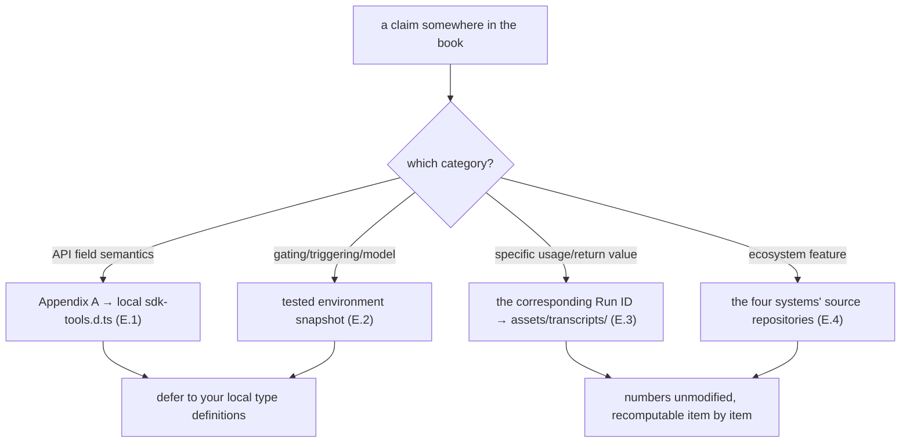

# Appendix E · Sources

> This is a "facts-first" book. This appendix lists, one by one, the **real sources** the whole book rests on, in five categories: ① official type definitions; ② tested environment and version; ③ the book's own real runs (with Run IDs and the mechanisms covered); ④ the source repositories of the four community systems; ⑤ reference readings (noted as "reference, not copied").
>
> Any claim in the book about an API field/behavior/number should trace back to one of this appendix's entries. If something disagrees with your local testing, **defer to your local type definitions and runs** — this is an experimental feature, and fields may evolve across versions.

---

## E.0 Honesty Statement

**This book is an independently written third-party practice manual, not affiliated with Anthropic, nor official documentation.** Its entire content is based on three classes of public/reproducible fact sources:

1. **The public distribution and type definitions** — Claude Code's npm distribution and the tool type definitions it contains;
2. **Product-behavior analysis** — environment variables, tool receipts, and completion notifications observed in real Claude Code sessions;
3. **Real runs** — the **10 completed runs (9 unique Run IDs)** we ran ourselves on this machine ([E.3](#e3-real-run-records-10-completed-runs-9-unique-run-ids-and-the-mechanisms-covered)), whose usage/return values are recorded verbatim in `assets/transcripts/`.

Any script that was **not actually run, serving only as illustration**, is clearly marked "(illustrative, not run)" in the text. Any citation of real data notes the Run ID and provenance. We **do not fabricate** APIs, parameters, or outputs.

---

## E.1 Official Type Definitions (the Authoritative Source for API Fields)

The book's API field semantics ([Appendix A](#/en/app-a)) are compiled against the tool type definitions inside Claude Code's official distribution.

| Source | Use | Coverage |
|---|---|---|
| **`sdk-tools.d.ts`** inside the `@anthropic-ai/claude-code` package | The fields and types of the two interfaces `WorkflowInput` / `WorkflowOutput` | `script` / `name` / `args` / `scriptPath` / `resumeFromRunId`; `status` / `taskId` / `runId` / `transcriptDir` / `scriptPath` / `sessionUrl` / `warning` / `error` |
| **The Workflow tool definition** (the tool's runtime description) | The signatures and semantics of the script-body global hooks, the triggering methods, concurrency and scale constraints | `meta` / `agent()` / `parallel()` / `pipeline()` / `phase()` / `log()` / `args` / `budget` / `workflow()`; the `min(16, cores−2)` concurrency limit, the 1000-agent fallback, one-level nesting |

`sdk-tools.d.ts` is **a type-definition file inside the distribution**, not a file in this book's repository — it ships with your installed Claude Code. To verify, view the file in your local `@anthropic-ai/claude-code` install directory. If fields differ across versions, **your local `sdk-tools.d.ts` is the final authority** ([Appendix A](#/en/app-a)'s ending says the same).

---

## E.2 Tested Environment and Version (the Basis for Behavioral Claims)

The following environment facts were **verified by testing** in real Claude Code sessions (environment-variable existence, version number, model identifier), and are the basis for the book's "gating / triggering / model" claims.

| Fact | Tested value | Nature |
|---|---|---|
| Claude Code version | **v2.1.150** | Taken from the distribution's `package.json` |
| Gating environment variable | `CLAUDE_CODE_WORKFLOWS=1` | Tested session environment variable present |
| Related experimental flag | `CLAUDE_CODE_EXPERIMENTAL_AGENT_TEAMS=1` | Tested environment variable |
| subagent model | `claude-opus-4-7` (set by `CLAUDE_CODE_SUBAGENT_MODEL`) | Tested environment variable |
| Run month | 2026-05 | The transcripts' recording time |
| Return nature | Always async: the receipt arrives first (`taskId`/`runId`), the result via `<task-notification>` | Type definitions + testing |

> These are a **tested snapshot at the time of this book's writing.** Experimental features evolve — if the version has changed by the time you read this, defer to your local testing.

---

## E.3 Real Run Records (10 Completed Runs, 9 Unique Run IDs, and the Mechanisms Covered)

Everywhere the book cites specific usage (`agent_count`/`tool_uses`/`total_tokens`/`duration_ms`) or return values, it comes from the following **10 completed runs** — corresponding to **9 unique Run IDs** (run #4 reuses run #1's Run ID via resume, not counted as a separate ID) — **actually run on this machine.** The raw records are kept in the repository's `assets/transcripts/`, with all numbers unmodified.

> **Evidence screenshot**: a live capture of Claude Code's built-in `/workflows` panel — **10 completed** runs in this session, each line showing agent count / tokens / duration, matching the table below one-for-one. Note `hello-workflow` appears twice: once as a script run (~26k tokens / 10s), once at `0s` — a `resumeFromRunId` **cache hit** (0 tokens, corroborating [Chapter 22 · Resume & Caching](#/en/p4-22)).

| # | Workflow | Run ID | Task ID | Mechanisms covered | Key real data | Record file |
|---|---|---|---|---|---|---|
| 1 | hello-workflow | `wf_dacbd480-d5d` | `wi7ye81mb` | Single agent + `schema`-forced structuring; async receipt | `agent_count=1`, `tokens=26,338`, `5,506ms`; `sum` strictly the number `4` | `primitives.md` |
| 2 | parallel-demo | `wf_52957913-6d2` | `wjqmilq04` | `parallel()` barrier, 3 concurrent, thunk form | `agent_count=3`, `tokens=78,844`, `8,395ms` (≪ 3×5.5s) | `primitives.md` |
| 3 | pipeline-demo | `wf_bf086b98-6ec` | `w60ugs3lk` | `pipeline()` two stages, no barrier between stages, stage signature `(prev, orig)` | `agent_count=6`, `tokens=158,982`, `26,743ms` | `primitives.md` |
| 4 | hello-workflow (resume) | `wf_dacbd480-d5d` (reused) | `w7pxch4w6` | `resumeFromRunId` cache hit, replayability | **`tokens=0`, `tool_uses=0`, `8ms`**, return value identical to the first | `advanced.md` |
| 5 | nested-parent | `wf_85e22b38-126` | `wwxi71uvf` | `workflow()` inline nesting, child agents count toward parent, one-level nesting | `agent_count=1`, `tokens=26,338`, `6,050ms` (sub-flow counts toward parent) | `advanced.md` |
| 6 | frontend-review | `wf_4c5caabb-b73` | `wss21eu0x` | Multi-dimension PR `parallel` review + synthesis; `opts.phase` explicit grouping; dogfooding | `agent_count=4`, `tokens=221,648`, `272,643ms`; 26 findings deduped to 16 | `frontend-review.md` |
| 7 | gcf-slugify | `wf_7472ceac-daa` | `wchxy8dbm` | Generate-Critique-Fix sequential three stages; adversarial critique | `agent_count=3`, `tokens=96,468`, `180,724ms`; caught 10 genuine defects | `gcf-slugify.md` |
| 8 | judge-panel | `wf_f5b69668-b18` | `w7rykwriv` | Judge panel: `parallel` drafting + independent judges, rubric, vote-tallying | `agent_count=5`, `tokens=201,852`, `79,462ms`; judges converged 3:0 | `judge-panel.md` |
| 9 | bug-hunter | `wf_53da9a06-915` | `wsj4ypt3x` | Bug Hunter + adversarial verification: `parallel` inside `pipeline` dispatching 2 "default-falsify" falsifiers, vote-confirmed | `agent_count=11` (1 hunter + 5 bugs×2 falsifiers), `tokens=311,134`, `61,660ms`; 5 seed bugs each passed verification 2:0 | `bug-hunter.md` |
| 10 | deep-research | `wf_6090decc-8a5` | `wva3qtdps` | Deep research (Ch.13): Research (`parallel` orthogonal retrieval) → Verify (independent cross-verification + source quality) → Synthesize (citation-forced); subagents did real web sourcing | `agent_count=4` (2 retrieval + 1 cross-verify + 1 synthesis), `tokens=148,975`, `tool_uses=31`, `298,530ms` (~5 min, includes real web retrieval) | `deep-research.md` |

**Two dogfooding runs deserve special mention**: run #6 (frontend-review) genuinely used Workflow to review the book's own `index.html` and fixed 16 items accordingly; run #7 (gcf-slugify)'s resulting `slugify` experience was used precisely to improve the book's frontend heading-ID generation. These two aren't demos; they're real sources of improvement to the book's frontend.

**Run #8's unexpected gain**: the 3 judges noted in their scoring rationale that they **actually read `docs/en/p2-08` and `assets/_grounding.md` to cross-check the numbers**, verifying item by item before ruling "zero factual errors" — effectively verifying the accuracy of the real data in this book's Chapter p2-08 along the way.

**Run #9's unexpected gain**: adversarial verification not only filters false positives but **conversely corrected the hunter** — `applyDiscount`'s falsifier, while confirming the bug is real, pointed out that the seed comment's reasoning "percent as a string would concatenate" is wrong (`*`/`/` coerce a string to a number; only `+` concatenates). A verifier that merely agrees would miss this; only a "default-falsify, rule refuted when uncertain" verifier would scrutinize it. See [Chapter 15 · Bug Hunter](#/en/p3-15) and [Chapter 17 · Adversarial Verification](#/en/p4-17).

### Companion Real Samples

| Asset | Use | Location |
|---|---|---|
| `buggy-cart.js` | The real hunting target of the **Chapter 15 Bug Hunter** recipe: containing 5 deliberately planted defects (missing validation, off-by-one, missing `await`, `==`, shared-reference mutation) | `assets/samples/buggy-cart.js` |

> Before writing a recipe chapter, read the corresponding transcript record first — it's the sole basis for that chapter's data. More real runs will be appended to `assets/transcripts/` over time.

---

## E.4 The Four Community Systems (the Source Repositories for Ecosystem Borrowing)

Part V "Ecosystem"'s analysis of the four forerunner systems comes from a **genuine reading of their respective source repositories** (rather than secondhand paraphrase). They all were born before native Workflow, **simulating** deterministic orchestration via "prompts + Hooks + state files" — the deterministic skeleton and JSON Schema constraints they lacked are exactly what native Workflow fills in; and the resilience layer they honed (verification gates, persistent loops, disk state, boundary guardrails) is exactly what native Workflow is worth borrowing.

| System | Form | Gems (this book's distillation) | Chapter |
|---|---|---|---|
| **ccg-workflow** (Claude+Codex+Gemini multi-model collaboration) | A prompt state machine + JS Hook + Go binary bridging heterogeneous CLIs | Disk state `task.json` + per-turn Hook breadcrumb injection against context compaction; the Ralph Loop clean-context iteration; file ownership + Layer-based parallelism; Spec Evolution; deadlock detection | [Ch. 23](#/en/p5-23) / [Ch. 24](#/en/p5-24) |
| **superpowers** (obra, a methodology across 7 harnesses) | Pure skill + a SessionStart hook injecting a "behavioral constitution," probabilistic orchestration | A two-stage review loop (spec compliance → code quality, each looping until it passes); a Brainstorming-first hard gate; the TDD Iron Law; Verification-before-completion; structured status returns | [Ch. 23](#/en/p5-23) / [Ch. 24](#/en/p5-24) |
| **oh-my-claudecode (OMC)** | hooks + state files simulating orchestration, no JSON Schema constraint | The `Stop` hook persistent loop ("boulder never stops"); control plane / data plane separation + Artifact handles; declarative-delegation enforcement; echo-guard; PRD-driven + independent reviewer sign-off; 20 roles | [Ch. 23](#/en/p5-23) / [Ch. 24](#/en/p5-24) |
| **oh-my-openagent (OmO)** (built on opencode, not Claude Code) | Tool-layer guardrail throws + system-reminder injection for correction | The planner physically cannot write code (tool-layer throw); Category (semantic intent) delegation rather than by model name; cross-session `boulder.json` + notepad externalized memory | [Ch. 23](#/en/p5-23) / [Ch. 24](#/en/p5-24) |

> For the through-line insight, see [Chapter 23 · Four Systems Compared](#/en/p5-23); for how to rewrite these gems as reusable Workflows with `phase`/`schema`, see [Chapter 24 · The Art of Extraction](#/en/p5-24) and [Chapter 25 · Build Your Own Library](#/en/p5-25).

---

## E.5 Reference Readings (Reference, Not Copied)

The following third-party readings served as **background reference** and **perspective comparison** during writing, helping to understand the feature's design motivation and community perception.

**Strictly distinguish reference from copying.** All of this book's cases, scripts, and data are **original, real output** (see [E.3](#e3-real-run-records-10-completed-runs-9-unique-run-ids-and-the-mechanisms-covered)), with **nothing copied** from any reference material's examples. Reference readings serve only to build background understanding; wherever they conflict with the official type definitions or this book's real runs, **defer to [E.1](#e1-official-type-definitions-the-authoritative-source-for-api-fields)/[E.3](#e3-real-run-records-10-completed-runs-9-unique-run-ids-and-the-mechanisms-covered).**

| Type | Description | How used |
|---|---|---|
| The "AI Meta-Domain" blog (community reading) | An early community reading of and perspective on the Workflow feature | **Reference**: background motivation and terminology understanding; cases are all original, not copied |
| Related explainer videos | The community's explanations of multi-agent orchestration | **Reference**: building intuition; specific numbers defer to this book's real runs |

> The reason they're listed separately and "not copied" is repeatedly stressed: this book's promise is **facts-first + original and real.** Reference material can inspire understanding but cannot replace "running it by hand and recording the real numbers" — the latter is the foundation of every claim in this book.

---

## E.6 How to Trace a Claim (for the Scrupulous Reader)

If you want to verify any number or field in the book, follow this chain:

- **API fields** → [Appendix A](#/en/app-a), with your local `sdk-tools.d.ts` as the final authority.
- **Environment/version** → [E.2](#e2-tested-environment-and-version-the-basis-for-behavioral-claims)'s tested snapshot (experimental features evolve, defer to local).
- **Usage/return values** → follow the Run ID to the transcript file pointed to by [E.3](#e3-real-run-records-10-completed-runs-9-unique-run-ids-and-the-mechanisms-covered); all numbers are kept verbatim and recomputable.
- **Ecosystem gems** → [E.4](#e4-the-four-community-systems-the-source-repositories-for-ecosystem-borrowing)'s source repositories + Part V.

> Companion reading: field quick reference [Appendix A · Full API Reference](#/en/app-a); pitfalls and troubleshooting [Appendix B · Pitfalls & Troubleshooting](#/en/app-b); best practices [Appendix C · Best Practices](#/en/app-c); terms [Appendix D · Glossary](#/en/app-d).

---

> **Acknowledgments and boundaries**: thanks to the authors of the four community systems for their exploration before native Workflow. This book is an independent practice summary standing on their shoulders and the official distribution — all errors are the book author's, and all original real data can be re-checked via `assets/transcripts/`. This is a book that will need updating as the feature evolves; when your local testing disagrees with the book, trust your testing.
