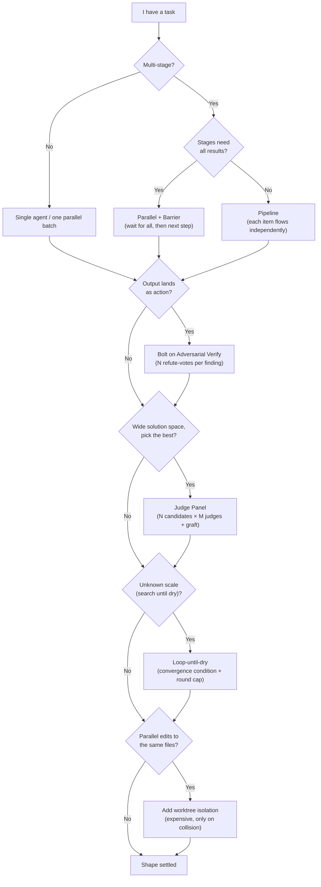

# Appendix F · Pattern Catalog & Scenarios

> This is the book's **one-page master map**: look up the recommended pattern by scenario first, then click into the corresponding chapter to see the real run. The preceding 26 chapters take every primitive and every recipe apart in detail; this appendix **gathers them back into one searchable map** — when you have a task at hand, you needn't page through the whole book: locate the "shape" here first, then follow the link into the body to see that real run.
>
> Every pattern is anchored to one of the book's own chapters, and every "real run" cell is anchored to a real Run ID recorded in `assets/transcripts/` ([Appendix E](#/en/app-e)) — **not a single cell is made up.** Code that is illustrative only and was not actually run is explicitly marked "(illustrative, not run)."

---

## F.0 How to Use This Page

Treat it as a **query entry point**, three ways to look things up:

1. **I have a scenario but don't know which shape to use** → jump to [F.3 Scenario Cheat-Sheet](#f3-scenario-pattern-cheat-sheet), find the closest row by the "Scenario" column, look at "Recommended Pattern" and "Real Run."
2. **I've heard a pattern name and want to know its shape, when to use it, how costly it is** → see [F.1 Six Canonical Patterns](#f1-six-canonical-patterns) or [F.2 Patterns Distilled from the 4 Systems](#f2-original-patterns-distilled-from-the-4-systems).
3. **I'm torn between two shapes** → walk [F.4 The Selection Decision Tree](#f4-the-selection-decision-tree); three or four yes/no's land you on one pattern.

Finally, [F.5 Corner-Case Notes](#f5-corner-case-notes) are four "ignore-them-and-it-really-breaks" red lines — scan them right before delivery.

**Pattern vs recipe vs primitive — a three-layer relationship**: primitives are the **building blocks** like `agent()`/`parallel()`/`pipeline()` ([Chapter 8](#/en/p2-08)); a pattern is a **reusable shape** assembled from blocks (this appendix); a recipe is **one landing** of a pattern on a real task (the chapters of Parts III and IV). This appendix sits in the middle layer, pointing down to primitives and up to recipes.

---

## F.1 Six Canonical Patterns

These six are the skeleton of the vast majority of workflows. They aren't mutually exclusive — real tasks are often stacked, like "Pipeline wrapping adversarial verification" or "Parallel then Pipeline" (see F.3). Learn the shapes first, then talk composition.

| Pattern | One-line shape | When to use | Cost | Chapter |
|---|---|---|---|---|
| **Pipeline** | Each item flows independently through N serial stages; slow items don't block fast ones; the **default shape** for multi-stage | Multi-stage, and stages need not reference each other | Wall clock ≈ the slowest single chain (not the sum of each stage's slowest) | [§8](#/en/p2-08) |
| **Parallel + Barrier** | Run **all** concurrently; the barrier waits for the full batch before the next step | The next step **genuinely needs all results**: dedup / cross-verify / zero-result early-exit | The barrier idles fast tasks waiting on slow ones | [§8](#/en/p2-08) |
| **Adversarial Verify** | Dispatch N independent refuters per finding; a majority refutation kills it (default REFUTED, ≥2/3 voting REAL to pass) | Findings will **land as action** (edit code / send a report) | Each finding × N votes | [§17](#/en/p4-17) |
| **Judge Panel** | N candidates × M judges tallied + synthesis, grafting the runner-up's good ideas | A wide solution space (design / naming / copy / architecture) | N×M agents | [§14](#/en/p3-14) |
| **Loop-until-X** | Rounds unknown in advance; converge by one of **count / budget / dry-streak** | Discovery of unknown scale (bugs / edge cases / omissions) | Depends on rounds to convergence | [§18](#/en/p4-18) |
| **Nested Workflow** | Each item of the parent is itself a whole workflow (parent pipeline, one sub-workflow per item) | Items need an independent multi-step sub-flow inside; **one level only** | Shares the parent's concurrency / budget pool | [§20](#/en/p4-20) |

### One by One

**Pipeline** is the default answer for "multi-stage." The key isn't "serial," it's **no barrier**: item A is in stage 2 while item B is still in stage 1, and they don't wait on each other. So wall clock ≈ the time for the slowest **single chain** to finish, not "the sum of each stage's slowest." The book's `pipeline-demo` (3 items × 2 stages) confirms this structure with `agent_count=6` (Run `wf_bf086b98-6ec`, [Chapter 8](#/en/p2-08)). The stage callback signature is `(prevResult, originalItem, index)` — use it to grab the original input across stages; don't thread original data through the previous stage's return value.

**Parallel + Barrier** is the exact opposite: it **waits for all.** `parallel(thunks)` runs a batch concurrently, and the **barrier** releases only when all complete. The cost is the barrier itself — fast tasks finish then idle, waiting on the slowest. So it's worth it only when "the next step genuinely needs all results to appear together": you need all before dedup, all before cross-verification, all confirmed empty before a zero-result early-exit. The book's `parallel-demo` measured 3 concurrent at 8.4s ≪ 3×5.5s, tokens ≈ 3× (Run `wf_52957913-6d2`).

**Adversarial Verify** solves a plain but fatal problem: a first-draft output almost always has blind spots, and an "agreeable" review won't find them. Adversarial verification dispatches N **independent** refuters per **finding**, with the default stance **REFUTED**, releasing only when ≥2/3 vote REAL. The book's `bug-hunter` dispatched 2 "default-refute" refuters per bug, and 5 seed bugs each passed 2:0 (Run `wf_53da9a06-915`). Its cost is linear amplification: each finding × N votes. But whenever a finding will "land as action" (edit code, send a report, ship), this gate earns its keep.

**Judge Panel** is for wide solution spaces — design proposals, naming, copy, architecture choices, where there's no single correct answer but there is "clearly better." It dispatches N candidates, then asks M **non-communicating** judges to score and tally by a rubric, finally synthesizing and **grafting** the good ideas from runners-up. The book's `judge-panel` had 3 judges converge independently 3:0 (Run `wf_f5b69668-b18`). The cost is N×M agents, so don't be greedy with either candidates or judges.

**Loop-until-X** is for **unknown-scale** discovery: you don't know how many more bugs hide in this code, how many more edge cases this schema misses. It presets no round count, stopping on one of three convergence signals — **count** (enough N gathered), **budget** (`budget` runs dry), or **dry-streak** (k consecutive rounds with no new findings). Always pair the convergence condition **with a round cap** as a double safeguard ([Chapter 18](#/en/p4-18)).

**Nested Workflow** is for when each parent item is itself a whole multi-step flow — a parent `pipeline` iterating a batch of PRs, each PR triggering a full "review sub-workflow." `workflow()` runs another workflow inline, **sharing** the parent's concurrency limit / agent count / abort signal / token budget, and **nesting is one level only**: calling `workflow()` again inside a sub-workflow throws. The book's `nested-parent` measured the child agent counting toward the parent's `agent_count` (Run `wf_85e22b38-126`, [Chapter 20](#/en/p4-20)).

---

## F.2 Original Patterns Distilled from the 4 Systems

[Chapter 23](#/en/p5-23) compares the four precursor systems (ccg-workflow / superpowers / OMC / OmO), and [Chapter 24](#/en/p5-24) covers how to rewrite their essence with `phase`/`schema`. The table below **distills that essence into five directly reusable patterns** — they were all born before native Workflow and **simulated** deterministic orchestration with "prompts + hooks + state files," while native Workflow happens to provide the deterministic skeleton they lacked. These five patterns are the finished product of "transplanting their resilience layer onto native primitives."

| Pattern | From | Shape | When to use | Chapter |
|---|---|---|---|---|
| **Verification-Gate Loop** | superpowers | `pipeline(tasks, specReview, qualityReview)` + a gating schema with a pass field + a bounded `gatedFix` loop | Output must clear a "spec + quality" double gate | [§24](#/en/p5-24) |
| **Persistent Loop** | OMC | `while(!accepted)` + an acceptance schema + a `hitCeiling` honest cap | Won't quit until the bar is met | [§18](#/en/p4-18) / [§24](#/en/p5-24) |
| **State Handle** | ccg | `STATE_SCHEMA` passed down between pipeline stages, replacing a disk ledger | Carry state across stages, resist context compaction | [§24](#/en/p5-24) |
| **Role-Separated Guardrail** | OmO | a planner (schema `additionalProperties:false`, produces only a plan object) + an independent executor stage | Make the planner **structurally** unable to edit code | [§24](#/en/p5-24) |
| **Category→Model** | OmO | `MODEL_BY_CATEGORY[item.category]` → `agent({ model })` | Dispatch by task **semantics**, not model name | [§24](#/en/p5-24) |

### Distillation Notes

**Verification-Gate Loop** comes from superpowers' "two-stage review" — output clears spec compliance first, then code quality, each looping until it passes. In native Workflow it lands as a `pipeline`: the first stage does the work, the next two stages are specReview and qualityReview, each review returning a **gating schema with a `pass` field**; failure enters a **bounded** `gatedFix` loop (with a round cap). The schema turns "passed or not" from free text into a programmable boolean — exactly the part the original system relied on by prompt convention, and that native Workflow can **enforce**.

**Persistent Loop** comes from OMC's "boulder never stops" — the Stop hook makes "whether stopping is allowed" programmable. The native rewrite is a `while (!accepted)` with an acceptance schema; but be sure to add a `hitCeiling` field as an **honest cap**: even short of the bar, stop honestly after N rounds and report truthfully rather than grinding forever. Its difference from Loop-until-X is intent: Loop-until-X is "search until dry," Persistent Loop is "fix until the bar is met."

**State Handle** comes from ccg's `task.json` + per-round hook-injected breadcrumbs — using disk state to resist context compaction. But the script body has **no file system**, so the native approach makes the state a `STATE_SCHEMA` object **passed down** between pipeline stages (previous stage returns it, next stage catches it), with a schema keeping its structure from drifting. This swaps the "disk ledger" for a "typed in-memory handle."

**Role-Separated Guardrail** comes from OmO's "tool-layer throw" — making the planner **physically** unable to write code. Native has no tool-layer throw, but a more elegant equivalent: the planner stage's schema sets `additionalProperties:false` and declares only plan fields, so the planner **structurally** can only produce a plan object and nothing else; editing code goes to a fully independent executor stage. The constraint shifts from "a prompt request" to "schema enforcement."

**Category→Model** comes from OmO's Category mechanism — routing by a task's **semantic intent** (not model name). The native approach builds a `MODEL_BY_CATEGORY` table, looks up the model by `item.category`, then `agent(prompt, { model })`. The benefit: the call site only cares "what kind of task this is," model selection is centralized in one editable place, and simple tasks naturally fall to `haiku`.

The full runnable rewrites of these five patterns are in [Chapter 24 · The Art of Extraction](#/en/p5-24); assembling them into your own library is in [Chapter 25](#/en/p5-25). This appendix gives only the "shape notes."

---

## F.3 Scenario → Pattern Cheat-Sheet

This is the appendix's **core**: on the left is a real scenario you might hit; on the right are the recommended pattern, the key design point, and — whenever the book actually ran it — that run's Run ID and chapter. **Every cell with a Run ID can be re-checked verbatim in `assets/transcripts/`.**

| Scenario | Recommended Pattern | Key Design | Real Run / Chapter |
|---|---|---|---|
| Sharded multi-dimension code review | Pipeline + Adversarial Verify | Each dimension is an independent stage → each finding refuted by multiple votes | [§10](#/en/p3-10) / [§17](#/en/p4-17) |
| Multi-dimension PR Review | Pipeline | Dogfood-reviewed the book's frontend, **26→16 issues** | `wf_4c5caabb-b73` · [§11](#/en/p3-11) |
| Generate-Critique-Fix (GCF) | Bounded Loop + Adversarial | Adversarial Critique caught **10 defects** in `slugify` | `wf_7472ceac-daa` · [§12](#/en/p3-12) |
| Cross-source deep research | Parallel + Barrier (+Pipeline) | A barrier is **required** to dedup before writing | `wf_6090decc-8a5` · [§13](#/en/p3-13) |
| Design / proposal exploration | Judge Panel | 4 angles × judges + graft; **3:0** convergence | `wf_f5b69668-b18` · [§14](#/en/p3-14) |
| Bug / vulnerability scan | Loop-until-dry + Adversarial | finder self-respawns → verifier gatekeeps; **5/5** confirmed | `wf_53da9a06-915` · [§15](#/en/p3-15) |
| Docs / migration sweep | Pipeline | Read-only analysis vs real rewrite **split into two stages** | [§16](#/en/p3-16) |
| Cross-N-file large refactor | Pipeline + Worktree isolation | plan→impl→test independent per file, worktree prevents trampling (measured **distinctRoots=3**) | `wf_3b0677d8-40f` · [§19](#/en/p4-19) |
| Cross-model comparison | Parallel + Barrier | Same prompt → N models → single judge | [§14](#/en/p3-14) / [§23](#/en/p5-23) |
| Error-resilience handling | Semantic awareness (not a pattern) | A **synchronous throw in parallel crashes the workflow**; put risky logic inside `agent()`; use `.filter(Boolean)` | `wf_ed5e87f3-435` · [§8.8](#/en/p2-08) |
| Budget scaling | Loop-until-budget | guard on `budget.total`, else `remaining()=Infinity` runs the full 1000; FLEET scales by budget | `wf_fd09a6ed-38a` · [§9](#/en/p2-09) / [§21](#/en/p4-21) |
| Nested PR batch | Nested: `pipeline(prs, pr => workflow(...))` | Parent pipeline, one sub-workflow per PR | [§20](#/en/p4-20) |

### A Few Key Reads

**Why deep research must use a barrier, while sharded review uses a pipeline** — this is the pair beginners most easily confuse. Deep research's "synthesize" step must **see all** retrieval results to dedup and cross-reference; missing one risks an omission, so the Research phase uses a `parallel` barrier to wait for all, then enters Synthesize (Run `wf_6090decc-8a5`, [Chapter 13](#/en/p3-13)). Sharded review is the opposite: finishing the a11y dimension needn't wait for the perf dimension; each dimension's findings flow onward into adversarial verification on their own, so the barrier-free pipeline is faster. **The criterion is one sentence: does the next step need to see all of them?**

**Why GCF uses a "bounded Loop" rather than a single adversarial pass** — in that `slugify` run, adversarial Critique caught 10 defects in one round (Run `wf_7472ceac-daa`), but after fixing you have to re-verify, possibly introducing new problems, so wrap a **bounded** loop (with a round cap) to iterate "critique → fix" to clean. This is the lightweight version of F.2's "Persistent Loop."

**Why "error-resilience handling" is marked "not a pattern"** — it isn't an orchestration shape, it's a **semantic awareness** you must internalize: a **synchronous throw in a `parallel()` thunk body crashes the whole workflow** (measured `wf_ed5e87f3-435`, status=failed, 0 tokens, a 26ms instant exit); only an async reject / an error inside `agent()` gets gathered into a `null` at that position. So put risky logic inside an awaited `agent()`, and always `.filter(Boolean)` before use. See [Section 8.8](#/en/p2-08).

**The budget-scaling pitfall** — loop-until-budget must `guard on budget.total`. Measured `wf_fd09a6ed-38a`: with no `+Nk` target set, `budget.total===null` and `remaining()===Infinity`, so the `while(budget.total && ...)` guard **ran 0 rounds**; written as `while(budget.remaining() > N)` (omitting `budget.total &&`), it would run all the way to the 1000-agent fallback cap before stopping. FLEET (dynamic team size) also scales by the same `budget` ([Chapter 21](#/en/p4-21)).

---

## F.4 The Selection Decision Tree

Unsure which shape to use? Walk from the top down; three or four yes/no's land you on one pattern. The add-on items (adversarial verification, worktree) are **bolted on** atop the main shape, not replacements.

How to read it: the **trunk** (multi-stage? → do stages need all results?) first settles the **base**, Pipeline or Parallel+Barrier; the four checks after that (lands as action? wide space? unknown scale? edits the same files?) are all **stackable switches** — if met, bolt on the corresponding pattern; if not, skip it. One real task may light up all three lamps at once — "Pipeline + adversarial verification + worktree" (exactly F.3's "cross-N-file large refactor" row).

---

## F.5 Corner-Case Notes

Four "ignore-them-and-it-really-breaks / really-wastes" red lines, all backed by measurement. Scan them right before delivery.

**① A synchronous throw in a `parallel()` thunk body crashes the whole workflow.** Measured `wf_ed5e87f3-435` (status=failed), 0 tokens, a 26ms instant exit — a synchronous throw isn't swallowed by `parallel()`, it propagates up and fails the whole workflow. Only an **async reject / an error inside `agent()`** becomes a `null` at that position. Put risky logic inside an awaited `agent()`, and always `.filter(Boolean)` before use ([Section 8.8](#/en/p2-08)).

**② A budget loop that doesn't guard `budget.total` runs all the way to the 1000-agent fallback.** Measured `wf_fd09a6ed-38a`: with no target set, `budget.total===null` and `remaining()===Infinity`, so the `while(budget.total && ...)` guard ran **0 rounds**; omitting `budget.total &&` would run the full 1000-agent cap before stopping ([Chapter 21](#/en/p4-21)).

**③ `meta` must be a pure literal; the script forbids `Date.now()` / `Math.random()` / arg-less `new Date()`.** The former breaks the pre-run static read (the workflow won't launch), the latter breaks replayability and invalidates resume. Pass timestamps via `args` or stamp them after the fact, and get randomness by varying the prompt with the agent's index ([Appendix C · C.7](#/en/app-c)).

**④ worktree is expensive (about 200–500ms startup + disk / agent overhead); use it only when parallel file edits would collide.** Read-only analysis, pure review, and each writing its own disjoint file all **don't need** it. Measured `wf_3b0677d8-40f` got `distinctRoots=3`, `fullyIsolated:true` — genuinely physical isolation, but the cost isn't low, and it auto-cleans only when there are no changes ([Chapter 19](#/en/p4-19)).

---

> This page is the map; the body is the terrain. Every pattern and every number traces back, via its link, to its source chapter and the real record in `assets/transcripts/` — if your local testing disagrees with the book, **trust your testing.**

> Continue reading: return to [Preface: Between Warp and Weft](#/en/00-preface) to re-read the book's through-line, or pick the F.3 scenario closest to your task and go straight into the body.
