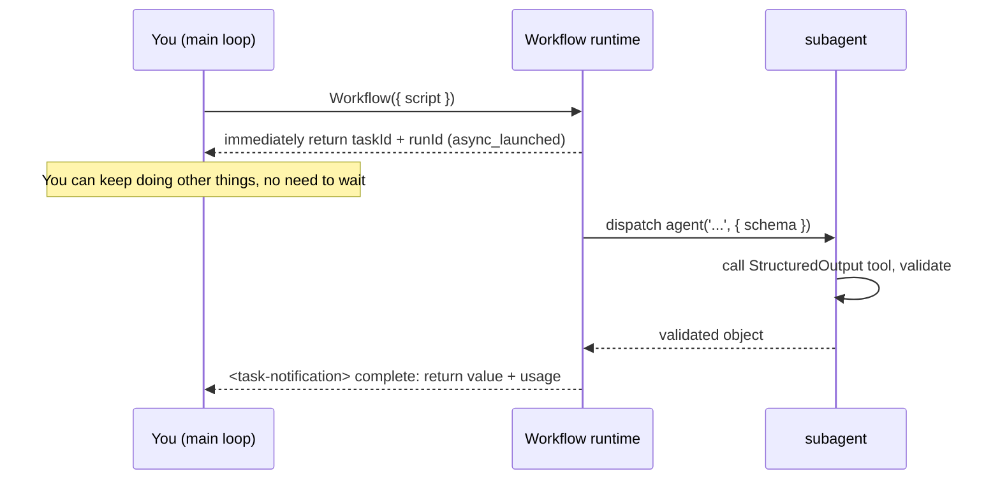

# Chapter 01 · What Workflow Is

> In one sentence: **Workflow is a built-in tool in Claude Code that lets you use a single pure-JavaScript script to deterministically orchestrate any number of subagents.**
>
> This chapter is in no rush to write complex scripts. First let's thoroughly clarify "what on earth this thing is, what happens at runtime, and why it's worth learning specifically" — this is the bedrock for all the recipes that follow.

---

## 1.1 Starting from a Real Run

The fastest way to understand a system is to see it **actually run.** The script below is the first Workflow this book executed in a real Claude Code session:

```javascript
export const meta = {
  name: 'hello-workflow',
  description: 'Smoke test: one subagent returns schema-constrained structured output',
  phases: [{ title: 'Greet', detail: 'One subagent confirms the runtime' }],
}

phase('Greet')
const r = await agent(
  'You are a smoke test for the Claude Code Workflow runtime. Return a one-sentence ' +
  'confirmation message, the integer value of 2+2, and a boolean confirming you ran ' +
  'as a workflow subagent.',
  {
    label: 'smoke',
    schema: {
      type: 'object',
      properties: {
        message: { type: 'string' },
        sum: { type: 'number' },
        runtimeConfirmed: { type: 'boolean' },
      },
      required: ['message', 'sum', 'runtimeConfirmed'],
    },
  }
)
log(`smoke result: ${JSON.stringify(r)}`)
return r
```

Handed to the Workflow tool to execute, the **real** return value is:

```json
{
  "message": "The Claude Code Workflow runtime smoke test executed successfully as a workflow subagent.",
  "sum": 4,
  "runtimeConfirmed": true
}
```

The runtime also came with a real usage report:

```text
agent_count = 1   tool_uses = 1   total_tokens = 26338   duration_ms = 5506
```

> Source: the raw record of this run is in the repository's `assets/transcripts/primitives.md` (Run ID `wf_dacbd480-d5d`). Every "real run" in this book can be traced this way.

In just over twenty lines, it already touches all of Workflow's essentials. Let's take it apart one by one.

---

## 1.2 Dissecting a Script: Warp and Weft

Back to the "Loom" metaphor. A Workflow script is made of two parts:

### The Warp: `meta` and `phase` — the taut structure

A script **must** begin with `export const meta = {…}`, and it **must be a pure literal** — no variables, function calls, spread operators, or template interpolation. This is a hard constraint; getting it wrong gets the script rejected by the runtime.

```javascript
export const meta = {
  name: 'hello-workflow',                       // required: workflow identifier
  description: 'Smoke test: ...',               // required: one-line description, shown in the permission dialog
  phases: [{ title: 'Greet', detail: '...' }],  // optional: phase declarations, driving the progress display
}
```

Why must `meta` be a pure literal? Because the runtime needs to **statically read it before actually executing the script** — to tell you in the permission dialog "what this workflow is called, what it does, how many phases it has." If `meta` had a `Date.now()` or some variable stuffed in, the runtime simply couldn't evaluate it in the static-parsing phase.

`meta`'s fields (per the official type definitions and tool description):

| Field | Required | Role |
|---|---|---|
| `name` | Yes | Workflow name |
| `description` | Yes | One-line description, shown in the permission confirmation dialog |
| `whenToUse` | No | Use-case description, shown in the workflow list |
| `phases` | No | Phase array, each item `{ title, detail?, model? }`, driving the progress-tree grouping |

`phase('Greet')`, then, **switches the current phase** in the script body — all `agent()` calls after it group under "Greet" in the progress display. With the warp tensioned, the weft knows where to thread.

### The Weft: `agent()` and other hooks — the shuttling execution

The script body runs in an `async` context, so you can `await` directly. The runtime injects a set of **global functions** into the script (no import needed):

| Hook | Role |
|---|---|
| `agent(prompt, opts?)` | Dispatch a subagent, return its output |
| `parallel(thunks)` | Run a set of tasks concurrently, **barrier**: wait for all |
| `pipeline(items, ...stages)` | Have each item flow independently through stages, **no barrier** |
| `phase(title)` | Switch the current phase |
| `log(message)` | Output a line of progress info to the user |
| `workflow(name, args?)` | Inline-call another workflow (a sub-process) |
| `args` | The arguments object passed in by the caller |
| `budget` | The token budget object for this turn |

`hello-workflow` uses only the most basic `agent()`: dispatch a subagent, wait for it to return, get the result.

<div class="callout warn">

**Scripts can't use `Date.now()`, `Math.random()`, or arg-less `new Date()`** — they throw. The reason is revealed in §1.6 "Resume": these three break the premise that "the same script necessarily produces the same execution," and thereby break resume. Need a timestamp? Pass it in via `args`. Need randomness? Vary the prompt using the agent's index.

</div>

---

## 1.3 `agent()`: The Birth of a Subagent

The core of `hello-workflow` is this line:

```javascript
const r = await agent(prompt, { label: 'smoke', schema: {...} })
```

It does one thing: **dispatch a subagent to execute `prompt`, and take its output as the return value.**

There are two key designs here that determine the essential difference between Workflow and "manually spinning up subtasks":

**First: the subagent is told "your final output is the return value."** An ordinary subtask returns a piece of writing for a human; a Workflow subagent knows its output is to be **consumed by a program**, so it returns **raw data**, not pleasantries.

**Second: `schema` turns "raw data" into "structured data."** When you pass `schema` (a JSON Schema), the runtime forces this subagent to call an internal `StructuredOutput` tool, and **validates at the tool-call layer** whether the return value matches the schema. Doesn't match? The model is asked to **retry** until it conforms. So when `agent()` carries a schema, it returns a **validated object** — you don't need to write any parsing or error-handling code.

Look back at the real output: we asked for `sum` (2+2) and got the number `4`, **not the string `"4"`** — because the schema declared `sum: { type: 'number' }`, and the validation layer ensured the type. This is the power of "structured output," which Chapter 07 dedicates itself to.

> **What if you don't carry a schema?** Per the tool definition, without a `schema`, `agent()` returns the subagent's final text (a string). Only with a schema does it return a validated object.

`agent()`'s common options (full list in Chapter 06 and Appendix A):

```javascript
await agent(prompt, {
  label: 'smoke',          // the label in the progress display, auto-numbered by default
  schema: {...},           // JSON Schema: force structured output
  phase: 'Greet',          // explicitly group into a phase (especially important inside pipeline/parallel)
  model: 'haiku',          // override this agent's model; omit to inherit the main loop's
  isolation: 'worktree',   // run in an independent git worktree (use when parallel file edits collide)
  agentType: 'Explore',    // use a custom subagent type instead of the default
})
```

---

## 1.4 What Happens at Runtime: Async, taskId, Background

This is the most easily misunderstood point: **the Workflow tool does not "return when it finishes" — it returns immediately.**

Per the official type definitions `sdk-tools.d.ts`, `WorkflowOutput`'s `status` has only two values: `"async_launched"` or `"remote_launched"`. In other words, **the instant you call the Workflow tool, it launches in the background and immediately hands you back a handle:**

```text
Workflow launched in background. Task ID: wi7ye81mb
Run ID: wf_dacbd480-d5d
Script file: .../workflows/scripts/hello-workflow-wf_dacbd480-d5d.js
You will be notified when it completes. Use /workflows to watch live progress.
```

A few **real** pieces of info worth remembering:

- **`Task ID`**: the ID of this background task.
- **`Run ID`** (like `wf_...`): this run's identifier, needed for resume (see §1.6).
- **Script on-disk path**: every time you call, the runtime **writes your script to disk.** Want to iterate? Just `Write`/`Edit` that file and re-invoke with `{ scriptPath: ... }`, no need to resend the whole script.
- **`/workflows`**: a slash command to watch the progress tree live.

When the workflow actually finishes, you receive a **completion notification** (`<task-notification>`) carrying the final return value and usage statistics. `hello-workflow`'s completion notification is exactly the JSON from §1.1 plus `agent_count=1 … duration_ms=5506`.



<div class="callout tip">

**What does this "async + background" design mean?** You can launch several workflows at once to run in parallel, continue with other work yourself, and each notifies you when done. The rest of this book makes heavy use of this. But also remember: because it's async, **the Workflow tool's return value is not the workflow's result**, but a "launched" receipt — the real result is in the completion notification.

</div>

---

## 1.5 How to Trigger a Workflow

There are two paths:

1. **The keyword `ultrawork`.** When your message contains `ultrawork`, Claude Code receives a system prompt making clear "the user has chosen multi-agent orchestration," and is thereby authorized to call the Workflow tool. This is also why the community nicknamed this feature "ultrawork."
2. **Calling the Workflow tool directly.** When the user explicitly asks to "run a workflow / orchestrate with multiple agents / fan out agents," or calls a skill/slash command that internally triggers it, or asks to run a named workflow.

Either way, the prerequisite is that this feature is **explicitly enabled.**

### The feature flag: `CLAUDE_CODE_WORKFLOWS`

Workflow is an **opt-in** experimental feature, gated by the environment variable `CLAUDE_CODE_WORKFLOWS`. In the session environment of this book's writing, this variable **does exist and equals `1`** (confirmed by testing):

```text
CLAUDE_CODE_WORKFLOWS = 1
```

The usual ways to enable it:

```bash
# Way one: set at launch (effective for the current session)
CLAUDE_CODE_WORKFLOWS=1 claude

# Way two: write into the env section of ~/.claude/settings.json (persistent)
{
  "env": { "CLAUDE_CODE_WORKFLOWS": "1" }
}
```

<div class="callout warn">

**Why off by default?** Because one Workflow may fan out dozens of subagents and consume a lot of tokens. Putting it behind a flag is a kind of "you must know what you're doing" protection. This is also the discipline the tool definition repeatedly stresses: **only call Workflow when the user has explicitly chosen multi-agent orchestration** — don't launch it on your own just because "this task seems like it could benefit from parallelism."

</div>

---

## 1.6 Three Runtime Features That Make It "Stand Out"

Beyond "deterministic + structured," Workflow has three engineering-critical features that form its confidence to be "reusable, testable, shareable."

### Concurrency limit: auto-throttled, but you needn't worry

Concurrent `agent()` calls are limited within each workflow to **`min(16, CPU cores − 2)`** running at once; calls beyond that queue up and run when a slot opens. So you **can** pass `parallel()` / `pipeline()` 100 items and they'll all complete — only about 10 run at any instant. There's also a global fallback: the total agent count within a single workflow's lifecycle is capped at **1000**, to prevent runaway loops.

### Resume: the same script, second-level cache hits

Remember the "no `Date.now()`" prohibition from §1.2? Now the reason is revealed. Workflow supports **resume**: re-invoke with `{ scriptPath, resumeFromRunId }`, and **unchanged `agent()` calls return cached results directly** (in seconds); only the edited calls, and those after them, re-run for real.

> "The same script + the same args → 100% cache hit." This requires the script's execution to be **replayable.** `Date.now()` / `Math.random()` produce different results each time, breaking replayability, so they're forbidden. Need a timestamp? Stamp it outside after the workflow finishes, or pass it in via `args`.

This feature is enormously valuable when "iterating a long pipeline": you changed step 8, and the expensive results of the first 7 steps are reused directly, no need to re-run from scratch. Chapter 22 details it.

### The script is a file: iterable, savable, shareable

Every call persists the script to a `.js` file under the session directory. This brings two benefits: one is **iteration** (edit the file + re-run with `scriptPath`); the other is **settling** — you can file a validated workflow script into `.claude/workflows/` and later reuse it like a named command with `{ name: 'my-workflow' }`. This is precisely the technical basis of Part V, "Build Your Own Library."

---

## 1.7 What It Isn't: Drawing the Boundaries First

Beginners most easily conflate Workflow with Claude Code's other extension mechanisms. Let's quickly draw the lines here; Chapter 03 does the full "positioning matrix" comparison.

| It **isn't** | The difference |
|---|---|
| MCP | MCP is a protocol connecting **external tools/data sources**; Workflow is an engine **orchestrating internal subagents.** |
| Skills | Skills are on-demand-injected **prompt knowledge packs** (changing how the agent "thinks"); Workflow is **deterministic control flow** (deciding the order in which the agent "acts"). |
| Subagents | A single `agent()` does dispatch a subagent; but Workflow's value is in using **code** to **orchestrate** many subagents — loop, concurrency, pipeline, verification. |
| Agent Teams | Agent Teams (`CLAUDE_CODE_EXPERIMENTAL_AGENT_TEAMS`) is a **stateful, mutually communicating**, long-term collaborating team; Workflow is a **stateless, deterministic, one-off** pipeline script. The two solve different problems. |

The boundary in one sentence: **when you can draw the task as a flowchart of "what first, what next, what in parallel," use Workflow; when the task is open-ended dialogue requiring improvisation, Workflow is not the best choice.**

---

## 1.8 Chapter Summary

- Workflow is a built-in Claude Code tool that uses a **pure-JavaScript script** to deterministically orchestrate subagents, gated by `CLAUDE_CODE_WORKFLOWS=1`, triggered by the `ultrawork` keyword or a direct call.
- A script = **warp** (`meta` pure literal + `phase`) + **weft** (`agent` / `parallel` / `pipeline` / `log` / `workflow`).
- `agent(prompt, { schema })` dispatches a subagent and returns a **validated structured object**; a schema mismatch triggers an automatic retry.
- The Workflow tool is **async**: it returns `taskId` / `runId` immediately, the result is in the completion notification; watch live progress with `/workflows`.
- Three engineering features: **auto-throttled concurrency** (≤16/workflow, total ≤1000), **resume** (hence `Date.now`/`Math.random` are forbidden), **the script is a file** (iterable, settleable into a named workflow).

In the next chapter, we switch perspective: setting the API aside, we talk about **why** — before Workflow existed, how did people manually orchestrate multiple agents, and what potholes did they hit — to understand what "deterministic orchestration" really solves.

> Continue reading: [Chapter 02 · Why Deterministic Orchestration](#/en/p1-02)
