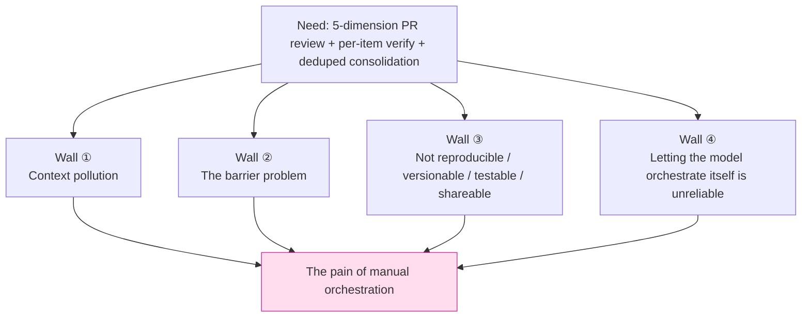
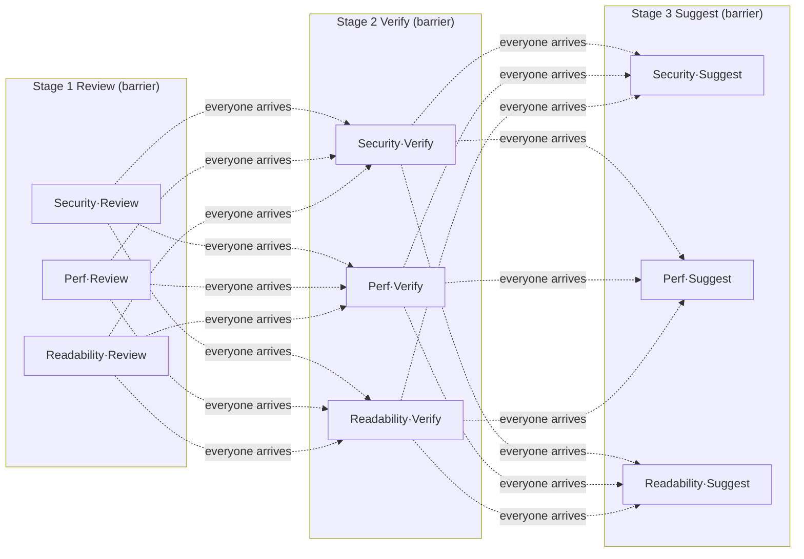
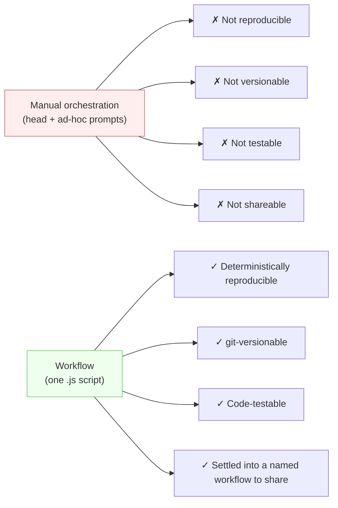
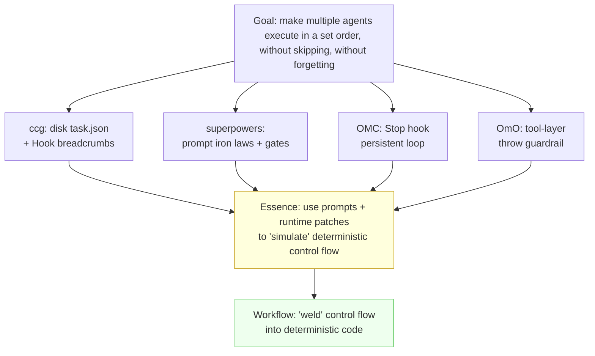

# Chapter 02 · Why Deterministic Orchestration

> In the last chapter we nailed down *what* Workflow is: a single pure-JavaScript script that deterministically orchestrates any number of subagents. This chapter we step back and ask a more fundamental question — **before Workflow existed, how did people orchestrate multiple agents?**
>
> The answer: with prompts, with runtime patches, with state written to disk while "praying" the model remembers. These approaches are clever, and they hit a field full of potholes. Only by prying each pothole open, one at a time, will you really see that "deterministic orchestration" isn't a flashy new toy — it's a cure for a class of **real pain**.

---

## 2.1 A Deceptively Simple Requirement, and Its Four Ways to Die

Let's first set up a concrete need that everyone has run into; the whole chapter revolves around it:

> **"Review this PR along five dimensions — security, performance, readability, test coverage, architecture — find the problems in each, then adversarially double-check each one, and finally consolidate it all into a deduplicated report."**

This requirement is not the least bit exotic. Its shape is crystal clear: **fan out five parallel reviews → each produces a batch of findings → each finding gets a fresh agent to verify whether it's real → finally gather and deduplicate.** Sketch it as a diagram and you're done in three seconds.

But in the era before deterministic orchestration, getting one Claude main loop + a pile of subtasks (Task / subagent) to pull this off beautifully means slamming into four walls in a row. Let's hit them one by one.



---

## 2.2 Wall ①: Context Pollution — Your Reasoning Budget Is Being Blown Out by Raw Data

### The lesion: every subtask's raw result ends up piled back into the main loop

The classic way to manually orchestrate multiple agents goes like this: the main loop (the Claude you're talking to) spins up five subtasks (via the Task tool, or just asks five times in sequence), each reviews one dimension and **returns its review results to the main loop**, which then reads the five reports, consolidates, and deduplicates.

Sounds perfectly natural. The problem is right in that step — "**return the results to the main loop**."

What a subtask returns is not a sentence but **a big block of raw material** — each dimension may list a dozen findings, each with code snippets, line numbers, reproduction paths, and fix suggestions. Five dimensions together easily run to thousands or tens of thousands of tokens. These tokens **all enter the main loop's context window**, and once they're in, they keep eating the reasoning budget for the **entire remaining duration of the session**.

<div class="callout warn">

**The core mechanism: every byte that enters the context keeps "paying" for all the remaining reasoning of this turn.** It isn't read once and tossed; it hangs there as "history," re-scanned by attention for every new token generated. Making the main loop read back five verbose review texts means that during the part that actually takes thought — "consolidate + deduplicate" — you're force-feeding it thousands of tokens of noise, crowding out the capacity it should be using to reason.

</div>

This is **context pollution**: intermediate products that could have stayed "on the subtask's side" get dumped wholesale back into the "main brain." The main loop's job is high-level decisions (which findings are duplicates? which are most severe? how should the report be organized?), yet it's forced to first digest a heap of details it doesn't need to remember word-for-word.

### The community's response: "externalize" the raw data, give the main loop only a handle

How real is this wall? Real enough that four mainstream community systems independently invented the same class of patch — **control plane / data plane separation.**

> One of **oh-my-claudecode (OMC)**'s gems is exactly "control plane / data plane separation + Artifact handles": a subtask's bulk output doesn't flow straight back into the main loop; it lands in a "data plane" (a disk artifact), and the main loop gets only a **handle** (a reference, a path), fetching it on demand when it's needed.
>
> — Per this book's genuine reading of OMC's source code (see `_grounding.md` section D)

In other words, the community figured out long ago that you "don't stuff raw data back into the main brain," and built a "handle + externalized storage" mechanism for it. But note: **this leans on runtime conventions and disk to manually simulate something that should be intrinsic** — a subtask's output should stay on the subtask's side, and the orchestration logic should decide which parts, when, and at what granularity to report upward.

### How Workflow cures it: outputs don't enter the main loop by default

Workflow makes this the **default behavior**. Look back at `agent()` from Chapter 01:

```javascript
const findings = await agent(reviewPrompt, { schema: FINDINGS })
```

The subagent this `agent()` dispatches keeps its output (that big batch of structured findings) **inside the Workflow runtime, as the JavaScript variable `findings`** — it does **not** automatically flood back into your (the main loop's) conversation context. Whether to show it to you, and which part, is decided by **the code in the script**:

```javascript
// Five-dimension parallel review: five sets of raw findings stay in runtime variables
const reviews = await parallel(
  DIMENSIONS.map(d => () => agent(d.prompt, { schema: FINDINGS }))
)

// Per-item adversarial verification: also flows within the runtime, never through the main loop
const verified = await pipeline(
  reviews.flatMap(r => r.findings),
  f => agent(`Adversarially verify this finding: ${f.title}`, { schema: VERDICT })
)

// Only this final "deduplicated consolidation" — the distilled result — is handed back to you as the return value
return dedupe(verified.filter(v => v.real))
```

The thousands of tokens of raw material flowing through the whole pipeline **never once crowd the main loop's reasoning budget**. The main loop ends up with just one clean summary. This is exactly the effect OMC and friends fight for with "Artifact handles" — and in Workflow it's a **natural consequence at the language level**: intermediate variables were never in the conversation context to begin with.

<div class="callout tip">

**Remember Wall ① in one line:** manual orchestration pours the "data plane" into the "control plane"; deterministic orchestration keeps data in code variables and hands back only the conclusion to the human. Chapter 10, "Sharded Code Review," will quantify this contrast right down to the token.

</div>

---

## 2.3 Wall ②: The Barrier Problem — You're Standing and Waiting for Everyone Because of "the Slowest One"

### The lesion: manual parallelism is essentially "everyone must arrive before the next step"

Suppose you want to parallelize: review five dimensions at once. How do you do it manually?

The most common way is to launch several Task subtasks in a single message, then… **wait.** You wait for all five to come back before you can move on to "consolidate." Logically this is a **barrier**: all parallel branches must rendezvous at the barrier before continuing.

The barrier itself isn't wrong — "consolidate" really does need all five results present. The real problem: **when your process has more than one barrier, manual orchestration forces "everyone waits" at every barrier, even when it needn't.**

Upgrade the requirement to see this wall clearly:

> Five dimensions, and **every dimension** must go through three steps: "review → verify → fix suggestions."

The person orchestrating by hand usually lays it out in their head like this:

1. Five dimensions review **together** → barrier: wait for all five reviews;
2. Five dimensions verify **together** → barrier: wait for all five verifications;
3. Five dimensions give fix suggestions **together** → barrier: wait for all five suggestions.



Here's the catch: **the "readability" dimension's review might finish in 3 seconds, but it must stand at the barrier, waiting out the slowest "security" dimension's 15-second review before it can move to verification.** "Readability" could go straight to its own verification, yet an unnecessary barrier holds it back. At every barrier you pay for "the slowest branch of that stage" — and the total time is **the sum of each stage's slowest value.**

### Data: the barrier is a real, measurable wall-clock cost

This is not theory. The `parallel-demo` this book tested is a pure barrier:

| Workflow | agent_count | total_tokens | duration_ms | Meaning |
|---|---|---|---|---|
| hello (single agent) | 1 | 26,338 | **5,506** | One agent round-trip ≈ 5.5s |
| parallel (3 concurrent, barrier) | 3 | 78,844 | **8,395** | 3 concurrent, wall clock 8.4s |

> Data source: `assets/transcripts/primitives.md`, Run ID `wf_dacbd480-d5d` (hello) and `wf_52957913-6d2` (parallel). Tested in the same session.

These two rows give you two facts:

1. **Concurrency is real.** Three agents run serially would be ≈ 3×5.5 = 16.5s; the measured time is only **8.4s** — concurrency squeezed the three agents down to ≈ "the slowest one." That's the value of `parallel()`.
2. **But the barrier is real too.** Those 8.4s of total wall clock equal "the slowest agent's duration" — agents that finished earlier must stop at the barrier and wait for their slowest peer. (Note: the per-agent breakdown was not separately recorded for this run; this serves only as a mechanism illustration, while the 8.4s total wall clock is measured.) If a second and third barrier follow, this "wait for the slowest" **accumulates stage by stage.**

### How Workflow cures it: `pipeline` lets each item "move forward on its own"

Workflow gives you two weapons, and the difference is exactly "barrier or not":

- **`parallel(thunks)`**: concurrency + **barrier**. Returns only when all complete. **Use it only when you genuinely need all results together** (e.g., that final consolidation).
- **`pipeline(items, stage1, stage2, ...)`**: each item flows **independently** through all stages, with **no barrier between stages.** "Readability" finishes its review in 3s and moves straight into its own verification, no need to wait for "security."

> Per the official type definitions (`_grounding.md` section B): for `pipeline`, "wall clock ≈ the slowest **single chain**, not the sum of each stage's slowest value." This is precisely the key to eliminating "stage-by-stage barrier accumulation."

Rewrite that "five dimensions × three steps" requirement as a pipeline, and the wall clock drops from "the sum of each stage's slowest" to "the slowest single complete chain":

```javascript
// Each dimension flows independently through Review → Verify → Suggest, without waiting on the others
const results = await pipeline(
  DIMENSIONS,
  d        => agent(d.reviewPrompt,                 { schema: FINDINGS, phase: 'Review' }),
  (rev, d) => agent(`Verify: ${d.name}`,            { schema: VERDICT,  phase: 'Verify' }),
  (ver, d) => agent(`Give fix suggestions: ${d.name}`, { schema: FIXES, phase: 'Suggest' })
)
```

`pipeline`'s real run is equally documented:

| Workflow | agent_count | duration_ms | Confirmation |
|---|---|---|---|
| pipeline (3 items × 2 stages) | **6** | 26,743 | 3×2=6 agents; `agent_count=6` is a perfect match |

> Data source: `assets/transcripts/primitives.md`, Run ID `wf_bf086b98-6ec`.

<div class="callout info">

**Why did this pipeline run take 26.7s instead?** Because it's 6 agents (3 items × 2 stages), and the second stage must wait for the same item's first-stage result (there's a real in-chain dependency). The point isn't the absolute duration but the **structure**: what pipeline eliminates is the **cross-item, unnecessary barrier** — item A's second stage needn't wait for item B's first stage. How you choose between `parallel` and `pipeline` is the subject of Chapter 08, where we settle this account in full.

</div>

---

## 2.4 Wall ③: Not Reproducible, Not Versionable, Not Testable, Not Shareable

The first two walls are about "how well it runs"; this third wall is about "**whether it counts as an engineering artifact at all.**"

So where does the "orchestration logic" of manual orchestration actually live? In **your head**, and in **a string of ad-hoc natural-language instructions sent to the model.** This brings four fatal "nots":

### Not Reproducible

Today you used a set of prompts to orchestrate the five-dimension review smoothly. Tomorrow you say the same thing again, and the model might: change the order, skip the "deduplicate" step, or merge verification with review. **Natural-language instructions are not deterministic execution** — the same input does not guarantee the same process. When you get a good result you can't say how it came about; when you get a bad one you can't reproduce it to debug.

> Contrast it with Workflow: a script is deterministically executed code. `_grounding.md` states plainly "the same script + the same args → 100% cache hit." This replayability is precisely the prerequisite for resume (and the reason `Date.now()` / `Math.random()` are forbidden in scripts).

### Not Versionable

"Orchestration in your head" can't be `git commit`ted. You optimize the process — say you discover that adding "first assume this finding is a false positive" to the verification step works better — and that improvement **has nowhere to settle.** Next time you open a new session, everything resets to zero, and you have to retype that patter from memory, not necessarily in full. On a team it's worse: your good process **can't be passed to colleagues**, only by word of mouth or screenshots.

> Contrast it with Workflow: the script is a `.js` file. Every call lands on disk (Chapter 01, §1.4); the validated ones can be filed into `.claude/workflows/`, committed to git, and reviewed, diffed, and rolled back like any code.

### Not Testable

"Is this orchestration prompt reliable?" — manual orchestration has no answer. You can't write a unit test against a paragraph of natural-language instructions, can't assert in CI that "it will definitely execute the dedup step." Your confidence in it rests entirely on the superstition of "it worked last time."

> Contrast it with Workflow: the orchestration logic is code; `parallel` / `pipeline` / `agent` are all real functions. The **shape** of the process (parallel-then-consolidate, how many stages, the loop exit condition) is governed by deterministic JS, and can be reasoned about, reviewed, and verified in a targeted way.

### Not Shareable

Put the first three together: a "manual orchestration that runs great" is essentially a kind of **tacit knowledge that can't be made into an asset.** It can't be packaged, can't be published, can't be picked up by others `npm install`-style. The excellent workflow systems in the community are precisely **fighting** this — they write the methodology into Markdown, Skills, and Hooks exactly so "good orchestration" can be distributed and reused.



<div class="callout tip">

**These four "nots" are the deepest divide between Workflow and "manually spinning up subtasks."** The first two walls (pollution, barrier) are about "efficiency"; this third wall is about "engineering nature" — **orchestration logic goes from flighty prompts to a code artifact you can treat as engineering.** This is also the entire footing of Part V, "Build Your Own Library."

</div>

---

## 2.5 Wall ④: Why Letting the Model "Orchestrate Itself" Is Unreliable

By this point, someone might say: "Then I won't do it by hand — I'll explain the whole process to the model in one go and let it spin up subtasks and orchestrate **itself**, won't that work?"

This is the most tempting road, and the most dangerous. Its problem isn't "the model isn't smart enough," but an essential contradiction: **orchestration needs determinism, and a language model is probabilistic.**

### The model skips steps, forgets, and goes off the rails

Making the model the "orchestrator" means handing control flow to a system that is **sampling at every step.** The consequences are real and recurring:

- **Skipping steps**: You say "review → verify → deduplicate," and after reviewing the model decides "not many findings, let's skip verification" and jumps straight to consolidation. It's not disobeying — it **judges** this to be the easier path — but what you wanted was "execute verification no matter what."
- **Forgetting**: When the process gets a bit long and the intermediate products a bit many, one context compaction (see Wall ①) and the model **forgets where it was**, forgets there are two dimensions left unreviewed.
- **Drifting**: You wanted five fixed dimensions; partway through, the model adds two of its own and merges two, and the final report's dimensions don't line up.

### This wall forced out the community's four most hardcore classes of patches

Just how real Wall ④ is, you can measure directly by the four major community systems' "moves" — they **all** were born before native Workflow, and each move patches "probabilistic orchestration":

| System | Core patch against "the model orchestrating wildly" | Essence |
|---|---|---|
| **ccg-workflow** | **Disk state `task.json` + per-turn Hook breadcrumb injection**, fighting forgetting caused by context compaction; deadlock detection | Use an external state file + runtime Hook to "remember" progress for the model |
| **superpowers** | **Prompt iron laws**: Brainstorming-first hard gate, TDD Iron Law, Verification-before-completion; structured status returns (DONE/BLOCKED) | Use a repeatedly emphasized natural-language "constitution" to keep the model from skipping steps |
| **oh-my-claudecode (OMC)** | **`Stop` hook persistent loop** ("boulder never stops"), making "whether stopping is allowed" programmable; echo-guard | Use a lifecycle Hook to wrest "should we stop" out of the model's hands back into code's |
| **oh-my-openagent (OmO)** | **Tool-layer guardrail throws** (the planner physically cannot write code) + system-reminder injection for correction | Use hard constraints at the tool layer so the model "can't skip steps even if it wants to" |

> Source: `_grounding.md` section D, based on a genuine reading of the four repositories' source code.

Read this table vertically and a clear signal emerges: **to make the model "execute in a set order, without skipping, without forgetting," the community invented disk state, lifecycle Hooks, prompt iron laws, and tool-layer throws — four different mechanisms with one and the same goal.**

And at bottom all four are doing the same thing: **using prompts + runtime patches to simulate a deterministic control flow.**



<div class="callout warn">

**Don't misread this diagram.** These four systems are exceptional; their patches were the **correct and necessary** engineering choices of their era — without native deterministic orchestration, they pushed the reliability of probabilistic orchestration to the limit. Part V of this book will specifically "take the best." The only fact to point out here is this: **the "determinism" they took such pains to simulate is exactly what Workflow provides natively in code.** The model handles "thinking within a single step," code handles "the joints between steps" — each in its proper place.

</div>

---

## 2.6 "Code as Control Flow": One Key for All Four Walls

Four walls, seemingly different, share one root: **the orchestration logic was put in the wrong place.** It was stuffed inside the language model's "head" and into flighty prompts, when it should belong to **deterministic code.**

Workflow's entire thesis, boiled down to one phrase, is **"code as control flow"** — taking the **orchestration logic** (what to do first, what next, what runs in parallel, what serially, what condition the loop exits on, how to verify the results) out of prompts and into JavaScript. Once it moves over, all four walls collapse at once:

| Wall | The disease of manual orchestration | The cure of "code as control flow" |
|---|---|---|
| ① Context pollution | Subtasks' raw results flood the main loop, crowding the reasoning budget | Intermediate products are runtime variables, never enter the conversation context, only the conclusion is returned |
| ② The barrier problem | Stage-by-stage "everyone waits for the slowest," wall clock accumulates | `pipeline` lets each item advance independently, wall clock ≈ slowest single chain; `parallel` sets a barrier only when consolidation is truly needed |
| ③ The four "nots" | Orchestration logic can't be reproduced/versioned/tested/shared | The script is a `.js` file: deterministic execution, git-able, testable, settleable into a named workflow |
| ④ The model orchestrating wildly | A probabilistic model skips/forgets/drifts | Control flow is executed by deterministic JS; the model only thinks "within a single step" |

The beauty of this key lies in the **division of labor**:

> **What the model is best at is making judgments within a clearly bounded step** — read this diff, find the security problem, judge whether this finding is a false positive. This is its home turf, and should be left to it.
>
> **What the model is worst at is remembering the process and scheduling itself in strict, impartial order** — and that is precisely deterministic code's home turf, and should be left to `pipeline` / `parallel` / `phase`.

Workflow puts the two in their proper places: **the warp (code) tensions the structure, the weft (agents) fills in the intelligence.** This is the entire meaning of the "Loom" metaphor.

---

## 2.7 A Side-by-Side: One Requirement, Two Worlds

Let's run that opening "five-dimension PR review" requirement through both worlds, to close out the chapter.

### The world of manual orchestration (illustrative, not actually run)

```text
You: Please review five dimensions… (a big block of natural-language instructions, incl. "remember to verify" and "remember to deduplicate")
Model: OK, I'll spin up five subtasks…
  → Subtasks 1–5 each return a big block of raw findings   ← Wall ①: all flooded back into the main loop
Model: (after reading five verbose texts, context is already mostly consumed)
  → "Not many findings, I'll just judge verification myself" ← Wall ④: skipping steps unilaterally
  → Missed the "architecture" dimension (forgot after context compaction)  ← Wall ④: forgetting
You: (next time wanting to reproduce this process)… how did that patter go last time? ← Wall ③: not reproducible
```

### The world of Workflow (structural illustration, corresponding to the real recipes in Chapters 10/11)

```javascript
export const meta = {
  name: 'pr-multidim-review',
  description: 'Five-dimension PR review: fan out review → per-item adversarial verify → deduped consolidation',
  phases: [{ title: 'Review' }, { title: 'Verify' }, { title: 'Report' }],
}

// ① Five-dimension parallel review — raw findings stay in runtime variables, don't pollute the main loop
phase('Review')
const reviews = await parallel(
  DIMENSIONS.map(d => () => agent(d.prompt, { schema: FINDINGS, phase: 'Review' }))
)

// ② Per-item adversarial verification — pipeline has no barrier, each finding advances independently (Wall ②)
phase('Verify')
const verified = await pipeline(
  reviews.flatMap(r => r.findings),
  f => agent(`Adversarially verify: ${f.title}`, { schema: VERDICT })
)

// ③ Return only the deduplicated conclusion to you (Wall ①); the whole script is git-able, testable, reusable (Wall ③)
phase('Report')
return dedupe(verified.filter(v => v.real))
```

> Note: the block above is a **structural illustration (not actually run)**, used to contrast this chapter's four walls; its runnable version and real-run data appear respectively in Chapter 10, "Sharded Code Review," and Chapter 11, "Multi-Dimension PR Review." The three datasets cited in this chapter — `hello` / `parallel` / `pipeline` — are all real runs from `assets/transcripts/primitives.md`.

The gap between the two worlds isn't "one written well, one written poorly." It's **whether the orchestration logic was put in the right place** — put it in the model's head, you get superstition; put it in code, you get engineering.

---

## 2.8 Chapter Summary

- Manually orchestrating multiple agents has four walls: **① context pollution** (raw results flood the main loop, crowding the reasoning budget), **② the barrier problem** (stage-by-stage "wait for the slowest," wall clock accumulates), **③ the four "nots"** (not reproducible/versionable/testable/shareable), **④ letting the model orchestrate itself is unreliable** (it skips, forgets, drifts).
- The four major community systems (ccg / superpowers / OMC / OmO) **all** were born before native Workflow, leaning on **disk state, Hook breadcrumbs, prompt iron laws, tool-layer throws** and the like — at bottom "using prompts + runtime patches to simulate deterministic control flow."
- Real data confirms: `parallel` 3-concurrent wall clock 8.4s ≪ 3×5.5s (concurrency is real); `pipeline` 3 items × 2 stages `agent_count=6` (structure is real); token ≈ agent count × single-agent context.
- One key for all four locks — **"code as control flow"**: orchestration logic moves from prompts into JS, and so becomes deterministic, testable, reusable, shareable. **The model thinks "within a step," the code minds "the joints between steps."**

In the next chapter, we widen the lens a bit further: Workflow doesn't exist in isolation. What exactly is its relationship to the four other extension mechanisms — Subagents, Agent Teams, Skills, MCP? When should you use which, and how do you combine them? We'll sort it all out with a "positioning matrix."

> Continue reading: [Chapter 03 · The Positioning Matrix: Five Extension Mechanisms](#/en/p1-03)
