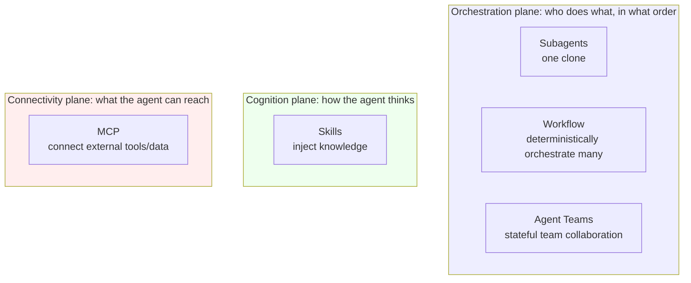
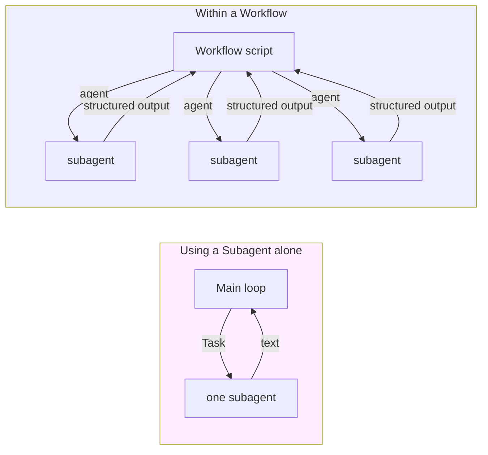
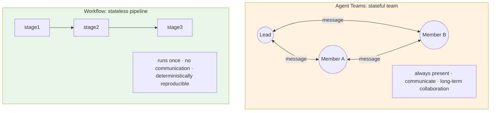
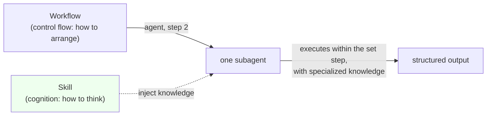
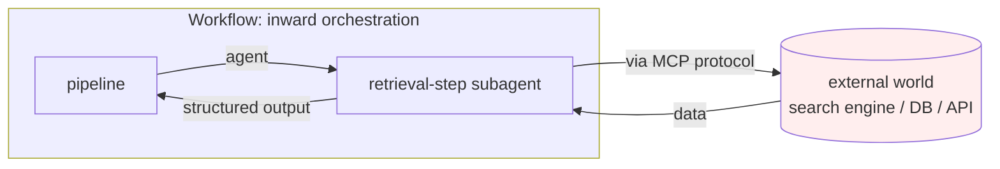
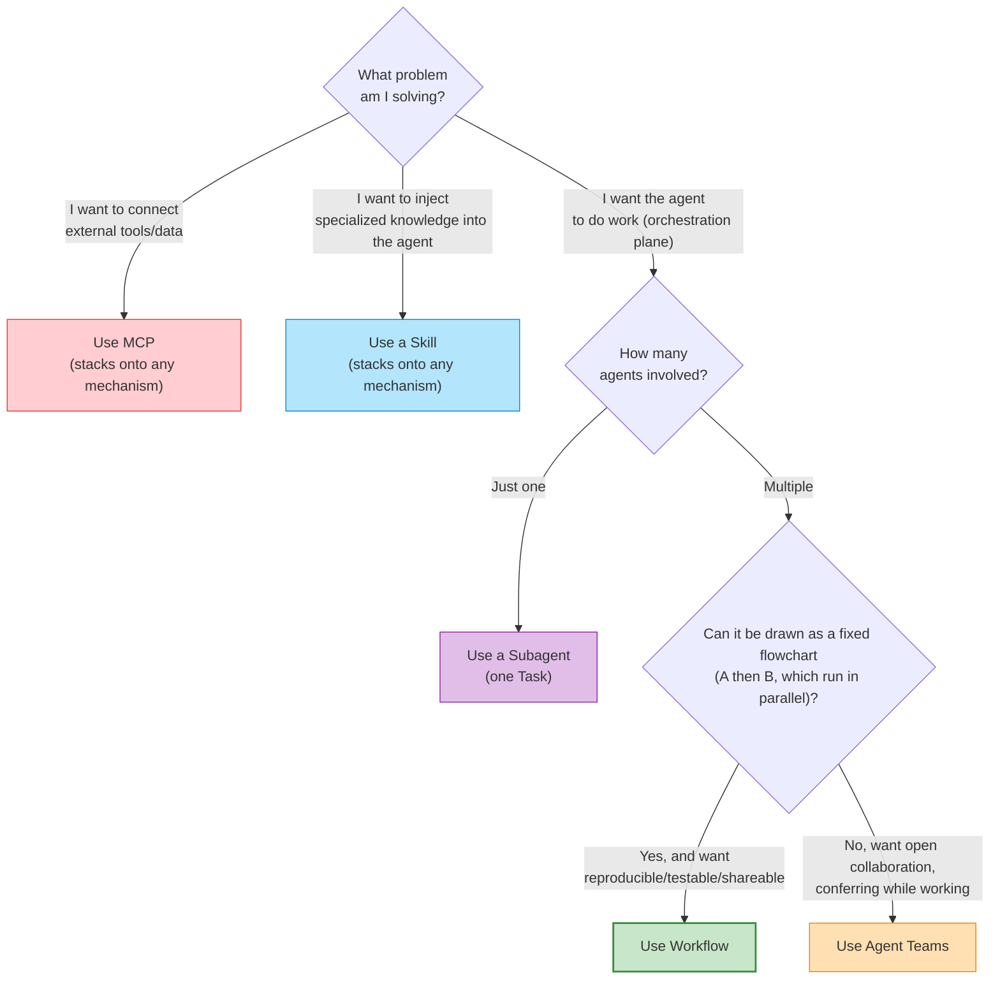
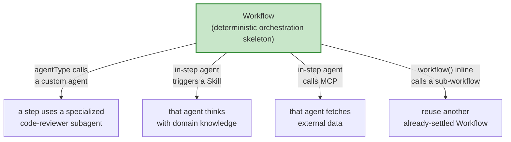

# Chapter 03 · The Positioning Matrix: Five Extension Mechanisms

> In the last chapter we made the case for "why you need deterministic orchestration." But Workflow is no island — it lands in an already-bustling ecosystem: Subagents, Agent Teams, Skills, MCP, each with its own job.
>
> What trips up beginners most isn't "how do I use Workflow," but "**with so many mechanisms, when exactly do I use which? Will they fight each other?**" This chapter welds the boundaries shut with a positioning matrix, then tells you something that matters even more: **they are orthogonal and composable** — only once you understand the boundaries can you stack them together.

---

## 3.1 Five Names, Five Different Problems

First, put the five protagonists on stage, each with one sentence pinning down **which problem it answers.** Keep these five questions in mind; they're the skeleton of the whole chapter:

| Mechanism | The question it answers | One-line positioning |
|---|---|---|
| **Subagents** | "Can I **send a clone** to do this one thing and bring back the result?" | Fork a child agent once, returns text |
| **Workflow** | "**Many** clones — in what order / parallelism / verification do they work?" | Use code to **deterministically orchestrate** multiple subagents |
| **Agent Teams** | "Can a group of clones **collaborate long-term like a team and talk to each other**?" | Stateful, communicating, long-term collaborating multi-agent |
| **Skills** | "The **specialized knowledge** this thing needs — how do I feed it to the agent on demand?" | On-demand-injected prompt knowledge pack |
| **MCP** | "How does the agent **connect to external tools and data**?" | A protocol connecting external tools / data sources |

These five questions live on three completely different planes. Build this macro intuition first; the details follow:

**Why split into three planes first?** Because the things genuinely easy to mix up — the ones that really force an either-or choice — all live *within* the "orchestration plane" (Subagents / Workflow / Agent Teams); Skills (cognition plane) and MCP (connectivity plane), on the other hand, aren't **on the same dimension** as those at all — there's no "either-or" to speak of; they stack on top. Get the planes straight first, and the later trade-offs won't get tangled.

---

## 3.2 Subagents: The One-Off Clone

### What it is

A subagent is the smallest unit: **the main loop forks a child agent, hands it a task, it runs to completion on its own, and returns a text result.** In Claude Code, that "subtask" you routinely fire off with the Task tool is, at heart, a subagent.

Its traits are sharp and clear:

- **One-off**: dispatched, run, handed back, done. It doesn't remember what the previous subagent did, and the next subagent has no idea it was ever there.
- **Isolated context**: it has its own independent context window — and that's exactly where its value lies: the dirty, heavy work happens on its side, and the raw material need not be stuffed back into the main loop (echoing Wall ① of Chapter 02).
- **Returns text**: what it hands back is a piece of writing.

### Its relationship to Workflow: atom vs molecule

This is the pair that most needs sorting out, because **what Workflow's `agent()` dispatches is exactly a subagent.**

Think of it this way:

> **A subagent is the "atom," Workflow is the "molecule."** A single subagent solves "send one clone to do one thing"; Workflow uses **code** to assemble many subagents into structure — parallel, pipeline, loop, verification, consolidation.

Chapter 01's `hello-workflow` dispatched just **one** agent — there, Workflow collapsed into "just a subagent," with no orchestration value on show. The real power shows up when `parallel` / `pipeline` orchestrate 3, 6, or dozens of subagents (recall Chapter 02's real data: parallel 3, pipeline 6 agents).

**When do you reach for just a Subagent and skip the Workflow?** When you only need to **send one clone off to do one fairly self-contained job** — "explore this directory and summarize it," "read this long document and pull out the key points." A single Task subtask does the trick; wrapping it in a Workflow is using a cannon to swat a fly. **Only when the clones become "multiple" and have an "order / parallelism / dependency / verification" relationship among them do you upgrade to Workflow.**

---

## 3.3 Agent Teams: The Stateful Collaborating Team

### What it is

Agent Teams is gated by the experimental flag `CLAUDE_CODE_EXPERIMENTAL_AGENT_TEAMS` (in the session environment of this book's writing, **that flag is enabled**, coexisting with `CLAUDE_CODE_WORKFLOWS=1` — see `_grounding.md` section A, tested). It takes a **fundamentally different approach to collaboration**:

> A group of agents form a **team** — **stateful**, **able to communicate with each other**, engaged in **long-term collaboration.** They aren't "dispatched and done"; they stay present like a real team, calling out to each other, splitting up the work, and coordinating via messages.

**You're watching it happen right now.** The writing of this book itself runs on Agent Teams — this very chapter you're reading was written by a guest-author agent on the "Loom" writing team, which coordinated tasks and reported progress to team-lead via the messaging mechanism. This feel of "stateful + communicating + long-term presence" is exactly what sets Agent Teams apart from a one-off subagent.

### Its relationship to Workflow: stateful team vs stateless pipeline

This is another **easily mixed-up** pair, because both "involve multiple agents." But at their core they're polar opposites:

| Dimension | **Agent Teams** | **Workflow** |
|---|---|---|
| State | **Stateful** — members stay present, remember context | **Stateless** — the script ends when it finishes, leaving no team |
| Communication | Members **can communicate**, call out, negotiate | Subagents **don't communicate**, only pass values via script variables |
| Temporality | **Long-term collaboration**, can span many turns | **One-off** pipeline, runs to the end in one go |
| Control style | Emergent — members decide on their own, coordinate dynamically | **Deterministic** — code precisely prescribes order and parallelism |
| Reproducibility | The collaboration process depends on runtime dynamics, no reproduction guarantee | Same script + same args → reproducible (even cache hit) |

One sentence cuts it open:

> **Agent Teams is like a "permanently staffed, always-talking" project group**; **Workflow is like an "automated assembly line that runs through once per blueprint and leaves no one behind."**

### How to choose

- **Choose Workflow**: the task can be drawn as a **fixed flowchart** of "what first → what next → what runs in parallel," and you want it **reproducible, testable, shareable.** E.g., "sharded review → adversarial verify → consolidate."
- **Choose Agent Teams**: the task is **open, needs improvisation, and members must confer as they work**, with no flowchart fixed in advance. E.g., "several roles keep discussing a fuzzy requirement and push it forward with dynamic division of labor" (just like the writing of this book).

**Don't cram Agent Teams' open collaboration into a Workflow.** If your task is full of "it depends" and "members need to align as they go," forcing a deterministic script to orchestrate it gets very awkward — that's Agent Teams' home turf. The other way round, a fixed-shape pipeline that's after reproducibility, run via Agent Teams, wastes the "stateful team" capability and throws away determinism. **The boundary is exactly this sentence: the flowchart can be fixed → Workflow; needs improvisation → Agent Teams.**

---

## 3.4 Skills: Injected Knowledge, Changing How the Agent "Thinks"

### What it is

Skills are **on-demand-injected prompt knowledge packs.** The moment a certain kind of task shows up, the matching Skill **injects a body of specialized knowledge** (domain conventions, methodology, best practices, operating steps) **into the agent's context**, thereby changing how it "**thinks.**"

Note the verb — what a Skill changes is the agent's **cognition**, not its **control flow.** It makes the agent "know a bit more, think a bit more professionally," but does **not** decide "what to do first, what next."

### Its relationship to Workflow: how to think vs how to arrange

This pair is the textbook case of **orthogonality**; Chapter 01 already touched on this line, and here we drive it all the way home:

> **Skills decide how the agent "thinks" (cognition); Workflow decides "in what order it acts" (control flow).** One governs the knowledge in the head, one governs how the steps join up — they sit on two different axes and simply don't conflict.

Precisely because they're orthogonal, they **can stack.** `agent()` has an `agentType` option (`_grounding.md` section B) that lets a subagent run as a certain custom type (e.g., `'Explore'`, `'code-reviewer'`); and an agent carrying a particular skill, when dispatched in some step of a Workflow, **is both orchestrated by Workflow's control flow and thinks with the knowledge the skill injected.**

**Picture it this way:** Workflow is the **script** (laying out which act, who enters first, how many lines run in parallel); a Skill is the **actor's professional training** (so when the actor plays a doctor, they genuinely know the medical terminology). The script won't reshuffle the acts just because the actor is more skilled, and the actor won't forget their expertise just because the script is fixed — each minds its own department, and together they make a good play.

---

## 3.5 MCP: The Protocol Connecting the External World

### What it is

MCP (Model Context Protocol) is **a protocol for connecting external tools and data sources.** It lets an agent reach things "outside itself" — a database, a search engine, a browser, a company-internal API. Chapter 01 spelled it out: **MCP is a protocol connecting external tools / data sources; Workflow is an engine orchestrating internal subagents.**

### Its relationship to Workflow: outward connection vs inward orchestration

This pair is almost impossible to genuinely mix up, but it's still worth anchoring the direction in one sentence:

> **MCP points "outward" — connecting the agent to the external world; Workflow points "inward" — orchestrating the internal subagents.** One solves "what can it reach," one solves "how to organize your own people."

They're just as **composable**: some subagent within a Workflow can, while running its step, call an MCP tool to fetch external data, then hand the result back to the pipeline as a structured output. For example, a "deep research" pipeline (Chapter 13) might have its "retrieval" step let a subagent call a search engine via MCP.

---

## 3.6 The Decision Matrix: Clearing Up Five Mechanisms in One Table

Lay the five mechanisms out side by side across a few key dimensions — this is the chapter's core quick-reference table:

| Dimension | Subagents | **Workflow** | Agent Teams | Skills | MCP |
|---|---|---|---|---|---|
| **Solves what** | Send one clone to work | **Deterministically orchestrate multiple subagents** | Stateful team long-term collaboration | Inject domain knowledge | Connect external tools/data |
| **Which plane** | Orchestration | **Orchestration** | Orchestration | Cognition | Connectivity |
| **Agent count** | One | **Multiple** | Multiple | N/A | N/A |
| **State** | One-off | **Stateless** | Stateful | Effective once injected | Connected state |
| **Inter-member comms** | None | **None (values via script variables)** | Yes | N/A | N/A |
| **Control style** | Main loop dispatches directly | **Deterministic code** | Emergent coordination | Prompt injection | Protocol call |
| **Reproducible** | Single-shot | **Yes (same script+args cacheable)** | No | Yes (knowledge fixed) | Depends on external |
| **Gating flag** | Built-in | `CLAUDE_CODE_WORKFLOWS` | `..._AGENT_TEAMS` | Built-in / skill system | MCP config |
| **Typical scenario** | Explore/summarize one thing | **Sharded review, adversarial verification, pipeline** | Open-ended multi-role collaboration | Inject specialized conventions into a step | Fetch external data |

> The two flags `CLAUDE_CODE_WORKFLOWS` and `CLAUDE_CODE_EXPERIMENTAL_AGENT_TEAMS` in the table were both confirmed present by testing in this book's writing session (`_grounding.md` section A).

---

## 3.7 The Decision Flowchart: Which One Should You Actually Use

Fold the trade-offs above into a decision tree. Faced with a task, walk down from the top, and use whichever mechanism you land on at the leaf:

The key fork of this tree is that last judgment — **"can it be drawn as a fixed flowchart":**

- **Can be fixed** → Workflow. E.g., "five-dimension review → per-item verify → deduped consolidation," every step clear, order and parallelism nailed down.
- **Can't be fixed** → Agent Teams. E.g., "several roles keep discussing a fuzzy goal and split the work dynamically as progress dictates."

**The two most common misjudgments — commit them to memory:**

1. **Seeing "multiple agents" and jumping straight to Agent Teams** — wrong. Multiple agents but a **fixed process** should use Workflow. Agent Teams' admission ticket is "needs stateful communication and improvisation."
2. **Treating "Workflow / Skill / MCP" as a pick-one** — wrong. They aren't on the same dimension; they are **not mutually exclusive at all.** A subagent within a Workflow step can perfectly well carry a Skill's knowledge and call an MCP tool at the same time. The next section is all about this.

---

## 3.8 To Be Honest: They Are Orthogonal and Composable

Up to now, to keep the boundaries clear, we "cut" the five mechanisms apart. But in the real world, the strongest usage is precisely **stacking them together.** This section must honestly add: **these mechanisms aren't competitors but orthogonal and composable** — understanding the boundaries is about composing better, not picking one over the others.

Workflow sits at the center of the orchestration plane, and is naturally the **carrier** for the other mechanisms:

Each of these composition points has API backing (`_grounding.md` section B):

- **Workflow + custom Agent**: `agent()`'s `agentType` option can specify a subagent type (e.g., `'Explore'`, `'code-reviewer'`), and it **can combine with schema** — using a specialized agent while forcing structured output.
- **Workflow + Skill**: a subagent dispatched by Workflow can, while running its step, trigger / carry a skill's knowledge — Workflow governs "when this step happens," the skill governs "how to think professionally in this step."
- **Workflow + MCP**: some subagent in the pipeline reaches external data via MCP as it runs (e.g., the retrieval step of "deep research").
- **Workflow + Workflow**: `workflow(name, args?)` can inline-call another already-settled named workflow (**nesting is one level only**; calling again inside a sub-workflow throws), turning a validated pipeline into a reusable building block — this is the basis of Part V "Build Your Own Library" and Chapter 20 "Nested Workflows."

One sentence to wrap up this composition view:

> **Workflow is the "skeleton" of the orchestration plane; a Skill injects "professional judgment" into each joint of the skeleton, MCP lets a joint reach the "external world," and a custom agentType makes a joint the "right specialist."** They don't steal the scene — they co-star.

**This is exactly the "Loom" metaphor echoing at the ecosystem level.** Workflow is the warp (the deterministic structural skeleton), while Skill / MCP / custom agents are the weft shuttling through it (the intelligence and connectivity of each step). The warp fixes the form, the weft brings the splendor — the five mechanisms aren't a pick-one-of-five question, but a toolbox whose warp and weft can interlace.

---

## 3.9 Chapter Summary

- The five extension mechanisms belong to three planes: the **orchestration plane** (Subagents / Workflow / Agent Teams), the **cognition plane** (Skills), the **connectivity plane** (MCP). What's easy to mix up and forces a trade-off lies only within the orchestration plane.
- **Subagents vs Workflow**: atom vs molecule. One clone → Subagent; multiple clones to be organized in order/parallelism/verification → Workflow.
- **Workflow vs Agent Teams**: stateless deterministic pipeline vs stateful communicating team. **Flowchart can be fixed → Workflow; needs open collaboration and improvisation → Agent Teams.** Both flags (`CLAUDE_CODE_WORKFLOWS`, `..._AGENT_TEAMS`) are enabled on the local machine.
- **Skills** (how to think) and **MCP** (what to reach) are **orthogonal** to Workflow (in what order to act); there's no either-or — they stack on top.
- The strongest usage is **composition**: Workflow as the skeleton, using `agentType` to call specialist agents, in-step agents triggering skills / calling MCP, `workflow()` inline-reusing sub-pipelines (nesting one level only).
- The boundary in one sentence: **if it can be drawn as a flowchart of "what first → what next → what in parallel," use Workflow; for open-ended dialogue and improvisation, it's not its home turf.**

With that, the three chapters of Understanding are in place: you know what Workflow **is** (Chapter 01), **why you need it** (Chapter 02), and where it **sits** in the ecosystem (this chapter). Next we enter Part II, "Foundations," where we roll up our sleeves and get your first truly-your-own Workflow running from scratch.

> Continue reading: [Chapter 04 · Your First Workflow](#/en/p2-04)

---

[← Back to main README](../../README.md) · [中文 README →](../../README.md)
