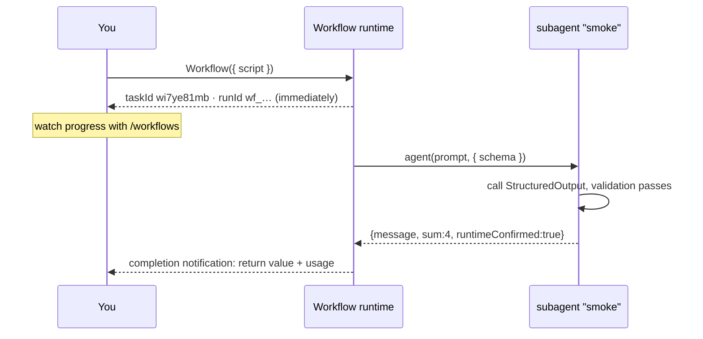
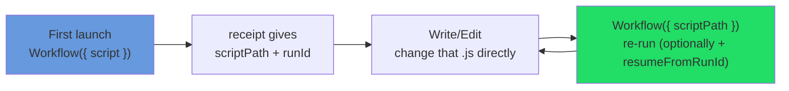

# Chapter 04 · Your First Workflow

> Theory's done; time to get hands-on. This chapter goes from "confirm the environment" to "get your first Workflow running and understood," walking the full loop of launch, async, progress, and iteration. Every step is checked against **real-run** output.

---

## 4.1 Prerequisite: Confirm Workflow Is Enabled

Workflow is an experimental feature, gated by the environment variable `CLAUDE_CODE_WORKFLOWS`. Before starting, confirm it's on in your session.

```bash
# Enable temporarily at launch (effective for the current session)
CLAUDE_CODE_WORKFLOWS=1 claude
```

Or write it into `~/.claude/settings.json` to enable it persistently:

```json
{
  "env": { "CLAUDE_CODE_WORKFLOWS": "1" }
}
```

The most direct way to confirm it's in effect is to check the environment variable. In this book's writing session it **does exist and equals `1`**:

```text
CLAUDE_CODE_WORKFLOWS = 1
```

<div class="callout tip">

If you're unsure, just say in the conversation "ultrawork: run a minimal workflow to confirm the runtime." If the feature is on, Claude can call the Workflow tool; if not, it'll tell you the tool is unavailable.

</div>

---

## 4.2 Hello, Workflow

Below is this book's first real-run script. It does just one thing: dispatch a subagent and ask it to return a structured "run confirmation."

```javascript
export const meta = {
  name: 'hello-workflow',
  description: 'Smoke test: one subagent returns schema-constrained structured output',
  phases: [{ title: 'Greet', detail: 'One subagent confirms the runtime' }],
}

phase('Greet')
const r = await agent(
  'You are a smoke test for the Claude Code Workflow runtime. Return a one-sentence ' +
  'confirmation message, the integer value of 2+2, and a boolean confirming you ran ' +
  'as a workflow subagent.',
  {
    label: 'smoke',
    schema: {
      type: 'object',
      properties: {
        message: { type: 'string' },
        sum: { type: 'number' },
        runtimeConfirmed: { type: 'boolean' },
      },
      required: ['message', 'sum', 'runtimeConfirmed'],
    },
  }
)
log(`smoke result: ${JSON.stringify(r)}`)
return r
```

Line by line (echoing Chapter 01's "warp and weft"):

| Line | Role |
|---|---|
| `export const meta = {…}` | **Warp**: a pure literal declaring name, description, phases. The runtime statically reads it before execution. |
| `phase('Greet')` | Switch to the "Greet" phase; subsequent agents group under it in the progress tree. |
| `agent(prompt, { schema })` | **Weft**: dispatch a subagent; `schema` forces it to return a validated structured object. |
| `log(...)` | Output a line of progress narration to you. |
| `return r` | The workflow's final return value, appearing in the completion notification. |

<div class="callout warn">

**This is a Workflow script, not a Node script — a beginner's first pothole.** `meta`/`phase`/`agent`/`log`/`budget`/`args` are all globals **injected by the Workflow runtime** (`_grounding.md` section B: "injected at runtime, no import needed"). Save this as `hello.js` and run `node hello.js` on its own, and Node — having none of these globals — immediately throws `ReferenceError: phase is not defined`. **This is identical on Windows, macOS, and Linux** (it has nothing to do with the OS; it's because Node simply lacks the Workflow runtime layer). It only runs inside a Claude Code session with `CLAUDE_CODE_WORKFLOWS=1` enabled, executed by Claude via the built-in Workflow tool (see 4.1: just say "ultrawork: run this"). This book's testing ran it exactly that way: runtime confirmed, schema forced `sum=4` as a **number**, ~26k tokens / ~5.5 seconds (see the real receipt and usage in 4.3 and 4.4).

</div>

---

## 4.3 Launch: You Immediately Get a Receipt

The moment you hand the script to the Workflow tool, it **does not wait to finish** — it returns a receipt immediately. This is real output:

```text
Workflow launched in background. Task ID: wi7ye81mb
Summary: Smoke test: one subagent returns schema-constrained structured output
Transcript dir: ...\subagents\workflows\wf_dacbd480-d5d
Script file: ...\workflows\scripts\hello-workflow-wf_dacbd480-d5d.js
Run ID: wf_dacbd480-d5d
You will be notified when it completes. Use /workflows to watch live progress.
```

This receipt corresponds exactly to the real fields of `WorkflowOutput` in `_grounding.md` section B. Map them into a table:

| What you see in the receipt | `WorkflowOutput` field | Meaning / use |
|---|---|---|
| `Task ID: wi7ye81mb` | `taskId: string` | The background task handle (pair with TaskStop to stop it). |
| `Run ID: wf_dacbd480-d5d` | `runId?: string` | This run's identifier, **needed for resume** (Chapter 22); absent when `remote_launched`. |
| `Script file: ...js` | `scriptPath?` | Your script was **written to disk** — the key to iteration (see 4.5). |
| `Transcript dir: ...` | `transcriptDir?` | The directory of the subagent's full execution record. |
| `Summary: Smoke test...` | `summary?` | The echoed one-line summary (i.e. `meta.description`). |

<div class="callout info">

**The receipt's `status` has only two possible values.** Per `_grounding.md` section B, `WorkflowOutput.status` is `"async_launched" | "remote_launched"` — **there is no third**, and in particular **no** synchronous "completed" status. Running locally is `async_launched` (your case here); running on the CCR remote is `remote_launched` (no `runId` then — the resume handle becomes the returned session URL). When the syntax check fails, the return carries an `error` field instead (see 4.7). **Internalize this and you'll never again expect "call Workflow and get the result directly."**

</div>

<div class="callout info">

**Why is it async?** Because a workflow may fan out dozens of subagents and run for minutes or longer. The async design lets you continue doing other things after launching, and get notified when it completes. So — **the Workflow tool's return value is not the result, but a "launched" receipt.** The real result is in the completion notification.

</div>

---

## 4.4 Progress and Completion

After launching, the slash command **`/workflows`** shows a **live progress tree**: which phase you're in (from `meta.phases` and `phase()`), which agents are running, which are done (leaf-node names come from each `agent()`'s `label`). It is your observation window for the stretch "after launch, before notification" — a progress panel that keeps refreshing. How `phase`/`log`/`/workflows` work together is the subject of Chapter 09.

When the workflow actually finishes, you receive a **completion notification.** The core of `hello-workflow`'s real completion notification is this return value:

```json
{
  "message": "The Claude Code Workflow runtime smoke test executed successfully as a workflow subagent.",
  "sum": 4,
  "runtimeConfirmed": true
}
```

plus a real usage report:

```text
agent_count = 1   tool_uses = 1   total_tokens = 26338   duration_ms = 5506
```

Read it:

- `sum` is the number `4`, **not** the string `"4"` — because the schema declared `type: 'number'`, the validation layer guaranteed the type (the power of structured output; see Chapter 07).
- One simplest agent round-trip ≈ **5.5 seconds / 26k tokens.** This is your baseline unit for estimating the cost of larger workflows.



---

## 4.5 The Iteration Loop: The Script Is a File

Because the script landed on disk (the receipt's `Script file` / `WorkflowOutput.scriptPath`), iterating a workflow doesn't require resending the whole code each time. This forms an **"edit the on-disk file → re-run with `scriptPath`" iteration loop**:



Once you have the `Script file` path from the receipt, each iteration is:

1. Use `Write`/`Edit` to change that `.js` file directly;
2. Re-invoke Workflow with `{ scriptPath: "<that path>" }` (`scriptPath` has priority over `script`/`name`).

If you also want to reuse the previous **expensive intermediate results**, add `resumeFromRunId`:

```javascript
// After editing the script, re-run with resume: unchanged agent() calls return cached results in seconds
Workflow({ scriptPath: ".../hello-workflow-wf_dacbd480-d5d.js", resumeFromRunId: "wf_dacbd480-d5d" })
```

"The same script + the same args → 100% cache hit." This is why `Date.now()` / `Math.random()` are forbidden in scripts (they break replayability). Resume details are in Chapter 22.

---

## 4.6 Make It a Little Bigger: Two Agents

Expand hello into "two concurrent agents + a one-line summary" to get a feel for `parallel()`:

```javascript
export const meta = {
  name: 'hello-parallel',
  description: 'Two concurrent agents, then a one-line summary',
  phases: [{ title: 'Ask', detail: 'Two agents in parallel' }],
}

phase('Ask')
const [a, b] = await parallel([
  () => agent('In one sentence: what is a barrier in concurrency?', {
    label: 'q-barrier',
    schema: { type: 'object', properties: { answer: { type: 'string' } }, required: ['answer'] },
  }),
  () => agent('In one sentence: what is a pipeline in concurrency?', {
    label: 'q-pipeline',
    schema: { type: 'object', properties: { answer: { type: 'string' } }, required: ['answer'] },
  }),
])
log('both answers in')
return { barrier: a?.answer, pipeline: b?.answer }
```

Note that `parallel()` takes an **array of thunks** (`() => …`), not an array of Promises — this is a beginner's first pothole, detailed in Chapter 08.

> The `hello-parallel` block above is **illustrative** (not run on its own); the real behavior of the `parallel()` it relies on has been verified by Chapter 08's `parallel-demo` (Run `wf_52957913-6d2`).

---

## 4.7 The Four Most Common Beginner Mistakes

Writing your first Workflow, nearly everyone hits the pitfalls below. Take them one at a time, with "wrong" and "right":

**① `meta` is not a pure literal (including "computing a value inside `meta`").** `meta` must be a "dead" literal — the runtime reads it during the **static-parsing phase**, so any variable reference, function call, spread, or template interpolation makes it refuse to launch. Beginners especially love to "just compute something" in `meta` (concatenate a name, generate a description from the date) — that's exactly the high-incidence trap:

```javascript
// ✗ Wrong: variable reference + template interpolation + function call — all "computation"
const NAME = 'x'
export const meta = { name: NAME, description: `run ${NAME} at ${Date.now()}` }
// ✓ Right: a pure literal, written out character by character
export const meta = { name: 'x', description: 'run x' }
```

**② The schema omits the `required` fields.** When passing a `schema`, don't stop at `properties` — also list the fields that **must appear** in `required`, or the model may legitimately omit one, and your downstream `r.sum + 1` gets `undefined`:

```javascript
// ✗ Wrong: declares sum but doesn't list it in required — the model may not return it
schema: { type: 'object', properties: { sum: { type: 'number' } } }
// ✓ Right: required nails down "this field must be present"
schema: { type: 'object', properties: { sum: { type: 'number' } }, required: ['sum'] }
```

**③ Treating it as a synchronous call, expecting "the result the moment it's done."** This is the most damaging conceptual error. Workflow is **always async**: the call returns a receipt immediately (`status` is only ever `async_launched`/`remote_launched`, see 4.3), and the result is in the **completion notification**. Any `const result = Workflow(...)` followed by immediately using `result.sum` is wrong — at that moment `result` is just the receipt, not the product.

**④ Syntax error.** If the script's syntax check fails, `WorkflowOutput` carries an `error` field telling you what went wrong, and the workflow **won't launch.** Get the script right locally before submitting it.

<div class="callout warn">

**Don't use `Date.now()` / `Math.random()` / arg-less `new Date()` in scripts** — they throw (they break replayability and invalidate the resume cache, see 4.5). If you need a timestamp, pass it in via `args`; if you need randomness, vary the prompt using the agent's index.

</div>

---

## 4.8 Chapter Summary

- Enable the feature with `CLAUDE_CODE_WORKFLOWS=1`; if unsure, have Claude run a minimal workflow to confirm.
- It is a **Workflow script, not a Node script**: `meta`/`phase`/`agent`/`log` are runtime-injected globals; `node hello.js` throws `phase is not defined` identically across platforms; it only runs via Claude in a `CLAUDE_CODE_WORKFLOWS=1` session.
- Launching a Workflow **returns a receipt immediately** (`WorkflowOutput`: `taskId`/`runId`/`scriptPath`/`transcriptDir`; `status` is only `async_launched`/`remote_launched`); the result is in the **completion notification**; watch live progress with `/workflows`.
- Real baseline: a single agent ≈ 5.5s / 26k tokens; `schema` guarantees the return type (`sum` is the number 4, not a string).
- Iterate via the "script is a file" loop: edit the on-disk `.js` + re-run with `scriptPath`; add `resumeFromRunId` to reuse the cache.
- Four beginner pitfalls: ① computing values inside `meta` (must be a pure literal); ② omitting `required` in a schema; ③ treating it as synchronous, expecting the result immediately; ④ syntax errors land in the `error` field and don't launch.

With Foundations this far, you can already run, read, and iterate a Workflow. The next three chapters (05/06/07) explain the warp (`meta`/`phase`), the weft's core (`agent()`), and structured output (`schema`) one by one, and Chapter 08 nails down the concurrency model.

> Continue reading: [Chapter 05 · meta & phase: The Warp](#/en/p2-05)
