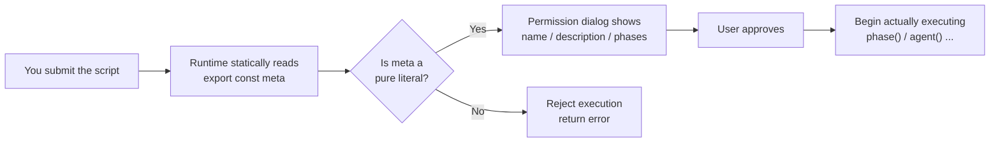
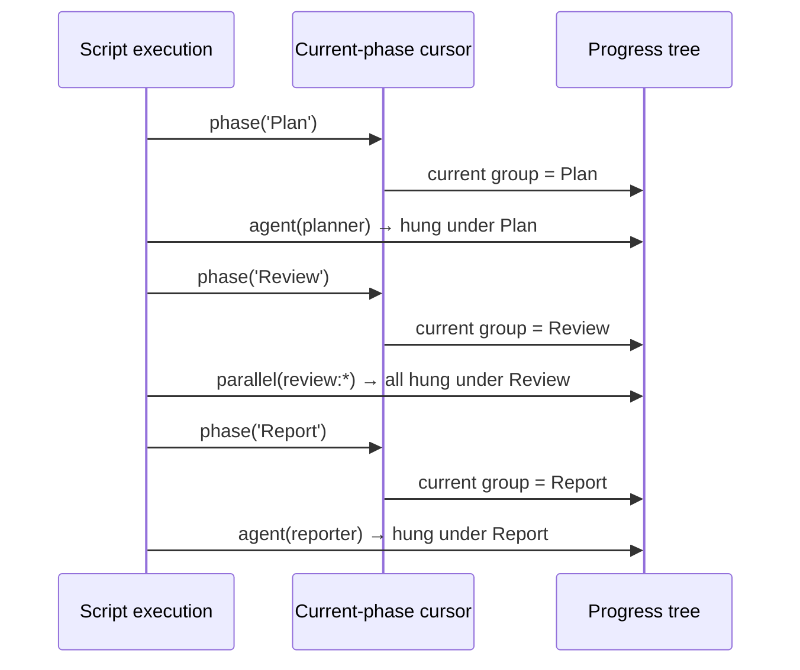
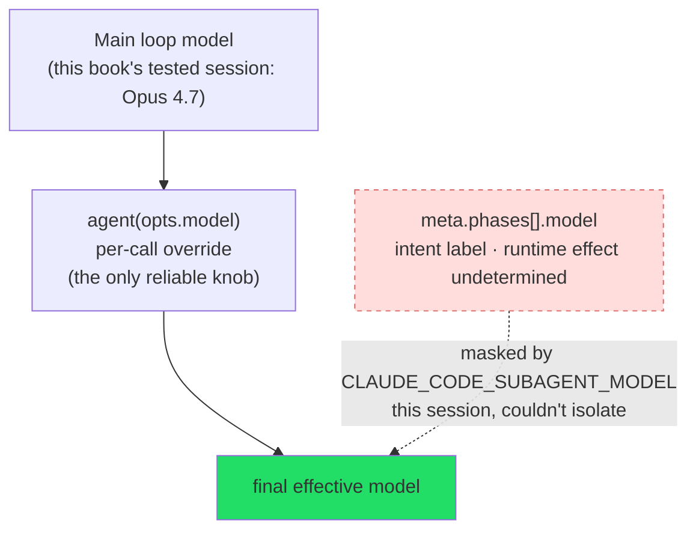

# Chapter 05 · meta & phase: The Warp

> **The warp is the lengthwise thread of weaving; drawn taut and never slack, raise the cord and the meshes open.**
>
> On a loom, the first thing stretched tight is the warp. It runs the length of the whole bolt, fixing the cloth's length, width, and tension — before the weft is even threaded in, the cloth's "form" is already set.
>
> In a Workflow script, `meta` and `phase()` are exactly this warp. They run no subagent and produce no business result, yet before the first `agent()` is dispatched, they have already tensioned the entire workflow's **skeleton**: what it's called, what it does, how many phases it splits into, which model each phase intends to use, and how progress should be shown to a human.
>
> This chapter takes that warp completely apart. You'll see that behind a seemingly unremarkable "exported constant" hides one non-negotiable hard constraint of the runtime; you'll also see how `phase()`, a tiny "one-line, no-return-value" function, combs the tangle of dozens of subagents into a clear progress tree in `/workflows`.

---

## 5.1 Why the Warp Must Be Tensioned First: A Story of Static Reading

To understand `meta`, you must first understand **when** the runtime reads it.

Recall that real-run `hello-workflow` from Chapter 01. When you hand the script to the Workflow tool, a permission confirmation pops up almost instantly — it tells you "about to run a workflow called `hello-workflow`, description *Smoke test: one subagent returns schema-constrained structured output*, with 1 phase: Greet."

Note this moment: **at this point not a single line of the script has run.** No `agent()` has been dispatched, no `await` has been evaluated, not even `phase('Greet')` has run. Yet the runtime already knows the workflow's name, description, and phases exactly.

How does it know?

The answer: before running the script, the runtime does a **static read** of it — it pulls out the exported constant `export const meta = {…}` and reads it as **data**, rather than running it as **code.**



This is the technical meaning of "the warp is tensioned first": **structural info must be readable before execution**, because it's used to generate the permission dialog and initialize the progress tree. And to read an object's value "without running code," that object **must be a pure literal** — no variable references, no function calls, no spread operators, no template interpolation. Anything that needs to "run" to be evaluated is blank during the static-read phase.

<div class="callout info">

**What's the difference between "static reading" and "execution."** By analogy: `meta` is like the "title, synopsis, and act list" written on a script's cover — the theater manager **glances at the cover** before the show and prints it into the program, without having to perform the whole play. But if you wrote the title as "today's date + a random number," the manager sees only an incomprehensible formula on the cover and naturally can't print the program. The runtime reading `meta` is "glancing at the cover," not "performing the play."

</div>

This constraint is explicitly recorded in `_grounding.md`'s "hard constraints" section:

> `meta` must be a pure literal (statically read by the runtime before execution).
>
> — *Grounding Facts and Writing Conventions*, Section B · Hard Constraints

---

## 5.2 The Boundary of "Pure Literal": What's Allowed, What's Rejected

The phrase "pure literal" sounds abstract; let's pin it down with a set of contrasts.

### 5.2.1 Legal meta: all "dead values"

The following are all **pure literals** — every value is a constant hard-written in the source, readable by the runtime without running any code:

```javascript
export const meta = {
  name: 'sharded-review',                          // string literal
  description: 'Shard the changes, dispatch one reviewer per shard for parallel review',  // string literal
  whenToUse: 'When a PR change spans multiple files and you want parallel review',         // string literal
  phases: [                                        // array literal
    { title: 'Plan',   detail: 'List the change shards' },        // object literal
    { title: 'Review', detail: 'One reviewer per shard', model: 'opus' },
    { title: 'Merge',  detail: 'Consolidate all findings' },
  ],
}
```

Arrays, nested objects, booleans, numbers, `null` — as long as they're themselves literals, they're all legal. The key isn't "simple or complex" but "does reading it require running code."

### 5.2.2 Illegal meta: any "live value" gets rejected

Each of the following makes the runtime fail during the static-read phase, thereby **rejecting execution of the entire workflow**:

```javascript
// Anti-example 1: contains a variable reference — NAME doesn't exist yet at static-read time
const NAME = 'my-workflow'
export const meta = {
  name: NAME,                       // rejected: references an external variable
  description: '...',
}
```

```javascript
// Anti-example 2: contains a function call — needs execution to evaluate
export const meta = {
  name: 'report-' + getProjectName(),   // rejected: calls a function
  description: '...',
}
```

```javascript
// Anti-example 3: contains template interpolation — essentially a string-concatenation expression
const env = 'prod'
export const meta = {
  name: `deploy-${env}`,            // rejected: template interpolation with a variable
  description: '...',
}
```

```javascript
// Anti-example 4: contains a spread operator — needs execution to spread
const base = { whenToUse: '...' }
export const meta = {
  ...base,                          // rejected: spread operation
  name: 'x',
  description: '...',
}
```

```javascript
// Anti-example 5: contains a forbidden non-deterministic call — a double violation
export const meta = {
  name: 'run-' + Date.now(),        // rejected: both a function call and the forbidden Date.now()
  description: '...',
}
```

<div class="callout warn">

**Remember one test: cut `meta` out alone into an empty file — can it still be "purely read" like `JSON.parse`?** If it leans on anything **else** in the file (variables, functions, imports), then it's not a pure literal and will be rejected. `meta` must be a **self-sufficient island.**

</div>

So — **what if I genuinely need a dynamic name?** The answer: dynamic info shouldn't go into `meta`, but into `args` or `log()`.

- Want the workflow name to carry the project name? Use `log()` to print at runtime `log(\`Reviewing project ${args.project}\`)`, and let `meta.name` stay a fixed, readable identifier.
- Want a run to carry a timestamp? Chapter 01 already covered it: `Date.now()` is forbidden in scripts; if you need a timestamp, **pass it in from outside via `args`**, or have the main loop stamp it after the workflow finishes.

`meta` describes "what this workflow is" (an **unchanging identity**), not "the specific parameters of this run" (a **mutable instance**). Keeping these two apart is the key to understanding the whole design.

---

## 5.3 The Full meta Field Reference

Per `_grounding.md` section B, checked against the official `sdk-tools.d.ts` and the tool definition, here are `meta`'s fields:

| Field | Required | Type | Role | Shown where |
|---|---|---|---|---|
| `name` | **Yes** | string | Workflow identifier | Permission confirmation dialog |
| `description` | **Yes** | string | One-line "what it does" | Permission confirmation dialog |
| `whenToUse` | No | string | Use-case "when to use it" | Workflow list |
| `phases` | No | `Array<{title, detail?, model?}>` | Phase declaration, driving progress-tree grouping | `/workflows` progress tree |
| `model` (top-level) | No | (type unverified) | **Semantics unverified**: the tool definition does not list top-level `meta.model` as a meta field. This book confirms only the two layers `phases[].model` and `opts.model` (see the §5.3.3 warning) | (to be verified) |

Let's take them one by one.

### 5.3.1 `name` and `description`: the two required fields

These are the only two **required** fields. Their whole job is to **introduce themselves** to the user in the permission dialog:

- `name` — an identifier for humans and machines. It shows up in the permission dialog, the progress display, and (once you settle the script into a named workflow) the `{ name: '...' }` call. Use kebab-case, semantically clear and stable.
- `description` — **one line** stating clearly "what this workflow does." It's shown directly in the dialog the user sees before approving the run, and is the main basis on which the user decides "should I allow this."

<div class="callout tip">

**Write `description` as an "elevator pitch."** The moment the user sees it, they're about to decide whether to authorize an operation that may fan out dozens of subagents and burn a lot of tokens. A vague `description: 'process data'` gives them nothing to judge by; a specific `description: 'Shard the PR changes by file, dispatch one reviewer per shard for parallel review, consolidate findings'` lets them confidently click "approve."

</div>

### 5.3.2 `whenToUse`: written for "future you" and "the workflow list"

`whenToUse` is the optional "use-case" note. Its subtle difference from `description`:

- `description` answers "what this workflow **does**" (What);
- `whenToUse` answers "**when** to choose it" (When).

Its value really shows once the workflow is **settled and reused.** Recall Chapter 01, §1.7: a validated script can be filed into `.claude/workflows/` and later called like a named command with `{ name: 'my-workflow' }`. Once your library has amassed a dozen workflows, `whenToUse` is the index for "which one to use" — it shows in the workflow list, helping you (or your teammate) quickly pick the right tool out of many.

```javascript
export const meta = {
  name: 'bug-hunter',
  description: 'Multiple finders look for bugs in parallel, then a verifier adversarially verifies, finally consolidate',
  whenToUse: 'When you want a high-precision bug scan of the current branch before merging; for small changes prefer a lighter version',
  // ...
}
```

### 5.3.3 Model: The Only Reliable Knob Is `agent()`'s `model`

Model, of all things, is exactly where `meta` (the warp) and `agent()` (the weft) meet. But there's an **extremely common misconception** to clear up first: many people assume that "mark a `'haiku'` on `meta.phases[].model` and that phase's agents will run Haiku" — **the runtime effect of this is actually undetermined.**

Per `_grounding.md`'s grounding facts:

- **`meta.phases[].model`** — written inside the `phases` array (e.g., `{ title: 'Verify', model: 'haiku' }`). The official tool description's wording for it is **vague** ("add it when overriding a phase to a specific model"); and because `CLAUDE_CODE_SUBAGENT_MODEL` overrode every per-call model this session (see `_grounding.md` A2, Run ID `wf_9c94951d-58c`), we **could not independently isolate** whether it has any runtime effect.
- **agent `opts.model`** — a per-**call** override; the official definition clearly states "**omitted, it inherits the main loop model.**" This is the **only** model knob with clear official semantics.

When neither is written, the agent inherits the main loop model — **this book's tested session**'s main loop is Opus 4.7 (set by `CLAUDE_CODE_SUBAGENT_MODEL=claude-opus-4-7[1m]`, see `_grounding.md` section A; a fact of the book's session, not a general Workflow guarantee).

<div class="callout warn">

**Common misconception: don't count on `meta.phases[].model` to single-handedly switch a phase to a model.** Its **runtime effect is undetermined** — the official wording is vague, and this session **could not independently verify** whether it takes effect on its own, because the env var `CLAUDE_CODE_SUBAGENT_MODEL` overrode it (in that 5-agent probe, one agent sat in a phase whose `meta.phases[]` marked `model:'haiku'`, yet still ran Opus, Run ID `wf_9c94951d-58c`). **Safe practice: to genuinely make a phase use Haiku, write `model:'haiku'` on every `agent()` in that phase** — treat `phases[].model` as "a label for humans and the permission dialog," not a switch that fires on its own. (Note: some third-party material claims it is "display-only, not read at runtime" — this book has **not** independently tested that, so we do **not** treat the claim as an established fact; we only affirm the safe practice that "`agent()`'s `model` is the reliable knob.")

</div>

<div class="callout warn">

**On top-level `meta.model`:** in the Workflow tool definition, `meta`'s fields are required `name`/`description` + optional `whenToUse`/`phases` (with `model` allowed inside `phases`) — it does **not** list a top-level `meta.model` as a meta field. So this book does **not** describe it as an effective "model layer"; its auto-resolution semantics are **unverified (to be verified).**

</div>

For the cost trade-off of picking models per phase (and why marking the intent on `phases` is still recommended), see §5.6.

### 5.3.4 `phases`: the "ticks" on the warp

`phases` is the field with the **strongest sense of structure** in `meta`, and the star of this chapter's second half. It's an array, each item declaring a phase:

```javascript
phases: [
  { title: 'Find',   detail: 'Each finder produces a candidate bug' },
  { title: 'Verify', detail: 'Adversarially verify each candidate', model: 'opus' },
  { title: 'Report', detail: 'Consolidate the confirmed findings' },
]
```

Each item's fields:

| Field | Required | Role |
|---|---|---|
| `title` | Yes | Phase title. **This is a string that gets matched exactly** (see §5.5) |
| `detail` | No | A one-sentence note on the phase, shown in the progress tree to help one understand what this phase does |
| `model` | No | **Marks** "what model this phase intends to use"; whether it takes effect on its own at runtime is **undetermined** — to genuinely set the model, write `model` on the `agent()` (see §5.3.3, §5.6) |

`phases` is **pure declaration** — it only "draws the ticks" in `meta`, telling the runtime "this workflow plans to split into these phases, each named this." Actually **switching** to a phase during execution is `phase()`'s job (§5.4). How declaration and switching pair up (`meta.phases[].title` ↔ the string match of `phase('...')`) is the key mechanism of the whole chapter (§5.5).

<div class="callout info">

**Can `phases` be omitted?** Yes. `hello-workflow` runs fine without `phases` — the progress display just lacks "grouping ticks," and all agents lie flat in one default group. `phases` isn't a feature switch but a **readability boost**: it turns the `/workflows` progress tree from "a pile of agents" into "a tree organized by phase." For multi-phase, long-running workflows, declaring it is strongly recommended.

</div>

---

## 5.4 `phase(title)`: Switching the Current Phase During Execution

If `meta.phases` are "ticks drawn on the blueprint," then `phase(title)` is the act of "moving the cursor onto a tick" during execution.

Its signature is minimal, per `_grounding.md` section B:

```javascript
phase(title: string): void
```

No return value, doesn't take `await`. It does just one thing: **open a new phase; all `agent()` calls dispatched after it group under this phase's progress group, until the next `phase()` call.**

### 5.4.1 A minimal runnable example

Take that real-run `hello-workflow` from Chapter 01 (Run ID `wf_dacbd480-d5d`, see `assets/transcripts/primitives.md`) and look at it:

```javascript
export const meta = {
  name: 'hello-workflow',
  description: 'Smoke test: one subagent returns schema-constrained structured output',
  phases: [{ title: 'Greet', detail: 'One subagent confirms the runtime' }],
}

phase('Greet')           // ← switch to the 'Greet' phase
const r = await agent(   // ← this agent groups under 'Greet'
  'You are a smoke test for the Claude Code Workflow runtime. Return a one-sentence ' +
  'confirmation message, the integer value of 2+2, and a boolean confirming you ran ' +
  'as a workflow subagent.',
  {
    label: 'smoke',
    schema: {
      type: 'object',
      properties: {
        message: { type: 'string' },
        sum: { type: 'number' },
        runtimeConfirmed: { type: 'boolean' },
      },
      required: ['message', 'sum', 'runtimeConfirmed'],
    },
  }
)
log(`smoke result: ${JSON.stringify(r)}`)
return r
```

Here `meta.phases` declares the sole phase `Greet`, the script body's `phase('Greet')` switches the cursor to it, and the subsequent `agent({ label: 'smoke' })` shows under the `Greet` group. This is the minimal complete form of the "declare + switch" pairing.

This workflow's **real usage** (from `assets/transcripts/primitives.md`) is:

```text
agent_count = 1   tool_uses = 1   total_tokens = 26338   duration_ms = 5506
```

Note: `phase()` and `meta` themselves **consume no agents and count no tokens** — `agent_count=1` corresponds entirely to that one `smoke` agent. The warp is "free" structure; it doesn't figure into execution-cost accounting, it only shapes the **form** and **presentation** of execution.

### 5.4.2 Chaining multiple phases: the cursor advances with the script

When a workflow has multiple phases, `phase()` is like a cursor that **moves forward naturally** as the script runs. Below is a three-phase example (illustrative, not run):

```javascript
export const meta = {
  name: 'review-pipeline',
  description: 'Plan the review scope → review each shard in parallel → consolidate into a report',
  phases: [
    { title: 'Plan',   detail: 'Determine the file shards to review' },
    { title: 'Review', detail: 'One reviewer per shard, in parallel' },
    { title: 'Report', detail: 'Consolidate all findings into a report' },
  ],
}

// ——— Phase 1: Plan ———
phase('Plan')
const shards = await agent('List the files involved in this change, split into shards by module', {
  label: 'planner',
  schema: {
    type: 'object',
    properties: { shards: { type: 'array', items: { type: 'string' } } },
    required: ['shards'],
  },
})

// ——— Phase 2: Review ———
phase('Review')
const findings = await parallel(
  shards.shards.map((s, i) => () =>
    agent(`Review this shard and report issues: ${s}`, {
      label: `review:${s}`,
      schema: {
        type: 'object',
        properties: { issues: { type: 'array', items: { type: 'string' } } },
        required: ['issues'],
      },
    })
  )
)

// ——— Phase 3: Report ———
phase('Report')
const report = await agent(
  `Consolidate the following per-shard findings into a structured report: ${JSON.stringify(findings.filter(Boolean))}`,
  { label: 'reporter' }
)

log('Review complete')
return report
```

Look at this script's "warp-and-weft interlacing":

- **Warp**: `meta.phases` declares three ticks `Plan / Review / Report`; the three `phase(...)` lines in the body are the cursor, advancing in turn.
- **Weft**: the `agent()` / `parallel()` after each `phase()` automatically groups into the current phase. `planner` in the Plan group, all `review:*` in the Review group, `reporter` in the Report group.

The timing of how the cursor advances can be understood as:



<div class="callout tip">

**`phase()` is a "global cursor," not a "scope."** It has no `{ }` range, and won't "auto-revert" after a block of code ends. Once you call `phase('Review')`, the cursor stays on Review **the whole time**, until you explicitly call the next `phase('Report')`. This "global mutable state" trait is natural in ordinary sequential scripts, but in **concurrent** scenarios like `parallel()` / `pipeline()` it plants a pitfall — the next section is dedicated to it.

</div>

---

## 5.5 Exact String Matching: `meta.phases[].title` ↔ `phase('...')`

This is the chapter's **most error-prone, most worth-memorizing** mechanism.

The runtime organizes progress into a tree: each `title` declared in `meta.phases` is a **predefined node** on the tree; and a `phase('...')` call "lights up" the matching node by **exact string match** on `title`, then hangs subsequent agents on it.

Per `_grounding.md`'s description:

> `phase(title)` — open a new phase; subsequent `agent()` groups under it.

And `meta.phases`'s `title` and `phase()`'s argument are tied together by **exact string match.** This means three things:

**First: case, spaces, and punctuation must all be letter-for-letter exact.** Here's a **typical bug**:

```javascript
export const meta = {
  name: 'x', description: '...',
  phases: [{ title: 'Review' }],   // declared: 'Review'
}

phase('review')   // ⚠️ lowercase 'review' — does NOT match 'Review'!
await agent('...')
```

`meta.phases` writes `'Review'` (capitalized), while `phase('review')` passes lowercase. The two are **not the same string**, so the match fails. Result: the predeclared `Review` node in the progress tree stays empty, while your agent goes off to a place that doesn't line up. **Functionally the workflow runs as normal, but the progress display is a mess** — this kind of bug throws no error, it just makes `/workflows` look baffling.

**Second: what happens if `phase()` is passed a title not declared in `meta.phases`?** Per the current sources, `meta.phases` are "predeclared ticks" and `phase()` lights them up by title match. What happens when you pass an undeclared title — the official tool description answers it: **a `phase()` call with no matching `meta.phases` entry simply gets its own progress group** (it is neither ignored nor an error); an extra ad-hoc title just opens its own group on the spot. Even so, the safe approach: **keep the titles declared in `meta.phases` and those used by `phase()` in the script one-to-one and letter-for-letter identical.** Treat the strings in the two places as "two writings of the same constant."

**Third: this is the decoupling of "declaration" and "use," and the payoff is that the progress tree can "take shape in advance."** Because `meta.phases` is obtained by the runtime during the static-read phase, **before execution even begins**, `/workflows` can draw the complete phase skeleton (even for phases not yet reached). `phase()` lights up as far as execution reaches. This is yet another manifestation of "the warp is tensioned first": structure leads, execution fills in.

<div class="callout warn">

**Practical advice: extract phase names into a "single source of truth."** Since `meta` must be a pure literal and can't reference variables, you **cannot** use a single `const PHASE_REVIEW = 'Review'` to feed both `meta` and `phase()` (that would make `meta` no longer a pure literal and get it rejected). The next-best discipline: **write `meta.phases` first, then copy each `title` string verbatim into the corresponding `phase()` call**, never typing it a second time by hand. Copy-paste here isn't a bad habit but the most effective guard against "case drift."

</div>

### 5.5.1 The concurrency pitfall: the race on global phase()

The pitfall buried at the end of §5.4 is now revealed.

`phase()` switches a **global current-phase cursor.** In a sequential script this is no problem. But in `parallel()` or `pipeline()`, multiple agents are **in flight at once**, and if they all rely on "where the global cursor currently points" to decide which phase they group into, you get a **race**:

Imagine a pipeline where you want stage-1 agents in the `Find` group and stage-2 in the `Verify` group. If you naively write `phase('Find')` / `phase('Verify')` in the stage callbacks:

```javascript
// ⚠️ Anti-pattern: calling the global phase() in concurrent stage callbacks
await pipeline(
  items,
  (item) => { phase('Find');   return agent(`Find: ${item}`) },   // dangerous
  (found) => { phase('Verify'); return agent(`Verify: ${found}`) },  // dangerous
)
```

Because pipeline has "each item flow independently, no barrier between stages" (see Chapters 01 and 08), one item may be at Verify while another is still at Find — the two callbacks **concurrently** modify the same global cursor, and whoever writes last wins. The result is agents randomly tossed into `Find` or `Verify`, and a thoroughly scrambled progress tree.

**The correct approach: don't use the global `phase()` in concurrent callbacks; instead use `opts.phase` on each `agent()` for explicit grouping.** This is exactly the form the real-run `pipeline-demo` (Run ID `wf_bf086b98-6ec`) in `assets/transcripts/primitives.md` adopts:

```javascript
export const meta = {
  name: 'pipeline-demo',
  description: 'pipeline(): each item flows Find -> Verify independently, no barrier between stages',
  phases: [
    { title: 'Find',   detail: 'Produce a candidate' },
    { title: 'Verify', detail: 'Adversarially check it' },
  ],
}

const items = ['off-by-one', 'null-dereference', 'race-condition']
const out = await pipeline(
  items,
  (kind) =>
    agent(`Give a one-line code example of a ${kind} bug.`, {
      label: `find:${kind}`,
      phase: 'Find',                 // ← explicitly group into Find, not relying on the global cursor
      schema: { type: 'object', properties: { example: { type: 'string' } }, required: ['example'] },
    }),
  (found, kind) =>
    agent(`Is this genuinely a ${kind} bug? Example: "${found.example}". Reply boolean + short reason.`, {
      label: `verify:${kind}`,
      phase: 'Verify',               // ← explicitly group into Verify
      schema: { type: 'object', properties: { real: { type: 'boolean' }, reason: { type: 'string' } }, required: ['real', 'reason'] },
    }).then((v) => ({ kind, ...found, ...v }))
)
log(`pipeline produced ${out.filter(Boolean).length} verified items`)
return out.filter(Boolean)
```

This workflow's **real usage** (from `assets/transcripts/primitives.md`) is:

```text
agent_count = 6   tool_uses = 8   total_tokens = 158982   duration_ms = 26743
```

3 items × 2 stages = 6 agents; `agent_count=6` confirms "each stage callback dispatches one agent." And each agent, via `opts.phase: 'Find' | 'Verify'`, **pins** itself to the correct group; no matter what moment it actually runs, the progress tree is accurate.

<div class="callout tip">

**One iron law: sequential scripts use the global `phase()`, concurrency (`parallel`/`pipeline`) uses `opts.phase`.** The former leans on "execution order = phase order," which holds in serial code; the latter **attaches** grouping info to each agent itself, unaffected by concurrent interleaving. `_grounding.md`'s description of `opts.phase` is exactly: "explicitly group into a progress group (especially important inside pipeline/parallel, to avoid racing the global phase())." The full usage of `opts.phase` is detailed again in Chapter 06's agent() guide.

</div>

---

## 5.6 Model Override: The Only Reliable One Is `agent()`'s `model`

Model is where `meta` the warp and `agent()` the weft **meet**, worth sorting out on its own. §5.3.3 already drew the conclusion: **the only model knob with clear official semantics, worth relying on, is `agent()`'s `opts.model`**; `meta.phases[].model` is an "intent label" written on the warp, whose standalone runtime effect is **undetermined.** Which model an agent finally uses can be read **from broad to narrow**:



From broad to narrow:

1. **Write no `agent({ model })`** → the agent inherits the **main loop model.** Per `_grounding.md`: "(agent's) `opts.model`, omitted, inherits the main loop model." **This book's tested session**'s main loop is Opus 4.7 (this is a fact of the book's session, not a general Workflow guarantee).
2. **Specify on `agent({ model })`** → the only reliable override. The finest granularity, precisely controlling what model **this one** agent uses, overriding the "inherit main loop" default. Take a workflow that first "cheaply fans out massively to find leads" and then "expensively reviews closely" — **the correct approach is to implement `model` on each agent** — while **also** marking the same intent on `phases`, so the permission dialog and the script reader can see the cost structure at a glance:

```javascript
export const meta = {
  name: 'scan-then-deep',
  description: 'First use haiku to cheaply scan leads en masse, then use opus to review hits closely',
  phases: [
    // phases[].model is an "intent label"; what actually takes effect is each agent's model below
    { title: 'Scan',   detail: 'Massively parallel lightweight scan', model: 'haiku' },
    { title: 'Deepen', detail: 'Expensive in-depth analysis of hits', model: 'opus' },
  ],
}

phase('Scan')
const leads = await parallel(
  inputs.map((x, i) => () =>
    agent(`Lightweight scan: ${x}`, { label: `scan:${i}`, phase: 'Scan', model: 'haiku' })  // ← what actually takes effect
  )
)
phase('Deepen')
const deep = await agent(`Closely review the hits: ${JSON.stringify(leads.filter(Boolean))}`, {
  label: 'deepen', phase: 'Deepen', model: 'opus',                                            // ← what actually takes effect
})
```

<div class="callout warn">

**The division of labor between `meta.phases[].model` and `agent({ model })` — plus one key caveat.** `meta.phases[].model` is **declarative** — written on the warp, expressing "this phase's intent is to use a certain model," and letting the script reader see the cost structure at a glance. `agent({ model })` is **imperative** — on the weft, **actually** deciding a specific agent's model. The key caveat: **don't write only the `model` on phases and assume it takes effect** — as §5.3.3 explains, because `CLAUDE_CODE_SUBAGENT_MODEL` overrode it this session (Run ID `wf_9c94951d-58c`), we couldn't confirm whether `phases[].model` works on its own, and the official wording is vague. So: `phases[].model` and each `agent({ model })` **come in pairs** — one "states the plan" for humans, the other "gives the order" so it actually takes effect. The details of `agent({ model })` (including what tasks `'haiku'` suits) are left to Chapter 06.

</div>

So why still mark the model intent on the phase? Because it maps to an extremely common cost trade-off: **the breadth phase uses a cheap model to fan out en masse, the depth phase uses a strong model to carve closely.** Writing the intent on `phases` lets the script reader and the permission dialog see at a glance "which segment of this workflow is expensive, which is cheap." But the move that **actually lowers tokens** is writing `model:'haiku'` on each `agent()` of that most-fanned-out phase — token cost, per `_grounding.md` section C's rule of thumb, is roughly "agent count × per-agent context"; swap the phase that fans out the most to haiku, and what you save is "agent count × the unit-price difference."

---

## 5.7 `/workflows`: The Live Progress Tree, and `log()`'s Narration Line

The warp tensioned, the weft shuttling — the window that **shows** all this to a human is the slash command `/workflows` (`_grounding.md` section A: "Live progress — the slash command `/workflows`").

### 5.7.1 What the progress tree looks like

`/workflows` renders the current (and historical) workflows into a **live-refreshing** tree. Its hierarchy is exactly the structure we built in this chapter:

```text
review-pipeline                          ← meta.name (tree root)
├─ Plan                                  ← meta.phases[0].title
│  └─ planner                  ✓ done    ← the agent after phase('Plan')
├─ Review                                ← meta.phases[1].title
│  ├─ review:auth.ts           ✓ done    ← the agents in parallel,
│  ├─ review:db.ts             ⏳ running  ←   grouped here via opts.phase or global phase
│  └─ review:api.ts            ⏳ queued   ←   (queued: throttled by the concurrency limit, see Chapter 01)
└─ Report                                ← meta.phases[2].title
   └─ reporter                 ⏳ pending  ← phases not yet reached also take shape in advance
```

Every level of this tree comes from a concept in this chapter:

- **Tree root** = `meta.name`.
- **Second-level nodes** = `meta.phases[].title` (because of the static read, they **take shape in advance**, even before they're reached).
- **Leaves** = each `agent()`, with a display name from `opts.label` (auto-numbered if you don't pass one), hung under whichever group `phase()` / `opts.phase` decides.
- **Status markers** (running / done / queued / pending) = updated live by the runtime; `queued` reflects the concurrency-limit throttling from Chapter 01 (`min(16, CPU cores − 2)`).

<div class="callout tip">

**The progress tree is the best answer to "why bother building the warp."** A workflow without `phases` and without `label`s still produces correct results, but its `/workflows` is a pile of flat, numbered, anonymous agents; a workflow with the warp tensioned, by contrast, reads like a **chaptered execution report.** When your workflow fans out dozens of agents and runs for minutes, this tree is your only window into "what is it doing right now." Structure isn't only for machines, but for humans.

</div>

### 5.7.2 `log()`: the narration line above the progress tree

`phase()` shapes the **structure**, `log()` supplies the **narration.** Per `_grounding.md` section B:

> `log(message: string): void` — output progress to the user (a narration line above the progress tree).

It prints a line of free text **above** the progress tree, as a human-readable aside. Its split of duties with `phase()` is clear:

| | `phase(title)` | `log(message)` |
|---|---|---|
| Changes what | The progress tree's **grouping structure** | The **narrative text** above the progress tree |
| Affects grouping of subsequent agents | **Yes** | No |
| Typical use | "Now entering the Review phase" | "8 of 12 shards done," "barrier released" |
| Has a return value | No | No |

In the two real runs cited above, `log()` showed up in both:

- `hello-workflow`: `log(\`smoke result: ${JSON.stringify(r)}\`)` — echoes the agent's result as a line of aside.
- `pipeline-demo`: `log(\`pipeline produced ${out.filter(Boolean).length} verified items\`)` — reports "how many verified items were produced."
- `parallel-demo` (Run ID `wf_52957913-6d2`): `log(\`barrier released with ${results.filter(Boolean).length}/${dims.length} results\`)` — at barrier release, narrates "got N/M results."

<div class="callout warn">

**Don't use `Date.now()` to build timestamps in `log()`.** Chapter 01's prohibition applies to the whole script body, `log()` included — it runs in the script too. To reflect progress numbers in the log (how many done, of how many total), use a **pure computation over inputs** like `.filter(Boolean).length`, not time or randomness. Only this way does the workflow stay replayable and resume hit the cache (details in Chapter 22).

</div>

---

## 5.8 An Example That Uses the Warp to the Fullest (illustrative, not run)

Let's gather all this chapter's concepts into one example. The workflow below deliberately uses every confirmed field of `meta` to the fullest, multi-phase `phase()`, per-phase model selection, `opts.phase` concurrent grouping, and `log()` narration — it's a "warp checklist," not a production recipe, so it's marked **(illustrative, not run)**:

```javascript
export const meta = {
  // —— The two required: introduce yourself ——
  name: 'triage-and-fix',
  description: 'Triage a batch of error logs, locate root causes in parallel, then serially produce fix suggestions',
  // —— When to use: shown in the workflow list ——
  whenToUse: 'When you have a batch of similar errors and want to batch-locate root causes and get fix suggestions',
  // —— Phase ticks: note the Triage phase marks the cheaper haiku ——
  phases: [
    { title: 'Triage',  detail: 'Quickly classify the logs (lightweight, massively parallel)', model: 'haiku' },
    { title: 'Locate',  detail: 'Locate the root cause for each error type (in depth)' },
    { title: 'Suggest', detail: 'Consolidate into a list of fix suggestions' },
  ],
}

// ——— Triage: use the global phase to switch groups (this is sequential code, safe) ———
phase('Triage')
const buckets = await agent(
  `Classify the following error logs by root-cause type: ${JSON.stringify(args.logs ?? [])}`,
  {
    label: 'triage',
    model: 'haiku',                 // echoes phases[0].model: this step uses the cheap model
    schema: {
      type: 'object',
      properties: { categories: { type: 'array', items: { type: 'string' } } },
      required: ['categories'],
    },
  }
)
log(`Triaged into ${buckets.categories.length} error types`)

// ——— Locate: a concurrent scenario, switch to opts.phase for explicit grouping ———
phase('Locate')   // switch the global cursor to Locate first (a fallback for non-concurrent code below)
const roots = await parallel(
  buckets.categories.map((cat, i) => () =>
    agent(`Locate the root cause of this error type, give the most suspicious code location: ${cat}`, {
      label: `locate:${cat}`,
      phase: 'Locate',             // ← key: in concurrency, pin the group via opts.phase
      schema: {
        type: 'object',
        properties: { rootCause: { type: 'string' }, location: { type: 'string' } },
        required: ['rootCause', 'location'],
      },
    })
  )
)
log(`Completed ${roots.filter(Boolean).length}/${buckets.categories.length} root-cause locations`)

// ——— Suggest: back to sequential code, the global phase suffices ———
phase('Suggest')
const plan = await agent(
  `Based on these root-cause locations, produce a priority-ordered list of fix suggestions: ${JSON.stringify(roots.filter(Boolean))}`,
  { label: 'suggest' }   // no model passed → inherits the main loop model (the confirmed default)
)
log('Fix suggestions generated')
return plan
```

Let's check it against each chapter point one by one:

- **`meta` pure literal**: all fields are dead values, no variables, no functions, no interpolation — it passes the static read (§5.1–5.2).
- **All four meta fields used**: `name` / `description` (required), `whenToUse` (list note), `phases` (three phases, Triage marked haiku) (§5.3).
- **Sequential segments use the global `phase()`**: Triage and Suggest are serial code, so `phase('Triage')` / `phase('Suggest')` are safe (§5.4).
- **Concurrent segments use `opts.phase`**: the Locate phase is `parallel()`, each agent uses `phase: 'Locate'` for explicit grouping, avoiding the global-cursor race (§5.5.1).
- **Model: only the `model` on `agent()` takes effect**: the `triage` agent explicitly `model: 'haiku'` (this is what actually works, **coming in a pair** with the same-named marking on phases[0]); the `suggest` agent writes no model, so it inherits the **main loop model** (the top-level `meta.model` is not a meta field, and whether `phases[].model` works on its own is undetermined — neither participates here, §5.3.3, §5.6).
- **`log()` narration**: a line of progress aside per phase, using only pure computation like `.length`, not touching time/randomness (§5.7.2).

Its `/workflows` progress tree would look like this (illustrative):

```text
triage-and-fix
├─ Triage
│  └─ triage                    ✓ done
├─ Locate
│  ├─ locate:OOM                ✓ done
│  ├─ locate:timeout            ✓ done
│  └─ locate:null-pointer       ⏳ running
└─ Suggest
   └─ suggest                   ⏳ pending
```

---

## 5.9 Chapter Summary

- **The warp = the taut structural skeleton.** `meta` and `phase()` run no business and count no tokens, yet they set the workflow's "form" before the first `agent()`.
- **`meta` must be a pure literal**, because the runtime **statically reads it before execution**, to show `name` / `description` / `phases` in the permission dialog. "Live values" containing variables, function calls, template interpolation, or spread operations all get **execution rejected** (§5.1–5.2).
- **`meta` fields**: required `name` / `description` (introduce yourself); optional `whenToUse` (the workflow list's "when to use"), `phases` (phase ticks, each `{title, detail?, model?}`). Note: **top-level `meta.model` is NOT a confirmed meta field in the tool definition and its semantics are unverified** (§5.3, §5.6).
- **`phase(title)`** switches the global current-phase cursor, and subsequent `agent()` groups under it; `meta.phases[].title` and `phase('...')` are tied by **exact string match** — one letter of difference in case or spacing scrambles the progress tree (§5.4–5.5).
- **The iron law for concurrency**: sequential scripts use the global `phase()`, `parallel`/`pipeline` switch to each agent's `opts.phase` for explicit grouping, avoiding racing the global cursor (§5.5.1).
- **Model: the only reliable knob is `agent()`'s `model`** (omitted, inherits the main loop; this session's main loop is Opus 4.7). `meta.phases[].model` is just an "intent label" whose **standalone runtime effect is undetermined** — the official wording is vague, and this session couldn't isolate it because `CLAUDE_CODE_SUBAGENT_MODEL` overrode it (`wf_9c94951d-58c`). **To genuinely make a phase use a model, write `model` on every `agent()` in that phase, don't mark it only on phases** (§5.3.3, §5.6).
- **`/workflows`** renders `meta.name` (root) / `phases[].title` (groups, taking shape in advance) / `agent`'s `label` (leaves) into a live progress tree; **`log()`** prints a human-readable narration line above the tree — one shapes, one narrates (§5.7).

The warp is tensioned. In the next chapter, we turn our full attention to the **weft** that shuttles through it and does the real work — taking apart every option of `agent(prompt, opts)` (`label`, `schema`, `phase`, `model`, `isolation`, `agentType`) down to the bottom, to see a subagent's whole life from dispatch to return.

> Continue reading: [Chapter 06 · The agent() Reference](#/en/p2-06)
