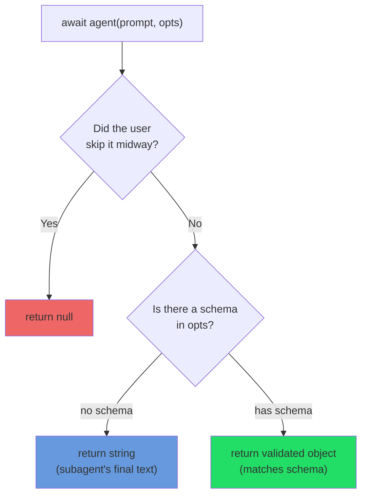
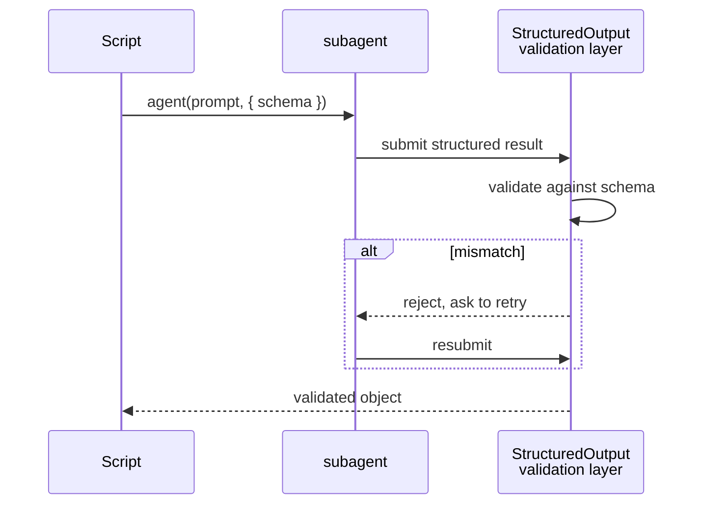
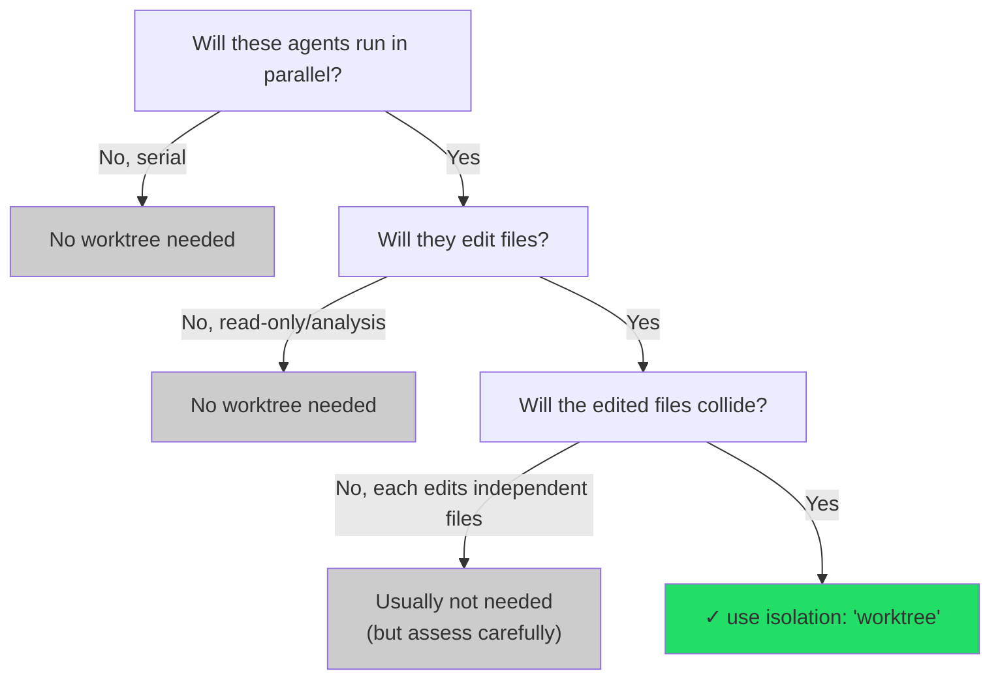
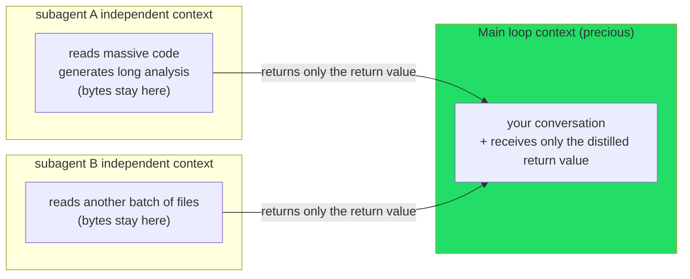

# Chapter 06 · The agent() Reference

> **The weft is the crosswise thread of weaving; threading through the warp, it makes the pattern, makes the design.**
>
> With the warp tensioned, what truly makes a bolt of cloth "grow a pattern" is that weft shuttling back and forth. In Workflow, this weft is `agent()` — it sends a subagent off to do one concrete job, waits for it to come back, and hands you the product.
>
> In the last chapter we took the structural skeleton of `meta` and `phase()` apart down to the bottom. This chapter puts its full gaze on `agent(prompt, opts)`: what exactly it returns (text? object? or `null`?), what problem each of its options (`label`, `schema`, `phase`, `model`, `isolation`, `agentType`) solves, and why the subagent it sends out can **protect your main loop's context.**
>
> This is the function you'll reach for most in the whole book. Master it, and all the later practical recipes are just different orchestrations of it.

---

## 6.1 Signature and Overview: One Sentence, Two Parameters

Per `_grounding.md` section B, checked against the official type definitions, `agent()`'s signature is:

```javascript
agent(prompt: string, opts?: object): Promise<any>
```

- First parameter `prompt`: a string telling the subagent "what to do."
- Second parameter `opts`: an optional options object that tunes this agent's behavior.
- Returns: a `Promise`; you `await` it to get the subagent's product.

All of `opts`'s fields, listed in a master table first, expanded one by one in this chapter:

| Option | Type | One-line role | Section |
|---|---|---|---|
| `label` | string | Display name in the progress tree (auto-numbered if omitted) | 6.3 |
| `schema` | JSON Schema | Force structured output, return a **validated object** | 6.4 |
| `phase` | string | Explicitly group into a progress group (essential in concurrency) | 6.5 |
| `model` | string | Override this agent's model (omit to inherit the main loop) | 6.6 |
| `isolation` | `'worktree'` | Run in an independent git worktree (**expensive**) | 6.7 |
| `agentType` | string | Use a custom subagent type (e.g., `'Explore'`) | 6.8 |

A minimal call, carrying no options at all, looks like this:

```javascript
const text = await agent('Summarize in one sentence what deterministic orchestration is')
```

It sends out a subagent, runs to completion, and returns **a piece of text.** This is `agent()` at its plainest. Let's first nail down the most crucial thing — "what it returns" — because what it returns decides how you write the code that follows.

---

## 6.2 Return Semantics: Text, Object, or null?

`agent()`'s return value has **three** possibilities, depending on how you call it and how the user responds. Mix these three up, and the `.filter()`, destructuring, and `JSON.parse` that follow all go wrong. Per `_grounding.md` section B, the rules are:



### 6.2.1 No schema → returns text (string)

Without a `schema`, `agent()` returns the subagent's **final text** — a string.

```javascript
const summary = await agent('Summarize this function in one sentence:\n' + codeSnippet)
// summary is a string, e.g.: "The function deduplicates the input array, sorts it lexicographically, and returns it."
log(summary)
```

This suits the "I just want a natural-language result" scenario: summary, explanation, drafting a piece of text. What you get is the last thing the subagent wrote.

### 6.2.2 Has schema → returns a validated object

Pass a `schema` (a JSON Schema), and `agent()` returns a **validated object**, strictly matching the structure you declared. This is Chapter 01's real `hello-workflow` example (Run ID `wf_dacbd480-d5d`):

```javascript
const r = await agent(
  'Return a one-sentence confirmation message, the integer value of 2+2, ' +
  'and a boolean confirming you ran as a workflow subagent.',
  {
    label: 'smoke',
    schema: {
      type: 'object',
      properties: {
        message: { type: 'string' },
        sum: { type: 'number' },
        runtimeConfirmed: { type: 'boolean' },
      },
      required: ['message', 'sum', 'runtimeConfirmed'],
    },
  }
)
```

**Real return value**:

```json
{
  "message": "The Claude Code Workflow runtime smoke test executed successfully as a workflow subagent.",
  "sum": 4,
  "runtimeConfirmed": true
}
```

Note `sum` is the number `4`, **not the string `"4"`** — because the schema declared `type: 'number'` and the validation layer locked the type down. You can do `r.sum + 1` arithmetic straight away, with no parsing and no error handling. This mechanism (and how it forces retries at the tool-call layer) is the subject of Chapter 07; here just remember: **has schema → you get a clean object you can destructure and compute on directly.**

### 6.2.3 User skips → returns null

The third case is the easiest to miss: **the user skips this agent midway** (say, choosing to skip a step in the interaction), and `agent()` returns `null`.

Per `_grounding.md`: "user skips the agent midway → returns `null` (filter with `.filter(Boolean)`)."

This is why all of this book's real `parallel()` / `pipeline()` examples nearly always put a `.filter(Boolean)` right after, before using the results:

```javascript
const results = await parallel(/* ... */)
return results.filter(Boolean)   // filter out the skipped nulls
```

`.filter(Boolean)` is an idiom: using `Boolean` as the filter function strips out every "falsy value" in the array (`null`, `undefined`, `0`, `''`, `false`). Here its job is to **clean out the skipped `null` items**, leaving only the ones with real results.

<div class="callout warn">

**Use it directly without `.filter(Boolean)`, and `null` will bite you.** If you `results.map(r => r.findings)` and some `r` is `null`, it throws `Cannot read properties of null`. Make it a habit: **for any `parallel` / `pipeline` result, `.filter(Boolean)` before you consume it.** A single `await agent(...)` is the same — if it might be skipped, check `if (r) { ... }` before use.

</div>

### 6.2.4 The three return values, quick reference

| How you call | User response | Return value | How to use |
|---|---|---|---|
| No `schema` | Normal | `string` | Use as text, or feed to the next agent |
| Has `schema` | Normal | Validated object | Destructure/compute directly, no parsing |
| Any | Skipped | `null` | Catch it with `.filter(Boolean)` or `if (r)` |

---

## 6.3 `label`: The Name in the Progress Tree

`label` is the simplest option: it changes this agent's **display name** in the `/workflows` progress tree. Omit it, and the runtime auto-numbers it (like `agent #3`); pass it, and the tree shows the label you gave.

```javascript
await agent('Review the permission-check logic in auth.ts', { label: 'review:auth' })
```

It's purely **for humans** and affects no execution behavior. But in a workflow that fans out dozens of agents, a good `label` is the difference between "reading the progress tree" and "staring blankly at a pile of `agent #1…#40`."

Look at how `label` gets used in the real-run `parallel-demo` (Run ID `wf_52957913-6d2`, see `assets/transcripts/primitives.md`) — it bakes the dimension name into the label, making the three concurrent agents clear at a glance on the tree:

```javascript
const dims = ['naming', 'error-handling', 'comments']
const results = await parallel(
  dims.map((d, i) => () =>
    agent(`Name one common ${d} code smell in exactly one sentence.`, {
      label: `smell:${d}`,        // ← smell:naming / smell:error-handling / smell:comments
      schema: { /* ... */ },
    })
  )
)
```

<div class="callout tip">

**A practical pattern for label: `type:instance`.** Naming like `review:auth.ts`, `smell:naming`, `verify:race-condition` — "prefix + colon + concrete object" — makes the progress tree cluster naturally into visual groups by prefix; one glance tells you "which are review, which are verify, and how far each has gotten." The three real runs in `assets/transcripts/primitives.md` (`smoke` / `smell:*` / `find:* / verify:*`) all use this pattern.

</div>

`label` (the display name) and the previous chapter's `phase` (which group it goes into) are two orthogonal things: `label` decides **what text is written on the leaf**, `phase` decides **which branch the leaf hangs on.** The next section is about `phase`.

---

## 6.4 `schema`: Turning an agent into a "Structured Data Source"

`schema` is `agent()`'s weightiest option, and one of the core capabilities that sets Workflow apart from "manually spinning up subtasks." We've already seen its return effect in 6.2.2; here we clarify its **mechanism** and **when to use it.**

### 6.4.1 What it does: enforce validation at the tool-call layer

Per `_grounding.md` section B:

> Has `schema` (JSON Schema) → forces the subagent to call the `StructuredOutput` tool, **validates at the tool-call layer**, returns a **validated object**; retries the model if it doesn't match.

Unpacking this sentence:

1. You pass a JSON Schema to `agent()`.
2. The runtime **forces** this subagent to deliver its result through an internal `StructuredOutput` tool (instead of writing free text).
3. The structure the subagent submits is validated against the schema at the **tool-call layer.**
4. **Doesn't match? The model is asked to retry**, until it conforms.
5. What you `await` is an object **guaranteed to match the schema.**



This means: **you can get type-safe structured data out of a language model without writing any parsing code or any error-handling branch.** In a world without a schema, you'd have to make the model "output JSON," then `JSON.parse` it yourself, `try/catch` it yourself, and clean up after "the model said one extra sentence of nonsense that broke the JSON parse" yourself — schema folds all of this into the runtime.

### 6.4.2 Minimal example

```javascript
const result = await agent('Analyze this code\'s cyclomatic complexity, give a number and a one-sentence verdict:\n' + code, {
  label: 'complexity',
  schema: {
    type: 'object',
    properties: {
      score: { type: 'number' },                    // cyclomatic complexity value
      verdict: { type: 'string' },                   // one-sentence verdict
      tooComplex: { type: 'boolean' },               // whether it exceeds the threshold
    },
    required: ['score', 'verdict', 'tooComplex'],
  },
})

// Use it directly as an object, types guaranteed:
if (result.tooComplex) {
  log(`⚠️ Complexity ${result.score} is high: ${result.verdict}`)
}
```

### 6.4.3 Arrays, nesting: schema can describe any structure

Schema isn't limited to flat objects. (Note: `pipeline-demo`'s first stage, Run ID `wf_bf086b98-6ec`, is actually a **single-field object** `{ example: string }` and uses **no** array — an array is just one of the more complex structures it could describe.) Here's a nested + array example (illustrative, not run) below:

```javascript
const review = await agent('Review this file, list all issues, each with severity and line number', {
  label: 'review:detailed',
  schema: {
    type: 'object',
    properties: {
      file: { type: 'string' },
      issues: {
        type: 'array',
        items: {
          type: 'object',
          properties: {
            severity: { type: 'string', enum: ['critical', 'warning', 'info'] },
            line: { type: 'number' },
            message: { type: 'string' },
          },
          required: ['severity', 'line', 'message'],
        },
      },
    },
    required: ['file', 'issues'],
  },
})

// review.issues is an array of objects, each guaranteed to have severity/line/message
const criticals = review.issues.filter(i => i.severity === 'critical')
log(`Found ${criticals.length} critical issues`)
```

<div class="callout tip">

**When should you pass a schema? The criterion is one question: do you intend to "consume" this product with code?** If later code will read its fields, drive conditional branches off it, or feed it into the next agent's prompt — pass a schema, get a clean object. If you just want a piece of natural language for a human (the prose of a final report, an explanation) — don't pass one, take the text. In a practical workflow, the intermediate stages almost always carry a schema (because they're chained programmatically); only the final "for a human" step might return plain text.

</div>

`schema` can also **combine** with `agentType` (6.8) — making a custom-typed subagent return structured data too. 6.8 spells that out. Schema's full power (`enum`, nested validation, the boundary of the retry mechanism) is the subject of Chapter 07.

---

## 6.5 `phase`: Explicit Grouping in Concurrent Scenarios

We covered the `phase` option in depth in Chapter 05, §5.5.1; here we nail it again from `agent()`'s angle, because it's the option **most easily missed when writing concurrent workflows — and the moment you miss it, the progress tree scrambles.**

Per `_grounding.md`: `opts.phase` "explicitly group into a progress group (especially important inside pipeline/parallel, to avoid racing the global `phase()`)."

**The core rule, in one sentence:**

- In **sequential code**, switching the current phase with the global `phase('X')` is enough; subsequent agents group in automatically.
- In **`parallel` / `pipeline`**, with multiple agents in flight, the global cursor gets raced, so you must pass `opts.phase: 'X'` to each `agent()`, **pinning** the grouping info **onto the agent itself.**

This is exactly how the real-run `pipeline-demo` is written (Run ID `wf_bf086b98-6ec`):

```javascript
const out = await pipeline(
  items,
  (kind) =>
    agent(`Give a one-line code example of a ${kind} bug.`, {
      label: `find:${kind}`,
      phase: 'Find',                 // ← pinned to Find, not relying on the global cursor
      schema: { /* ... */ },
    }),
  (found, kind) =>
    agent(`Is this genuinely a ${kind} bug? ...`, {
      label: `verify:${kind}`,
      phase: 'Verify',               // ← pinned to Verify
      schema: { /* ... */ },
    }).then((v) => ({ kind, ...found, ...v }))
)
```

The strings in `phase: 'Find'` / `'Verify'` must likewise **match `meta.phases[].title` exactly** (case, spaces, letter-for-letter) — the mechanism Chapter 05, §5.5 stresses over and over.

<div class="callout warn">

**The relationship between `opts.phase` and the global `phase()` isn't "either-or" but "prefer `opts.phase` in concurrency."** You can perfectly well write a `phase('Find')` before `pipeline` as a fallback, but what actually decides each concurrent agent's grouping is its own `opts.phase`. When both are present, **the `opts.phase` attached to the agent is the one you can trust**, because it's unaffected by concurrent interleaving.

</div>

---

## 6.6 `model`: Model Inheritance and Single-Point Override

The `model` option controls which model **this one agent** uses. It is the **only knob with clear official semantics, worth relying on** in Chapter 05 §5.6's model selection: omitted, it inherits the main loop model; given a value, it overrides that default. As Chapter 05 stressed: `meta.phases[].model`'s runtime effect is undetermined, so when you really want to set the model, rely on `opts.model` here. (The top-level `meta.model`'s auto-resolution relationship with the layers is unverified by the sources, see §5.6; this section covers only the confirmed `opts.model`.)

### 6.6.1 Default: inherit the main loop model

Per `_grounding.md`: `opts.model` "omitted, inherits the main loop model; simple tasks can use `'haiku'`." This is the only clearly-defined semantics for `model` in the tool definition — **omitted, it inherits the main loop.**

Write no `model`, and this agent uses the **main loop's current model.** This book's test-environment main loop is Opus 4.7, with the subagent model set by `CLAUDE_CODE_SUBAGENT_MODEL=claude-opus-4-7[1m]` (see `_grounding.md` section A). All the earlier real runs (`hello` / `parallel` / `pipeline`) passed **no** explicit `model`, so their subagents ran on the inherited Opus model too.

<div class="callout warn">

**Once set, `CLAUDE_CODE_SUBAGENT_MODEL` overrides every agent's `model`.** This is a **user/CI-level environment knob the script can't touch.** This book ran a dedicated probe (Run ID `wf_9c94951d-58c`) dispatching 5 agents with, respectively, `'haiku'` / `'inherit'` / `'opus'` / omitted / sitting in a phase whose `meta.phases[]` marked `model:'haiku'` — **all 5 ran as Opus**, because that session set `CLAUDE_CODE_SUBAGENT_MODEL=claude-opus-4-7[1m]` (a directly observed environment fact). Put another way: the `model` you write in the script **gets silently overridden by this env var.** This is exactly why Chapter 05 couldn't independently isolate `meta.phases[].model`'s standalone effect — it, together with `opts.model`, got masked by this knob. Conclusion: `opts.model` is the finest knob the script can control, but it **is not the final verdict** — the env var sits above it.

</div>

### 6.6.2 Use `'haiku'` to cut cost for simple tasks

When an agent's job is simple — classify, extract, format-convert, decide a boolean — a strong model is a waste. Drop it to `'haiku'`:

```javascript
// A lightweight task that only needs to "judge whether the input is a valid URL"
const check = await agent(`Is this a valid HTTP(S) URL? Answer only true or false: ${input}`, {
  label: 'url-check',
  model: 'haiku',                 // ← simple judgment, use the cheap model
  schema: {
    type: 'object',
    properties: { valid: { type: 'boolean' } },
    required: ['valid'],
  },
})
```

### 6.6.3 Why model choice relates directly to "money"

`_grounding.md` section C gives a key rule of thumb:

> token ≈ agent count × per-agent context (about 25k–30k/agent); wall clock depends on the critical path, concurrency compresses N down to "the slowest one."

Three real runs back this rule up (same session, see `assets/transcripts/primitives.md`):

| Workflow | agent_count | total_tokens | per agent ≈ |
|---|---|---|---|
| hello (single agent) | 1 | 26,338 | ~26.3k |
| parallel (3 concurrent) | 3 | 78,844 | ~26.3k (≈3×) |
| pipeline (3 items × 2 stages) | 6 | 158,982 | ~26.5k (≈6×) |

`78844 ≈ 3 × 26338`, `158982 ≈ 6 × 26500` — **total tokens are nearly linearly proportional to agent count**, with each agent steady at about 25k–30k tokens. The reason behind this (each agent is an independent context) gets explained shortly in 6.9.

The direct corollary: **the most effective lever for cutting cost is swapping the phase with "the most agents" to a cheap model.** If a workflow fans out 50 agents in some breadth phase, swapping them from opus to haiku saves "50 × the unit-price difference" — more immediately effective than optimizing anywhere else. This is precisely the economic rationale for Chapter 05 §5.6's "breadth phase haiku, depth phase opus" pattern.

<div class="callout info">

**`model` written on `agent()` vs. written on `meta.phases[]`.** Their semantics differ, and so does **their reliability**: `meta.phases[].model` is **declarative** (written on the warp, saying "this phase plans to use a certain model," helping the script reader see the cost structure), but **whether it takes effect on its own at runtime is undetermined** (see §5.3.3); `agent({ model })` is **imperative** (on the weft, **actually** deciding this one agent). The right combo in practice: mark the phase's intent on `meta.phases`, **and** put `model` on each `agent()` in that phase — one place "states the plan" for humans, the other "gives the order" so it actually takes effect. **Don't mark only phases without writing `model` on the agent.**

</div>

---

## 6.7 `isolation: 'worktree'`: Expensive but Sometimes Necessary Isolation

`isolation: 'worktree'` runs this agent in an **independent git worktree.** It is the **heaviest, most-to-be-used-with-caution** of `agent()`'s options.

### 6.7.1 What problem it solves

Picture a workflow: you want 5 agents to **concurrently** modify code, each on its own (say, fixing 5 different bugs separately, each editing files). If they all write files in the **same working directory**, they trample each other — A edits `utils.js`, B edits `utils.js` too, git state and file content pollute each other, and the result is unpredictable.

`isolation: 'worktree'` gives each such agent its **own git worktree** (same repository, independent working directory) where it edits files without stepping on the others. Per `_grounding.md`:

> `opts.isolation: 'worktree'` runs in an independent git worktree (**expensive**, use only when parallel file edits would collide, auto-cleaned if no changes).

```javascript
// illustrative, not run: 5 agents fix different bugs in parallel, each writing files in its own worktree
const fixes = await parallel(
  bugs.map((bug, i) => () =>
    agent(`Fix this bug and directly modify the relevant files: ${bug.description}`, {
      label: `fix:${bug.id}`,
      isolation: 'worktree',        // ← each its own worktree, parallel file writes don't collide
    })
  )
)
```

### 6.7.2 Why it's called "expensive"

"Expensive" isn't rhetoric. Creating a git worktree involves real disk operations and git overhead. Combined with the magnitude given in this book's writing context: **each worktree starts at about 200–500ms, plus per-agent disk usage.** Add `isolation: 'worktree'` to all 50 agents, and this overhead piles up into considerable latency and disk consumption.

So the criterion for use is dead clear — **use it only when all three conditions "parallel + edits files + would collide" hold at once:**



### 6.7.3 Auto-cleanup

A thoughtful detail: `_grounding.md` states "**auto-cleaned if no changes.**" That is, if an agent with `isolation: 'worktree'` finishes having **produced no file changes**, the runtime automatically cleans up that temporary worktree, leaving no garbage behind. This lowers the cleanup cost of "added a worktree but it turned out unnecessary" — but it **cannot** be a reason to "add worktrees casually," because you've already paid the creation overhead.

<div class="callout warn">

**Don't add `isolation: 'worktree'` by default.** The vast majority of agents do **read-only analysis** (review, research, summarize, judge) — they don't write files at all, so there's no collision, and adding a worktree is pure waste. Even when they do write files, as long as each agent writes **mutually unrelated independent files**, isolation is usually unneeded. This option is an escape hatch built for the **specific** scenario of "parallel modification that would collide," not standard equipment. The full pattern and trade-offs of worktree isolation are the subject of Chapter 19.

</div>

---

## 6.8 `agentType`: Borrowing a Custom subagent Type

`agentType` makes this agent skip the default generic subagent and adopt a **named custom type** instead. Per `_grounding.md`:

> `opts.agentType` uses a custom subagent type (e.g., `'Explore'`, `'code-reviewer'`, combinable with schema).

### 6.8.1 What problem it solves

The Claude Code ecosystem has some **preconfigured subagent types** — each carries a specific system prompt, toolset, or behavioral orientation. For example:

- `'Explore'`: good at open-ended exploration/retrieval in a codebase.
- `'code-reviewer'`: oriented toward code review, with a review-leaning system prompt.

When you want an agent to **act in a certain specialized role** rather than start from a generic subagent, name it with `agentType`:

```javascript
// Use the Explore type for codebase exploration
const findings = await agent('Find all entry points handling user authentication in the codebase', {
  label: 'explore:auth',
  agentType: 'Explore',           // ← borrow the Explore type's exploration ability
})
```

### 6.8.2 Combining with `schema`

`agentType` and `schema` **can be used together** — specifying both the agent's "role type" and constraining its "output structure":

```javascript
// illustrative, not run: review with the code-reviewer type and force structured output
const review = await agent('Review this diff and report issues', {
  label: 'review:typed',
  agentType: 'code-reviewer',     // ← use the reviewer type
  schema: {                       // ← also constrain the output structure
    type: 'object',
    properties: {
      issues: { type: 'array', items: { type: 'string' } },
      verdict: { type: 'string', enum: ['approve', 'request-changes'] },
    },
    required: ['issues', 'verdict'],
  },
})
// review is both produced by the code-reviewer role and guaranteed to match the schema
```

This combination is powerful: `agentType` decides "**who** does it, with what orientation," `schema` decides "what the product **looks like.**" The two are orthogonal — mix them however you like.

### 6.8.3 `agentType` Is Validated (empirically) — a Wrong Value Throws Before Any Model Is Spawned

This is a fact this book **confirmed hands-on** (Run ID `wf_a222f20f-0f5`): pass a nonexistent value to `agentType`, and the runtime throws **before spawning any model** (0 tokens / 4 ms) and **lists every available agent.** The probe caught this error with `try/catch` and returned it; the error text, verbatim, is:

```text
agent({agentType}): agent type 'definitely-not-a-real-agent-xyz' not found.
Available agents: claude, claude-code-guide, codex:codex-rescue, Explore,
general-purpose, get-current-datetime, init-architect, Plan, planner,
statusline-setup, team-architect, team-qa, team-reviewer, ui-ux-designer
```

Two directly usable facts: first, **a typo or a nonexistent type isn't silently swallowed** but errors immediately and explicitly — so `agentType` problems are easy to diagnose; second, the error message **comes with a "list of available types"**, effectively having the runtime enumerate every agent registered in the current environment for you.

<div class="callout warn">

**`agentType` is empirically validated, while whether `model` is validated is only a third-party claim.** This is a **well-grounded contrast**:
- **`agentType`** — **confirmed validated by this book** (`wf_a222f20f-0f5`): an unknown value throws at 0 tokens before any model is spawned, and lists the available types.
- **`model`** — the official definition only states "omitted, inherits the main loop." As for "it does **not** validate, a typo (like `'hauku'`) doesn't error at parse time but passes through and only fails later" — that's a **third-party claim this book has not independently tested**, so we don't treat it as an established fact.

What this means in practice: when you write `agentType`, a typo gets caught on the spot by the runtime; but when you write `model`, **don't count on the runtime to catch your typo** — get the model name right, or always pick it from a fixed set of constants.

</div>

<div class="callout info">

**Which values `agentType` accepts depends on your environment.** The list above (`claude` / `Explore` / `planner` / related types…) is a registry snapshot of **this book's tested session** (`wf_a222f20f-0f5`); which types you can actually use depends on Claude Code's built-ins and the custom subagents you define in the project (e.g., `.claude/agents/`), and **varies by environment.** Without `agentType`, the default generic subagent is used (its internal type name is `workflow-subagent`) — the rest of this chapter's real-run examples are this default case. The fastest way to learn which types exist in your own environment is to deliberately pass a nonexistent value and read the list its error spells out.

</div>

---

## 6.9 Context Isolation: Why agent() Can "Protect the Main Loop"

Having covered all the options, let's come back to a core question running through the book: **why does fanning out work with `agent()` protect your main loop's context?**

The answer hides in one fact from `_grounding.md`:

> The subagent is told "the final text is the return value" (not words for a human), so it returns raw data.

And in the **strong hint** that rule of thumb gives: since the real data consistently shows `total_tokens ≈ agent_count × per-agent context` (the section-C rule of thumb), **the most natural explanation is that "each agent runs in its own independent context"** — this section proceeds on that inference. (Note: this is a reasonable explanation inferred back from the token rule of thumb, not a verified internal API mechanism; at the tool-definition level, only "the subagent's final text is the return value" and each one's output counting toward the total tokens are confirmed.)

### 6.9.1 What independent context means

Set it against the main loop:

- Your **main loop** has a context window that keeps growing with the conversation. Every large file read, every command that produces long output — those bytes **permanently reside** in the main loop's context, crowding out later reasoning space.
- Whereas each subagent `agent()` sends out runs in **its own independent context.** It read 100,000 lines of code, generated a big chunk of analysis — those bytes all stay in **its own** context. Once it finishes, **only its return value** (that text or validated object) comes back to your main loop.



This is the essence of `agent()`'s "context protection": **isolate the "process bytes" that would pollute the main loop (the raw material read, the intermediate reasoning) in the subagent's one-off context, and let only the "result bytes" (the distilled return value) flow back.** A question that takes reading 20 files to answer — you needn't read those 20 files into the main loop; send an agent off to read and think, and it brings back only the answer.

### 6.9.2 The "final text is the return value" design

An ordinary subtask returns a piece of writing **for a human** ("Sure, I've looked it over for you; this file mainly does…"). But a Workflow subagent is told outright: **your final output is the program's return value, not pleasantries for a human.** Per `_grounding.md`:

> The subagent is told "the final text is the return value" (not words for a human), so it returns raw data.
> Structured output is validated at the tool-call layer; the model retries if non-conforming.

So:

- **Without a schema**, the subagent returns "raw data" as the final text (rather than courtesies) — the string you get is the usable result itself.
- **With a schema**, it goes through the `StructuredOutput` tool and returns a strictly matching object.

This design makes `agent()`'s return value **fit for a program to consume** rather than for a human to read — the prerequisite for it to be a "building block of deterministic orchestration."

<div class="callout tip">

**A practical corollary: hand agents the "re-read, re-think" dirty work.** Any task that "takes swallowing a large context to reach a small conclusion" — reading through a big module, scanning a batch of logs, studying a long document — is a good fit to toss to `agent()`. It digests the raw material in an independent context and brings only the conclusion back to the main loop. This is precisely why, during large-scale `parallel` / `pipeline` fan-out, the main loop's context barely grows — and the fundamental advantage of Workflow over "reading hard in the main loop."

</div>

---

## 6.10 Combining Options: Using Them Together

Real `agent()` calls often use multiple options **at once.** The example below (illustrative, not run) packs in this chapter's options as much as it can and marks the intent of each:

```javascript
const review = await agent(
  `Review this shard's code quality, list issues: ${shard}`,
  {
    label: `review:${shard}`,        // 6.3 progress-tree display name
    phase: 'Review',                 // 6.5 explicit grouping in concurrency (matches meta.phases exactly)
    model: 'opus',                   // 6.6 this step wants quality, use the strong model (per-call override)
    agentType: 'code-reviewer',      // 6.8 use the reviewer type
    schema: {                        // 6.4 force structured output, return a validated object
      type: 'object',
      properties: {
        issues: {
          type: 'array',
          items: {
            type: 'object',
            properties: {
              severity: { type: 'string', enum: ['critical', 'warning', 'info'] },
              message: { type: 'string' },
            },
            required: ['severity', 'message'],
          },
        },
      },
      required: ['issues'],
    },
    // Note: there is [no] isolation here — review is read-only analysis, doesn't write files, no worktree needed (6.7)
  }
)

// Because there's a schema, review is a validated object, consumable directly:
const blockers = (review?.issues ?? []).filter(i => i.severity === 'critical')
```

Walking through this combination's decisions item by item:

| Option | Value here | Why |
|---|---|---|
| `label` | `review:${shard}` | Use the "type:instance" pattern, readable progress tree (6.3) |
| `phase` | `'Review'` | This is concurrent review, must group explicitly (6.5) |
| `model` | `'opus'` | Review wants quality, use the strong model (6.6) |
| `agentType` | `'code-reviewer'` | Borrow the review-oriented type (6.8) |
| `schema` | nested object + enum | The product will be filtered for critical by code, needs structure (6.4) |
| `isolation` | **not set** | Read-only analysis, doesn't write files, no collision risk (6.7) |

This table is itself a demonstration of "how to choose agent options": **every option should have a clear "why used / why not," rather than being piled on by feel.** Especially `isolation` — its "not set" is just as much a conscious decision as the others' "set."

---

## 6.11 Chapter Summary

- **`agent(prompt, opts)`** dispatches a subagent to execute `prompt`, and `await` returns its product; it's the most-used function in the whole book (6.1).
- **Three return semantics**: no `schema` → text `string`; has `schema` → **validated object** (directly destructure/compute); user skips → `null` (so `.filter(Boolean)` `parallel`/`pipeline` results before consuming) (6.2).
- **`label`** is the progress-tree display name; the "type:instance" pattern (like `review:auth`) is most readable; affects no execution (6.3).
- **`schema`** forces the subagent through the `StructuredOutput` tool, validates at the tool-call layer, retries if it doesn't match, letting you get structured data with **zero parsing, zero error handling**; the criterion is "will the product be consumed by code" (6.4).
- **`phase`** explicitly groups into a progress group; sequential code uses the global `phase()`, **concurrency (`parallel`/`pipeline`) must use `opts.phase`** to avoid racing the global cursor; the string must match `meta.phases[].title` exactly (6.5).
- **`model`** omitted inherits the main loop (this book's tested session is Opus 4.7); simple tasks use `'haiku'` to cut cost. **It's the finest knob the script can control, but not the final verdict** — once set, `CLAUDE_CODE_SUBAGENT_MODEL` overrides every agent's `model` (`wf_9c94951d-58c`: all 5 agents Opus); whether `meta.phases[].model` works on its own is undetermined, and the top-level `meta.model`'s semantics are to be verified (see §5.3.3, §5.6). Confirmed by real data, **token ≈ agent count × per-agent context (~25k–30k)**, so swapping the most-fanned-out phase to a cheap model is the most effective cost-cutting lever (6.6).
- **`isolation: 'worktree'`** gives an agent an independent git worktree, **expensive** (each ~200–500ms + disk), use **only when all three conditions "parallel + edits files + would collide" hold**, auto-cleaned if no changes (6.7).
- **`agentType`** borrows a custom subagent type (like `'Explore'`, `'code-reviewer'`), deciding the agent's role orientation, **combinable with `schema`**; **empirically validated** (`wf_a222f20f-0f5`): an unknown value throws at 0 tokens before any model is spawned and lists the available types — a contrast with whether `model` is validated, which is only a third-party claim (6.8).
- **Context isolation** is the soul of `agent()`: each subagent has an independent context, returning only the **return value** to the main loop, isolating the "process bytes" in a one-off context — this is precisely why it **protects the main loop's context** and can fan out at scale (6.9).

The single thread of the weft — `agent()` — we've now followed to its end. But one thread weaves no pattern. In the next chapter, we dig into its weightiest option, `schema`, to see how "structured output" pulls a crowd of subagents that each speak their own way into a data pipeline that code can reliably consume.

> Continue reading: [Chapter 07 · Structured Output & Schema](#/en/p2-07)
