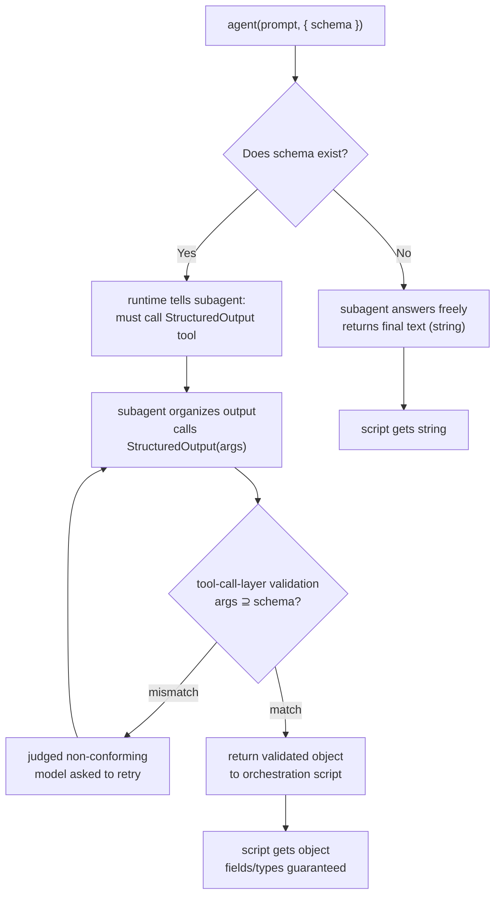
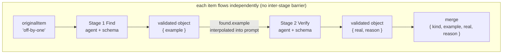

# Chapter 07 · Structured Output & Schema

> In one sentence: **pass `agent()` a `schema`, and the runtime forces this subagent to call the internal `StructuredOutput` tool, validates the return value at the tool-call layer, and makes the model retry if it doesn't conform — finally handing you an object guaranteed to be structurally correct.**
>
> This is the dividing line between Workflow and "let the model freestyle, then dig the data out with regex." This chapter spells that line out in full: what real problem it solves, what the runtime actually does, how to design a schema, how schema-shaped data flows between pipeline stages, and which pitfalls turn your "validation" into "repeated retries that burn tokens."

---

## 7.1 The World Without Schema: Parsing Hell

Let's start with a pain point anyone who's used an LLM for automation knows well.

Suppose you want a subagent to "find all the bugs in this code, giving each a file, line number, severity, and description." Without a schema, all you can do is **beg it in plain English** in the prompt to reply in some format:

```javascript
// (illustrative, not actually run) — the typical "no schema" style
const text = await agent(
  'Review this code and list all bugs. Output strictly in the following format, one per line:\n' +
  'FILE | LINE | SEVERITY | DESCRIPTION\n' +
  'No extra explanation.'
)
// Now text is a string, and you must parse it yourself…
const findings = text
  .split('\n')
  .filter((line) => line.includes('|'))
  .map((line) => {
    const [file, line_, severity, desc] = line.split('|').map((s) => s.trim())
    return { file, line: Number(line_), severity, desc }
  })
```

This code looks like it runs, but it's **appallingly fragile.** Anyone who's actually run it knows what comes next:

- The model prefixes "Sure, here are the issues I found:" — your `filter` misses it, but what if that line also has a `|` in it?
- The model writes `LINE` as `line 42` or `42-45`, and `Number('line 42')` turns into `NaN`.
- The model takes it upon itself to localize `SEVERITY` to "High" in another language, and all your downstream `if (severity === 'high')` checks break.
- The model decides a certain bug "needs detail" and stuffs a Markdown list with newlines into `DESCRIPTION` — your `split('\n')` collapses on the spot.
- Nine times out of ten it's perfect; the tenth time it hands back JSON wrapped in a ```` ```json ```` code block, because it "felt that was more professional."

So you start writing defensive code: trim, regex, try/catch, fallback defaults, field-alias mapping… **the parsing and error-handling code you write will soon be longer than the business logic itself.** And every field you add, every model you swap, you have to come back and re-tune this parser.

<div class="callout warn">

**This is the root flaw of the "free text + post-hoc parsing" approach**: you put "guarantee the data structure is correct" **after the model's output.** And the model's output is out of your hands — you're forever patching "how the model will disobey this time." Structured output **moves this forward** to the moment the model generates, enforced by the runtime.

</div>

---

## 7.2 One Line of `schema` Changes Everything: Starting from a Real Smoke Test

The fastest way to get structured output is to watch it **actually run.** This book's first real-run Workflow — the `hello-workflow` smoke test — was built precisely to verify this.

It asks a subagent to return three things: a one-sentence confirmation message (string), the integer value of `2+2` (number), and a boolean confirming it ran in a workflow. Here's the core of the script:

```javascript
phase('Greet')
const r = await agent(
  'You are a smoke test for the Claude Code Workflow runtime. Return a one-sentence ' +
  'confirmation message, the integer value of 2+2, and a boolean confirming you ran ' +
  'as a workflow subagent.',
  {
    label: 'smoke',
    schema: {
      type: 'object',
      properties: {
        message: { type: 'string' },
        sum: { type: 'number' },
        runtimeConfirmed: { type: 'boolean' },
      },
      required: ['message', 'sum', 'runtimeConfirmed'],
    },
  }
)
```

Hand it to the Workflow tool to run, and the **real** return value is (source: `assets/transcripts/primitives.md`, Run ID `wf_dacbd480-d5d`):

```json
{
  "message": "The Claude Code Workflow runtime smoke test executed successfully as a workflow subagent.",
  "sum": 4,
  "runtimeConfirmed": true
}
```

Lock your eyes on `"sum": 4`.

It's the **number `4`**, not the string `"4"`. That's not luck, and it's not "the model happened to behave this time." The `schema` declared `sum: { type: 'number' }`, and the runtime's validation layer made sure the **type is correct** before letting it through. Once you have `r`, you can go straight to `r.sum + 1` and get `5`, without first `Number(r.sum)` and then praying it isn't `NaN`.

Next to the previous section's parsing hell, the difference here is a **qualitative leap**:

| Dimension | Free text + post-hoc parsing | `agent({ schema })` |
|---|---|---|
| Who guarantees correct structure | The parser you write (after the model) | The runtime validation layer (at the model's generation) |
| Type | All strings, need manual conversion | Guaranteed by schema (number is number) |
| Missing field | The parser gets `undefined`, may silently fail | required missing → validation fails → model retries |
| Model "rambling" / prefixing | Pollutes parsing, needs trim/regex | Doesn't matter — the return is the tool call's structured arguments |
| Swap model / add field | Re-tune the parser | Just change the schema |
| Error-handling code you write | A lot | **Zero** |

The last row is the point: **the orchestrator (your script) gets a structure-guaranteed object, with no parsing or error-handling code needed.** This is exactly what lets Workflow do "deterministic orchestration" — downstream stages can confidently do `r.findings.length`, `r.verdict === 'confirmed'`, because whether those fields exist and what type they are is already guaranteed by the runtime.

---

## 7.3 What the Runtime Actually Does: StructuredOutput and Retry

Behind the word "validation," what exactly does the runtime do? This mechanism is backed both by the **official tool definition** and by **this book's own measurements** (see `_grounding.md`); the flow goes like this:

1. When `agent()` carries a `schema`, the runtime **forces** this subagent to call an internal tool — `StructuredOutput`. The subagent no longer "writes a paragraph as the final answer"; instead it must **call this tool** with the answer as arguments (official).
2. The tool's argument schema is exactly the JSON Schema you passed in. So validation happens at the **tool-call layer**: the arguments the model fills must match the schema, or that tool call is judged non-conforming (official).
3. What if it doesn't match? **The model is asked to retry** — reorganize the output and call `StructuredOutput` again, until the arguments conform (the official description says "the model retries if it doesn't match"; **the exact retry count is not something this book measured**, see the note below).
4. Once conforming, the runtime hands this tool call's arguments back to your script **as a validated object.** That means `agent()` gives you a **validated object** directly — you can `r.field` the moment you get it, with **no `JSON.parse`** and no error handling needed.



**"Returns a validated object" isn't just an official claim — every schema-bearing run in this book confirmed it.** The hello smoke test (`wf_dacbd480-d5d`), parallel-demo (`wf_52957913-6d2`), pipeline-demo (`wf_bf086b98-6ec`) — every `agent()` call carrying a `schema` got back an object with all fields present and the types correct (the real return values later in this chapter show each one). So "with a schema → you get a validated object" is nailed down **both officially and by measurement.**

<div class="callout info">

**On the boundary of "retry," keep "official behavior" separate from "third-party claim."** The official definition states only the **behavior**: the model retries on a mismatch, until it conforms. As for the **implementation details and the exact count** — community third-party material (a YouTuber's repo, not official) claims: the runtime compiles your schema with **AJV**, `StructuredOutput`'s argument schema is that schema, and when a subagent **never calls** the tool it "fails after up to two more nudges." **These points (AJV, two nudges) this book has not independently verified; we record the claim and do not treat it as fact.** So this book does **not** assert any exact retry count; the only hard boundary you can safely rely on is the official **budget cap** (calling `agent()` after `spent()` reaches `total` throws, see Chapter 09) — no matter how many retries, they won't cross that budget gate.

</div>

Two design details are worth calling out on their own; they explain "why a Workflow subagent's output differs from what you usually see in chat":

**First: the subagent is told outright that "the final product is the return value, not words for a human."** Per `_grounding.md`'s "subagent behavior" section, the subagent knows its output will be **consumed by a program**, so it returns raw data, not pleasantries like "Sure, I've analyzed it for you…." Even without a schema, the plain-text return is "the goods," not small talk.

**Second: validation is at the tool-call layer, so the model "can't ramble even if it wants to."** In ordinary conversation, the model can preface its answer with a pile of setup; but `StructuredOutput` is a structured tool call — arguments are arguments, with no room for natural-language asides. This wipes out, at the mechanism level, the entire class of "model prefixing pollutes parsing" problems from §7.1.

<div class="callout info">

**An often-overlooked corollary: schema turns "format compliance" from a probability problem into a determinism problem.** Without a schema, "will the model reply in format" is a probabilistic event — 99% but not 100%. With a schema, the runtime uses the "retry if non-conforming" loop to **push this probability toward 100%**: either it finally returns a conforming object, or (in the extreme) it fails by exhausting this turn's budget, but you **will never** get an object that "looks right but actually has missing fields / wrong types." This "usable the moment you receive it" guarantee is exactly what deterministic orchestration needs.

</div>

---

## 7.4 Schema Design Patterns: From Minimal to Production-Grade

JSON Schema itself is a mature spec, but in Workflow you only need a few high-frequency constructs. Below we layer up from the minimal example, each with a template you can use directly. **Those marked with a Run ID come from real runs; the rest are marked "(illustrative, not actually run)."**

<div class="callout tip">

**First, a placement rule: a schema goes in the script body, passed as `agent()`'s `opts.schema` — not inside `meta`.** `meta` must be a **pure literal** (read statically before the run; no variables or function calls, see `_grounding.md`); it governs the workflow's name, description, and phases. A schema, by contrast, is the per-`agent()`-call "output contract" — it varies per call and can be reused via a constant (as below, where schemas are pulled into a `const` and referenced in several places). Keeping the two apart saves you the "why does putting a schema in meta error out" confusion.

</div>

### Pattern 1: flat object + required (the most-used cornerstone)

The most basic form: an object, a few scalar fields, with `required` declaring which ones must appear. `hello-workflow` is exactly this (Run ID `wf_dacbd480-d5d`):

```javascript
schema: {
  type: 'object',
  properties: {
    message: { type: 'string' },
    sum: { type: 'number' },
    runtimeConfirmed: { type: 'boolean' },
  },
  required: ['message', 'sum', 'runtimeConfirmed'],
}
```

<div class="callout tip">

**`required` is your most important lever.** Any field not listed in `required` can be dropped by the model — and then downstream you're back to writing `if (r.foo !== undefined)`. List every field your downstream reads unconditionally into `required`, so a "missing field" triggers a retry directly instead of leaking `undefined` into your script. This is the key step from "validation" to "guarantee."

</div>

### Pattern 2: single-field object (a lightweight pipeline product)

Sometimes a stage only needs to produce one thing. In the real `parallel-demo`, each agent returns a single code smell (Run ID `wf_52957913-6d2`):

```javascript
schema: {
  type: 'object',
  properties: { smell: { type: 'string' } },
  required: ['smell'],
}
```

Note: **even with just one field, prefer wrapping it in an object over a bare string.** It makes later extension easier (adding fields won't break callers), and the object form makes `StructuredOutput`'s semantics clearer. Of course, if you genuinely just want a piece of text, taking a string without a schema is perfectly fine too — the trade-off is in §7.7.

### Pattern 3: enum (converge a "verdict" to a finite set of values)

This is one of the places structured output earns its keep most. When you want a subagent to make a "judgment," **never** let it freestyle the wording; use `enum` to pin the answer to a finite set:

```javascript
// (illustrative, not actually run) — a typical "verdict" schema in adversarial verification
schema: {
  type: 'object',
  properties: {
    verdict: { type: 'string', enum: ['confirmed', 'refuted', 'uncertain'] },
    confidence: { type: 'number' },
    reasoning: { type: 'string' },
  },
  required: ['verdict', 'confidence', 'reasoning'],
}
```

With `enum`, downstream you can confidently write `if (r.verdict === 'confirmed')`, without worrying whether the model returned `'Confirmed'`, `'CONFIRMED'`, a localized word, or `'I confirm this'`. **Enum turns branch logic into a reliable state-machine transition** — a core weapon in Part IV's "Adversarial Verification."

### Pattern 4: boolean gate field (let the script route on it)

A boolean field is the cheapest "gate" in a pipeline. The real `pipeline-demo`'s second stage uses `real: boolean` to say "is this bug genuine" (Run ID `wf_bf086b98-6ec`):

```javascript
schema: {
  type: 'object',
  properties: {
    real: { type: 'boolean' },
    reason: { type: 'string' },
  },
  required: ['real', 'reason'],
}
```

Once it has the result, the orchestration script can route on it: `results.filter((r) => r.real)` keeps only the confirmed items. **Boolean gate + array filter** is the most common "closing" combo in Workflow.

### Pattern 5: array (a list of findings, "multiple products")

When a subagent must return **a set** of things (multiple bugs, multiple references, multiple suggestions), use `array`, with `items` describing the structure of each element:

```javascript
// (illustrative, not actually run) — a sharded-review agent returns a set of findings
schema: {
  type: 'object',
  properties: {
    findings: {
      type: 'array',
      items: {
        type: 'object',
        properties: {
          file: { type: 'string' },
          line: { type: 'number' },
          severity: { type: 'string', enum: ['low', 'medium', 'high', 'critical'] },
          description: { type: 'string' },
        },
        required: ['file', 'line', 'severity', 'description'],
      },
    },
  },
  required: ['findings'],
}
```

Look back at §7.1's "parsing hell" — this is exactly what it was trying to do. But here, **every finding's `line` is guaranteed to be a number, `severity` guaranteed to be one of those four enum values, and not one of the four fields will go missing.** You get `r.findings` and can directly `.filter()`, `.sort((a, b) => severityRank[b.severity] - severityRank[a.severity])`, `.length`. Those dozens of lines of defensive code from §7.1 are **not needed at all** here.

### Pattern 6: nested object (a composite product with metadata)

Production-grade products often need to be layered — e.g., a review report with both a summary and details:

```javascript
// (illustrative, not actually run) — nested: summary metadata + findings details
schema: {
  type: 'object',
  properties: {
    summary: {
      type: 'object',
      properties: {
        totalIssues: { type: 'number' },
        highestSeverity: { type: 'string', enum: ['low', 'medium', 'high', 'critical'] },
        reviewedFiles: { type: 'number' },
      },
      required: ['totalIssues', 'highestSeverity', 'reviewedFiles'],
    },
    findings: {
      type: 'array',
      items: {
        type: 'object',
        properties: {
          file: { type: 'string' },
          severity: { type: 'string', enum: ['low', 'medium', 'high', 'critical'] },
          description: { type: 'string' },
        },
        required: ['file', 'severity', 'description'],
      },
    },
  },
  required: ['summary', 'findings'],
}
```

A nested object lets you get a structured "report + details" in a **single** agent call; downstream can both `r.summary.highestSeverity` for quick routing and iterate `r.findings` for fine-grained handling.

Below, the six patterns boiled down into one quick-reference table:

| Pattern | Key construct | Typical use | Real backing |
|---|---|---|---|
| Flat object + required | `type:'object'` + `required` | The cornerstone of everything | hello `wf_dacbd480-d5d` |
| Single-field object | One property | Lightweight pipeline product | parallel `wf_52957913-6d2` |
| enum | `enum:[...]` | Verdict/classification, pin the values | (illustrative, not run) |
| Boolean gate | `type:'boolean'` | Gate + array filter | pipeline `wf_bf086b98-6ec` |
| Array | `type:'array'` + `items` | Findings, multiple products | (illustrative, not run) |
| Nested object | object within object/array | Report + details | (illustrative, not run) |

---

## 7.5 How Schema-Shaped Data Flows Through a Pipeline

The real power of structured output isn't in a single agent, but in **how it lets data flow safely between stages.** That's exactly the design premise behind `pipeline()`.

Recall the real `pipeline-demo` (Run ID `wf_bf086b98-6ec`, `agent_count=6`): 3 bug types, each flowing independently through two stages — Find (produce a candidate bug example) → Verify (adversarially check whether it's genuinely a bug).

```javascript
const items = ['off-by-one', 'null-dereference', 'race-condition']
const out = await pipeline(
  items,
  // Stage 1 Find: produces { example }
  (kind) =>
    agent(`Give a one-line code example of a ${kind} bug.`, {
      label: `find:${kind}`, phase: 'Find',
      schema: {
        type: 'object',
        properties: { example: { type: 'string' } },
        required: ['example'],
      },
    }),
  // Stage 2 Verify: consumes the previous stage's example, produces { real, reason }
  (found, kind) =>
    agent(
      `Is this genuinely a ${kind} bug? Example: "${found.example}". Reply boolean + short reason.`,
      {
        label: `verify:${kind}`, phase: 'Verify',
        schema: {
          type: 'object',
          properties: { real: { type: 'boolean' }, reason: { type: 'string' } },
          required: ['real', 'reason'],
        },
      }
    ).then((v) => ({ kind, ...found, ...v }))
)
return out.filter(Boolean)
```

Look at the first line of the stage-2 callback — `found.example`. What happens here is the whole point of this section:

**Stage 1's schema-shaped product (an object guaranteed to have an `example` field) is fed straight into stage 2.** Stage 2's callback signature is `(found, kind)` — `found` is the validated object stage 1 returned, `kind` is the `originalItem`. Because stage 1's schema guaranteed `example`'s existence and type, stage 2 can **without any worry** interpolate `found.example` into its own prompt, as "the evidence to be checked."

Imagine what would happen if stage 1 returned free text. Stage 2 would first have to parse that text, pull out the code example, and handle all sorts of format quirks — which is exactly the parsing hell you'd repeat **between every pair of adjacent stages.** Schema does away with it entirely: **each stage's output is an input the next stage can use directly as an object.**

The real return value confirms the integrity of this data chain (excerpt):

```json
[
  {
    "kind": "off-by-one",
    "example": "for i in range(len(arr)): print(arr[i+1])  # ...out of bounds",
    "real": true,
    "reason": "Genuine off-by-one bug... raising IndexError..."
  }
]
```

Note the final object carries `kind` (from originalItem), `example` (stage-1 product), and `real`/`reason` (stage-2 product) all at once — done by `.then((v) => ({ kind, ...found, ...v }))` merging the three within the stage. **This is the minimal complete example of "structuring findings with a schema so you can run adversarial verification afterward"**: the Find stage produces a structured "finding," the Verify stage consumes it and produces a structured "verdict." Part IV extends this two-stage skeleton into a complete adversarial-verification pipeline.



<div class="callout tip">

**Remember this mantra: in Workflow, a schema isn't just "validate the output," it's "define the contract between stages."** An upstream agent's schema is the interface a downstream agent can lean on. When you design a multi-stage pipeline, think through each stage's schema (i.e., its "contract") first, and the joints between stages become as natural as calling ordinary functions — the previous function's return type is the next function's parameter type.

</div>

<div class="callout tip">

**A joining trick: `JSON.stringify` the upstream object into the downstream prompt.** The example above interpolated only a single scalar, `found.example`; when you need to pass an **entire validated object** (multi-field, nested) to the next stage, the most robust form is to splice `JSON.stringify(found)` into the next `agent()`'s prompt string — the downstream model reads it as JSON, with less ambiguity from newlines/quotes. This is the same trick as §7.6's `JSON.stringify(report)`: **the orchestration script serializes structured data into the prompt, and the downstream agent consumes it as input.**

</div>

---

## 7.6 Pitfalls and Best Practices

Structured output is powerful, but used poorly it goes from "helper" to "stumbling block." Below are several disciplines to keep firmly in mind, most of them direct corollaries of the "schema is validated at the tool-call layer + retry if non-conforming" mechanism.

### Pitfall 1: an over-strict schema → repeated retries, burning tokens and slowing down

The cost of a validation failure is a **retry.** If your schema sets the model a bar it can barely clear in one go, the model will retry over and over, until it conforms or burns through the budget.

Common shapes of "over-strict":

- An `enum` limits a set of values, but the prompt doesn't spell out what each value means, and the model can't guess right.
- A field's semantics are vague (e.g., you want a `score: number` but don't say whether the range is 0–1 or 0–100), and the value the model gives gets judged unreasonable downstream.
- You demand a giant object with deep nesting and a huge number of fields, which the model struggles to get fully right in a single generation.

<div class="callout warn">

**Retries aren't free.** Recall the real usage: a single agent's round-trip is about 26k tokens, 5.5 seconds (hello, `wf_dacbd480-d5d`). Every extra retry costs approximately another such round. An agent that should have succeeded in one go, retrying three or four times, multiplies both tokens and wall clock. A schema's "strictness" should go into constraints **downstream genuinely depends on**, not into making trouble for the model.

</div>

### Best practice 1: spell out field semantics in the prompt; don't expect the model to guess

A schema defines the **structure** (which fields, what types), but the **semantics** (what exactly to put in a field) must be made clear in the prompt. Schema and prompt are a pair:

```javascript
// (illustrative, not actually run) — prompt and schema in concert: schema governs structure, prompt governs semantics
await agent(
  'Assess the credibility of the bug report below.\n' +
  '- verdict: your verdict, must be one of confirmed (truly a bug) / refuted (false positive) / uncertain (insufficient evidence).\n' +
  '- confidence: a decimal between 0 and 1, your certainty in the verdict.\n' +
  '- reasoning: one sentence giving the key rationale.\n\n' +
  `Report to assess: ${JSON.stringify(report)}`,
  {
    schema: {
      type: 'object',
      properties: {
        verdict: { type: 'string', enum: ['confirmed', 'refuted', 'uncertain'] },
        confidence: { type: 'number' },
        reasoning: { type: 'string' },
      },
      required: ['verdict', 'confidence', 'reasoning'],
    },
  }
)
```

The prompt spells out "what to fill, what the value range is" for each field — so the model nails it in one go, almost never triggering a retry.

<div class="callout tip">

**A field's name is itself a hint to the model — name it after the exact proposition you'll branch on.** A vague field name (like `ok`) forces the model to guess: does `ok` mean "the draft is acceptable" or "this step succeeded"? The moment your code's `if (result.ok)` and the model's notion of `ok` aren't the same thing, the branch goes the wrong way. A third party once reported that, in a generate-critique-fix loop, naming the review field `ok` caused a misjudgment because it collided with a smoke test's "ok = succeeded" semantics. We ran an A/B test (the same **deliberately wrong** draft, with fields `ok` vs `draftIsFactuallyCorrect`) and **both returned `false` correctly — the crash did not reproduce** (`wf_e8cb23ff-829`). So this isn't a hard bug but a **clarity risk**: the vaguer the draft, the more the field name matters. Renaming `ok` to something like `draftIsFactuallyCorrect`, `shouldRetry`, or `hasBlockingIssue` — where the name alone tells you what `true` means — clears the hazard at near-zero cost.

</div>

### Best practice 2: use the `description` field to guide the model

Every field in a JSON Schema can carry a `description`, which the runtime passes along to the model as filling guidance. **For fields whose semantics aren't obvious, writing a `description` right inside the schema is harder to forget than relying entirely on the prompt**, and it makes the schema self-documenting:

```javascript
// (illustrative, not actually run) — write semantics into the schema itself with description
schema: {
  type: 'object',
  properties: {
    severity: {
      type: 'string',
      enum: ['low', 'medium', 'high', 'critical'],
      description: 'Rate by exploitability and blast radius: critical=remotely exploitable and affects core data, low=mere code smell',
    },
    line: {
      type: 'number',
      description: 'The starting line number (1-based) of the issue; if it spans multiple lines, fill the first',
    },
  },
  required: ['severity', 'line'],
}
```

`description` and prompt guidance can work together: the prompt covers the overall task and the "why" of the product, the `description` covers "how to fill this specific cell" right next to the field. Stacking the two keeps the retry rate at its lowest.

### Best practice 3: use handles for large products; don't inline them into the schema

This one echoes the book-wide "control plane / data plane separation" idea (see `_grounding.md` section D's distillation of OMC's gems, and the relevant chapters of Part IV).

Imagine a subagent generates a 5000-line report, or a big chunk of refactored code. If you stuff the whole thing into a string field of the schema and return it, then:

- This big blob of data lands in the **orchestration script's context**, crowding out your main loop's tokens;
- If it also has to be fed to multiple downstream agents, you're hauling a big block of data over and over, cost amplified by the number of stages.

The better approach is to **have the agent write the large product to disk/some storage, and have the schema return only a "handle"** (path, ID, reference), with downstream agents fetching on demand by handle:

```javascript
// (illustrative, not actually run) — schema returns a handle rather than inlining the large product
schema: {
  type: 'object',
  properties: {
    artifactPath: { type: 'string', description: 'The file path the generated report was written to' },
    lineCount: { type: 'number', description: 'Report line count, for the orchestration layer to gauge scale quickly' },
    headline: { type: 'string', description: 'A one-sentence summary, on which the orchestration layer routes without reading the full text' },
  },
  required: ['artifactPath', 'lineCount', 'headline'],
}
```

This keeps the **control plane** (the `headline` / `lineCount` / `artifactPath` the orchestration script sees — lightweight, routable) apart from the **data plane** (the 5000-line report body, staying on the data plane, fetched on demand). The orchestration layer can decide on `headline` alone, without swallowing the full text into context.

<div class="callout info">

**Note an environment constraint**: per `_grounding.md`'s "hard constraints" section, the Workflow script itself **has no file system / Node API**, and writes by `ctx_execute` / Bash subprocesses don't persist to the host file system — file writes must use the native Write/Edit tools. So the "write to disk" step is usually done by the **subagent itself** (which has tool permissions), with the orchestration script only passing the returned handle between stages. That's the right way the "handle pattern" lands in Workflow.

</div>

### Best practice 4: handle "skipped agents" with `null` semantics

The last one is only indirectly tied to schema but extremely common. Per `_grounding.md`, when the user **skips** an agent midway, that `agent()` call returns `null` (rather than a schema object). So **everywhere you consume a schema product, `.filter(Boolean)` first to filter out `null`**, or reading a field off `null` will throw:

```javascript
const results = await parallel(/* ... */)
// Filter out skipped nulls first, then safely read schema fields
return results.filter(Boolean).map((r) => r.smell)
```

The real `parallel-demo` and `pipeline-demo` both end with this `.filter(Boolean)`, for exactly this reason.

---

## 7.7 When **Not** to Use a Schema

Structured output is the default recommendation, but not a mindless always-use. There's one situation where no schema fits better: **when the agent's product is "final prose for a human to read," with no downstream program consuming its structure.**

For example, a pipeline's **last step** is "consolidate all the preceding structured findings into a human-readable report" — this report is the endpoint itself, never to be parsed again. Here, forcing a schema just shackles the model needlessly, keeping it from freely organizing the narrative. Just go without a schema and take the text back:

```javascript
// (illustrative, not actually run) — the endpoint is prose for a human; no schema is more natural
const report = await agent(
  'Consolidate these verified findings into a concise report for the engineering team:\n' +
  JSON.stringify(verifiedFindings, null, 2)
)
// report is a string, display it to the user directly
log(report)
```

The rule for deciding is simple:

| Ask yourself | Use schema? |
|---|---|
| Will a downstream agent / script **read its fields**? | Yes → use schema |
| Do I need to **branch / filter / sort** on some field? | Yes → use schema (especially enum / boolean) |
| Is it the pipeline **endpoint**, and the product is prose for a human? | No → no schema, take a string |
| Do I just want free text and don't care about structure? | No → no schema |

<div class="callout tip">

**A plain rule of thumb**: **intermediate stages almost always need a schema** (because they feed downstream), **the endpoint stage depends** (prose for a human can do without). When in doubt, ask "will the next line of code that receives this return value read its fields?" — if yes, use a schema.

</div>

---

## 7.8 Chapter Summary

- **Structured output moves "guarantee the data structure is correct" forward from after the model's output (parsing hell) to the model's generation (runtime enforcement).** Pass `agent()` a `schema`, the runtime forces the subagent to call the `StructuredOutput` tool, validates at the **tool-call layer**, **retries** if non-conforming, and finally returns a **validated object.**
- Real backing: the hello smoke test asks for `sum` (2+2), the schema declares `type:'number'`, and the real return is the number `4`, not the string `"4"` (Run ID `wf_dacbd480-d5d`).
- **The orchestrator gets a structure-guaranteed object, with no parsing/error-handling code needed** — this is what sets Workflow apart from "freestyle + regex digging," and the prerequisite for deterministic orchestration to hold.
- Six schema design patterns: flat object + `required` (cornerstone), single-field object, `enum` (pin the verdict values), boolean gate (gate + filter), array (findings, multiple products), nested object (report + details).
- **Schema is the contract between stages**: an upstream schema-shaped product (like `found.example`) is consumed directly as an object by the downstream agent (pipeline `wf_bf086b98-6ec` confirms), wiping out the parsing hell between adjacent stages.
- Four disciplines: don't over-strict the schema (retries burn tokens, a single agent ≈ 26k tokens per round), spell out field semantics in the prompt, guide with `description` right at the field, use **handles** for large products rather than inlining (control plane / data plane separation); `.filter(Boolean)` before consuming products to filter out skipped `null`s.
- Intermediate stages almost always need a schema; if the endpoint is prose for a human, going without a schema and taking a string is more natural.

In the next chapter, we raise our gaze from "a single agent's product" to "the orchestration structure of a group of agents" — what exactly the difference is between `parallel`'s barrier and `pipeline`'s pipeline, and how you should choose.

> Continue reading: [Chapter 08 · parallel (Barrier) vs pipeline](#/en/p2-08)
