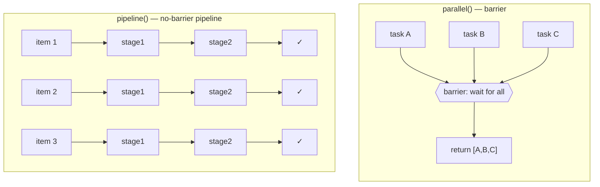
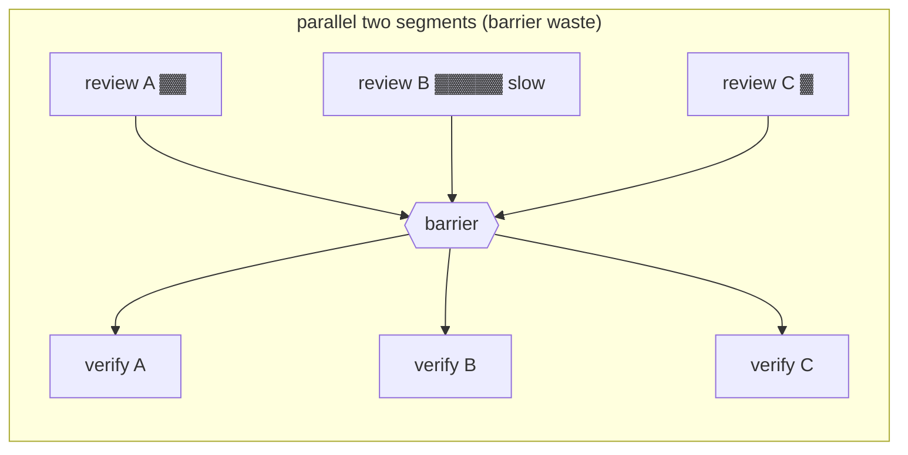

# Chapter 08 · parallel (Barrier) vs pipeline

> This is the chapter of all of Foundations **most easily gotten wrong.** `parallel()` and `pipeline()` both look like they "make multiple agents run concurrently," but their concurrency models are worlds apart — pick wrong and, at best, you burn multiples of wall-clock time; at worst, you stall a pipeline that could have kept flowing and grind it into serial execution.
>
> This chapter lays two **real runs** side by side and settles the matter once and for all.

---

## 8.1 The One-Sentence Distinction

- **`parallel(thunks)`** is a **barrier**: run a set of tasks concurrently and **wait for all to complete** before handing back the result array.
- **`pipeline(items, ...stages)`** is a **pipeline**: each item flows **on its own** through all stages, with **no barrier between stages** — item A may already be at stage 3 while item B is still stuck at stage 1.

Keep this diagram in mind; the rest of the chapter is just its expansion:



---

## 8.2 `parallel()`: Barrier — All or Wait

`parallel()` takes an **array of thunks** (each thunk is `() => Promise`), runs them concurrently, and once they've all settled hands back a result array **in the same order as the input.**

### Real run: 3 agents concurrent

```javascript
export const meta = {
  name: 'parallel-demo',
  description: 'parallel() barrier: 3 agents run concurrently, all results awaited together',
  phases: [{ title: 'Fan-out', detail: 'Three concurrent agents' }],
}

phase('Fan-out')
const dims = ['naming', 'error-handling', 'comments']
const results = await parallel(
  dims.map((d, i) => () =>
    agent(`Name one common ${d} code smell in exactly one sentence.`, {
      label: `smell:${d}`,
      schema: { type: 'object', properties: { smell: { type: 'string' } }, required: ['smell'] },
    })
  )
)
log(`barrier released with ${results.filter(Boolean).length}/${dims.length} results`)
return results.filter(Boolean)
```

**Real return value** (Run ID `wf_52957913-6d2`):

```json
[
  {"smell":"...vague, non-descriptive identifiers like `data`, `temp`, `obj`..."},
  {"smell":"...the \"empty catch block,\" where an exception is caught but silently swallowed..."},
  {"smell":"Redundant comments that merely restate what the code already clearly expresses..."}
]
```

**Real usage**: `agent_count=3` ｜ `total_tokens=78844` ｜ `duration_ms=8395`

### Three key points

**① Real concurrency, not serial.** A single agent's baseline is ≈ 5.5s (see Chapter 04's hello test); here 3 agents took only **8.4s** — far short of 3 × 5.5 = 16.5s. The concurrency is the real thing.

**② Result order = input order.** Even if the `error-handling` one comes back first, it still lands after `naming` in the result array — `parallel()` guarantees result order matches thunk order, so you can index-align without worry.

**③ Watch that `() =>`.** What you hand `parallel()` is an **array of functions**, not an array of Promises.

<div class="callout warn">

**The most common mistake: passing Promises instead of thunks.**

```javascript
// ✗ Wrong: mapping out agent() calls executes them immediately — they're already running before reaching parallel
await parallel(dims.map(d => agent(...)))

// ✓ Right: map out thunks (() => ...), letting parallel control when they start
await parallel(dims.map(d => () => agent(...)))
```

The first form hands over **already-created Promises** rather than `() => ...` thunks, and that has two consequences: (a) those Promises **start running right away, eagerly** — they're off and running before they ever reach `parallel`, so `parallel` never gets a say in when they start; and (b) you also lose `parallel()`'s **async-failure gathering semantics** — an async reject / agent error should turn into `null` at its slot in the result array, but once you bypass `parallel` and await directly, a single rejection can drag the whole `await` down with it. So always pass thunks.

</div>

### Error handling: distinguish a synchronous throw from an async reject

`parallel()`'s error semantics **hinge on which path the failure takes** — you can't paint it all as "a throw → `null`":

- A **synchronous `throw` in the thunk body** (`() => { throw ... }`) **rejects the whole `parallel()` call**, and without `try/catch` it **crashes the workflow outright** (measured Run `wf_ed5e87f3-435`: status failed, `total_tokens=0`, `duration_ms=26`).
- Only an **asynchronous failure** — a returned promise that subsequently rejects (`() => Promise.reject(...)`) or an inner `agent()` erroring — becomes `null` at its position in the result array, with the rest returning normally and the **workflow completing normally** (measured Run `wf_74ebe5ac-2db`).

So whenever your thunk body might run synchronous logic (parsing, assertions, `JSON.parse`, index out-of-bounds), you must **never** leave it bare in the thunk — move it inside the awaited `agent()` call, or `try/catch` it yourself. Either way, **`.filter(Boolean)` before use** to drop the `null`s the async path leaves behind:

```javascript
const results = (await parallel(thunks)).filter(Boolean)
```

This is a "best-effort" semantics: one reviewer dying asynchronously shouldn't take the whole batch of reviews down with it. §8.8 nails this synchronous/asynchronous corner case down with three real runs.

---

## 8.3 `pipeline()`: A Pipeline — Let Each Item Flow Forward on Its Own

`pipeline(items, stage1, stage2, …)` lets **each item flow on its own** through all the stages in turn. The keyword is **independently**: there's **no barrier between stages.**

### Real run: 3 items × 2 stages (Find → Verify)

```javascript
export const meta = {
  name: 'pipeline-demo',
  description: 'pipeline(): each item flows Find -> Verify independently, no barrier between stages',
  phases: [{ title: 'Find', detail: 'Produce a candidate' }, { title: 'Verify', detail: 'Adversarially check it' }],
}

const items = ['off-by-one', 'null-dereference', 'race-condition']
const out = await pipeline(
  items,
  (kind) =>
    agent(`Give a one-line code example of a ${kind} bug.`, {
      label: `find:${kind}`, phase: 'Find',
      schema: { type: 'object', properties: { example: { type: 'string' } }, required: ['example'] },
    }),
  (found, kind) =>
    agent(`Is this genuinely a ${kind} bug? Example: "${found.example}". Reply boolean + short reason.`, {
      label: `verify:${kind}`, phase: 'Verify',
      schema: { type: 'object', properties: { real: { type: 'boolean' }, reason: { type: 'string' } }, required: ['real', 'reason'] },
    }).then((v) => ({ kind, ...found, ...v }))
)
return out.filter(Boolean)
```

**Real usage** (Run ID `wf_bf086b98-6ec`): `agent_count=6` ｜ `total_tokens=158982` ｜ `duration_ms=26743`

3 items × 2 stages = **6 agents**; `agent_count=6` bears it out to the number.

### Stage-callback signature: `(prevResult, originalItem, index)`

This is `pipeline()`'s most practical, and most easily missed, piece of design: **every stage callback receives three arguments.**

- First stage: `(item, item, index)` — `prevResult` is the item itself.
- Subsequent stages: `(the previous stage's return value, the original item, the index)`.

Take a look at the second stage in the real script:

```javascript
(found, kind) => agent(`Is this genuinely a ${kind} bug? Example: "${found.example}" ...`)
```

`found` is the `{ example }` returned by the first stage; `kind` is the **original item** (`'off-by-one'`, etc.). What this means: **you don't have to thread the original input through by stuffing it into the previous stage's return value** — later stages can grab `originalItem` and `index` anytime they want. That's a huge convenience, and Part III's recipes lean on it again and again.

<div class="callout tip">

**The `.then()` context-merging idiom**: the second stage uses `.then((v) => ({ kind, ...found, ...v }))` to fold "original kind + first stage's example + second stage's real/reason" into one complete record. That way, in `pipeline()`'s final array, every item carries all its context with it.

</div>

### A stage throws → that item drops to `null`, skipping the remaining stages

If some item throws at stage 2, its result is `null`, and it **will not** move on to stage 3. The other items are unaffected and keep flowing. Again, `.filter(Boolean)` before use.

---

## 8.4 The Core Difference: Where Is the Barrier

This is the crux of the choice. Picture a two-stage task: 5 items, each must review first, then verify.

**Built as two parallel segments (with a barrier):**

```javascript
// (illustrative) barrier between stages: must wait for all 5 reviews to finish before any verify can start
const reviews = await parallel(items.map(it => () => agent(reviewPrompt(it), {schema: R})))
const verified = await parallel(reviews.filter(Boolean).map(r => () => agent(verifyPrompt(r), {schema: V})))
```

**With pipeline (no barrier):**

```javascript
// Each item flows on its own: the moment item A's review finishes, its verify starts immediately —
// no need to wait for items B, C's reviews
const verified = await pipeline(items,
  it => agent(reviewPrompt(it), {schema: R}),
  review => agent(verifyPrompt(review), {schema: V})
)
```



If review B is especially slow, in the two-segment parallel form, **A and C finished their reviews ages ago, yet their verifies still have to sit and wait for B** — the barrier drags the fast ones down to the slow one's tempo. Pipeline, by contrast, lets A and C verify the instant their reviews finish; wall clock ≈ **the slowest single chain**, not "the sum of each stage's slowest."

<div class="callout info">

**The official criterion**: **use `pipeline()` by default for multi-stage tasks.** Only when "stage N needs the results of **all** items from the previous stage" should you reach for a barrier (`parallel`).

</div>

---

## 8.5 So When Should You Use a Barrier?

A barrier (`parallel` between two stages) is **only** correct when stage N needs **cross-item global information**:

1. **Dedup / merge**: before any expensive downstream work, you need all of the previous stage's results to do one global dedup.
2. **Zero-result early exit**: "0 bugs → skip the entire verification stage" — you have to know the total count first.
3. **The next stage references "other findings"** to make a horizontal comparison.

The following are **not** reasons to reach for a barrier (a stage inside pipeline handles them just fine):

- "I need to flatten / map / filter first" — do it in a pipeline stage: `pipeline(items, stageA, r => transform([r]).flat(), stageB)`.
- "These two stages are conceptually separate" — pipeline already models separate stages; separate ≠ needs synchronizing.
- "The code is cleaner this way" — the barrier's latency is a cost you actually pay.

<div class="callout warn">

**Smell self-check**: if you write

```javascript
const a = await parallel(...)
const b = transform(a)          // flatten / map / filter, no cross-item dependency
const c = await parallel(b.map(...))
```

that middle `transform` doesn't need a barrier at all. Rewrite it as a pipeline and tuck the transform into a stage. **When in doubt, choose pipeline.**

</div>

### The real form of correct barrier use (dedup)

```javascript
// (illustrative) you genuinely need "all findings" together to dedup before expensive verification — here the barrier is correct
const all = await parallel(DIMENSIONS.map(d => () => agent(d.prompt, { schema: FINDINGS })))
const deduped = dedupeByFileAndLine(all.filter(Boolean).flatMap(r => r.findings))  // needs all of them
const verified = await parallel(deduped.map(f => () => agent(verifyPrompt(f), { schema: VERDICT })))
```

---

## 8.6 The Concurrency Limit Applies to Both

Whether `parallel` or `pipeline`, the agents running at once are throttled by **`min(16, CPU cores − 2)` per workflow.** So you **can** hand them 100 items and they'll all complete — only about 10 run at any instant, the rest wait in line. On top of that there's a fallback cap of 1000 agents total per workflow.

What this means: you don't need to batch by hand. Hand all your items straight to `pipeline()`, and throttling keeps the concurrency level in check for you.

---

## 8.7 Selection Quick Reference

| Your situation | Use |
|---|---|
| A set of independent tasks, need **all results** together | `parallel()` |
| Multi-stage, each item can flow all the way through independently | `pipeline()` (default) |
| Stage N needs the results of **all** items from the previous stage (dedup/early-exit/horizontal comparison) | `parallel()` barrier between segments |
| Just need to flatten/map/filter | Put it in a stage of `pipeline()`, **don't** add a barrier for it |

---

## 8.8 Error Semantics: When Does a Failure Become `null` vs Crash?

§8.2 / §8.3 gave the one-sentence version — "a thunk/stage throws → that position becomes `null`." That sentence holds fully for `pipeline()`, but for `parallel()` it's **imprecise**: whether you get `null` or the whole workflow crashes comes down to whether the "throw" happens **synchronously** in the thunk body, or comes from a **returned promise that subsequently rejects.** This section nails down that corner case with three real runs.

### Minimal contrast of the three throw shapes

```javascript
// A. parallel + a "synchronous throw" in the thunk body
//    → the whole parallel() rejects; without try/catch the workflow fails outright
await parallel([
  () => agent('ok-1'),
  () => { throw new Error('deliberate failure inside a parallel thunk') },  // ✗ sync throw
  () => agent('ok-2'),
])

// B. parallel + returning a "promise that subsequently rejects" (or an inner agent erroring)
//    → that position becomes null, the rest survive, the workflow completes normally
await parallel([
  () => agent('ok-1'),
  () => Promise.reject(new Error('returned-promise rejection, no synchronous throw')),  // → null
  () => agent('ok-2'),
])

// C. pipeline + a "synchronous throw" in the stage body
//    → only that item drops to null and skips its remaining stages; other items are unaffected
await pipeline(
  ['ok', 'boom', 'ok2'],
  (kind) => { if (kind === 'boom') throw new Error('stage-1 synchronous throw for "boom"'); return agent(`s1 ${kind}`) },
  (prev, kind) => agent(`s2 ${kind}`),
)
```

### Why A crashes the workflow

`parallel(thunks)` **calls the thunks one by one.** In shape A, the moment that thunk is called, its **synchronous `throw` propagates upward immediately** — this happens *before* `parallel()` has obtained any promise, so it gets no chance to "collect this slot into `null`"; the exception pierces straight through `parallel()` and **rejects** the whole call. Shape B is a different story: the thunk **returns a promise normally**, `parallel()` takes it and then `await`s it, and only an **async reject** is something its error-gathering machinery can catch — only then does that slot become `null`.

<div class="callout warn">

**The most insidious crash: a synchronous throw in a `parallel()` thunk body fails the whole workflow.**

Real run `wf_ed5e87f3-435`: the script was nothing more than `parallel([ok, () => { throw ... }, ok])`, and the workflow ended with status **failed**, `agent_count=1`, `total_tokens=0`, `duration_ms=26` — a **0-token instant bailout**, with none of the three agents ever actually running. The tool definition's line "a thunk that throws resolves to null" holds for an **async reject** but **not** for a **synchronous throw.** So: **never put risky synchronous logic (parsing, assertions, `JSON.parse`, index out-of-bounds, etc.) in a `parallel()` thunk body** — put it inside the awaited `agent()` call (only the async path is collected into `null`), or `try/catch` it yourself.

</div>

The other side of this shows up in Run `wf_74ebe5ac-2db`: a single run put both shapes A and B through their paces — segment A wrapped the synchronous throw in `try/catch` and caught it successfully (`syncThrowRejectsWorkflow:true`, confirming "a sync throw does reject"); segment B's `() => Promise.reject(...)` made that slot `null` with the other 2 surviving (`{nulls:1, survivors:2, becomesNull:true}`), and the **workflow completed normally.** That async failure was still logged separately in the run's `<failures>` annotation: `parallel[1] failed: ...` — **the failure wasn't swallowed; it just didn't crash the workflow.**

### Pipeline stages are more forgiving

Shape C is `pipeline()`: even a **synchronous throw** in the stage body only makes **that item** drop to `null` and skip its **remaining stages**, while the other items keep flowing right through to completion. Real run `wf_f5f5b422-a4f`: `pipeline(['ok','boom','ok2'], stage1[boom throws synchronously], stage2)`, with an outer try/catch that caught nothing (`{crashed:false, nulls:1, survivors:2, itemDroppedToNull:true}`), and the workflow completed normally. The clincher is **`agent_count=4`**: `ok`(2 stages) + `ok2`(2 stages) + `boom`(0, threw at stage1) = 4 — **exactly proving "the throwing item ran zero further stages."** Put another way, `pipeline()` wraps every stage of every item per-item, so even a synchronous throw only touches the single item.

### Comparison table (measured)

| Scenario | `parallel()` | `pipeline()` |
|---|---|---|
| thunk/stage **synchronous throw** (`() => { throw }`) | **rejects the whole call** — without try/catch the **workflow fails** (Run `wf_ed5e87f3-435`: failed / 0 tokens / 26ms) | only **that item becomes `null`** and skips its remaining stages, the rest survive (Run `wf_f5f5b422-a4f`: `crashed:false`) |
| returned promise **async reject** (`() => Promise.reject(...)`) / agent errors | that position is **`null`**, the call itself doesn't reject, the rest survive (Run `wf_74ebe5ac-2db`: `nulls:1, survivors:2`) | only that item becomes `null` |
| how the failure surfaces | listed in the run's `<failures>` annotation whether it completes or fails | same as left |

**The practical law**: in `parallel()`, **never put risky synchronous logic in a thunk body** — put it inside the awaited `agent()` call (only the async path is collected into `null`), or wrap it in `try/catch`. `pipeline()` stages are more fault-tolerant (even a synchronous throw only drops that one item), but **before you use the results of either, you must `.filter(Boolean)`.**

> Treat this contrast as the sibling pitfall of [B.4](#/en/app-b) (pass thunks): B.4 is about "passing the wrong type (Promises instead of thunks)," while this section is about "passing the right type, but throwing synchronously inside the thunk body" — both pull `parallel()` away from the "throw → null" intuition you'd expect.

---

## 8.9 Chapter Summary

- `parallel()` = barrier, wait for all, results in input order, pass **thunks** not Promises; failure semantics split two ways: a **synchronous throw in the thunk body → rejects the whole call** (without try/catch the workflow crashes), only an **async reject → that position is `null`** (§8.8).
- `pipeline()` = no-barrier pipeline, each item flows on its own through the stages, callback signature `(prevResult, originalItem, index)`, wall clock ≈ slowest single chain.
- **Multi-stage defaults to pipeline**; only add a barrier between stages when you need cross-item global information (dedup/early-exit/horizontal comparison).
- Both are throttled by the concurrency limit, so pass large arrays without worry.
- Real data: parallel 3-concurrent 8.4s/79K tokens; pipeline 3×2=6 agents 26.7s/159K tokens.

In the next chapter, we put the last piece of Foundations in place: **progress visualization (`phase`/`log`/`/workflows`), resume (`resumeFromRunId`), and budget control (`budget`)** — making a long pipeline visible, stoppable, and cheap to run.

> Continue reading: [Chapter 09 · Progress, Logs, Resume, Budget](#/en/p2-09)
