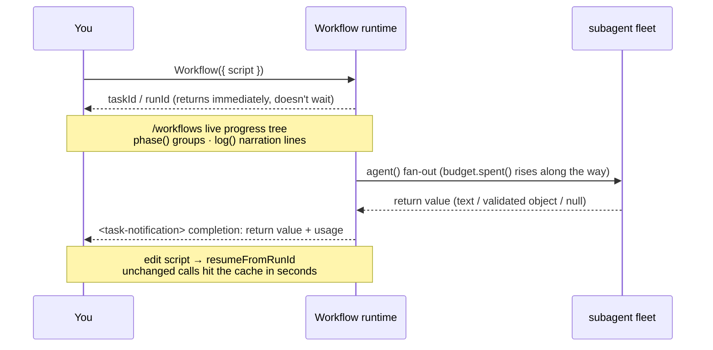

# Chapter 09 · Progress, Logs, Resume, Budget

> The last piece of the Foundations puzzle: how to make a long pipeline **visible** (progress and logs), **stoppable/resumable** (resume), and **economical to run** (budget). These three things are what take a workflow from "it runs" to "you can confidently ship it."

---

## 9.1 The Async Lifecycle at a Glance

Stitch together the "launch → async receipt → watch progress → completion notification" arc from the first eight chapters. The four things this chapter covers each hang at a different spot on that line: `phase()`/`log()` add observability to the **running** stretch, `/workflows` is your **observation** window, `budget` **keeps spending in check** during the run, and `resumeFromRunId` lets you **splice on another segment** once the line finishes.



Remember what this line looks like: **the Workflow tool's return value is always a "launched" receipt, not the result** (Chapter 04). The result arrives in the `<task-notification>`. This chapter's four primitives are what turn that "invisible" background timeline **visible, stoppable, economical, and resumable**.

---

## 9.2 Progress: `phase()` + `log()` + `/workflows`

Once a workflow is running, you need to know "what's it doing right now." Three tools work together to give you observability:

### `phase(title)` — group the progress

`phase('Review')` switches the current phase, and every `agent()` call after it groups under "Review" in the progress tree. Add the `meta.phases` declaration and you get a structured progress tree. Here is a **complete, runnable** two-phase script (note how the `title` in `meta.phases` lines up exactly with the argument to `phase()`):

```javascript
export const meta = {
  name: 'two-phase',
  description: 'phase() groups agents in the live progress tree',
  phases: [
    { title: 'Scan', detail: 'find candidates' },
    { title: 'Verify', detail: 'check each one' },
  ],
}

const FOUND = {
  type: 'object',
  properties: { candidates: { type: 'array', items: { type: 'string' } } },
  required: ['candidates'],
}
const OK = {
  type: 'object',
  properties: { verified: { type: 'array', items: { type: 'string' } } },
  required: ['verified'],
}

phase('Scan')                                  // ← switch to the Scan phase
const found = await agent(
  'List three plausible naming smells one might find in a JS module.',
  { label: 'scan', phase: 'Scan', schema: FOUND }
)
log(`Scanned ${found.candidates.length} candidates`)  // ← narration line

phase('Verify')                                // ← switch to the Verify phase
const ok = await agent(
  `Of these candidates, which are genuinely smells? ${JSON.stringify(found.candidates)}`,
  { label: 'verify', phase: 'Verify', schema: OK }
)
log(`Verified ${ok.verified.length}`)
return ok
```

> This block is **illustrative (not run on its own)**; but the real behavior of the `phase()`/`schema`/`agent()` it leans on has already been verified by the real runs in Chapters 04/06/08 (`hello` Run `wf_dacbd480-d5d`, `pipeline-demo` Run `wf_bf086b98-6ec`).

<div class="callout warn">

**Inside `parallel()` / `pipeline()`, don't rely on the global `phase()`.** With multiple branches advancing at once, the global "current phase" gets raced. The right way is to pass `phase` explicitly to each `agent()`:

```javascript
await pipeline(items,
  d => agent(d.prompt, { phase: 'Review', schema: R }),   // explicit grouping
  r => agent(verify(r), { phase: 'Verify', schema: V }),
)
```

`opts.phase` and the `title` in `meta.phases` match by exact string — same name, same group.

</div>

### `log(message)` — give the user a line of narration

`log()` prints a line of narrative text above the progress tree. It is **single-argument and returns nothing**: `log(message: string): void` (see `_grounding.md` section B). Use it to report milestones, counts, decisions — someone watching can read just the `log()` lines, skip the code, and still keep up with the workflow:

```javascript
log(`Scanned ${shards.length} shards, starting concurrent review`)
// ... after a round of work ...
log(`${bugs.length}/10 found, remaining budget ${Math.round(budget.remaining() / 1000)}k`)
```

Think of `log()` as "the workflow's narration." A good narration line answers three questions: **how much fanned out** (`Scanned N shards`), **converged to how many** (`Verified M`), and **how much budget is left** (`remaining Xk`). The budget loop in the next section, which `log()`s a progress line every iteration, is the model to copy here.

<div class="callout info">

**`console.log` is also available, but does a different job.** This book's sandbox-introspection run (Run `wf_59bf3654-183`) measured and confirmed: in the script, `console` is an injected object, `console.log` is callable, and its output goes into the **workflow log.** The difference: `log()` is user-facing progress narration (shown above the progress tree), while `console.log` is more like the diagnostic output you jot down during development (it lands in the log). Want someone to keep up with progress? Use `log()`. Want a debugging trail? Use `console.log`.

</div>

### `/workflows` — the live progress tree

The slash command `/workflows` opens a live tree: one group box per phase, with each agent's label (from `label`) and status inside. The `title` you write in `meta.phases` decides the group boxes; the `label` on `agent()` decides what the leaf nodes are called — so **a descriptive label aids both search and observation.**

---

## 9.3 The Real Usage in the Completion Notification

When each workflow finishes, the completion notification carries a usage report. That's what you estimate cost from. Pulling together the three real runs from this book's Foundations:

| Workflow | agent_count | tool_uses | total_tokens | duration_ms |
|---|---|---|---|---|
| hello (single agent + schema) | 1 | 1 | 26,338 | 5,506 |
| parallel (3 concurrent) | 3 | 3 | 78,844 | 8,395 |
| pipeline (3 items × 2 stages) | 6 | 8 | 158,982 | 26,743 |

Two rules of thumb:

- **token ≈ agent count × per-agent context** (about 25k–30k / agent, drifting with the prompt and output).
- **Wall clock follows the critical path**, not the total agent count — concurrency squeezes N agents' time down to roughly "the slowest one."

<div class="callout info">

**Orchestration itself costs nothing in model spend.** The "token ≈ agent count × …" rule has a clean boundary: **a pure-orchestration workflow with no `agent()` calls costs 0 tokens.** This book measured two examples that bear it out — the sandbox-introspection run (`wf_59bf3654-183`) and the nested-workflow run (`wf_2b04881f-6a9`) are both **0 agents / 0 tokens** (finishing in 4 ms and 29 ms respectively). In other words, the orchestration skeleton — `phase()`/`log()`/`pipeline()`/`parallel()` — burns no tokens on its own; **tokens arise only when `agent()` actually dispatches a subagent.** That's also why the fundamental money-saving move is to keep control logic in the script (the orchestration layer) and throw only the "model-needing work" into `agent()`.

</div>

---

## 9.4 Resume: `resumeFromRunId`

A long pipeline's worst fear is "it crashed at step 8, and the expensive results of the first 7 steps are all wasted." Workflow fixes that with **resume**:

```javascript
// After editing the script, re-run with the previous runId
Workflow({ scriptPath: ".../my-flow-wf_xxx.js", resumeFromRunId: "wf_xxx" })
```

How it works: **the longest unchanged prefix of `agent()` calls** returns cached results straight away (in seconds); only **the first edited/added call, and all calls after it**, re-run for real. "The same script + the same args → 100% cache hit."

This is not a slogan — this book's testing captured **literal evidence**. Take that `hello-workflow` from Chapter 04 (Run `wf_dacbd480-d5d`): re-running it with the **unchanged script** + `resumeFromRunId` gives these real usage numbers across the two runs:

| Run | agent_count | tool_uses | total_tokens | duration_ms |
|---|---|---|---|---|
| First (real execution) | 1 | 1 | **26,338** | **5,506** |
| Resume (cache hit) | **0** | **0** | **0** | **8** |

The return value is **byte-for-byte identical** (`{"message":"...","sum":4,"runtimeConfirmed":true}`). The resume run took **0 tokens, 0 tool calls, 8 milliseconds** — it did **not re-dispatch the subagent** at all; it just reused the cached result (see `assets/transcripts/advanced.md`, reusing the same Run ID `wf_dacbd480-d5d`). That's the literal basis for "re-running the first 7 steps is nearly free": the unchanged prefix comes back from cache, and you only pay again for the part you actually changed.

<div class="callout info">

**This is the fundamental reason scripts forbid `Date.now()` / `Math.random()` / arg-less `new Date()`**: resume rides on the replayability that "the same execution necessarily produces the same result." Non-deterministic time/randomness breaks it (if the same script produces different results on two runs, the cache has nothing to compare against). Need a timestamp? Pass it in via `args`, or stamp it outside after the workflow finishes. Need randomness? Vary the prompt using the agent's index.

</div>

Resume is a **same-session** capability (the cache lives in the current session); before resuming, `TaskStop` the previous run first. For full usage, cache-hit rules, and cross-session fallback, see [Chapter 22 · Resume & Caching](#/en/p4-22).

---

## 9.5 Budget: `budget`

When the user sets a token target for this turn with a "+500k"-style instruction, the global `budget` in the script lets you **dynamically tune** the workflow's scale and depth to match. Its three members (see `_grounding.md` section B):

```javascript
budget.total        // number | null: this turn's token target; null = no target set
budget.spent()      // number: output tokens spent this turn (pool shared by main loop + all workflows)
budget.remaining()  // number: max(0, total - spent()); Infinity when no target is set
```

Per the official tool definition, it is a **hard cap**: once `spent()` hits `total`, calling `agent()` again **throws.** This "stop when the budget runs out" design is there to keep a workflow from burning tokens uncontrollably.

<div class="callout info">

**`spent()` counts "this turn's output tokens," and it is a pool shared by the main loop + all workflows** (official). Meaning: the output you burn in the main conversation, plus whatever `agent()` burns in any workflow this turn, all count toward the same `spent()`. So `budget` constrains "this entire turn's" total spend, not a single workflow.

</div>

### 9.5.1 Measured: with no target set, `budget.total === null`

To understand `budget`, first look at its real values in the most common case: **no target set**. This book's sandbox-introspection run (Run `wf_59bf3654-183`, 0 agents / 0 tokens / 4 ms) read `budget` straight out of the script: in the returned object, `typeof budget === 'object'` and **`budget.total === null`**.

That nails down the first key fact:

- **No target set → `budget.total === null`** (measured, `wf_59bf3654-183`) — not `0`, not some default number.

Two more come from the official API definition (`_grounding.md` section B), interlocking with what `total` holds:

- **When `total` is null, `budget.remaining()` returns `Infinity`** (`remaining()` is defined as `max(0, total - spent())`; with `total` null, there's no cap) — a value that bites; section 9.5.3 below is all about it.
- **`budget.spent()` doesn't care whether `total` is null**: it always reflects the real output tokens spent this turn. By this book's baseline, one agent's round-trip is about 26k tokens (hello, `wf_dacbd480-d5d`), and `spent()` accumulates with each `agent()`.

**One probe nails all three at once.** This book ran another budget probe carrying one real agent (Run `wf_fd09a6ed-38a`, 1 agent / 26,211 tokens / 6,933 ms), reading everything in one shot in a session with no target set: `budget.total === null`; `budget.remaining()` **measured `Infinity` both before and after** the agent ran (`remainingBefore` / `remainingAfter` were both `"Infinity"` — really read, not "inferred from the definition"); and in that same run `budget.spent()` did **rise** (`spentIncreased: true`, from near 0 up to that ~26k tokens). That tightens the three facts above from "each holds separately" to "all hold in one run," and confirms the next sentence: the switch (`total`) stays `null`, the balance (`remaining()`) stays `Infinity`, yet the counter (`spent()`) climbs regardless.

In other words: `total` is the switch for "did the user set a target" (null if not), and `spent()` is the counter for "how much was actually spent" — the two run on their own. This distinction is the foundation for every usage below.

### 9.5.2 Two typical usages

**① Dynamic loop (let the budget decide how long to work):**

```javascript
const BUGS = {
  type: 'object',
  properties: { bugs: { type: 'array', items: { type: 'string' } } },
  required: ['bugs'],
}

const bugs = []
while (budget.total && budget.remaining() > 50_000) {   // ← must have budget.total &&
  const r = await agent('Find one more distinct bug in this module.', {
    label: `hunt:${bugs.length}`,
    schema: BUGS,
  })
  bugs.push(...r.bugs)
  log(`${bugs.length} found, remaining ${Math.round(budget.remaining() / 1000)}k`)
}
```

**② Static scaling (let the budget decide, once, how much to fan out):**

```javascript
// With a target: 1 agent per 100k tokens; no target: fall back to a safe default of 5
const FLEET = budget.total ? Math.floor(budget.total / 100_000) : 5
log(`Fanning out ${FLEET} agents`)
```

Both patterns **lean on `budget.total` to test "is there a target"**: the dynamic loop uses it as a `while` guard, the static scaling uses it as the condition of a ternary. This is no coincidence — the next section explains why you **must** write it this way.

### 9.5.3 Warning: an unguarded `while` runs forever

The anti-pattern is a loop that deliberately **tests only `remaining()`, not `total`**:

```javascript
// ✗ Anti-example: missing the budget.total guard
while (budget.remaining() > 50_000) { /* ... dispatch agent ... */ }
```

Chain the two facts from 9.5.1 together and its fate follows: with no target, `budget.total === null` (measured, `wf_59bf3654-183`), and per the official definition `remaining()` then returns `Infinity` — so this anti-example's test `Infinity > 50_000` is **always true.** There's also a **positive measurement** for this: the guarded `while (budget.total && …)` **ran zero rounds** with no target set — that's exactly `wf_fd09a6ed-38a`'s `guardRounds: 0`, the guard killing the loop at round 0, never given a chance to run away.

<div class="callout warn">

**When no target is set, an unguarded `while (budget.remaining() > N)` becomes an infinite loop.** Because `remaining()` returns `Infinity` and `Infinity > N` is forever true, the loop keeps dispatching agents until it hits the **global fallback cap of 1000 agents per workflow** (official hard constraint, `_grounding.md`). The correct form `while (budget.total && budget.remaining() > N)`, on the other hand, short-circuits to false on the null `budget.total` when no target is set, running zero rounds — which is exactly why a dynamic loop **must** carry this guard. **Mnemonic: the first term of a dynamic loop's condition is always `budget.total &&`.**

</div>

<div class="callout info">

**On "what error budget exhaustion throws" and the sync timeout**: the official definition describes only the **behavior** — calling `agent()` after the budget is exhausted errors, and hitting the 1000-agent cap errors — but **gives no error class name.** Community third-party material (a YouTuber's repo, not official) claims these two errors are named `WorkflowBudgetExceededError` and `WorkflowAgentCapError` respectively — those **class names remain third-party claims, unverified by this book**, so don't `catch` a named exception in your code. But one claim that used to sit alongside them as "unverified" this book has now **verified**: the script VM's **30000 ms sync timeout** is real (Run `wf_e3b2b123-5f4`: a long synchronous loop with no `await` was terminated at 30,222 ms, with the verbatim error `Error: Script execution timed out after 30000ms`). Note it bounds only **synchronous** execution (to catch infinite loops) — it is **not** a wall-clock cap; workflows with `await agent()` happily run for minutes.

</div>

For the full play of budgets (and scaling strategy), see [Chapter 21 · Dynamic Budget & Scaling](#/en/p4-21).

---

## 9.6 Treat Observability as a First-Class Citizen

A lesson the community systems taught us (see Part V): **orchestration is not just about scheduling, but also about "saying clearly what it's doing."** A workflow that reports no progress looks identical from the outside whether it runs for 5 minutes or hangs for 5 minutes.

Practice checklist:

- Give every `agent()` a **descriptive `label`** (`review:auth.ts` beats `agent-7`).
- `log()` a line at every milestone (how much fanned out, converged to how many, remaining budget).
- Group progress with `phase()` / `opts.phase` to keep the `/workflows` tree clean.
- If the workflow made a **lossy trade-off** (took only top-N, no retry, sampling), **be sure to `log()` it** — otherwise silent truncation gets misread as "full coverage."

---

## 9.7 Chapter Summary

- **Async lifecycle**: launch returns a `taskId`/`runId` receipt right away → watch with `/workflows` → `<task-notification>` brings back the result and usage; this chapter's four primitives hang at different spots on that line (9.1).
- **Progress**: `phase()` to group, `log()` to narrate, `/workflows` to watch the live tree; inside concurrency use `opts.phase` rather than the global `phase()`.
- **Usage**: the completion notification carries `agent_count`/`tool_uses`/`total_tokens`/`duration_ms`; token ≈ agent count × per-agent context, wall clock follows the critical path.
- **Resume**: `resumeFromRunId` makes an unchanged prefix hit the cache in seconds — measured at **0 tokens / 0 tool calls / 8 ms** (Run `wf_dacbd480-d5d`); the replayability requirement is why `Date.now`/`Math.random` are forbidden.
- **Budget**: `budget.total/spent()/remaining()` is an official hard cap, and `spent()` is this turn's output tokens in a pool shared by the main loop + all workflows. Measured: with no target, `total === null` (Run `wf_59bf3654-183`); per the official definition `remaining()` is then `Infinity`, so **always guard dynamic loops with `budget.total &&`**, or `Infinity > N` stays forever true and charges all the way to the official 1000-agent cap.
- Treat observability as first-class: descriptive labels, milestone logs, explicit phases, and speak up about lossy trade-offs.

**Foundations ends here** — you've now got the whole core of `meta`/`phase`/`agent`/`schema`/`parallel`/`pipeline`/`log`/`resume`/`budget` down. Starting in Part III, we assemble these into genuinely usable recipes, aiming at real runs: **recipes that were actually run carry their Run ID and real usage (see [`assets/transcripts/`](https://github.com/AGI-is-going-to-arrive/workflow-cookbook/tree/main/assets/transcripts)), and illustrative scripts that were not run are clearly marked.**

> Continue reading: [Chapter 10 · Sharded Code Review](#/en/p3-10)

---

[← Back to main README](../../README.md) · [中文 README →](../../README.md)
