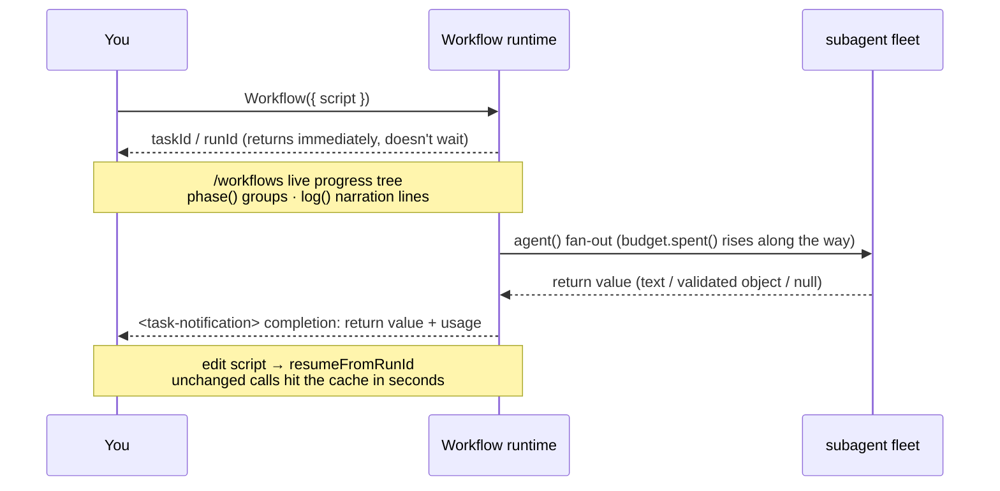

# Chapter 09 · Progress, Logs, Resume, Budget

> The last piece of the Foundations puzzle: how to make a long pipeline **visible** (progress and logs), **stoppable/resumable** (resume), and **economical to run** (budget). These three things are the key to upgrading a workflow from "it runs" to "you can confidently ship it."

---

## 9.1 The Async Lifecycle at a Glance

Stitch together the "launch → async receipt → watch progress → completion notification" arc from the first eight chapters. The four things this chapter covers each hang at a different spot on that line: `phase()`/`log()` decorate the **running** stretch with observability, `/workflows` is your **observation** window, `budget` **spends** during the run, and `resumeFromRunId` lets you **splice on another segment** after the line finishes.



Remember the shape of this line: **the Workflow tool's return value is always a "launched" receipt, not the result** (Chapter 04). The result arrives in the `<task-notification>`. This chapter's four primitives are what make that "invisible" background timeline **visible, stoppable, economical, and resumable**.

---

## 9.2 Progress: `phase()` + `log()` + `/workflows`

Once a workflow is running, you need to know "what is it doing right now." Three tools jointly provide observability:

### `phase(title)` — group the progress

`phase('Review')` switches the current phase; all subsequent `agent()` calls group under "Review" in the progress tree. Combined with the `meta.phases` declaration, you get a structured progress tree. Here is a **complete, runnable** two-phase script (note how `meta.phases`'s `title` corresponds exactly to the argument of `phase()`):

```javascript
export const meta = {
  name: 'two-phase',
  description: 'phase() groups agents in the live progress tree',
  phases: [
    { title: 'Scan', detail: 'find candidates' },
    { title: 'Verify', detail: 'check each one' },
  ],
}

const FOUND = {
  type: 'object',
  properties: { candidates: { type: 'array', items: { type: 'string' } } },
  required: ['candidates'],
}
const OK = {
  type: 'object',
  properties: { verified: { type: 'array', items: { type: 'string' } } },
  required: ['verified'],
}

phase('Scan')                                  // ← switch to the Scan phase
const found = await agent(
  'List three plausible naming smells one might find in a JS module.',
  { label: 'scan', phase: 'Scan', schema: FOUND }
)
log(`Scanned ${found.candidates.length} candidates`)  // ← narration line

phase('Verify')                                // ← switch to the Verify phase
const ok = await agent(
  `Of these candidates, which are genuinely smells? ${JSON.stringify(found.candidates)}`,
  { label: 'verify', phase: 'Verify', schema: OK }
)
log(`Verified ${ok.verified.length}`)
return ok
```

> This block is **illustrative (not run on its own)**; the real behavior of the `phase()`/`schema`/`agent()` it relies on has been verified by the real runs in Chapters 04/06/08 (`hello` Run `wf_dacbd480-d5d`, `pipeline-demo` Run `wf_bf086b98-6ec`).

<div class="callout warn">

**Inside `parallel()` / `pipeline()`, don't rely on the global `phase()`.** Because multiple branches advance concurrently, the global "current phase" gets raced. The correct way is to pass `phase` explicitly to each `agent()`:

```javascript
await pipeline(items,
  d => agent(d.prompt, { phase: 'Review', schema: R }),   // explicit grouping
  r => agent(verify(r), { phase: 'Verify', schema: V }),
)
```

`opts.phase` and `meta.phases`'s `title` match by exact string — same name, same group.

</div>

### `log(message)` — give the user a line of narration

`log()` prints a line of narrative text above the progress tree. It is **single-argument and returns nothing**: `log(message: string): void` (see `_grounding.md` section B). Use it to report milestones, counts, decisions — an onlooker who reads only the `log()` lines, not the code, can keep up with the workflow's progress:

```javascript
log(`Scanned ${shards.length} shards, starting concurrent review`)
// ... after a round of work ...
log(`${bugs.length}/10 found, remaining budget ${Math.round(budget.remaining() / 1000)}k`)
```

Think of `log()` as "the workflow's narration." A good narration line answers three questions: **how much fanned out** (`Scanned N shards`), **converged to how many** (`Verified M`), and **how much budget is left** (`remaining Xk`). The budget loop in the next section, which `log()`s a progress line every iteration, is the model for this usage.

### `/workflows` — the live progress tree

The slash command `/workflows` opens a live tree: one group box per phase, with each agent's label (from `label`) and status inside. The `title` written in `meta.phases` determines the group boxes; the `label` of `agent()` determines the leaf-node names — so **a descriptive label aids both search and observation.**

---

## 9.3 The Real Usage in the Completion Notification

When each workflow finishes, the completion notification carries a usage report. This is the basis for estimating cost. Summarizing the three real runs from this book's Foundations:

| Workflow | agent_count | tool_uses | total_tokens | duration_ms |
|---|---|---|---|---|
| hello (single agent + schema) | 1 | 1 | 26,338 | 5,506 |
| parallel (3 concurrent) | 3 | 3 | 78,844 | 8,395 |
| pipeline (3 items × 2 stages) | 6 | 8 | 158,982 | 26,743 |

Two rules of thumb:

- **token ≈ agent count × per-agent context** (about 25k–30k / agent, floating with the prompt and output).
- **Wall clock depends on the critical path**, not the total agent count — concurrency compresses N agents' time down to about "the slowest one."

---

## 9.4 Resume: `resumeFromRunId`

A long pipeline's worst fear is "it crashed at step 8, and the expensive results of the first 7 steps are all wasted." Workflow solves this with **resume**:

```javascript
// After editing the script, re-run with the previous runId
Workflow({ scriptPath: ".../my-flow-wf_xxx.js", resumeFromRunId: "wf_xxx" })
```

Mechanism: **the longest unchanged prefix of `agent()` calls** returns cached results directly (in seconds); only **the first edited/added call, and all calls after it**, re-run for real. "The same script + the same args → 100% cache hit."

This is not a slogan — this book's testing captured **literal evidence**. For that `hello-workflow` from Chapter 04 (Run `wf_dacbd480-d5d`), re-running with the **unchanged script** + `resumeFromRunId` gives these real usage numbers across the two runs:

| Run | agent_count | tool_uses | total_tokens | duration_ms |
|---|---|---|---|---|
| First (real execution) | 1 | 1 | **26,338** | **5,506** |
| Resume (cache hit) | **0** | **0** | **0** | **8** |

The return value is **byte-for-byte identical** (`{"message":"...","sum":4,"runtimeConfirmed":true}`). The resume run took **0 tokens, 0 tool calls, 8 milliseconds** — it did **not re-dispatch the subagent** at all; it reused the cached result directly (see `assets/transcripts/advanced.md`, reusing the same Run ID `wf_dacbd480-d5d`). This is the literal basis for "re-running the first 7 steps is nearly free": the unchanged prefix returns from cache, and you only pay again for the part you actually changed.

<div class="callout info">

**This is the fundamental reason scripts forbid `Date.now()` / `Math.random()` / arg-less `new Date()`**: resume depends on the replayability that "the same execution necessarily produces the same result." Non-deterministic time/randomness breaks it (if the same script produces different results on two runs, the cache has nothing to compare against). Need a timestamp? Pass it in via `args`, or stamp it outside after the workflow finishes. Need randomness? Vary the prompt using the agent's index.

</div>

Resume is a **same-session** capability (the cache lives in the current session); before resuming you should `TaskStop` the previous run first. For full usage, cache-hit rules, and cross-session fallback, see [Chapter 22 · Resume & Caching](#/en/p4-22).

---

## 9.5 Budget: `budget`

When the user sets a token target for this turn with a "+500k"-style instruction, the global `budget` in the script lets you **dynamically tune** the workflow's scale and depth accordingly. Its three members (see `_grounding.md` section B):

```javascript
budget.total        // number | null: this turn's token target; null = no target set
budget.spent()      // number: output tokens spent this turn (pool shared by main loop + all workflows)
budget.remaining()  // number: max(0, total - spent()); Infinity when no target is set
```

It is a **hard cap**: once `spent()` reaches `total`, calling `agent()` again **throws.**

### 9.5.1 Measured: what `budget` looks like when no target is set

The key to understanding `budget` is to first see its real values in the most common case: **no target set**. This book ran a **budget probe** (Run `wf_fd09a6ed-38a`) that reads `budget`'s three values from inside the script and observes them as agents progress:

| Moment | `budget.total` | `budget.remaining()` | `budget.spent()` |
|---|---|---|---|
| Before dispatching 1 agent | `null` | `Infinity` | `0` |
| After dispatching 1 agent | `null` | `Infinity` | **~26,211** (rises with the agent) |

Three empirical conclusions:

- **No target set → `budget.total === null`** (not `0`, not some default number).
- **In that case `budget.remaining()` returns `Infinity`** — a value that bites; section 9.5.3 below is devoted to it.
- **`budget.spent()` rises with agent progress as usual** (1 agent costs about 26k tokens, consistent with the Chapter 04 hello baseline) — `spent()` is **independent** of whether `total` is null; it always reflects real expenditure.

In other words: `total` is the switch for "did the user set a target," and `spent()` is the counter for "how much was actually spent" — the two are independent. This distinction is the foundation for every usage below.

### 9.5.2 Two typical usages

**① Dynamic loop (let the budget decide how long to work):**

```javascript
const BUGS = {
  type: 'object',
  properties: { bugs: { type: 'array', items: { type: 'string' } } },
  required: ['bugs'],
}

const bugs = []
while (budget.total && budget.remaining() > 50_000) {   // ← must have budget.total &&
  const r = await agent('Find one more distinct bug in this module.', {
    label: `hunt:${bugs.length}`,
    schema: BUGS,
  })
  bugs.push(...r.bugs)
  log(`${bugs.length} found, remaining ${Math.round(budget.remaining() / 1000)}k`)
}
```

**② Static scaling (let the budget decide, once, how much to fan out):**

```javascript
// With a target: 1 agent per 100k tokens; no target: fall back to a safe default of 5
const FLEET = budget.total ? Math.floor(budget.total / 100_000) : 5
log(`Fanning out ${FLEET} agents`)
```

Both patterns **use `budget.total` to test "is there a target"**: the dynamic loop uses it as a `while` guard, the static scaling uses it as the condition of a ternary. This is no coincidence — the next section explains why you **must** write it this way.

### 9.5.3 Empirical warning: an unguarded `while` runs forever

The same probe verified the flip side. A loop that deliberately **tests only `remaining()`, not `total`** —

```javascript
// ✗ Anti-example: missing the budget.total guard
while (budget.remaining() > 50_000) { /* ... dispatch agent ... */ }
```

whereas the **correct** loop in the probe, `while (budget.total && budget.remaining() > N)`, ran **zero rounds** (0 rounds) because `budget.total` is `null` (falsy) and **short-circuits** to false. This precisely proves the guard is necessary:

<div class="callout warn">

**When no target is set, an unguarded `while (budget.remaining() > N)` becomes an infinite loop.** Because `remaining()` returns `Infinity`, and `Infinity > N` is always true — the loop keeps dispatching agents until it hits the **global fallback cap of 1000 agents per workflow** (`_grounding.md` hard constraints). In this book's probe (Run `wf_fd09a6ed-38a`), the correct form `while (budget.total && ...)` short-circuited on the null `total` and **ran 0 rounds**; that is the reverse evidence — strip out the `budget.total &&` and it would charge all the way to the 1000-agent cap. **Mnemonic: the first term of a dynamic loop's condition is always `budget.total &&`.**

</div>

For the full play of budgets (and scaling strategy), see [Chapter 21 · Dynamic Budget & Scaling](#/en/p4-21).

---

## 9.6 Treat Observability as a First-Class Citizen

A lesson the community systems taught us (see Part V): **orchestration is not only about scheduling, but also about "saying clearly what it's doing."** A workflow that outputs no progress looks identical from the outside whether it runs for 5 minutes or hangs for 5 minutes.

Practice checklist:

- Give every `agent()` a **descriptive `label`** (`review:auth.ts` beats `agent-7`).
- `log()` a line at every milestone (how much fanned out, converged to how many, remaining budget).
- Group progress with `phase()` / `opts.phase` to keep the `/workflows` tree clear.
- If the workflow made a **lossy trade-off** (took only top-N, no retry, sampling), **be sure to `log()` it** — otherwise silent truncation gets misread as "full coverage."

---

## 9.7 Chapter Summary

- **Async lifecycle**: launch returns a `taskId`/`runId` receipt immediately → watch with `/workflows` → `<task-notification>` brings back the result and usage; this chapter's four primitives hang at different spots on that line (9.1).
- **Progress**: `phase()` to group, `log()` to narrate, `/workflows` to watch the live tree; inside concurrency use `opts.phase` rather than the global `phase()`.
- **Usage**: the completion notification carries `agent_count`/`tool_uses`/`total_tokens`/`duration_ms`; token ≈ agent count × per-agent context, wall clock follows the critical path.
- **Resume**: `resumeFromRunId` makes an unchanged prefix hit the cache in seconds — measured at **0 tokens / 0 tool calls / 8 ms** (Run `wf_dacbd480-d5d`); the replayability requirement is why `Date.now`/`Math.random` are forbidden.
- **Budget**: `budget.total/spent()/remaining()` is a hard cap. Measured (Run `wf_fd09a6ed-38a`): with no target, `total === null`, `remaining()` is `Infinity`, while `spent()` rises as usual; **always guard dynamic loops with `budget.total &&`**, or `Infinity > N` being forever true charges to the 1000-agent cap.
- Treat observability as first-class: descriptive labels, milestone logs, explicit phases, and speak up about lossy trade-offs.

**Foundations ends here** — you now command all the core of `meta`/`phase`/`agent`/`schema`/`parallel`/`pipeline`/`log`/`resume`/`budget`. Starting in Part III, we assemble these into genuinely usable recipes, each one **actually run** in Claude Code.

> Continue reading: [Chapter 10 · Sharded Code Review](#/en/p3-10)
