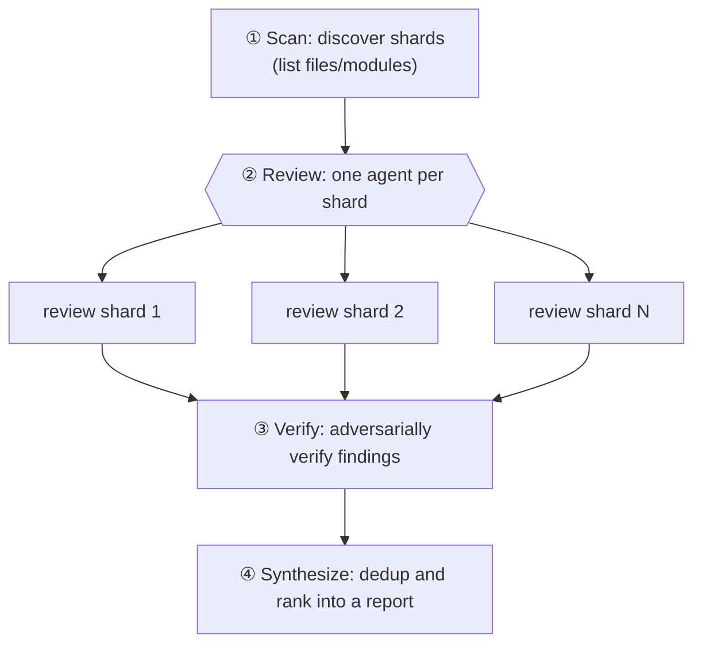
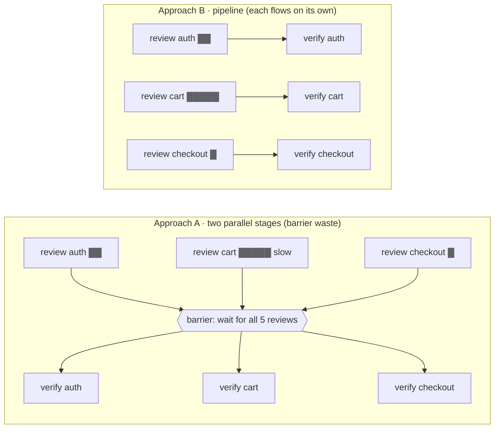

# Chapter 10 · Sharded Code Review

> A large codebase won't fit into a single agent's effective context, and cramming it in just makes the agent "forget the front while reading the back." The idea behind sharded review is plain: **slice the big target into small shards, send one agent per shard to review independently, then adversarially verify, and finally synthesize.** This chapter walks through this "discover → review → verify → synthesize" four-stage pattern in full — the focus isn't "you can slice," but **how to use `pipeline` so each shard flows through "review → verify" with no barrier between stages**, and **when you should break that rule and add a barrier**.
>
> It and Chapter 11's "Multi-dimension PR Review" are a pair of twins: Chapter 11 slices by **dimension** (a11y/performance/correctness), this chapter slices by **shard** (file/module/function block). The two chapters lean on the same set of real runs as their empirical base, but they describe two sides of one coin — Chapter 11 is "one piece of code, many viewpoints, barrier to close"; this chapter is "many shards, each independent, pipelined forward."

---

## 10.1 Recipe Motivation: Divide-and-Conquer + Context Isolation

Why not just hand the whole codebase to one agent? Two reasons:

1. **Limited context**: however large the window, it has a boundary; once it's full, quality drops off a cliff.
2. **Diluted attention**: make one agent watch 50 files at once and its attention on each file gets spread thin.

Sharded review leans on Workflow's core strength — **each subagent has independent context** (see Chapter 06): each shard only looks at its own little piece, attention stays concentrated, and the main-loop context doesn't get drowned by raw code (only structured findings flow back).



But first, remember a more precise fact: the diagram above draws Review and Verify as two "full-width" horizontal bands, which **easily tricks you into thinking there's a barrier between them** — as if "all shards must finish review before any can move into verify." **This is exactly the intuition this chapter sets straight.** The truly efficient form of sharded review is: **each shard is verified the moment it's reviewed, without waiting for others**; only the final Synthesize genuinely needs to "see everything." The next section writes this form out with `pipeline`.

---

## 10.2 The Four-Stage Skeleton

```javascript
export const meta = {
  name: 'sharded-review',
  description: 'Discover shards, review each independently, verify findings, synthesize',
  phases: [
    { title: 'Scan', detail: 'Discover code shards' },
    { title: 'Review', detail: 'Review each shard independently' },
    { title: 'Verify', detail: 'Adversarially verify findings' },
    { title: 'Synthesize', detail: 'Produce final report' },
  ],
}

const FINDING = { type: 'object', properties: {
  findings: { type: 'array', items: { type: 'object',
    properties: { severity: { type: 'string', enum: ['critical','high','medium','low'] },
                  shard: { type: 'string' }, title: { type: 'string' }, fix: { type: 'string' } },
    required: ['severity','title','fix'] } } }, required: ['findings'] }

// ① Scan —— in a real project a single agent can discover shards via Glob/Grep, or just pass in a file list
phase('Scan')
const shards = ['src/auth.ts', 'src/cart.ts', 'src/checkout.ts' /* … */]

// ②③ Review→Verify use pipeline: each shard is verified the moment it's reviewed, no need to wait for others
const reviewed = await pipeline(
  shards,
  (shard) => agent(`Review ${shard} for bugs, security, and clarity. Read the file.`,
    { label: `review:${shard}`, phase: 'Review', schema: FINDING }),
  (review, shard) => {
    // review may be null: when this shard's review stage throws/is skipped, pipeline sets the item to null (see §10.3)
    if (!review) { log(`skipped shard: ${shard}`); return [] }
    return parallel((review?.findings ?? []).map(f => () =>
      agent(`Adversarially verify this finding in ${shard}: "${f.title}". Refute if not real.`,
        { label: `verify:${shard}`, phase: 'Verify',
          schema: { type: 'object', properties: { real: { type: 'boolean' } }, required: ['real'] } })
        .then(v => ({ ...f, shard, real: v && v.real }))
    )).then(rs => rs.filter(Boolean).filter(x => x.real))
  }
)

// ④ Synthesize —— cross-shard dedup and ranking (needs all results, so the barrier here is correct)
phase('Synthesize')
const all = reviewed.flat().filter(Boolean)
const report = await agent(
  `Deduplicate and prioritize these ${all.length} verified findings: ${JSON.stringify(all)}`,
  { label: 'synthesize', phase: 'Synthesize',
    schema: { type: 'object', properties: { top: { type: 'array', items: { type: 'object',
      properties: { severity: { type: 'string' }, title: { type: 'string' }, fix: { type: 'string' } }, required: ['severity','title','fix'] } } }, required: ['top'] } }
)
return report
```

> The `sharded-review` skeleton above is **illustrative (not executed exactly as-is)**; but every one of its stages is backed by a real run in this book: `pipeline`'s "each item flows through review→verify independently" see Chapter 08's pipeline-demo (real, Run `wf_bf086b98-6ec`); Review→Synthesize's barrier-to-close see Chapter 11's frontend-review (real, Run `wf_4c5caabb-b73`); Verify's adversarial verification see Chapter 15's bug-hunter (real).

This skeleton packs in all of the chapter's key points. Let's unpack them one by one.

### Key Structure: `pipeline` Strings Review→Verify into a Barrier-Free Flow

Take a look at the shape `pipeline(shards, reviewStage, verifyStage)`. It's the **same pattern** as the `pipeline-demo` (Find→Verify) in Chapter 08 — just with items swapped from "bug categories" to "code shards":

- **First stage** (`reviewStage`) gets `(shard, shard, index)` — the first stage's `prevResult` is the item itself (see Chapter 08's `(prevResult, originalItem, index)` signature). It sends an agent to read this shard's code and produce structured findings.
- **Second stage** (`verifyStage`) gets `(review, shard, index)` — `review` is the finding set returned by the previous stage, `shard` is the **original shard path** (you don't have to thread it through; pipeline feeds `originalItem` back automatically). It runs a verification agent concurrently for each finding in that shard.

The semantics of `pipeline` guarantee this: **the moment `src/auth.ts` finishes review, its verify starts immediately — it does not have to wait for `src/checkout.ts` to finish reviewing.** This is exactly "no barrier between stages" — shard A may already be in Verify while shard B is still in Review.

### Nesting: Use `parallel` Inside a Stage to Verify "This Shard's Multiple Findings"

A `parallel(...)` shows up inside the second stage — this is the classic `pipeline`-wrapping-`parallel` combination, but you must keep the boundaries of the **two layers of concurrency** straight:

- **Outer `pipeline`**: lets **different shards** flow independently (auth and cart don't wait for each other).
- **Inner `parallel`**: within a **single shard**, verifies "this shard's N findings" concurrently — this layer genuinely needs a barrier, because `.then(rs => rs.filter(...))` must wait for all of this shard's verdicts together before it can filter.

<div class="callout tip">

**Why is the inner barrier right while the outer barrier would be wrong?** The inner `parallel`'s barrier only locks "a **single shard's** few findings" — small granularity, short wall-clock, and the next step (filtering out `real` findings) genuinely needs all of this shard's verdicts. If the outer were a barrier too (splitting Review and Verify into two full-width `parallel` stages), it would lock **all shards** — fast shards would be stuck idling until the slowest one finishes reviewing before any verify can begin. The criterion is still that sentence from Chapter 08: **a barrier is only correct when "the next step needs all results of this group"**; the inner satisfies it, the outer doesn't.

</div>

### `opts.phase` for Explicit Grouping, to Avoid Concurrent Contention over Global `phase()`

Every `agent()` in the skeleton carries `phase: 'Review'` / `phase: 'Verify'`. Inside `pipeline`/`parallel`, multiple agents advance concurrently; if they all leaned on the global `phase('Review')` for grouping, the progress tree would **race and misalign** (shard A's verify might get counted into a Review group that shard B just opened). Explicit `opts.phase` pins each agent to the progress group it belongs to — this is the progress-grouping idiom emphasized again and again in Chapters 05/08.

---

## 10.3 pipeline Sharding vs parallel Barrier: This Chapter's Core Tradeoff

This is the choice that sharded review most needs to get right, and where it parts ways with Chapter 11. Both approaches "run," but their wall-clock cost differs by a lot.

### The Same Two-Stage Task, Two Ways

Suppose there are 5 shards, each to be reviewed then verified.

**Approach A · Two `parallel` stages (barrier between stages):**

```javascript
// (illustrative, not executed) barrier between stages: all 5 reviews must finish before any verify can start
const reviews = await parallel(shards.map(s => () => agent(reviewPrompt(s), { schema: FINDING })))
const verified = await parallel(reviews.filter(Boolean).map(r => () => agent(verifyPrompt(r), { schema: VERDICT })))
```

**Approach B · One `pipeline` (barrier-free flow):**

```javascript
// (illustrative, not executed) each shard flows on its own: the moment auth's review finishes, its verify starts — no waiting for others
const verified = await pipeline(shards,
  s => agent(reviewPrompt(s), { schema: FINDING }),
  review => agent(verifyPrompt(review), { schema: VERDICT })
)
```



The difference: if the `cart` shard is especially large and slow to review, in Approach A **`auth` and `checkout` — already reviewed and ready to verify right away — still have to idle waiting for `cart`** — the barrier drags the fast ones down to the slow one's pace. Approach B's `pipeline` lets `auth` and `checkout` verify the moment they finish reviewing; wall-clock ≈ **the slowest single chain** (`cart`'s review+verify), not "the sum of each stage's slowest."

<div class="callout info">

**Official criterion (from the tool definition)**: **use `pipeline()` by default for multi-stage tasks.** Only use a barrier (`parallel`) when "stage N needs **all** items' results from the previous stage." Sharded review's Review→Verify does **not** meet this condition (verifying auth's findings doesn't need cart's findings), so it **should use pipeline by default** — that's the root reason the skeleton is written that way.

</div>

### Real Data Confirms the "No Barrier" Form

We didn't run a dedicated N-shard pipeline for sharded review, but Chapter 08's **pipeline-demo** already nails this mechanism — it's the minimal true form of Review→Verify:

> **Real run**: Run ID `wf_bf086b98-6ec`, 3 items × 2 stages, `agent_count=6`, `total_tokens=158982`, `duration_ms=26743`. The stage callback signature is empirically `(prevResult, originalItem, index)` (in the second stage's `(found, kind)`, `found` is the previous stage's return value, `kind` is the original item). See `assets/transcripts/primitives.md`.

`agent_count=6` precisely confirms "3 items × 2 stages = 6 agents"; and each item flowing through both stages independently with no barrier between them is exactly what you get by scaling this chapter's skeleton up to N shards verbatim. Raise the shard count from 3 to 20 and the agent count rises linearly to 40, but **wall-clock won't** rise linearly — the concurrency cap is `min(16, cores−2)` (the authoritative official figure, see Chapter 08 §8.6): at most that many agents run at any instant, the rest queue up and get filled in as slots free up. And pipeline keeps early-finishing shards from idling.

### When Should You Use a Barrier Instead? (The Synthesize Step)

The skeleton's last step `phase('Synthesize')` uses a **full-width barrier** — this time it's **correct**. Because dedup and ranking need a **cross-shard global view**:

- The same utility function referenced once each by `auth.ts` and `cart.ts` may have the two shards each report the same-root bug — only an agent that sees **all** findings can merge them.
- Ranking is global: an auth CRITICAL must rank before a cart LOW — a single-shard agent sees only its own pile and can't produce a global order.

So this chapter's tradeoff boils down to one sentence: **Review→Verify use pipeline (each shard flows independently); only use a barrier before Synthesize (needs a global view).** This is a textbook application of Chapter 08's "pipeline by default, barrier only when you genuinely need a global view" principle.

---

## 10.4 Cost Model: Estimate First, Then Run

You can estimate the cost of sharded review almost entirely **up front** — a big advantage of Workflow over a "black-box agent." Two rules of thumb (generalized from real runs in Chapter 08):

<div class="callout tip">

**① token ≈ agent count × per-agent context (≈25k–30k / agent).**
**② Wall-clock is governed by the critical path (the slowest single chain); concurrency compresses N agents down to "the slowest one."**

</div>

Apply it to sharded review by counting the agents first:

```
total agents = (1 discovery agent for Scan, if discovering shards with an agent)
             + N shards × 1 review agent
             + Σ(findings per shard) verify agents
             + 1 synthesize agent
```

A concrete example: review 10 shards, each producing 4 findings on average:

| Stage | Agents | Notes |
|---|---|---|
| Scan | 0~1 | 0 if you pass a file list directly; 1 if you discover with an Explore agent |
| Review | 10 | one per shard |
| Verify | ~40 | 10 shards × ~4 findings |
| Synthesize | 1 | global dedup and ranking |
| **Total** | **~51** | |

Plug into rule ①: `token ≈ 51 × 27k ≈ 1.38M tokens`. That's a **sizable but predictable** number — you can tell before running whether it'll exceed this turn's `budget` (see Chapter 09), instead of getting cut off mid-run by the budget hard cap.

<div class="callout warn">

**The verify stage is the token hog; don't scale it mindlessly.** In the example above, 40 verify agents account for nearly 80% of the tokens. If you adversarially verify every finding, the more shards and findings you have, the more the verify agent count balloons **quadratically**. Two ways to rein it in: (a) verify only `high`/`critical` findings (`filter(f => ['high','critical'].includes(f.severity))` before the verify stage); (b) have one verify agent verify **all of a shard's findings at once** (rather than one agent per finding), replacing the inner `parallel` with a single agent using an array schema. The latter trades agent count for tokens — pick based on which resource you're shorter on.

</div>

As for wall-clock, apply rule ②: under pipeline, the wall-clock for 10 shards ≈ **the slowest shard** completing "review → all of that shard's verifies → (it finishes before synthesize)," **not** the sum of 51 agents in series. That's why sharded review can keep wall-clock in the minutes range while "reading the whole large codebase" — a real reference is Chapter 11's 4-dimension review, `agent_count=4` yet it ran about 4.5 minutes (`duration_ms=272643`), because a single agent must actually read the whole file and the critical path gets stretched by "the slowest dimension."

---

## 10.5 Shard Granularity: By File / By Directory / By Dimension

How big should a "shard" be? This is the core decision of the Scan stage, and it directly sets agent count and finding quality. Three common slicing approaches:

| Approach | One shard = | Suited for | Caveat |
|---|---|---|---|
| **By file** | a single source file | PRs with changes spread across files; medium-size repos | most common, most balanced; an oversized file may still not fit and needs a finer level |
| **By directory/module** | a directory or package | large monorepos, libraries clearly partitioned by domain | a shard may contain many files, the agent must Glob then read each; coarse granularity, fewer agents, heavier per-agent context |
| **By dimension** | a review viewpoint (a11y/security/perf…) | a single file or small target needing multi-viewpoint depth | **this is Chapter 11's home turf**; orthogonal to "by file," can be stacked |
| **By change** | files touched by `git diff` | PR / CI scenarios | reviews only the changed surface, saves tokens; use one agent to run `git diff --name-only` and produce the shard list |

<div class="callout info">

**Granularity is, at heart, a tradeoff between "per-agent context" and "agent count."** The finer you slice (by file, even by function block), the lighter each shard's context, the more concentrated the attention, the higher the finding density — but the more agents, and the more findings the synthesize stage must dedup. The coarser you slice (by directory), the fewer agents and the easier the synthesis — but the heavier the per-agent context, with a risk of "forgetting the back while reading the front." **Empirical starting point: slice by file**; drop to "by function block / by region" when you hit oversized files that won't fit, and rise to "by directory" when there are too many files (>30).

</div>

### How Is the Scan Stage Implemented?

The simplest Scan is just **passing a file list directly** (like the hard-coded array in the skeleton, or passed in via `args`) — zero tokens, zero latency. When you need dynamic discovery, use one agent with `agentType: 'Explore'` (one of the empirically-available built-in agents, see Chapter 06) to run Glob/Grep:

```javascript
// (illustrative, not executed) use one Explore agent to discover shards; schema forces a file list back
phase('Scan')
const scan = await agent(
  'Glob the repo for source files under src/ that changed in the last commit ' +
  '(use `git diff --name-only HEAD~1`). Return the list.',
  { label: 'scan', agentType: 'Explore',
    schema: { type: 'object', properties: { shards: { type: 'array', items: { type: 'string' } } }, required: ['shards'] } }
)
const shards = scan.shards
```

Note: file/shell operations can only live inside `agent()` leaves — the script body has no `require`/`process`/`fetch` (host APIs are absent, see Chapter 06 and Appendix B); Glob/Grep/Bash are tools only subagents have.

---

## 10.6 Dedup and Merge: The Real Value of Synthesize

The final "Synthesize" step of sharded review isn't just stitching findings together — its core value is **dedup + ranking**, and that's exactly why it needs a barrier (to see all findings).

**Why is duplication inevitable?** Shards are sliced along physical boundaries (file/directory), but bugs don't grow along that boundary:

- **Same-root bug recurs across shards**: a defective utility function referenced by multiple shards gets reported once at each call site.
- **Same shard, multiple viewpoints**: if the shard agent's prompt carries multiple concerns (security + readability), the same line of code can get recorded twice from two angles.
- **Class-level defects**: a problem like "generating ids from text without dedup" gets reported once at each id-generation site — but they're actually **the same bug class**.

<div class="callout tip">

**Give every finding a `severity` + `shard`, so dedup has something to go on.**
- `severity` lets synthesize **rank globally** (CRITICAL before LOW).
- `shard` lets you **locate back to the source**, and lets synthesize spot "these two come from different shards but describe the same root cause → merge, and list all hit shards on the merged issue."

This is the same technique as Chapter 11's tagging each finding with `dim` (its source dimension) — **tag findings with their source so the synthesized result is explainable and traceable.**

</div>

Merging isn't naive string de-duplication; it's having the synthesize agent do a **semantic merge**: recognize "auth.ts's SQL concatenation" and "cart.ts's SQL concatenation" as the same "injection risk" class, and output one merged issue carrying `shards: ['auth.ts','cart.ts']`. That judgment needs an agent that **sees all findings** — which is the root reason Synthesize must come after the barrier.

---

## 10.7 Confirmed by a Real Run: Dimension Sharding

This book's Chapter 11 **frontend-review** is a real "sharded review" — except it shards by **dimension** rather than file, reviewing this book's own `index.html` from three dimensions at once: a11y / performance / correctness:

> **Real run**: Run ID `wf_4c5caabb-b73`, `agent_count=4` (3 dimension reviews + 1 synthesis), `total_tokens=221648`, `duration_ms=272643`. Produced 26 findings → synthesized and deduped into 16 issues. See `assets/transcripts/frontend-review.md` for details.

It confirms two key points of sharded review:

1. **`parallel` reviews concurrently, `synthesize` closes the loop**: three dimension agents run concurrently, and a final agent takes all the findings to dedup and rank — here the barrier before synthesize is **correct** (it needs a cross-shard global view, see Chapter 08 §8.5).
2. **Findings can directly drive fixes**: those 16 issues got fixed one by one into `index.html` (XSS, no focus indicator, duplicate heading IDs…) — review isn't the endpoint, it's the starting point for action.

<div class="callout info">

**Why did this real run use `parallel` rather than `pipeline`?** Because it has only "Review → Synthesize" two stages, with **no intermediate Verify**. Review goes straight into Synthesize, and Synthesize inherently needs all findings — so running the three dimension agents concurrently with one `parallel` barrier and collecting them together is the cleanest way. This chapter's skeleton has an extra **Verify** stage, and it's precisely this intermediate stage that surfaces `pipeline`'s "no barrier" advantage: each shard is verified the moment it's reviewed, no need to wait for others. **Whether there's an intermediate stage decides whether you use a barrier or a pipeline.** Chapter 11 walks through the full 26→16 process of this dogfood run.

</div>

---

## 10.8 Design Points

**① How does the Scan stage slice shards?** The three common approaches are in §10.5: by file/module (most common), by dimension (Chapter 11), by change (the PR scenario's `git diff`). Granularity is, at heart, a tradeoff between "per-agent context" and "agent count."

**② Review→Verify use pipeline; only use a barrier before Synthesize.** Each shard is verified the moment it's reviewed (no need to wait for others), but dedup and ranking need all results — this is a textbook application of the "pipeline by default, barrier only when you genuinely need a global view" principle (Chapter 08). When you wrap parallel inside pipeline, keep the two layers of barriers straight: the inner (single shard, multiple findings) barrier is right, the outer (cross-shard) barrier is wrong.

**③ Give every finding a `severity` + `shard`.** A structured severity lets synthesize rank, and `shard` lets you locate back to the source and supports cross-shard semantic dedup.

**④ Don't let raw code flow back to the main loop.** The subagent reads files and returns only **structured findings** — this is exactly what makes sharded review save context. What flows in the main loop is always small objects like `{severity, shard, title, fix}`, not thousands of lines of source.

**⑤ Estimate cost before running.** Use the §10.4 formula to count agents and estimate tokens, and check against this turn's `budget` (Chapter 09) before running — the verify stage is the hog; rein it in by filtering on severity or "one verify per shard."

---

## 10.9 Variants

<div class="callout info">

**Variant A · Multi-file × multi-dimension (pipeline wrapping parallel)**: stack this chapter (shard by file) and Chapter 11 (shard by dimension) — `pipeline(files, reviewAllDims, synthesizePerFile)`, where each file flows independently through "multi-dimension concurrent review → per-file synthesis," followed by a cross-file final synthesis. The outer pipeline lets files flow independently, the inner parallel runs dimensions concurrently — this is the standard form for orthogonally stacking two kinds of sharding.

**Variant B · Verify only high-severity findings**: `filter(f => ['critical','high'].includes(f.severity))` before the verify stage, spending adversarial verification only on findings worth verifying; the verify agent count and tokens get cut substantially right away (see the cost warning in §10.4).

**Variant C · One verify per shard (trade agent count for tokens)**: replace the inner `parallel(findings.map(one agent per finding))` with a single verify agent using an array schema — verify all of a shard's findings at once. Agent count drops from "Σ findings" to "N shards," but each verify agent's context is heavier.

**Variant D · Review + auto-fix**: string this chapter (produce a ticket) and Chapter 12's GCF (fix per ticket) into a nested Workflow (Chapter 20) — the upper layer's sharded review produces issues, the lower layer runs "fix → verify" per issue, i.e. the fully automated version of "review output directly drives fixes."

</div>

---

## 10.10 Chapter Summary

- Sharded review = Scan (discover shards) → Review (one independent agent per shard) → Verify (adversarial verification) → Synthesize (cross-shard dedup and ranking).
- Leans on subagent independent context: each shard's attention stays concentrated, the main loop receives only structured findings, raw code doesn't flow back.
- **Core tradeoff**: Review→Verify use `pipeline` (each shard flows independently, no barrier, wall-clock ≈ slowest single chain), with a barrier only before Synthesize (needs a cross-shard global view to dedup and rank). When you wrap parallel inside pipeline, keep the two layers of barriers straight: inner (single shard, multiple findings) right, outer (cross-shard) wrong.
- **Cost is estimable up front**: `token ≈ agent count × ~27k`; wall-clock is governed by the critical path. The verify stage is the token hog; rein it in by filtering on severity or "one verify per shard."
- **Shard granularity** is a tradeoff between "per-agent context vs agent count": by file (most balanced) / by directory (fewer agents, heavier context) / by dimension (orthogonal, Chapter 11) / by change (saves tokens).
- Real confirmation: for the pipeline mechanism see pipeline-demo (Run `wf_bf086b98-6ec`, 6 agents confirm "3 items × 2 stages"); for end-to-end sharded review see frontend-review (dimension sharding, Run `wf_4c5caabb-b73`), which ran out 26→16 issues and drove real fixes.

The next chapter is its twin: the dimension-sliced multi-dimension PR Review, which we walk through in detail with that real dogfood run (`wf_4c5caabb-b73`), covering the full 26→16 process.

> Continue reading: [Chapter 11 · Multi-dimension PR Review](#/en/p3-11)

---

[← Back to main README](../../README.md) · [中文 README →](../../README.md)
