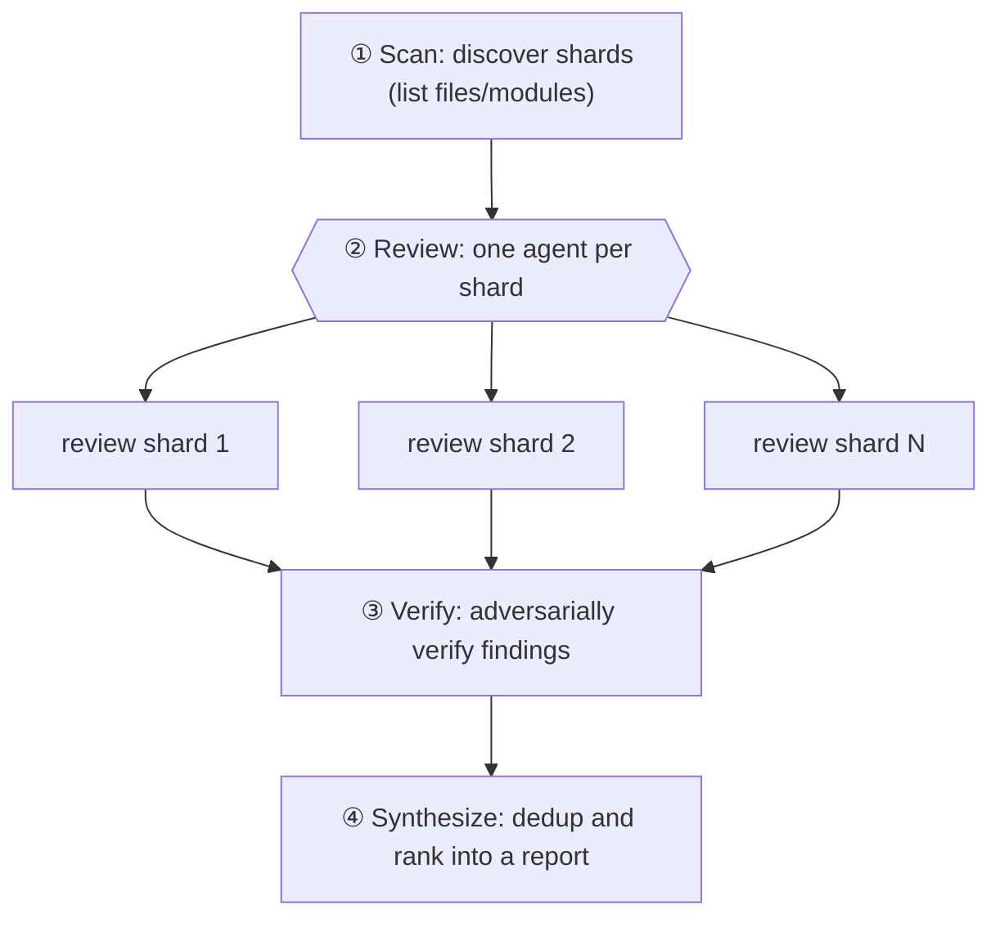

# Chapter 10 · Sharded Code Review

> A large codebase won't fit into a single agent's effective context, and cramming it in makes the agent "forget the front while reading the back." The idea behind sharded review is plain: **slice the big target into small shards, dispatch one agent per shard to review independently, then adversarially verify, and finally synthesize.** This chapter explains this "discover → review → verify → synthesize" four-stage pattern thoroughly.
>
> It and Chapter 11's "Multi-dimension PR Review" are a pair of twins: Chapter 11 slices by **dimension** (a11y/performance/correctness), this chapter slices by **shard** (file/module/function block).

---

## 10.1 Recipe Motivation: Divide-and-Conquer + Context Isolation

Why not just hand the whole codebase to one agent? Two reasons:

1. **Limited context**: however large the window, it has a boundary; once full, quality drops off a cliff.
2. **Diluted attention**: making one agent watch 50 files at once thins out its attention on each file.

Sharded review leverages Workflow's core strength — **each subagent has independent context** (see Chapter 06): each shard only looks at its own little piece, attention is concentrated, and the main-loop context isn't drowned by raw code (only structured findings flow back).



---

## 10.2 The Four-Stage Skeleton

```javascript
export const meta = {
  name: 'sharded-review',
  description: 'Discover shards, review each independently, verify findings, synthesize',
  phases: [
    { title: 'Scan', detail: 'Discover code shards' },
    { title: 'Review', detail: 'Review each shard independently' },
    { title: 'Verify', detail: 'Adversarially verify findings' },
    { title: 'Synthesize', detail: 'Produce final report' },
  ],
}

const FINDING = { type: 'object', properties: {
  findings: { type: 'array', items: { type: 'object',
    properties: { severity: { type: 'string', enum: ['critical','high','medium','low'] },
                  shard: { type: 'string' }, title: { type: 'string' }, fix: { type: 'string' } },
    required: ['severity','title','fix'] } } }, required: ['findings'] }

// ① Scan —— in a real project a single agent can discover shards via Glob/Grep, or just pass in a file list
phase('Scan')
const shards = ['src/auth.ts', 'src/cart.ts', 'src/checkout.ts' /* … */]

// ②③ Review→Verify use pipeline: each shard is verified the moment it's reviewed, no need to wait for others
const reviewed = await pipeline(
  shards,
  (shard) => agent(`Review ${shard} for bugs, security, and clarity. Read the file.`,
    { label: `review:${shard}`, phase: 'Review', schema: FINDING }),
  (review, shard) => parallel((review.findings || []).map(f => () =>
    agent(`Adversarially verify this finding in ${shard}: "${f.title}". Refute if not real.`,
      { label: `verify:${shard}`, phase: 'Verify',
        schema: { type: 'object', properties: { real: { type: 'boolean' } }, required: ['real'] } })
      .then(v => ({ ...f, shard, real: v && v.real }))
  )).then(rs => rs.filter(Boolean).filter(x => x.real))
)

// ④ Synthesize —— cross-shard dedup and ranking (needs all results, so the barrier here is correct)
phase('Synthesize')
const all = reviewed.flat().filter(Boolean)
const report = await agent(
  `Deduplicate and prioritize these ${all.length} verified findings: ${JSON.stringify(all)}`,
  { label: 'synthesize', phase: 'Synthesize',
    schema: { type: 'object', properties: { top: { type: 'array', items: { type: 'object',
      properties: { severity: { type: 'string' }, title: { type: 'string' }, fix: { type: 'string' } }, required: ['severity','title','fix'] } } }, required: ['top'] } }
)
return report
```

> The `sharded-review` skeleton above is **illustrative (not executed exactly as-is)**; but every one of its stages is validated by a real run in this book: Review→Synthesize see Chapter 11's frontend-review (real), and Verify's adversarial verification see Chapter 15's bug-hunter (real).

---

## 10.3 Confirmed by a Real Run: Dimension Sharding

This book's Chapter 11 **frontend-review** is a real "sharded review" — except it shards by **dimension** rather than file, reviewing this book's own `index.html` from three dimensions at once: a11y / performance / correctness:

> **Real run**: Run ID `wf_4c5caabb-b73`, `agent_count=4` (3 dimension reviews + 1 synthesis), `total_tokens=221648`, `duration_ms=272643`. Produced 26 findings → synthesized and deduped into 16 issues. See `assets/transcripts/frontend-review.md` for details.

It confirms two key points of sharded review:

1. **`parallel` reviews concurrently, `synthesize` closes the loop**: three dimension agents run concurrently, and a final agent takes all the findings to dedup and rank — here the barrier before synthesize is **correct** (it needs a cross-shard global view, see Chapter 08 §8.5).
2. **Findings can directly drive fixes**: those 16 issues were fixed one by one into `index.html` (XSS, no focus indicator, duplicate heading IDs…) — review is not the endpoint, it's the starting point for action.

---

## 10.4 Design Points

**① How does the Scan stage slice shards?** Three common approaches:
- By **file/module** (most common): use one agent with `agentType: 'Explore'` to run Glob/Grep and list target files.
- By **dimension** (like Chapter 11): a11y/performance/security/architecture/readability.
- By **change**: only review the files touched by `git diff` (the PR scenario).

**② Review→Verify use pipeline; only use a barrier before Synthesize.** Each shard is verified the moment it's reviewed (no need to wait for others), but dedup and ranking need all results — this is a textbook application of the "pipeline by default, barrier only when you genuinely need a global view" principle (Chapter 08).

**③ Give every finding a `severity` + `shard`.** A structured severity lets synthesize rank, and `shard` lets you locate back to the source.

**④ Don't let raw code flow back to the main loop.** The subagent reads files and returns only **structured findings** — this is exactly what makes sharded review save context.

---

## 10.5 Chapter Summary

- Sharded review = Scan (discover shards) → Review (one independent agent per shard) → Verify (adversarial verification) → Synthesize (cross-shard dedup and ranking).
- Leverages subagent independent context: each shard's attention is concentrated, the main loop receives only structured findings.
- Review→Verify use `pipeline`, with a barrier before Synthesize (needs a global view).
- Real confirmation: frontend-review (dimension sharding, Run `wf_4c5caabb-b73`) ran out 26→16 issues and drove real fixes.

The next chapter is its twin: the dimension-sliced multi-dimension PR Review, which we expand on in detail with that real dogfood run.

> Continue reading: [Chapter 11 · Multi-dimension PR Review](#/en/p3-11)
