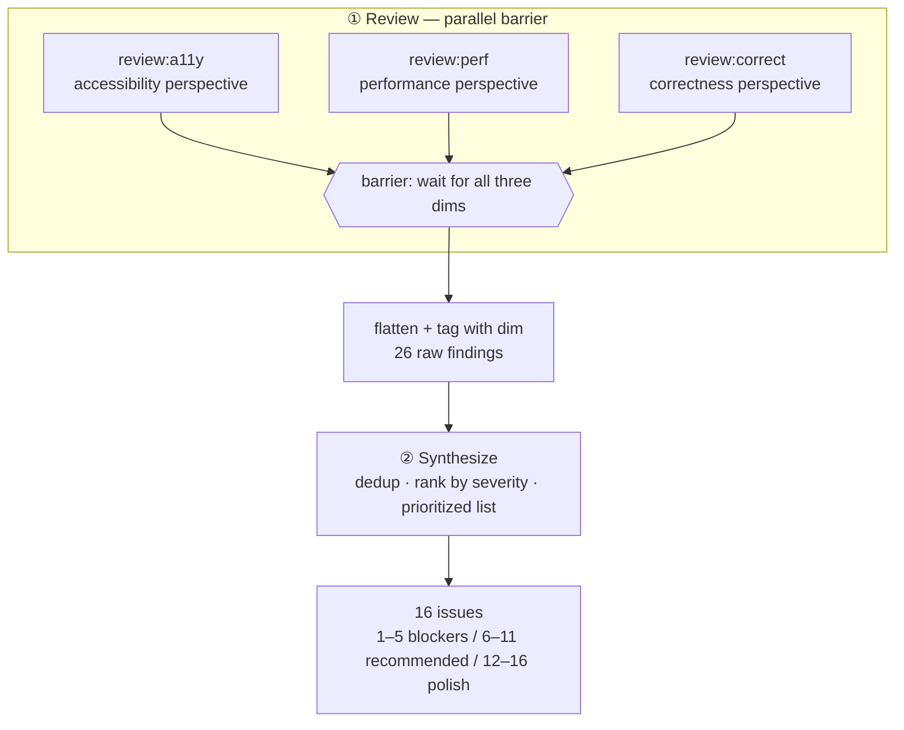
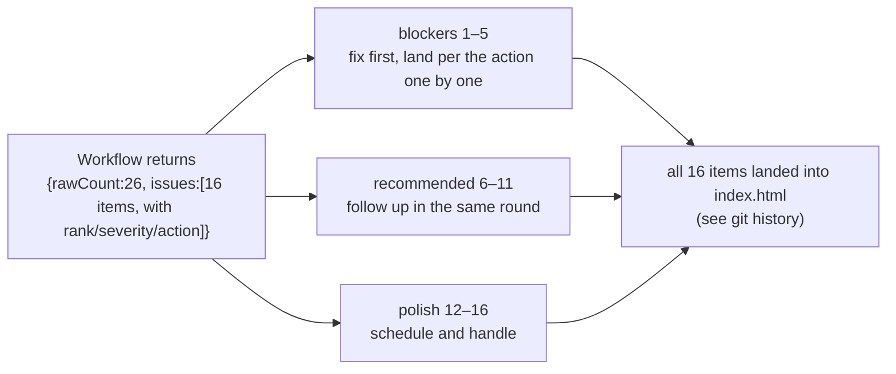

# Chapter 11 · Multi-dimension PR Review

> A proper Code Review is never about looking at just one dimension. A security engineer watches for injection and XSS, a performance engineer watches for blocking and reflow, an accessibility expert watches for focus and contrast — they **each look at their own thing, without interfering**, and at the end one person **aggregates, dedups, and ranks the fix order** of all the opinions. This chapter ports this human collaboration into Workflow: **parallel multi-dimension concurrent review → one synthesize agent consolidates into a prioritized list**. The running case is a real piece of dogfooding — we used this recipe to review this book's own frontend `index.html`, dug out XSS, no focus indicator, duplicate heading IDs and other issues, and based on it **really fixed 16 items.**

---

## 11.1 Recipe Motivation

Chapter 10's "Sharded Code Review" solves the problem of **a single dimension at too large a scale**: a diff is thousands of lines, slice it into shards so multiple agents can look at parts. This chapter solves the **orthogonal problem** — **the same code, multiple dimensions.**

Why can't one agent "look at all dimensions together"? Three practical reasons:

- **Diluted attention.** Making the same agent watch security, performance, and accessibility at once, it tends to skim each dimension shallowly, giving you a list that "looks comprehensive but is actually deep on none." Splitting the dimensions **across independent agents**, each agent digs deep with a single perspective, and the finding density is significantly higher.
- **Naturally concurrent.** The a11y review doesn't depend on the conclusions of the perf review; the three dimensions are unrelated — this is exactly the **textbook scenario** for the `parallel()` barrier: run concurrently, collect together.
- **Aggregation is a separate process.** The findings each dimension produces will **overlap** (e.g., "CDN script blocks rendering" is both a perf issue and might be mentioned in passing by the a11y review), and they also need **cross-dimension prioritization** (a CRITICAL XSS must rank ahead of a LOW copy issue). This "dedup + rank" process needs **an agent that can see all the findings** — so it must come **after** the concurrency barrier.

So the recipe is a clean two-stage structure:



<div class="callout info">

**Why should a barrier (`parallel`) be used here rather than `pipeline`?** Recall Chapter 08's criterion: **multi-stage defaults to pipeline; only use a barrier when the next stage needs the results of "all" items from the previous stage.** Synthesize needs to do **global dedup and cross-dimension ranking** — it must wait for **all** three dimensions to hand in before it can act. This is exactly the "real form of correct barrier use: dedup" listed in Chapter 08.

</div>

---

## 11.2 The Full Script

**(An illustrative script fleshed out from the transcript skeleton — not run verbatim; the actual run's Run ID and usage are in 11.3.)** Below is the script skeleton of this real run (its structure is consistent with `assets/transcripts/frontend-review.md`). The three dimensions' `prompt`s and synthesize's schema are elided with `...`/`{...}` in the transcript; here they are **completed into a directly runnable form** and annotated inline as "(illustrative completion)"; the parts that genuinely exist in the transcript (`meta`, `FINDINGS`, the `parallel` review and flatten, the synthesize call, the `return`) are left as-is.

```javascript
export const meta = {
  name: 'frontend-review',
  description: 'Multi-dimension review of index.html: a11y, performance, correctness',
  phases: [{ title: 'Review' }, { title: 'Synthesize' }],
}

const FILE = '/abs/path/to/index.html'  // the real file under review

// All dimensions share the same finding schema: severity + title + detail + fix
const FINDINGS = {
  type: 'object',
  properties: {
    findings: {
      type: 'array',
      items: {
        type: 'object',
        properties: {
          severity: { type: 'string', enum: ['critical', 'high', 'medium', 'low'] },
          title: { type: 'string' },
          detail: { type: 'string' },
          fix: { type: 'string' },
        },
        required: ['severity', 'title', 'detail', 'fix'],
      },
    },
  },
  required: ['findings'],
}

// Three orthogonal dimensions, each with its own perspective-driven prompt (illustrative completion: elided with ... in the transcript)
const dims = [
  {
    key: 'a11y',
    prompt:
      `You are an accessibility (a11y) reviewer. Read ${FILE} and find WCAG / keyboard / ` +
      `screen-reader / focus / contrast / landmark issues. Be specific with selectors and WCAG refs.`,
  },
  {
    key: 'perf',
    prompt:
      `You are a web performance reviewer. Read ${FILE} and find render-blocking resources, ` +
      `layout thrash, unthrottled handlers, oversized/eager assets, main-thread work. Be specific.`,
  },
  {
    key: 'correct',
    prompt:
      `You are a correctness/security reviewer. Read ${FILE} and find XSS sinks, race conditions, ` +
      `state desync, missing error handling, logic bugs. Be specific and show the offending code.`,
  },
]

phase('Review')
// Three-dimension concurrent review: each thunk runs one agent, schema forces structured findings, then tag with dim
const reviews = await parallel(
  dims.map((d) => () =>
    agent(d.prompt, { label: `review:${d.key}`, phase: 'Review', schema: FINDINGS })
      .then((r) => ({ dim: d.key, findings: (r && r.findings) || [] }))
  )
)
// After the barrier releases: filter out dead dimensions, flatten into one flat finding stream, each carrying its dim source
const all = reviews.filter(Boolean).flatMap((r) => r.findings.map((f) => ({ ...f, dim: r.dim })))

phase('Synthesize')
// The synthesize agent sees all findings: dedup, rank by severity, produce an actionable prioritized list
const SUMMARY = {  // illustrative completion: elided with {...} in the transcript
  type: 'object',
  properties: {
    issues: {
      type: 'array',
      items: {
        type: 'object',
        properties: {
          rank: { type: 'number' },
          severity: { type: 'string', enum: ['critical', 'high', 'medium', 'low'] },
          title: { type: 'string' },
          action: { type: 'string' },
          dims: { type: 'array', items: { type: 'string' } },  // which dimensions hit this issue
        },
        required: ['rank', 'severity', 'title', 'action'],
      },
    },
    blockers: { type: 'array', items: { type: 'number' } },  // ranks of release blockers
  },
  required: ['issues'],
}
const summary = await agent(
  `These are ${all.length} findings (JSON): ${JSON.stringify(all)}. ` +
    `Dedup across dimensions, rank by severity, and produce a prioritized action list. ` +
    `Mark which ranks are release blockers.`,
  { label: 'synthesize', phase: 'Synthesize', schema: SUMMARY }
)

const byDimension = dims.reduce(
  (acc, d) => ({ ...acc, [d.key]: all.filter((f) => f.dim === d.key).length }),
  {}
)
return { rawCount: all.length, byDimension, ...summary }
```

Three idioms worth remembering:

- **`schema` reuse.** The three dimensions share the same `FINDINGS` schema — this guarantees the outputs of different perspectives are **structurally uniform**, so the synthesize stage can treat them as a homogeneous data stream. See Chapter 07 for the details of schema's hard constraints.
- **`.then()` tagging.** Each review agent, right after returning, does `.then((r) => ({ dim, findings }))` to **thread** "which dimension this finding came from" into the result. This is exactly the `.then()` context-merging idiom from Chapter 08.
- **`opts.phase` explicit grouping.** Inside `parallel`, every `agent()` explicitly carries `phase: 'Review'` — to avoid concurrent agents racing on the global `phase()` (the progress-grouping pitfall of Chapters 08/05).

---

## 11.3 Real Run Results

> **Real run**: Run ID `wf_4c5caabb-b73`, Task ID `wss21eu0x`. See `assets/transcripts/frontend-review.md` for the raw record.
> Real usage: `agent_count=4` (3 reviews + 1 synthesis) ｜ `tool_uses=13` ｜ `total_tokens=221648` ｜ `duration_ms=272643` (about 4.5 minutes).

### From 26 Raw Findings to 16 Issues

The three dimensions handed in concurrently, producing **rawCount = 26** raw findings in total:

| Dimension | Raw finding count |
|---|---|
| a11y (accessibility) | 10 |
| perf (performance) | 6 |
| correct (correctness/security) | 10 |
| **Total** | **26** |

After seeing all 26, the synthesize agent **dedups across dimensions and ranks by severity**, converging to **16 clear issues**, and gives three tiers of fix order: **1–5 release blockers, 6–11 strongly recommended, 12–16 polish.**

<div class="callout tip">

**This step, 26 → 16, is the entire value of synthesize.** Among the 10 a11y findings, "no focus indicator" and "focus not visible" are actually the same thing; perf's "CDN blocking" and correct's incidental mention of "script loading approach" also overlap. Only an agent that can see **all** 26 can merge them and decide "XSS ranks 1st, the copy issue ranks 13th." This is what a single-dimension review agent **cannot** do — it only sees its own patch.

</div>

### Release Blockers (the top 5 the synthesize really decided)

These are the 5 items the synthesize agent ranked as must-fix-first (all are real outputs, with their decisions and fix suggestions excerpted):

| # | Severity | Issue | Real decision and fix |
|---|---|---|---|
| 1 | CRITICAL | **DOM XSS** | `marked.parse()` result goes straight to `innerHTML`; marked v12 has no built-in sanitizer (removed since v5), `gfm:true` lets raw inline HTML through → an `` in a same-origin `.md` will execute script. **Fix**: wrap with DOMPurify; the mermaid error fallback must also escape `&`/`"`, not just `<`. |
| 2 | CRITICAL | **No focus indicator** | The global `button{border:none}` wipes the outline, and not a single `:focus-visible` exists in the whole sheet → the whole page is Tab-able but focus is invisible (WCAG 2.4.7). **Fix**: add `:focus-visible{outline:2px solid var(--accent);outline-offset:2px}`. |
| 3 | HIGH | **Duplicate heading IDs** | `enhance()` generates ids purely from text without dedup → duplicate headings collide, TOC/anchors always jump to the first; empty/punctuation-only headings → `id=''`. **Fix**: use a slugger to dedup on each render + an empty-value fallback `section-<i>`. |
| 4 | HIGH | **Async render race** | `renderChapter()`'s `fetch` has no cancellation; rapid A→B navigation lets A's response arrive late and overwrite B. **Fix**: a monotonic `routeSeq` token, validated after the await. |
| 5 | HIGH | **Accent orange contrast too low** | Links/inline code/active nav etc. are < 4.5:1 in many places (WCAG 1.4.3). **Fix**: darken the text color (≥`#B8430F`), keep bright orange for large text/progress bar. |

<div class="callout warn">

**Note the backstory of item 3.** This "duplicate heading IDs + empty-value fallback" issue is **the same source** as the lesson Chapter 12's GCF recipe dug out on `slugify` — both are "generate ids from text without dedup, without handling empty/astral characters." Two independent Workflow runs (one a GCF deduction of slugify, one this chapter's multi-dimension review of the real file) point to the same bug class, and were ultimately landed together into `index.html`'s heading-ID generation logic. **This is the compounding interest of dogfooding**: the more a recipe runs, the more it can cross-confirm the same class of defect.

</div>

### Strongly Recommended and Polish (6–16, excerpts)

- **6** (perf): three CDN scripts render-blocking + mermaid (~500KB) loads even on the figure-less home page + `highlightAuto` runs on the main thread → `defer`, lazy-load on demand, add `preconnect`.
- **7** (perf): an unthrottled scroll handler does 2× `querySelectorAll` per frame + `getBoundingClientRect` per heading → rAF throttle + cached NodeList + `IntersectionObserver`.
- **9** (a11y): the mobile drawer has no `aria-expanded`/Esc/focus management; the sidebar links are still Tab-able when closed.
- **11** (correct): the Copy button assumes `navigator.clipboard` exists with no `.catch` → throws/silently fails under `file://` and insecure http.
- **12–16**: language-preference desync, dynamic content not exposed to AT, missing `prefers-reduced-motion`, anchors with meaningless a11y names, manifest with no error handling, and other polish items.

### How the Review Output Directly Drives the Fix

This run **is not a demo** — its output is an **actionable fix ticket**:



The reason it can "directly drive" lies in the schema: every issue carries `rank` (fix order), `severity` (urgency), and `action` (exactly how to change it). This isn't a piece of prose that "reads comprehensively," but a **structured, checkable-item-by-item** list — a human or a downstream agent can follow it. These 16 items **have all been landed** into this book's frontend `index.html`.

---

## 11.4 Design Points

**① Dimension = perspective, and freely replaceable.** This example used three dimensions a11y / perf / correctness, but the dimension set is **entirely yours to define.** Swap the `dims` array for any of the groups below, and you don't change a single line of the script body:

| Review scenario | Suggested dimensions |
|---|---|
| Backend PR | Security (injection/auth) · Concurrency (race/deadlock) · Error handling · API contract |
| Frontend PR (this chapter) | Accessibility · Performance · Correctness/security |
| Data pipeline | Correctness · Idempotency · Observability · Cost |
| Documentation PR | Accuracy · Completeness · Consistency · Readability |

The stronger the **orthogonality** of the dimensions (the less they overlap), the higher the concurrency payoff and finding density.

**② Constrain all dimensions with a unified schema.** Different perspectives producing **isomorphic** `{severity, title, detail, fix}` is the prerequisite for synthesize to treat them as a single data stream. If each dimension returned its own format, the synthesis stage would first have to do a round of format normalization — needlessly adding complexity and surface area for bugs.

**③ Synthesize must come after the barrier, and see all findings.** Feed the entire `JSON.stringify(all)` to the synthesize agent, letting it dedup and rank **globally**. This is much like Chapter 12's GCF "Fix reconciles item by item": **give the downstream agent complete context, and only then can it make globally optimal decisions.**

**④ Give findings "source tags" to make synthesis explainable.** Each finding carries a `dim` field and the final issue carries a `dims` array — so you can answer "who raised this," "which ones were hit by multiple dimensions simultaneously (which often deserve higher priority)." Observability matters not only for production code but also for the **review output itself.**

<div class="callout tip">

**Cost intuition**: `agent_count=4`, `total_tokens≈221K`, in line with Chapter 08's rule of thumb (tokens ≈ agent count × per-agent context). Note this run's per-agent context is on the high side (≈55K/agent), because each review agent **really read the entire `index.html`** — the file-read tokens went into context. The more dimensions, and the larger the reviewed file, the higher the cost, but the **wall clock does not grow linearly with the number of dimensions** (under the barrier, 3 dimensions only cost "the slowest one's" time).

</div>

---

## 11.5 Variants

<div class="callout info">

**Variant A · Review → Verify → Synthesize (three stages)**: insert an "adversarial verify" stage between Review and Synthesize, letting an independent agent confirm item by item that each finding **really holds** (cull false positives), then synthesize. Here the first two stages can switch to `pipeline` (each finding independently flows through "propose → verify"), with a final barrier for synthesis. See Chapter 17 on adversarial verification.

**Variant B · Multi-file PR**: a real PR often changes multiple files. Use `pipeline(files, reviewAllDims, synthesizePerFile)` to let each file independently flow through "multi-dimension review → single-file synthesis," then add a cross-file overall synthesis at the end. Note that each file's multi-dimension review is still `parallel` internally — this is the common combination of `pipeline` wrapping `parallel`.

**Variant C · Weighted dimension scoring**: not just ranking — give each dimension a weight (e.g., security ×3, copy ×1), letting synthesize produce a quantified "PR health score" for CI gating — below the threshold blocks the merge. This upgrades this chapter's "prioritized list" into an "automatable quality gate."

**Variant D · Review + auto-fix**: chain this chapter (produce a ticket) with Chapter 12's GCF (fix per the ticket) into a nested Workflow (Chapter 20) — the upper layer's review produces issues, and the lower layer runs "fix → verify" for each issue. That is the fully automated version of "review output directly drives the fix."

</div>

---

## 11.6 Chapter Summary

- Multi-dimension PR Review = **parallel multi-dimension concurrent review** (one agent with a single perspective per dimension) + **one synthesize agent to consolidate, dedup, and prioritize.**
- Use a barrier (`parallel`) rather than `pipeline`: because the synthesis stage needs the findings of **all** dimensions to do global dedup and ranking — this is the real form of Chapter 08's "correct barrier use."
- Real run (dogfooding this book's frontend `index.html`): `agent_count=4`, `total_tokens=221648`, `duration_ms=272643`; **26 raw findings → 16 issues**, the top 5 including DOM XSS, no focus indicator, duplicate heading IDs, etc., and **all 16 items have really been landed and fixed.**
- Keys: dimensions **orthogonal and replaceable**, constrained by a **unified schema**, the synthesize agent sees **all findings**, and giving findings **source tags** makes the result explainable.
- Because the review output is a **structured ticket** (with rank/severity/action), it can **directly drive the fix**, rather than being a piece of prose forgotten as soon as it's read.

In the next chapter we switch to a different form of collaboration: no longer "multiple perspectives looking at the same code," but a **generate-critique-fix loop** of "one writes, one nitpicks, one rewrites based on the nitpicks."

> Continue reading: [Chapter 12 · The Generate-Critique-Fix Loop](#/en/p3-12)
