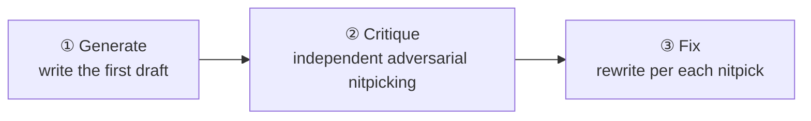

# Chapter 12 · The Generate-Critique-Fix Loop (GCF)

> The first draft of code almost always has blind spots. "Generate → Critique → Fix" has three agents take a relay: one writes, one **specifically nitpicks**, and one rewrites based on the nitpicks. This chapter uses a **real run** to show how it pushes a seemingly simple function from "it runs" to "it's robust."

---

## 12.1 Recipe Motivation

Making the same agent "write then check its own work" tends to work poorly — it inclines to defend its own output. The key to GCF is to **hand the critique to an independent agent** and explicitly ask it to "nitpick." A three-stage sequential pipeline:



This is a natural three-stage `pipeline` (it also applies to a single item), with sequential dependencies between stages: Fix needs Critique's output, Critique needs Generate's output.

---

## 12.2 The Full Script

```javascript
export const meta = {
  name: 'gcf-slugify',
  description: 'Generate-Critique-Fix loop producing a robust slugify (CJK + ASCII)',
  phases: [
    { title: 'Generate', detail: 'First draft' },
    { title: 'Critique', detail: 'Independent adversarial critique' },
    { title: 'Fix', detail: 'Rewrite addressing the critique' },
  ],
}

phase('Generate')
const gen = await agent(
  'Write a JavaScript function `slugify(text)` that converts a heading into a URL anchor id. ' +
  'Requirements: keep CJK characters; spaces->hyphens; strip punctuation; collapse consecutive ' +
  'hyphens; lowercase ASCII; no leading/trailing hyphen. Return only the function code.',
  { label: 'generate', schema: { type: 'object', properties: { code: { type: 'string' } }, required: ['code'] } }
)

phase('Critique')
const crit = await agent(
  `You are an adversarial code reviewer. Critique this slugify for correctness bugs and edge cases ` +
  `(empty string, all-punctuation, mixed CJK/ASCII, leading numbers, collisions, unicode). ` +
  `Be specific. Code:\n${gen.code}`,
  { label: 'critique', schema: { type: 'object', properties: { issues: { type: 'array', items: { type: 'string' } } }, required: ['issues'] } }
)

phase('Fix')
const fixed = await agent(
  `Rewrite slugify to fix every one of these issues: ${JSON.stringify(crit.issues)}. ` +
  `Original:\n${gen.code}\nReturn the final code and a one-line changelog.`,
  { label: 'fix', schema: { type: 'object', properties: { code: { type: 'string' }, changelog: { type: 'string' } }, required: ['code', 'changelog'] } }
)

log(`GCF: critique raised ${crit.issues.length} issues; fix applied`)
return { issuesFound: crit.issues, finalCode: fixed.code, changelog: fixed.changelog }
```

---

## 12.3 Real Run Results

> **Real run**: Run ID `wf_7472ceac-daa`, Task ID `wchxy8dbm`. See `assets/transcripts/gcf-slugify.md` for the raw record.
> Real usage: `agent_count=3` ｜ `total_tokens=96468` ｜ `duration_ms=180724` (about 3 minutes).

The critique stage dug out **10 real defects** in a thirty-line `slugify`, ranked by severity:

| Severity | Defect (real, excerpted) |
|---|---|
| CRITICAL | The regex lacks the `/u` flag, matching by UTF-16 **code unit** rather than code point; `豈-﫿` is actually U+8C48..U+FAFF, **covering the surrogate-pair region** → all emoji/astral characters leak through. Measured: `slugify('I love 🍕 pizza') -> 'i-love-🍕-pizza'` |
| CRITICAL | The CJK range is written wrong/incomplete: a comment claims a full-width range but actually only includes half-width katakana → `slugify('ＨＥＬＬＯ') -> ''`, `slugify('２０２４') -> ''` |
| HIGH | No NFKD normalization → precomposed `café` and decomposed `café` produce **different** slugs; `Straße -> strae` (loses ß) |
| HIGH | All non-CJK/non-Latin scripts get cleared → `slugify('Привет мир') -> ''` |
| HIGH | Collision: `C++`/`C`/`C#` all → `c-programming` |
| MEDIUM×3 | Non-string input leaks (`undefined -> 'undefined'`, `{} -> 'object-object'`); underscores not normalized; zero-width characters silently fuse words |
| LOW×2 | `toLowerCase()` is locale-insensitive (Turkish İ); doesn't handle "leading digits" |

The fixed version accordingly switches to the **`/u` flag** + Unicode script escapes like `\p{Script=Han}` + **NFKC** (folds full-width→ASCII) + **NFKD + stripping `\p{M}`** + unified folding of zero-width/underscores + a non-string fallback.

<div class="callout tip">

**This is exactly the value of GCF**: the first draft from the Generate stage almost always has blind spots (here as many as 10), and an **independent Critique agent explicitly asked to "nitpick"** can systematically force them out. This book's frontend `index.html` heading-ID generation absorbed precisely this run's lesson of "dedup + `/u` + empty-value fallback."

</div>

---

## 12.4 Design Points

**① Critique must be independent and adversarial.** State clearly in the prompt "You are an adversarial code reviewer" and "Be specific," and use a schema to force it to produce a **structured issues list** (rather than a "looks fine" pleasantry). Being structured lets the Fix stage handle them item by item.

**② Fix should reconcile "item by item."** Fix's prompt passes the entire `crit.issues` in, demanding "fix every one of these issues" — so the fix is targeted, not a vague rewrite.

**③ Sequential dependencies use pipeline or direct await.** The three stages are strictly sequential; this example strings them with direct `await` (single item). To run GCF on **multiple** targets at once, use `pipeline(targets, gen, crit, fix)`, letting each target flow independently through the three stages (see Chapter 08).

---

## 12.5 Variants

<div class="callout info">

**Variant A · Multi-round GCF (loop until clean)**: put Critique→Fix in a `while` loop until Critique returns `issues.length === 0` or a round cap is reached. Pair it with a `budget` guard (see Chapter 21) to avoid an infinite loop.

**Variant B · A judge gatekeeps the Fix**: after Fix, add another independent agent that compares the "original issues" with the "fixed version" to confirm each one was really fixed (echoing Chapter 23's superpowers "two-stage review").

**Variant C · Best-of-N**: in the Generate stage use `parallel` to produce N candidates, first use a judge panel (Chapter 14) to pick the best, then run Critique→Fix on the winner.

</div>

---

## 12.6 Chapter Summary

- GCF = Generate → independent adversarial Critique → item-by-item Fix, three stages in sequence.
- Real run: a simple `slugify` had 10 defects dug out (including 2 CRITICAL), and the fixed version systematically resolves them with `/u` + Unicode scripts + NFKC/NFKD.
- Keys: Critique must be **independent**, **asked to nitpick**, and produce **structured issues**; Fix reconciles item by item.
- Variants: loop until clean, a judge gatekeeps, best-of-N.

The next chapter enters the "deep research" recipe: multi-source concurrent retrieval + cross-verification, to investigate an open question deeply and thoroughly.

> Continue reading: [Chapter 13 · Deep Research](#/en/p3-13)
