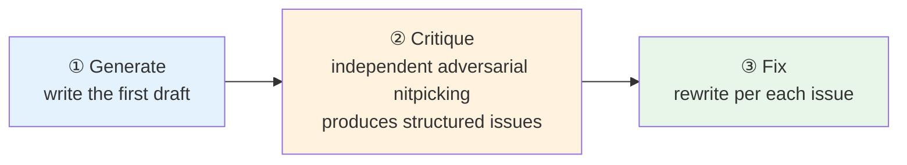
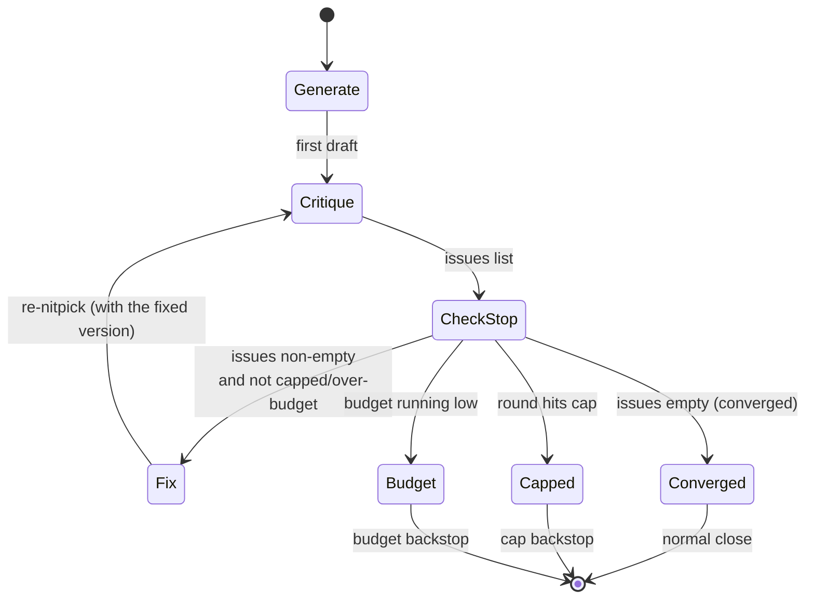
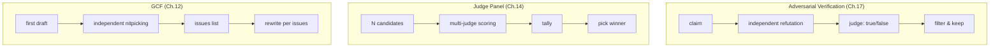

# Chapter 12 · The Generate-Critique-Fix Loop (GCF)

> In one sentence: **The first draft of code almost always has blind spots, but you usually can't see them — unless you hand the code to a separate agent that's been explicitly told to "nitpick." "Generate → Critique → Fix" runs three agents as a relay: one writes, one nitpicks for a living, and one rewrites off the nitpicks. This chapter uses a real run to show how it pushes a seemingly simple function from "it runs" to "it's robust."**
>
> It's a deceptively plain recipe that carries enormous leverage. It shares the same motif — **separating generation from evaluation** — with Chapter 17 (Adversarial Verification) and Chapter 14 (Judge Panel), but lands somewhere different: adversarial verification **judges true/false**, the judge panel **picks the best**, and GCF **fixes based on the critique**. Where the three draw their boundaries, and how they combine, is one of this chapter's focal points.

---

## 12.1 Recipe Motivation: Why an Agent Can't "Check Its Own Work"

Let's start with an approach everyone has tried and almost everyone has fallen flat on.

You ask an agent to "write a `slugify` function" and it does; offhand, you follow up with "check it for bugs." It glances over and replies "looks fine, I've handled spaces, punctuation, and casing." Then you ship it, and the next day you find emoji breaking the anchors and full-width digits getting swallowed whole.

**The root of the problem isn't that the model is "not smart enough" — it's that "self-evaluation" is a structurally flawed task to begin with.** The same agent just wrote this code; its context is full of "here's why I wrote it this way." Ask it to scrutinize itself now and its stance is already anchored — it leans toward **defending itself** rather than **questioning itself**. This is the inescapable result of confirmation bias, the same pit Chapter 17 on adversarial verification opens with.

GCF's core insight is just one sentence: **hand the critique to a fresh, independent agent and explicitly ask it to "nitpick."**

- It has an **independent context**: none of the "I wrote this" baggage, just a piece of code to review.
- It has an **adversarial stance**: the prompt explicitly casts it as a "nitpicking expert" whose success metric is "find where this code doesn't hold up."
- Its output is **structured**: a schema pins the critique into an `issues` array, not a "looks fine" pleasantry.

But GCF takes one crucial step beyond adversarial verification — **it doesn't stop at "find the problems," it hands them to a third agent to "fix item by item."** Adversarial verification ends with a verdict (is this a real bug); GCF ends with a **fixed artifact**. That one-step difference is what sends their use cases off in entirely different directions (see 12.5).

Hence a natural three-stage sequential pipeline:



The stages have **strict sequential dependencies**: Fix waits on Critique's output (the `issues` list), and Critique waits on Generate's output (the first draft of code). This shape — where each stage eats the previous stage's output — is exactly Chapter 08's `pipeline` forte; for a single target you can also just chain them with plain `await` (see 12.4).

<div class="callout info">

**How GCF differs from "self-reflection."** The popular "reflexion" / "self-refine" patterns in the community have the **same model** generate, reflect, and revise. GCF's key difference is that it **switches agents** — each stage is an independent `agent()` call with its own context. Per `_grounding.md`, every `agent()` in a workflow is an independent subagent, which is how GCF sidesteps the confirmation bias of self-evaluation at the architecture level, instead of hoping "the same model is more objective this time around."

</div>

---

## 12.2 The Full Script

Below is the script used in the real run (Section 12.3), in complete runnable form. It's a bare-minimum three-stage GCF:

```javascript
export const meta = {
  name: 'gcf-slugify',
  description: 'Generate-Critique-Fix loop producing a robust slugify (CJK + ASCII)',
  phases: [
    { title: 'Generate', detail: 'First draft' },
    { title: 'Critique', detail: 'Independent adversarial critique' },
    { title: 'Fix', detail: 'Rewrite addressing the critique' },
  ],
}

phase('Generate')
const gen = await agent(
  'Write a JavaScript function `slugify(text)` that converts a heading into a URL anchor id. ' +
  'Requirements: keep CJK characters; spaces->hyphens; strip punctuation; collapse consecutive ' +
  'hyphens; lowercase ASCII; no leading/trailing hyphen. Return only the function code.',
  { label: 'generate', schema: { type: 'object', properties: { code: { type: 'string' } }, required: ['code'] } }
)

phase('Critique')
const crit = await agent(
  `You are an adversarial code reviewer. Critique this slugify for correctness bugs and edge cases ` +
  `(empty string, all-punctuation, mixed CJK/ASCII, leading numbers, collisions, unicode). ` +
  `Be specific. Code:\n${gen.code}`,
  { label: 'critique', schema: { type: 'object', properties: { issues: { type: 'array', items: { type: 'string' } } }, required: ['issues'] } }
)

phase('Fix')
const fixed = await agent(
  `Rewrite slugify to fix every one of these issues: ${JSON.stringify(crit.issues)}. ` +
  `Original:\n${gen.code}\nReturn the final code and a one-line changelog.`,
  { label: 'fix', schema: { type: 'object', properties: { code: { type: 'string' }, changelog: { type: 'string' } }, required: ['code', 'changelog'] } }
)

log(`GCF: critique raised ${crit.issues.length} issues; fix applied`)
return { issuesFound: crit.issues, finalCode: fixed.code, changelog: fixed.changelog }
```

Walking through the intent behind **every design choice** in this script:

**`meta.phases` three stages.** The three `phase()` calls map to three groups on the progress tree (Chapter 05). GCF's stage names are naturally `Generate`/`Critique`/`Fix`; in the `/workflows` live progress, you can tell at a glance "which step it's on now."

**Generate uses a minimal schema.** The first draft only needs `{ code }` — no point over-structuring, because its output goes straight to Critique to be torn apart. The schema's job here is to **guarantee a `code` field exists and is a string**; whether the content is **pure code** (rather than narrating prose like "this is a slugify function, it...") is out of the schema's reach and still rides on prompt constraints + downstream verification (the schema's enforcement is in Chapter 07).

**Critique uses `issues: array`, not free text.** This is GCF's lifeline. If Critique hands back prose, the Fix stage can only revise "by feel"; whereas `issues` is a **string array**, each entry an independent defect you can reconcile item by item. The schema forces Critique to break "the critique" into discrete, enumerable items — which directly decides whether Fix can "fix item by item."

**Critique's prompt spells out "which directions to nitpick."** The string `(empty string, all-punctuation, mixed CJK/ASCII, leading numbers, collisions, unicode)` isn't filler — it's an "attack checklist" handed to the adversary, steering it to cover edge cases systematically instead of just one or two obvious ones. This echoes Chapter 17's "the adversary prompt should assign a role + guide evidence-gathering."

**Fix passes the entire `crit.issues` back + asks for a changelog.** `Rewrite slugify to fix every one of these issues: ${JSON.stringify(crit.issues)}` feeds every defect to Fix at once and demands "fix every one" — so the fix stays **targeted**. The extra one-line `changelog` requirement makes the fix **auditable**: you can see at a glance what it claims to have changed (echoing Chapter 17's "evidence obligation").

<div class="callout tip">

**Why does Fix get both the "original code" and the "issues list," not just the issues?** Because Fix's job is to "fix on top of the original," not "rewrite from scratch." By passing in `gen.code` as well, Fix can keep the **correct parts** of the first draft and only touch what's broken — saving tokens and dodging the regression of "fixing A while breaking the originally-correct B."

</div>

---

## 12.3 Real Run Results: A 30-Line Function with 10 Defects Dug Out

> **Real run**: Run ID `wf_7472ceac-daa`, Task ID `wchxy8dbm`. See `assets/transcripts/gcf-slugify.md` for the raw record.
> Real usage: `agent_count=3` ｜ `tool_uses=10` ｜ `total_tokens=96468` ｜ `duration_ms=180724` (about 3 minutes).

This was a **dogfooding** run — the output went straight into fixing this book's frontend `index.html` heading-ID generation. The Generate stage churned out an about-thirty-line, "looks legit" `slugify`: it handled spaces, punctuation, hyphen collapsing, and casing, and the comments even confidently marked "preserve CJK range." Let it self-check and it would most likely say "no problem."

But the Critique stage — an independent agent explicitly told to be "adversarial" — dug out **10 real defects**, ranked by severity:

| Severity | Defect (real, excerpted) |
|---|---|
| CRITICAL | The regex lacks the `/u` flag, matching by UTF-16 **code unit** rather than code point; `豈-﫿` is actually U+8C48..U+FAFF, **covering the surrogate-pair region 0xD800–0xDFFF** → all emoji/astral characters leak through. Measured: `slugify('I love 🍕 pizza') -> 'i-love-🍕-pizza'` |
| CRITICAL | The CJK range is written wrong/incomplete: a comment claims a full-width range `＀-￯` but actually only includes half-width katakana `ｦ-ﾟ` → `slugify('ＨＥＬＬＯ') -> ''`, `slugify('２０２４') -> ''` |
| HIGH | No NFKD normalization → precomposed `café` and decomposed `café` produce **different** slugs; `Straße -> strae` (loses ß) |
| HIGH | All non-CJK/non-Latin scripts get cleared → `slugify('Привет мир') -> ''`, Arabic → `''` |
| HIGH | Collision: `C++`/`C`/`C#` all → `c-programming` (different inputs collide on the same slug) |
| MEDIUM×3 | Non-string input leaks (`undefined -> 'undefined'`, `{} -> 'object-object'`, `[1,2,3] -> '123'`); underscores not normalized with hyphens (`'foo _ bar' -> 'foo-_-bar'`); zero-width chars (U+200B/200D/FEFF) silently fuse words (`'a​b' -> 'ab'`) |
| LOW×2 | `toLowerCase()` is locale-insensitive (Turkish İ); doesn't handle "leading digits" (illegal as an HTML id) |

The fixed version was rewritten **systematically** off that list: it switches to the **`/u` flag** + Unicode script escapes like `\p{Script=Han}` (settling both CRITICALs in one shot: the code-unit/code-point issue and the wrong range) + **NFKC** (folds full-width→ASCII) + **NFKD + stripping `\p{M}` combining marks** (unifying accent forms) + folding zero-width/underscores down to `-` + a non-string fallback + an optional `transliterateSymbols` (`C++` → `c-plus-plus`, resolving collisions).

<div class="callout tip">

**This is exactly where GCF earns its keep, and the watershed between it and "self-checking."** Of these 10 defects, not one is a low-level "syntax error" you'd catch at a glance — they're all **hidden defects that only surface once you actively construct edge inputs** (emoji, full-width, combining characters, cross-script, collisions). An agent defending its own output won't go build these counterexamples; an independent agent **told to nitpick, with an attack checklist in its prompt**, systematically forces them out. This book's frontend `index.html` heading-ID generation took on board exactly this run's lesson of "dedup + `/u` + empty-value fallback."

</div>

### Reading GCF's Cost Structure from the Usage Numbers

`agent_count=3` lines up exactly with the script's three stages — one agent each for Generate / Critique / Fix, no concurrency. This bears out Chapter 08's rule of thumb "token ≈ agent count × per-agent context": `96468 / 3 ≈ 32K/agent`, the same order as the book's other single-agent runs (hello `wf_dacbd480-d5d` was 26,338), with Critique and Fix running a bit higher because they drag "the full text of the previous stage" into context.

`duration_ms=180724` (about 3 minutes) points to another GCF property: **the three stages are strictly serial, so wall-clock is the sum of the three segments**. This is nothing like the concurrent mode (Chapter 08's parallel squeezes N down to "the slowest one") — GCF has no concurrency to speak of, because each step must wait for the previous step's output. It's an explicit "quality for time" trade-off: you spend 3× the time of a single generation in exchange for an artifact that's been adversarially reviewed and fixed item by item.

---

## 12.4 Orchestration: await for a Single Target, pipeline for Multiple

GCF's three stages can be orchestrated two ways, depending on whether you're GCF-ing **one** target or **many**.

### Single target: chain directly with await

As in 12.2, just chain the three `agent()` calls in sequence with `await`. The control flow is plain JavaScript — `gen` → `crit` → `fixed`, each step holding the previous step's result. This is the most natural form for a "single target" scenario like one slugify, and it's the form the real run `wf_7472ceac-daa` used.

### Multiple targets: pipeline lets each GCF chain flow independently

If you want to work on **multiple** targets at once (say, running GCF on five utility functions in one go), drop them into `pipeline(targets, gen, crit, fix)` — each target flows independently through the three stages, **with no barrier between stages** (Chapter 08).

```javascript
// (Illustrative, not actually run) — run GCF on multiple targets in parallel
export const meta = {
  name: 'gcf-batch',
  description: 'Run Generate-Critique-Fix on multiple targets in parallel via pipeline',
  phases: [
    { title: 'Generate', detail: 'First draft per target' },
    { title: 'Critique', detail: 'Independent adversarial critique' },
    { title: 'Fix', detail: 'Rewrite addressing the critique' },
  ],
}

const CODE = { type: 'object', properties: { code: { type: 'string' } }, required: ['code'] }
const ISSUES = { type: 'object', properties: { issues: { type: 'array', items: { type: 'string' } } }, required: ['issues'] }
const FIXED = {
  type: 'object',
  properties: { code: { type: 'string' }, changelog: { type: 'string' } },
  required: ['code', 'changelog'],
}

const targets = args.targets // e.g. ['slugify', 'debounce', 'parseQuery', ...]

const results = await pipeline(
  targets,
  // Stage 1 Generate: first draft per target
  (spec) =>
    agent(`Write a JavaScript function for: ${spec}. Return only the function code.`,
      { label: `gen:${spec}`, phase: 'Generate', schema: CODE }),
  // Stage 2 Critique: independent adversarial nitpicking
  (gen, spec) =>
    agent(
      `You are an adversarial code reviewer. Critique this implementation of "${spec}" for ` +
      `correctness bugs and edge cases. Be specific.\nCode:\n${gen.code}`,
      { label: `crit:${spec}`, phase: 'Critique', schema: ISSUES }
    ).then((crit) => ({ spec, code: gen.code, issues: crit.issues })),
  // Stage 3 Fix: fix item by item
  (prev) =>
    agent(
      `Rewrite to fix every one of these issues: ${JSON.stringify(prev.issues)}. ` +
      `Original:\n${prev.code}\nReturn final code and a one-line changelog.`,
      { label: `fix:${prev.spec}`, phase: 'Fix', schema: FIXED }
    ).then((fixed) => ({ spec: prev.spec, issuesFound: prev.issues, ...fixed }))
)

return results.filter(Boolean)
```

A few engineering details here echo the foundational hard constraints:

- **Each `agent()` passes `phase` explicitly.** Inside a pipeline, don't reach for a global call like `phase('Generate')`; pass `phase: 'Generate'` to each `agent()` instead — otherwise multiple targets' agents would **fight over the global `phase()`** and scramble the progress tree (`_grounding.md` explicitly recommends this).
- **Use `.then()` to "carry down" the previous stage's output.** Each pipeline stage callback gets `(prevResult, originalItem, index)`, but we often need to hand "original spec + previous-stage code + this-stage output" down to the next stage together. Bundling a merged object with `.then()` is the standard way to pass rich context down a pipeline chain (used in both Chapter 08 and Chapter 17).
- **`.filter(Boolean)` is mandatory.** A target that throws in any stage (or gets skipped by the user) turns that item into `null`; you must filter it out before consuming (`_grounding.md`).

<div class="callout warn">

**A pipeline's wall-clock ≈ the slowest single GCF chain, not "sum of all Generates + sum of all Critiques + sum of all Fixes."** That's the key payoff of pipeline's "no barrier between stages" (Chapter 08): while target A is still in Fix, target B may already be in Critique. But note the concurrency cap is `min(16, CPU cores − 2)` (official); agents beyond it **queue** — when the target count far outruns the core count, queuing stretches the wall-clock.

</div>

---

## 12.5 When to Stop Iterating: The Triple Criteria of Convergence, Budget, and Round Cap

The script in 12.2 ran only **one** round of Critique→Fix. But is the artifact after Fix truly "clean"? Maybe Fix slipped in 1 new problem while fixing the 10 old ones; maybe some defects slipped past Critique on the first pass. So the natural thought is: **put Critique→Fix in a loop and iterate until "no more problems can be picked out."**

This is where GCF demands the most engineering discipline — **when to stop**. A loop that exits only on "Critique says it's clean" is dangerous: Critique is probabilistic, it can always "invent" a seemingly-present problem and keep the loop spinning forever; and every round genuinely burns tokens and wall-clock. **Stopping criteria must be multiply defended** — the same discipline as Chapter 18's "loop-until-dry" braking:



The three stopping criteria each pull their weight:

**Criterion 1 · Convergence — the ideal exit.** When some round's Critique returns `issues.length === 0`, the adversary can no longer pick out new problems and the artifact has converged. This is the cleanest exit. But you **must never rely on it alone** — because it may never arrive.

**Criterion 2 · Round cap — the most reliable brake.** `while (round < MAX_ROUNDS)`; no matter what Critique says, it stops at the cap. This is the simplest, most reliable seatbelt. Empirically, **3 rounds** cover the vast majority of cases: round one digs out the major defects (10 in this example), round two catches regressions Fix introduced or stragglers, and round three usually converges.

**Criterion 3 · Budget guard — the last line of defense.** Per `_grounding.md`, `budget` is a **hard cap** — call `agent()` after `spent()` hits `total` and it throws. The more proactive move is to check `budget.remaining()` at the start of each round and close early if there isn't enough left to finish a full round (Chapter 21).

Below is a runnable skeleton that upgrades single-round GCF to "multi-round GCF," with all three criteria in place:

```javascript
// (Illustrative, not actually run) — multi-round GCF: convergence / round / budget triple stopping criteria
export const meta = {
  name: 'gcf-iterative',
  description: 'Iterative Generate-Critique-Fix that loops until critique converges or caps',
  phases: [
    { title: 'Generate', detail: 'First draft' },
    { title: 'Refine', detail: 'Critique→Fix until clean or capped' },
  ],
}

const MAX_ROUNDS = 3                       // Criterion 2: hard round cap
const ROUND_COST = 60_000                  // rough token estimate per round (critique+fix two agents)

phase('Generate')
let current = (await agent(
  `Write a JavaScript function for: ${args.spec}. Return only the function code.`,
  { label: 'generate', schema: { type: 'object', properties: { code: { type: 'string' } }, required: ['code'] } }
)).code

phase('Refine')
let round = 0
const history = []                         // record per-round issue counts, to audit the convergence trajectory

while (round < MAX_ROUNDS) {
  // Criterion 3: not enough budget for another round, close early
  if (budget.total !== null && budget.remaining() < ROUND_COST) {
    log(`Budget low (remaining ${budget.remaining()}); closing after round ${round}`)
    break
  }
  round++

  // Critique: independent adversarial nitpicking (carrying the current version)
  const crit = await agent(
    `You are an adversarial code reviewer. Critique this implementation of "${args.spec}" ` +
    `for correctness bugs and edge cases. Be specific. List only genuine issues.\nCode:\n${current}`,
    {
      label: `critique:r${round}`, phase: 'Refine',
      schema: { type: 'object', properties: { issues: { type: 'array', items: { type: 'string' } } }, required: ['issues'] },
    }
  )
  history.push(crit.issues.length)

  // Criterion 1: convergence — exit when nothing can be picked out
  if (crit.issues.length === 0) {
    log(`Converged at round ${round}: critique found no issues`)
    break
  }

  // Fix: fix item by item (carrying the current version + issues)
  const fixed = await agent(
    `Rewrite to fix every one of these issues: ${JSON.stringify(crit.issues)}. ` +
    `Original:\n${current}\nReturn the final code only.`,
    {
      label: `fix:r${round}`, phase: 'Refine',
      schema: { type: 'object', properties: { code: { type: 'string' } }, required: ['code'] },
    }
  )
  current = fixed.code   // next round keeps nitpicking the fixed version
}

log(`GCF iteration done: ${round} rounds, issues per round = [${history.join(', ')}]`)
return { rounds: round, issuesPerRound: history, finalCode: current }
```

<div class="callout warn">

**Never write an unbounded loop that exits only on Critique's verdict.** `while (crit.issues.length > 0)` without a round cap is GCF's most dangerous anti-pattern — Critique can almost always "pick out one more," so the loop may never converge and will burn the budget dry. The global backstop `_grounding.md` provides (the per-workflow lifetime `agent()` cap of **1000**) is the last safety net, but you **must never** lean on it to terminate a business loop. The correct discipline is: **the round cap is the main brake, convergence is the ideal exit, and budget is the last line of defense — all three are required.**

</div>

<div class="callout tip">

**Diminishing returns is also a useful exit signal.** If you record `issuesPerRound` (like `history` above), you'll find it usually decays fast: `[10, 2, 0]` is a typical trajectory. If you see something **non-decaying** like `[10, 8, 9]`, it usually means Critique is "picking at the same class of problems in different guises" or Fix isn't actually fixing — at which point, rather than burning more rounds, you're better off stopping for human intervention. Making "issue count doesn't drop for two consecutive rounds" an exit condition heads off futile iteration (echoing Chapter 18's "diminishing-returns detection").

</div>

---

## 12.6 Design Points

Boiling the preceding details down into five transferable disciplines:

**① Critique must be independent and adversarial.** Say it flat-out in the prompt — "You are an adversarial code reviewer" and "Be specific" — and hand over an **attack checklist** (which edge directions to nitpick). It must be a **fresh `agent()` call** — independent context, none of the "I just wrote this code" baggage. This is what fundamentally sets GCF apart from "self-checking" (same source as Chapter 17).

**② The critique must be structured into an item-by-item reconcilable list.** Use a `schema` to pin the critique into `issues: array`, not free text. Being structured is the prerequisite for "fixing item by item" to land — a prose critique can only buy you a prose rewrite.

**③ Fix should reconcile "item by item" and carry the original.** Fix's prompt passes the entire `crit.issues` in and demands "fix every one of these issues"; it also passes in the original code, so Fix fixes on top of the original instead of rewriting from scratch (keeping the correct parts, dodging regression). Requiring a one-line changelog makes the fix auditable.

**④ Sequential dependencies use pipeline or direct await.** For a single target, chain with `await`; for multiple targets, use `pipeline(targets, gen, crit, fix)`, letting each chain flow independently with no barrier between stages. Inside a pipeline, always pass `phase` explicitly to each `agent()` so they don't fight over the global progress group.

**⑤ Multi-round iteration must be bounded.** Convergence (issues empty) is the ideal exit, but the round cap (3 rounds empirically) is the main brake, and budget is the last line of defense. Never write an unbounded loop that exits only on Critique's verdict.

---

## 12.7 Differences and Combinations with Adversarial Verification and the Judge Panel

GCF, adversarial verification (Chapter 17), and the judge panel (Chapter 14) share the same motif — **separating generation from evaluation** — and beginners mix them up all the time. Their essential difference comes down to **"what you do after evaluation"**:

| Recipe | Evaluator's job | The evaluation's output | What to do **after** evaluation | Typical Run |
|---|---|---|---|---|
| **Adversarial Verification** (Ch. 17) | Refute a claim | `verdict` (confirmed/refuted/uncertain) | **Filter**: keep confirmed, discard refuted | `wf_bf086b98-6ec` |
| **Judge Panel** (Ch. 14) | Score among N candidates | each candidate's score + votes | **Pick the best**: tally votes for the winner | `wf_f5b69668-b18` (3:0) |
| **GCF** (this chapter) | Find all defects of one artifact | `issues` list | **Fix**: rewrite the artifact per the issues | `wf_7472ceac-daa` (10 defects) |

A one-line mnemonic to hold onto: **adversarial verification "judges true/false," the judge panel "picks the best," GCF "fixes based on the critique."** Adversarial verification's output is a boolean/enum verdict, the judge panel's output is "which candidate wins," and GCF's output is **a fixed artifact** — only GCF actually "gets its hands dirty."



They're not mutually exclusive — **a truly production-grade quality gate often weaves all three together**. Here are several high-value combinations:

<div class="callout info">

**Combination A · GCF + a judge gatekeeps (echoing superpowers' "two-stage review")**: after Fix, add an **independent** verification agent that sets the "original issues" against the "fixed version" and confirms item by item that each issue was really fixed (rather than Fix verbally claiming it fixed something it didn't). This step is essentially adversarial verification (Chapter 17) — treating "Fix claims it's fixed" as a claim to be refuted. The superpowers system recorded in `_grounding.md` §D has exactly this "generate → fix → independently verify the fix landed" two-stage review loop at its core.

**Combination B · judge panel picks the best → run GCF on the winner (best-of-N then refine)**: in the Generate stage, use `parallel` to produce N candidates (different angles / different samples), first let the **judge panel** (Chapter 14) pick the single best one, then run Critique→Fix on that winner alone. This gets you the diversity of "multiple candidates" while pouring the expensive GCF into the most promising one. This is exactly where Chapter 14's "Variant D" lands.

**Combination C · multi-round GCF + convergent completeness check (echoing Chapter 18)**: treat 12.5's multi-round GCF as "find right + fix right," then at the end use Chapter 18's "convergent completeness check" to reconcile a known requirements checklist (spec) item by item, confirming every requirement is satisfied. GCF guarantees "written correctly," the completeness check guarantees "requirements complete" — two orthogonal quality axes.

</div>

<div class="callout tip">

**Why must "verifying the Fix landed" use an independent agent, instead of letting Fix declare it itself?** Because this drops you right back into the self-evaluation pit — Fix just finished revising and leans toward saying "all fixed." Combination A's verification agent must be an **independent** `agent()` call that receives only "original issues + fixed code" and re-judges each item for itself. This is fully in line with Chapter 17's discipline of "the adversary receives only the conclusion + raw evidence, not the original author's reasoning."

</div>

---

## 12.8 Variants Quick Reference

<div class="callout info">

**Variant A · Multi-round GCF (loop until convergence)**: see 12.5 — put Critique→Fix in a `while` loop with the convergence/round/budget triple stop.

**Variant B · A judge gatekeeps the Fix**: see Combination A — after Fix, add an independent verification agent to confirm the fixes landed item by item.

**Variant C · Best-of-N then GCF**: see Combination B — Generate with `parallel` for N candidates, judge panel picks the best, then GCF the winner.

**Variant D · Layered Critique**: in the Critique stage, use `parallel` to send out multiple critics from different angles (one for correctness, one for performance, one for security), merge their issues, then Fix in one pass — promoting "one critic" into a "critique panel" for broader coverage (at the cost of token growing linearly with the critic count).

**Variant E · Fix loop with verification**: Generate → Critique → Fix → **Verify** (independently verify the fix) → if anything's left unresolved, go back to Fix — this fuses Combination A with multi-round GCF, suited to high-stakes scenarios where "it must be fixed right before shipping."

</div>

---

## 12.9 Chapter Summary

- **GCF = Generate → independent adversarial Critique → item-by-item Fix**, a three-stage sequential pipeline. The core is to **hand the critique to an independent agent asked to "nitpick,"** sidestepping the confirmation bias of self-evaluation.
- Real run (`wf_7472ceac-daa`, 3 agents / 96,468 tokens / 180,724ms): a "looks legit" 30-line `slugify` had **10 real defects** dug out (including 2 CRITICAL), and the fixed version systematically resolves them with `/u` + Unicode scripts + NFKC/NFKD + a non-string fallback. These defects are all hidden problems that only surface once you actively construct edge inputs — self-checking can't find them.
- Key disciplines: Critique must be **independent + asked to nitpick + given an attack checklist**; the critique must be **structured into an item-by-item reconcilable issues list**; Fix must **reconcile item by item + carry the original + give a changelog**.
- Orchestration: a single target chains with `await`, multiple targets use `pipeline` to let each GCF chain flow independently (always pass `phase` explicitly, and `.filter(Boolean)` before closing).
- Triple-defended stopping criteria: **convergence** (issues empty, the ideal exit), **round cap** (3 rounds empirically, the main brake), **budget** (the last line of defense); never write an unbounded loop that exits only on Critique.
- Boundaries with neighboring chapters: **adversarial verification judges true/false, the judge panel picks the best, GCF fixes based on the critique** — only GCF "gets its hands dirty." The three can combine into a production-grade quality gate (GCF + a judge gatekeeps, best-of-N then GCF, GCF + completeness check).

The next chapter steps into the "deep research" recipe: multi-source concurrent retrieval + cross-verification, to dig an open question deep and thorough.

> Continue reading: [Chapter 13 · Deep Research](#/en/p3-13)

---

[← Back to main README](../../README.md) · [中文 README →](../../README.md)
