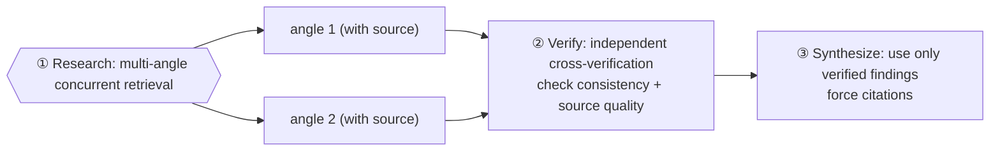

# Chapter 13 · Deep Research

> When a single agent answers "what is X," it's often "I have an impression it's roughly…" — neither tracing sources nor self-checking. The deep research recipe upgrades it into a research squad: **multi-angle concurrent retrieval → independent cross-verification → cited synthesis.** This chapter uses a real run to show how it investigates a technical question down to "primary sources, verified version by version."

---

## 13.1 Recipe Motivation

The three failure modes of "let an agent look something up":

1. **Single perspective**: one agent looks from one angle only, with large blind spots.
2. **No source tracing**: it gives conclusions without sources, impossible to verify.
3. **No self-checking**: it takes the retrieved secondhand paraphrase as truth, without returning to the primary source.

The deep research three-stage pattern treats each of these in turn:



---

## 13.2 Script Structure

> Below is the **script structure** of this research — the research question `Q` and the retrieval angles `angles` are parameterized as placeholders (the concrete question used in this real run, plus the real usage and output, are in 13.3 and `assets/transcripts/deep-research.md`).

```javascript
export const meta = {
  name: 'deep-research',
  description: 'Multi-angle web research with cross-verification then synthesis',
  phases: [{ title: 'Research' }, { title: 'Verify' }, { title: 'Synthesize' }],
}
const Q = '<your research question>'

phase('Research')
const angles = [ '<sub-question A, requiring a source URL>', '<sub-question B, requiring a source URL>' ]
const findings = await parallel(angles.map((a, i) => () =>
  agent(a, { label: `research:${i}`, phase: 'Research',
    schema: { type:'object', properties:{ claim:{type:'string'}, sources:{type:'array',items:{type:'string'}} }, required:['claim','sources'] } })))

phase('Verify')
const valid = findings.filter(Boolean)
const verify = await agent(
  `Cross-verify these findings for internal consistency AND source quality. Flag any claim lacking a credible source. ${JSON.stringify(valid)}`,
  { label: 'cross-verify', phase: 'Verify',
    schema: { type:'object', properties:{ consistent:{type:'boolean'}, notes:{type:'string'} }, required:['consistent','notes'] } })

phase('Synthesize')
const ans = await agent(
  `Synthesize a concrete final answer to "${Q}". Use ONLY these verified findings and cite sources. ${JSON.stringify(valid)}`,
  { label: 'synthesize', phase: 'Synthesize',
    schema: { type:'object', properties:{ answer:{type:'string'}, sources:{type:'array',items:{type:'string'}} }, required:['answer','sources'] } })
return { findings: valid, crossCheck: verify, answer: ans.answer, sources: ans.sources }
```

---

## 13.3 Real Run Results

So that we could **verify whether it researched correctly**, we deliberately chose a verifiable question:

> "How does a zero-build client-side Markdown site defend against XSS? Does marked v12 sanitize by default?"

> **Real run**: Run ID `wf_6090decc-8a5`, Task ID `wva3qtdps`. `agent_count=4`, `total_tokens=148975`, `duration_ms=298530` (about 5 minutes — including real web retrieval, slower than pure reasoning). See `assets/transcripts/deep-research.md` for details.

The retrieval agent performed **real web retrieval** and traced sources to primary materials, concluding:

- marked v12 **does not sanitize** (official README verbatim: "use a sanitize library, like DOMPurify (recommended)").
- The `sanitize`/`sanitizer` options were **deprecated** in v0.7.0 (2019-07-06) and **removed** in v8.0.0 (2023-09-03).
- Consensus: use DOMPurify, and **you must sanitize after parse**: `DOMPurify.sanitize(marked.parse(input))`.

---

## 13.4 The Striking Part: the Cross-Verification Agent Returns to the Primary Source

The most worthwhile part to watch is the **Verify stage.** It didn't restate the retrieval agent's words, but **pulled the `src/defaults.ts` source version by version via the GitHub API to verify**:

> "src/defaults.ts @ v7.0.0 — CONTAINS `sanitize: false`... @ v8.0.0 — NO sanitize/sanitizer keys... => 'present through v7.0.0, absent from v8.0.0 onward' is EXACTLY correct."

And it proactively **dug out a source defect**:

> "DEAD CITATION #1232: GitHub API returns HTTP 410 'This issue was deleted'... should be DROPPED. NOTE: harmless because the real PR is #1504, which IS cited and verified."

<div class="callout tip">

**This is the essential difference between "cross-verification" and "asking again"**: an independent agent asked to "verify **source quality**, flag unsupported claims" will return to primary sources and verify item by item, even finding dead links in the citations. Listing it as a separate stage (rather than stuffing it into the retrieval prompt) is the source of this recipe's credibility.

</div>

**A bonus**: this research's conclusion `DOMPurify.sanitize(marked.parse(input))` is **exactly** the XSS fix this book's `index.html` landed after Chapter 11's frontend-review — an independent deep research, in turn, confirmed the correctness of that fix.

---

## 13.5 Design Points

**① Retrieval angles should be orthogonal.** Split the big question into non-overlapping sub-questions, one agent each, concurrently (`parallel`). Overlapping angles just waste tokens.

**② Verify must be a separate stage, and check "source quality."** The prompt explicitly demands: check consistency **and source credibility**, flag unsupported claims. This is the key to the recipe's credibility — don't merge it into the retrieval.

**③ Synthesize uses only verified findings + forces sources.** Set `sources` as required in the schema, forcing the synthesize agent to give sources.

**④ Web retrieval is slow, so `log`.** This example took about 5 minutes. Use `log` to report "retrieving N angles…" to make the wait visible.

---

## 13.6 Variants

<div class="callout info">

**Variant A · Multi-source voting**: dispatch 3 agents on the same sub-question with different search terms and cross-compare — reducing the randomness of a single retrieval.

**Variant B · Iterative deep dive**: if the Verify stage finds "insufficient evidence on some key point," feed back a supplementary retrieval agent (echoing Chapter 18's "completeness critique": let the critic point out "what's still missing," and the missing part is the next round's retrieval).

**Variant C · Layered synthesis**: synthesize each sub-topic separately first, then do an overall synthesis — suitable for large investigations spanning multiple dimensions.

</div>

---

## 13.7 Chapter Summary

- Deep research = Research (multi-angle concurrent retrieval, with sources) → Verify (independent cross-verification of consistency + source quality) → Synthesize (use only verified findings, force citations).
- Real run: a subagent really retrieved + verified the primary source version by version, concluding marked has no sanitizer, DOMPurify sanitizes after parse, and dug out a dead citation.
- Keys: orthogonal angles, Verify as a separate stage that checks sources, Synthesize forcing sources, log slow tasks.

**The Practical Recipes part (10–16) is now fully complete**, each anchored in a real run. Part IV turns to the advanced patterns that make these recipes more trustworthy.

> Continue reading: [Chapter 17 · Adversarial Verification](#/en/p4-17)
