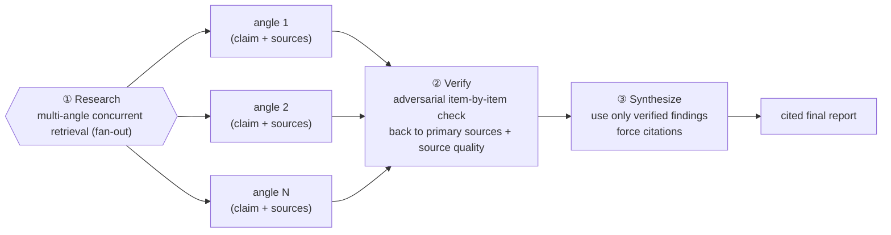
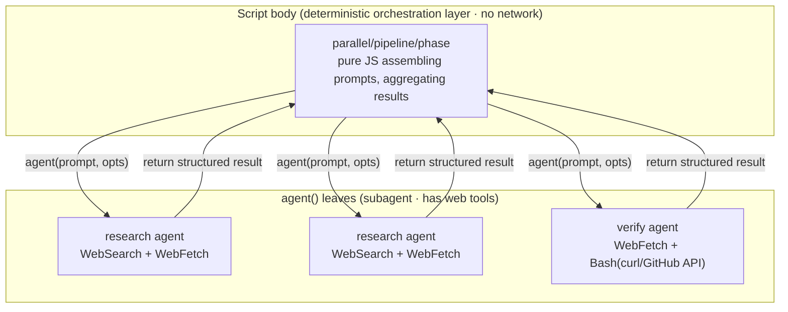
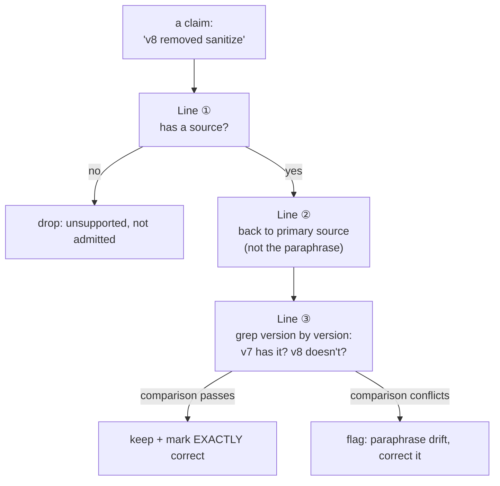

# Chapter 13 · Deep Research

> Ask a single agent "what is X," and you usually get "I have a vague impression it's roughly…" — it neither traces sources nor checks itself. The deep research recipe upgrades it into a research squad: **multi-angle concurrent retrieval (fan-out) → fetch primary sources → adversarially verify each claim item by item → synthesize a cited report.** This chapter uses a real run to show how it digs a technical question down to "primary sources, verified version by version" — and, more importantly, how it stops conclusions that are "plausible but wrong."

---

## 13.1 Recipe Motivation: Why "Just Have an Agent Look It Up" Is Unreliable

Toss a question straight at a single agent to "look up" and you almost inevitably hit these three traps:

1. **Single perspective (blind spot)**: one agent comes in from one angle — narrow coverage, big blind spots. Ask "is marked safe," and it might read only the README, not the changelog, not the issue tracker.
2. **Unsourced**: it hands you a conclusion with no source. You can't verify it; you can only choose to "believe" or "not believe."
3. **No self-check**: the most dangerous one — it takes the retrieved **secondhand paraphrase** as truth, without going back to the primary source. A secondhand blog writes "v8 removed sanitize" as "v7 removed it," and the agent swallows it whole.

Stack these together and you get **"plausible but wrong" claims** — confident phrasing that doesn't survive a check. This is exactly the most dangerous thing about LLM retrieval: it's not "doesn't know," it's "confidently wrong."

Deep research's three-stage orchestration takes these three ailments apart one by one:



<div class="callout info">

**Where it differs from a "search engine" or a "single web lookup"**: a search engine hands you a pile of links and leaves the judging to you; a single web lookup gives you one agent's one-shot impression. The deep research recipe adds two layers — **multi-angle fan-out** (reduces single-perspective blind spots) and **adversarial verification** (reduces "confidently wrong"). What you get is not "search results" but **an auditable report where every conclusion hangs off a primary source.**

</div>

---

## 13.2 A Counterintuitive Key Fact: No Network Inside the Script Body

Before you write the script, you have to nail down a fact that's **easy to misread yet shapes the entire recipe**:

<div class="callout warn">

**The Workflow script body (the JS you write) has no `fetch` and no network capability whatsoever.** Real test (`wf_59bf3654-183`): inside the script sandbox, `require` / `process` / `fetch` are **all `undefined`**. File I/O, shell, network — these "side effects" **can only happen inside `agent()` leaves**: only a subagent holds tools like Read / Write / Bash / WebSearch / WebFetch.

</div>

This means the real shape of deep research is:



Burn this in and you won't write unrunnable code like `await fetch(url)` inside the script. **The orchestration layer decides "who to send out, how to verify, how to aggregate"; the actual "go online" work all sinks into subagents.** The script itself is **zero-network, zero-model-cost** — pure orchestration with no `agent()` call runs at 0 tokens / 4ms (`wf_59bf3654-183`, `wf_2b04881f-6a9`).

<div class="callout info">

**Why is this a good thing?** Precisely because the script body is deterministic (no network, no randomness, no clock), it can **resume**: edit one line of prompt and rerun, and every unchanged `agent()` call hits the cache, coming back in 0 tokens instantly (see Chapter 22). Caging an uncertain side effect like network inside the subagent is a direct expression of Workflow's "deterministic skeleton + uncertain leaves" design.

</div>

---

## 13.3 Script Structure

> Below is the **script structure** for this research — the research question `Q` and the retrieval angles `angles` are pulled out as placeholders (the concrete question plugged into this real run, plus the real usage and output, are in 13.4 and `assets/transcripts/deep-research.md`). Note: there's no `fetch` anywhere in the script; all "go online" is written into the prompts handed to `agent()`, done by subagents using their own web tools.

```javascript
export const meta = {
  name: 'deep-research',
  description: 'Multi-angle web research with cross-verification then synthesis',
  phases: [{ title: 'Research' }, { title: 'Verify' }, { title: 'Synthesize' }],
}
const Q = '<your research question>'

// ① Research: multi-angle concurrent retrieval (fan-out). Each angle is an independent
//    sub-question; the prompt explicitly asks the subagent to "really retrieve + return primary source URLs."
phase('Research')
log('Researching ' + Q + ' across multiple angles…')   // web retrieval is slow; make the wait visible
const angles = [
  '<sub-question A: require a source URL, prefer primary sources (official README / changelog / PR)>',
  '<sub-question B: require a source URL, cover a dimension not overlapping with A>',
]
const findings = await parallel(angles.map((a, i) => () =>
  agent(a, {
    label: `research:${i}`, phase: 'Research',
    schema: { type: 'object', properties: {
      claim: { type: 'string' },
      sources: { type: 'array', items: { type: 'string' } },
    }, required: ['claim', 'sources'] },
  })))

// ② Verify: adversarial check. Independent agent, explicitly asked to "go back to primary sources
//    item by item + check source quality + flag any unsupported claim" — not to restate the research agent.
phase('Verify')
const valid = findings.filter(Boolean)            // an agent skipped by the user returns null
const verify = await agent(
  `Cross-verify these findings for internal consistency AND source quality. ` +
  `Go back to PRIMARY sources to check each claim. Flag any claim lacking a credible source, ` +
  `and flag any dead/unreachable citation. Findings: ${JSON.stringify(valid)}`,
  { label: 'cross-verify', phase: 'Verify',
    schema: { type: 'object', properties: {
      consistent: { type: 'boolean' },
      notes: { type: 'string' },
    }, required: ['consistent', 'notes'] } })

// ③ Synthesize: use only verified findings; schema sets sources as required, forcing citations.
phase('Synthesize')
const ans = await agent(
  `Synthesize a concrete final answer to "${Q}". Use ONLY these verified findings and cite sources ` +
  `inline per claim (no citation dump). Verified findings: ${JSON.stringify(valid)}`,
  { label: 'synthesize', phase: 'Synthesize',
    schema: { type: 'object', properties: {
      answer: { type: 'string' },
      sources: { type: 'array', items: { type: 'string' } },
    }, required: ['answer', 'sources'] } })

return { findings: valid, crossCheck: verify, answer: ans.answer, sources: ans.sources }
```

Match the three stages line by line:

| Stage | API usage | Which ailment it treats |
|---|---|---|
| Research | `parallel([…])` fans out N angles concurrently, barrier waits for all | Treats **single perspective** — multi-angle coverage of blind spots |
| Verify | A single **independent** `agent()`, prompt forces "go back to primary sources" | Treats **no self-check** — independently verifies "confidently wrong" |
| Synthesize | `agent()` + `schema.sources` set to `required` | Treats **unsourced** — the schema only guarantees a `sources` field comes back (field presence); whether each claim maps to its source, and whether the source is trustworthy, still rely on prompt + adversarial verification (the Verify stage) checked item by item |

<div class="callout tip">

**Why does Research use `parallel` instead of `pipeline`?** Here the N angles are **mutually independent**, and they **must all arrive** before they can go to Verify together — exactly the semantics of `parallel` (a barrier: wait for all to complete). If it were "each angle moves to its own next stage the moment it's done," you'd use `pipeline` (no barrier between stages). See Chapter 8 for the difference.

</div>

---

## 13.4 Real Run Results

So we could **verify whether it researched correctly**, we deliberately picked a question with a standard answer that can be checked item by item:

> "How does a zero-build client-side Markdown site defend against XSS? Does marked v12 sanitize by default?"

> **Real run**: Run ID `wf_6090decc-8a5`, Task ID `wva3qtdps`. `agent_count=4` (2 retrieval + 1 cross-verify + 1 synthesize), `tool_uses=31`, `total_tokens=148975`, `duration_ms=298530` (about 5 minutes — including real web retrieval, far slower than pure reasoning). See `assets/transcripts/deep-research.md` for details.

The retrieval agents did **real web retrieval** and traced sources back to primary materials, landing on three core conclusions (all verified against primary sources):

- marked v12 **does not sanitize** (official README verbatim: "Marked does not sanitize the output HTML... use a sanitize library, like DOMPurify (recommended)").
- The `sanitize`/`sanitizer` options were **deprecated** in v0.7.0 (2019-07-06) (PR #1504 "Sanitize hardening," because a bypass was found) and **removed** in v8.0.0 (2023-09-03).
- Consensus best practice: use DOMPurify (cure53, allowlist-safe defaults), and **you must sanitize after parse**: `DOMPurify.sanitize(marked.parse(input))` — sanitizing before parse would get bypassed by the parsing differences between the two libraries.

<div class="callout info">

**Reading the numbers**: 4 agents, ~150k tokens, in line with the rule of thumb "tokens ≈ agent count × per-agent context (~25k–30k)." But `duration_ms=298530` (~5 minutes) runs far higher than a pure-reasoning task with the same agent count (compare Chapter 14's judge panel: 5 agents in just 79 seconds) — **almost all of that 5-minute gap goes to the subagents' real web retrieval and fetching.** This is also why 13.8 "Design Point ④" stresses `log`: retrieval is slow, so make the wait visible.

</div>

---

## 13.5 The Striking Part: the Cross-Verification Agent Returns to the Primary Source

The part most worth watching is the **Verify stage.** It didn't restate the retrieval agent's words — it **pulled `src/defaults.ts` version by version through the GitHub API to verify** — and that's the watershed between "real verification" and "fake restatement":

> "src/defaults.ts @ v7.0.0 — CONTAINS `sanitize: false`... @ v8.0.0 — NO sanitize/sanitizer keys (grep exit 1)... => 'present through v7.0.0, absent from v8.0.0 onward' is EXACTLY correct."

Note what it did: **it didn't take the retrieval agent's "v8 removed it" on faith; it went to GitHub itself, pulled both v7.0.0 and v8.0.0 of `src/defaults.ts`, and grepped them**, confirming v7 has `sanitize: false` and v8 does not — **empirically** verifying the version boundary against the primary source. That's "verified version by version."

Going further, it proactively **dug out a source defect**:

> "DEAD CITATION #1232: GitHub API returns HTTP 410 'This issue was deleted'... should be DROPPED. NOTE: harmless because the real PR is #1504, which IS cited and verified."

It found that issue #1232 cited in the retrieval results had been deleted (HTTP 410) and suggested dropping it; at the same time it confirmed the truly load-bearing citation is PR #1504, which is live and verified. `crossCheck.consistent = true`, but the notes pinpoint these two non-load-bearing dead citations.

<div class="callout tip">

**This is what separates "cross-verification" from "asking again"**: an independent agent told to "go back to primary sources to verify, check source quality, flag unsupported claims" will return to primary sources and verify item by item, even catching dead links in the citations. Listing it as a separate stage (rather than stuffing it into the retrieval prompt) is where this recipe's credibility comes from — the retrieval agent's "confident assertions" must clear this gate before reaching synthesis.

</div>

**A bonus**: this research's conclusion `DOMPurify.sanitize(marked.parse(input))` is **exactly** the XSS fix this book's `index.html` landed after Chapter 11's frontend-review — so an independent deep research, in turn, confirmed that fix got it right.

---

## 13.6 How to Stop "Plausible but Wrong" Claims

This is the **soul** of the deep research recipe, worth unpacking on its own. The number-one risk of LLM retrieval is not "can't find it" but "finds a plausible secondhand paraphrase and confidently restates it." The recipe stops such claims with three lines of defense:

### Line 1 · Force Source Tracing (make the error "discoverable")

The Research stage schema sets `sources` as required. A claim with no source simply can't enter the result set — this plugs "talking from impression" right at the source. **A conclusion without a source isn't even eligible to be verified.**

### Line 2 · Independent Verification + Return to Primary Source (make the error "discovered")

Verify is **a separate, independent agent**, with a prompt that explicitly commands it: **go back to PRIMARY sources to check each claim**, not read the retrieval agent's paraphrase. This part is critical —

<div class="callout warn">

**"Paraphrase drift" from secondhand sources is the main source of error.** A blog mis-writes "v8 removed it" as "v7 removed it"; if the retrieval agent reads only that blog, it carries the error straight into the claim. Only a verifier that **goes back to the GitHub source and greps version by version** can puncture it. In this real run, the Verify agent did exactly that (13.5) — it trusted no paraphrase, only the bytes it pulled from the primary source itself.

</div>

### Line 3 · Version-by-Version / Source-by-Source Cross-Verification (make a single-point error "non-fatal")

For facts that "change with version" (such as "which version removed a certain option"), the verifier must **pull it version by version** and compare (v7 has it, v8 doesn't); for "multiple sources claiming the same fact," it must **cross-compare** whether several independent sources agree. A "looks right" from a single source, a single version, doesn't count — it must survive point-by-point comparison.



The three lines together answer the opening question — **how do you stop "plausible but wrong"? The answer: every claim must hang off a source (Line 1), get checked by an independent agent that returns to the primary source (Line 2), and survive version-by-version / source-by-source comparison (Line 3).** Fail any one, and it's either dropped or flagged.

---

## 13.7 The Commonality with Chapter 15's Bug Hunter: Adversarial Falsification

By now you may have noticed: the Verify stage of deep research and the "adversarial verification" of Chapter 15's Bug Hunter are, at their core, **the same idea** — **adversarial falsification.**

| Dimension | Deep Research (this chapter) | Bug Hunter (Chapter 15) |
|---|---|---|
| First-stage output | claims with sources (may contain mis-paraphrase) | suspected bugs (may contain false positives) |
| Core risk | "confidently wrong" claims | "looks like a bug" false positives |
| Verification means | **independent** agent goes back to primary source, item by item | **independent** "devil's advocate" agent, refute-by-default |
| Burden of proof | shifted onto the "this claim is true" side | shifted onto the "this is a real bug" side (refuted-by-default) |
| Surprise gain | verifier corrected the retrieval's faulty argument (dead citation) | refuter corrected the hunter's faulty argument (`*` doesn't concatenate strings) |

The shared core of both comes down to one sentence: **send in an independent, skeptical agent to go back to the primary evidence and scrutinize, rather than agree.** The only difference is what the "evidence" is — for deep research it's primary sources on the web (README/changelog/source code); for Bug Hunter it's the target file itself.

<div class="callout info">

**Why are "independent" and "adversarial" both indispensable?** A "checker" that only agrees will amplify the first stage's bias verbatim; an adversary explicitly asked to "default to skepticism, go back to primary sources, flag if uncertain" is what punctures "confidently wrong." This is exactly the advanced pattern Chapter 17 "Adversarial Verification" develops systematically — this chapter and Chapter 15 are where it lands concretely, in the "research" and "bug-finding" scenarios.

</div>

---

## 13.8 Design Points

**① Retrieval angles should be orthogonal.** Split the big question into non-overlapping sub-questions, one agent each, concurrently (`parallel`). Overlapping angles just burn tokens and add no coverage.

**② Verify must be a separate stage, and explicitly demand "back to primary sources + check source quality."** The prompt must hard-code it: go back to PRIMARY sources to check each claim, check source credibility, flag unsupported claims, flag dead links. This is the key to the recipe's credibility — **never** fold it into the retrieval prompt; a retrieval agent checking its own work is no check at all.

**③ Synthesize uses only verified findings + forces sources.** Set `sources` as `required` in the schema to force the synthesize agent to give sources; the prompt asks for "inline citation per claim, no citation dump."

**④ Web retrieval is slow, so `log`.** This example took about 5 minutes (`duration_ms=298530`), almost all of it on the subagents' real fetching. Use `log` to report "retrieving N angles…" so the wait is visible, or the user will think it has hung.

**⑤ Don't `fetch` inside the script body.** Reiterating 13.2's iron rule: the script sandbox has no network. All "go online" is written into the prompts handed to `agent()`, done by subagents.

---

## 13.9 Variants

<div class="callout info">

**Variant A · Multi-source voting (cut the randomness of a single retrieval)**: dispatch 3 agents on the same sub-question with different search terms, then cross-compare whether their claims agree — applying Chapter 14's judge-panel "multi-judge vote" idea to retrieval. Three independent sources all pointing to the same conclusion is far more trustworthy than a single retrieval.

**Variant B · Iterative deep dive (echoing completeness critique)**: if the Verify stage finds "insufficient evidence on some key point," feed back a supplementary retrieval agent. This is exactly Chapter 18's "completeness critique" idea — let the verifier name "what's still missing," and the missing part becomes the next round's retrieval target. Pair it with a `budget` guard to keep deep dives from running forever.

**Variant C · Layered synthesis (large investigation)**: synthesize each sub-topic on its own first, then do one overall synthesis — good for large investigations spanning multiple dimensions. This is `pipeline` (each sub-topic flows independently through "retrieve → sub-synthesis") plus a final overall `agent()`.

</div>

Below is the **skeleton of Variant B** (with a budget guard; the script body still has no network — retrieval happens inside the agent prompt):

```javascript
// (illustrative, not actually run) Iterative deep dive: Verify finds a gap → feed back supplementary retrieval
let valid = (await researchAngles(angles)).filter(Boolean)
let round = 0
while (round < 2 && budget.total && budget.remaining() > 60_000) {
  const gap = await agent(
    `Review these findings. If a key point lacks sufficient evidence, name the SINGLE most ` +
    `important missing sub-question (as a search angle). Else return done=true. ${JSON.stringify(valid)}`,
    { label: `gap-check:${round}`, phase: 'Verify',
      schema: { type: 'object', properties: {
        done: { type: 'boolean' }, missingAngle: { type: 'string' },
      }, required: ['done'] } })
  if (gap.done || !gap.missingAngle) break
  log('Gap found, researching: ' + gap.missingAngle)
  const more = await researchAngles([gap.missingAngle])   // feed back one retrieval agent
  valid = valid.concat(more.filter(Boolean))
  round++
}
```

---

## 13.10 Chapter Summary

- Deep research = Research (multi-angle concurrent fan-out retrieval, with sources) → Verify (an independent agent goes back to primary sources, adversarially checking item by item and checking source quality) → Synthesize (use only verified findings, force citations).
- **There is no `fetch`/network inside the script body** (`require`/`process`/`fetch` are all `undefined`, `wf_59bf3654-183`); all "go online" sinks into the `agent()` leaves (only subagents have web tools). The orchestration layer only dispatches and aggregates, costing 0 tokens itself.
- Real run (`wf_6090decc-8a5`, 4 agents / 148,975 tokens / 298,530ms): subagents really retrieved + **pulled GitHub source version by version** to verify, concluding marked has no sanitizer and DOMPurify sanitizes after parse, and dug out the dead citation #1232.
- Three lines of defense against "plausible but wrong": force source tracing (unsupported claims not admitted), independent verification back to primary sources (puncture paraphrase drift), version-by-version / source-by-source cross-verification (single-point errors non-fatal).
- Shares its core with Chapter 15's Bug Hunter: **adversarial falsification** — send in an independent, skeptical agent to go back to the primary evidence and scrutinize, rather than agree.

Every step of this chapter is anchored in a real run. Deep research shares its "adversarial falsification" core with Chapter 15's Bug Hunter — a thread Part IV will abstract into a general pattern. Three recipes remain; the next chapter turns to another structure for how multiple independent judgments converge into a conclusion: the judge panel.

> Continue reading: [Chapter 14 · Judge Panel](#/en/p3-14)
