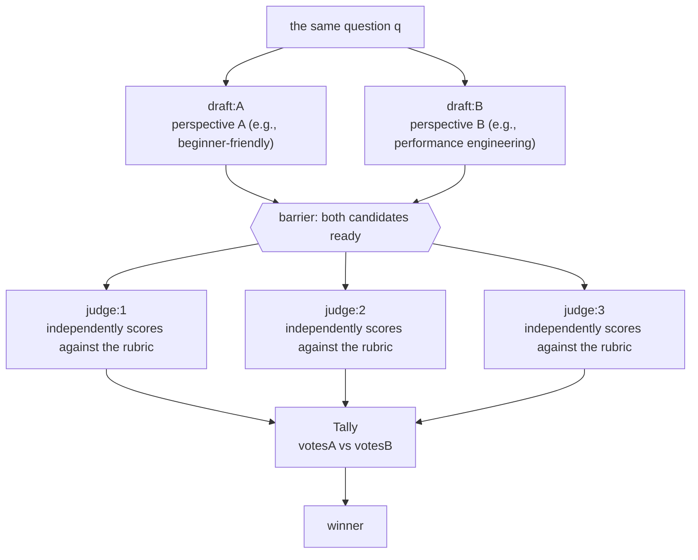

# Chapter 14 · Judge Panel: A/B Evaluation

> You've got two (or N) candidate answers — how do you objectively pick the better one? The worst move is to hand it to **one** agent and ask it to "see which is better" — a single judge brings both its own preferences and its own blind spots. This chapter ports the real-world **judge panel** into Workflow: **N candidates → multiple mutually independent judges score against the same rubric → tally and aggregate to decide the winner.** The whole recipe runs through one real run: two candidate answers, 3 independent judges, a **3:0** verdict for the winner — and those judges also pulled off something unexpected yet extremely valuable.

---

## 14.1 Recipe Motivation

"LLM-as-judge" itself is nothing new; the hard part is **how to judge** reliably. A single judge has three hard flaws:

- **Preference bias.** A single agent has its own taste for "verbose but comprehensive" versus "concise but shallow," and that preference bleeds into its one verdict — so you can't tell "B really is better" apart from "this judge just happens to like B's style."
- **Instability.** Put the same judge on the same pair of candidates and a slight change of wording might flip it — you have no way to know how stable the result is.
- **Not tally-able.** One judge gives only one conclusion; you can't get **confidence** information like "what proportion thinks B is better."

The judge panel tackles all three head-on with **multiple non-communicating independent judges**:



Three key designs — and the rest of the chapter just unpacks them:

1. **Judges must be independent**: use `parallel` to let each judge score **on its own**, blind to the others' conclusions (otherwise they follow the crowd and collapse back into a single judge).
2. **Scoring needs a rubric**: use `schema` to **pin the scoring dimensions (accuracy / clarity / completeness) down to numbers**, forcing judges to think structurally instead of tossing out a single "I think B is better."
3. **Aggregate by tally, not by a single agent's call**: the final verdict is **counted out from the votes**, not handed to another agent to "synthesize everyone's opinions" — that would squeeze the multi-judge independence back down to a single point.

---

## 14.2 The Full Script

**(An illustrative script fleshed out from the transcript skeleton — not run verbatim; the actual run's Run ID and usage are in 14.3.)** Below is the script of this real run — its structure matches `assets/transcripts/judge-panel.md`. The transcript elides the two schemas `answer` and `SCORE` with `{...}`; here they're **filled out into a runnable form** and tagged inline as "(illustrative completion)," while the parts that genuinely exist in the transcript (`meta`, `q`, the `parallel` drafting, the 3-judge `parallel` scoring, the Tally count and `return`) are left exactly as-is.

```javascript
export const meta = {
  name: 'judge-panel',
  description: 'A/B evaluation: two candidates scored by 3 independent judges, then tallied',
  phases: [{ title: 'Draft' }, { title: 'Judge' }, { title: 'Tally' }],
}

const q = 'When should you use parallel() vs pipeline() in a Claude Code Workflow?'

// The candidate answer schema (illustrative completion: elided with {...answer} in the transcript)
const ANSWER = {
  type: 'object',
  properties: { answer: { type: 'string' } },
  required: ['answer'],
}

phase('Draft')
// Two candidates produced concurrently, deliberately from different perspectives, to create a real quality difference
const [a, b] = await parallel([
  () => agent(`${q} Write a thorough answer from a beginner-friendly angle.`,
    { label: 'draft:A', phase: 'Draft', schema: ANSWER }),
  () => agent(`${q} Write a thorough answer from a performance-engineering angle.`,
    { label: 'draft:B', phase: 'Draft', schema: ANSWER }),
])

phase('Judge')
// The rubric fixed into a schema: three scoring dimensions + winner enum + reason (illustrative completion of SCORE)
const SCORE = {
  type: 'object',
  properties: {
    scoreA: {
      type: 'object',
      properties: {
        accuracy: { type: 'number' },
        clarity: { type: 'number' },
        completeness: { type: 'number' },
      },
      required: ['accuracy', 'clarity', 'completeness'],
    },
    scoreB: {
      type: 'object',
      properties: {
        accuracy: { type: 'number' },
        clarity: { type: 'number' },
        completeness: { type: 'number' },
      },
      required: ['accuracy', 'clarity', 'completeness'],
    },
    winner: { type: 'string', enum: ['A', 'B'] },
    reason: { type: 'string' },
  },
  required: ['scoreA', 'scoreB', 'winner', 'reason'],
}

// 3 judges each score independently: parallel barrier, none can see another's verdict
const judges = await parallel(
  [1, 2, 3].map((i) => () =>
    agent(
      `Independently score answers A and B on accuracy, clarity, completeness (0-10 each), ` +
        `then pick the better overall.\nA: ${a.answer}\nB: ${b.answer}`,
      { label: `judge:${i}`, phase: 'Judge', schema: SCORE }
    )
  )
)

phase('Tally')
// Tally aggregation: count votes, don't let an agent "synthesize everyone's opinions"
const valid = judges.filter(Boolean)
const votesA = valid.filter((j) => j.winner === 'A').length
const votesB = valid.filter((j) => j.winner === 'B').length
return {
  votesA,
  votesB,
  winner: votesA > votesB ? 'A' : 'B',
  judgeReasons: valid.map((j) => j.reason),
}
```

Note that this structure and Chapter 11's Multi-dimension PR Review **look alike but differ in spirit**: both use the `parallel` barrier to run concurrently, but —

- Chapter 11: each agent looks at a **different** dimension (division of labor), then **synthesizes** their outputs.
- This chapter: each judge looks at the **same pair** of candidates (repeated judgment), then **tallies** their votes.

**"Synthesize after division of labor" leans on an agent; "tally after repetition" leans on code.** That's the soul of the judge panel — it demotes aggregation from "call another agent to make the call" down to a piece of **deterministic vote-counting code**, which is how each judge's independence stays intact.

---

## 14.3 Real Run Results

> **Real run**: Run ID `wf_f5b69668-b18`, Task ID `w7rykwriv`. See `assets/transcripts/judge-panel.md` for the raw record.
> Real usage: `agent_count=5` (2 drafts + 3 judges) ｜ `tool_uses=26` ｜ `total_tokens=201852` ｜ `duration_ms=79462`.

### Tally Result: 3:0 for B

The value the script really returned:

```json
{
  "votesA": 0,
  "votesB": 3,
  "winner": "B",
  "judgeReasons": [ "...three detailed reasons..." ]
}
```

**The 3 judges unanimously (3:0) ruled B the winner.** The reasons converged cleanly: B (performance-engineering perspective) was overwhelmingly ahead on **completeness** — it brought **real measurement data** and nailed the core anti-pattern of "back-to-back parallel barrier waste" (the very topic of Chapter 08); A (beginner perspective) edged ahead on **clarity**, but didn't have the depth to settle it. Across the three dimensions, the gap on completeness outweighed clarity's small advantage.

<div class="callout tip">

**Note how `agent_count=5` lines up with the script structure.** 2 drafts + 3 judges = 5 agents, matching the real usage exactly (which confirms Chapter 08's rule of thumb "tokens ≈ agent count × per-agent context": `201852 / 5 ≈ 40K/agent`). `tool_uses=26` runs high; the next section reveals why — the judges did something extra.

</div>

### Two Unexpected Yet Extremely Valuable Observations

The most interesting part of this run isn't that "B won," but **how** the judges got there:

<div class="callout info">

**Observation 1 · Judges proactively verify.** All 3 judges spelled it out in their reasons: they **actually read `docs/en/p2-08-parallel-vs-pipeline.md` and `assets/_grounding.md` to cross-check**, checking the numbers in the candidate answers one by one — `8.4s / 78844 token`, `26.7s / 158982 token`, the `3×5.5≈16.5s` baseline, the `min(16, cores−2)` concurrency cap, the `1000` agent fallback. All three judges' independent conclusions were "zero factual errors, every number matches precisely."

This is why `tool_uses=26` runs so high: the judges didn't "score from impression," they **actually went and read the source of facts.** **A side effect**: this amounts to **verifying in passing that all of this book's Chapter p2-08 real data is accurate** — a single judge-panel run came with a free fact-check.

**Observation 2 · Independent judges converge.** Three **non-communicating** judges each landed independently on exactly the same conclusion (3:0). This is the judge panel's core value cashed in: when candidates "clearly differ in quality," multiple independent perspectives **converge steadily**; if their quality is close, you'd see 2:1 or even split scores instead — which is itself a signal that "these two are about the same."

</div>

Put together, these two observations make one point: **a structured rubric (schema) pushes judges into serious verification rather than pleasantries.** Once the schema asks it for a concrete number on `accuracy`, a conscientious judge naturally goes and checks the facts — that's the "side-effect dividend" of schema constraints.

---

## 14.4 Design Points

**① Judge independence is a non-negotiable red line.** Use `parallel` to let judges score **concurrently, blind to** each other's verdicts. The moment you write "judge 2 scores after seeing judge 1's score," the panel collapses into "one judge + a few echoers," and the whole value of multi-perspective bias reduction drops to zero.

<div class="callout warn">

**Counter-example**: don't feed conclusions serially like this —

```javascript
// ✗ Wrong: judges 2/3 can see the prior verdicts → follow the crowd, independence lost
let prev = null
for (const i of [1, 2, 3]) {
  prev = await agent(`Previous judge said: ${JSON.stringify(prev)}. Now you score...`, { schema: SCORE })
}
```

The right way is the `parallel([1,2,3].map(...))` in the script — three judges run at the same time, none of them sees another.

</div>

**② The rubric must be fixed into numbers with a schema.** Having judges give a `number` each for `accuracy / clarity / completeness` beats having them write a paragraph of "overall feel" by a wide margin: numbers are comparable, explainable (you can see "B won on completeness"), and weightable (Variant B). The schema gets validated at the tool-call layer (Chapter 07), and a non-conforming judge is sent back to re-score — which turns "scoring" from a soft suggestion into a hard structure.

**③ Aggregate by tally, never with a "synthesize agent."** The final `Tally` stage is **pure JavaScript** — `filter` plus counting votes. **Don't** drop an agent in here to "synthesize the three judges' opinions into a final conclusion": that crushes the three independent signals back into a single-point judgment, throwing away the independence you carefully preserved earlier. **Tallying is deterministic, reproducible, zero extra tokens** — exactly the part the Workflow "deterministic skeleton" is meant to carry (echoing Chapter 02).

**④ Candidates should create a real difference.** This example deliberately sends A in on the "beginner perspective" and B on the "performance-engineering perspective," which is what produces a quality gap you can actually tell apart. If the two candidates are nearly identical, the judges can only force a pick out of the noise, and the result tells you nothing. Candidates can come from **different prompts, different models, different temperatures, or multiple samples of the same prompt.**

**⑤ Use an odd number of judges.** 3, 5, 7… an odd count keeps you out of ties. Here 3 is enough to converge steadily when "quality clearly differs"; if the candidates are evenly matched or the stakes are high, bumping to 5 further damps single-judge noise (it costs you linearly growing tokens, but the wall clock is still bounded by the barrier and doesn't grow linearly with the number of judges).

---

## 14.5 Variants

<div class="callout info">

**Variant A · N-candidate tournament**: when there are more than two candidates, expand the schema's `winner` from `enum:['A','B']` to `enum:['A','B','C',...]` and let the judge pick the best directly; or have each judge **rank** all candidates (returning a ranking array), and let the Tally stage decide the winner with a rank-aggregation method like Borda count.

**Variant B · Weighted rubric**: give the dimensions weights (e.g., `accuracy×3 + completeness×2 + clarity×1`), and in the Tally stage take a weighted sum of each judge's `scoreA/scoreB` before comparing — that upgrades "voting" into "weighted scoring," which fits cases where the dimensions don't matter equally.

**Variant C · Judge + veto**: add a `disqualify: boolean` field to the schema (e.g., "contains a factual error," "out of scope"). At Tally, any judge's veto knocks that candidate out on the spot — which splits "scoring" apart from a "red-line check," echoing Chapter 17's adversarial verification.

**Variant D · After GCF / generation (best-of-N)**: this is exactly where Chapter 12 GCF's "Variant C" lands — in the Generate stage use `parallel` to produce N candidates, **use this chapter's judge panel to pick the best**, then run Critique→Fix on the winner. The judge panel is the **convergence gate** for any "diverge first, then converge" pipeline.

**Variant E · Graft-style synthesis (don't throw away the runners-up's good ideas)**: a stronger convergence does more than "pick the winner" — it **builds on the winning candidate as the trunk and grafts in the good ideas unique to the losing candidates.** Losing ≠ all lost — a candidate that came second overall might still be better on some specific dimension (e.g., an edge case the winner missed, a more precise phrasing). The approach: after tallying to pick the winner, **add one synthesis agent**, feed it "the winner's full text + the runners-up, plus the strengths the judges noted in each," and have it produce a final draft that "uses the winner as the skeleton and selectively absorbs the runners-up's strengths."

```javascript
// (illustrative, not run) — after tallying to pick the winner, graft-style synthesis
const winnerDraft = votesA > votesB ? a.answer : b.answer
const final = await agent(
  // Synthesize from the winner as the trunk, grafting in good ideas unique to the losing candidate — don't waste the insight in the runners-up
  `Rewrite a final answer using the following as the trunk:\n${winnerDraft}\n\n` +
    `From the losing candidate below, absorb only its unique strengths the winner lacks (e.g., a missed edge case, a more precise phrasing):\n${votesA > votesB ? b.answer : a.answer}`,
  { label: 'synthesize', phase: 'Tally', schema: ANSWER }
)
```

Note that this synthesis agent comes **after the tally**, it doesn't replace it — the verdict is still decided by §14.4's "③ Aggregate by tally" deterministic code, and synthesis happens only once "the trunk is fixed," so it doesn't break judge independence. It's fundamentally different from "letting one agent synthesize everyone's opinions to decide the winner" (that red line): **the former uses an agent to assemble text; the latter uses an agent to make the verdict call.**

</div>

---

## 14.6 Chapter Summary

- Judge panel = **N candidates → multiple independent judges score against the same rubric → tally and aggregate**, leaning on multiple perspectives to damp a single judge's preference bias and instability.
- Three red lines: judges **independent** (`parallel`, each scoring, blind to others), the rubric **fixed into numbers with a schema**, and aggregation **by vote-counting code** rather than a "synthesize agent" making the call.
- Looks alike but differs in spirit from Chapter 11: PR review is "synthesize after division of labor (use an agent)," the judge panel is "tally after repetition (use code)."
- Real run: `agent_count=5`, `total_tokens=201852`, `duration_ms=79462`; 2 candidates, 3 judges, **3:0 for B**.
- Two empirical observations: judges **proactively read `docs/en/p2-08` and `_grounding.md` to cross-check** (where `tool_uses=26` comes from, verifying in passing that this book's p2-08 data is all correct); three non-communicating judges **landed independently on the same conclusion**.
- Variants: N-candidate tournament, weighted rubric, veto, best-of-N after generation/GCF, **graft-style synthesis** (use the winner as the trunk and absorb the runners-up's unique good ideas, without wasting the insight in losing drafts).

The next chapter steps into the "Bug Hunter" recipe: a self-respawning finder pool flowing into adversarial verification, digging out a branch's latent defects with high precision.

> Continue reading: [Chapter 15 · Bug Hunter](#/en/p3-15)

---

[← Back to main README](../../README.md) · [中文 README →](../../README.md)
