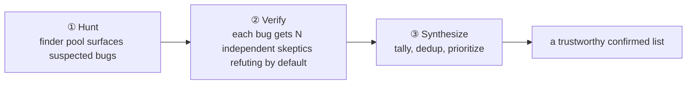
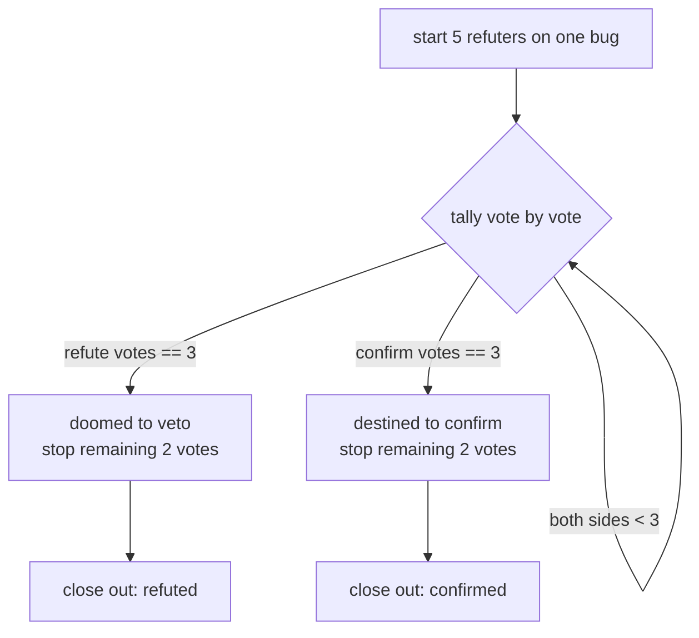
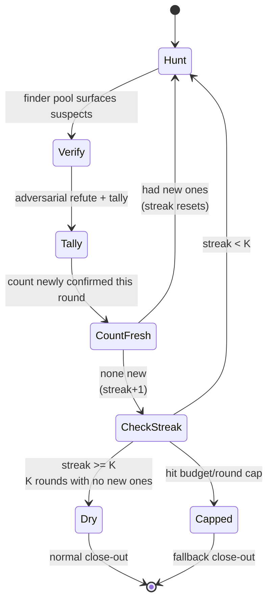

# Chapter 15 · Bug Hunter

> Getting an agent to "find bugs" isn't hard; what's hard is **trusting** the bugs it finds. LLMs are very good at making up "looks-like-a-bug" false positives. This chapter's Bug Hunter recipe solves this trust problem with **adversarial verification**: hunt first, then let an independent "devil's advocate" agent **refute by default** — only what survives refutation counts.
>
> This chapter is based on a real run (Run `wf_53da9a06-915`, 11 agents / 311,134 tokens / 61,660ms, 5/5 confirmed); it also demonstrates the most striking facet of adversarial verification: **the verifier corrected the hunter in turn.** On top of that, we dissect the orchestration skeleton of Claude Code's built-in named workflows `bughunt` / `bughunt-lite` — **finder pool → adversarial refutation → synthesis** — and how they use **pigeonhole early-exit** and a **K-consecutive-round dry-streak** to be both cheap and miss-proof.

---

## 15.1 Recipe Motivation: a "Unknown-Scale + Untrustworthy" Double Problem

"Finding bugs" is a typical **unknown-scale discovery task** — you don't know how many bugs there are, so you can't write it as a fixed-quota loop like "find these 5." It also stacks the two nastiest traps of discovery tasks on top of each other:

1. **False positives**: the model has a strong tendency to "report something." You say "find bugs," and even if it finds none, it makes up plausible-looking "bugs" to hand in — because "turning in a blank" feels like not finishing the task.
2. **Wrong argumentation**: even if the bug is real, the "why it's wrong" the model gives might be wrong. It may catch the symptom but offer an untenable mechanism.

These two traps together mean that **a single hunter agent's output tells you neither whether it found them all nor whether it got them right.** This chapter's recipe presses down both uncertainties with a three-stage orchestration:



- **① Hunt** — cures "find them all": use one finder agent, or a finder **pool**, to list suspected bugs. When the scale is unknown, let the pool self-respawn and loop until dry (15.5, 15.7).
- **② Verify** — cures "get them right": for **each** suspected bug, dispatch N **independent** verifiers explicitly asked to "refute by default." The burden of proof is pushed onto the "this is a real bug" side. This is a direct application of Chapter 17's adversarial verification.
- **③ Synthesize** — closes out: use **code** to tally, dedup, and prioritize, producing the final confirmed list.

<div class="callout info">

**Why "refute" rather than "confirm"?** Because confirmation bias is one-directional: an agent asked "is this a bug?" tends to nod. But an agent ordered to "try your best to **refute** it; judge refuted if uncertain" must actively go look for counterexamples. Setting the default to refuted flips the burden of proof from "prove it's not a bug" (tiring for the defense) to "prove it is a bug" (tiring for the offense) — **silence and hesitation both fall to "doesn't count,"** and false positives get filtered out naturally. This principle runs through Chapter 17; this chapter is its landing on "hunting bugs."

</div>

---

## 15.2 The Full Script

Below is the script used in this chapter's real run — the minimal trustworthy shape of one finder (Hunt) + two refuters per bug (Verify):

```javascript
export const meta = {
  name: 'bug-hunter',
  description: 'Hunt bugs in a target file, then adversarially verify each finding',
  phases: [{ title: 'Hunt' }, { title: 'Verify' }],
}
const FILE = '.../assets/samples/buggy-cart.js'

phase('Hunt')
const hunt = await agent(
  `Read the file ${FILE} and find genuine bugs. For each: function name, one-line bug, why it's wrong.`,
  { label: 'hunt', schema: { type: 'object', properties: {
    bugs: { type: 'array', items: { type: 'object',
      properties: { fn: { type: 'string' }, bug: { type: 'string' }, why: { type: 'string' } },
      required: ['fn','bug','why'] } } }, required: ['bugs'] } }
)

const verified = await pipeline(
  hunt.bugs,
  (b) => parallel([1,2].map(i => () =>
    agent(`You are a skeptic. Try to REFUTE this claimed bug in ${FILE}. Default to refuted=true if not certain. ` +
          `Claim — in \`${b.fn}\`: ${b.bug} (${b.why}). Read the file to check.`,
      { label: `refute:${b.fn}:${i}`, phase: 'Verify',
        schema: { type: 'object', properties: { refuted: { type: 'boolean' }, reason: { type: 'string' } }, required: ['refuted','reason'] } })
  )).then(votes => {
    const v = votes.filter(Boolean)
    const confirms = v.filter(x => !x.refuted).length
    return { ...b, confirmVotes: confirms, refuteVotes: v.length - confirms, confirmed: confirms >= 1 }
  })
)
const confirmed = verified.filter(Boolean).filter(b => b.confirmed)
return { hunted: hunt.bugs.length, confirmedCount: confirmed.length, confirmed }
```

Note the structure: **Hunt is a single agent** (produces the suspected list), and **Verify uses `pipeline`** — each bug flows independently through the stage of "2 refuters concurrent + tally." This is the typical combination of `parallel` nested inside `pipeline` (Chapter 08): pipeline stages have no barrier, so while bug A is still being refuted, bug B may already be in synthesis; while inside each bug, the two refuters use the `parallel` barrier to wait together so they can be tallied.

<div class="callout tip">

**This minimal shape is enough to build intuition, but it deliberately omits three "production-grade" things**, which the rest of this chapter adds one by one: ① Hunt has only one finder (it will miss bugs once the scale grows) → the finder pool in 15.5; ② each bug runs all refuters before tallying (no early stop even when a majority has already vetoed) → pigeonhole in 15.6; ③ a single round of Hunt (missed tail bugs can never be recovered) → loop-until-dry in 15.7. Master the minimal shape first, then add these three layers.

</div>

---

## 15.3 Real Run Results

> **Real run**: Run ID `wf_53da9a06-915`, Task ID `wsj4ypt3x`. See `assets/transcripts/bug-hunter.md` for the raw record.
> Real usage: `agent_count=11` (1 hunter + 5×2 refuters) ｜ `tool_uses=25` ｜ `total_tokens=311134` ｜ `duration_ms=61660`.

The target file is `assets/samples/buggy-cart.js` (a synthetic sample with 5 deliberately planted bugs). The hunter **found all of them, all passing verification 2:0**:

| Function | bug | Votes |
|---|---|---|
| `applyDiscount` | percent has no bounds check (>100 gives a negative price; a negative percent inflates the price) | 2:0 |
| `cartTotal` | off-by-one: `i < items.length-1` skips the last item | 2:0 |
| `checkout` | missing `await`, `gateway.charge()` returns a Promise that is always truthy, the cart is cleared before payment | 2:0 |
| `findItem` | `==` instead of `===`, type coercion mismatch | 2:0 |
| `mergeCarts` | mutates the argument in place via `a.push()` (aliasing bug) | 2:0 |

How the 11-agent count adds up: `1 finder + 5 bugs × 2 refuters = 11`. ~310K tokens, ~62 seconds wall clock — note the wall clock is far less than "11 × a single agent," because the refutation of the 5 bugs **overlaps** in the pipeline; wall clock depends on the critical path, not the sum (Chapter 08).

<div class="callout info">

**Why use a synthetic sample as the "hunting target"?** Because to verify "how accurate the hunter actually is," you need **known ground truth** — every bug in `buggy-cart.js` carries a seed comment, so "found 5/5" is a checkable hard metric, not a vague feeling of "looks like it found quite a few." Real projects have no such annotations, which is exactly why ② Verify exists: to **approximate** ground truth via adversarial refutation.

</div>

---

## 15.4 The Striking Part: the Verifier Corrected the Hunter

The refuter for `applyDiscount`, while **confirming the bug is real**, corrected a piece of wrong argumentation from the hunter (and the seed comment). The seed comment and the hunter both claimed "percent as a string would concatenate," and the refuter pointed out:

> "the source comment's 'percent as string concatenates' claim is false — `*` and `/` coerce strings to numbers, so `applyDiscount(100,'10')` correctly returns 90; concatenation would require `+`."

It's right: `*`/`/` coerce strings into numbers; only `+` concatenates. So `applyDiscount(100,'10')` actually returns `90` (correct), and the bug's true mechanism is "no bounds check" (`percent>100` gives a negative price), not "string concatenation."

<div class="callout tip">

**This is the irreplaceable value of adversarial verification**: it doesn't just filter false positives, it can also **correct wrong reasoning within true positives.** A "checker" that only echoes would never discover this; only a verifier asked to "refute by default, judge refuted if uncertain" will get pedantic — not letting even a flaw buried in the premise slip by. In other words, the refuter hands back not just a "true/false" ballot but **an auditable line of reasoning**, and that reasoning itself can correct upstream. This is also why `reason` is a required field in the refutation schema in 15.2.

</div>

---

## 15.5 The Finder Pool: Fixed vs Self-Respawning

The minimal shape in 15.2 has only **one** finder. When the target grows from a 40-line synthetic file to dozens of files across an entire branch, a single finder can't keep up — its attention is diluted and it will inevitably miss things. That's when you need a **finder pool**: multiple hunters scanning concurrently, **streaming** their findings into the same refutation pipeline.

Claude Code ships two named workflows, `bughunt` and `bughunt-lite` (registered in this environment — see `_grounding.md` A2, whose named-workflow list includes `bughunt, bughunt-lite, deep-research, plan-hunter, review-branch`). Their orchestration skeletons, described below, map precisely onto the two pool shapes "fixed" and "self-respawning":

| Workflow | Finder pool | Verification | Close-out |
|---|---|---|---|
| `bughunt-lite` | **Fixed**: 3 rapid + 2 deep, stop when done | 5-vote adversarial refutation (pigeonhole early-exit) | synthesis |
| `bughunt` | **Self-respawning**: 3 rapid + deep hunters keep getting dispatched until **dry-streak** | 5-vote adversarial refutation (pigeonhole early-exit) | synthesis |

> Source: `bughunt`'s registered description verbatim — "Self-respawning finder pool (3 rapid + deep-until-dry-streak) streams into 5-vote adversarial verification with pigeonhole early-exit, then synthesis"; `bughunt-lite` — "fixed 3-rapid+2-deep finders stream into 5-vote adversarial verification (pigeonhole early-exit), then synthesis. Simpler than bughunt: no self-respawning, no dry-streak." These are **the official architecture descriptions of two registered named workflows** (not third-party claims).

The two pools differ on exactly one axis: **whether the finder count is fixed.**

- **Fixed pool**: dispatch `N` hunters and collect `N` sets of findings — orchestration is predictable and cost has an upper bound. Good for "target scale roughly known" or "want a deterministic budget." `bughunt-lite`'s "3 rapid + 2 deep" is a fixed 5 finders.
- **Self-respawning pool**: the finder pool keeps **topping up with new hunters** until a stopping condition is met (dry-streak, see 15.7). Good for "target scale completely unknown, would rather overspend than miss." The cost is that the upper bound is uncertain — so it must have a dry-streak + budget double brake (Chapter 18).

The "rapid + deep" that appears in both pools is another orthogonal design:

- **rapid finder**: fast, shallow, wide net — responsible for scooping up the "obvious at a glance" suspects first (can use `model:'haiku'` to cut cost).
- **deep finder**: slow, deep, detail-oriented — responsible for digging out the subtle bugs the rapid pass missed, the ones that require cross-function reasoning.

The phrase "the pool streams into the pipeline" (finders **stream into** verification) is key: finders don't all have to finish before refutation begins — this is exactly where the **no-barrier** nature of `pipeline` stages comes into play (Chapter 08). The moment a finder hands back a finding, the refutation pipeline can start processing it while the other finders are still running.

Below is a skeleton of a **fixed pool + stream-dedup + flow-into-refutation** (echoing `bughunt-lite`):

```javascript
// (illustrative, not executed) — fixed finder pool: rapid wide net + deep dig, dedup the stream, then flow into refutation
const BUG = { type: 'object', properties: {
  bugs: { type: 'array', items: { type: 'object',
    properties: { fn: { type: 'string' }, bug: { type: 'string' }, why: { type: 'string' } },
    required: ['fn','bug','why'] } } }, required: ['bugs'] }

phase('Hunt')
// 3 rapid (shallow, haiku to cut cost) + 2 deep (deep, default model), concurrent wide net
const finders = await parallel([
  ...[0,1,2].map(i => () => agent(
    `RAPID pass #${i}: skim ${FILE} and surface obvious-looking bugs fast. ` +
    `Cover a different region than other passes (use index ${i} to vary focus).`,
    { label: `find:rapid:${i}`, phase: 'Hunt', model: 'haiku', schema: BUG })),
  ...[0,1].map(i => () => agent(
    `DEEP pass #${i}: read ${FILE} carefully, reason across functions, find subtle bugs ` +
    `(aliasing, async, coercion) that a quick skim would miss.`,
    { label: `find:deep:${i}`, phase: 'Hunt', schema: BUG })),
])

// Stream: flatten findings from every finder in the pool, dedup by normalized (fn+bug) key (deterministic, code's job)
const pooled = finders.filter(Boolean).flatMap(f => f.bugs || [])
const seen = new Set()
const candidates = pooled.filter(b => {
  const key = (b.fn + '|' + b.bug).toLowerCase().replace(/\s+/g, ' ').trim()
  return seen.has(key) ? false : (seen.add(key), true)
})
log(`finder pool merged ${pooled.length} findings, ${candidates.length} after dedup go to refutation`)
// candidates then flow into the refutation pipeline of 15.6
```

<div class="callout warn">

**A finder pool must always go through "stream-dedup" before refutation, and dedup must use code, not an agent.** Multiple finders (especially rapid vs deep) are bound to report duplicate bugs; without deduping first, the same bug gets refuted by N sets of refuters, wasting tokens several times over. Dedup is a **deterministic operation** (same input, same output), done at zero cost with a `Set` + a normalized key — consistent with Chapter 18's "hand deterministic operations to code, leave judgment to agents." Asking an agent to "dedup for me" is both expensive and introduces non-determinism.

</div>

---

## 15.6 Pigeonhole Early-Exit: Once a Majority Has Vetoed, Stop Voting

The refutation in 15.2 is "run all N refuters for each bug, then tally." When N is large (`bughunt` uses **5 votes**), there's an obvious waste: **if a bug has already been vetoed by a majority of refuters, the remaining votes can't change the outcome** — the conclusion is decided.

This is **pigeonhole early-exit**: treat "majority" as a threshold that can be reached early, and the moment one side's vote count locks in the win, **stop the remaining refuters immediately** and don't burn tokens on a verdict that's already settled.

Taking 5 votes with "keep only if a majority confirms" (≥3 confirm) as an example, the pigeonhole principle gives two early-exit points:

- **Early veto**: once **3 refute votes** accumulate, no matter how the remaining 2 vote, confirm can't reach ≥3 → this bug is doomed to be vetoed → stop the remaining refuters.
- **Early confirm**: once **3 confirm votes** accumulate, the majority is reached → this bug is destined to be kept → stop the remaining refuters.



How much does early exit save? Under "5-vote majority," the soonest it can settle is at the 3rd vote, saving 2 refuters — **nearly 40% of verification cost** — and the more "one-sided" the bug (a real bug all-confirm, a false positive all-refute), the more it saves.

In implementation, `parallel` is a **barrier** (it waits for all thunks) and inherently doesn't support "stop midway." To implement pigeonhole early-exit, you need a "settle-early race" structure — below is an **illustrative** skeleton (a `Promise` race + a tally closure; note this goes beyond `parallel`'s standard usage and is shown only to demonstrate the idea):

```javascript
// (illustrative, not executed) — the idea skeleton of pigeonhole early-exit
// Note: parallel is a barrier and doesn't support stopping midway; this uses a Promise race to demonstrate the "settle once a majority locks in" logic.
async function verifyWithPigeonhole(bug, voters = 5) {
  const majority = Math.floor(voters / 2) + 1   // 5 votes → 3
  let confirms = 0, refutes = 0, settled = false
  let resolve
  const decided = new Promise(r => { resolve = r })

  for (let i = 0; i < voters; i++) {
    agent(
      `You are skeptic #${i}. Try to REFUTE this claimed bug in \`${bug.fn}\`: ${bug.bug}. ` +
      `Default refuted=true if not certain. Read the file to check.`,
      { label: `refute:${bug.fn}:${i}`, phase: 'Verify',
        schema: { type: 'object', properties: { refuted: { type: 'boolean' }, reason: { type: 'string' } }, required: ['refuted','reason'] } }
    ).then(v => {
      if (settled || !v) return
      v.refuted ? refutes++ : confirms++
      // Pigeonhole: either side hits the majority, the outcome is decided, settle immediately
      if (confirms >= majority) { settled = true; resolve({ ...bug, confirmed: true,  confirmVotes: confirms, refuteVotes: refutes }) }
      else if (refutes >= majority) { settled = true; resolve({ ...bug, confirmed: false, confirmVotes: confirms, refuteVotes: refutes }) }
    })
  }
  return decided   // returns the moment a majority locks in; the remaining votes' results are ignored (in-flight agents still finish)
}
```

<div class="callout warn">

**"Early exit" saves "waiting and deciding," not necessarily "in-flight agents."** Per `_grounding.md`, once `parallel` starts all N thunks, they run concurrently; the race skeleton above lets you **get the conclusion immediately when a majority locks in, without blocking**, but the agent calls already dispatched will usually finish (their results ignored). To truly "physically dispatch fewer agents," you have to **vote in batches**: send 3 votes first (the majority line), and only add the 4th and 5th when it's a tie or close. That upgrades pigeonhole from "logical early stop" to "physical savings." Either way, the core is: **don't pay full price for a verdict that's already settled.**

</div>

---

## 15.7 Loop-Until-Dry and "K Consecutive Rounds with No New Findings": Stop Missing the Tail

A single round of Hunt (even with a finder pool) can still miss tail-end bugs — especially the subtle ones that only become conceivable once earlier rounds' findings serve as "clues." For discovery tasks where "you don't know how many," the ultimate weapon is **loop-until-dry** (Chapter 18): repeatedly dispatch new hunters until **K consecutive rounds add no new** confirmed bugs.

The key here is the **stopping condition**. There are two ways to write it, and they differ a lot:

- **Naive version**: "stop if this round found no new bug" (K=1). The problem is that discovery tasks often have "empty rounds" — one round happens to scoop up nothing new, but the next round, from a different angle, digs more out. K=1 **stops too early** and misses the tail.
- **dry-streak version**: "stop only after **K consecutive rounds** (e.g. K=2 or 3) with no new findings." This gives hunters a chance to "try a few more times," dramatically lowering the probability of missing the tail. This is exactly what **deep-until-dry-streak** means in `bughunt`'s registered description — deep hunters keep getting dispatched until several consecutive rounds squeeze out nothing new.



Below twists the finder pool + adversarial refutation + dry-streak into a complete loop skeleton:

```javascript
// (illustrative, not executed) — loop-until-dry: stop only after K consecutive rounds with no newly confirmed bug
const K = 2                 // dry-streak threshold: judge dry only after 2 consecutive rounds with no new ones
const MAX_ROUNDS = 5        // hard cap (runaway guard, Chapter 18)
const confirmed = []        // accumulate confirmed bugs
const seen = new Set()      // cross-round dedup key
let dryStreak = 0, round = 0

phase('Hunt')
while (dryStreak < K && round < MAX_ROUNDS) {
  // budget backstop: a round costs tens of thousands of tokens; close out early if not enough (budget is a hard cap, Chapter 09)
  if (budget.total !== null && budget.remaining() < 80_000) {
    log(`budget low (remaining ${budget.remaining()}), closing out early`); break
  }
  round++

  // 1) Hunt: finder pool (simplified to 1 here; use the pool from 15.5 in production), tell it "already confirmed, don't repeat"
  const known = confirmed.map(b => `- ${b.fn}: ${b.bug}`).join('\n') || '(none yet)'
  const hunt = await agent(
    `Read ${FILE} and find genuine bugs NOT already listed below.\nAlready confirmed (don't repeat):\n${known}`,
    { label: `hunt:round-${round}`, phase: 'Hunt', schema: BUG })

  // 2) dedup + adversarial refute (reuse the refutation pipeline of 15.2 / 15.6)
  const fresh = (hunt.bugs || []).filter(b => {
    const key = (b.fn + '|' + b.bug).toLowerCase().replace(/\s+/g, ' ').trim()
    return seen.has(key) ? false : (seen.add(key), true)
  })
  const verified = await pipeline(fresh, b => verifyWithPigeonhole(b))   // see 15.6
  const newlyConfirmed = verified.filter(Boolean).filter(b => b.confirmed)

  // 3) dry-streak counting: no new confirmed this round → streak+1; had new ones → reset
  if (newlyConfirmed.length === 0) {
    dryStreak++
    log(`round ${round} added no confirmed; ${dryStreak}/${K} consecutive empty rounds`)
  } else {
    dryStreak = 0
    confirmed.push(...newlyConfirmed)
    log(`round ${round} added ${newlyConfirmed.length} confirmed`)
  }
}
return { rounds: round, confirmedCount: confirmed.length, confirmed }
```

Be clear on the division of the three roles: **the finder pool** is responsible for "finding" (each round injects the "already confirmed list" and asks for new ones only); **the adversarial refutation pipeline** is responsible for "screening" (each new suspect still passes refutation); **the `while` + `dryStreak` counter** is responsible for "when to stop" — this is genuine JavaScript control flow, the model only judges, the code orchestrates.

<div class="callout warn">

**dry-streak guards against missing the tail, but you must never remove the hard cap.** The `round < MAX_ROUNDS` in the `while` condition and the `budget.remaining()` check are **seatbelts**, not decoration. A hunter that can always "make up" a new suspect will keep resetting the dry-streak so the loop never exits; per `_grounding.md`, `budget` is a hard cap (calling `agent()` after reaching `total` throws), and the per-workflow lifetime cap of 1000 total agents is the last global safety net — but you should **never** rely on them to terminate a business loop. The correct discipline: **dry-streak decides "when to stop normally," the round cap + budget decide "when to force-stop in the worst case," and all three are indispensable** (see Chapter 18 §18.3).

</div>

---

## 15.8 Design Points

**① Verifiers must be independent.** Use `parallel` (or a race) to let multiple refuters judge **on their own**, unable to see each other — this way their errors are uncorrelated, and a majority vote is meaningful. The moment they can see each other's votes, it degenerates into "following the crowd" and voting loses its value.

**② Refute by default (refute-by-default).** Hard-code "Default to refuted=true if not certain" in the prompt, pushing the burden of proof onto the "this is a real bug" side. Better to under-report than to let a false positive slip through.

**③ Use a tally, not a single agent's call.** Letting one agent "judge true or false holistically" brings in its own bias; multiple independent refuters + a tally is more stable. Tallying, deduping, and filtering are all **deterministic operations** — hand them to JS code (`filter`/`Set`/`reduce`), not to an agent.

**④ The threshold is tunable, and it determines cost.** This chapter's real run uses 2 votes and "keep if not outvoted by a majority" (`confirms >= 1`, fairly lenient, suited to "rather over-report than miss"); `bughunt` uses a 5-vote majority. For stricter: increase to 3–5 votes and switch to "keep only if a majority **confirms**" (see Chapter 17 §17.6). More votes are more trustworthy and more expensive; let the **cost of being wrong** set the vote count.

**⑤ Match the finder pool size to the target scale.** A small target (one file) needs one finder; an entire branch uses a fixed pool (`bughunt-lite`, 5 finders); only when the scale is completely unknown and the cost of missing is high should you bring out the self-respawning pool + dry-streak (`bughunt`).

| Decision axis | Lenient (cheap) | Strict (robust) |
|---|---|---|
| Finder pool | single finder / small fixed pool | self-respawning pool + dry-streak |
| Refutation votes | 2 votes | 5 votes |
| Keep criterion | `confirms >= 1` (not outvoted) | majority confirms (≥3/5) |
| Early exit | tally after running all | pigeonhole early-exit |
| Loop | single round | loop-until-dry (K≥2) |

---

## 15.9 The Boundary with "Code Review" and "Adversarial Verification"

Bug Hunter is easy to confuse with the review of Chapters 10/11 and the adversarial verification of Chapter 17. They share the underlying primitives (`agent`/`pipeline`/`parallel`/`schema`), but differ on the **goal axis**; getting the boundary clear is how you pick the right recipe:

| | Leans toward | How it splits | Core question | Real run |
|---|---|---|---|---|
| **Ch 10** Sharded review | **coverage** (miss no file) | by **file/module** | "did I review every shard?" | frontend-review `wf_4c5caabb-b73` |
| **Ch 11** Multi-dimension review | **coverage** (miss no dimension) | by **dimension** (a11y/perf/correctness…) | "did I check every dimension?" | `wf_4c5caabb-b73` (26→16) |
| **Ch 17** Adversarial verification | **truth** (the mother pattern) | generation ↔ verification split | "is this claim true?" | pipeline-demo `wf_bf086b98-6ec` |
| **Ch 15** Bug Hunter (this chapter) | **discovery + refutation** | finder pool → refute → synthesize | "which are real bugs, and can I trust them?" | `wf_53da9a06-915` (5/5) |

In one line:

- **Review (10/11) leans toward "coverage across dimensions"** — it assumes the target boundary is known (these files, these dimensions), and the task is to review every block, miss nothing. Its difficulty lies in **splitting** and **synthesis/dedup**; adversarial verification is just one Verify step within it (a link in Chapter 10's skeleton).
- **Adversarial verification (17) is the mother pattern of "truth determination"** — it doesn't care about "finding them all," only about "refuting/confirming an already-generated claim." It's a **reusable sub-structure**, reused jointly by Bug Hunter, the Judge Panel (Chapter 14), and sharded review (Chapter 10).
- **Bug Hunter (15) leans toward "discovery + refutation"** — its target scale is **unknown** (you don't know how many bugs there are), so the main acts are ① how to **find them all** (finder pool, loop-until-dry, dry-streak) and ② how to **trust them** (adversarial refutation, pigeonhole). It = "unknown-scale discovery" + "adversarial verification" fused.

<div class="callout tip">

**How to choose?** Look at which side your "uncertainty" mainly sits on:
- Unsure "**did I review it**" (boundary known, afraid of missing a block) → use **review** (Chapters 10/11).
- Unsure "**is it actually true**" (you have a claim, afraid of false positives) → use **adversarial verification** (Chapter 17).
- Unsure "**how many there are, and which are real**" (scale unknown + afraid of false positives) → use **Bug Hunter** (this chapter) — it presses down both uncertainties at once.

</div>

---

## 15.10 Chapter Summary

- Bug Hunter = **Hunt (finder pool surfaces suspects) → Verify (each bug gets N independent verifiers that refute by default + a tally) → Synthesize (code dedups and prioritizes to close out)**. It is built for the double problem of "unknown scale + untrustworthy."
- Real run `wf_53da9a06-915` (11 agents / 311,134 tokens / 61,660ms): all 5 seeded bugs found and confirmed 2:0; the verifier also **corrected the hunter's wrong argumentation** (the string-concatenation claim).
- The **finder pool** has two shapes: a fixed pool (`bughunt-lite`: 3 rapid + 2 deep) and a self-respawning pool (`bughunt`: deep-until-dry-streak); rapid casts a wide net, deep digs in; finders **stream into** the refutation pipeline (pipeline has no barrier).
- **Pigeonhole early-exit**: once a majority of votes locks in the outcome, stop voting — a logical early stop (race-settle) saves "waiting," batched voting saves "physical agents."
- **Loop-until-dry + dry-streak**: use "K consecutive rounds (K≥2) with no new ones" rather than "stop if one round finds nothing" to guard against missing the tail; the hard cap + budget are seatbelts you cannot remove.
- The boundary with review (leans toward **coverage** across dimensions) and adversarial verification (leans toward the **truth** mother pattern): Bug Hunter = **discovery + refutation** fused.

The next chapter is this part's last recipe: the "documentation/migration sweep" that finishes off the same kind of change scattered across a large number of files in one pass.

> Continue reading: [Chapter 16 · Documentation and Migration Sweep](#/en/p3-16)
