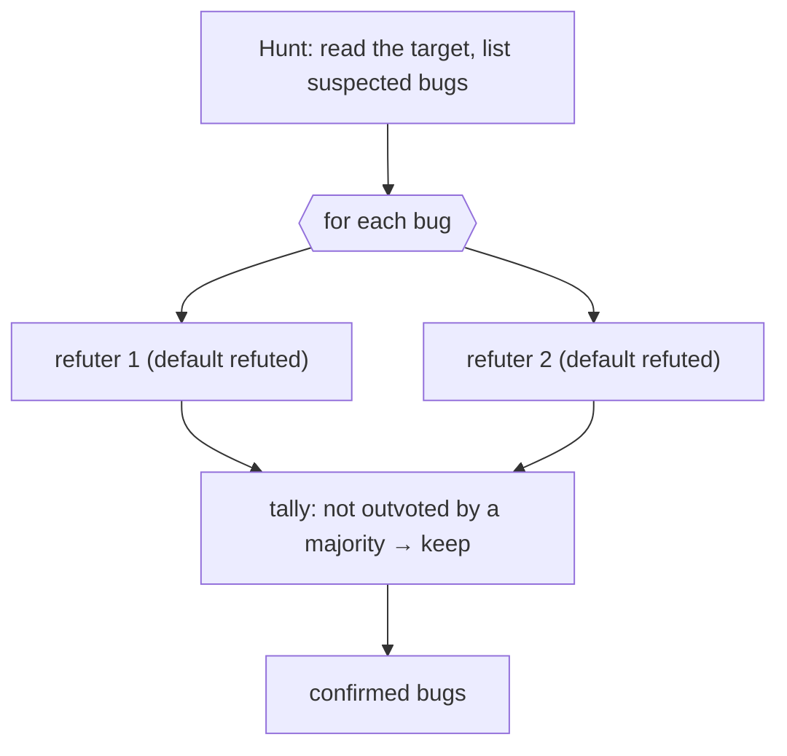

# Chapter 15 · Bug Hunter

> Getting an agent to "find bugs" isn't hard; what's hard is **trusting** the bugs it finds. LLMs are very good at making up "looks-like-a-bug" false positives. This chapter's Bug Hunter recipe solves this trust problem with **adversarial verification**: hunt first, then let an independent "devil's advocate" agent **refute by default** — only what survives refutation counts.
>
> This chapter is based on a real run; it also demonstrates the most striking facet of adversarial verification: **the verifier corrected the hunter in turn.**

---

## 15.1 Recipe Motivation

"Finding bugs" is a typical **unknown-scale discovery task** — you don't know how many bugs there are. Two traps:

1. **False positives**: the model tends to "report something," so it makes up plausible-looking bugs.
2. **Wrong argumentation**: even if the bug is real, the "why" the model gives might be wrong.

Adversarial verification (Chapter 17 dives in separately) treats both at once: for each suspected bug, dispatch N **independent** verifiers, explicitly asked to "refute by default." The burden of proof is pushed onto the "this is a real bug" side.



---

## 15.2 The Full Script

```javascript
export const meta = {
  name: 'bug-hunter',
  description: 'Hunt bugs in a target file, then adversarially verify each finding',
  phases: [{ title: 'Hunt' }, { title: 'Verify' }],
}
const FILE = '.../assets/samples/buggy-cart.js'

phase('Hunt')
const hunt = await agent(
  `Read the file ${FILE} and find genuine bugs. For each: function name, one-line bug, why it's wrong.`,
  { label: 'hunt', schema: { type: 'object', properties: {
    bugs: { type: 'array', items: { type: 'object',
      properties: { fn: { type: 'string' }, bug: { type: 'string' }, why: { type: 'string' } },
      required: ['fn','bug','why'] } } }, required: ['bugs'] } }
)

const verified = await pipeline(
  hunt.bugs,
  (b) => parallel([1,2].map(i => () =>
    agent(`You are a skeptic. Try to REFUTE this claimed bug in ${FILE}. Default to refuted=true if not certain. ` +
          `Claim — in \`${b.fn}\`: ${b.bug} (${b.why}). Read the file to check.`,
      { label: `refute:${b.fn}:${i}`, phase: 'Verify',
        schema: { type: 'object', properties: { refuted: { type: 'boolean' }, reason: { type: 'string' } }, required: ['refuted','reason'] } })
  )).then(votes => {
    const v = votes.filter(Boolean)
    const confirms = v.filter(x => !x.refuted).length
    return { ...b, confirmVotes: confirms, refuteVotes: v.length - confirms, confirmed: confirms >= 1 }
  })
)
const confirmed = verified.filter(Boolean).filter(b => b.confirmed)
return { hunted: hunt.bugs.length, confirmedCount: confirmed.length, confirmed }
```

Note the structure: **Hunt is a single agent** (produces the suspected list), and **Verify uses `pipeline`** — each bug flows independently through the stage of "2 refuters concurrent + tally." This is the typical combination of `parallel` nested inside `pipeline` (Chapter 08).

---

## 15.3 Real Run Results

> **Real run**: Run ID `wf_53da9a06-915`, Task ID `wsj4ypt3x`. See `assets/transcripts/bug-hunter.md` for the raw record.
> Real usage: `agent_count=11` (1 hunter + 5×2 refuters) ｜ `total_tokens=311134` ｜ `duration_ms=61660`.

The target file had 5 bugs planted, **all found, all passing verification 2:0**:

| Function | bug | Votes |
|---|---|---|
| `applyDiscount` | percent has no bounds check (>100 gives a negative price) | 2:0 |
| `cartTotal` | off-by-one: `i < length-1` skips the last item | 2:0 |
| `checkout` | missing `await`, the Promise is always truthy, the cart is cleared before payment | 2:0 |
| `findItem` | `==` instead of `===`, type coercion mismatch | 2:0 |
| `mergeCarts` | mutates the argument in place (aliasing bug) | 2:0 |

---

## 15.4 The Striking Part: the Verifier Corrected the Hunter

The refuter for `applyDiscount`, while **confirming the bug is real**, corrected a piece of wrong argumentation from the hunter (and the seed comment). The original claimed "percent as a string would concatenate," and the refuter pointed out:

> "the source comment's 'percent as string concatenates' claim is false — `*` and `/` coerce strings to numbers, so `applyDiscount(100,'10')` correctly returns 90; concatenation would require `+`."

It's right: `*`/`/` coerce strings into numbers; only `+` concatenates.

<div class="callout tip">

**This is the irreplaceable value of adversarial verification**: it doesn't just filter false positives, it can also **correct wrong reasoning within true positives.** A "checker" that only echoes would never discover this; only a verifier asked to "refute by default, judge refuted if uncertain" will get pedantic — not letting even a flaw buried in the premise slip by.

</div>

---

## 15.5 Design Points

**① Verifiers must be independent.** Use `parallel` to let multiple refuters judge **on their own**, unable to see each other — this way their errors are uncorrelated, and a majority vote is meaningful.

**② Refute by default (refute-by-default).** Hard-code "Default to refuted=true if not certain" in the prompt, pushing the burden of proof onto the "this is a real bug" side. Better to under-report than to let a false positive slip through.

**③ Use a tally, not a single agent's call.** Letting one agent "judge true or false holistically" brings in its own bias; multiple independent refuters + a tally is more stable.

**④ The threshold is tunable.** This example uses 2 votes and "keep if not outvoted by a majority" (fairly lenient). For stricter: increase to 3–5 votes and switch to "keep only if a majority **confirms**" (see Chapter 17).

---

## 15.6 Variant: Loop Until Dry (Unknown-Scale Discovery)

A single-round hunter may miss tail-end bugs. For discovery tasks where "you don't know how many," use **loop until dry** (Chapter 18): repeatedly dispatch new hunters until K consecutive rounds add no **new** confirmed bugs. Pair it with a `budget` guard to prevent an infinite loop:

```javascript
// (illustrative, not executed) the skeleton of loop-until-dry
const found = []
let dryRounds = 0
while (dryRounds < 2 && budget.total && budget.remaining() > 80_000) {
  const round = await huntAndVerify()           // one round of hunt + verify
  const fresh = round.filter(b => !seen(b))
  found.push(...fresh)
  dryRounds = fresh.length === 0 ? dryRounds + 1 : 0
  log(`this round added ${fresh.length}, ${dryRounds} consecutive rounds with no additions`)
}
```

---

## 15.7 Chapter Summary

- Bug Hunter = Hunt (a single agent lists suspects) → Verify (each bug gets multiple independent verifiers that **refute by default**, concurrently + a tally).
- Real run: all 5 seeded bugs found and confirmed 2:0; the verifier also **corrected the hunter's wrong argumentation.**
- Keys: verifiers independent, refute by default, tally rather than a single call, threshold tunable.
- For unknown-scale discovery use "loop until dry" + a `budget` guard.

The next chapter is this part's last recipe: the "documentation/migration sweep" that finishes off the same kind of change scattered across a large number of files in one pass.

> Continue reading: [Chapter 16 · Documentation and Migration Sweep](#/en/p3-16)
