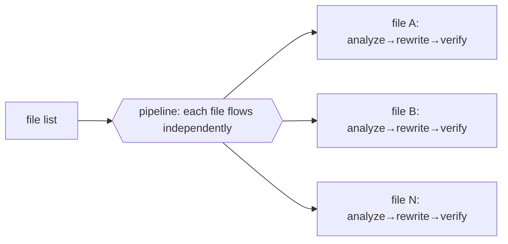

# Chapter 16 · Documentation and Migration Sweep

> "Apply the same kind of change to dozens of files" — rename an API, unify a piece of wording, add a paragraph of explanation to each module, migrate an old idiom to a new one. This kind of **sweep** is Workflow's sweet spot: naturally shardable, concurrent, and each shard's output structurable. This chapter explains its form and two key decisions (read-only analysis vs really editing files).

---

## 16.1 A Sweep's Essence Is Just a pipeline

A sweep = **for a batch of files, each independently runs the same processing chain.** This is exactly the definition of `pipeline` (Chapter 08):



> So a sweep has no separate "new API" to learn — it's an application of `pipeline` + `agent` + `schema` you already know. This book's **bug-hunter** (Chapter 15, Run `wf_53da9a06-915`, real) is a read-only sweep: independently verifying each suspected bug in one file. Swap "items within a file" for "files within a directory," and that's a cross-file sweep.

---

## 16.2 Two Kinds of Sweep: Read-Only Analysis vs Real Rewrite

**Decision one: read-only analysis sweep (recommended to do first).** The agent reads files and returns **structured change suggestions** (without editing directly); the main loop, having received the suggestions, reviews them uniformly and then decides how to land them. Safe, reversible, and the output is auditable.

```javascript
export const meta = {
  name: 'audit-sweep',
  description: 'Read-only sweep: check each file against a checklist, report conformance',
  phases: [{ title: 'Scan' }, { title: 'Audit' }],
}
phase('Scan')
// Use one agent with agentType:'Explore' to run Glob and list targets, or pass the list directly
const files = ['docs/zh/p1-01.md', 'docs/zh/p1-02.md' /* … */]
phase('Audit')
const reports = await pipeline(files,
  (f) => agent(`Read ${f}. Does it end with a "继续阅读" footer link and a 小结 section? Report yes/no + what's missing.`,
    { label: `audit:${f}`,
      schema: { type: 'object', properties: { file: { type:'string' }, ok: { type:'boolean' }, missing: { type:'string' } }, required: ['file','ok','missing'] } })
)
const problems = reports.filter(Boolean).filter(r => !r.ok)
log(`audited ${reports.length} files, ${problems.length} need attention`)
return { problems }
```

> The above is **illustrative** (not executed exactly as-is); its behavior of `pipeline` running concurrently across files with structured output is already validated by Chapter 08's pipeline-demo (Run `wf_bf086b98-6ec`, real) and Chapter 15's bug-hunter (real).

**Decision two: real rewrite sweep.** Let the agent modify files directly. **The key trap**: multiple agents editing files concurrently will **trample each other.** The solution is `isolation: 'worktree'` — each agent edits in an independent git worktree, without conflict (see [Chapter 19 · Worktree Isolation](#/en/p4-19)).

<div class="callout warn">

**A heavy reminder**: `isolation: 'worktree'` is **expensive** (about 200–500ms startup each + disk overhead). **Use it only when multiple agents really will concurrently edit the same set of files and would otherwise conflict**; read-only analysis, or editing files that don't overlap, don't need it.

</div>

---

## 16.3 Recommended Workflow: Analyze First, Then Land via the Main Loop

The most robust sweep pattern hands "thinking" to subagents and leaves "writing" to the main loop:

1. **A read-only sweep** lets N agents analyze concurrently, each returning structured change suggestions.
2. **The main loop** (you, or the orchestrator), having received all suggestions, reviews, dedups, and decides uniformly.
3. **The main loop lands them with the native Write/Edit** — the Workflow **script body** itself, and the writes of `ctx_execute`/Bash subprocesses, **don't persist** (see grounding); but a subagent that calls Write/Edit **can** produce real file side-effects ([Chapter 19 · Worktree Isolation](#/en/p4-19) is precisely about letting parallel agents each edit files via Edit). The sweep **recommends** having subagents return only structured suggestions for the main loop to land — an engineering choice for "safety, auditability, convergence," not because subagents can't write.

This also echoes the guardrail idea of Chapter 23's oh-my-openagent "external models do zero writes, the orchestrator lands them": **let analysis be concurrent, let writing converge to one place** — both fast and controllable.

---

## 16.4 Design Points

- **Slice shards**: use an agent with `agentType: 'Explore'` to run Glob/Grep and discover files, or pass the list directly.
- **Structured output per shard**: use `schema` to fix "filename + conformance + what's missing / change diff," for ease of aggregation and landing.
- **Read-only first**: if you can produce "suggestions" first, don't let the agent edit directly; suggestions are reviewable and reversible.
- **If you really must rewrite concurrently**: use `worktree` isolation (Chapter 19), and weigh its cost.
- **A sweep must `log` its trade-offs**: if you only scanned the top-N files or skipped some, **be sure to log it** — don't let silent truncation be misread as "everything was scanned."

---

## 16.5 Chapter Summary

- A sweep = `pipeline` applying the same processing chain across files; no new API.
- Two forms: **read-only analysis** (safe, recommended) vs **real rewrite** (needs `worktree` isolation to prevent trampling, expensive).
- The most robust pattern: subagents concurrently **analyze** into structured suggestions → the main loop uniformly **lands** them (Write/Edit).
- Real confirmation: pipeline-demo / bug-hunter have validated cross-item concurrency + structured output.

**The Practical Recipes part is now complete.** Part IV turns to the advanced patterns that make these recipes **trustworthy** — adversarial verification, loop until dry, the judge panel, completeness critique.

> Continue reading: [Chapter 17 · Adversarial Verification](#/en/p4-17)
