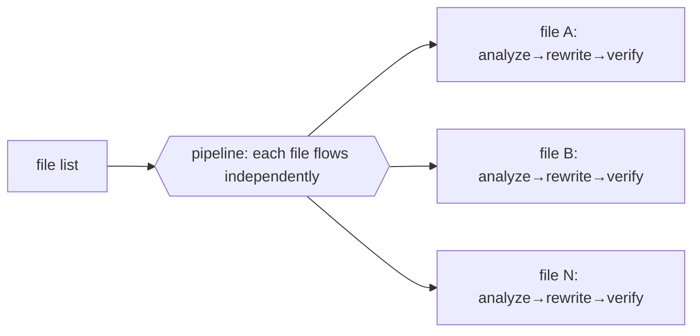
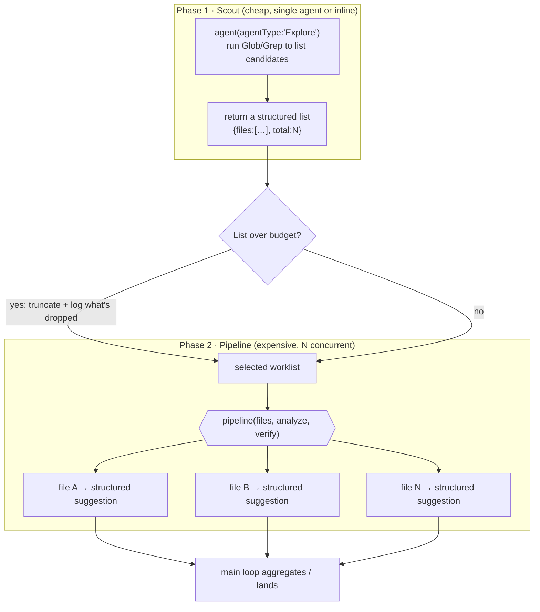
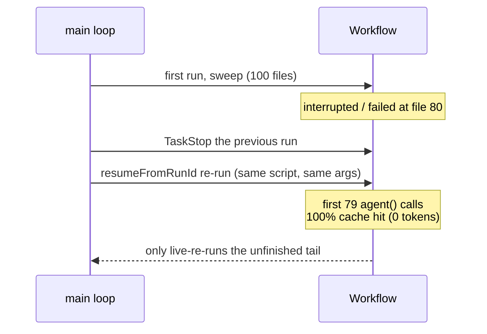

# Chapter 16 · Documentation and Migration Sweep

> "Apply the same kind of change to dozens of files" — rename an API, unify a piece of wording, add a paragraph of explanation to each module, migrate an old idiom to a new one. This kind of **sweep** is Workflow's sweet spot: it shards naturally, runs concurrently, and each shard's output can be structured. This chapter walks through what it looks like, its **two-phase skeleton** (scout the list first, then pipeline each item), and three engineering principles that make a sweep **trustworthy**: **no-silent-caps** (if coverage has a limit, say so), **report-only first** (default to reporting; let a human review before you edit), and **idempotent + recoverable** (resumable when interrupted, safe to re-run).

---

## 16.1 A Sweep's Essence Is Just a pipeline

A sweep = **take a batch of files, and run each one through the same processing chain on its own.** This is exactly the definition of `pipeline` (Chapter 08):



> So a sweep has no separate "new API" to learn — it just puts `pipeline` + `agent` + `schema`, which you already know, to work. This book's **bug-hunter** (Chapter 15, Run `wf_53da9a06-915`, real, 11 agents) is a read-only sweep: it verifies each suspected bug in one file on its own. Swap "items within a file" for "files within a directory," and that's a cross-file sweep.

Why does a sweep deserve its own chapter? Because it pushes pipeline to **scale**: not 3 hard-coded items, but "as many items as there are files in a directory." Once the item count stops being a constant and is instead **discovered at runtime**, three new problems surface — where does the list come from (16.2, the two-phase method), what if the list is too big (16.4, no-silent-caps), and what if it dies halfway (16.6, idempotency). This chapter answers those three questions.

---

## 16.2 The Two-Phase Method: Scout the List First, Then Pipeline Each Item

The most common mistake is wanting one agent to "both discover files and process each one." That doesn't work, and you shouldn't do it: **discovering the list** and **processing each item** are two completely different kinds of work — the former is a cheap directory scan (one agent running Glob/Grep is enough), the latter is N concurrent subagents each chewing on one file. Mash them together and you lose both the chance to **review and trim** the list, and the ability to structurally aggregate the processing stage.

The right form is the **two-phase method (scout → pipeline)**:



- **Phase 1, Scout**: use one agent with `agentType: 'Explore'` to run Glob/Grep and return a **structured list** (an array of file paths + a total). This step is dirt-cheap — it doesn't read full text, it only lists names. You can also skip the agent entirely: if you (the main loop / orchestrator) already know the list, just pass the array into the script and save yourself an agent round-trip.
- **Trim gate**: drop a gate between the two phases — does the list exceed this run's budget (token / agent count / time)? If you need to truncate, **truncate and `log` what was dropped** (see 16.4).
- **Phase 2, Pipeline**: run `pipeline` over the **selected** list; each file flows on its own through an "analyze → verify" chain and returns a structured suggestion.

Here is a runnable skeleton of the two-phase method (**illustrative, not executed as-is**; but its behavior of `pipeline` running concurrently across files with structured output is already validated by Chapter 08's pipeline-demo (Run `wf_bf086b98-6ec`, real, 6 agents / 158,982 tokens / 26.7s) and Chapter 15's bug-hunter (real)):

```javascript
export const meta = {
  name: 'docs-footer-sweep',
  description: 'Two-phase sweep: scout lists docs, then audit each for a required footer link',
  phases: [
    { title: 'Scout', detail: 'List candidate files (cheap, single agent)' },
    { title: 'Audit', detail: 'Per-file structured conformance report' },
  ],
}

// —— Phase 1: Scout, list the worklist (cheap; or have the main loop pass args.files to skip this) ——
phase('Scout')
let files
if (Array.isArray(args && args.files)) {
  files = args.files            // main loop already knows the list: use it, save an agent
} else {
  const found = await agent(
    'Glob docs/en/*.md and return the list of file paths. Do NOT read file contents.',
    { label: 'scout', agentType: 'Explore',
      schema: { type: 'object',
        properties: { files: { type: 'array', items: { type: 'string' } } },
        required: ['files'] } })
  files = found.files
}
log(`scout found ${files.length} candidate files`)

// —— Phase 2: Pipeline, analyze each item (expensive, N concurrent) ——
phase('Audit')
const reports = await pipeline(files,
  (f) => agent(
    `Read ${f}. Does it end with a "Continue reading" footer link AND contain a Summary section? ` +
    `Report yes/no plus exactly what is missing.`,
    { label: `audit:${f}`, phase: 'Audit',
      schema: { type: 'object',
        properties: {
          file: { type: 'string' },
          ok: { type: 'boolean' },
          missing: { type: 'string' },
        }, required: ['file', 'ok', 'missing'] } })
)
const problems = reports.filter(Boolean).filter((r) => !r.ok)
log(`audited ${reports.length} files, ${problems.length} need attention`)
return { scanned: reports.length, problems }
```

<div class="callout tip">

**Why scout first rather than stuffing Glob into pipeline's first stage?** Because the list needs **a human / the main loop to glance at it before deciding** — it might be too big and need trimming, it might have swept in files you shouldn't touch (build artifacts, vendored third-party directories). Pulling "list the worklist" out into its own step gives you a **seam for trimming and review**; stuffed inside pipeline, the list gets consumed the moment it's produced, with no room to maneuver.

</div>

---

## 16.3 Two Kinds of Sweep: Read-Only Analysis vs Real Rewrite

What "Phase 2" actually does comes down to which kind of sweep this is.

**Decision one: read-only analysis sweep (do this one first).** The agent reads files and returns **structured change suggestions** (without editing directly); the main loop, once it has the suggestions, reviews them all together and then decides how to land them. Safe, reversible, and the output is auditable. The skeleton in 16.2 above *is* a read-only analysis sweep — it returns only a `{file, ok, missing}` report and changes not a single character.

**Decision two: real rewrite sweep.** Let the agent edit files directly. **The key trap**: multiple agents editing files concurrently will **trample each other.** The fix is `isolation: 'worktree'` — each agent edits in its own git worktree, without conflict (see [Chapter 19 · Worktree Isolation](#/en/p4-19)).

<div class="callout warn">

**A heavy reminder**: `isolation: 'worktree'` is **expensive** (about 200–500ms startup each + disk overhead + an agent). **Use it only when multiple agents really will concurrently edit the same set of files and would otherwise conflict**; read-only analysis, or editing files that don't overlap, has no need for it.

</div>

This leads to the most important safety trade-off in a sweep: **report-only vs apply.**

| Dimension | report-only (default) | apply (real edits) |
|---|---|---|
| What Phase-2 agents do | read-only + return structured suggestions | call Write/Edit to really edit files |
| Isolation cost | none (no writes, no conflict) | needs `worktree` to avoid trampling, expensive |
| Auditability | high: a human can review each suggestion before greenlighting | low: you see it after editing; rollback via git |
| Reversibility | inherent (nothing was changed) | via git revert / discarding the worktree |
| When to use | first pass, blast radius unclear, want human review | suggestions reviewed, change pattern settled, batch execution |

The standard engineering practice is **two passes**: a first report-only pass to map the whole picture and let a human review the suggestions; once the suggestions are solid, a second pass to apply them (or just hand the reviewed suggestions to the main loop to land with native Write/Edit, skipping worktrees entirely). **Default to reporting first**, because once a sweep's "same change across dozens of files" goes wrong, dozens of files go wrong together — report-only puts that risk in front of human review.

---

## 16.4 no-silent-caps: If Coverage Has a Limit, Say So

A sweep's most dangerous failure isn't an error — you can see an error. The most dangerous is **silent truncation**: the script quietly caps coverage (takes only the top-N, samples a subset, skips on failure without retry) yet makes the result **look like full coverage**. The reader concludes "the whole directory was scanned and is conformant," when in fact half of it was never touched. That silent lie is far more dangerous than a loud error.

The principle is **no-silent-caps**: **any reduction of coverage — a cap, sampling, skipping, deduping, early exit — must be `log()`-ed, spelling out "what was dropped, why, and how much is left unprocessed."** Workflow's `log()` exists for exactly this — it prints a narration line above the progress tree (see §B) and is the script's only channel to "come clean" to the human.

Why would there be a cap? Because a sweep naturally bumps into the hard limits in grounding:

- **Concurrency cap** = `min(16, CPU cores − 2)` (official): going past it **queues**, it doesn't error — so N=500 files won't blow up, but it'll be slow, and you may want to deliberately take only one batch.
- **Lifetime `agent()` total cap of 1000** (official, a runaway-loop backstop): if a sweep's files × stages approaches 1000, you must cap deliberately.
- **token budget** (`budget.total`, a hard ceiling): once `spent()` reaches `total`, the next `agent()` throws — so a big list must either be batched or deliberately truncated.

When you hit these limits, **deliberate truncation + log** beats "letting it hit the 1000 cap and throw" or "letting the budget run dry and crash mid-way" by a mile. Here is what baking no-silent-caps into a script looks like (**illustrative, not executed**):

```javascript
export const meta = {
  name: 'capped-sweep',
  description: 'Sweep with an explicit per-run cap that LOGS what it drops (no silent truncation)',
  phases: [{ title: 'Scout' }, { title: 'Process' }],
}

phase('Scout')
const all = (await agent('Glob src/**/*.ts and return paths only.',
  { label: 'scout', agentType: 'Explore',
    schema: { type: 'object', properties: { files: { type: 'array', items: { type: 'string' } } }, required: ['files'] } })).files

// —— Explicit cap: not "200 files so run 200," but a number this run can afford ——
const CAP = 50
const selected = all.slice(0, CAP)
const dropped = all.length - selected.length

// —— The heart of no-silent-caps: state what was dropped ——
if (dropped > 0) {
  log(`⚠ COVERAGE CAP: scouted ${all.length} files, processing first ${selected.length}, ` +
      `DROPPED ${dropped}. This run is NOT full coverage — re-run on the remainder ` +
      `(e.g. args.files = the next batch) to continue.`)
}

phase('Process')
const reports = await pipeline(selected,
  (f) => agent(`Audit ${f} for the migration checklist; report findings.`,
    { label: `proc:${f}`, phase: 'Process',
      schema: { type: 'object',
        properties: { file: { type: 'string' }, findings: { type: 'array', items: { type: 'string' } } },
        required: ['file', 'findings'] } }))

// —— Carry the coverage facts in the return value too, so the caller can't misread it ——
return {
  coverage: { total: all.length, processed: selected.length, dropped },
  complete: dropped === 0,
  reports: reports.filter(Boolean),
}
```

<div class="callout warn">

**Silent truncation is a sweep's number-one incident source.** Three of its sneakiest versions: (1) `array.slice(0, N)` without a log, so the result looks like everything ran; (2) a `pipeline` item throws → it's silently set to `null`, `filter(Boolean)` filters it out, and "the failed file vanishes into thin air"; (3) deduping with a `Set` folds together same-named files that each should be processed. **Countermeasure**: any operation that changes "how many were processed" must either be `log`-ed or written into the return value's `coverage` field. Make coverage a **first-class citizen**, not a footnote.

</div>

A special note on `pipeline`'s "failure-is-null" semantics (see §B): a stage throws → that item becomes `null` and skips the rest of its stages. `reports.filter(Boolean)` is clean, but it **silently eats failures.** The robust form counts first, then filters:

```javascript
const failed = reports.filter((r) => r === null).length
if (failed > 0) log(`⚠ ${failed}/${reports.length} files failed mid-pipeline (returned null) and were skipped`)
const ok = reports.filter(Boolean)
```

---

## 16.5 Recommended Workflow: Let Analysis Be Concurrent, Let Writing Converge to One Place

Putting the preceding sections together, the most robust sweep pattern hands "thinking" to subagents and leaves "writing" to the main loop:

1. **Scout the list** (16.2), trim it to a scale this run can afford, and `log` what's dropped (16.4).
2. **A read-only sweep** lets N agents analyze concurrently, each returning structured change suggestions (16.3, decision one).
3. **The main loop** (you, or the orchestrator), once it has all the suggestions, reviews, dedups, and decides in one place.
4. **The main loop lands them with the native Write/Edit** — the Workflow **script body** itself, and the writes of `ctx_execute`/Bash subprocesses, **don't persist** (see grounding); but a subagent that calls Write/Edit **can** produce real file side-effects ([Chapter 19 · Worktree Isolation](#/en/p4-19) is precisely about letting parallel agents each edit files via Edit). The sweep **recommends** having subagents return only structured suggestions for the main loop to land — an engineering choice for "safety, auditability, convergence," not because subagents can't write.

This also echoes the guardrail idea of Chapter 23's oh-my-openagent, "external models do zero writes, the orchestrator lands them": **let analysis be concurrent, let writing converge to one place** — both fast and controllable. The two-phase method splits "fast" (pipeline fanning out N analyses) and "controllable" (writes converging to one serial landing in the main loop) across two phases, so they never fight.

---

## 16.6 Idempotent and Recoverable: What If the Big List Dies Halfway

A sweep is a long task — dozens to hundreds of files, one subagent round-trip each, with a wall-clock of possibly minutes. Long tasks inevitably run into: **what if it gets interrupted mid-way? Will a re-run redo what's already done?**

Workflow gives you two weapons.

**Weapon one: resume (`resumeFromRunId`).** Same script + same args re-run = **100% cache hit**: unchanged `agent()` calls reuse their cached results directly, at **0 tokens, 0 tool calls.** This isn't an estimate, it's measured — when this book resumed `hello-workflow` (Run `wf_dacbd480-d5d`), that agent returned the **exact same** result as the first run at **0 tokens / 8ms** (see `assets/transcripts/advanced.md`). What this means for a sweep: a run that scanned 100 files and died at file 80, on resume, gets the first 79 as second-level cache hits burning almost no tokens, and only live-re-runs the unfinished tail.



But resume has two iron rules (see §A2 / §B2) that are exactly a sweep's design constraints:

- **TaskStop the previous run before resuming** (official) — don't let two runs fight over the same journal.
- **Same session only** — the resume handle lives in this session; cross-session is not guaranteed. So true "cross-session recoverability" leans on weapon two below.

<div class="callout warn">

**Resume ≠ the script may use timestamps/random numbers.** Resume's entire premise is that the script is **replayable**: `Date.now()` / `Math.random()` / argument-less `new Date()` are banned (grounding, measured: literals are statically rejected at submit time, aliased forms throw at runtime). The reason *is* resume — if the script's results drift from run to run, the cache key is invalidated and resume degrades into a full re-run. Need a timestamp? Pass it via `args`. Need randomness? Vary the prompt by agent index.

</div>

**Weapon two: the report itself is a checkpoint (a bonus of report-only).** A report-only sweep changes no files, so it is **inherently idempotent** — re-running it, at worst, regenerates an identical report; it will never break a file twice. Persist each batch's report (including the `coverage` field from 16.4), and the next batch picks up from "the remaining list where `complete:false` in the previous batch's report." This is **cross-session** recoverability: the state lives outside in report files, not in Workflow's in-session journal. This "iterate until there is nothing new left to process" form is exactly the theme of [Chapter 18 · Loop Until Dry](#/en/p4-18) — a sweep's "batch and re-scan until the remaining list is empty" is one instance of loop-until-dry.

| Recovery mechanism | Scope | Cost | Use for |
|---|---|---|---|
| `resumeFromRunId` resume | **same session only** | 0 tokens (cache hit) | picking one run back up after an interruption within the same session |
| report-only + externalized list | **cross-session** | re-run the remaining list | sweeps big enough to need multiple batches, across sessions |

---

## 16.7 Design Points

- **Two-phase method**: scout the list first (cheap, single agent or passed by the main loop), then pipeline each item (expensive, N concurrent). Don't mash discovery and processing into one agent.
- **Slice shards**: use an agent with `agentType: 'Explore'` to run Glob/Grep and discover files, or just pass the list directly.
- **Structured output per shard**: use `schema` to pin down "filename + conformance + what's missing / change diff," so it's easy to aggregate and land.
- **Report-only first**: if you can produce "suggestions" first, don't let the agent edit directly; suggestions are reviewable, reversible, inherently idempotent.
- **no-silent-caps**: any reduction of coverage (cap/sampling/skipping/dedupe/failure-to-null) must be `log`-ed and written into the return value's `coverage` — don't let silent truncation be misread as "everything was scanned."
- **If you really must rewrite concurrently**: use `worktree` isolation (Chapter 19) to prevent trampling, and weigh what it costs.
- **Recoverable**: within a session use `resumeFromRunId` (0-token cache hit); across sessions rely on report-only + an externalized list, batched and re-scanned.
- **Stay replayable**: the script bans timestamps/random numbers, or resume degrades into a full re-run.

---

## 16.8 Chapter Summary

- A sweep = `pipeline` applying the same processing chain across files; no new API, but pushed to **scale**, which surfaces three questions: the list, the cap, and recovery.
- **Two-phase method**: scout (cheaply list the worklist) → pipeline (expensively process each item), with a trim gate in between.
- Two forms: **read-only analysis** (report-only, safe, recommended, idempotent) vs **real rewrite** (apply, needs `worktree` isolation to prevent trampling, expensive). The standard practice is two passes: "report first, human review, then edit."
- **no-silent-caps**: any coverage limit must be `log`-ed + written into `coverage`; watch out especially for `pipeline` failures-to-null getting silently eaten by `filter(Boolean)`.
- **Idempotent and recoverable**: within a session `resumeFromRunId` gives a 100% cache hit (measured: resuming `wf_dacbd480-d5d` at 0 tokens / 8ms); across sessions rely on report-only + an externalized list, batched and re-scanned.
- Real confirmation: pipeline-demo (`wf_bf086b98-6ec`, 6 agents) / bug-hunter (`wf_53da9a06-915`, 11 agents) have validated cross-item concurrency + structured output.

**The Practical Recipes part is now complete.** Part IV turns to the advanced patterns that make these recipes **trustworthy** — adversarial verification, loop until dry, the judge panel, completeness critique.

> Continue reading: [Chapter 17 · Adversarial Verification](#/en/p4-17)

---

[← Back to main README](../../README.md) · [中文 README →](../../README.md)
