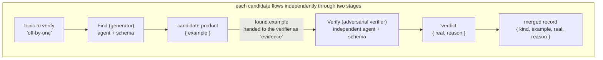
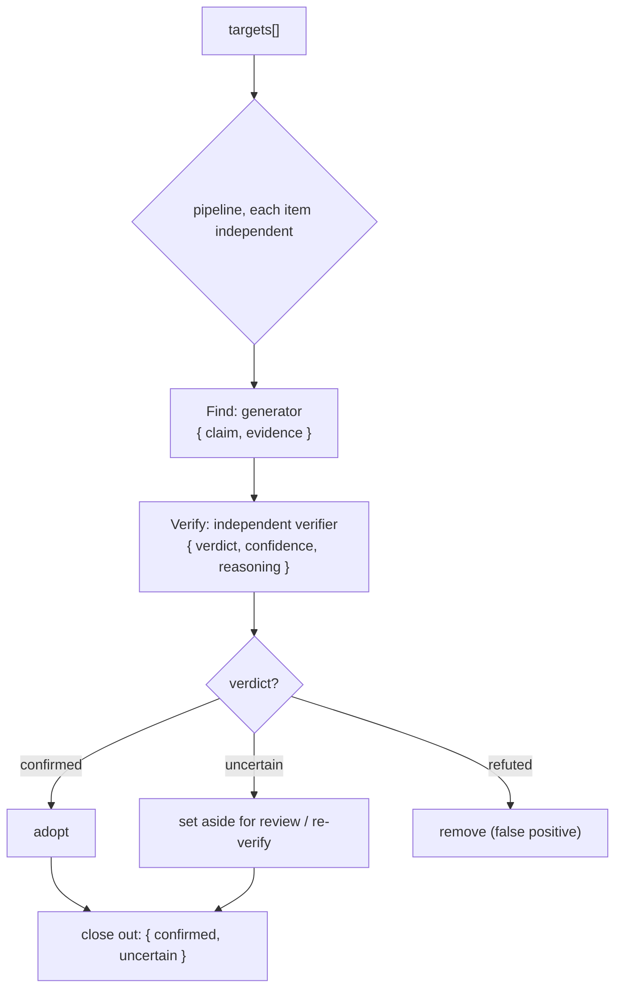

# Chapter 17 · Adversarial Verification

> In one sentence: **have an independent subagent "pick holes" in the previous subagent's product — its task is not to agree but to try its hardest to falsify. Converge that falsification result into a trustworthy verdict with a schema, and you get a self-correcting pipeline.**
>
> This is the first chapter of Advanced Patterns, and the mother theme of all subsequent "quality gate" patterns. Foundations taught you `agent` / `pipeline` / `schema`; this chapter combines them into a structure of great engineering value — **separating generation from verification.**

---

## 17.1 Why Adversarial Verification: The Fundamental Flaw of Self-Assessment

Let's start with a pothole everyone has stepped in.

You ask a subagent to "find the bugs in this code," and it returns three. You offhandedly ask it, "are you sure these are all real bugs?" — and it almost always answers "Yes, I confirm these are all genuine issues."

**The problem: making the same model assess its own product gives it a strong confirmation bias.** It just generated these bugs, its context is full of "this is a bug" arguments, and asking it to self-examine now finds its stance already anchored. It will defend itself rather than question itself. This isn't the model "not being smart enough"; the **very task structure of self-assessment** is flawed — assessor and assessed share the same context, the same stance.

The core insight of adversarial verification: **replace the verifier with a brand-new, independent subagent, and explicitly tell it "your duty is to falsify."**

- It has an **independent context**: no baggage of "I just generated this," seeing only a claim to be checked.
- It has an **adversarial stance**: the prompt explicitly asks it to be a skeptic, find counterexamples, and pick holes, rather than agree.
- Its verdict is **structured**: a schema pins "real/false/uncertain" into an enum, rather than a vague paragraph of prose.

These three stacked turn "the model feeling good about itself" into "an adversarial contest between two independent perspectives" — and adversarial contest is the oldest and most reliable method of approaching the truth.

<div class="callout info">

**This is actually Workflow rewriting wisdom the community long validated.** Per `_grounding.md` section D, one of the superpowers system's gems is exactly the "two-stage review loop" (spec compliance → code quality, each looping until it passes), oh-my-claudecode stresses "independent reviewer sign-off," and oh-my-openagent uses "VERIFICATION_REMINDER injection for correction." These systems all use prompts and Hooks to **simulate** "separating generation from verification." Native Workflow lets you write it as a **deterministic, reusable** structure with `pipeline` + `schema` — which is what this chapter teaches.

</div>

---

## 17.2 The Minimal Adversarial-Verification Skeleton from a Real Run

The fastest way to understand adversarial verification is to see it **actually run.** The `pipeline-demo` used in Foundations (Run ID `wf_bf086b98-6ec`, `agent_count=6`) happens to be a minimal adversarial verification: **the Find stage produces a candidate bug, the Verify stage adversarially checks whether it's a real bug.**

```javascript
const items = ['off-by-one', 'null-dereference', 'race-condition']
const out = await pipeline(
  items,
  // Stage 1 Find: generate a candidate
  (kind) =>
    agent(`Give a one-line code example of a ${kind} bug.`, {
      label: `find:${kind}`, phase: 'Find',
      schema: { type: 'object', properties: { example: { type: 'string' } }, required: ['example'] },
    }),
  // Stage 2 Verify: adversarial check
  (found, kind) =>
    agent(
      `Is this genuinely a ${kind} bug? Example: "${found.example}". Reply boolean + short reason.`,
      {
        label: `verify:${kind}`, phase: 'Verify',
        schema: {
          type: 'object',
          properties: { real: { type: 'boolean' }, reason: { type: 'string' } },
          required: ['real', 'reason'],
        },
      }
    ).then((v) => ({ kind, ...found, ...v }))
)
return out.filter(Boolean)
```

Its **real return value** (source: `assets/transcripts/primitives.md`, excerpt):

```json
[
  {
    "kind": "off-by-one",
    "example": "for i in range(len(arr)): print(arr[i+1])  # off-by-one: ...out of bounds",
    "real": true,
    "reason": "Genuine off-by-one bug... at i=2 it accesses arr[3]=arr[len(arr)], raising IndexError..."
  },
  {
    "kind": "null-dereference",
    "example": "int *p = NULL; *p = 5;",
    "real": true,
    "reason": "...Dereferencing a NULL pointer is undefined behavior and crashes (segfault)..."
  }
]
```

This skeleton already contains all the elements of adversarial verification; let's take them apart:

**First, the verifier is a brand-new agent.** The Verify stage's `agent()` call and the Find stage are **two entirely independent subagents** — independent context, independent token budget (confirmed by real data: 3 items × 2 stages = `agent_count=6`). Verify sees not "the bug I generated" but "a claim to be checked, `found.example`."

**Second, the verifier is asked to judge, not to restate.** The prompt asks "Is this genuinely a ... bug?" — a yes/no question, forcing it to take a stance.

**Third, the verdict is converged by a schema.** `real: boolean` is a **gate field**: it pins "is this a real bug" from a possibly vague sentence into a `true`/`false`. The orchestration script can then `filter` on it — the key to "separating generation from verification" landing as a deterministic process.



<div class="callout tip">

**Note pipeline's clever use here**: per `_grounding.md`, pipeline has **no barrier** between stages — while one candidate is still at Verify, another may still be at Find. Adversarial verification naturally suits pipeline, because "generate → verify" is a natural two-stage chain, and you often run this chain in parallel over **multiple** candidates. Wall clock is about "the slowest single Find→Verify chain," not the sum of all Finds plus the sum of all Verifies.

</div>

---

## 17.3 Upgrading the Verdict: From boolean to a Three-State Enum

`real: boolean` is enough for the simplest scenarios, but production-grade adversarial verification often needs **three states**, because beyond "yes" and "no," the real world has plenty of "insufficient evidence, can't decide" cases. Forcing the verifier to pick one of two with incomplete information makes it guess blindly — which precisely violates adversarial verification's intent of "rigor."

Upgrade the verdict to three states with `enum`:

```javascript
// (illustrative, not run) — three-state verdict schema: the standard form of adversarial verification
const verdictSchema = {
  type: 'object',
  properties: {
    verdict: {
      type: 'string',
      enum: ['confirmed', 'refuted', 'uncertain'],
      description:
        'confirmed=sufficient evidence, truly an issue; refuted=confirmed false positive, give a counterexample or reason; ' +
        'uncertain=current evidence insufficient to decide, needs more information',
    },
    confidence: {
      type: 'number',
      description: 'a decimal from 0 to 1, your degree of certainty in this verdict',
    },
    reasoning: {
      type: 'string',
      description: 'one sentence giving the key rationale or counterexample; if refuted, must point out why it doesn\'t hold',
    },
  },
  required: ['verdict', 'confidence', 'reasoning'],
}
```

The three fields each do their job:

| Field | Type | Role |
|---|---|---|
| `verdict` | three-state enum | The core verdict, pinned values, on which downstream does state-machine routing |
| `confidence` | number | Degree of certainty, usable for "re-verifying low-confidence ones" or weighting |
| `reasoning` | string | Makes the verdict auditable — especially `refuted` must give a counterexample, forcing the verifier to truly think |

`enum` is the lifeline here. Recall `_grounding.md`: schema is validated at the tool-call layer, and an `enum`-limited field triggers a retry if outside the value set. This means downstream you can **absolutely confidently** write:

```javascript
// (illustrative, not run) — route on the three-state verdict
const confirmed = results.filter((r) => r.verdict === 'confirmed')
const needsReview = results.filter((r) => r.verdict === 'uncertain')
// refuted ones are discarded directly, no longer polluting downstream
```

No need to worry whether the model returned `'Confirmed'`, a localized word, or `'I think it is confirmed'` — the runtime guarantees it'll only be one of those three values. **Enum turns adversarial verification's output into a reliable state-machine transition.**

---

## 17.4 Writing the Adversary's Prompt: How to "Force" Out Skepticism

The other half of adversarial verification's success isn't in the schema, but in **the verifier's prompt.** The schema guarantees the verdict's structure is correct, but "whether the verifier is truly being adversarial" depends on how you set its role.

A common failure is a too-gentle prompt: "Please check whether this finding is correct" — the model will politely nod. To force out real adversarial contest, the prompt needs to do three things:

**One, assign an adversarial role.** Explicitly tell it "you are a skeptic / red team / hole-picker," and its success criterion is "find where this claim doesn't hold up."

**Two, demand evidence, not a stance.** Don't just ask "is it right"; require it to "if you think it's a false positive, you must give a counterexample or specific reason." The burden of proof forces the model to truly deliberate, rather than vote on feeling.

**Three, provide the raw evidence, not the original author's reasoning.** Hand it only "the conclusion to be verified + the necessary raw material," and do **not** feed it the generator's "why I think this is a bug" reasoning — otherwise the verifier gets carried along by the original author's train of thought, and the adversarial nature vanishes.

```javascript
// (illustrative, not run) — an adversarial verifier prompt
const verify = (claim, evidence) =>
  agent(
    'You are a strict code-review red-team member. Your duty is not to agree but to try your hardest to **falsify** the claim below.\n' +
    'Only when you cannot find any counterexample and the evidence is conclusive should you rule confirmed.\n' +
    'If you can construct a counterexample, or the claim depends on an unproven assumption, rule refuted and explain.\n' +
    'If the current evidence is insufficient to decide, rule uncertain — do not guess.\n\n' +
    `Claim to verify: ${claim}\n` +
    `Relevant code evidence:\n${evidence}`,
    { schema: verdictSchema, label: 'adversary' }
  )
```

Note that the generator's reasoning is **not** passed in here — `claim` is the conclusion, `evidence` is the raw code, and the verifier must judge **anew on its own.**

<div class="callout warn">

**Adversarial isn't the same as contrarian.** A common over-correction is tuning the verifier to be so suspicious that it rules even real bugs as refuted (false negatives). The key to balance is `confidence` and `reasoning`: require that when it rules refuted, it **must give a concrete counterexample.** If it can't give a counterexample and just "feels off," then it should actually rule `uncertain`. Use the burden of proof to constrain the strength of adversarial contest, avoiding a slide from "confirmation bias" to "denial bias."

</div>

---

## 17.5 The Complete Skeleton: Generate → Adversarial Verify → Close Out

Combine the preceding sections, and you get a production-usable adversarial-verification pipeline. For a set of items to review, each independently "generates a candidate finding → an independent verifier falsifies → closes out on the verdict."

```javascript
// (illustrative, not run) — complete adversarial-verification pipeline
export const meta = {
  name: 'adversarial-review',
  description: 'Generate a finding for each target, then an independent verifier adversarially checks, keeping only confirmed items',
  phases: [
    { title: 'Find', detail: 'Generate candidate findings' },
    { title: 'Verify', detail: 'An independent verifier falsifies' },
  ],
}

const verdictSchema = {
  type: 'object',
  properties: {
    verdict: { type: 'string', enum: ['confirmed', 'refuted', 'uncertain'] },
    confidence: { type: 'number' },
    reasoning: { type: 'string' },
  },
  required: ['verdict', 'confidence', 'reasoning'],
}

const targets = args.targets // the list of review targets passed in by the caller

const reviewed = await pipeline(
  targets,
  // Stage 1: generator
  (target) =>
    agent(
      `Review the target "${target}", find the single most suspicious issue, give claim (conclusion) and evidence (supporting evidence).`,
      {
        label: `find:${target}`, phase: 'Find',
        schema: {
          type: 'object',
          properties: { claim: { type: 'string' }, evidence: { type: 'string' } },
          required: ['claim', 'evidence'],
        },
      }
    ),
  // Stage 2: independent adversarial verifier
  (found, target) =>
    agent(
      'You are a strict red-team reviewer; your duty is to falsify the following claim. If you can give a counterexample, rule refuted; ' +
      'only when the evidence is conclusive and irrefutable rule confirmed; if evidence is insufficient rule uncertain.\n' +
      `Claim: ${found.claim}\nEvidence: ${found.evidence}`,
      { label: `verify:${target}`, phase: 'Verify', schema: verdictSchema }
    ).then((v) => ({ target, ...found, ...v }))
)

// Close out: filter out skipped nulls, classify by verdict
const valid = reviewed.filter(Boolean)
const confirmed = valid.filter((r) => r.verdict === 'confirmed')
const uncertain = valid.filter((r) => r.verdict === 'uncertain')
log(`Confirmed ${confirmed.length}, uncertain ${uncertain.length}, removed ${valid.length - confirmed.length - uncertain.length} false positives`)
return { confirmed, uncertain }
```

Several engineering details worth stressing:

- **`.filter(Boolean)` can't be omitted.** Per `_grounding.md`, the user skipping an agent midway makes that call return `null`; a pipeline stage throwing also makes that item `null`. Filter them out before consuming.
- **`phase` explicitly marked.** Inside the pipeline, pass `phase: 'Find'` / `'Verify'` to each `agent()` to avoid racing the global `phase()`, keeping the progress tree clearly grouped. This is the approach `_grounding.md` explicitly recommends.
- **Three-state close-out.** `confirmed` is adopted directly, `refuted` discarded, `uncertain` set aside separately — handed to a human for review or sent into re-verification (see next section).



---

## 17.6 Advanced: Multi-Verifier Voting and Confidence Weighting

A single verifier is already far better than self-assessment, but it's still **one** perspective. When a verdict's cost is high (e.g., deciding whether to block a release), you can have **multiple independent verifiers** each vote, then aggregate with code — upgrading from "adversarial contest" to a "jury."

The mechanism is simple: for the same claim, fan out N verifiers with `parallel`, each judging independently, then take a majority vote.

```javascript
// (illustrative, not run) — multi-verifier voting
const jurors = await parallel(
  [0, 1, 2].map((i) => () =>
    agent(
      // Use the index i to nudge perspectives, avoiding full homogeneity (echoing "forbid Math.random, use index to create variation")
      `You are independent reviewer #${i + 1}; falsify the following claim from the angle of ${['exploitability', 'blast radius', 'reproduction difficulty'][i]}.\n` +
      `Claim: ${claim}\nEvidence: ${evidence}`,
      { label: `juror:${i}`, schema: verdictSchema }
    )
  )
)

const votes = jurors.filter(Boolean)
const confirmedVotes = votes.filter((v) => v.verdict === 'confirmed').length
// A majority confirming counts as confirmed; confidence can be averaged
const finalVerdict = confirmedVotes > votes.length / 2 ? 'confirmed' : 'refuted'
const avgConfidence = votes.reduce((s, v) => s + v.confidence, 0) / votes.length
```

<div class="callout tip">

**The recommended reusable default rule: default to `refuted` unless a majority of the independent jurors (e.g., at least 2 of 3) vote `confirmed`.** In other words, a finding **survives only when a majority of jurors affirmatively confirm it**; ties or "insufficient evidence" all default to refuted. That `confirmedVotes > votes.length / 2` line above is exactly this rule in code — 3 votes need ≥2, 5 votes need ≥3 to count as `confirmed`, otherwise it closes out as `refuted`. Treat it as adversarial verification's default close-out posture: **the burden of proof is on the "confirm" side; silence and disagreement both fall toward refuted.** This is consistent with §17.3's stance that "`uncertain` is not adopted as `confirmed`" — uncertain does not mean pass.

</div>

Two details here echo the book-wide hard constraints:

**Use `index` to create perspective variation, not randomness.** Per `_grounding.md`, scripts forbid `Math.random()` (it breaks replayability → resume fails). To make multiple verifiers not fully homogeneous, the correct way is to **vary the prompt using the index `i`** — e.g., have juror 0 look at exploitability and juror 1 at blast radius. This both creates diversity and preserves determinism.

**`parallel` is a barrier, aggregating after all votes are in.** This is exactly what the voting scenario needs — you must have all the ballots to tally. The cost is that tokens grow linearly with jury size: for reference, 3 concurrent agents are about `78844` tokens (`wf_52957913-6d2`), roughly 3× a single agent. More verifiers are more reliable but also more expensive — let the verdict's cost decide the jury's size.

<div class="callout tip">

**This is the connection point between Chapter 14, "Judge Panel," and this chapter.** The judge panel applies this "multiple independent assessors + vote aggregation" pattern to A/B option evaluation; this chapter applies it to truth-or-falsehood determination. They share the same underlying structure: **independent perspectives + structured verdict + code aggregation.** Once you master adversarial verification, the judge panel is just a change of assessment object.

</div>

---

## 17.7 Anti-Patterns: Several Postures of Misusing Adversarial Verification

Finally, a list of common mistakes that make adversarial verification "look the part but miss the spirit":

| Anti-pattern | Problem | Correct approach |
|---|---|---|
| Verifier and generator share context | Degenerates into self-assessment, confirmation bias | The verifier must be an independent `agent()` call, given only the conclusion + raw evidence |
| Feeding the generator's reasoning to the verifier | The verifier gets carried along, losing independence | Pass only claim + evidence, let the verifier judge anew |
| Too-gentle verifier prompt | The model politely nods, no real contest | Assign a red-team role + burden of proof (refuted must give a counterexample) |
| Verdict in free text | Can't route reliably, back to parsing hell | Use `enum` three states + `required` to pin the verdict |
| Running a jury for every tiny product | Token explosion, not worth it | Single verifier as the default; only high-cost verdicts get multi-voting |
| Forgetting `.filter(Boolean)` | Skipped/errored `null`s crash the close-out | Always filter nulls before consuming the verdict |

<div class="callout warn">

**Adversarial verification isn't free — it at least doubles the agent count.** A "generate + verify" pipeline has 2× the agent count of pure generation (real confirmation: pipeline-demo 3 items two stages = 6 agents, `158982` tokens). Add a jury and it's several times. So use adversarial verification where the **cost of judging wrong is high**: deciding whether to merge, whether to release, whether to report a security vulnerability. For low-risk products "just for reference," a single generation may be enough. Match the strength of verification to the cost of judging wrong.

</div>

---

## 17.8 Chapter Summary

- **Adversarial verification = separating generation from verification.** Have an **independent** subagent falsify the previous stage's product, sidestepping the confirmation bias of "the same model self-assessing."
- The minimal skeleton is the real `pipeline-demo` (Run `wf_bf086b98-6ec`): the Find stage generates a candidate, the Verify stage uses an independent agent to adversarially check, and `real: boolean` gates the close-out.
- A production-grade verdict uses an **`enum` three states** (`confirmed` / `refuted` / `uncertain`) + `confidence` + `reasoning`, turning the verdict into a reliable state-machine transition; `refuted` must give a counterexample.
- Three essentials of the adversary's prompt: **assign a red-team role, demand evidence, give only the conclusion + raw evidence** (not the original author's reasoning).
- High-cost verdicts can be upgraded to **multi-verifier voting** (`parallel` barrier aggregation), using the **index** (not `Math.random`) to create perspective variation while preserving replayability.
- Cost awareness: adversarial verification at least doubles the agent count (tokens double in step); match the verification strength to the cost of judging wrong.

In the next chapter, we push "verification" from "judging true or false" to "judging complete" — how to use a loop to make the pipeline **repeatedly generate-critique** until a completeness agent rules "nothing new can be squeezed out anymore."

> Continue reading: [Chapter 18 · Loop-Until-Dry & Completeness](#/en/p4-18)
