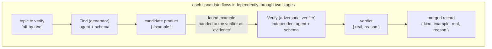
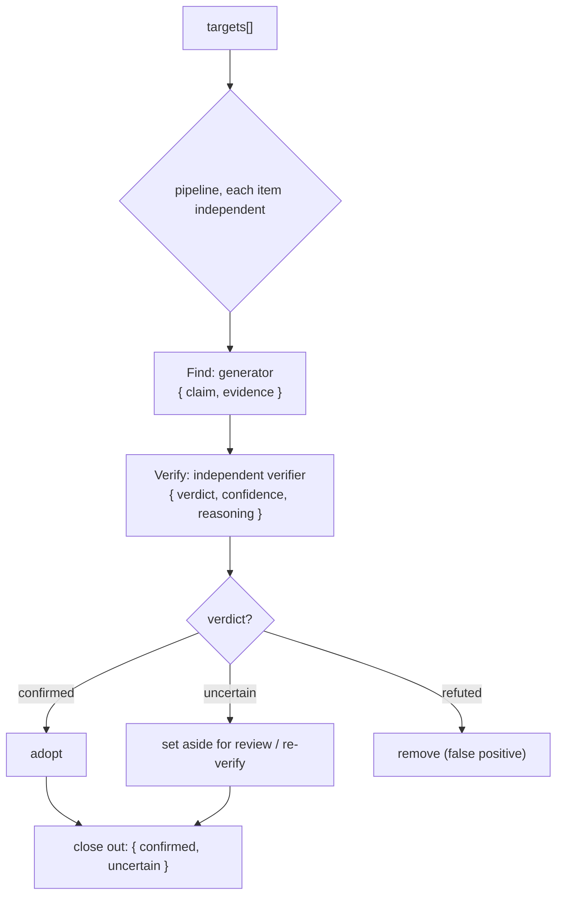

# Chapter 17 · Adversarial Verification

> In one sentence: **have an independent subagent "pick holes" in the previous subagent's product — its task is not to agree but to try its hardest to falsify. Converge that falsification result into a trustworthy verdict with a schema, and you get a self-correcting pipeline.**
>
> This is the first chapter of Advanced Patterns, and the parent of every "quality gate" pattern that follows. Foundations already taught you `agent` / `pipeline` / `schema`; this chapter wires them into a structure that earns its keep in engineering — **separating generation from verification.**

---

## 17.1 Why Adversarial Verification: The Fundamental Flaw of Self-Assessment

Let's start with a pothole everyone has stepped in.

You ask a subagent to "find the bugs in this code," and it hands back three. You offhandedly ask, "are you sure these are all real bugs?" — and it almost always answers "Yes, I confirm these are all genuine issues."

**Here's the catch: ask the same model to grade its own work and it leans hard into confirmation bias.** It just generated these bugs, its context is packed with "this is a bug" arguments, so by the time you ask it to self-examine, its stance is already locked in. It defends itself instead of questioning itself. This isn't about the model "not being smart enough"; the **very task structure of self-assessment** is flawed — assessor and assessed share the same context, the same stance.

The core insight of adversarial verification: **swap the verifier for a brand-new, independent subagent, and tell it flat out that "your job is to falsify."**

- It has an **independent context**: none of the "I just generated this" baggage, just a claim to be checked.
- It has an **adversarial stance**: the prompt tells it point-blank to be a skeptic, hunt for counterexamples, and pick holes, not to agree.
- Its verdict is **structured**: a schema pins "real/false/uncertain" into an enum, rather than a vague paragraph of prose.

Stack those three together and "the model feeling good about itself" becomes "an adversarial contest between two independent perspectives" — and adversarial contest is the oldest, most reliable way to close in on the truth.

<div class="callout info">

**Really, this is Workflow rewriting wisdom the community validated long ago.** Per `_grounding.md` section D, one of the superpowers system's gems is exactly the "two-stage review loop" (spec compliance → code quality, each looping until it passes), oh-my-claudecode leans on "independent reviewer sign-off," and oh-my-openagent uses "VERIFICATION_REMINDER injection for correction." These systems all lean on prompts and Hooks to **simulate** "separating generation from verification." Native Workflow lets you write it straight up as a **deterministic, reusable** structure with `pipeline` + `schema` — which is what this chapter teaches.

</div>

---

## 17.2 The Minimal Adversarial-Verification Skeleton from a Real Run

The fastest way to get adversarial verification is to watch it **actually run.** The `pipeline-demo` from Foundations (Run ID `wf_bf086b98-6ec`, `agent_count=6`) happens to be a minimal adversarial verification: **the Find stage produces a candidate bug, the Verify stage adversarially checks whether it's a real bug.**

```javascript
const items = ['off-by-one', 'null-dereference', 'race-condition']
const out = await pipeline(
  items,
  // Stage 1 Find: generate a candidate
  (kind) =>
    agent(`Give a one-line code example of a ${kind} bug.`, {
      label: `find:${kind}`, phase: 'Find',
      schema: { type: 'object', properties: { example: { type: 'string' } }, required: ['example'] },
    }),
  // Stage 2 Verify: adversarial check
  (found, kind) =>
    agent(
      `Is this genuinely a ${kind} bug? Example: "${found.example}". Reply boolean + short reason.`,
      {
        label: `verify:${kind}`, phase: 'Verify',
        schema: {
          type: 'object',
          properties: { real: { type: 'boolean' }, reason: { type: 'string' } },
          required: ['real', 'reason'],
        },
      }
    ).then((v) => ({ kind, ...found, ...v }))
)
return out.filter(Boolean)
```

Here's what it **actually returned** (source: `assets/transcripts/primitives.md`, excerpt):

```json
[
  {
    "kind": "off-by-one",
    "example": "for i in range(len(arr)): print(arr[i+1])  # off-by-one: ...out of bounds",
    "real": true,
    "reason": "Genuine off-by-one bug... at i=2 it accesses arr[3]=arr[len(arr)], raising IndexError..."
  },
  {
    "kind": "null-dereference",
    "example": "int *p = NULL; *p = 5;",
    "real": true,
    "reason": "...Dereferencing a NULL pointer is undefined behavior and crashes (segfault)..."
  }
]
```

This skeleton already has every element of adversarial verification; let's pull them apart one by one:

**First, the verifier is a brand-new agent.** The Verify stage's `agent()` call and the Find stage are **two entirely independent subagents** — independent context, independent token budget (confirmed by real data: 3 items × 2 stages = `agent_count=6`). Verify doesn't see "the bug I generated"; it sees "a claim to be checked, `found.example`."

**Second, the verifier is told to judge, not to restate.** The prompt asks "Is this genuinely a ... bug?" — a yes/no question that forces it to take a stance.

**Third, the verdict is converged by a schema.** `real: boolean` is a **gate field**: it pins "is this a real bug" from a possibly vague sentence down to a `true`/`false`. The orchestration script can then `filter` on it — and that's the key to making "separating generation from verification" land as a deterministic process.



<div class="callout tip">

**Notice how neatly `pipeline` fits here**: per `_grounding.md`, pipeline has **no barrier** between stages — while one candidate is still at Verify, another may still be at Find. Adversarial verification is a natural fit for pipeline, because "generate → verify" is a natural two-stage chain, and you often run that chain in parallel over **multiple** candidates. Wall clock is about "the slowest single Find→Verify chain," not the sum of all Finds plus the sum of all Verifies.

</div>

---

## 17.3 Upgrading the Verdict: From boolean to a Three-State Enum

`real: boolean` is fine for the simplest scenarios, but production-grade adversarial verification often needs **three states**, because beyond "yes" and "no," the real world is full of "not enough evidence, can't decide" cases. Force the verifier to pick one of two on incomplete information and it just guesses blindly — which runs straight against adversarial verification's whole point of "rigor."

Upgrade the verdict to three states with `enum`:

```javascript
// (illustrative, not run) — three-state verdict schema: the standard form of adversarial verification
const verdictSchema = {
  type: 'object',
  properties: {
    verdict: {
      type: 'string',
      enum: ['confirmed', 'refuted', 'uncertain'],
      description:
        'confirmed=sufficient evidence, truly an issue; refuted=confirmed false positive, give a counterexample or reason; ' +
        'uncertain=current evidence insufficient to decide, needs more information',
    },
    confidence: {
      type: 'number',
      description: 'a decimal from 0 to 1, your degree of certainty in this verdict',
    },
    reasoning: {
      type: 'string',
      description: 'one sentence giving the key rationale or counterexample; if refuted, must point out why it doesn\'t hold',
    },
  },
  required: ['verdict', 'confidence', 'reasoning'],
}
```

Each of the three fields pulls its own weight:

| Field | Type | Role |
|---|---|---|
| `verdict` | three-state enum | The core verdict, pinned values, what downstream routes its state machine on |
| `confidence` | number | Degree of certainty, handy for "re-verifying low-confidence ones" or weighting |
| `reasoning` | string | Makes the verdict auditable — especially `refuted` must give a counterexample, forcing the verifier to actually think |

`enum` is the lifeline here. Recall `_grounding.md`: schema gets validated at the tool-call layer, and an `enum`-limited field triggers a retry the moment it falls outside the value set. So downstream you can write this with **total confidence**:

```javascript
// (illustrative, not run) — route on the three-state verdict
const confirmed = results.filter((r) => r.verdict === 'confirmed')
const needsReview = results.filter((r) => r.verdict === 'uncertain')
// refuted ones are discarded directly, no longer polluting downstream
```

No need to fret over whether the model came back with `'Confirmed'`, a localized word, or `'I think it is confirmed'` — the runtime guarantees it'll only be one of those three values. **Enum turns adversarial verification's output into a reliable state-machine transition.**

---

## 17.4 Writing the Adversary's Prompt: How to "Force" Out Skepticism

The other half of whether adversarial verification works isn't in the schema, but in **the verifier's prompt.** The schema guarantees the verdict's structure is right, but "whether the verifier is actually being adversarial" comes down to how you set its role.

A common way this fails is a too-gentle prompt: "Please check whether this finding is correct" — the model just nods politely. To force out a real contest, the prompt needs to do three things:

**One, hand it an adversarial role.** Tell it flat out that "you are a skeptic / red team / hole-picker," and its success criterion is "find where this claim doesn't hold up."

**Two, demand evidence, not a stance.** Don't just ask "is it right"; require that "if you think it's a false positive, you must give a counterexample or specific reason." The burden of proof forces the model to actually deliberate instead of voting on a hunch.

**Three, give it the raw evidence, not the original author's reasoning.** Hand it only "the conclusion to be verified + the necessary raw material," and do **not** feed it the generator's "why I think this is a bug" reasoning — otherwise the verifier gets pulled along by the original author's train of thought, and the adversarial edge is gone.

```javascript
// (illustrative, not run) — an adversarial verifier prompt
const verify = (claim, evidence) =>
  agent(
    'You are a strict code-review red-team member. Your duty is not to agree but to try your hardest to **falsify** the claim below.\n' +
    'Only when you cannot find any counterexample and the evidence is conclusive should you rule confirmed.\n' +
    'If you can construct a counterexample, or the claim depends on an unproven assumption, rule refuted and explain.\n' +
    'If the current evidence is insufficient to decide, rule uncertain — do not guess.\n\n' +
    `Claim to verify: ${claim}\n` +
    `Relevant code evidence:\n${evidence}`,
    { schema: verdictSchema, label: 'adversary' }
  )
```

Note that the generator's reasoning is **not** passed in here — `claim` is the conclusion, `evidence` is the raw code, and the verifier must judge it **fresh, on its own.**

<div class="callout warn">

**Adversarial isn't the same as contrarian.** A common over-correction is tuning the verifier so suspicious that it rules even real bugs as refuted (false negatives). The key to balance is `confidence` and `reasoning`: require that when it rules refuted, it **must give a concrete counterexample.** If it can't produce a counterexample and just "feels off," then it should really rule `uncertain`. Let the burden of proof rein in how hard it pushes, so it doesn't slide from "confirmation bias" into "denial bias."

</div>

---

## 17.5 The Complete Skeleton: Generate → Adversarial Verify → Close Out

Put the preceding sections together and you get a production-ready adversarial-verification pipeline. It takes a set of items to review, and each one runs independently through "generate a candidate finding → an independent verifier falsifies → close out on the verdict."

```javascript
// (illustrative, not run) — complete adversarial-verification pipeline
export const meta = {
  name: 'adversarial-review',
  description: 'Generate a finding for each target, then an independent verifier adversarially checks, keeping only confirmed items',
  phases: [
    { title: 'Find', detail: 'Generate candidate findings' },
    { title: 'Verify', detail: 'An independent verifier falsifies' },
  ],
}

const verdictSchema = {
  type: 'object',
  properties: {
    verdict: { type: 'string', enum: ['confirmed', 'refuted', 'uncertain'] },
    confidence: { type: 'number' },
    reasoning: { type: 'string' },
  },
  required: ['verdict', 'confidence', 'reasoning'],
}

const targets = args.targets // the list of review targets passed in by the caller

const reviewed = await pipeline(
  targets,
  // Stage 1: generator
  (target) =>
    agent(
      `Review the target "${target}", find the single most suspicious issue, give claim (conclusion) and evidence (supporting evidence).`,
      {
        label: `find:${target}`, phase: 'Find',
        schema: {
          type: 'object',
          properties: { claim: { type: 'string' }, evidence: { type: 'string' } },
          required: ['claim', 'evidence'],
        },
      }
    ),
  // Stage 2: independent adversarial verifier
  (found, target) =>
    agent(
      'You are a strict red-team reviewer; your duty is to falsify the following claim. If you can give a counterexample, rule refuted; ' +
      'only when the evidence is conclusive and irrefutable rule confirmed; if evidence is insufficient rule uncertain.\n' +
      `Claim: ${found.claim}\nEvidence: ${found.evidence}`,
      { label: `verify:${target}`, phase: 'Verify', schema: verdictSchema }
    ).then((v) => ({ target, ...found, ...v }))
)

// Close out: filter out skipped nulls, classify by verdict
const valid = reviewed.filter(Boolean)
const confirmed = valid.filter((r) => r.verdict === 'confirmed')
const uncertain = valid.filter((r) => r.verdict === 'uncertain')
log(`Confirmed ${confirmed.length}, uncertain ${uncertain.length}, removed ${valid.length - confirmed.length - uncertain.length} false positives`)
return { confirmed, uncertain }
```

A few engineering details worth calling out:

- **`.filter(Boolean)` can't be skipped.** Per `_grounding.md`, the user skipping an agent midway makes that call return `null`; a pipeline stage throwing also turns that item into `null`. Filter them out before you consume them.
- **`phase` marked explicitly.** Inside the pipeline, pass `phase: 'Find'` / `'Verify'` to each `agent()` so they don't race the global `phase()`, which keeps the progress tree cleanly grouped. This is the approach `_grounding.md` explicitly recommends.
- **Three-state close-out.** `confirmed` is adopted directly, `refuted` thrown out, `uncertain` set aside on its own — handed to a human for review or sent into re-verification (see next section).



---

## 17.6 Advanced: Multi-Verifier Voting and Confidence Weighting

A single verifier already beats self-assessment by a mile, but it's still **one** perspective. When a verdict's cost runs high (say, deciding whether to block a release), you can have **multiple independent verifiers** each cast a vote, then aggregate with code — upgrading from "adversarial contest" to a "jury."

The mechanism is simple: for the same claim, fan out N verifiers with `parallel`, each judging on its own, then take a majority vote.

```javascript
// (illustrative, not run) — multi-verifier voting
const jurors = await parallel(
  [0, 1, 2].map((i) => () =>
    agent(
      // Use the index i to nudge perspectives, avoiding full homogeneity (echoing "forbid Math.random, use index to create variation")
      `You are independent reviewer #${i + 1}; falsify the following claim from the angle of ${['exploitability', 'blast radius', 'reproduction difficulty'][i]}.\n` +
      `Claim: ${claim}\nEvidence: ${evidence}`,
      { label: `juror:${i}`, schema: verdictSchema }
    )
  )
)

const votes = jurors.filter(Boolean)
const confirmedVotes = votes.filter((v) => v.verdict === 'confirmed').length
// A majority confirming counts as confirmed; confidence can be averaged
const finalVerdict = confirmedVotes > votes.length / 2 ? 'confirmed' : 'refuted'
const avgConfidence = votes.reduce((s, v) => s + v.confidence, 0) / votes.length
```

<div class="callout tip">

**The recommended reusable default rule: default to `refuted` unless a majority of the independent jurors (e.g., at least 2 of 3) vote `confirmed`.** Put differently, a finding **survives only when a majority of jurors affirmatively confirm it**; ties or "insufficient evidence" all default to refuted. That `confirmedVotes > votes.length / 2` line above is precisely this rule in code — 3 votes need ≥2, 5 votes need ≥3 to count as `confirmed`, otherwise it closes out as `refuted`. Make it your default close-out posture for adversarial verification: **the burden of proof is on the "confirm" side; silence and disagreement both fall toward refuted.** This lines up with §17.3's stance that "`uncertain` is not adopted as `confirmed`" — uncertain does not mean pass.

</div>

Two details here echo the book-wide hard constraints:

**Use `index` to create perspective variation, not randomness.** Per `_grounding.md`, scripts forbid `Math.random()` (it breaks replayability → resume fails). To keep multiple verifiers from coming out identical, the right move is to **vary the prompt using the index `i`** — e.g., have juror 0 look at exploitability and juror 1 at blast radius. That gives you diversity and keeps determinism intact.

**`parallel` is a barrier, aggregating only after all votes are in.** This is exactly what the voting scenario needs — you have to have every ballot before you can tally. The cost is that tokens grow linearly with jury size: for reference, 3 concurrent agents run about `78844` tokens (`wf_52957913-6d2`), roughly 3× a single agent. More verifiers buy more reliability but cost more too — let the verdict's cost decide the jury's size.

<div class="callout tip">

**This is where Chapter 14, "Judge Panel," ties into this chapter.** The judge panel points this "multiple independent assessors + vote aggregation" pattern at A/B option evaluation; this chapter points it at truth-or-falsehood calls. Both rest on the same underlying structure: **independent perspectives + structured verdict + code aggregation.** Once you've got adversarial verification down, the judge panel is just a swap of the assessment object.

</div>

---

## 17.7 Anti-Patterns: Several Postures of Misusing Adversarial Verification

Finally, a few common mistakes that make adversarial verification "look the part but miss the spirit":

| Anti-pattern | Problem | Correct approach |
|---|---|---|
| Verifier and generator share context | Degenerates into self-assessment, confirmation bias | The verifier must be an independent `agent()` call, given only the conclusion + raw evidence |
| Feeding the generator's reasoning to the verifier | The verifier gets pulled along, loses its independence | Pass only claim + evidence, let the verifier judge fresh |
| Too-gentle verifier prompt | The model just nods politely, no real contest | Hand it a red-team role + burden of proof (refuted must give a counterexample) |
| Verdict in free text | Can't route reliably, back to parsing hell | Use `enum` three states + `required` to pin the verdict |
| Running a jury for every tiny product | Token explosion, not worth it | Single verifier as the default; only high-cost verdicts get multi-voting |
| Forgetting `.filter(Boolean)` | Skipped/errored `null`s crash the close-out | Always filter nulls before consuming the verdict |

<div class="callout warn">

**Adversarial verification isn't free — it at least doubles the agent count.** A "generate + verify" pipeline runs 2× the agent count of pure generation (real confirmation: pipeline-demo 3 items two stages = 6 agents, `158982` tokens). Stack a jury on top and it's several times that. So spend adversarial verification where the **cost of judging wrong is high**: deciding whether to merge, whether to release, whether to report a security vulnerability. For low-risk products "just for reference," a single generation may be enough. Match the strength of verification to the cost of judging wrong.

</div>

---

## 17.8 Chapter Summary

- **Adversarial verification = separating generation from verification.** Send an **independent** subagent in to falsify the previous stage's product, sidestepping the confirmation bias of "the same model grading itself."
- The minimal skeleton is the real `pipeline-demo` (Run `wf_bf086b98-6ec`): the Find stage generates a candidate, the Verify stage uses an independent agent to adversarially check, and `real: boolean` gates the close-out.
- A production-grade verdict uses an **`enum` three states** (`confirmed` / `refuted` / `uncertain`) + `confidence` + `reasoning`, turning the verdict into a reliable state-machine transition; `refuted` must give a counterexample.
- Three essentials of the adversary's prompt: **hand it a red-team role, demand evidence, give only the conclusion + raw evidence** (not the original author's reasoning).
- High-cost verdicts can be upgraded to **multi-verifier voting** (`parallel` barrier aggregation), using the **index** (not `Math.random`) to create perspective variation while keeping replayability.
- Stay cost-aware: adversarial verification at least doubles the agent count (tokens double right along with it); match the verification strength to the cost of judging wrong.

In the next chapter, we push "verification" from "judging true or false" to "judging complete" — how to use a loop to make the pipeline **generate-critique over and over** until a completeness agent rules "nothing new can be squeezed out anymore."

> Continue reading: [Chapter 18 · Loop-Until-Dry & Completeness](#/en/p4-18)

---

[← Back to main README](../../README.md) · [中文 README →](../../README.md)
