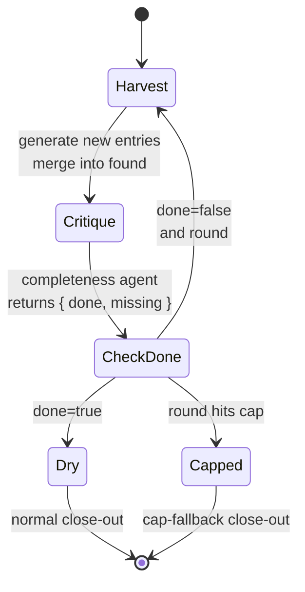

# Chapter 18 · Loop-Until-Dry & Completeness

> In one sentence: **use an ordinary JavaScript `while` loop to repeatedly "generate → ask 'any omissions?'" until a completeness agent rules "nothing new can be squeezed out anymore" — this is "loop-until-dry."**
>
> The last chapter solved "is the product **right**" (adversarial verification); this chapter solves "is the product **complete**" (completeness). The two are orthogonal axes of the quality gate: one checks truth, one checks coverage.

---

## 18.1 The Ceiling of Single-Shot Generation: The Model "Stops Early"

First, a real and universal phenomenon.

You ask a subagent to "list all the security hazards in this module," and it gives you 5, then stops. Are there really only 5? Often not — the model tends to stop after giving "a set of seemingly reasonable answers," because to it, "list a few" is already "done." It won't proactively ask itself "did I miss anything."

This is the ceiling of a single `agent()` call: **its output is one-shot, with no 'think again' mechanism.** You can write "please be as thorough as possible, list them all" in the prompt, which raises the count somewhat, but it's still a one-and-done — the model stops at a point it itself considers "enough," and that point is almost always earlier than "truly exhaustive."

The idea of "loop-until-dry" is to turn "think again" **from a plea in the prompt into a loop in code**:

1. Generate a batch of results.
2. Take "the existing results" and ask: **any omissions?**
3. If yes, merge the new findings and go back to step 2.
4. If "no more" — **dry** — exit the loop.

Each round, the model sees "the N already found" and is explicitly asked to "find new things **not yet mentioned**." This "existing list" forces it past its own comfortable stopping point, squeezing out the remaining things round by round, until it's truly dry.

<div class="callout info">

**This is a pattern the community systems repeatedly validated.** Per `_grounding.md` section D: one of superpowers' gems is "a two-stage review loop, each looping until it passes"; oh-my-claudecode's signature is "the `Stop` hook persistent loop — boulder never stops, making 'whether stopping is allowed' programmable." They both use Hooks and state files to **simulate** "won't quit until complete." Native Workflow lets you write the same logic as a **deterministic, self-braking** structure with a `while` loop + a schema-shaped "completeness verdict." This chapter teaches that.

</div>

---

## 18.2 The Core Structure: while Loop + Completeness Gate

The skeleton of "loop-until-dry" is essentially a `while` loop driven by "the boolean verdict of a completeness agent." First the minimal form:

```javascript
// (illustrative, not run) — the core skeleton of loop-until-dry
phase('Harvest')
let found = []          // accumulate all discovered entries
let done = false        // completeness gate
let round = 0

while (!done && round < 6) {   // 6 is a hard runaway cap, see 18.3
  round++

  // 1) Generate: find new entries "not yet mentioned"
  const fresh = await agent(
    `Goal: list all security hazards in this module.\n` +
    `Already found (don't repeat):\n${found.map((f) => '- ' + f.title).join('\n') || '(none yet)'}\n` +
    `Please give only **new, unmentioned** hazards.`,
    {
      label: `harvest:round-${round}`, phase: 'Harvest',
      schema: {
        type: 'object',
        properties: {
          items: {
            type: 'array',
            items: {
              type: 'object',
              properties: { title: { type: 'string' }, detail: { type: 'string' } },
              required: ['title', 'detail'],
            },
          },
        },
        required: ['items'],
      },
    }
  )

  found.push(...fresh.items)

  // 2) Completeness critique: any omissions?
  const critique = await agent(
    `List of hazards found:\n${found.map((f) => '- ' + f.title).join('\n')}\n` +
    `You are a completeness reviewer. Judge whether this list has exhausted the module's security hazards.\n` +
    `If you can point out any **still-omitted** direction, then done=false and list them in missing;\n` +
    `if you're sure nothing is omitted, then done=true.`,
    {
      label: `completeness:round-${round}`, phase: 'Harvest',
      schema: {
        type: 'object',
        properties: {
          done: { type: 'boolean' },
          missing: { type: 'array', items: { type: 'string' } },
        },
        required: ['done', 'missing'],
      },
    }
  )

  done = critique.done   // the boolean gate drives the loop
  if (!done) log(`Still omissions after round ${round}: ${critique.missing.join(', ')}`)
}

log(`Loop-until-dry: ${round} rounds, ${found.length} entries total`)
return found
```

This skeleton has three key roles, corresponding to the three things Advanced Patterns will fully explain:

**Role 1: the generator (Harvest agent).** Each round it receives "the list already found" and is asked to produce only **new** entries. Its schema is an array (`items`), each item structured — exactly Chapter 07's "array pattern" applied.

**Role 2: the completeness critic (Completeness agent).** It does **not** generate new content; it does one thing: judge "is it enough." The core of its schema is the **gate field** `done: boolean` — `while (!done)` reads it directly to decide whether to continue.

**Role 3: the loop itself (JS while).** This is the essence of Workflow — **control flow is real JavaScript.** `while`, the `round` counter, `found.push(...)` are all ordinary code. The model handles "judgment," the code handles "orchestration," each with clear responsibility.



<div class="callout tip">

**Why split "generate" and "judge completeness" into two agents?** The same agent both generating and self-assessing "is it enough" returns to the self-assessment trap from Chapter 17 — having just generated, it tends to say "enough." Splitting out an independent completeness critic (independent context, the explicit "find omissions" duty) makes the verdict trustworthy. **This is the same source as adversarial verification: separate the assessor from the assessed.**

</div>

---

## 18.3 The Brake: A Loop Must Be Bounded — This Is Discipline, Not Optional

In the previous section's skeleton, the `while` condition is `!done && round < 6` — that `round < 6` isn't decoration, it's the **seatbelt.**

The biggest risk of "loop-until-dry" is an **infinite loop**: if the completeness agent forever rules `done=false` (it can always "make up" a seemingly omitted direction), the loop never exits. And every round of Workflow genuinely burns tokens and wall clock; a runaway loop quickly exhausts the budget.

Preventing runaway must be **multi-layered defense**:

**Layer 1: a hard round cap.** `round < N` (e.g., 6). No matter what the completeness agent says, it stops at the cap. This is the simplest and most reliable brake.

**Layer 2: budget fallback.** Per `_grounding.md`, `budget` is a **hard cap** — calling `agent()` after `spent()` reaches `total` throws. So even if you forget to set a round cap, exhausting the budget forcibly aborts. The more proactive approach is to check `budget.remaining()` in the loop:

```javascript
// (illustrative, not run) — actively brake with budget.remaining()
while (!done && round < 6) {
  // estimate per-round cost at about 50k tokens (generate+critique, two agents); if short, stop early
  if (budget.total !== null && budget.remaining() < 50_000) {
    log(`Not enough budget for another round (remaining ${budget.remaining()}), closing out early`)
    break
  }
  round++
  // ... generate + critique
}
```

**Layer 3: diminishing-returns detection.** If two consecutive rounds add 0 entries (or near 0), then even if the completeness agent stubbornly claims there are still omissions, you can proactively exit — because the generator can no longer squeeze anything out:

```javascript
// (illustrative, not run) — diminishing returns: stop on consecutive empty rounds
let emptyStreak = 0
while (!done && round < 6) {
  round++
  const fresh = await agent(/* ... */)
  if (fresh.items.length === 0) {
    emptyStreak++
    if (emptyStreak >= 2) { log('Two consecutive rounds with no additions, judged dry'); break }
  } else {
    emptyStreak = 0
    found.push(...fresh.items)
  }
  // ... completeness critique
}
```

<div class="callout warn">

**Never write an unbounded loop that exits only on the model's verdict.** The model's "done" is a probabilistic judgment, and it may withhold done because it "wants to appear thorough." `_grounding.md` also gives a global fallback: the total agent count per workflow lifecycle is capped at **1000** — this is the last safety net, but you should **never** rely on it to terminate a business loop. The correct discipline: **every loop explicitly writes out its exit conditions (round cap + diminishing returns), treating budget as the last line of defense, not the only one.**

</div>

---

## 18.4 Two Forms of Completeness Critique: Divergent vs. Convergent

"Completeness" means different things in different tasks, corresponding to two loop forms.

### Form 1: divergent — "can we find more?"

This is the form from 18.2: the goal is to **exhaust an open set** (all bugs, all hazards, all edge cases). The completeness agent's duty is to "point out which **directions** are not yet covered." The exit condition is "can no longer find new directions."

Typical scenarios: Bug Hunter (Chapter 15), security-hazard scanning, test-case enumeration. Such tasks have **no pre-known 'full set'**, and can only approach completeness by repeated probing.

### Form 2: convergent — "has this list all been checked?"

Another kind of "complete" is **checking off a known list item by item**: e.g., "for every requirement in this spec, has the code implemented it?" Here the full set is known (the spec items), and the completeness agent's duty is to **tick each off**, finding unmet ones.

```javascript
// (illustrative, not run) — convergent: check off a known list item by item
const checklist = args.requirements   // the known requirements list
const review = await agent(
  `Check item by item whether the following requirements are met in the implementation:\n${checklist.map((r, i) => `${i + 1}. ${r}`).join('\n')}\n` +
  `For each, give a satisfied boolean and evidence.`,
  {
    schema: {
      type: 'object',
      properties: {
        items: {
          type: 'array',
          items: {
            type: 'object',
            properties: {
              requirement: { type: 'string' },
              satisfied: { type: 'boolean' },
              evidence: { type: 'string' },
            },
            required: ['requirement', 'satisfied', 'evidence'],
          },
        },
      },
      required: ['items'],
    },
  }
)
const unmet = review.items.filter((i) => !i.satisfied)
// unmet non-empty → enter the fix loop; empty → dry
```

The convergent form often doesn't need a `while` to repeatedly squeeze, but a "check → fix unmet items → re-check" loop, until `unmet` is empty. **This is exactly the structure of superpowers' "spec compliance loop"** (`_grounding.md` section D).

| | Divergent | Convergent |
|---|---|---|
| Full set | Unknown, open | Known (spec/list) |
| Completeness agent's duty | Point out omitted **directions** | **Tick** each off to find unmet |
| Exit condition | Can't find new directions (dry) | Unmet items cleared |
| Typical scenario | Bug Hunter, hazard enumeration | Spec compliance, migration check |

<div class="callout tip">

**The two forms can be chained.** A real quality gate is often: first **divergently** find all problems dry (loop-until-dry), then **adversarially verify** each problem (Chapter 17) for truth, finally **convergently** check "have all confirmed problems been fixed." The three combined make a pipeline that can both self-correct and self-prove completeness.

</div>

---

## 18.5 The Production Skeleton: Harvest → Dedup → Verify → Close Out

Combine divergent harvesting with dedup and verification, and you get a production-usable complete skeleton. Note that loop-until-dry produces **duplicate or near-duplicate** entries (generators in different rounds may mention the same problem from different angles), so dedup is needed before close-out.

```javascript
// (illustrative, not run) — complete production skeleton
export const meta = {
  name: 'loop-until-dry-review',
  description: 'Repeatedly squeeze out problems until the completeness agent rules dry, dedup, then verify item by item, close out',
  phases: [{ title: 'Harvest', detail: 'loop until dry' }, { title: 'Verify', detail: 'check item by item' }],
}

const MAX_ROUNDS = 6
let found = []
let done = false
let round = 0
let emptyStreak = 0

phase('Harvest')
while (!done && round < MAX_ROUNDS) {
  round++
  if (budget.total !== null && budget.remaining() < 60_000) {
    log(`Budget critical, closing out early`); break
  }

  const fresh = await agent(
    `Goal: ${args.goal}\nAlready found (don't repeat):\n` +
    `${found.map((f) => '- ' + f.title).join('\n') || '(none yet)'}\nGive only new entries.`,
    {
      label: `harvest:${round}`, phase: 'Harvest',
      schema: {
        type: 'object',
        properties: {
          items: {
            type: 'array',
            items: {
              type: 'object',
              properties: { title: { type: 'string' }, detail: { type: 'string' } },
              required: ['title', 'detail'],
            },
          },
        },
        required: ['items'],
      },
    }
  )

  if (fresh.items.length === 0) {
    if (++emptyStreak >= 2) { log('Two consecutive rounds with no additions, dry'); break }
  } else {
    emptyStreak = 0
    found.push(...fresh.items)
  }

  const critique = await agent(
    `Already found:\n${found.map((f) => '- ' + f.title).join('\n')}\n` +
    `You are a completeness reviewer; if sure nothing is omitted then done=true, otherwise done=false and list missing.`,
    {
      label: `completeness:${round}`, phase: 'Harvest',
      schema: {
        type: 'object',
        properties: { done: { type: 'boolean' }, missing: { type: 'array', items: { type: 'string' } } },
        required: ['done', 'missing'],
      },
    }
  )
  done = critique.done
}

// Dedup: use a normalized title (lowercase, collapsed spaces) as the key
const seen = new Set()
const unique = found.filter((f) => {
  const key = f.title.toLowerCase().replace(/\s+/g, ' ').trim()
  if (seen.has(key)) return false
  seen.add(key)
  return true
})
log(`Harvest ended: ${round} rounds, ${found.length} raw, ${unique.length} after dedup`)

// Adversarially verify item by item (reusing Chapter 17's verdictSchema idea)
phase('Verify')
const verified = await pipeline(
  unique,
  (item) =>
    agent(
      `Falsify the following claim; if you can give a counterexample rule refuted, if evidence is conclusive rule confirmed, if insufficient rule uncertain.\n` +
      `Claim: ${item.title}\nDetail: ${item.detail}`,
      {
        label: `verify:${item.title.slice(0, 20)}`, phase: 'Verify',
        schema: {
          type: 'object',
          properties: {
            verdict: { type: 'string', enum: ['confirmed', 'refuted', 'uncertain'] },
            reasoning: { type: 'string' },
          },
          required: ['verdict', 'reasoning'],
        },
      }
    ).then((v) => ({ ...item, ...v }))
)

const confirmed = verified.filter(Boolean).filter((v) => v.verdict === 'confirmed')
return { rounds: round, total: unique.length, confirmed }
```

This skeleton twists the first two chapters of Advanced Patterns into one rope: **loop-until-dry** (this chapter) guarantees "find all," **adversarial verification** (Chapter 17) guarantees "find right," with ordinary JS for **dedup** in between. Each does its job.

<div class="callout warn">

**Why must dedup be done with code, not another agent?** Because dedup is a **deterministic** operation — the same input necessarily produces the same output. Using `Set` + a normalized key is zero-cost, replayable, and unambiguous. Whereas spinning up another agent to "dedup for me" not only burns extra tokens but introduces nondeterminism (the model may miss or mis-judge duplicates). **Anything doable with deterministic code (dedup, count, filter, sort, aggregate) should not be handed to an agent** — this is the core discipline of Workflow's "code orchestrates, model judges" division.

</div>

---

## 18.6 Anti-Patterns and Best Practices, Quick Reference

| Anti-pattern | Consequence | Correct approach |
|---|---|---|
| Unbounded `while` (exit only on model done) | Infinite loop, burns the budget | Always add a round cap + diminishing returns + budget fallback |
| Generator doesn't know "what's already found" | Repeatedly produces duplicate entries | Inject the existing list into the prompt each round, ask for only new ones |
| Same agent both generates and judges completeness | Confirmation bias, premature done | The completeness critic must be an independent agent |
| Using an agent for dedup/count | Wastes tokens + nondeterministic | Use JS (Set/filter/reduce) for deterministic operations |
| Completeness verdict in free text | Can't drive the while | `done: boolean` gate field + `required` |
| Treating budget as the only brake | Exit timing uncontrollable, bad UX | Budget is the last line; business exit relies on explicit conditions |
| Regenerating everything in full each round | Tokens grow quadratically with rounds | Produce only the **increment** each round, accumulate in a JS array |

<div class="callout info">

**Cost intuition**: loop-until-dry's token cost is about "rounds × per round (generate + critique, two agents)." With a real single agent ≈ 26k tokens (hello `wf_dacbd480-d5d`), one round is about 50k, and 4 rounds about 200k tokens — comparable to the real pipeline-demo's `158982` magnitude. So the round cap is not only a runaway guard but also a **cost gate**: set it at the round count where "marginal returns are already low" (empirically, 3–6 rounds suffice for the vast majority of divergent tasks).

</div>

---

## 18.7 Chapter Summary

- **Loop-until-dry = use a JS `while` to repeatedly "generate increment → completeness critique," until ruled dry.** It breaks past the "stops early" ceiling of a single `agent()`, turning "think again" from a prompt plea into a code loop.
- The three-role division: the **generator** (produces new entries each round, array schema), the **completeness critic** (independent agent, `done: boolean` gate), and the **loop itself** (real JS while + counter).
- **The brake is discipline**: must be multi-layered — a hard round cap, diminishing returns (consecutive empty rounds), `budget.remaining()` fallback. Never write an unbounded loop that exits only on the model's verdict (the global 1000-agent cap is a safety net, not a business-exit mechanism).
- Two forms: **divergent** (exhaust an unknown open set, find omitted directions) and **convergent** (check off a known list item by item, find unmet items, corresponding to the spec-compliance loop); they can be chained.
- The production skeleton twists three chapters into one rope: **loop-until-dry** guarantees finding all, **adversarial verification** guarantees finding right, **JS dedup** guarantees no duplicates — deterministic operations go to code, judgment goes to agents.

In the next chapter, we tackle a problem unavoidable when writing files in parallel: when multiple agents must modify code at once, how to keep them from trampling each other — `isolation: 'worktree'`.

> Continue reading: [Chapter 19 · Worktree Isolation](#/en/p4-19)
