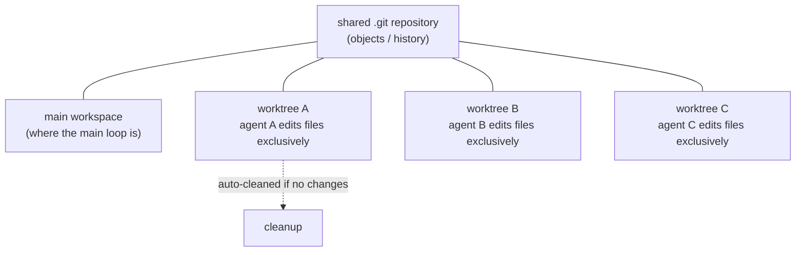
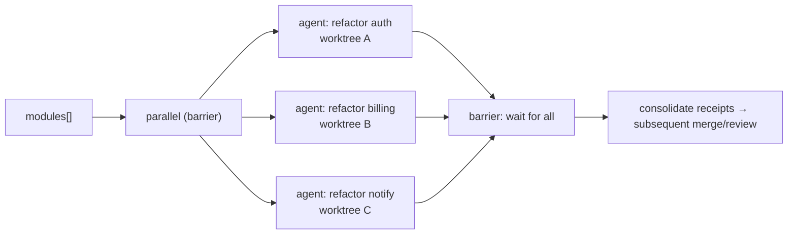

# Chapter 19 · Worktree Isolation

> In one sentence: **when multiple agents must modify the same code at once, give each its own independent git worktree — `opts.isolation: 'worktree'` — so they don't trample each other in physically isolated workspaces.**
>
> This is one of the few chapters in Advanced Patterns that directly touches "side effects." The earlier agents mostly "read and think" (review, research, judge); the moment agents start **writing files in parallel**, races appear. Worktree isolation is Workflow's answer.

---

## 19.1 The Problem: The Race of Writing Files in Parallel

Recall a fact: per `_grounding.md`, `parallel()` and `pipeline()` can make multiple agents genuinely run concurrently (real confirmation: 3 agents concurrent in about 8.4 seconds, `wf_52957913-6d2`). When these agents merely "read code and produce structured findings," concurrency is no problem at all — they don't interfere, each returning data.

But imagine a different task: **have 5 agents each refactor a module in parallel.** Each agent must edit files with Write/Edit. Now the problem appears:

- Agent A is editing line 10 of `utils.js` while agent B is editing line 50 of `utils.js` at the same time — they see the same version of the same file, each edits it, and **the later write overwrites the earlier**, or produces a mixed state no one expected.
- Even if they edit different files, git's staging area and index are **shared** — concurrent git operations interfere with each other.
- A half-finished product left by an agent that failed midway pollutes the workspace the other agents see.

This is the **race** of parallel writing: multiple execution bodies share the same mutable state (workspace files + git index), and without isolation they corrupt each other.

Before Workflow, community systems went around this pothole various ways. Per `_grounding.md` section D, ccg-workflow uses "file ownership + Layer-based parallelism" — i.e., **conventionally** each agent touches only the files of its own layer, avoiding conflicts by discipline. This works but is fragile: the moment the convention is broken, the race returns.

Worktree isolation provides **physical** isolation, not **conventional** isolation.

---

## 19.2 What git worktree Is: One Tree, Multiple Workspaces

To understand `isolation: 'worktree'`, you must first understand the underlying mechanism, git worktree.

When you use git normally, one repository corresponds to one working directory (working tree) — whichever branch you check out, the working directory is that branch's content. `git worktree` allows **the same repository** to have **multiple** working directories at once, each mounted at a different path and able to check out a different branch or commit:

```bash
# The native usage of git worktree (for background only)
git worktree add ../feature-x feature-x   # mount an independent workspace at ../feature-x
```

The key: these workspaces **share the same `.git` repository underneath** (objects, commit history), but **each has its own independent working-directory files and index.** So you can edit and commit freely in `../feature-x` without affecting the main working directory at all.

Apply this mechanism to Workflow: when an `agent()` carries `isolation: 'worktree'`, the runtime **opens a separate git worktree** for it, and all of this agent's file changes happen in that isolated workspace. Multiple such agents running in parallel are multiple isolated workspaces in parallel — **physically impossible to overwrite each other.**



<div class="callout info">

**Official semantics (per `_grounding.md` section B, agent opts)**: `opts.isolation: 'worktree'` makes the agent "run in an independent git worktree," and explicitly marks two properties — **expensive** (use only when parallel file edits would collide), and **auto-cleaned if no changes** (if the agent ultimately produces no file changes, the corresponding worktree is automatically reclaimed). The finer runtime mechanics in this chapter — "how to merge worktree changes," "the worktree path" — are not given by the sources, marked "(to be verified)," not speculated.

</div>

---

## 19.3 When to Use It, When Not To

`isolation: 'worktree'` is officially marked **expensive**, so it isn't a default option but **a specific tool for a specific problem.** There's only one judgment criterion:

> **Will multiple agents concurrently modify the same working tree?** Yes → use worktree isolation; No → don't.

Expand it into a decision table:

| Scenario | Agent behavior | Need worktree? | Reason |
|---|---|---|---|
| Parallel code review | Read-only, produce structured findings | **No** | No writes, no race |
| Parallel research / multi-dimension analysis | Read-only, return data | **No** | No writes, no race |
| Adversarial verification / judge panel | Read-only + judgment | **No** | No writes, no race |
| Multiple agents refactoring different modules in parallel | Each Write/Edit | **Yes** | Concurrent writes, must isolate |
| Multiple agents each trying a different solution to the same problem | Each edits the same set of files | **Yes** | Edit the same tree, must collide |
| A serial single agent editing files | One write at a time | **No** | No concurrency, no race |

<div class="callout warn">

**The vast majority of Workflows don't need worktree isolation.** All the earlier real runs in this book (hello / parallel / pipeline) have agents that "read + produce structured data," and **not one** needs isolation. This is because Workflow's most common, most cost-effective usage is "fan out a crowd of agents to read and think in parallel, and consolidate the structured results back" — such tasks are naturally side-effect-free. Only when you genuinely need multiple agents to **concurrently edit files** do you pay the worktree cost. Treat it as "the heavy weapon to deploy last," not "fire it up the moment you go parallel."

</div>

---

## 19.4 The Typical Pattern: Parallel Refactor + Isolation

Look at worktree isolation's most typical use: have a group of agents each refactor a module in an isolated workspace, without interfering with each other.

```javascript
// (illustrative, not run) — parallel refactor, one isolated worktree per agent
export const meta = {
  name: 'parallel-refactor',
  description: 'Multiple modules refactored in parallel, each agent editing files in an independent git worktree without conflict',
  phases: [{ title: 'Refactor', detail: 'parallel refactor within isolated workspaces' }],
}

phase('Refactor')
const modules = args.modules   // e.g. ['src/auth', 'src/billing', 'src/notify']

const results = await parallel(
  modules.map((mod) => () =>
    agent(
      `Refactor module ${mod}: eliminate duplication, improve naming, complete error handling. Modify files directly with the Edit tool.\n` +
      `When done, return the list of files you changed and a one-sentence summary.`,
      {
        label: `refactor:${mod}`,
        isolation: 'worktree',   // ← key: an independent workspace per agent
        schema: {
          type: 'object',
          properties: {
            changedFiles: { type: 'array', items: { type: 'string' } },
            summary: { type: 'string' },
          },
          required: ['changedFiles', 'summary'],
        },
      }
    )
  )
)

return results.filter(Boolean)
```

Note several key points:

**`isolation: 'worktree'` goes on each agent that writes files.** It's an option of `agent()`, alongside `schema`, `label`, `phase`, etc. (per `_grounding.md`, "combinable with schema"). So you can both isolate and get a structured "which files were changed" receipt.

**What's returned is a lightweight receipt like a "change summary," not the file content itself.** This echoes control plane / data plane separation (Chapters 07, 17) — the orchestration script needs to know "who changed what" for subsequent merging/review, while the file bodies stay in their respective worktrees. Exactly how worktree changes flow back to the main branch isn't specified by the sources; it's "(to be verified)," and in practice you should confirm by observing the runtime behavior via `/workflows`.

**`parallel`, not `pipeline`.** Because what's wanted here is "all refactors done, get all receipts together before the next step (e.g., unified review/merge)" — exactly where `parallel`'s barrier semantics shine.



---

## 19.5 The Cost and Trade-off of Isolation

The official docs repeatedly stress that worktree is "expensive"; understanding where it's expensive lets you make the right trade-off.

Worktree's overhead mainly comes from **creating an independent workspace for each isolated agent** — this involves file-system-level operations (checking out the working-tree files, etc.), much heavier than "sharing one working directory." The more agents and the larger the repository, the more significant the overhead. This is a cost in a **different dimension** from token cost: token measures model reasoning, worktree measures file-system isolation.

The core of the trade-off:

| Dimension | No isolation (shared workspace) | Worktree isolation |
|---|---|---|
| Concurrent file writes | Race, overwrite each other | Safe, physically isolated |
| Overhead | Low | **High** (one workspace per agent) |
| Suits | Read-only / serial writes | **Concurrent writes to the same tree** |
| When no changes | —— | Auto-cleaned, leaves no garbage |

<div class="callout tip">

**"Auto-cleaned if no changes" is a thoughtful safety valve.** Per `_grounding.md`, if an agent with `isolation: 'worktree'` ultimately produces no file changes, its worktree is automatically reclaimed. This means you needn't worry that "enabling isolation but the agent didn't actually change anything" leaves a pile of empty workspaces — the runtime covers you. But this doesn't change the fact that the cost of "creating the workspace" has already been paid, so **don't add `isolation` to read-only agents**: they won't collide, and adding it merely pays the isolation cost for nothing (even if it's cleaned up in the end).

</div>

<div class="callout warn">

**Worktree isolation requires the project to be a git repository.** Worktree is a git mechanism, so this option implies the premise that "the current working directory is a git repository." This book's writing environment is itself a git repository (see the repo field in `manifest.json`). The behavior of using `isolation: 'worktree'` in a non-git project isn't covered by the sources; it's "(to be verified)."

</div>

---

## 19.6 Its Relationship to Other Parallel Strategies

Worktree isolation isn't isolated; it forms a spectrum with the concurrency primitives learned earlier and the community's "file ownership" idea. Comparing them side by side helps you pick the right tool:

| Strategy | Isolation method | Strength | Source |
|---|---|---|---|
| File-ownership convention (one writer/file) | Disciplined convention | Weak (relies on diligence) | ccg-workflow (`_grounding.md` section D) |
| Layer-based parallelism | Divide files by layer, serial between layers | Medium | ccg-workflow |
| `isolation: 'worktree'` | git worktree physical isolation | **Strong (physical)** | Native Workflow |

The three aren't mutually exclusive but **increasing in strength**:

- If you can guarantee each parallel agent edits a **completely disjoint** set of files, the "file-ownership convention" is enough, with zero extra overhead.
- If files overlap, or you can't draw boundaries in advance, deploy `isolation: 'worktree'` to let git physically guarantee it.

<div class="callout info">

**An often-overlooked judgment**: many tasks that seem to "need parallel file edits" can actually be **refactored into "parallel read + serial write"** — have multiple agents **produce patches / change suggestions** in parallel (read-only, returning structured diff descriptions), then have the main loop or a serial closing agent **apply** these changes in turn. This enjoys parallel speed while completely avoiding the concurrent-write race, and doesn't even need a worktree. When you're about to use a worktree, first ask yourself: **can this task be split into "think in parallel, write serially"?** If so, it's often simpler and cheaper than a worktree.

</div>

---

## 19.7 Chapter Summary

- Writing files in parallel produces a race: multiple agents share the same working tree and git index, overwriting each other. `isolation: 'worktree'` gives each agent an independent git worktree, providing **physical isolation.**
- git worktree = the same repository, multiple independent working directories, sharing the `.git` underneath but each with its own workspace files — this is the underlying mechanism of isolation.
- **When to use**: only when multiple agents will **concurrently modify the same working tree.** Read-only tasks (review, research, verification, judging) **never need it** — they are Workflow's most common and most cost-effective usage.
- The official docs make clear: worktree is **expensive** (the file-system overhead of one workspace per agent, orthogonal to token cost) and **auto-cleaned if no changes.** Don't add `isolation` to read-only agents.
- The isolation-strength spectrum: file-ownership convention (weak) < Layer-based (medium) < worktree (strong/physical). When it can be split into "think in parallel, write serially," it's often simpler than a worktree.
- Details not covered by the sources (how worktree changes flow back to the main branch, behavior in non-git projects) are marked "(to be verified)"; in practice, confirm by observing the runtime behavior via `/workflows`.

In the next chapter, we switch to another composition dimension: when a workflow itself wants to reuse another workflow — `workflow()` inline calls and the "nesting one level only" constraint.

> Continue reading: [Chapter 20 · Nested Workflows](#/en/p4-20)
