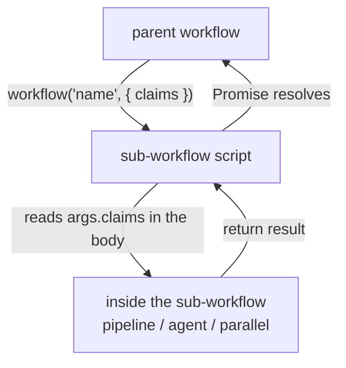
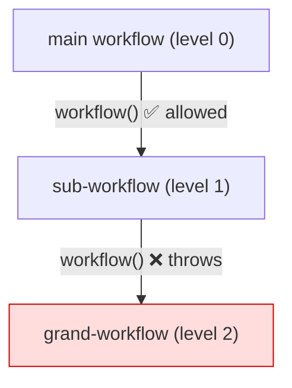
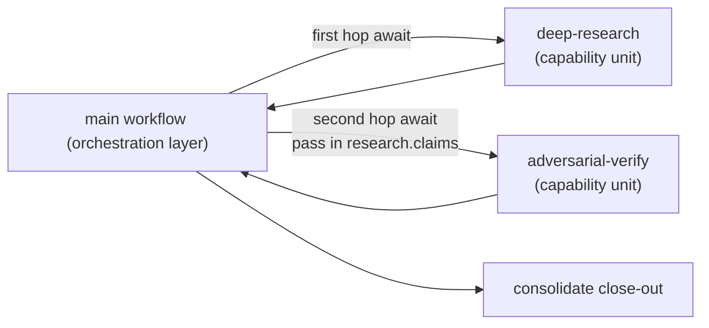
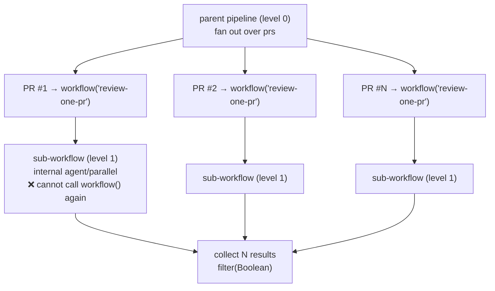

# Chapter 20 · Nested Workflows

> In one sentence: **within a workflow script, use `workflow(nameOrRef, args?)` to inline-call another workflow — assembling validated workflows as "reusable subroutines." But there's one iron law: nesting is one level only.**
>
> This chapter is about Workflow's "modularity" dimension. Earlier we treated `agent()` as a function and `pipeline` as control flow; now we treat **an entire workflow** as a callable unit — the technical bedrock for building a "workflow library" (Part V).

---

## 20.1 Why Nesting Is Needed: From Copy-Paste to Reuse

As you write more workflows, you'll find some **patterns recur.**

Take "adversarial verification" (Chapter 17) — generate, independently verify, three-state-verdict close-out — a structure you use in the Bug Hunter, in PR review, and in document checking too. Copy-pasting those twenty or thirty lines of `pipeline + verdictSchema` every time is a classic bad smell:

- Improve the verification prompt, and you have to go back to every copy-paste site and sync it one by one.
- Subtle differences at each call site let them drift apart gradually, until no one dares touch them.

Software engineering's standard answer to duplication is **extract into a reusable unit.** Workflow's answer is `workflow()`: settle "adversarial verification" into an independent named workflow, and have other workflows **inline-call** it when needed, like calling a function.

```javascript
// (illustrative, not run) — a main workflow inline-calls a verification sub-workflow
phase('Review')
const findings = await agent('Find the issues in this code…', { schema: findingsSchema })

// Call the entire "adversarial verification" sub-workflow as a function
const verified = await workflow('adversarial-verify', { claims: findings.items })

log(`Kept ${verified.confirmed.length} items after verification`)
return verified
```

The line `workflow('adversarial-verify', {...})` runs another complete workflow script (which may internally have its own `pipeline`, its own multiple `agent()` calls), and hands the result back as the return value. **What's reused is no longer a snippet of code, but a validated execution unit with its own schema contract.**

<div class="callout info">

**Official semantics (per `_grounding.md` section B)**: `workflow(nameOrRef, args?): Promise<any>` — inline-run another workflow (named, or a `{scriptPath}` reference). It **shares the concurrency limit / agent count / abort signal / token budget.** And — **nesting is one level only**: calling `workflow()` again inside a sub-workflow throws. These two properties are the core of this chapter, expanded below.

</div>

---

## 20.2 Two Ways to Call: Named and scriptPath

`workflow()`'s first parameter `nameOrRef` corresponds to the two locating methods of `WorkflowInput` in `_grounding.md`:

**Way one: named workflow.** Pass a string name, and the runtime finds the corresponding workflow — built-in, or one you settled in `.claude/workflows/`. This is the way to reuse a "solidified, repeatedly-used" workflow:

```javascript
// (illustrative, not run) — call a settled workflow by name
const result = await workflow('deep-research', { topic: args.topic })
```

**Way two: scriptPath reference.** Pass a `{ scriptPath }` object pointing to a script file on disk. This corresponds to the rule in `_grounding.md` that "`scriptPath` has higher priority than script/name," suitable for calling a script not yet solidified into a named workflow but already landed on disk:

```javascript
// (illustrative, not run) — call by script path
const result = await workflow(
  { scriptPath: '.claude/workflows/scripts/verify-stage.js' },
  { claims }
)
```

The trade-off between the two:

| Way | Suits | Analogy |
|---|---|---|
| Named `'name'` | A solidified, cross-project, standard workflow | Calling an installed library function |
| `{ scriptPath }` | An in-project, iterating, not-yet-named workflow | Calling a module by local relative path |

The passing rule for the `args` parameter is the same as a top-level call: per `_grounding.md`, it becomes the global `args` inside the sub-workflow's script body. So when the sub-workflow reads `args.claims`, it gets the value you passed in — **this is exactly the data interface between parent and child workflows.**



---

## 20.3 The Iron Law: Nesting Is One Level Only

This is the chapter's most important, and most easily violated, constraint. Per `_grounding.md`: **nesting is one level only — calling `workflow()` again inside a sub-workflow throws.**

Speaking with a diagram:



That is:

- **Main workflow → sub-workflow**: allowed. This is one level of nesting.
- **Sub-workflow → grand-workflow**: **forbidden**, the runtime throws.

Why this rule? It can be understood from several angles (the exact mechanistic reason isn't expanded by the sources; the following is reasonable inference based on the constraint):

**Prevent infinite recursion and resource runaway.** If arbitrary-depth nesting were allowed, a workflow could `workflow()` endlessly, and combined with a loop could blow up into an astronomical number of agents. Limiting to one level is a structural guardrail — it's the same "anti-runaway" philosophy as "the 1000-agent total cap per workflow" (`_grounding.md`).

**Keep the mental model simple.** One level of nesting means the call relationship is two tiers, "parent—child," and you can always see "who called whom" at a glance. Arbitrary-depth nesting would make tracing execution, attributing tokens, and debugging difficult.

This rule has a direct impact on your design: **a sub-workflow must be "leaf-level" — it can fan out many `agent()`s of its own, use `pipeline` / `parallel`, but cannot delegate to yet another workflow.** So when you design a workflow library, design the workflows "that will be called by others" not to depend on calling other workflows.

<div class="callout warn">

**Don't try to build a multi-level pipeline with nesting.** A common wrong idea is "I'll split the big task into three workflows A→B→C, have A call B and B call C" — that second hop (B calls C) throws directly. The correct approach: **call them sequentially with ordinary JS in the main workflow**, `await workflow('B')` then `await workflow('C')`, or express B's and C's logic with multiple stages of a `pipeline`. Nesting isn't for "deep pipelines"; it's for "the main flow reusing an independent sub-capability."

</div>

---

## 20.4 What Is Shared: One Pool, Not Each Its Own

A crucial property of `workflow()`: a sub-workflow is **not** a brand-new independent world; it **shares** several key resources with the parent. Per `_grounding.md`, what's shared is: **the concurrency limit, agent count, abort signal, token budget.**

See clearly what each means:

| Shared item | Meaning | What you must watch |
|---|---|---|
| **Concurrency limit** | Parent and child share the same `min(16, CPU−2)` slot pool | The sub-workflow's agents and the parent's agents compete for the same concurrency slots |
| **Agent count** | Parent's and child's agent counts combine toward the 1000 cap | The sub-workflow's fan-out consumes the parent's global quota |
| **Abort signal** | If the parent is aborted, the child is too | Cancel in one place, everything stops, no "orphan sub-processes" |
| **Token budget** | Parent and child share the same `budget` pool | The tokens the sub-workflow burns are deducted directly from the parent's `budget.remaining()` |

The most to watch is **budget sharing.** Recall `_grounding.md`: `budget` is a **hard cap**, calling `agent()` after `spent()` reaches `total` throws, and "the pool is shared by the main loop + all workflows." This means:

```javascript
// (illustrative, not run) — the budget is the same pool shared by parent and child
phase('Pipeline')
// suppose this turn's budget.total = 500k
const a = await workflow('deep-research', { topic })   // the sub-workflow burned 300k
// now budget.remaining() has only about 200k left — the sub-workflow's consumption counts in the same pool
const b = await workflow('adversarial-verify', { claims: a.findings })  // can only run within the remaining 200k
```

If you naively assume "each sub-workflow has its own budget," you'll unexpectedly hit the budget-exhausted throw at the second sub-workflow. **The correct mental model: nested or not, the whole turn has one token pool, one concurrency pool, one agent counter.** `workflow()` only organizes the work more modularly; it conjures no extra resources.

<div class="callout tip">

**This is actually a good thing.** A shared pool means the `budget` cap you set in the main workflow **automatically covers** all sub-workflows it calls — you needn't re-fortify in every sub-workflow. Set the cap in one place, and the whole call tree is bound by it. Same for the abort signal: the user cancels the main flow, and all sub-flows stop cleanly together, leaving no background orphans. **The shared pool is the guarantee of "overall control," not a limitation.**

</div>

---

## 20.5 The Typical Pattern: Assemble the Main Flow with Sub-Workflows

Combine the preceding sections, and look at a main workflow that assembles two independent capabilities, "research + verify."

```javascript
// (illustrative, not run) — the main flow inline-reuses two sub-workflows
export const meta = {
  name: 'research-and-verify',
  description: 'First call the research sub-workflow to produce claims, then call the verification sub-workflow to check each',
  phases: [{ title: 'Research', detail: 'call the research sub-workflow' }, { title: 'Verify', detail: 'call the verification sub-workflow' }],
}

phase('Research')
// First hop: reuse the "deep research" sub-workflow
const research = await workflow('deep-research', { topic: args.topic })
log(`Research produced ${research.claims.length} claims`)

phase('Verify')
// Second hop: sequentially call another sub-workflow in the main flow (not inside research!)
const verified = await workflow('adversarial-verify', { claims: research.claims })

return {
  topic: args.topic,
  confirmed: verified.confirmed,
  refuted: verified.refuted,
}
```

Note especially that **both hops happen in the main workflow (level 0)** — `research` and `verify` are **peer, sequential** calls, strung together by the main workflow with ordinary `await`. This is essentially different from "having `deep-research` internally call `adversarial-verify`" (which would trigger level-2 nesting and throw).

This is the practical corollary of §20.3's iron law: **multi-step reuse is orchestrated by the main flow's sequential/control flow, not by sub-workflows calling each other.** The main workflow is the only "orchestration layer"; sub-workflows are all "capability units" it calls directly.



The data flow between sub-workflows still goes through the standard channel of `args` in, `return` out: `research.claims` is the first sub-workflow's return value, fed as `args.claims` to the second. **This is of a piece with Chapter 07's "schema is the contract between stages"** — except here the "stage" is an entire sub-workflow, and the contract is its input `args` shape and output structure.

---

## 20.6 Nesting vs. Not: When You Really Need workflow()

`workflow()` is elegant, but not every "reuse" needs it. Often, writing a plain JS function in the script is enough, or even better. Distinguish the two:

| What you want to reuse is… | Use what | Reason |
|---|---|---|
| A piece of **pure computation** logic (dedup, aggregate, format) | An ordinary JS function | Deterministic, zero agent cost, shouldn't invoke workflow |
| A **schema definition** | A `const schema = {...}` variable | Just share the object directly |
| A **fixed prompt template** | A JS function returning a string | Lightweight, no workflow overhead needed |
| A **complete capability unit with multi-agent orchestration** | `workflow()` | This is the legitimate use of nesting |
| A **solidified, cross-project** standard flow | Named `workflow('name')` | Settled into a library, like calling a third-party capability |

<div class="callout warn">

**Don't over-nest for the sake of "looking modular."** If a "sub-workflow" internally has only one `agent()` call, it doesn't deserve to be a workflow at all — just write it as an `agent()` call in the main script or a JS function returning `agent(...)`. The overhead and mental cost of `workflow()` (an independent script, independent meta, cross-file tracing) only pays off when the reused unit **is itself a complete orchestration.** **The criterion: if this unit weren't reused but inlined directly into the main script, would it bloat the main script to the point of being hard to understand?** If yes, it's worth extracting into a sub-workflow.

</div>

---

## 20.7 The Boundary with Agent Teams

Finally, clear up an easily confused point. Workflow's `workflow()` nesting and Agent Teams (`CLAUDE_CODE_EXPERIMENTAL_AGENT_TEAMS`, see the related flag in `_grounding.md` section A) both sound like "having multiple execution units collaborate," but they are **completely different** things. Chapter 01 drew the line; here we stress it again from the "composition" angle:

| | `workflow()` nesting | Agent Teams |
|---|---|---|
| Essence | One workflow calling another (deterministic script) | A stateful, mutually communicating, long-term collaborating team |
| Control flow | Fully decided by the parent workflow's JS code | Team members negotiate dynamically via messages |
| State | Stateless, one-off, replayable | Stateful, can converse back and forth |
| Nesting | One level only | N/A (a different model) |

In short: **`workflow()` is "deterministically assembling a sub-flow into the main flow," Agent Teams is "having multiple stateful agents collaborate like a team."** When your reused unit is a "input → deterministic orchestration → output" pure flow, use `workflow()`; when you need dynamic, stateful back-and-forth negotiation between members, that's Agent Teams' domain, outside this book's Workflow scope.

---

## 20.9 The Signature Composition: Each Item Is Itself a Whole Workflow

§20.5 covered "the main flow sequentially assembling a few sub-workflows." Layer that on top of `pipeline` (Chapter 08), and you get the most representative shape of nested Workflows — **the parent is a `pipeline` over a batch of items, and each item is delegated to a named sub-workflow that handles it independently.**

The most classic example is "review 10 PRs":

```javascript
// (illustrative, not run) parent pipeline, each PR handed to a sub-workflow handled independently
const results = await pipeline(
  prs,
  pr => workflow('review-one-pr', { pr }),   // each item is itself a whole workflow
)
```

Read this code: `prs` is the batch of PRs to review; `pipeline` lets each PR **flow independently** through the chain; and the stage on that chain is not an `agent()` but an entire `workflow('review-one-pr', { pr })` — **each item triggers one complete sub-workflow.** Inside, `review-one-pr` can fan out its own multiple `agent()`s (review by dimension, adversarial verification, summarize), fully encapsulating the matter of "reviewing one PR." The parent only "dispatches N PRs and collects N results"; the complexity of how a single PR is reviewed is tucked inside the sub-workflow.

This is precisely the endpoint shape of §20.1's "from copy-paste to reuse": **"review one PR" settles into a named capability unit, and "review a batch of PRs" is just a `pipeline` fan-out over it.** Adding a PR or changing the review logic touches only one place.

But three constraints must always be kept in mind; all are direct corollaries of the earlier sections' iron laws under this shape:

**One, it's still only one level.** The nesting depth here is still "parent pipeline (level 0) → `review-one-pr` (level 1)" — exactly one level. So the body of `review-one-pr` **must never call `workflow()` again**: per `_grounding.md`, calling `workflow()` again inside a sub-workflow throws. `review-one-pr` must be "leaf-level" — it can fan out freely with `agent()` / `parallel` / an internal `pipeline`, but cannot delegate to yet another workflow. If you find `review-one-pr` wanting to call another sub-workflow, that's a sign to inline that logic directly into its own script, or lift it up to the parent-pipeline level to orchestrate.

**Two, all sub-workflows' agents and tokens count into the parent's same pool.** Per `_grounding.md`, `workflow()` shares the concurrency limit / agent count / abort signal / token budget (see §20.4). So under this shape, **total agent count ≈ number of PRs × the agent count inside each `review-one-pr`**, all combined toward the parent's 1000 cap and the parent's `budget` pool. Reviewing 10 PRs with 4 agents inside each sub-workflow is about 40 agents deducting from the same budget together — the scale amplifies fast, so be sure to close it out with the budget self-adaptation of Chapter 21.

**Three, a sub-workflow throwing → that item becomes `null`.** This is `pipeline`'s existing semantics (Chapter 08): if some PR's `review-one-pr` throws internally, that position becomes `null` and is skipped, without affecting the other PRs. As usual, `results.filter(Boolean)` before consuming.

<div class="callout info">

**This shape's two properties — "one-level nesting + shared pool" — have been empirically verified by the real run `wf_85e22b38-126` cited in this chapter.** Per `_grounding.md` section C, that nested workflow() run confirmed two things: ① the sub-workflow's agents **count into the parent** (`agent_count=1` attributed to the parent's count); ② the **one-level-only** constraint truly exists. This "pipeline-of-nested" composition in this section was **not run on its own** (hence marked "(illustrative, not run)"), but it merely places the already-verified `workflow()` (`wf_85e22b38-126`) inside the equally already-verified `pipeline` (`wf_bf086b98-6ec`, see Chapter 08) — both blocks are field-tested, and the way they combine is plain JS.

</div>



---

## 20.8 Chapter Summary

- `workflow(nameOrRef, args?)` **inline-calls another workflow** within a workflow, treating a validated workflow as a reusable "capability unit" — the bedrock for building a workflow library.
- Two locating ways: **named** (`'name'`, calling a solidified/cross-project standard workflow) and **`{ scriptPath }`** (calling an in-project, iterating script). `args` in, `return` out is the data interface between parent and child.
- **Iron law: nesting is one level only.** Calling `workflow()` again inside a sub-workflow throws. Multi-step reuse is orchestrated by the **main flow's sequential/control flow** (the main workflow is the only orchestration layer), not by sub-workflows calling each other.
- **Share one pool**: parent and child share the same concurrency limit, agent count (counting toward the 1000 cap), abort signal, and token budget (the `budget` hard cap applies to the whole call tree). Mental model — the whole turn has one resource pool, `workflow()` conjures no extra resources.
- Trade-off: pure computation uses a JS function, schemas use a shared variable, prompts use a template function; only a **complete multi-agent orchestration unit** is worth extracting into `workflow()`. Don't over-nest for "looking modular."
- The signature composition (§20.9): **a parent `pipeline` fans out, and each item is itself a whole sub-workflow** (e.g., "review 10 PRs") — the endpoint shape of "reuse." It's still bound by one-level nesting (the sub-workflow can't call `workflow()` again), and all sub-workflows' agents / tokens combine into the parent's same pool.
- The boundary with Agent Teams: `workflow()` is deterministic sub-flow assembly; Agent Teams is a stateful collaborating team, outside this book's scope.

In the next chapter, we go deep into the most crucial item in that recurring "shared resource pool" — the token budget: how to use `budget.total` / `remaining()` to make a workflow **dynamically adjust its scale according to the remaining budget.**

> Continue reading: [Chapter 21 · Dynamic Budget & Scaling](#/en/p4-21)
