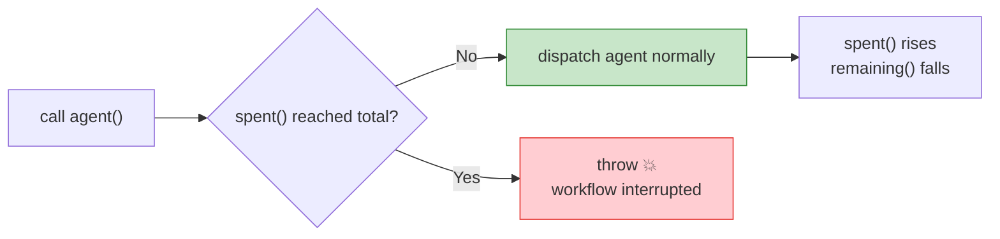
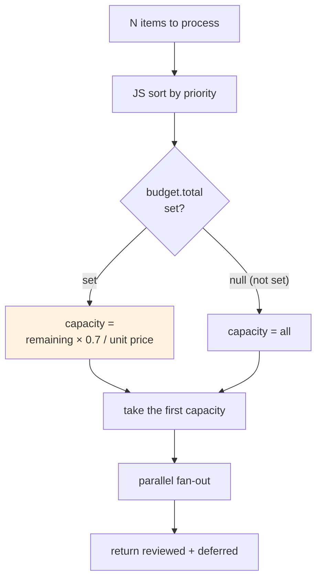
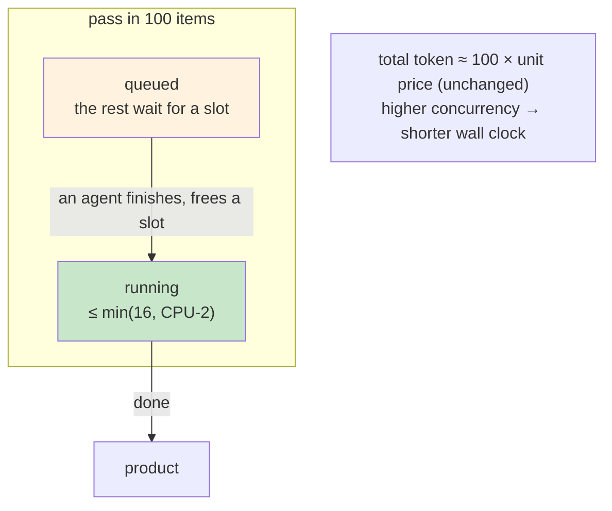

# Chapter 21 · Dynamic Budget & Scaling

> In one sentence: **`budget` lets your workflow "glance at how much is left in the wallet" at runtime and decide accordingly how many agents to fan out and whether to downgrade to a cheaper model — turning "how many tokens to spend" from a gamble into a computable, self-adapting engineering quantity.**
>
> The earlier recipes mostly hard-code the scale: five dimensions means five parallel paths, three items means a three-stage pipeline. But in production, scale is often a **variable** — "review this PR" might have changed 3 files or 80. A one-size-fits-all "one agent per file" wastes for 3 files, and for 80 files may burn the budget halfway through and make `agent()` throw outright. This chapter teaches you to use `budget` to **bind scale to the budget**, letting the workflow live within its means.

---

## 21.1 `budget`: The "Wallet" Injected at Runtime

Chapter 01 listed the global hooks, and Chapter 18 used `budget` to brake a loop. This chapter explains it **fully** — because every decision of "dynamic scaling" rests on a precise understanding of `budget`'s three members.

`budget` is a global object the runtime injects into the script (no import needed), reflecting **this turn's** token target and consumption (per `_grounding.md` section B):

```javascript
budget.total        // number | null: this turn's token target
budget.spent()      // number: output tokens spent this turn
budget.remaining()  // number: how much is left; = max(0, total - spent())
```

Pin down each one's precise semantics:

### `budget.total`: where the target comes from, possibly `null`

`total` is **this turn's token target**, coming from the user's instruction — e.g., the user says "`+500k`," and `total` is the corresponding target value.

<div class="callout warn">

**The number-one pitfall: when the user sets no target, `total` is `null` and `remaining()` is `Infinity`.** This isn't "0," nor "no limit equals very small" — it's **infinity.** Any "is there enough left" judgment must first use `budget.total` to distinguish "did the user actually set a target" between these two worlds, or your adaptive logic fails entirely when "no budget is set" (comparing against `Infinity`, all threshold checks are constantly true). §21.3 uses this guard repeatedly.

</div>

### `budget.spent()`: it's a function, and a **shared pool**

Note `spent()` and `remaining()` are **functions** (call with parentheses), because their values change in real time as the workflow advances — every agent dispatched, every token it produces, `spent()` rises.

A more crucial point: **this pool is shared by "the main loop + all workflows"** (`_grounding.md` section B). That is, `spent()` counts not only what your workflow spent, but also what the main loop itself and other workflows launched in the same turn spent. You don't own the whole budget; you **share one wallet** with others — which makes "living within your means" all the more necessary.

### `budget.remaining()`: a hard cap, exceeding it **throws**

`remaining()` returns `max(0, total - spent())`. Its most important property: **`budget` is a hard cap** — once `spent()` reaches `total`, calling `agent()` again **throws directly** (`_grounding.md` section B).

This is the fundamental reason "dynamic scaling" must exist:

> **If you don't proactively live within your means, when the budget is exhausted `agent()` throws — your workflow "hits the wall" and crashes halfway through, and the agents already dispatched ran for nothing.** Better to proactively "check the wallet first, then decide how many to dispatch" than to passively hit the wall.



<div class="callout tip">

**`budget`'s design philosophy is to "make cost a first-class citizen."** In manual orchestration, "how many tokens will this cost" is a black box known only after the fact; `budget` makes it a variable that's **readable and decision-actionable** at script runtime. Chapter 02 said "code as control flow" — `budget` makes it "code as **cost-control** flow."

</div>

---

## 21.2 The Predictability of Cost: Establish a "Per-Agent Unit Price" with Real Data

To "live within your means," you first need to know "how much an agent roughly costs." This is exactly the value of this book's insistence on recording real runs. Three sets of real data (`assets/transcripts/primitives.md`, tested in the same session):

| Real run | Agents | total_tokens | Per-agent amortized |
|---|---|---|---|
| hello (single agent + schema) | 1 | 26,338 | ~26k |
| parallel (3 agents concurrent) | 3 | 78,844 | ~26k |
| pipeline (6 agents, 3 items × 2 stages) | 6 | 158,982 | ~26k |

> The three sets land highly consistently at **~26k tokens / agent.** `_grounding.md` section C gives the rule of thumb accordingly: **token ≈ agent count × per-agent context (about 25k–30k / agent).**

This rule is the **pricing basis** of dynamic scaling. With it, scale and cost can be converted to each other:

- **Forward (scale → cost)**: want to dispatch N agents? Estimated cost ≈ N × 26k.
- **Reverse (budget → scale)**: have `remaining()` tokens left? At most ≈ `remaining() / 26k` more agents can be dispatched.

<div class="callout warn">

**This "unit price" is an order-of-magnitude estimate, not a precise calculation.** A real single agent's tokens float significantly with three factors: ① **prompt length** (the larger the context fed in, the more expensive); ② **product size** (the more complex the schema, the more output required, the more expensive); ③ **task difficulty** (an agent needing multiple rounds of tool calls is far more expensive than a single Q&A). So when making budget decisions, **estimate the unit price high and leave a safety margin on scale** (below uses a coefficient like `SAFETY = 0.7`). Treat 26k as the "lightweight-agent floor," and estimate heavy work at 40k–60k for safety.

</div>

---

## 21.3 Pattern 1: Dynamic Fan-Out — Decide How Many to Dispatch by Remaining

The first and most common dynamic-scaling pattern: **you have a batch of items to process (files, modules, problems), but you don't necessarily dispatch an agent for all — instead, see how many the budget can afford and process that many of the most important.**

### The danger of the naive version

First the negative: fan out everything regardless of budget.

```javascript
// ⚠️ Dangerous: ignores budget, hits the wall and throws halfway when there are many files (illustrative, not run)
const results = await parallel(
  files.map(f => () => agent(`Review ${f}`, { schema: REVIEW }))
)
```

When `files` has 80, this queues 80 agents at once (throttled by the `min(16, CPU-2)` concurrency limit, but the **total** is still 80). Estimated cost 80 × 26k ≈ **2.08M tokens.** If the user only gave `+500k`, around the 19th agent `spent()` hits the cap, the 20th `agent()` call **throws**, and the whole workflow is interrupted — and you've already paid for the first 19 for nothing, without getting a complete result.

### The adaptive version: first compute "how many can be dispatched," then dispatch

The correct approach is to **first reverse-compute the scale cap, then slice accordingly**:

```javascript
// Adaptive fan-out: decide how many items to process by remaining budget (illustrative, not run)
export const meta = {
  name: 'adaptive-fanout',
  description: 'Dynamically decide fan-out scale by remaining budget, slicing by priority',
  phases: [{ title: 'Review' }],
}

const PER_AGENT = 50000   // upper bound of single-agent cost (review-type is heavier, estimate at 50k)
const SAFETY = 0.7        // safety coefficient: use only 70% of remaining, leaving room for main loop and close-out

// 1) Sort by importance first (deterministic operation, done in JS)
const ranked = args.files.slice().sort((a, b) => b.churn - a.churn)  // larger churn first

// 2) Reverse-compute: how many agents can be dispatched this turn at most
let capacity
if (budget.total) {
  capacity = Math.floor((budget.remaining() * SAFETY) / PER_AGENT)
} else {
  capacity = ranked.length   // user set no budget (total=null) → no extra limit
}
const toProcess = ranked.slice(0, Math.max(1, capacity))   // process at least 1

log(`Budget remaining ${budget.total ? budget.remaining() : '∞'}, ` +
    `processing ${toProcess.length}/${ranked.length} files this turn`)

// 3) Fan out within capacity
phase('Review')
const results = (await parallel(
  toProcess.map(f => () => agent(`Review ${f.path}`, { label: f.path, schema: REVIEW }))
)).filter(Boolean)

// 4) Be honest: which were not processed due to budget
return {
  reviewed: results,
  processed: toProcess.length,
  deferred: ranked.slice(toProcess.length).map(f => f.path),  // not reached, listed honestly
}
```

Three key points of this pattern:

1. **Sort with JS, not an agent.** "Sort by churn" is a deterministic operation, handed to `Array.sort` — zero cost, replayable (echoing Chapter 18's discipline of "deterministic operations go to code").
2. **The `budget.total` guard runs throughout.** When no budget is set (`null`), impose no extra limit — because `remaining()` is `Infinity` then, and reverse-computing yields a meaningless huge value.
3. **Honestly report `deferred`.** Items not processed due to budget are returned truthfully, rather than pretending everything was done — so the caller can "add budget and run the rest later" (even with Chapter 22's resume).



---

## 21.4 Pattern 2: Dynamic Downgrade — Use a Cheap Model When the Budget Is Tight

The second pattern uses `agent()`'s `model` option (`_grounding.md` section B): **when the budget is ample use a strong model (inheriting the main loop model; this book's tested session is Opus 4.7), when the budget is tight downgrade some agents to `'haiku'`** — trading quality for coverage.

`agent()`'s `model` option: omitted, it inherits the main loop model (the recommended default); it can also be explicitly overridden. Simple tasks using `'haiku'` can cut cost substantially.

```javascript
// Dynamically choose the model by remaining budget (illustrative, not run)
function pickModel() {
  if (!budget.total) return undefined            // no budget set: use default (inherit main loop)
  const ratio = budget.remaining() / budget.total
  if (ratio > 0.5) return undefined              // over half left: keep the strong model
  if (ratio > 0.2) return 'haiku'                // tight: downgrade for speed and cost
  return 'haiku'                                 // critical: finishing matters more than finishing well
}

phase('Triage')
const results = (await parallel(
  items.map(it => () => agent(`Classify: ${it.title}`, {
    label: it.title,
    model: pickModel(),       // decided at runtime by remaining
    schema: TRIAGE,
  }))
)).filter(Boolean)
```

<div class="callout tip">

**Downgrading is a form of "graceful degradation."** Rather than stubbornly forcing a strong model when the budget is critical and crashing halfway, downgrade to haiku to cover **all** items — getting a "fully covered but slightly lower precision" result is often more useful than "half covered but each precise." Which trade-off is right depends on the task: classification/initial-screening suits downgrading for coverage; "better to omit than misreport" tasks like security audits don't. **This judgment should be written by you into the code, not decided by the model on the spot.**

</div>

<div class="callout warn">

**Decide the downgrade once "before fan-out," don't flip-flop repeatedly in the loop.** If you re-`pickModel()` for every item in a long `pipeline`, you may get a split "first half strong-model, second half haiku" result, making product quality inconsistent and hard to consolidate. The steadier approach: **assess remaining once before entering fan-out, and settle on a unified model strategy for this batch**; only re-assess between batches/rounds (like Chapter 18's loop).</div>

---

## 21.5 The Hard Boundaries of Scaling: The Concurrency Limit and the 1000 Fallback

No matter how clever dynamic fan-out is, it runs within two **runtime hard boundaries.** Scaling must keep them in mind (`_grounding.md` section B / A.9):

| Boundary | Value | Meaning |
|---|---|---|
| **Per-workflow concurrency limit** | `min(16, CPU cores − 2)` | The number of agents **running** at once; the excess **queues**, runs when a slot opens |
| **Per-workflow agent total cap** | **1000** | A fallback on the total agents dispatched over the whole workflow lifecycle, to prevent runaway loops |

The key difference between these two boundaries — **the concurrency limit governs "how many at once," the total cap governs "how many in all":**

### The concurrency limit: not limiting the total, only "at once"

You **can** pass `parallel()` / `pipeline()` 100 items, and they **all complete** — only at any instant about `min(16, CPU-2)` are actually running, the rest queue (`_grounding.md` section A). So the concurrency limit is **not** "at most 16 can be processed," but "at most 16 run at once."

What does this mean for cost? **The concurrency limit affects wall clock, not total tokens.** 100 agents, whether 8 or 16 concurrent, total about 100 × unit price; only the higher the concurrency, the shorter the wall clock (more agents running at once).



### The 1000 total fallback: the last safety net for runaway loops

Within a single workflow's lifecycle, the agent total cap is **1000.** This is the last safety net to prevent a runaway loop (like that mis-written unbounded `while` from Chapter 18) from burning through everything.

<div class="callout warn">

**Never treat the 1000 fallback as a business-exit mechanism.** It's a "safety net," not a "fence" — by the time you hit 1000, you've long burned about 1000 × 26k ≈ **26M tokens.** Real scale control should rely on your explicit `budget` guards and round caps (Chapter 18) to rein it in far before 1000. Understand the 1000 as "if all the gates I wrote fail, the runtime still saves me once" — but you shouldn't let the code reach that point.

</div>

---

## 21.6 The Comprehensive Skeleton: Budget-Aware Batch Processing

Twist three things — dynamic fan-out, dynamic downgrade, boundary awareness — into one production skeleton: process a batch of indeterminate-count items, decide by budget **how many to process** and **what model to use**, and report the result honestly.

```javascript
// Budget-aware batch processing (illustrative, not run)
export const meta = {
  name: 'budget-aware-batch',
  description: 'Dynamically decide fan-out scale and model by remaining budget, processing a batch of items within means',
  phases: [{ title: 'Plan' }, { title: 'Process' }],
}

// —— Pricing parameters (tune per task, estimate heavy work high) ——
const PER_AGENT = 50000     // upper bound of single-agent cost
const SAFETY    = 0.7       // safety coefficient

phase('Plan')
// 1) Deterministic preprocessing: sort (most important first)
const ranked = args.items.slice().sort((a, b) => b.priority - a.priority)

// 2) Reverse-compute capacity + choose model (unified strategy, decided once)
const hasBudget = !!budget.total
const capacity  = hasBudget
  ? Math.max(1, Math.floor((budget.remaining() * SAFETY) / PER_AGENT))
  : ranked.length
const model = (() => {
  if (!hasBudget) return undefined
  const ratio = budget.remaining() / budget.total
  return ratio > 0.5 ? undefined : 'haiku'   // over half left keep the strong model, else downgrade for coverage
})()

const batch    = ranked.slice(0, capacity)
const deferred = ranked.slice(capacity)

log(`Budget ${hasBudget ? budget.remaining() : '∞'}; ` +
    `processing ${batch.length}/${ranked.length}; model ${model || 'default(inherits main loop)'}; ` +
    `estimated cost ~${(batch.length * PER_AGENT / 1000).toFixed(0)}k tokens`)

// 3) Fan out within capacity
phase('Process')
const done = (await parallel(
  batch.map(it => () => agent(`Process: ${it.title}`, {
    label: it.title, model, schema: RESULT,
  }))
)).filter(Boolean)

// 4) Return honestly (incl. unprocessed items and the stop reason, to ease adding budget and resuming)
return {
  processed: done,
  count: done.length,
  deferred: deferred.map(it => it.title),
  modelUsed: model || 'inherited',
  budgetAtStart: hasBudget ? budget.total : null,
  spentApprox: budget.spent(),
}
```

This skeleton embodies the complete mantra of a "budget-aware workflow": **plan first (check the wallet, set the scale, choose the model), then execute (fan out within capacity), and finally report honestly (what was processed, what's still owed, how much was spent).**

<div class="callout info">

**Why list `Plan` as a separate phase?** Because the **pure-JS** decisions of "check budget, sort, compute capacity, choose model" cost almost no tokens, yet they determine the entire cost scale of the `Process` phase. Making it an explicit phase (even with no agents) both keeps the `/workflows` progress readable and reminds the code reader: **the scale decision is a separate action happening before fan-out**, not something improvised within the loop.

</div>

---

## 21.7 The Division of Labor with Chapters 18 and 22

`budget` has a different emphasis in three chapters of this book; don't confuse them:

| Chapter | budget's role | Key action |
|---|---|---|
| **Chapter 18, Loop-Until-Dry** | One of the loop's **brakes** | `budget.total && remaining() < PER_ROUND` → close out early |
| **This chapter (21)** | The scale's **regulating valve** | Reverse-compute fan-out scale by `remaining()`, dynamically choose the model |
| **Chapter 22, Resume** | A cross-run **money-saver** | Resume after editing a step; unchanged agents hit the cache, no re-spending tokens |

The three are orthogonal and stackable: a workflow can perfectly well **decide fan-out scale by budget (this chapter) → brake with budget in a loop (Chapter 18) → resume after editing the script to save money (Chapter 22).**

<div class="callout tip">

**Remember this chapter's pattern in one sentence:** don't write a workflow that "ignores budget and fans out everything" — that's betting the budget is enough, and losing the bet means throwing and crashing halfway. Write a workflow that "checks the wallet first, reverse-computes how many it can do, lives within its means, and honestly reports what's owed." **Program cost as a runtime variable, not a black box known only after the fact.**

</div>

---

## 21.8 Chapter Summary

- **`budget` is the "wallet" injected at runtime**: `total` (this turn's target, **`null` when the user sets none**), `spent()` (spent, a function, **a pool shared by main loop + all workflows**), `remaining()` (remaining, **`Infinity` when not set**). It's a **hard cap** — calling `agent()` after `spent()` reaches `total` **throws.**
- **The number-one guard**: prefix any remaining check with `budget.total &&`, distinguishing the two worlds of "budget set" and "`null`/`Infinity`," or the adaptive logic fails when no budget is set.
- **Pricing basis**: real data consistently shows **~26k tokens / agent**; from this you can forward-compute (N agents ≈ N×26k) and reverse-compute (remaining / unit price ≈ how many more). Estimate the unit price high and leave a safety coefficient.
- **Pattern 1, dynamic fan-out**: JS sort to set priority → reverse-compute capacity by `remaining()×SAFETY/unit price` → slice and process → honestly return `deferred`.
- **Pattern 2, dynamic downgrade**: choose `model` by the `remaining()/total` ratio, downgrade to `'haiku'` when the budget is tight to trade for coverage; **decide once before fan-out, don't flip-flop in the loop.**
- **Hard boundaries**: the concurrency limit `min(16, CPU-2)` (governs "how many at once," affects wall clock not total tokens, the excess queues but all complete); the agent total cap **1000** (a runaway fallback, never a business-exit mechanism).
- This chapter's scripts are all **structural illustrations (not run)**; the token magnitudes (hello/parallel/pipeline) are real data from `assets/transcripts/primitives.md`.

The next chapter closes out Advanced Patterns: when a long pipeline is halfway through and you need to change one step, how to **not re-run from scratch** — `resumeFromRunId` resume and caching, turning the iron law of "the same script necessarily produces the same execution" into a money-saving tool worth hard cash.

> Continue reading: [Chapter 22 · Resume & Caching](#/en/p4-22)
