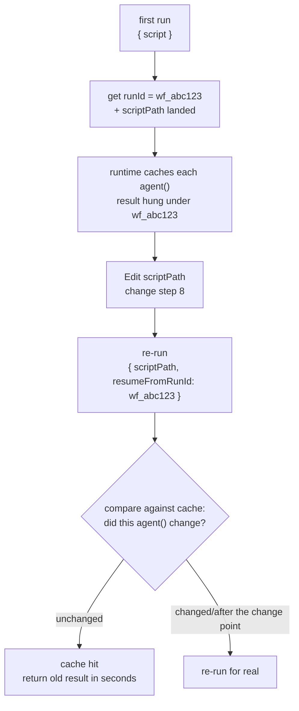
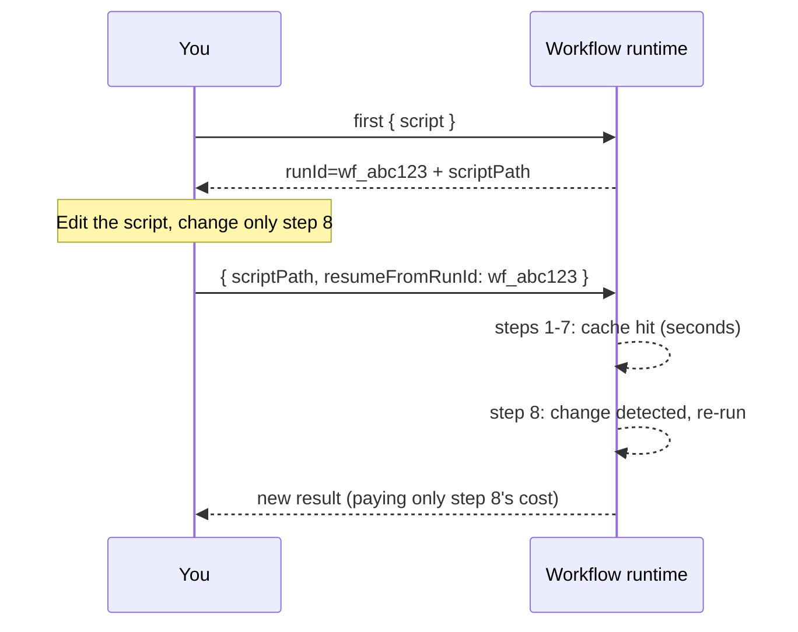

# Chapter 22 · Resume & Caching

> In one sentence: **change step 8 of a long pipeline, and the expensive results of the first 7 steps are reused directly in seconds — this is resume. Re-run with `{ scriptPath, resumeFromRunId }`, and unchanged `agent()` calls hit the cache; only the edited ones and those after them re-run for real.**
>
> This is the closing chapter of Advanced Patterns, and the key to making all the earlier "expensive multi-agent pipelines" **iterable.** It also reveals the final reason behind a prohibition running through the whole book — why `Date.now()` and `Math.random()` are forbidden in scripts.

---

## 22.1 The Pain Point: Change One Step, but Re-Run from Scratch

Imagine you wrote an 8-stage deep-research pipeline, each stage fanning out several agents, the whole run 500k tokens and several minutes. After it finishes, you find step 8 (the final report's wording) unsatisfactory, and you change that step's prompt.

Without resume, you can only **re-run the whole pipeline from scratch** — the 400k+ tokens of work of the first 7 steps, whose results are completely unchanged, must be burned again and waited out for several minutes. This is catastrophic when iterating a long pipeline: every time you tweak the wording at the end, you pay the full-run cost.

Resume is born to eliminate this waste. Its promise:

> **The same script + the same args → 100% cache hit.** Only the `agent()` calls you **changed** (and the calls after them) re-run for real; the unchanged ones return last time's result in seconds.

So iterating a long pipeline becomes: change step 8 → re-run → the first 7 steps instantly hit the cache → only step 8 runs for real. Seconds, not minutes.

<div class="callout info">

**Official semantics (per `_grounding.md` sections A/B)**: `WorkflowInput.resumeFromRunId?: string` — resume: **unchanged `agent()` calls return cached results; same session only.** Used together with `scriptPath` (the on-disk script path, landed on every call). The `runId` in `WorkflowOutput` (like `wf_...`) is exactly the value to pass to `resumeFromRunId` when resuming.

</div>

---

## 22.2 The Mechanism: The Script Is a File + the runId Anchor

To understand how resume works, first recall two facts covered in Chapter 01; here they combine:

**Fact one: the script is a file.** Per `_grounding.md`, every time Workflow is called, the runtime **lands the script on disk** as a `.js` file under the session directory, and gives the `scriptPath` in the return. This means your workflow isn't a fleeting string but an **editable file on disk.**

**Fact two: every run has a runId.** Per `_grounding.md`, `WorkflowOutput` returns `runId` (like `wf_...`). It's the unique identifier of this run — and the **anchor** for the cache of all of this run's agent results.

Resume combines the two:

1. First run: get the `runId` (e.g., `wf_abc123`) and the landed `scriptPath`. The runtime caches each `agent()` call's result by its "identity" in the script, hung under this `runId`.
2. You `Edit` that `scriptPath` file, changing one of the `agent()` calls.
3. Re-run: pass `{ scriptPath, resumeFromRunId: 'wf_abc123' }`. The runtime compares against the cache — **unchanged `agent()` calls take the cached result directly**, while the changed ones (and those after them) re-execute.



This iteration loop (edit the file + re-run with `scriptPath`) is exactly the complete form of Chapter 01's "Want to iterate? Just Write/Edit that file and re-invoke with `{ scriptPath }`, no need to resend the whole script" — resume just adds the key capability of "reusing the cache with `resumeFromRunId`."

<div class="callout warn">

**"Same session only" is a hard limit.** Per `_grounding.md`, resume is valid only within the **same session.** In other words, the cache's lifecycle is bound to the current session — you can't close Claude Code and resume tomorrow with yesterday's `runId`. So resume is a tool for "repeatedly invoking a pipeline **within the current iteration session**," not a persistence scheme for "resuming progress across days." State needing cross-session persistence must rely on other means (e.g., having an agent write the product to a disk file, see Chapter 19's control plane / data plane idea).

</div>

---

## 22.3 Revealing the Prohibition: Why Date.now() and Math.random() Are Forbidden

Now we can finally answer the prohibition that recurred in Chapters 01 and 02 but was never fully expanded.

Per `_grounding.md`'s "hard constraints": scripts **forbid `Date.now()` / `Math.random()` / arg-less `new Date()`.** The reason Chapter 01 gave was "they break replayability." This section makes clear **why resume needs replayability, and how these two functions break it.**

The entire premise of resume is "**the same script necessarily produces the same execution**" — only then can the runtime judge "this `agent()` call didn't change, the cache is usable." This judgment relies on an assumption: **the script's logic is deterministic and replayable** — the same input, and the state on reaching this point is the same every run.

`Date.now()` and `Math.random()` precisely **violate** this assumption:

- `Date.now()`: returns a different timestamp every call. If your script uses it to construct a prompt (e.g., `agent(\`Analyze data before ${Date.now()}\`)`), then **the same `agent()` call has a different prompt every re-run** — it "changed," so can the cache still be trusted? Resume's judgment logic collapses.
- `Math.random()`: returns a different random number every call. By the same token, any `agent()` call depending on it is non-replayable.

```javascript
// ❌ Wrong (illustrative, not run) — breaks replayability, rejected by the runtime
const ts = Date.now()                              // forbidden
const pick = items[Math.floor(Math.random() * 3)]  // forbidden
await agent(`Analyze the ${pick} of ${ts}`)        // different every re-run → resume fails
```

The correct alternatives, also given by `_grounding.md`:

**Need a timestamp → pass it in via `args`, or stamp it after the fact.** Pass time in as a parameter from outside (`args.timestamp`), and the script's interior is deterministic — the same `args`, the same execution. Or stamp the result outside after the workflow finishes.

```javascript
// ✅ Right (illustrative, not run) — the timestamp passed in via args, staying replayable
await agent(`Analyze data before ${args.cutoffDate}`)
```

**Need randomness/diversity → vary the prompt using the agent's index.** This is exactly the technique used in Chapter 17's "multi-verifier voting" — use `i` to give each agent a different perspective, both creating diversity and being fully deterministic (same index → same prompt).

```javascript
// ✅ Right (illustrative, not run) — create variation with index, not random
const views = ['performance', 'security', 'readability']
await parallel(views.map((v, i) => () => agent(`Review from the ${views[i]} angle…`)))
```

<div class="callout tip">

**Remember this causal chain**: resume saves money → resume needs to judge "the call didn't change" → the judgment needs the script to be replayable → replayability forbids nondeterminism → hence `Date.now()` / `Math.random()` / arg-less `new Date()` are forbidden. This prohibition isn't the runtime nitpicking; it's the **inevitable price of the capability "an iterable long pipeline."** Understanding this chain, you won't see it as a strange restriction but will proactively "drive all nondeterminism outside the script" (`args`) or "replace it with the index."

</div>

---

## 22.4 In Practice: Iterating a Long Pipeline

Bring the mechanism down to concrete operation. Suppose you're iterating a research pipeline, with this workflow:

**Step one — first run, get the runId.** Launch the workflow normally, and note the `runId` and `scriptPath` from the completion notification/return:

```text
Run ID: wf_abc123
Script file: .../workflows/scripts/research-pipeline-wf_abc123.js
```

**Step two — edit the landed script.** Use the `Edit` tool to directly change the file the `scriptPath` points to, e.g., changing only the last consolidation agent's prompt. **Key: don't change any earlier-stage `agent()` calls**, or their caches will be invalidated.

**Step three — re-run with resumeFromRunId.** Call the Workflow tool again, this time passing:

```javascript
// (illustrative, not run) — the input form of a resume call
{
  scriptPath: '.../research-pipeline-wf_abc123.js',
  resumeFromRunId: 'wf_abc123'
}
```

The runtime reuses the caches of all earlier unchanged stages, re-running only the agent you changed and its downstream. You'll see the first few stages complete **in seconds** (cache hits), with compute spent only after the change point.



<div class="callout tip">

**Real-run confirmation (cache hit = 0 tokens / 8 ms)**: this book re-ran the `hello-workflow` from Chapter 4 (Run `wf_dacbd480-d5d`) with the **unchanged script** + `resumeFromRunId`. The two runs' usage compared (same Run ID) —

| Run | tool_uses | total_tokens | duration_ms |
|---|---|---|---|
| First (real execution) | 1 | **26,338** | **5,506** |
| Resume (cache hit) | **0** | **0** | **8** |

The return value is identical. **A cache-hit `agent()` call returns in zero tokens, zero tool calls, 8 milliseconds** — it directly reuses the result, without re-dispatching the subagent. This also empirically answers the previous section's "do cache hits count tokens": **they don't.** The raw record is in `assets/transcripts/advanced.md`.

</div>

<div class="callout warn">

**All calls after the change point re-run, even if they themselves didn't change.** This is because resume "invalidates from the change point onward" — if step 8 changed, steps 9 and 10's inputs may change as a result, so they must re-run too to guarantee correctness. **Corollary: put the steps most likely to be repeatedly adjusted later in the pipeline** to maximize cache benefit. If you always tweak step 2, then everything after step 3 must re-run, and resume saves little. Put the "stable, expensive" up front and the "mutable, needing repeated polish" at the back — this is pipeline design for resume-friendliness.

</div>

---

## 22.5 Resume's Interaction with budget and Nesting

Resume isn't an isolated feature; it has subtle interactions with the mechanisms of the earlier chapters, and clarifying them avoids potholes.

**Relationship with budget (Chapter 21): do cache hits still count tokens?** Resume's value lies precisely in "hit calls don't re-execute" — since they don't execute, they naturally don't consume model-reasoning tokens. This book's real resume run has confirmed this: the cache-hit re-run had `total_tokens=0` (see the "real-run confirmation" above and `assets/transcripts/advanced.md`). So resume **genuinely saves tokens** — **the marginal cost of iteration comes only from the part you changed**, and the earlier hit stages are nearly free.

**Relationship with nested `workflow()` (Chapter 20).** Resume's "unchanged `agent()` hits the cache" targets the `agent()` calls in the current workflow script. When the script has a `workflow()` sub-call, how resume interacts with the sub-workflow's cache isn't expanded by the sources; it's "(to be verified)" — when actually iterating a workflow with nesting, confirm by observing the real cache-hit behavior via `/workflows`.

**Relationship with worktree (Chapter 19).** A worktree-isolated agent involves file-system side effects. When resume re-runs the agents after the change point, how these side effects are handled (re-create the worktree?) is likewise a detail not covered by the sources, marked "(to be verified)."

<div class="callout info">

**A safe practice principle**: resume's most reliable, most officially-supported scenario is "a **read-only, structured-data-only** multi-stage pipeline" — like research, review, analysis. Such a workflow's `agent()` calls have no external side effects, and the semantics of a cache hit are clear and unambiguous (same input → same output → safely reusable). For complex cases with file writes (worktree) or nested sub-workflows, resume's behavior has details not covered by the sources; **observe the actual hits with `/workflows`**, don't assume. This is consistent with the book-wide discipline of "never speculate about an API from memory."

</div>

---

## 22.6 A Resume-Friendly Design Checklist

Distill this chapter's experience into a "make your workflow resume-friendly" design checklist:

| Principle | Practice | Reason |
|---|---|---|
| **Eliminate nondeterminism** | Forbid `Date.now()` / `Math.random()` / arg-less `new Date()` | They break replayability, resume's judgment fails (the runtime rejects them) |
| **Drive nondeterminism outside** | Timestamps via `args`; diversity via `index` | Keep the script body deterministic, same input same execution |
| **Put mutable steps later** | Stable expensive ones up front, repeatedly-polished ones at the back | Everything after the change point re-runs; later changes maximize cache benefit |
| **Make good use of script landing** | When iterating, `Edit` the landed script + re-run with `scriptPath` | No need to resend the whole script, and it provides a file anchor for resume |
| **Remember the runId** | After the first run, note the `runId` for resume | The source of `resumeFromRunId`'s value |
| **Iterate within a session** | Resume is valid only in the same session | Cross-session needs separate disk persistence |
| **Observe complex cases first** | With worktree/nesting, watch hits via `/workflows` | Resume details for these scenarios aren't covered by the sources |

<div class="callout tip">

**Resume turns "writing a workflow" into a real 'programming' experience.** Without resume, every script change pays the full-run cost, with iteration cost so high you dare not adjust lightly — it feels more like "submitting a batch job once." With resume, change a line, re-run, see the local effect in seconds, like debugging code in a REPL: **changes are cheap, feedback is instant.** This is a major engineering advantage of Workflow's "deterministic script" over "probabilistic prompt orchestration" — determinism makes caching possible, and caching makes rapid iteration possible.

</div>

---

## 22.7 Chapter Summary

- **Resume**: re-run with `{ scriptPath, resumeFromRunId }`, and **unchanged `agent()` calls hit the cache in seconds**, only the edited ones and those **after** re-run for real. The promise is "same script + same args → 100% hit."
- The mechanism = **the script is a file** (every call lands `scriptPath`) + **the runId anchor** (`WorkflowOutput.runId` is the cache's mount point, and the value of `resumeFromRunId`).
- **Resume is valid only in the same session**; cross-session persistence needs separate means like having agents write to disk.
- The causal chain revealing the prohibition: resume saves money → needs to judge "the call didn't change" → needs the script to be **replayable** → forbids nondeterminism → hence `Date.now()` / `Math.random()` / arg-less `new Date()` are forbidden. Alternatives: timestamps via `args`, diversity via `index`.
- **Resume-friendly design**: put mutable steps later in the pipeline (everything after the change point re-runs), stable expensive ones up front.
- The fine interactions with budget/nesting/worktree have parts not covered by the sources (marked "(to be verified)"); the most reliable scenario is a **read-only, structured-data-only** multi-stage pipeline, and for complex cases observe the actual hits with `/workflows`.

This chapter closes out Advanced Patterns. From adversarial verification and loop-until-dry to worktree isolation, nesting, dynamic budget, and resume — you now command all the advanced weapons for using Workflow at production grade. In the next part, we turn our gaze to the community: how the four major orchestration systems "simulated" these capabilities before native Workflow, and which gems are worth rewriting as reusable workflows with `phase`/`schema`.

> Continue reading: [Chapter 23 · Four Systems Compared](#/en/p5-23)
