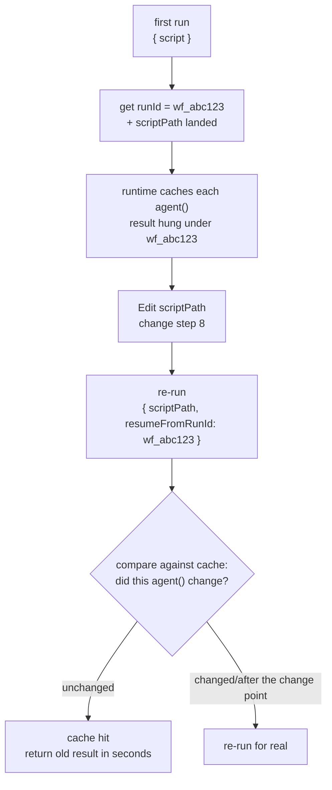
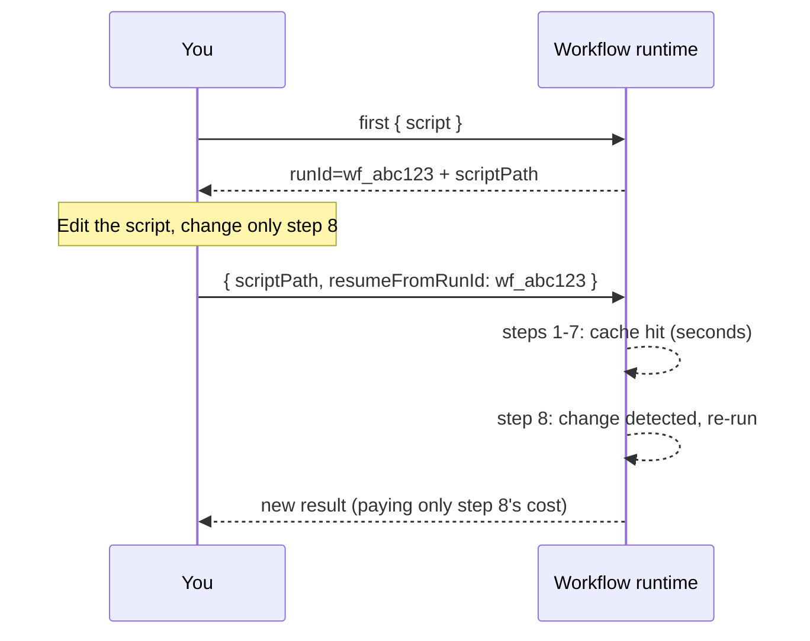

# Chapter 22 · Resume & Caching

> In one sentence: **change step 8 of a long pipeline, and the expensive results of the first 7 steps are reused directly in seconds — this is resume. Re-run with `{ scriptPath, resumeFromRunId }`, and unchanged `agent()` calls hit the cache; only the edited ones and those after them re-run for real.**
>
> This is the closing chapter of Advanced Patterns, and the key to making all those earlier "expensive multi-agent pipelines" **iterable.** It also lifts the lid on a prohibition that runs through the whole book — why `Date.now()` and `Math.random()` are forbidden in scripts.

---

## 22.1 The Pain Point: Change One Step, but Re-Run from Scratch

Say you wrote an 8-stage deep-research pipeline, each stage fanning out several agents, the whole run 500k tokens and several minutes. It finishes, you look at step 8 (the final report's wording), don't like it, and change that step's prompt.

Without resume, your only option is to **re-run the whole pipeline from scratch** — the 400k+ tokens of work in the first 7 steps, whose results haven't changed one bit, have to be burned again and waited out for several minutes. That's brutal when you're iterating a long pipeline: every time you tweak the wording at the end, you foot the bill for the entire run.

Resume exists to kill this waste. Its promise:

> **The same script + the same args → 100% cache hit.** Only the `agent()` calls you **changed** (and the calls after them) re-run for real; the unchanged ones hand you last time's result in seconds.

So iterating a long pipeline turns into: change step 8 → re-run → the first 7 steps hit the cache instantly → only step 8 runs for real. Seconds, not minutes.

<div class="callout info">

**Official semantics (per `_grounding.md` sections A/B)**: `WorkflowInput.resumeFromRunId?: string` — resume: **unchanged `agent()` calls return cached results; same session only.** Use it together with `scriptPath` (the on-disk script path, landed on every call). That `runId` in `WorkflowOutput` (like `wf_...`) is exactly the value you pass to `resumeFromRunId` when resuming.

</div>

---

## 22.2 The Mechanism: The Script Is a File + the runId Anchor

To get how resume works, first grab the two facts from Chapter 01 — here they snap together:

**Fact one: the script is a file.** Per `_grounding.md`, every time Workflow is called, the runtime **lands the script on disk** as a `.js` file under the session directory, and hands back the `scriptPath`. So your workflow isn't a fleeting string but an **editable file sitting on disk.**

**Fact two: every run has a runId.** Per `_grounding.md`, `WorkflowOutput` returns `runId` (like `wf_...`). It's the unique ID of this run — and the **anchor** that all of this run's agent-result cache hangs off of.

Resume just bolts the two together:

1. First run: you get the `runId` (e.g., `wf_abc123`) and the landed `scriptPath`. The runtime caches each `agent()` call's result by its "identity" in the script, all hung under this `runId`.
2. You `Edit` that `scriptPath` file, touching one of the `agent()` calls.
3. Re-run: pass `{ scriptPath, resumeFromRunId: 'wf_abc123' }`. The runtime checks against the cache — **unchanged `agent()` calls take the cached result straight up**, while the changed ones (and those after them) re-execute.



This iteration loop (edit the file + re-run with `scriptPath`) is the full version of Chapter 01's "Want to iterate? Just Write/Edit that file and re-invoke with `{ scriptPath }`, no need to resend the whole script" — resume merely tacks on the key ability to "reuse the cache with `resumeFromRunId`."

<div class="callout warn">

**"Same session only" is a hard limit.** Per `_grounding.md`, resume is valid only within the **same session.** Put differently, the cache's life is tied to the current session — you can't close Claude Code and resume tomorrow with yesterday's `runId`. So resume is a tool for "hammering on a pipeline over and over **within the current iteration session**," not a persistence scheme for "picking up progress across days." State that needs cross-session persistence has to lean on other means (e.g., having an agent write the product to a disk file, see Chapter 19's control plane / data plane idea).

</div>

---

## 22.3 Revealing the Prohibition: Why Date.now() and Math.random() Are Forbidden

Now we can finally settle the prohibition that kept cropping up in Chapters 01 and 02 but never got fully spelled out.

Per `_grounding.md`'s "hard constraints": scripts **forbid `Date.now()` / `Math.random()` / arg-less `new Date()`.** The reason Chapter 01 gave was "they break replayability." This section spells out **why resume needs replayability, and how these two functions wreck it.**

The whole premise of resume is "**the same script necessarily produces the same execution**" — only then can the runtime judge "this `agent()` call didn't change, the cache is good to use." And that judgment rides on one assumption: **the script's logic is deterministic and replayable** — same input, and the state when you reach this point is the same every run.

`Date.now()` and `Math.random()` do exactly the opposite — they **violate** this assumption:

- `Date.now()`: hands back a different timestamp every call. If your script uses it to build a prompt (e.g., `agent(\`Analyze data before ${Date.now()}\`)`), then **the same `agent()` call has a different prompt every re-run** — it "changed," so can you still trust the cache? Resume's judgment logic falls apart.
- `Math.random()`: hands back a different random number every call. Same story — any `agent()` call that leans on it is non-replayable.

```javascript
// ❌ Wrong (illustrative, not run) — breaks replayability, rejected by the runtime
const ts = Date.now()                              // forbidden
const pick = items[Math.floor(Math.random() * 3)]  // forbidden
await agent(`Analyze the ${pick} of ${ts}`)        // different every re-run → resume fails
```

The right alternatives, also spelled out in `_grounding.md`:

**Need a timestamp → pass it in via `args`, or stamp it after the fact.** Feed time in as a parameter from the outside (`args.timestamp`), and the script's insides stay deterministic — the same `args`, the same execution. Or, once the workflow finishes, stamp the result from outside.

```javascript
// ✅ Right (illustrative, not run) — the timestamp passed in via args, staying replayable
await agent(`Analyze data before ${args.cutoffDate}`)
```

**Need randomness/diversity → vary the prompt with the agent's index.** This is the exact trick from Chapter 17's "multi-verifier voting" — use `i` to hand each agent a different perspective, scaring up diversity while staying fully deterministic (same index → same prompt).

```javascript
// ✅ Right (illustrative, not run) — create variation with index, not random
const views = ['performance', 'security', 'readability']
await parallel(views.map((v, i) => () => agent(`Review from the ${views[i]} angle…`)))
```

<div class="callout tip">

**Burn this causal chain into memory**: resume saves money → resume needs to judge "the call didn't change" → that judgment needs the script to be replayable → replayability forbids nondeterminism → hence `Date.now()` / `Math.random()` / arg-less `new Date()` are forbidden. This prohibition isn't the runtime nitpicking; it's the **inevitable price of having "an iterable long pipeline."** Once this chain clicks, you'll stop seeing it as a weird restriction and start proactively "driving all nondeterminism outside the script" (`args`) or "swapping in the index."

</div>

---

## 22.4 In Practice: Iterating a Long Pipeline

Let's bring the mechanism down to what you actually do. Suppose you're iterating a research pipeline, and the flow goes like this:

**Step one — first run, get the runId.** Launch the workflow as usual, and jot down the `runId` and `scriptPath` from the completion notification/return:

```text
Run ID: wf_abc123
Script file: .../workflows/scripts/research-pipeline-wf_abc123.js
```

**Step two — edit the landed script.** Use the `Edit` tool to change the file the `scriptPath` points to directly, e.g., touching only the last consolidation agent's prompt. **Key: don't touch any earlier-stage `agent()` calls**, or their caches get invalidated.

**Step three — re-run with resumeFromRunId.** Call the Workflow tool again, this time passing:

```javascript
// (illustrative, not run) — the input form of a resume call
{
  scriptPath: '.../research-pipeline-wf_abc123.js',
  resumeFromRunId: 'wf_abc123'
}
```

The runtime reuses the caches of every earlier unchanged stage, re-running only the agent you changed and its downstream. You'll watch the first few stages finish **in seconds** (cache hits), with compute spent only past the change point.



<div class="callout tip">

**Real-run confirmation (a 5-agent pipeline, resume = 0 tokens / 3 ms)**: this book ran a 5-agent model-resolution workflow (Run `wf_9c94951d-58c`), running it live the first time; then ran it again as-is with the **completely unchanged script** + `{ scriptPath, resumeFromRunId: 'wf_9c94951d-58c' }`. Put the two runs' usage side by side (same Run ID) —

| Run | Agents | total_tokens | duration_ms |
|---|---|---|---|
| First (real execution) | 5 | **133,691** | **32,959** |
| Resume (100% cache hit) | 5 (all cached) | **0** | **3** |

The 5 results that come back on resume are **identical** to the first run. **The work of 5 agents, all cache-hit on resume — 0 new tokens, back in 3 milliseconds** (the first run was 133k tokens, 33 seconds). The runtime replays each `agent()`'s result straight from the journal, without re-dispatching a single subagent. This turns "same script + same args → 100% hit" from a promise into hard numbers, and empirically settles the next section's "do cache hits count tokens": **they don't.** The raw record is in `assets/transcripts/api-facts-r4.md` (there's also an earlier single-agent resume `wf_dacbd480-d5d`, 0 tokens / 8 ms, same conclusion, in `assets/transcripts/advanced.md`).

</div>

<div class="callout warn">

**Every call after the change point re-runs, even if it didn't change one bit itself.** That's because resume "invalidates from the change point onward" — if step 8 changed, steps 9 and 10's inputs may shift as a result, so they must re-run too to guarantee correctness. **Corollary: put the steps you're most likely to keep adjusting later in the pipeline** to squeeze the most cache benefit. If you always tweak step 2, then everything after step 3 must re-run, and resume saves you little. Put the "stable, expensive" up front and the "mutable, needs endless polish" at the back — that's pipeline design for resume-friendliness.

</div>

<div class="callout info">

**"What counts as a change" — which fields make an `agent()` lose its cache?** The boundary this book tested is: **same script + same args = 100% hit** (`wf_9c94951d-58c`) — that one is hard-tested. On top of that, R8 ran a controlled test (baseline `wf_4ffde230-535`, 3 agents / 91,044 tokens) that isolated two fields one at a time: **change only one agent's `label` (everything else left alone) → resume is a 0-token full hit ⇒ `label` is not in the cache key**; **change only its `prompt` (label restored) → 91,044 re-runs as 60,702 tokens (≈2/3 of baseline), with agents before the change point still hitting and that agent plus its downstream re-running ⇒ `prompt` is in the key.** So the steadiest mental model is still the conservative one: **if you change the `prompt` fed to an agent, or the upstream data it leans on, treat it as having lost the cache**; to reliably keep your cache hits, leave the script and args completely untouched (change only the one step you genuinely want to re-run, plus its downstream).

As for **whether the remaining fields are in the key** — third-party community material claims `schema / model / isolation / agentType` from `opts` are in the key, with `phase` being cosmetic and left out. **This book has not yet isolated and verified these fields one by one**, so they're marked in their entirety as **claimed by third-party community material, not independently tested by this book** (the already-tested `label`/`prompt` are above, not in this list). In practice you don't need to memorize the exact list — just follow the conservative coarse rule "changing prompt/upstream data means treat the cache as lost" and you can iterate safely.

</div>

---

## 22.5 Resume's Interaction with budget and Nesting

Resume isn't a standalone feature; it has some subtle interactions with the mechanisms of the earlier chapters, and sorting them out saves you from potholes.

**Relationship with budget (Chapter 21): do cache hits still count tokens?** Resume earns its keep precisely because "hit calls don't re-execute" — since they don't execute, they naturally don't burn model-reasoning tokens. This book's real resume run has confirmed it: the 5-agent pipeline's cache-hit re-run had `total_tokens=0` (see the "real-run confirmation" above, Run `wf_9c94951d-58c`, raw record `assets/transcripts/api-facts-r4.md`). So resume **genuinely saves tokens** — **the marginal cost of iteration comes only from the part you changed**, and the earlier hit stages are nearly free.

**Relationship with nested `workflow()` (Chapter 20).** Resume's "unchanged `agent()` hits the cache" is aimed at the `agent()` calls in the current workflow script. Once the script has a `workflow()` sub-call, how resume plays with the sub-workflow's cache isn't expanded by the sources; it's "(to be verified)" — when you're actually iterating a workflow with nesting, confirm by watching the real cache-hit behavior via `/workflows`.

**Relationship with worktree (Chapter 19).** A worktree-isolated agent drags in file-system side effects. When resume re-runs the agents after the change point, how those side effects get handled (re-create the worktree?) is likewise a detail not covered by the sources, marked "(to be verified)."

<div class="callout info">

**A safe practice principle**: resume's most reliable, most officially-backed scenario is "a **read-only, structured-data-only** multi-stage pipeline" — think research, review, analysis. Such a workflow's `agent()` calls carry no external side effects, and the meaning of a cache hit is clean and unambiguous (same input → same output → safely reusable). For the complex cases with file writes (worktree) or nested sub-workflows, resume's behavior has details not covered by the sources; **watch the actual hits with `/workflows`**, don't assume. This squares with the book-wide discipline of "never speculate about an API from memory."

</div>

---

## 22.6 A Resume-Friendly Design Checklist

Boil this chapter's experience down into a "make your workflow resume-friendly" design checklist:

| Principle | Practice | Reason |
|---|---|---|
| **Eliminate nondeterminism** | Forbid `Date.now()` / `Math.random()` / arg-less `new Date()` | They break replayability, resume's judgment fails (the runtime rejects them) |
| **Drive nondeterminism outside** | Timestamps via `args`; diversity via `index` | Keep the script body deterministic, same input same execution |
| **Put mutable steps later** | Stable expensive ones up front, repeatedly-polished ones at the back | Everything after the change point re-runs; later changes maximize cache benefit |
| **Make good use of script landing** | When iterating, `Edit` the landed script + re-run with `scriptPath` | No need to resend the whole script, and it provides a file anchor for resume |
| **Remember the runId** | After the first run, note the `runId` for resume | The source of `resumeFromRunId`'s value |
| **Iterate within a session** | Resume is valid only in the same session | Cross-session needs separate disk persistence |
| **Observe complex cases first** | With worktree/nesting, watch hits via `/workflows` | Resume details for these scenarios aren't covered by the sources |

<div class="callout tip">

**Resume turns "writing a workflow" into a real 'programming' experience.** Without resume, every script change pays the full-run cost, and iteration gets so pricey you don't dare adjust lightly — it feels more like "tossing off a batch job once." With resume, you change a line, re-run, and see the local effect in seconds, just like debugging code in a REPL: **changes are cheap, feedback is instant.** This is a big engineering edge of Workflow's "deterministic script" over "probabilistic prompt orchestration" — determinism makes caching possible, and caching makes rapid iteration possible.

</div>

---

## 22.7 Chapter Summary

- **Resume**: re-run with `{ scriptPath, resumeFromRunId }`, and **unchanged `agent()` calls hit the cache in seconds**, only the edited ones and those **after** them re-run for real. The promise is "same script + same args → 100% hit."
- The mechanism = **the script is a file** (every call lands `scriptPath`) + **the runId anchor** (`WorkflowOutput.runId` is where the cache mounts, and the value of `resumeFromRunId`).
- **Resume is valid only in the same session**; cross-session persistence needs separate means like having agents write to disk.
- The causal chain that reveals the prohibition: resume saves money → needs to judge "the call didn't change" → needs the script to be **replayable** → forbids nondeterminism → hence `Date.now()` / `Math.random()` / arg-less `new Date()` are forbidden. Alternatives: timestamps via `args`, diversity via `index`.
- **Resume-friendly design**: put mutable steps later in the pipeline (everything after the change point re-runs), stable expensive ones up front.
- The fine interactions with budget/nesting/worktree have parts not covered by the sources (marked "(to be verified)"); the most reliable scenario is a **read-only, structured-data-only** multi-stage pipeline, and for complex cases watch the actual hits with `/workflows`.

This chapter closes out Advanced Patterns. From adversarial verification and loop-until-dry to worktree isolation, nesting, dynamic budget, and resume — you've now got all the advanced weapons for running Workflow at production grade. In the next part, we turn our gaze to the community: how the four major orchestration systems "simulated" these capabilities before native Workflow, and which gems are worth rewriting as reusable workflows with `phase`/`schema`.

> Continue reading: [Chapter 23 · Four Systems Compared](#/en/p5-23)

---

[← Back to main README](../../README.md) · [中文 README →](../../README.md)
