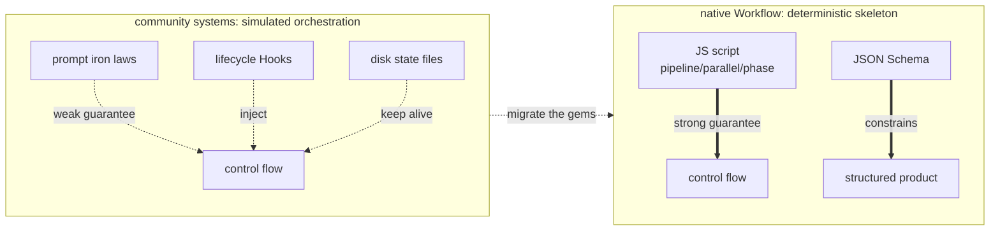

# Chapter 23 · Four Systems Compared

> Long before native Workflow showed up, the community had been "orchestrating" multiple agents with all kinds of clever tricks. This chapter pops the hood on four representative open-source systems — `ccg-workflow`, `superpowers`, `oh-my-claudecode`, `oh-my-openagent` — to see their **real orchestration mechanisms**, then picks out the gems that native Workflow can reuse.
>
> Every mechanism description here is based on a genuine reading of each repo's source code (file paths are noted); the goal is to "take the best," not to rank them.

---

## 23.1 An Insight Running Through the Whole Chapter

Let's put the conclusion up front, then look at the evidence:

> **These four systems all were born before native Workflow; they all use "prompts + lifecycle hooks + disk state files" to _simulate_ a deterministic orchestration engine.** Because for a long stretch, Claude Code (and similar harnesses) had no native ability to "orchestrate agents with code."

The patches each one came up with — leaning on disk state to fight context compaction, Hook-injected "breadcrumbs" to keep it from drifting, the `Stop` hook refusing to wrap up early, tool-layer `throw` guardrails — are all clever. But native Workflow, with `pipeline`/`parallel`/`phase` + JSON Schema, hands you in one go the **deterministic skeleton** they fought so hard to keep alive.

So the through-line of this chapter (and Chapter 24) is: **native Workflow gives the skeleton; these four systems' gems are the "resilience layer" sitting on top of it.** Only when you combine the two do you get production-grade orchestration.

<div class="callout info">

**The through-line insight (remember this one sentence; the whole chapter argues it)**: these four systems **were all born before native Workflow**, so they could only use "prompts + lifecycle Hooks + disk state files" to **simulate** a deterministic orchestration engine — ccg by injecting a `<ccg-state>` breadcrumb each turn, OMC by intercepting stopping with the `Stop` hook, OmO by intercepting file writes with a tool-layer `throw`, superpowers by injecting a "behavioral constitution" via `SessionStart`. These are all clever patches dreamed up under the constraint of **having no native control flow**. Native Workflow fills in, all at once, the two things they most lacked: **the deterministic skeleton given by `pipeline`/`parallel`/`phase`**, and **the tool-layer hard constraint given by JSON Schema**. As you read each later section, try mapping "what Hook/state file it uses to simulate this" onto "which primitive native Workflow just hands you directly."

</div>



---

## 23.2 ccg-workflow: Multi-Model Collaboration + Disk State Keeping Alive

**What it is**: CCG (Claude + Codex + Gemini) is a multi-model collaboration workflow engine installed on top of Claude Code. A single `/ccg:go` natural-language entry automatically judges task type/complexity/risk, picks one of 10 strategies, and pulls in external models for cross-verification while it runs. It fixes three pains: a single agent drifting on a long task, losing progress after context compaction, and a single model having blind spots.

**Real orchestration mechanism** (four layers stacked):

- **Slash command used as role injection**: `templates/commands/go.md` turns Claude into the "CCG Engine," walking it through the Phase 0–3 decision matrix.
- **Strategy files = prompt state machines**: e.g. `templates/engine/strategies/full-collaborate.md`, using `[phase-state:N]` to mark phases, `Gate`, `HARD STOP` checkpoints, and updating `task.json` one phase at a time.
- **A JS Hook engine (real code, zero dependencies)**: `templates/hooks/` injected into `~/.claude/settings.json`. Of these, `workflow-state.js` reads `task.json` on every `UserPromptSubmit` and injects a `<ccg-state>` breadcrumb — **this is the key to fighting context compaction**; `task-utils.js`'s `detectLoop` keeps a 10-turn rolling buffer and fires a deadlock warning after 3 consecutive turns stuck in the same phase.
- **A dual-track execution layer**: either Agent Teams in parallel, or external models via `~/.claude/bin/codeagent-wrapper` (a real Go binary, semaphore concurrency + DAG dependency scheduling).

**The single most worth-learning point**: **"disk state + per-turn Hook breadcrumb injection."** Land the workflow progress to disk as `task.json`, and re-feed it to the model each turn with a tiny `<ccg-state>` — solving, at the lowest possible cost, the root problem of the agent forgetting what it's doing on long tasks and after compaction.

The next **two forms you can actually see and touch** ground the abstraction above:

First, **the "10 strategies" aren't marketing copy — they're a table you can count off** — `templates/commands/go.md`'s appendix lists exactly 10, each one mapping to a real strategy file under `templates/engine/strategies/`, and `/ccg:go` picks one in Phase 0 based on task type/complexity/risk:

```text
direct-fix · quick-implement · guided-develop · full-collaborate · debug-investigate
refactor-safely · deep-research · optimize-measure · review-audit · git-action
```

Second, **multi-model routing is whatever the config says**. Which config actually takes effect is governed by the defaults in `src/utils/config.ts` (note: the `model-router.md` doc example writes gemini, but the runtime is governed by config.ts):

```javascript
// ccg-workflow · src/utils/config.ts defaults (source: _grounding.md D2)
const defaults = {
  frontend: { primary: 'antigravity' },          // frontend task → antigravity
  backend:  { primary: 'codex' },                // backend task → codex
  review:   { models: ['codex', 'antigravity'] },// review → two models in parallel, cross-verifying
}
```

External models land via `~/.claude/bin/codeagent-wrapper` (a real Go binary): its `executor.go` uses `topologicalSort` (layered topological sort with cycle detection) to work out the task DAG, then a `sem := make(chan struct{}, workerLimit)` semaphore in `executeConcurrentWithContext` to cap concurrency — which is precisely one humble take on "deterministic scheduling," and exactly what native Workflow hands you in a single line with `pipeline`/`parallel`.

> By the way: this book's multi-model review (codex reviews content, antigravity reviews the frontend) runs exactly through CCG's `codeagent-wrapper` plus the `/ccg:frontend`, `/ccg:review` routing — `review.models=['codex','antigravity']`, two models cross-verifying in parallel.

---

## 23.3 superpowers: Methodology as a Plugin + Two-Stage Review

**What it is** (obra/superpowers): a **complete software development methodology** for coding agents, made of a set of composable skills plus a boot bootstrap, across 7 harnesses, zero dependencies. It forces the agent to "first step back and clarify intent, produce a spec, write a plan, then implement with TDD," curing the common ailment of grabbing a requirement and going head-down into code.

**Real orchestration mechanism** (no JS orchestrator, no `commands/`/`agents/` directories — purely four layers of soft conventions):

- **A boot bootstrap hook**: `hooks/hooks.json` registers `SessionStart`, wraps the entire `using-superpowers/SKILL.md` in `<EXTREMELY_IMPORTANT>` and injects it into context — `CLAUDE.md` puts it bluntly: "without this bootstrap, the skills are dead code."
- **Mandatory skill self-check**: it mandates that **before any reply** (even just answering a question) it must first check skills, "if there's a 1% chance it's relevant it must be invoked."
- **Skills strung into a flow**: each skill ends by spelling out the next one with `REQUIRED SUB-SKILL`, forming the deterministic chain `brainstorming → writing-plans → subagent-driven-development → finishing-a-branch`.
- **State files are the handoff**: specs get written to `docs/superpowers/specs/`, plans tracked with `- [ ]` checkboxes.

**What its "two-stage review" looks like**: in `subagent-driven-development/SKILL.md`, each task's acceptance is a chain of **two stages in series, each looping until it passes** — here's the shape sketched in pseudocode (prompt semantics, not a runnable script):

```text
# superpowers two-stage review (pseudocode · reconstructing SKILL.md's control structure)
for each task:
  loop:                               # stage 1: spec compliance
    review_spec(task)                 # over-implemented? under-implemented?
    if compliant: break
    fix(task); # review again
  loop:                               # stage 2: code quality
    review_quality(task)              # naming/error handling/edge cases
    if good: break
    fix(task); # review again
  # only after both stages pass, move to the next task
```

Note its "guarantee" rides entirely on a prompt asking the model to "review once more" — a **soft convention**, not a hard control flow. This can be landed exactly as a **deterministic quality gate** with native Workflow's `pipeline` (two stages in series) + JSON Schema (a `pass: boolean` gate field) — Chapter 24 will weld this pseudocode into a runnable script line by line.

Also worth jotting down: superpowers' subagent **structured state returns** wrap up with a set of fixed enum words — `DONE` / `BLOCKED` / `NEEDS_REVIEW` and the like — so upstream can branch on them. That's really the embryo of "free text → a decidable conclusion," and native Workflow's `schema enum` upgrades it from a convention into a tool-layer enforcement.

---

## 23.4 oh-my-claudecode: The Stop Hook Persistent Loop

**What it is**: a large orchestration plugin for Claude Code that packages "multi-agent collaboration + persistent execution + quality gating" into an out-of-the-box workflow, curing the problem of a complex task getting silently declared half-finished.

**Real orchestration mechanism** (hooks + state files + skills + 20-role subagents):

- **Hook-driven** (`hooks/hooks.json`): `UserPromptSubmit→keyword-detector` spots magic words and injects the corresponding SKILL; `SubagentStop→verify-deliverables`; **`Stop→persistent-mode`** — the soul of it: it checks whether `.omc/state/` has an active mode, and if so **blocks stopping** and re-injects "The boulder never stops" to drive a loop.
- **State files are the control plane**: `.omc/state/sessions/{id}/` stores mode/phase/iteration, keeping the control plane and the data plane (`.omc/plans/`, `prd.json`) apart, so it can resume after a crash.
- **PRD-driven + independent reviewer sign-off**: `ralph` requires each story in `prd.json` to be `passes:true` and verified by an independent critic before it counts as done.

**What the `Stop` hook's soul logic looks like**: it turns "whether stopping is allowed" into a judgment that runs at the `Stop` lifecycle point — sketched in pseudocode (reconstructing `persistent-mode`'s control structure, not a runnable script):

```javascript
// OMC · Stop-hook pseudocode — "the boulder never stops"
// Trigger point: when Claude is about to end this turn
function onStop() {
  const mode = readActiveMode('.omc/state/')        // disk state: is a mode running?
  if (!mode) return { allow: true }                 // no active mode → let through, stop normally
  if (mode.allStoriesPass) return { allow: true }   // every PRD story is passes:true → let through
  return {                                          // otherwise: block stopping + re-inject a continuation prompt
    allow: false,
    inject: 'The boulder never stops. Keep advancing the unfinished stories.',
  }
}
```

This is exactly the physical implementation of "finishing ≠ done": it keeps the loop alive by **intercepting the act of stopping.** Note it pushes both the criterion (`allStoriesPass`) and the state (mode/phase/iteration) out to `.omc/state/` on disk — because a prompt-driven loop has no memory.

**The single most worth-learning point**: **using the `Stop` hook + state files to build a "completion-criteria loop."** Native Workflow ends the moment the script finishes; OMC instead makes "whether stopping is allowed" a programmable gate. Bring this idea into Workflow — and pair it with JSON Schema validation of the product — and you can upgrade "the pipeline finished" to "it counts as done only when acceptance criteria are met" (Chapter 18's "loop-until-dry" is its Workflow incarnation). Put the `Stop` hook above next to Chapter 24's `while (!accepted)` loop: hook interception + disk state collapse down into a `while` and a few local variables.

---

## 23.5 oh-my-openagent: Tool-Layer Guardrails + Untrusted Verification

**What it is** (OmO, built on **opencode**, not Claude Code): a plugin-style Agent OS published as an npm package, blowing a single agent up into a "development team" (**10 registered built-in roles**, e.g. Atlas commanding / Sisyphus executing / Metis…; planning is carried by the **Prometheus persona** — it appears in prompts but is not in the registered builtin-agent union), models can be mixed and matched, the entry is `ultrawork`/`ulw`.

**Real orchestration mechanism** (a runtime harness: plugin hooks + custom tools + state files):

- **Slash command + hook role-switching**: `/start-work` gets intercepted by `start-work-hook.ts`, which reads `boulder.json` to tell resume from init, then switches over to Atlas.
- **Programmatic subagent dispatch**: the `task()`/`call_omo_agent` tools really do call the opencode API to spin up a child session and poll it.
- **system-reminder injection driving the loop**: Atlas's hook family injects, every turn, `BOULDER_CONTINUATION_PROMPT` and `VERIFICATION_REMINDER` ("the sub-agent says it's done — it's lying, go verify"), and injects `DELEGATION_REQUIRED` to yank Atlas back when it oversteps to edit code.
- **Tool-layer guardrails**: `prometheus-md-only/hook.ts` hard-intercepts before tool calls — the planner's `Write/Edit` may only write `.omo/*.md`, and violations directly `throw`. **The planner physically cannot write code.**

**A few forms you can actually see and touch**:

The entry is a regex keyword. `keyword-detector/constants.ts` matches the user's message against `/\b(ultrawork|ulw)\b/i` and, on a hit, summons the whole orchestration — and it sharing a name with native Workflow's nickname `ultrawork` is no coincidence.

The built-in roles it registers number exactly **10** (the `BuiltinAgentName` union in `src/agents/types.ts`):

```text
sisyphus · hephaestus · oracle · librarian · explore
multimodal-looker · metis · momus · atlas · sisyphus-junior
```

(The planning persona **Prometheus** appears in prompts but is **not** in this registered union — it's a "persona," not a dispatchable builtin agent.)

And the guardrail that makes the planner "physically unable to write code" is essentially a single `throw` at the tool-call layer — sketched in pseudocode (reconstructing `prometheus-md-only/hook.ts`'s interception logic):

```javascript
// OmO · tool-layer guardrail pseudocode — the planner may only write .omo/*.md
function beforeToolCall(tool, args) {
  if (tool === 'Write' || tool === 'Edit') {
    if (!args.path.match(/^\.omo\/.*\.md$/)) {
      throw new Error('Planner may only write .omo/*.md')   // physical interception, not a prompt request
    }
  }
}
```

This turns "the planner shouldn't touch code" from a **prompt prayer** into a **runtime physical wall** — which is exactly the motif Chapter 24 will natively rewrite as "a `schema`-constrained planner that can only emit a plan object."

**The single most worth-learning point**: **using tool-layer guardrails + system-reminder injection to enforce discipline, instead of praying through prompts.** And **delegating by Category (semantic intent) rather than by model name** — the LLM sees `category="quick"/"ultrabrain"`, and the runtime maps that onto a model fallback chain, killing off the distribution bias of "the model self-limiting," with models staying hot-swappable. This is instructive for Workflow's `agent({model})` selection: decide by "task category" rather than a hard-coded model name.

---

## 23.6 Comparison at a Glance

| System | Host | Orchestration mechanism | Determinism | Strongest suit | One-line takeaway |
|---|---|---|---|---|---|
| **ccg-workflow** | Claude Code | Prompt state machine + JS Hook + Go bridging multi-models | Weak (prompt constraints) | Multi-model cross-verification + compaction resistance | Disk state + per-turn breadcrumb injection |
| **superpowers** | Across 7 harnesses | Skill chain + SessionStart-injected "constitution" | Weak (probabilistic) | Methodological discipline (TDD/brainstorm) | The two-stage review loop |
| **oh-my-claudecode** | Claude Code | hooks + state files + 20 roles | Medium (Stop hook fallback) | Resilience (resume/anti-silent-failure) | The Stop hook = a completion-criteria loop |
| **oh-my-openagent** | opencode | hooks + custom tools + state files | Medium (tool-layer guardrails) | Boundary guardrails + category delegation | Tool-layer throw + Category delegation |
| **native Workflow** | Claude Code | **JS script pipeline/parallel/phase + Schema** | **Strong (code)** | Determinism + structuring + reusability | —— |

**How to read it**: the left four columns are "simulated orchestration," the last row is "the native skeleton." They aren't competitors — **the best practice is to use native Workflow as the skeleton and weld these four's gems on as a resilience layer on top.**

<div class="callout warn">

**Don't copy that whole "orchestration mechanism" column verbatim.** That column lists the **implementation** (hooks/state files/Go bridging on some host), not the **pattern.** What you actually want is the **control structure** behind the "strongest suit" and "takeaway" columns — the essence of disk breadcrumbs is "pass structured state explicitly," the essence of the `Stop` hook is "the completion criterion is programmable," the essence of the tool-layer `throw` is "role boundaries are system-enforced." Copy the implementation into native Workflow and you get "an organ grown on someone else's host" — rejected on the spot. **How to peel the pattern out of the implementation, then grow a fresh implementation with `phase`/`schema`, is the entire subject of the next chapter.**

</div>

---

## 23.7 Chapter Summary

- All four major systems, before native Workflow existed, simulated deterministic orchestration with **prompts + Hooks + state files.**
- Each one's gem: ccg = disk-state breadcrumbs; superpowers = the two-stage review; OMC = the Stop-hook completion criteria; OmO = tool-layer guardrails + category delegation.
- Native Workflow supplies the **deterministic skeleton + Schema constraints** they were missing; the two complement each other.

In the next chapter, we turn "how to systematically distill and abstract good ideas out of other people's systems, then rewrite them into your own reusable Workflow with `phase`/`schema`" into a methodology.

> Continue reading: [Chapter 24 · The Art of Extraction](#/en/p5-24)
