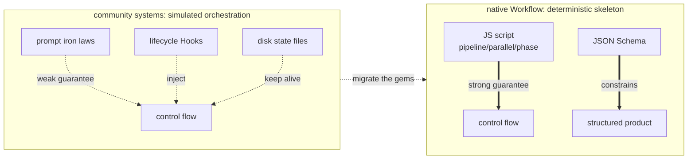

# Chapter 23 · Four Systems Compared

> Before native Workflow appeared, the community had long "orchestrated" multiple agents with various clever tricks. This chapter pops the hood on four representative open-source systems — `ccg-workflow`, `superpowers`, `oh-my-claudecode`, `oh-my-openagent` — to see their **real orchestration mechanisms**, and distills the gems reusable by native Workflow.
>
> All mechanism descriptions in this chapter are based on a genuine reading of each repository's source code (file paths are noted), aiming to "take the best," not to rank them.

---

## 23.1 An Insight Running Through the Whole Chapter

The conclusion first, then the evidence:

> **These four systems all were born before native Workflow; they all use "prompts + lifecycle hooks + disk state files" to _simulate_ a deterministic orchestration engine.** Because for a long time, Claude Code (and similar harnesses) had no native ability to "orchestrate agents with code."

The patches each invented — disk state against context compaction, Hook-injected "breadcrumbs" to prevent drift, the `Stop` hook refusing premature wrap-up, tool-layer `throw` guardrails — are all clever. And native Workflow, with `pipeline`/`parallel`/`phase` + JSON Schema, provides in one go the **deterministic skeleton** they painstakingly maintained.

So the through-line of this chapter (and Chapter 24) is: **native Workflow gives the skeleton; these four systems' gems are the "resilience layer" on top of the skeleton.** Only combining the two makes production-grade orchestration.

<div class="callout info">

**The through-line insight (remember this one sentence; the whole chapter argues it)**: these four systems **were all born before native Workflow**, so they could only use "prompts + lifecycle Hooks + disk state files" to **simulate** a deterministic orchestration engine — ccg by injecting a `<ccg-state>` breadcrumb each turn, OMC by intercepting stopping with the `Stop` hook, OmO by intercepting file writes with a tool-layer `throw`, superpowers by injecting a "behavioral constitution" via `SessionStart`. These are all ingenious patches under the constraint of **having no native control flow**. Native Workflow fills in, all at once, the two things they most lacked: **the deterministic skeleton given by `pipeline`/`parallel`/`phase`**, and **the tool-layer hard constraint given by JSON Schema**. As you read each later section, map "what Hook/state file it uses to simulate" onto "which primitive native Workflow gives directly."

</div>



---

## 23.2 ccg-workflow: Multi-Model Collaboration + Disk State Keeping Alive

**What it is**: CCG (Claude + Codex + Gemini) is a multi-model collaboration workflow engine installed on top of Claude Code. A single `/ccg:go` natural-language entry automatically judges task type/complexity/risk, picks one of 10 strategies, and coordinates external models for cross-verification during execution. It solves three pains: "a single agent drifting on a long task, losing progress after context compaction, a single model having blind spots."

**Real orchestration mechanism** (four layers stacked):

- **Slash command as role injection**: `templates/commands/go.md` turns Claude into the "CCG Engine," walking the Phase 0–3 decision matrix.
- **Strategy files = prompt state machines**: e.g., `templates/engine/strategies/full-collaborate.md`, using `[phase-state:N]` to mark phases, `Gate`, `HARD STOP` checkpoints, updating `task.json` phase by phase.
- **A JS Hook engine (real code, zero dependencies)**: `templates/hooks/` injected into `~/.claude/settings.json`. Among them, `workflow-state.js` on every `UserPromptSubmit` reads `task.json` and injects a `<ccg-state>` breadcrumb — **this is the key to fighting context compaction**; `task-utils.js`'s `detectLoop` maintains a 10-turn rolling buffer, triggering a deadlock warning on 3 consecutive turns in the same phase.
- **A dual-track execution layer**: Agent Teams in parallel, or external models via `~/.claude/bin/codeagent-wrapper` (a real Go binary, semaphore concurrency + DAG dependency scheduling).

**The single most worth-learning point**: **"disk state + per-turn Hook breadcrumb injection."** Land the workflow progress to disk as `task.json`, and re-feed it to the model each turn with a minimal `<ccg-state>` — solving, at the lowest cost, the root problem of "the agent forgetting what it's doing" on long tasks/after compaction.

**Two observable concrete forms** ground the abstraction above:

First, **the "10 strategies" aren't marketing copy but an enumerable table** — `templates/commands/go.md`'s appendix lists exactly 10, each corresponding to a real strategy file under `templates/engine/strategies/`, and `/ccg:go` picks one in Phase 0 based on task type/complexity/risk:

```text
direct-fix · quick-implement · guided-develop · full-collaborate · debug-investigate
refactor-safely · deep-research · optimize-measure · review-audit · git-action
```

Second, **multi-model routing is config-driven**. The effective config is governed by the defaults in `src/utils/config.ts` (note: the `model-router.md` doc example writes gemini, but the runtime is governed by config.ts):

```javascript
// ccg-workflow · src/utils/config.ts defaults (source: _grounding.md D2)
const defaults = {
  frontend: { primary: 'antigravity' },          // frontend task → antigravity
  backend:  { primary: 'codex' },                // backend task → codex
  review:   { models: ['codex', 'antigravity'] },// review → two models in parallel, cross-verifying
}
```

External models land via `~/.claude/bin/codeagent-wrapper` (a real Go binary): its `executor.go` uses `topologicalSort` (layered topological sort with cycle detection) to resolve the task DAG, then a `sem := make(chan struct{}, workerLimit)` semaphore in `executeConcurrentWithContext` to bound concurrency — which is precisely one humble implementation of "deterministic scheduling," and exactly what native Workflow gives you in a single line with `pipeline`/`parallel`.

> By the way: this book's multi-model review (codex reviews content, antigravity reviews the frontend) is implemented exactly via CCG's `codeagent-wrapper` and the `/ccg:frontend`, `/ccg:review` routing — `review.models=['codex','antigravity']`, two models in parallel cross-verifying.

---

## 23.3 superpowers: Methodology as a Plugin + Two-Stage Review

**What it is** (obra/superpowers): a **complete software development methodology** for coding agents, made of a set of composable skills + a boot bootstrap, across 7 harnesses, zero dependencies. It forces the agent to "first step back to clarify intent, produce a spec, write a plan, then implement with TDD," solving the common ailment of "getting a requirement and immediately head-down writing code."

**Real orchestration mechanism** (no JS orchestrator, no `commands/`/`agents/` directories, relying purely on four-layer soft conventions):

- **A boot bootstrap hook**: `hooks/hooks.json` registers `SessionStart`, wrapping the entire `using-superpowers/SKILL.md` in `<EXTREMELY_IMPORTANT>` and injecting it into context — `CLAUDE.md` states plainly "without this bootstrap, the skills are dead code."
- **Mandatory skill self-check**: it mandates that **before any reply** (even just a question) it must first check skills, "if there's a 1% chance it's relevant it must be invoked."
- **Skills linked into a flow**: each skill ends by explicitly naming the next with `REQUIRED SUB-SKILL`, forming the deterministic chain `brainstorming → writing-plans → subagent-driven-development → finishing-a-branch`.
- **State files as handoff**: specs are written to `docs/superpowers/specs/`, plans tracked with `- [ ]` checkboxes.

**What its "two-stage review" looks like**: in `subagent-driven-development/SKILL.md`, each task's acceptance is a chain of **two stages in series, each looping until it passes** — sketched in pseudocode (prompt semantics, not a runnable script):

```text
# superpowers two-stage review (pseudocode · reconstructing SKILL.md's control structure)
for each task:
  loop:                               # stage 1: spec compliance
    review_spec(task)                 # over-implemented? under-implemented?
    if compliant: break
    fix(task); # review again
  loop:                               # stage 2: code quality
    review_quality(task)              # naming/error handling/edge cases
    if good: break
    fix(task); # review again
  # only after both stages pass, move to the next task
```

Note its "guarantee" relies entirely on a prompt asking the model to "review once more" — a **soft convention**, not a hard control flow. This can be landed exactly as a **deterministic quality gate** with native Workflow's `pipeline` (two stages in series) + JSON Schema (a `pass: boolean` gate field) — Chapter 24 will weld this pseudocode into a runnable script line by line.

Also worth noting: superpowers' subagent **structured state returns** close out with a set of fixed enum words — `DONE` / `BLOCKED` / `NEEDS_REVIEW` and the like — letting upstream branch on them. This is in fact the embryo of "free text → a decidable conclusion," and native Workflow's `schema enum` upgrades it from a convention into a tool-layer enforcement.

---

## 23.4 oh-my-claudecode: The Stop Hook Persistent Loop

**What it is**: a large orchestration plugin for Claude Code, packaging "multi-agent collaboration + persistent execution + quality gating" into an out-of-the-box workflow, solving "a complex task being silently declared half-finished."

**Real orchestration mechanism** (hooks + state files + skills + 20-role subagents):

- **Hook-driven** (`hooks/hooks.json`): `UserPromptSubmit→keyword-detector` detects magic words and injects the corresponding SKILL; `SubagentStop→verify-deliverables`; **`Stop→persistent-mode`** — the soul: it checks whether `.omc/state/` has an active mode, and if so **blocks stopping** and re-injects "The boulder never stops" to implement a loop.
- **State files as the control plane**: `.omc/state/sessions/{id}/` stores mode/phase/iteration, separating control plane from data plane (`.omc/plans/`, `prd.json`), supporting post-crash resume.
- **PRD-driven + independent reviewer sign-off**: `ralph` requires each story in `prd.json` to be `passes:true` and verified by an independent critic to count as done.

**What the `Stop` hook's soul logic looks like**: it turns "whether stopping is allowed" into a judgment executed at the `Stop` lifecycle point — sketched in pseudocode (reconstructing `persistent-mode`'s control structure, not a runnable script):

```javascript
// OMC · Stop-hook pseudocode — "the boulder never stops"
// Trigger point: when Claude is about to end this turn
function onStop() {
  const mode = readActiveMode('.omc/state/')        // disk state: is a mode running?
  if (!mode) return { allow: true }                 // no active mode → let through, stop normally
  if (mode.allStoriesPass) return { allow: true }   // every PRD story is passes:true → let through
  return {                                          // otherwise: block stopping + re-inject a continuation prompt
    allow: false,
    inject: 'The boulder never stops. Keep advancing the unfinished stories.',
  }
}
```

This is precisely the physical implementation of "finishing ≠ done": it keeps the loop alive by **intercepting the act of stopping.** Note it externalizes both the criterion (`allStoriesPass`) and the state (mode/phase/iteration) to `.omc/state/` on disk — because a prompt-driven loop has no memory.

**The single most worth-learning point**: **using the `Stop` hook + state files to form a "completion-criteria loop."** Native Workflow ends when the script finishes; OMC makes "whether stopping is allowed" a programmable gate. Bring this idea into Workflow — combined with JSON Schema validation of the product, you can upgrade "the pipeline finished" to "it counts as done only when acceptance criteria are met" (Chapter 18's "loop-until-dry" is its Workflow incarnation). Compare the `Stop` hook above with Chapter 24's `while (!accepted)` loop: hook interception + disk state collapse into a `while` and a few local variables.

---

## 23.5 oh-my-openagent: Tool-Layer Guardrails + Untrusted Verification

**What it is** (OmO, built on **opencode**, not Claude Code): a plugin-style Agent OS published as an npm package, extending a single agent into a "development team" (**10 registered built-in roles**, e.g. Atlas commanding / Sisyphus executing / Metis…; planning is carried by the **Prometheus persona** — it appears in prompts but is not in the registered builtin-agent union), with mixable multi-models, entry `ultrawork`/`ulw`.

**Real orchestration mechanism** (a runtime harness: plugin hooks + custom tools + state files):

- **Slash command + hook role-switching**: `/start-work` is intercepted by `start-work-hook.ts`, which reads `boulder.json` to judge resume/init, then switches to Atlas.
- **Programmatic subagent dispatch**: the `task()`/`call_omo_agent` tools genuinely call the opencode API to create a child session and poll.
- **system-reminder injection driving the loop**: Atlas's hook family injects each turn `BOULDER_CONTINUATION_PROMPT`, `VERIFICATION_REMINDER` ("the sub-agent says it's done — it's lying, go verify"), and injects `DELEGATION_REQUIRED` to pull Atlas back when it oversteps to edit code.
- **Tool-layer guardrails**: `prometheus-md-only/hook.ts` hard-intercepts before tool calls — the planner's `Write/Edit` may only write `.omo/*.md`, violations directly `throw`. **The planner physically cannot write code.**

**Several observable concrete forms**:

The entry is a regex keyword. `keyword-detector/constants.ts` matches the user's message with `/\b(ultrawork|ulw)\b/i` to summon the whole orchestration — sharing the name with native Workflow's nickname `ultrawork` is no coincidence.

The built-in roles it registers number exactly **10** (the `BuiltinAgentName` union in `src/agents/types.ts`):

```text
sisyphus · hephaestus · oracle · librarian · explore
multimodal-looker · metis · momus · atlas · sisyphus-junior
```

(The planning persona **Prometheus** appears in prompts but is **not** in this registered union — it is a "persona," not a dispatchable builtin agent.)

And the guardrail that makes the "planner physically unable to write code" is essentially a single `throw` at the tool-call layer — sketched in pseudocode (reconstructing `prometheus-md-only/hook.ts`'s interception logic):

```javascript
// OmO · tool-layer guardrail pseudocode — the planner may only write .omo/*.md
function beforeToolCall(tool, args) {
  if (tool === 'Write' || tool === 'Edit') {
    if (!args.path.match(/^\.omo\/.*\.md$/)) {
      throw new Error('Planner may only write .omo/*.md')   // physical interception, not a prompt request
    }
  }
}
```

This turns "the planner shouldn't touch code" from a **prompt prayer** into a **runtime physical wall** — which is exactly the motif Chapter 24 will natively rewrite as "a `schema`-constrained planner that can only emit a plan object."

**The single most worth-learning point**: **using tool-layer guardrails + system-reminder injection to enforce discipline, rather than praying through prompts.** And **Category (semantic intent) delegation rather than by model name** — the LLM sees `category="quick"/"ultrabrain"`, and the runtime maps it to a model fallback chain, eliminating the distribution bias of "the model self-limiting," with hot-swappable models. This is instructive for Workflow's `agent({model})` selection: decide by "task category" rather than a hard-coded model name.

---

## 23.6 Comparison at a Glance

| System | Host | Orchestration mechanism | Determinism | Strongest suit | One-line takeaway |
|---|---|---|---|---|---|
| **ccg-workflow** | Claude Code | Prompt state machine + JS Hook + Go bridging multi-models | Weak (prompt constraints) | Multi-model cross-verification + compaction resistance | Disk state + per-turn breadcrumb injection |
| **superpowers** | Across 7 harnesses | Skill chain + SessionStart-injected "constitution" | Weak (probabilistic) | Methodological discipline (TDD/brainstorm) | The two-stage review loop |
| **oh-my-claudecode** | Claude Code | hooks + state files + 20 roles | Medium (Stop hook fallback) | Resilience (resume/anti-silent-failure) | The Stop hook = a completion-criteria loop |
| **oh-my-openagent** | opencode | hooks + custom tools + state files | Medium (tool-layer guardrails) | Boundary guardrails + category delegation | Tool-layer throw + Category delegation |
| **native Workflow** | Claude Code | **JS script pipeline/parallel/phase + Schema** | **Strong (code)** | Determinism + structuring + reusability | —— |

**How to read it**: the left four columns are "simulated orchestration," the last row is "the native skeleton." They aren't competitors — **the best practice is to use native Workflow as the skeleton and weld these four's gems on as a resilience layer.**

<div class="callout warn">

**Don't copy the whole "orchestration mechanism" column verbatim.** That column lists the **implementation** (hooks/state files/Go bridging on some host), not the **pattern.** What you want is the **control structure** behind the "strongest suit" and "takeaway" columns — the essence of disk breadcrumbs is "pass structured state explicitly," the essence of the `Stop` hook is "the completion criterion is programmable," the essence of the tool-layer `throw` is "role boundaries are system-enforced." Copy the implementation into native Workflow and you get "an organ grown on someone else's host," instantly rejected. **How to peel the pattern out of the implementation, then grow a new implementation with `phase`/`schema`, is the entire subject of the next chapter.**

</div>

---

## 23.7 Chapter Summary

- The four major systems all, before native Workflow, simulated deterministic orchestration with **prompts + Hooks + state files.**
- Each one's gem: ccg = disk-state breadcrumbs; superpowers = the two-stage review; OMC = the Stop-hook completion criteria; OmO = tool-layer guardrails + category delegation.
- Native Workflow provides the **deterministic skeleton + Schema constraints** they lacked; the two are complementary.

In the next chapter, we turn "how to systematically distill, abstract, and rewrite good ideas from others' systems into your own reusable Workflow with `phase`/`schema`" into a methodology.

> Continue reading: [Chapter 24 · The Art of Extraction](#/en/p5-24)
