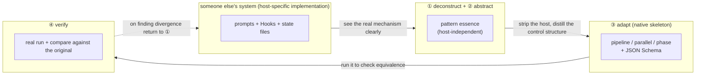
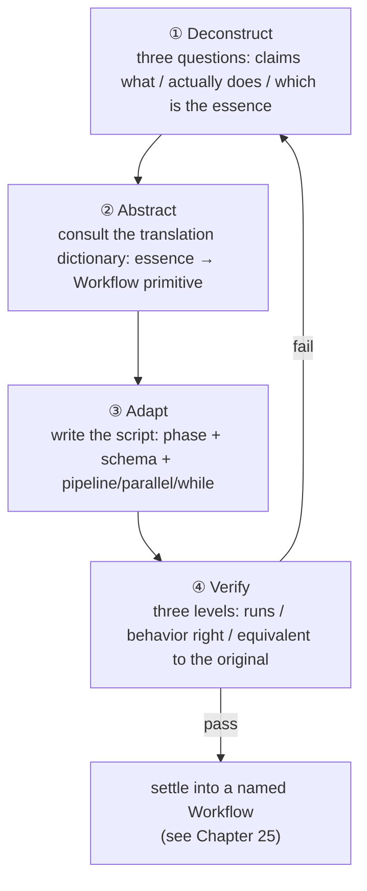
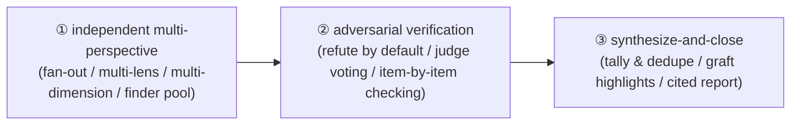

# Chapter 24 · The Art of Extraction

> In the last chapter we popped the hood on four community systems and went through them, saying over and over "this bit is worth stealing." But stealing isn't copy-pasting someone's prompts over — do that and you get **an organ grown on someone else's host**, which gets rejected the moment you transplant it into native Workflow. This chapter hands you a **reusable method**: how to take "good ideas from other people's systems" apart step by step, peel them off, and rewrite them into your own deterministic, reusable Workflow.
>
> Four actions, not one optional: **deconstruct (see how it really runs) → abstract (strip the host, pull out the pattern's essence) → adapt (rewrite with `phase`/`schema`/`parallel`/`pipeline`) → verify (actually run it, hold it up against the original)**. This chapter walks these four steps from the top using Chapter 23's four real cases.

---

## 24.1 Why an "Art" Is Needed, Rather Than Direct Copying

First a story that's bound to crash, and you'll get what the "art" is here to solve.

Suppose you read superpowers' `subagent-driven-development/SKILL.md` and got taken with its "two-stage review": each task first goes through a spec-compliance review, then a code-quality review, each looping until it passes. You naturally think: **just copy those two review prompts into my project, won't that do it?**

So you copy that markdown into your own `.claude/skills/`, happily figuring you've got "two-stage review." But you'll soon run into three problems:

1. **It leans on a host you don't even have.** The reason superpowers' review "loops until it passes" isn't those two prompts themselves but its whole `SessionStart`-injected "behavioral constitution" + skill chain + checkbox state files. Lift the prompts out on their own and they become the kind of "dead code" from Chapter 23 — without the bootstrap, the skill doesn't get force-triggered.
2. **Its "guarantee" is probabilistic.** Even with the full host, superpowers' review loop is basically "a prompt begging the model to review once more." The model may actually review, or may decide "good enough" and skip. It's a **soft convention**, not a hard control flow.
3. **What it produces is text for a human to read, not data for a program to chew on.** The review conclusion sits in the conversation, and you can't use code to judge "did this round pass, do we need another round."

<div class="callout warn">

**Here's the root illness of copying directly**: what you copied is the **implementation** (a specific combo of prompts + hooks + state files on some host), while what you actually want is the **pattern** (the control structure "after writing, first check the spec, then check the quality, redo if it doesn't pass"). The implementation is grown on the host; the pattern is the part you can carry off. **The whole point of the art of extraction is to peel the pattern out of the implementation, then grow a fresh implementation on native Workflow's skeleton.**

</div>

Back to Chapter 23's book-wide insight: these four systems were all born before native Workflow, and they used "prompts + Hooks + state files" to **fake up** a deterministic orchestration engine. The gems they invented — verification gates, persistent loops, disk state, boundary guardrails — are all **patterns**; and the way they carry these patterns (soft conventions, hook injection, file life-extension) is just **that era's implementation.**

Native Workflow hands you a more capable set of carrying tools:
- `pipeline` / `parallel` / `phase` — write control flow in **code**, a hard guarantee;
- JSON Schema — turn "what the product looks like, whether it's qualified" from free text into a **machine-decidable contract**;
- `agent({ schema })`'s tool-layer validation + auto-retry — turn "ask the model to try again" from a prayer into a **runtime discipline.**

So what the art of extraction produces is a Workflow script that **welds someone else's pattern onto the native skeleton.** The diagram below is the chapter's master outline:



---

## 24.2 Step One · Deconstruct: See Its Real Mechanism Clearly

"Deconstruct" answers one question: **what's the mechanism that actually makes this good idea work?** Note the word "actually" — what people **say** about their own system often doesn't line up with how it **really runs.** Extraction's first principle is one line: **trust only the source code, not the marketing copy.**

Deconstruction has three interrogations, each digging a layer deeper, which I call "the three questions":

### Question one: what does it claim to do? (the narrative layer)

First jot down what it **says about itself** — what the README says, what the docs say. For example, OMC says it's "the boulder never stops, so a complex task isn't quietly declared half-finished." This is its **intent**, a good starting point, but not the mechanism.

### Question two: what does it actually do? (the mechanism layer)

This step means **digging into the source**, finding the code/config that actually lands the intent. Chapter 23 already did this for us, and you can cite the conclusions straight off (the source is a genuine reading of each repository's source code):

| System | What it claims (narrative) | What it actually does (mechanism, source-code layer) |
|---|---|---|
| superpowers | "First clarify intent, produce a spec, then TDD" | In `subagent-driven-development/SKILL.md`, **two reviews per task**: spec-compliance review → code-quality review, each requiring re-review until it passes |
| OMC | "boulder never stops" | The `Stop` hook (`persistent-mode`) checks whether `.omc/state/` has an active mode, and if so **blocks stopping** and re-injects "The boulder never stops" |
| ccg | "fight context compaction, long tasks don't drift" | `workflow-state.js` on every `UserPromptSubmit` reads `task.json` and injects a `<ccg-state>` **breadcrumb** |

Note every "actually" cell is precise down to the **file name/hook name/field name.** That's the bar for deconstruction: **you can say which file, what data structure, what lifecycle point it kicks in at.** If you can't get to this granularity, you haven't finished deconstructing.

### Question three: which part is the pattern, which is the host? (the peeling layer)

This is the seam between deconstruction and abstraction. With the mechanism in hand, put each part on the spot: **is it "the essence of this idea" or "just how this host happens to do it"?**

Take OMC's Stop hook:

| Mechanism component | Essence (pattern) or accident (host)? | Reason |
|---|---|---|
| "Finishing doesn't necessarily mean done; it depends on meeting criteria" | **Essence** | This is the core idea of the "completion-criteria loop," independent of any host |
| Implemented with the `Stop` lifecycle hook | **Host accident** | Because OMC has no native control flow, it can only borrow a hook to "intercept stopping" |
| Criteria stored in `.omc/state/sessions/{id}/` | **Host accident** | Because a prompt-driven loop has no memory, it can only rely on disk for life-extension |
| Re-injecting "The boulder never stops" text | **Host accident** | This is the prompt means of "asking the model to continue" |

Peel it and the conclusion is obvious at a glance: **the essence is just one sentence — "whether you're allowed to end should be decided by a programmable criterion."** The rest is all scaffolding OMC was forced to invent under the "no native loop" constraint.

<div class="callout tip">

**Deconstruction's product** is a "mechanism spec sheet," with at least three things on it: ① the intent it claims; ② the real code location and data flow that land the intent; ③ an item-by-item tag of "essence / host accident." This book's Chapter 23 dissection of the four systems is itself four ready-made mechanism spec sheets — go ahead and stand on its shoulders when extracting, but **for any new system you want to steal from, you must do this step by hand.**

</div>

---

## 24.3 Step Two · Abstract: Strip the Host, Distill the Pattern's Essence

Deconstruction tells you "which parts are the essence"; abstraction **re-says these essences as a host-independent control-structure description** and translates them into native Workflow's vocabulary.

The key move in abstraction is matching each pattern to a **control-flow primitive.** Native Workflow has just a handful of primitives, and a pattern's essence often lands on exactly one:

| Pattern essence (the one-line abstraction) | The corresponding Workflow primitive | Why it |
|---|---|---|
| "B can't run until A is done, and B depends on A's product" | **Sequential dependency**: `pipeline` or a direct `await` | Stages have a data dependency, must be serial |
| "N mutually independent things done at once, want all results" | `parallel` (barrier) | No dependency + need to consolidate |
| "N things each independently flow through the same string of stages" | `pipeline` (no barrier) | Each chain independent, wall clock takes the slowest |
| "Do it repeatedly until a criterion is met" | `while` + a gate field | The exit condition is dynamic, must loop |
| "The product must take a certain shape to count" | `agent({ schema })` | The schema forces structure and type at the tool layer |
| "Show this thing under a certain phase" | `phase()` / `opts.phase` | Progress grouping |

This table is the art of extraction's "translation dictionary." The abstraction step boils down to looking things up in this dictionary over and over: **translate each deconstructed essence into a combination of one or more primitives from the dictionary's right column.**

Let's abstract the four cases one by one:

**superpowers two-stage review** abstracts to:
> "For a product, first run the **first** review (spec compliance), redo if it doesn't pass; once it passes, run the **second** review (code quality), redo if that doesn't pass either."
>
> Translation: the two reviews are **sequential** (spec first, then quality) → two stages of `pipeline`; each review's "pass/fail" must drive a judgment → each gets a `schema` with a `pass: boolean` gate field; "redo if it doesn't pass" → a bounded `while` on a single product inside the stage.

**OMC Stop hook** abstracts to:
> "Keep pushing forward, until a programmable criterion says 'we can wrap up.'"
>
> Translation: "repeatedly until a criterion" → `while` + a `done`/`accepted` gate field (cut from the same cloth as Chapter 18's "loop-until-dry"); "programmable criterion" → an independent acceptance `agent({ schema })`, with `accepted: boolean` in the schema.

**ccg disk breadcrumbs** abstracts to:
> "Let the later steps get hold of the **structured product** of the earlier steps, so they always know 'the current progress and the known facts,' without leaning on a conversation history that gets compacted."
>
> Translation: ccg uses "disk + per-turn injection" because its steps are scattered across several conversation turns and get washed out by context compaction. But native Workflow's script body is **one continuous JS closure** — the return value of the previous `agent()` is straight-up a variable in the next `agent()`'s prompt. `task.json`'s essence ("externalize state, pass it explicitly") **degenerates into ordinary variable passing plus structured output** in Workflow, with no disk needed at all.

**OmO tool-layer guardrail + Category delegation** abstracts to two sentences:
> "① The planner's product may only be a 'plan,' never smuggling in 'side effects on code'; ② 'which model to use' should be decided by the task's _semantic category_, not a hard-coded model name scattered through the prompts."
>
> Translation: ① "the product may only be a certain shape" → `agent({ schema })`, with `additionalProperties: false` to keep fields like diff/patch **structurally** out, then split "execution" into a separate phase (role separation); ② "pick the model by category" → a `MODEL_BY_CATEGORY` lookup table + `opts.model`, letting the `category` field drive dispatch.

<div class="callout info">

**The most common aha moment in the abstraction stage** is finding that some "gem" **needs no separate implementation at all** in native Workflow — because the problem it solves (context compaction, cross-turn amnesia, stopping when finished) is a host defect, and the native skeleton simply doesn't have that defect. ccg's disk breadcrumbs are the textbook case: in Workflow they "vanish" into variable passing. **Spotting "this gem comes free in the new host" is worth as much as "transplanting this gem."**

</div>

---

## 24.4 Step Three · Adapt: Rewrite with phase / schema / parallel / pipeline

Abstraction gave you the blueprint of "which primitives, how to put them together"; adaptation lands that blueprint into a **runnable script.** This step we roll up our sleeves once for each of the four cases and write complete scripts.

> All scripts in this section are marked "(illustrative, not run)" — they're **templates** for landing a pattern into code, showing off structure and how the primitives are used; the real-run data they cite (like GCF's `wf_7472ceac-daa`) comes from earlier chapters' real-run records and is traceable.

### Case 1: superpowers two-stage review → `pipeline(tasks, specReview, qualityReview)` + two schemas

This is the core demo of welding "methodological discipline" into a "deterministic quality gate." The pattern abstraction is already done: the two reviews are sequential, use two stages of `pipeline`; each stage has a `pass` gate; redo with a bound if it doesn't pass.

First the **most direct landing** — make the two reviews two stages of `pipeline`, and let each task to be reviewed flow through on its own:

```javascript
// (illustrative, not run) — superpowers two-stage review → pipeline + two schemas
export const meta = {
  name: 'two-stage-review',
  description: 'Spec-compliance review then code-quality review, each a deterministic gate',
  phases: [
    { title: 'SpecReview', detail: 'Per task, check whether the spec is implemented precisely (not over, not under)' },
    { title: 'QualityReview', detail: 'After passing the spec gate, review code quality' },
  ],
}

// Each schema has a pass gate field — this is the physical form of the "gate"
const SPEC_SCHEMA = {
  type: 'object',
  properties: {
    pass: { type: 'boolean' },                         // whether it precisely matches the spec
    overImplemented: { type: 'array', items: { type: 'string' } },  // what was done extra
    underImplemented: { type: 'array', items: { type: 'string' } }, // what was missed
    verdict: { type: 'string' },
  },
  required: ['pass', 'overImplemented', 'underImplemented', 'verdict'],
}

const QUALITY_SCHEMA = {
  type: 'object',
  properties: {
    pass: { type: 'boolean' },
    issues: {
      type: 'array',
      items: {
        type: 'object',
        properties: {
          severity: { type: 'string', enum: ['blocker', 'major', 'minor'] },
          note: { type: 'string' },
        },
        required: ['severity', 'note'],
      },
    },
    verdict: { type: 'string' },
  },
  required: ['pass', 'issues', 'verdict'],
}

// args.tasks: [{ id, spec, diff }], each an implementation unit to review
const tasks = args.tasks

const results = await pipeline(
  tasks,
  // stage 1: spec-compliance review. receives the original task
  (task) =>
    agent(
      `You are a spec-compliance reviewer. Against the spec below, judge whether the implementation **precisely** matches — ` +
      `neither doing extra (over-implementation) nor too little (under-implementation).\n` +
      `SPEC:\n${task.spec}\n\nDIFF:\n${task.diff}`,
      { label: `spec:${task.id}`, phase: 'SpecReview', schema: SPEC_SCHEMA }
    ),
  // stage 2: code-quality review. receives (specResult, task, index)
  (specResult, task) => {
    // spec gate didn't pass, so don't waste a quality agent — pass the conclusion straight down
    if (!specResult.pass) {
      return { stage: 'spec', specResult, qualityResult: null, accepted: false }
    }
    return agent(
      `You are a code-quality reviewer. Spec compliance has passed; now look only at code quality` +
      ` (naming, error handling, edge cases, readability). List the issues with severities.\n` +
      `DIFF:\n${task.diff}`,
      { label: `quality:${task.id}`, phase: 'QualityReview', schema: QUALITY_SCHEMA }
    ).then((qualityResult) => ({
      stage: 'quality',
      specResult,
      qualityResult,
      accepted: qualityResult.pass,
    }))
  }
)

log(`Two-stage review complete: ${results.filter(Boolean).length} tasks flowed through both gates`)
return results
```

This script turns superpowers' "prompt-begged re-review" soft convention into **two physical gates**: if the first `SPEC_SCHEMA.pass` isn't true, the second one doesn't even open (no quality agent gets dispatched, saving a token); both pass, and `accepted` is true. `pipeline` lets each task flow through both gates **on its own** — 10 tasks' wall clock ≈ the time for the slowest single task to clear both gates, not "review all the specs, then review all the qualities" (that's the inefficient `parallel` barrier form, which Chapter 26 takes apart specifically).

But what about "redo if it doesn't pass"? The version above is "review once, hand back a conclusion." To get superpowers' real "loop until pass," add **bounded retry** inside the gate — and retry means "review → if it doesn't pass, fix → review again," which actually degenerates into Chapter 12's GCF (generate-critique-fix) loop. Let's spell it out:

```javascript
// (illustrative, not run) — bounded loop inside the gate: review → fix → re-review, until pass or hitting the cap
async function gatedFix(task, reviewSchema, reviewerRole, maxRounds = 3) {
  let diff = task.diff
  let round = 0
  let lastReview = null
  while (round < maxRounds) {                          // bounded! see Chapter 18
    round++
    const review = await agent(
      `${reviewerRole}\nSPEC:\n${task.spec}\n\nDIFF:\n${diff}`,
      { label: `review:${task.id}:r${round}`, schema: reviewSchema }
    )
    lastReview = review
    if (review.pass) return { passed: true, rounds: round, diff, review }
    // didn't pass: dispatch a fixer to rewrite per the review feedback
    const fixed = await agent(
      `You are the implementer. The review didn't pass; make **minimal changes** per the feedback below and give the complete new diff.\n` +
      `Feedback: ${JSON.stringify(review)}\nOriginal diff:\n${diff}`,
      {
        label: `fix:${task.id}:r${round}`,
        schema: { type: 'object', properties: { diff: { type: 'string' } }, required: ['diff'] },
      }
    )
    diff = fixed.diff
  }
  return { passed: false, rounds: round, diff, review: lastReview }  // hit the cap, exit with the last state
}
```

Every detail here picks up disciplines set in earlier chapters: `maxRounds` is Chapter 18's drumbeat that "the brake is discipline, not optional"; the `pass` gate field is cut from the same cloth as Chapter 18's "`done: boolean` gate"; the independent reviewer and fixer come from Chapter 12's "critique must go to an independent agent, or it defends itself." **This is the compound interest of the art of extraction** — the discipline you built up for one case carries over verbatim to the next.

### Case 2: OMC Stop-hook completion criteria → a `while(!done)` loop + an acceptance schema

OMC's gem abstracts to "keep pushing forward, until a programmable criterion says we can wrap up." This already has a full Workflow incarnation in Chapter 18 ("loop-until-dry"); here we demo a form closer to OMC's "every story in the PRD must be `passes:true` to count as done" — **accept item by item, stop only when all of them pass**:

```javascript
// (illustrative, not run) — OMC "boulder never stops" → while + acceptance schema
export const meta = {
  name: 'acceptance-loop',
  description: 'Keep working until an independent acceptance gate passes every story (OMC-style)',
  phases: [
    { title: 'Build', detail: 'Produce/revise a version of the implementation' },
    { title: 'Accept', detail: 'Independently accept each story, allow wrap-up only when all pass' },
  ],
}

// Acceptance schema: accepted is the gate for "whether stopping is allowed"; perStory gives each one's judgment
const ACCEPT_SCHEMA = {
  type: 'object',
  properties: {
    accepted: { type: 'boolean' },                     // equivalent to OMC's "Stop hook lets through"
    perStory: {
      type: 'array',
      items: {
        type: 'object',
        properties: {
          id: { type: 'string' },
          passes: { type: 'boolean' },                 // corresponds to each story's passes in prd.json
          gap: { type: 'string' },                     // if it doesn't pass, explain the gap
        },
        required: ['id', 'passes', 'gap'],
      },
    },
  },
  required: ['accepted', 'perStory'],
}

const MAX_ROUNDS = 5
const stories = args.stories          // [{ id, requirement }]
let work = args.initialDraft || ''
let round = 0
let accepted = false
let lastReport = null

while (!accepted && round < MAX_ROUNDS) {               // dual exit: criterion + hard cap
  round++

  // budget fallback: if not enough budget for another round (Build+Accept, two agents), close out early
  if (budget.total !== null && budget.remaining() < 60_000) {
    log(`Not enough budget for another round (remaining ${budget.remaining()}), closing out with current state`)
    break
  }

  phase('Build')
  const built = await agent(
    `You are the implementer. Produce/revise the implementation per the stories below.\n` +
    `stories: ${JSON.stringify(stories)}\n` +
    `Last round's acceptance feedback (empty on the first round): ${lastReport ? JSON.stringify(lastReport.perStory) : 'none'}\n` +
    `Current implementation: ${work || '(empty, write from scratch)'}`,
    {
      label: `build:r${round}`,
      phase: 'Build',
      schema: { type: 'object', properties: { work: { type: 'string' } }, required: ['work'] },
    }
  )
  work = built.work

  phase('Accept')
  // Key: the acceptor is an independent agent, not the build agent above — or it would endorse its own product
  lastReport = await agent(
    `You are an independent acceptor. Check item by item whether each story is met by the implementation.` +
    ` **Only when all passes=true is accepted true.**\n` +
    `stories: ${JSON.stringify(stories)}\nimplementation: ${work}`,
    { label: `accept:r${round}`, phase: 'Accept', schema: ACCEPT_SCHEMA }
  )
  accepted = lastReport.accepted

  if (!accepted) {
    const failing = lastReport.perStory.filter((s) => !s.passes).map((s) => s.id)
    log(`Round ${round} acceptance didn't pass, unmet: ${failing.join(', ')}`)
  }
}

return {
  accepted,
  rounds: round,
  hitCeiling: !accepted && round >= MAX_ROUNDS,         // honestly marked: was it "truly passed" or "hit the cap"
  work,
  finalReport: lastReport,
}
```

Hold this up against OMC's real mechanism and you see a beautiful **dimensionality reduction**:

| OMC's implementation (host-specific) | Workflow's counterpart (native skeleton) |
|---|---|
| The `Stop` hook intercepting stopping | The `while (!accepted ...)` loop condition |
| `.omc/state/` storing mode/phase/iteration | The ordinary variables `round` / `work` / `lastReport` |
| Re-injecting "The boulder never stops" | The loop naturally enters the next round, no prompt needed |
| An independent critic verifying `passes:true` | An independent `agent({ schema: ACCEPT_SCHEMA })` |
| Resume after a crash | `resumeFromRunId` resume (Chapter 22) |

All the scaffolding OMC put up to "make the loop programmable" — hooks, state files, re-injected text — **collapses into a `while` and a few local variables** in native Workflow. This isn't OMC being dumb; it's OMC being born in an era without native loops. And it's the literal payoff of Chapter 23's line: **native Workflow gives them the deterministic skeleton they were missing.**

<div class="callout warn">

**Don't transplant OMC's gem into an "unbounded loop."** When you transplant a "keep going until a criterion passes" persistent loop like this, you **must** steer clear of an unbounded loop — the Workflow version must bring along `MAX_ROUNDS` + a `budget.remaining()` fallback, which is Chapter 18's iron law (the model's `done`/`accepted` is a probabilistic judgment and may sit on approval forever). Honestly mark `hitCeiling` in the return value, so the caller knows whether this was "truly accepted" or "hit the cap and got forced to wrap up." Never let "boulder never stops" turn into "token never stops."

</div>

### Case 3: ccg disk breadcrumbs → structured-output product passing

This case's "adaptation" is the oddest one — because back in the abstraction stage we already found: **ccg's disk breadcrumbs are basically free in native Workflow.** But "free" doesn't mean "nothing to do"; it maps to a **positive practice** in Workflow: use structured products to explicitly pass "known facts + current progress" between stages, instead of leaving the next agent to guess or to read a history that gets compacted.

ccg's `task.json` + `<ccg-state>` breadcrumbs are, at bottom, answering "what should the next step know." In Workflow, that's handled by **feeding the previous stage's structured output straight into the next stage's prompt**:

```javascript
// (illustrative, not run) — ccg disk breadcrumbs → structured-output explicit product passing
export const meta = {
  name: 'breadcrumb-pipeline',
  description: 'Pass a structured "state" object down the pipeline instead of disk breadcrumbs',
  phases: [
    { title: 'Survey', detail: 'Survey: produce structured "current facts"' },
    { title: 'Plan', detail: 'Produce a plan based on the survey (carrying the facts snapshot it depends on)' },
    { title: 'Execute', detail: 'Execute based on the plan (carrying the plan and survey it depends on)' },
  ],
}

// This schema is the structured form of the "breadcrumb" — explicit, validatable, passable
const STATE_SCHEMA = {
  type: 'object',
  properties: {
    facts: { type: 'array', items: { type: 'string' } },      // confirmed facts (corresponds to what ccg writes into task.json)
    openQuestions: { type: 'array', items: { type: 'string' } },
    nextActions: { type: 'array', items: { type: 'string' } },
  },
  required: ['facts', 'openQuestions', 'nextActions'],
}

phase('Survey')
const state = await agent(
  `You are a surveyor. Survey ${args.target}, produce a structured current state: confirmed facts, open questions, suggested next actions.`,
  { label: 'survey', phase: 'Survey', schema: STATE_SCHEMA }
)

phase('Plan')
// Key: stuff the previous stage's "breadcrumb" verbatim into the next stage's prompt — this is "injection," but it happens in the closure, not via disk
const plan = await agent(
  `You are a planner. Make a plan based on the **current-state snapshot** below. Don't re-survey, just trust these facts.\n` +
  `Current-state snapshot: ${JSON.stringify(state)}`,
  {
    label: 'plan',
    phase: 'Plan',
    schema: {
      type: 'object',
      properties: {
        steps: { type: 'array', items: { type: 'string' } },
        assumptions: { type: 'array', items: { type: 'string' } },
      },
      required: ['steps', 'assumptions'],
    },
  }
)

phase('Execute')
const result = await agent(
  `You are the executor. Execute per the plan. Below you're given both the **current state** and the **plan**, to ensure actions are consistent with known facts.\n` +
  `Current state: ${JSON.stringify(state)}\nPlan: ${JSON.stringify(plan)}`,
  {
    label: 'execute',
    phase: 'Execute',
    schema: { type: 'object', properties: { summary: { type: 'string' }, done: { type: 'boolean' } }, required: ['summary', 'done'] },
  }
)

return { state, plan, result }
```

Held up against ccg's real mechanism, the difference is structural:

| ccg disk breadcrumbs | Workflow structured output |
|---|---|
| State written into `task.json` (disk) | State is the `state` / `plan` local variables (in-memory closure) |
| Each turn a Hook reads disk → injects `<ccg-state>` | Directly `JSON.stringify(state)` spliced into the next prompt |
| Exists to fight "cross-turn context compaction" | No compaction problem within one script closure, inherently not lost |
| Breadcrumbs are unstructured text fragments | `STATE_SCHEMA` makes breadcrumbs **structured and validatable** |

<div class="callout tip">

**Where ccg's lesson really earns its keep isn't "move disk into memory" but the principle of "pass it explicitly, pass it structured."** Plenty of people, writing Workflows the lazy way, let the next agent "read the file itself / re-survey itself" — which is slow and can hand back facts that don't match. ccg uses disk breadcrumbs to force "state out into the open," and that **habit** is worth keeping: have each stage's key output go through `schema` and get explicitly fed to the next stage. Native Workflow drops the cost of this to "a variable + a `JSON.stringify`," so there's no reason not to.

</div>

### Case 4: OmO tool-layer guardrail → a schema-constrained "planner-executor" role separation

The fourth case comes from OmO (built on opencode). Its gem got deconstructed clearly in Chapter 23; here we walk the full "abstract → adapt." First, pull out the two essences:

> **Essence one (tool-layer guardrail)**: OmO's `prometheus-md-only/hook.ts` hard-intercepts at the tool-call layer — the planner's `Write/Edit` may only write `.omo/*.md`, and violations `throw` outright. **The planner physically cannot write code.** Boiled down to one sentence: "the planner's product must be a 'plan,' not 'side effects on code.'"
>
> **Essence two (Category delegation)**: OmO dispatches not by model name but by **semantic intent** (`category`) — the LLM only declares "what category of thing this is," and the runtime maps it to a concrete model. Boiled down to one sentence: "make 'which model does it' a hot-swappable mapping table, instead of a hard-coding scattered through the prompts."

**Adapting essence one: reproduce 'the planner can't touch code' with `schema` + role separation.** Native Workflow's script body has no FS/Node API, so an agent can't write host files directly anyway; but "the planner may not emit code" can be physically guaranteed with a strict `schema` that **only lets plan fields show up** — `additionalProperties: false` makes the planner **structurally** unable to smuggle in a diff/patch, and a **separate executor stage** then consumes that plan:

```javascript
// (illustrative, not run) — OmO tool-layer guardrail → a schema-constrained planner / executor separation
export const meta = {
  name: 'planner-executor',
  description: 'A schema-locked planner that cannot emit code, then a separate executor stage',
  phases: [
    { title: 'Plan', detail: 'The planner can only produce a plan object (schema-locked, cannot smuggle code)' },
    { title: 'Execute', detail: 'A separate executor consumes the plan; the only stage allowed to produce code side effects' },
  ],
}

// Key: additionalProperties:false makes any field beyond "the plan" (like diff/patch) fail validation
// This is OmO's "tool-layer throw" equivalent in native Workflow — moving the guardrail from "intercept the tool call" forward to "constrain the product's shape"
const PLAN_SCHEMA = {
  type: 'object',
  additionalProperties: false,                         // physical wall: only the fields listed below count
  properties: {
    steps: {
      type: 'array',
      items: {
        type: 'object',
        additionalProperties: false,
        properties: {
          id: { type: 'string' },
          intent: { type: 'string' },                  // what this step aims to achieve (a description, not code)
          targetFile: { type: 'string' },              // which file it expects to change (just a declaration, no content)
          category: { type: 'string', enum: ['research', 'mechanical', 'design', 'risky'] },
        },
        required: ['id', 'intent', 'targetFile', 'category'],
      },
    },
    risks: { type: 'array', items: { type: 'string' } },
  },
  required: ['steps', 'risks'],
}

phase('Plan')
// The planner: even if it "wants" to write code, the schema has no field to carry it — StructuredOutput rejects on a structural mismatch and retries
const plan = await agent(
  `You are the planner. Produce only a **plan**: break the task into steps, each with an intent, the target file it expects to change, and the step's category.` +
  ` You cannot, and need not, write any code or diff — there's a separate executor downstream.\nTask: ${args.task}`,
  { label: 'plan', phase: 'Plan', schema: PLAN_SCHEMA }
)

phase('Execute')
// The executor: the only role allowed to actually touch code. What it receives is a pure plan already validated by the schema
const execResult = await agent(
  `You are the executor. Implement step by step strictly per the plan below (this is the only stage allowed to produce code side effects).\n` +
  `Plan: ${JSON.stringify(plan)}`,
  {
    label: 'execute',
    phase: 'Execute',
    schema: {
      type: 'object',
      properties: {
        changedFiles: { type: 'array', items: { type: 'string' } },
        summary: { type: 'string' },
      },
      required: ['changedFiles', 'summary'],
    },
  }
)

return { plan, execResult }
```

Hold it up against OmO's real mechanism and the guardrail's "location" shifts forward in a rather neat way:

| OmO's implementation (host-specific) | Workflow's counterpart (native skeleton) |
|---|---|
| `hook.ts` intercepts `Write/Edit` **before the tool call** | `PLAN_SCHEMA` intercepts non-plan fields **at product validation** |
| Violation path → `throw` | Violating structure → StructuredOutput rejects, the model retries |
| "The planner may only write `.omo/*.md`" | "The planner may only produce an object of `PLAN_SCHEMA` shape" |
| Execution handed to another agent role | Execution handed to a separate `Execute` phase |

Both land an **equivalent guarantee**: neither lets the planner smuggle "side effects on code" into its output. OmO leans on intercepting the tool call, native Workflow on constraining the product's shape + phase role separation — the latter is even cleaner, because it simply never hands the planner the "write a file" capability in the first place, rather than catching it after the fact.

**Adapting essence two: a Category → model mapping table.** OmO's "delegation by semantic intent" is, in native Workflow, just a plain lookup table + `opts.model`:

```javascript
// (illustrative, not run) — OmO Category delegation → args.category-driven model mapping
// A hot-swappable mapping table: to change a model, edit one line here, touch no prompt
const MODEL_BY_CATEGORY = {
  research: 'opus',          // research needing deep reasoning → a strong model
  design: 'opus',
  mechanical: 'haiku',       // mechanical, highly deterministic work → a cheap fast model (echoing _grounding: simple tasks can use haiku)
  risky: 'opus',
}

// Let the previous stage's plan.steps[].category directly decide who each step is dispatched to — "by category," not "by hard-coded model name"
const stepResults = await pipeline(
  plan.steps,
  (step) =>
    agent(
      `Execute this step: ${step.intent} (target file ${step.targetFile}).`,
      {
        label: `step:${step.id}`,
        model: MODEL_BY_CATEGORY[step.category] || 'opus',   // fallback: an unknown category uses the strong model
      }
    )
)
```

This little mapping table's value is the same as OmO's design motive: **pull "which model to use" out of the prompts and gather it into one config.** When models turn over (say haiku upgrades, or a new mid-tier model shows up), you edit just one line of `MODEL_BY_CATEGORY`, and every category-dispatched step follows along; not one model name shows up in the prompts, so there's no maintenance debt of "model names scattered everywhere, miss one when you change them."

<div class="callout warn">

**State the schema's boundary plainly (echoing 24.5's stance): `schema` locks the product's _shape_, not the product's _truthfulness_.** The `planner-executor` above can guarantee "what the planner hands over is a pure plan object," but it **cannot** guarantee "the plan is correct," let alone "the executor actually did it." On top of the tool-layer guardrail, OmO has another layer of **system-reminder injection** (`VERIFICATION_REMINDER`: "the sub-agent says it's done — it's lying, go verify") — and **this layer has no exact counterpart in native Workflow**: Workflow has no hook to "hard-inject a reminder into the sub-agent's context each turn." So the native equivalent of OmO's "untrusted verification" gem is **not the schema, but an explicit verification stage** — you must add an independent verify-agent yourself (like Case 1's quality gate, Case 2's accept gate), and use its `pass`/`accepted` gate to judge the executor's product. **Don't expect `schema` to do the verifying for you; it only handles shape — verification rides on an independent human/agent.**

</div>

---

## 24.5 Step Four · Verify: Actually Run It, Compare Against the Original

Adaptation produced a script, but **a script that hasn't been run isn't a successful extraction.** Verification answers two questions: ① can it actually run? ② does it actually replicate the original system's gem (not just look like it)?

### The three levels of verification

**Level one: it runs (syntax + execution).** Hand the script to the Workflow tool. Recall Chapter 01: the return is async, handing you `taskId`/`runId` right away; if `meta` isn't a pure literal or the script has a syntax problem, `WorkflowOutput` carries `error` (on syntax-check failure). This level checks "the skeleton stands up."

**Level two: behavior is right (the product meets expectations).** After running, look at the return value in the completion notification. Here `schema` is your free assertion — if `agent({ schema })` returned, the product **already** cleared structural validation. But right structure doesn't mean right semantics, so you must check by hand: did the two-stage review really stop a non-compliant diff? Did the acceptance loop really stop only when everything passed?

**Level three: equivalence (hold it up against the original system).** This level is unique to extraction: does your Workflow version line up with the original system it imitates on the **key behaviors**? The way to do it is to build an input "the original system would process," and see whether both sides reach the same conclusion.

### A real equivalence verification: GCF is a simplified real run of superpowers' two-stage review

This book's Chapter 12 GCF recipe is a **real-run** "generate → adversarial critique → fix," and it's exactly the "single-stage real-run version" of superpowers' two-stage review. We use it to show what "equivalence verification" looks like — because it's got real data to anchor to:

> **Real run**: GCF (`slugify`) Run ID `wf_7472ceac-daa`, Task ID `wchxy8dbm`, raw record in `assets/transcripts/gcf-slugify.md`. Real usage `agent_count=3`, `tool_uses=10`, `total_tokens=96468`, `duration_ms=180724` (about 3 minutes).

In this run, **an independent adversarial-critique agent (the Critique stage) listed 10 genuine defects in a 30-line `slugify()`** (sorted by severity; see `gcf-slugify.md`). This is an **observation**, not a counterfactual proof — what it shows is: splitting "writing" and "fault-finding" across two agents, and explicitly telling the latter to review adversarially, did this time systematically drag the first draft's blind spots into the open. This section did not run a control group of "let the generating agent self-review the same code," so it cannot assert "self-review would certainly fail to catch these defects"; what can be said is that the GCF/superpowers "independent critique" structure hands the job of finding blind spots to a perspective that doesn't vouch for the product, and this run confirms that structure produces valuable critique.

**This is a template of an "equivalence verification"**: we didn't copy superpowers' prompts but rewrote with native primitives (three stages + an independent critique agent + schema), then actually ran it, watching it replicate the **structural essence** of "doing adversarial critique with an independent perspective." Next to GCF, the two-stage review only adds a "spec first, then quality" tiering — the structure is the same source, and this real run verified that this structural chain holds up.

Chapter 12 also gives a direct echo: its "Variant B · judges gate the Fix" spells it out — "after Fix, add another independent agent to compare the original issues with the fixed version, confirming each was really fixed (**echoing Chapter 23's superpowers two-stage review**)." This transfer chain — superpowers' pattern → GCF's real run → Variant B's two-staging — is a living sample of this chapter's methodology working through.

### A controlled experiment in verification: calibrate intuition with real data

Verification has one often-overlooked use: **calibrate your gut feel about cost and convergence with real-run data**, so a transplanted pattern doesn't run away on you at your scale. This book's real runs give several anchors you can cite straight off:

| Real run | Run ID | Calibration for extraction |
|---|---|---|
| judge-panel (3 judges scoring independently) | `wf_f5b69668-b18` | 3 non-communicating judges **independently converged 3:0** on candidates with "clearly differing quality" — observed evidence consistent with "multiple independent perspectives reduce single-reviewer bias" (an assumption both superpowers/OMC rely on) (a single 3:0 convergence, not a general proof) |
| frontend-review (3-dimension concurrent review + synthesis) | `wf_4c5caabb-b73` | `agent_count=4`, `total_tokens=221648` — confirming "token ≈ agent count × per-agent context," and you can estimate cost from this before transplanting "multi-dimension review" |
| nested-parent (nested sub-flow) | `wf_85e22b38-126` | The sub-flow's agents **count toward the parent flow**'s `agent_count`/`budget.spent()` — when transplanting the "sub-flow delegation" pattern, budget must be computed as parent+child combined |

<div class="callout info">

**That judge-panel run also has an observation worth jotting down**: the 3 judges noted in their scoring rationale that they **actually read `docs/en/p2-08` and `assets/_grounding.md` to cross-check** several numbers in the book (8.4s/78844 tokens, min(16, cores−2), the 1000 cap…), concluding "zero factual errors." Note this is behavior shown **in this one run**, by judges that were handed a scoring rubric/schema — it is **not** a universal guarantee of Workflow. `agent({ schema })` validates the structure of the output; it does not force the agent to verify against external sources. Treat it as an empirical observation: handing judges an explicit rubric + schema helps (rather than guarantees) draw out behavior like "proactively checking facts." If what you need is an **enforced** verification gate (like OmO's VERIFICATION_REMINDER, the "the sub-agent said it's done, so go verify" kind), you still need explicit prompt instructions or an extra verification agent — you can't count on the schema itself to bring it.

</div>

### What to do when verification fails: return to step one

Verification failing falls into two cases:

- **Runs but behavior is wrong** (e.g., the acceptance loop never stops): mostly the **abstraction** dropped a discipline (forgot `MAX_ROUNDS`), or the schema gate field got designed wrong. Go back to 24.3, run through the translation dictionary again.
- **Runs but isn't equivalent to the original** (e.g., your "two-stage review" actually reviewed only one stage): mostly the **deconstruction** didn't go deep enough, mistaking a host accident for the essence, or missing some key mechanism. Go back to 24.2, redo the "three questions."

This is what that **return dashed line** in 24.1's master outline diagram means: extraction is iterative, and verification is its quality-check gate.

---

## 24.6 String the Four Steps into an "Extraction Worksheet"

To make this method something you can actually run, solidify the four steps into a **worksheet** — next time you spot any good idea in a system, fill it in:



| Step | Key question | Product | This book's tool |
|---|---|---|---|
| ① Deconstruct | In which file, what data flow, does its real mechanism take effect? | A mechanism spec sheet (annotating essence/host accident) | Chapter 23's four ready-made spec sheets |
| ② Abstract | Which Workflow primitive does each essence correspond to? | A primitive-combination blueprint | 24.3's translation dictionary |
| ③ Adapt | How to land it as a script with `phase`/`schema`/`pipeline`? | A runnable script | 24.4's four templates |
| ④ Verify | Does it run? Is behavior right? Is it equivalent to the original? | A real run + comparison conclusion | 24.5's real-data anchors |

Walk this worksheet and what you get isn't "copied prompts" but a Workflow you **fully understand, can reproduce deterministically, and can settle into your own library.** The next chapter covers how to organize these products into a maintainable, shareable personal Workflow library.

---

## 24.7 Official Built-in Workflows: Five Ready-Made Templates That Need No Peeling

The hardest step in the art of extraction taught earlier in this chapter is always **stripping the host** — the gems of the four community systems all grow on a host layer of "prompts + Hooks + state files," and you must first peel them off that host before you can weld them onto the native skeleton. But there's a class of templates that skips this step from the start: the five named workflows Claude Code ships officially. They **are native Workflow** to begin with, with no host to peel. So they're the cleanest things to learn from — you can see the skeleton of the quality routine "independent multi-perspective → adversarial verification → synthesize-and-close" right out in the open, without first doing a peeling operation. This section takes these five templates apart one by one, which happens to back up this chapter's methodology from another angle: the only thing transferable is the pattern, and the official built-ins put the pattern in front of you in its purest form.

### What We Can and Cannot See

Every claim in this section stands on three **documented** foundations, and no fourth:

1. **The five names the runtime attests to itself.** Call a named workflow that doesn't exist in a script and the runtime throws, **listing the entire registry of built-ins.** What this book's real run (Run `wf_28a5d455-300`) got back verbatim is:

   ```
   Error: workflow('___nonexistent_child_workflow___'): no workflow with that name.
   Available: bughunt, bughunt-lite, deep-research, plan-hunter, review-branch
   ```

   This is harder evidence than any documentation — the built-in named workflows are **exactly these five**, no more and no fewer.

2. **One line of registration blurb in the official skill list.** Each built-in workflow carries a one-sentence architecture summary in the skill list (each subsection below **excerpts the architectural points of this blurb** as its basis for judgment, with the methodology anchored in `examples-r8.md` §7). Note this is an **architecture summary** of official text, not verbatim source code — among them, only `bughunt`'s architectural points have a cross-checking anchor in this book's ground-truth source (§7, "e.g. bughunt = self-respawning finder pool + 5-vote adversarial verification + pigeonhole early-exit + synthesis"); the **exact wording of the other four is subject to the skill blurbs actually listed by your local `/workflows`**, and this section makes no guarantee about the verbatim wording.

3. **The same-named patterns in the Workflow tool definitions**, plus this book's own real runs. The tool descriptions, when they discuss `pipeline`/`parallel`/`agent`, keep dropping words like "fan-out," "adversarial verification," and "judge"; this book's Chapters 13–17 also reproduce the same kind of orchestration with real Run IDs. The two cross-confirm that "this kind of pattern really exists and this book has run it firsthand."

<div class="callout warn">

**One iron law, applicable throughout.** In this book's grounding tiers (see `_grounding.md` A2), regarding these five built-in workflows, **the only thing confirmed by real testing is the layer of "they exist"** — that is, the five names listed in the error above. Their **internal architecture (how the finder pool respawns, how many votes count as confirmed, how the judges score) has neither an official tool definition, nor can it be read line-by-line in source, nor has this book reproduced it.** So every dissection of "how it runs internally" below leans only on **that one line of registration blurb + general pattern knowledge**, labeled "**based on the official skill description + behavioral observation, not line-by-line source.**" Use it to build intuition and distill skeletons — but don't take the numbers in it (3 rapid, 5 votes, 4 judges) as verified implementation facts. The skeleton code below is the same deal: all of it is **this book's speculative example implementation**, labeled "(illustrative, not run)."

</div>

Why can't even the source be read? Because Claude Code's CLI is a bundled artifact, and the built-in workflows' scripts don't live under `~/.claude`; this book grepped the CLI install directory for these signature strings (`self-respawning`, `pigeonhole`, `MVP-first`) with **zero hits** (basis in `examples-r8.md` §7). Not being able to read the source is exactly why this section exists: to teach you to **reverse-engineer reusable patterns from behavior and the official blurb** — which is itself the most practical way to "steal from" someone. Whenever you face any good tool whose source you can't see, this is exactly what you'll have to do.

### Five Built-ins, Five Patterns

#### 1. `bughunt` — Self-respawning finder pool + adversarial refutation

**Official skill description (architecture summary, not source code)**:
> Multi-agent bug sweep of the current branch. Self-respawning finder pool (3 rapid + deep-until-dry-streak) streams into 5-vote adversarial verification with pigeonhole early-exit, then synthesis.

**One-line positioning**: a full-scale sweep of the current branch where "you don't know how many bugs there are" — the main event is **how to find them all** (the self-respawning hunter pool) and **how to trust the results** (five-vote adversarial refutation).

**Which pattern it demonstrates** (based on the official skill description + behavioral observation, not line-by-line source):

- **Self-respawning finder pool**. The blurb's `Self-respawning finder pool (3 rapid + deep-until-dry-streak)` means: first scatter a batch of rapid hunters for a breadth scan, then keep dispatching deep hunters to top it up, **stopping only when several rounds in a row turn up nothing new (dry-streak)**. This is the official equivalent of this book's Chapter 18 "loop-until-dry + dry-streak" — using "K rounds in a row with nothing new" rather than "stop after one round finds nothing" to keep from missing the tail.
- **Five-vote adversarial refutation + pigeonhole early-exit**. `5-vote adversarial verification with pigeonhole early-exit`: dispatch several independent verifiers per suspected bug, refute by default, tally to close out; once a majority has locked the outcome, call an early verdict and stop paying full freight on a result that's already settled. This is the fusion of Chapter 17's adversarial verification and Chapter 15's pigeonhole.
- **Synthesis** closes out.

**What you can learn from it** — abstract it into a skeleton of "unknown-scale discovery + trust calibration":

```javascript
// (illustrative, not run) — self-respawning finder pool + dry-streak to prevent tail misses
const K = 2                          // dry-streak: declare dry only after 2 consecutive rounds with nothing new
const MAX_ROUNDS = 6                 // hard cap (a seatbelt, not optional)
const confirmed = []
let round = 0, dryStreak = 0
while (dryStreak < K && round < MAX_ROUNDS && budget.remaining() > 0) {
  round++
  // ① scatter a batch of finders (rapid for breadth + deep for digging), telling them "these are confirmed, report only new ones"
  const known = confirmed.map(c => c.id)
  const pooled = await parallel(
    [0, 1, 2].map(i => () =>
      agent(`Sweep for issues. Already confirmed (skip): ${JSON.stringify(known)}. ` +
            `Hunter #${i}: report only NEW suspects.`, { phase: 'Hunt', schema: /* … */ }))
  )
  const suspects = dedupeByKey(pooled.filter(Boolean).flat())   // dedupe with code, don't let the agent dedupe
  // ② run each new suspect through adversarial refutation (see pattern 5)
  const fresh = await verifyAdversarially(suspects)
  // ③ dry-streak counting
  if (fresh.length === 0) dryStreak++; else { dryStreak = 0; confirmed.push(...fresh) }
}
```

The skeleton's three gears are cleanly separated: the **finder pool** finds (each round injects the confirmed list, takes only new ones), the **adversarial-refutation pipeline** filters, and the **`while` + counter** decides "when to stop" — this is honest-to-goodness JavaScript control flow, with the model just judging and the code doing the orchestrating.

<div class="callout tip">

**`bughunt` has a dedicated dissection in this book**: Chapter 15 Bug Hunter takes the finder pool (fixed vs self-respawning), pigeonhole, and dry-streak apart into runnable skeletons, with a real run `wf_53da9a06-915` (11 agents, 5/5 confirmed, the verifier corrected the hunter in turn). This section only does horizontal positioning; for the details head to Chapter 15.

</div>

#### 2. `bughunt-lite` — The same skeleton, minus the "self-respawning" layer

**Official skill description (architecture summary, not source code)**:
> Lighter bug sweep — fixed 3-rapid+2-deep finders stream into 5-vote adversarial verification (pigeonhole early-exit), then synthesis. Simpler than bughunt: no self-respawning, no dry-streak.

**One-line positioning**: a lighter version of `bughunt` — likewise "finder pool → five-vote adversarial refutation → synthesis," but the finder pool is **fixed** (3 rapid + 2 deep, stops once run), **cutting out self-respawning and dry-streak.**

**Which pattern it demonstrates** (based on the official skill description + behavioral observation, not line-by-line source): a **fixed finder pool**. Put next to `bughunt`, it lays out a rather important engineering trade-off —

| Dimension | `bughunt-lite` (fixed pool) | `bughunt` (self-respawning pool) |
|---|---|---|
| Finder pool | Fixed 3 rapid + 2 deep, stops once run | Keeps dispatching until dry-streak |
| Cost ceiling | **Deterministic** (capped at 5 finders) | Indeterminate (braked by dry-streak + budget) |
| Tail-miss risk | Higher (single round, tail bugs unrecoverable) | Lower (multi-round + stop only after K consecutive rounds with nothing new) |
| Fits | Target scale roughly estimable, predictable cost wanted | Scale entirely unknown, high cost of misses |

**What you can learn from it**: **"the same core skeleton, with 'self-respawning or not' as a gear you can shift."** The fixed pool's skeleton is just the `bughunt` `while` loop above flattened into a single round —

```javascript
// (illustrative, not run) — fixed finder pool: rapid for breadth + deep for digging, done in one round
const pooled = await parallel([
  () => agent('Rapid sweep #1 …', { phase: 'Hunt', schema: /* … */ }),
  () => agent('Rapid sweep #2 …', { phase: 'Hunt', schema: /* … */ }),
  () => agent('Rapid sweep #3 …', { phase: 'Hunt', schema: /* … */ }),
  () => agent('Deep dive #1 …',   { phase: 'Hunt', schema: /* … */ }),
  () => agent('Deep dive #2 …',   { phase: 'Hunt', schema: /* … */ }),
])
const suspects = dedupeByKey(pooled.filter(Boolean).flat())
const confirmed = await verifyAdversarially(suspects)   // the same refutation pipeline
```

The design lesson here: **get the verification layer (refutation + synthesis) solid first, then make the discovery layer gear-shiftable — use the fixed pool for cheap scenarios, bring in self-respawning only for the high-risk ones.** The verification skeleton gets reused; the discovery strategy stays pluggable.

#### 3. `deep-research` — Fan-out retrieval + citation checking

**Official skill description (architecture summary, not source code)**:
> Deep research harness — fan-out web searches, fetch sources, adversarially verify claims, synthesize a cited report.

**One-line positioning**: a scaffold for deep research — **fan out** a question into a bunch of concurrent retrievals, fetch the primary sources, **adversarially check each claim**, and finally produce a cited report.

**Which pattern it demonstrates** (based on the official skill description + behavioral observation, not line-by-line source):

- **Fan-out retrieval**. `fan-out web searches` is "split a big question into several sub-queries and search them concurrently" — a natural fit for `parallel`.
- **Fetch primary sources + adversarially check claims**. `fetch sources, adversarially verify claims`: retrieval results are only "third-party signals"; you must fetch the primary source for each item, then run adversarial verification to weed out the claims that don't hold up. This is of a piece with this book's Chapter 13 deep research, "verify version by version."
- **Synthesize with citations**. `synthesize a cited report`: at close-out, every conclusion hangs off a source.

**What you can learn from it** — the research skeleton of "fan-out → fetch primary sources → check → close out with citations":

```javascript
// (illustrative, not run) — fan-out retrieval + item-by-item checking
phase('Fan-out')
const subQueries = await agent(`Decompose this question into 4-6 independent search angles: ${args.question}`,
  { schema: { type: 'object', properties: { queries: { type: 'array', items: { type: 'string' } } }, required: ['queries'] } })

phase('Search & Fetch')
const hits = await parallel(subQueries.queries.map(q => () =>
  agent(`Search the web for "${q}", fetch the top sources, extract claims with URLs.`,
    { schema: /* { claims: [{ text, url }] } */ })))

phase('Verify')
const claims = hits.filter(Boolean).flatMap(h => h.claims)
const verified = await pipeline(claims, (c) =>          // each claim independently flows through checking
  agent(`Verify this claim against its source. Default to unsupported if the source doesn't back it. ` +
        `Claim: ${c.text} | Source: ${c.url}`, { phase: 'Verify', schema: /* { supported, note } */ }))

phase('Synthesize')
return await agent(`Write a cited report from these verified claims: ` +
  JSON.stringify(verified.filter(Boolean).filter(c => c.supported)), { schema: /* … */ })
```

The key discipline: **the retrieval agent handles "searching and fetching," the checking agent handles "does this actually hold up," and you keep the two apart** — don't let the same agent both find evidence and vouch for itself (confirmation bias). Note that side effects like network/fetching can only go inside the `agent()` leaf (only a subagent has Read/Bash/MCP capability; the script body itself has no `fetch`).

<div class="callout tip">

`deep-research` has a dedicated chapter in this book (Chapter 13), plus a real run `wf_6090decc-8a5` (4 agents, real web retrieval + version-by-version checking). This section only does pattern positioning.

</div>

#### 4. `plan-hunter` — Multi-perspective drafts + judge-panel voting + graft synthesis

**Official skill description (architecture summary, not source code)**:
> Exhaustive planning harness. Generates 4 independent draft plans (MVP-first, risk-first, dependency-first, user-first), scores them with 4 parallel judges, picks the winner by vote, then synthesizes a polished final plan grafting in the best ideas from runners-up.

**One-line positioning**: exhaustive planning — produce one independent draft each from **four different perspectives**, use **four concurrent judges** to score and vote for a winner, then **graft** the good ideas from the runners-up into the winner, and synthesize the final version.

**Which pattern it demonstrates** (based on the official skill description + behavioral observation, not line-by-line source):

- **Multi-perspective independent drafts**. `4 independent draft plans (MVP-first, risk-first, dependency-first, user-first)`: the same task, one version each through four **mutually different priority frameworks**. "Independent" is the essence — the four drafts are produced concurrently without seeing each other, so they can truly diverge instead of converging.
- **Judge-panel voting**. `scores them with 4 parallel judges, picks the winner by vote`: concurrent judges each scoring independently, converging by votes. This is the official equivalent of this book's Chapter 14 "judge panel."
- **Graft synthesis**. `synthesizes a polished final plan grafting in the best ideas from runners-up`: not "pick the winner and toss the rest," but stitch the runners-up's highlights into the winner — a smarter close-out than "winner takes all."

**What you can learn from it** — the solution-design skeleton of "diverge (multi-perspective) → judge (judge panel) → converge (graft)":

```javascript
// (illustrative, not run) — multi-perspective drafts + judge panel + graft synthesis
phase('Draft')
const lenses = ['MVP-first', 'risk-first', 'dependency-first', 'user-first']
const drafts = await parallel(lenses.map((lens, i) => () =>
  agent(`Draft a plan for: ${args.goal}. Optimize strictly through a ${lens} lens.`,
    { label: `draft:${lens}`, schema: /* … */ })))   // label carries the lens: N concurrent paths each distinct

phase('Judge')
const valid = drafts.filter(Boolean)
const scored = await parallel([0, 1, 2, 3].map(j => () =>
  agent(`You are judge #${j}. Score each of these ${valid.length} plans on feasibility/coverage/risk. ` +
        `Plans: ${JSON.stringify(valid)}`, { label: `judge:${j}`, phase: 'Judge', schema: /* { rankings:[…] } */ })))

phase('Synthesize')
// tally votes with code to pick the winner (hand deterministic operations to code)
const winner = tallyVotes(scored.filter(Boolean))
return await agent(`Here is the winning plan plus the runner-up drafts. ` +
  `Produce a polished final plan, grafting in the best ideas from the runners-up. ` +
  `Winner: ${JSON.stringify(winner)} | Others: ${JSON.stringify(valid)}`, { schema: /* … */ })
```

Two engineering disciplines: **① "independence" must be done with concurrency + different prompt frameworks** (the four lenses each run on their own, don't let them peek at each other); **② tally with code, graft with an agent** — "who has more votes" is a deterministic computation (`tallyVotes`), while "how to stitch the highlights in" is the judgment, handed to the agent.

<div class="callout info">

`plan-hunter`'s "judge-panel voting" segment has a dedicated chapter in this book, Chapter 14 judge panel, plus a real run `wf_f5b69668-b18` (5 agents, judges converged 3:0). Its "multi-perspective divergence" echoes Chapter 17 on adversariality and diversity. `plan-hunter` amounts to stacking these two layers together, then adding a "graft" close-out.

</div>

#### 5. `review-branch` — Multi-dimension review + item-by-item adversarial verification

**Official skill description (architecture summary, not source code)**:
> Thoroughly review the current branch for bugs, simplicity, architecture, dead code, best practices, and pattern consistency. Each finding is adversarially verified before reporting.

**One-line positioning**: a **multi-dimension** review of the current branch (six dimensions: bugs, simplicity, architecture, dead code, best practices, pattern consistency), where **each finding is adversarially verified before it gets reported.**

**Which pattern it demonstrates** (based on the official skill description + behavioral observation, not line-by-line source):

- **Multi-dimension division-of-labor review**. `bugs, simplicity, architecture, dead code, best practices, and pattern consistency` lists six **orthogonal review perspectives** — this is exactly the idea of this book's Chapter 10 "sharded/multi-dimension review": rather than have one agent "find every problem" (attention spread thin, dimensions stepping on each other), dispatch a dedicated agent per dimension, each minding its own patch.
- **Item-by-item adversarial verification**. `Each finding is adversarially verified before reporting` — the "refute by default, only report what survives" of the same lineage as `bughunt`, filtering out the false positives in a multi-dimension review.

**What you can learn from it** — the review skeleton of "multi-dimension fan-out → confluence → item-by-item adversarial verification":

```javascript
// (illustrative, not run) — multi-dimension review + item-by-item adversarial verification
phase('Review')
const dims = ['bugs', 'simplicity', 'architecture', 'dead-code', 'best-practices', 'pattern-consistency']
const reviews = await parallel(dims.map(d => () =>
  agent(`Review the current branch strictly for "${d}" issues only. List findings with file:line and rationale.`,
    { label: `review:${d}`, agentType: 'Explore', schema: /* { findings:[…] } */ })))

phase('Verify')
const findings = dedupeByKey(reviews.filter(Boolean).flatMap(r => r.findings))
const verified = await pipeline(findings, (f) =>      // each finding independently goes through adversarial verification
  agent(`You are a skeptic. Try to REFUTE this review finding. Default to refuted=true if not certain. ` +
        `Finding (${f.dim}): ${f.text} @ ${f.loc}`, { phase: 'Verify', schema: /* { refuted, reason } */ }))
return verified.filter(Boolean).filter(f => !f.refuted)
```

The lesson: **the easiest trap in a review task is "one agent does it all."** Split the dimensions and fan them out, and each dimension's agent has focused attention and a single-purpose prompt, bumping recall up a notch right away; then use adversarial verification to pull accuracy back up. This is exactly the real practice of this book's Chapter 11 multi-dimension PR review (Run `wf_4c5caabb-b73`, 4 agents, converging 26 issues down to 16), as well as Chapter 10 sharded review.

### Looking Across: The Same "Quality Routine" Shared by All Five Built-ins

Put the five built-ins side by side and you find they aren't five tools each off doing its own thing, but **five takes on the same quality philosophy.** This routine has three fixed actions:



| Built-in workflow | ① independent multi-perspective | ② adversarial verification | ③ synthesize-and-close |
|---|---|---|---|
| `bughunt` | Self-respawning finder pool | Five-vote adversarial refutation + pigeonhole | Synthesis |
| `bughunt-lite` | Fixed finder pool (3+2) | Five-vote adversarial refutation + pigeonhole | Synthesis |
| `deep-research` | Fan-out multi-path retrieval | Item-by-item claim checking | Cited report |
| `plan-hunter` | Four-perspective independent drafts | Four-judge voting | Graft the runners-up's highlights |
| `review-branch` | Six-dimension division-of-labor review | Item-by-item adversarial verification | Confluence and report |

Why does this routine keep showing up? Because a single agent has two flaws you can't train away: **① narrow vision** (one agent can't cover every angle, so it's bound to miss); **② it makes things up** (it has a strong pull toward "report something / vouch for itself," so false positives are bound to creep in). The three actions treat one ailment each, then close out:

1. **Independent multi-perspective treats "missing"** — let several agents strike concurrently from mutually different angles (`parallel`), maxing out recall. The word "independent" is the soul: they must not reference each other, or they converge and burn money for nothing.
2. **Adversarial verification treats "making things up"** — for each output, dispatch verifiers (or a judge panel) that **disagree by default**, putting the burden of proof on the "this is true" side, with silence and hesitation both landing on "doesn't count," and the false positives get filtered out.
3. **Synthesize-and-close goes for "accurate yet thrifty"** — **deterministic operations** like tallying, deduping, and grafting go to code; only judgments like "how to stitch the highlights in" go to an agent.

<div class="callout tip">

**This is the most valuable lesson you can steal from the official templates: quality isn't piled up by "making the agent try harder," it's forced out by 'structure.'** When you design any workflow that "needs a trustworthy product," you can build the skeleton along these three steps: first get clear on **which perspectives need concurrent coverage** (①), then get clear on **what adversarial mechanism you'll filter false positives with** (②), and finally **hand the deterministic close-out to code** (③). `agent()` handles judgment, `parallel()`/`pipeline()` handle orchestration, schema handles constraining shape, and ordinary JavaScript handles tallying and control flow — the five built-ins are all different assemblies of this same set of building blocks.

</div>

> Continue reading: land this routine in each dedicated chapter — [Chapter 10 Sharded Code Review](#/en/p3-10), [Chapter 13 Deep Research](#/en/p3-13), [Chapter 14 Judge Panel](#/en/p3-14), [Chapter 15 Bug Hunter](#/en/p3-15), [Chapter 17 Adversarial Verification](#/en/p4-17).

---

## 24.8 Chapter Summary

- **Copy it directly and it gets rejected**: what you copied is "an implementation grown on someone else's host," while what you actually want is "a host-independent pattern." The art of extraction = peel the pattern out of the implementation, then grow a new implementation on the native skeleton.
- **The four-step method**: deconstruct (see the real mechanism clearly, precise to file/data flow, tell essence from host accident) → abstract (consult the translation dictionary, map essence to `pipeline`/`parallel`/`while`/`schema`) → adapt (land a runnable script) → verify (runs, behavior right, equivalent to the original).
- **Where the four cases land**: superpowers two-stage review → `pipeline` two stages + two `pass` gate schemas (redo with a bound if it doesn't pass); OMC Stop hook → `while(!accepted)` + an acceptance schema (the hook and state files collapse away); ccg disk breadcrumbs → structured-output explicit passing (turned into variables in the closure, the disk vanishes for free); OmO tool-layer guardrail → an `additionalProperties:false` planner schema + a separate executor stage (moving "intercept the tool call" forward to "constrain the product's shape"), Category delegation → a `MODEL_BY_CATEGORY` mapping table.
- **A common aha moment**: some "gems" come **free** in native Workflow (like the context compaction ccg's breadcrumbs fight, which doesn't exist in a single-script closure). Spotting "it's free" matters as much as "transplanting it."
- **Verification rides on real data**: GCF (`wf_7472ceac-daa`, critique caught 10 defects) shows independent critique surfaces issues self-review tends to miss — but with no self-review control group, this is an observation, not proof that it "beats" self-review; it is a living sample of superpowers' two-stage review. judge-panel (`wf_f5b69668-b18`, converged 3:0), frontend-review (`wf_4c5caabb-b73`), nested (`wf_85e22b38-126`) respectively calibrated the gut feel for "multi-perspective convergence," "cost estimation," and "parent+child budget combined."

In the next chapter, we organize these verified Workflows into a personal library that's **nameable, parameterizable, version-manageable, regression-testable, and shareable.**

> Continue reading: [Chapter 25 · Build Your Own Library](#/en/p5-25)

---

[← Back to main README](../../README.md) · [中文 README →](../../README.md)
