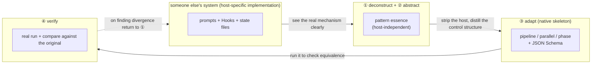
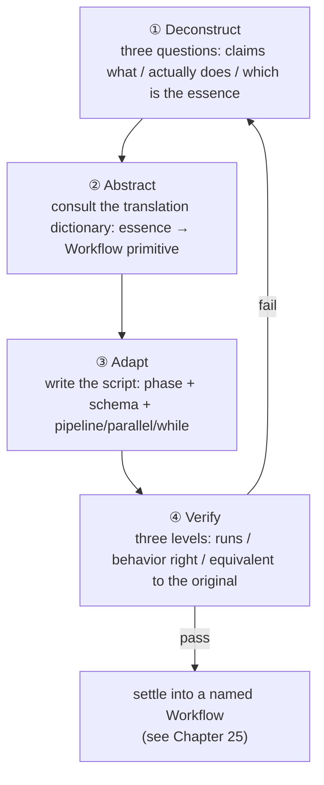

# Chapter 24 · The Art of Extraction

> In the last chapter we dissected the engine compartments of four community systems, repeatedly saying "this point is worth learning from." But "learning from" isn't copy-pasting someone's prompts over — that way you get **an organ grown on someone else's host**, which is instantly rejected when transplanted into native Workflow. This chapter gives a **reusable methodology**: how to systematically take apart, peel off, and rewrite "good ideas from others' systems" into your own deterministic, reusable Workflow.
>
> Four actions, none optional: **deconstruct (see its real mechanism clearly) → abstract (strip the host, distill the pattern's essence) → adapt (rewrite with `phase`/`schema`/`parallel`/`pipeline`) → verify (actually run it, compare against the original system)**. This chapter walks these four steps from the top using Chapter 23's four real cases.

---

## 24.1 Why an "Art" Is Needed, Rather Than Direct Copying

First a story that will fail, and you'll understand what the "art" solves.

Suppose you read superpowers' `subagent-driven-development/SKILL.md` and were taken with its "two-stage review": each task first a spec-compliance review, then a code-quality review, each looping until it passes. You naturally think: **just copy those two review prompts into my project, won't that do?**

So you copy that markdown into your own `.claude/skills/`, happily thinking you got "two-stage review." But you'll soon find three problems:

1. **It depends on a host you don't have.** The reason superpowers' review "loops until it passes" isn't those two prompts themselves but its whole `SessionStart`-injected "behavioral constitution" + skill chain + checkbox state files. Lifting the prompts out alone makes them the "dead code" of Chapter 23 — without the bootstrap, the skill isn't force-triggered.
2. **Its "guarantee" is probabilistic.** Even with the full host, superpowers' review loop is essentially "a prompt requesting the model to review once more." The model may review, or may feel "good enough" and skip. It's a **soft convention**, not a hard control flow.
3. **Its product is text for a human, not data for a program to consume.** The review conclusion is written in the conversation, and you can't use code to judge "did this round pass, do we need another round."

<div class="callout warn">

**The fundamental lesion of direct copying**: what you copied is the **implementation** (a specific combination of prompts + hooks + state files on some host), while what you actually want is the **pattern** (the control structure "after writing, first check the spec, then check the quality, redo if it doesn't pass"). The implementation is grown on the host; the pattern is what's transferable. **The whole point of the art of extraction is to peel the pattern out of the implementation, then grow a new implementation with native Workflow's skeleton.**

</div>

Back to Chapter 23's book-wide insight: these four systems all were born before native Workflow, and they used "prompts + Hooks + state files" to **simulate** a deterministic orchestration engine. The gems they invented — verification gates, persistent loops, disk state, boundary guardrails — are all **patterns**; and the way they carry these patterns (soft conventions, hook injection, file life-extension) is **that era's implementation.**

Native Workflow gives you a stronger set of carrying tools:
- `pipeline` / `parallel` / `phase` — express control flow with **code**, a strong guarantee;
- JSON Schema — turn "what the product looks like, whether it's qualified" from free text into a **machine-decidable contract**;
- `agent({ schema })`'s tool-layer validation + auto-retry — turn "ask the model to try again" from a prayer into a **runtime discipline.**

So the product of the art of extraction is a Workflow script that **welds someone else's pattern onto the native skeleton.** The diagram below is the chapter's master outline:



---

## 24.2 Step One · Deconstruct: See Its Real Mechanism Clearly

"Deconstruct" answers one question: **what is the mechanism that actually makes this good idea work?** Note the word "actually" — people's **narrative** about their own system often diverges from its **real implementation.** Extraction's first principle: **trust only the source code, not the marketing copy.**

Deconstruction has three progressively deeper interrogations, which I call "the three questions":

### Question one: what does it claim to do? (the narrative layer)

First note its **self-narrative** — what the README says, what the docs say. For example, OMC says it "the boulder never stops, so a complex task isn't silently declared half-finished." This is its **intent**, a good starting point, but not the mechanism.

### Question two: what does it actually do? (the mechanism layer)

This step requires **reading the source**, finding the code/config that really implements the intent. Chapter 23 already did this for us, and the conclusions can be cited directly (the source is a genuine reading of each repository's source code):

| System | What it claims (narrative) | What it actually does (mechanism, source-code layer) |
|---|---|---|
| superpowers | "First clarify intent, produce a spec, then TDD" | In `subagent-driven-development/SKILL.md`, **two reviews per task**: spec-compliance review → code-quality review, each requiring re-review until it passes |
| OMC | "boulder never stops" | The `Stop` hook (`persistent-mode`) checks whether `.omc/state/` has an active mode, and if so **blocks stopping** and re-injects "The boulder never stops" |
| ccg | "fight context compaction, long tasks don't drift" | `workflow-state.js` on every `UserPromptSubmit` reads `task.json` and injects a `<ccg-state>` **breadcrumb** |

Note every "actually" cell is precise to the **file name/hook name/field name.** This is the standard of deconstruction: **you can say in which file, with what data structure, at what lifecycle point it takes effect.** If you can't get to this granularity, you haven't finished deconstructing.

### Question three: which part is the pattern, which is the host? (the peeling layer)

This is the seam between deconstruction and abstraction. With the mechanism in hand, interrogate each component: **is it "the essence of this idea" or "the accident of this host"?**

Take OMC's Stop hook:

| Mechanism component | Essence (pattern) or accident (host)? | Reason |
|---|---|---|
| "Finishing doesn't necessarily mean done; it depends on meeting criteria" | **Essence** | This is the core idea of the "completion-criteria loop," independent of any host |
| Implemented with the `Stop` lifecycle hook | **Host accident** | Because OMC has no native control flow, it can only borrow a hook to "intercept stopping" |
| Criteria stored in `.omc/state/sessions/{id}/` | **Host accident** | Because a prompt-driven loop has no memory, it can only rely on disk for life-extension |
| Re-injecting "The boulder never stops" text | **Host accident** | This is the prompt means of "asking the model to continue" |

The peeling conclusion is clear at a glance: **the essence is just one sentence — "whether ending is allowed should be decided by a programmable criterion."** The rest is all scaffolding OMC had to invent under the constraint of "no native loop."

<div class="callout tip">

**Deconstruction's product** is a "mechanism spec sheet," at minimum containing: ① the intent it claims; ② the real code location and data flow that implement the intent; ③ an item-by-item annotation of "essence / host accident." This book's Chapter 23 dissection of the four systems is itself four ready-made mechanism spec sheets — you can stand on its shoulders when extracting, but **for any new system you want to learn from, you must do this step by hand.**

</div>

---

## 24.3 Step Two · Abstract: Strip the Host, Distill the Pattern's Essence

Deconstruction tells you "which are the essence"; abstraction **re-states these essences as a host-independent control-structure description** and translates them into native Workflow's vocabulary.

The key technique of abstraction is to map each pattern to a **control-flow primitive.** Native Workflow's primitives are just a few, and a pattern's essence often corresponds to exactly one:

| Pattern essence (the one-line abstraction) | The corresponding Workflow primitive | Why it |
|---|---|---|
| "B can't run until A is done, and B depends on A's product" | **Sequential dependency**: `pipeline` or a direct `await` | Stages have a data dependency, must be serial |
| "N mutually independent things done at once, want all results" | `parallel` (barrier) | No dependency + need to consolidate |
| "N things each independently flow through the same string of stages" | `pipeline` (no barrier) | Each chain independent, wall clock takes the slowest |
| "Do it repeatedly until a criterion is met" | `while` + a gate field | The exit condition is dynamic, must loop |
| "The product must take a certain shape to count" | `agent({ schema })` | The schema forces structure and type at the tool layer |
| "Show this thing under a certain phase" | `phase()` / `opts.phase` | Progress grouping |

This table is the art of extraction's "translation dictionary." This abstraction step is essentially repeatedly consulting this dictionary: **translate each deconstructed essence into a combination of one or more primitives from the dictionary's right column.**

Let's abstract the four cases respectively:

**superpowers two-stage review** abstracts to:
> "For a product, first do the **first** review (spec compliance), redo if it doesn't pass; once passed, do the **second** review (code quality), also redo if it doesn't pass."
>
> Translation: the two reviews are **sequential** (spec first, then quality) → two stages of `pipeline`; each review's "pass/fail" must drive a judgment → each gets a `schema` with a `pass: boolean` gate field; "redo if it doesn't pass" → a bounded `while` on a single product inside the stage.

**OMC Stop hook** abstracts to:
> "Advance repeatedly, until a programmable criterion rules 'we may wrap up.'"
>
> Translation: "repeatedly until a criterion" → `while` + a `done`/`accepted` gate field (isomorphic to Chapter 18's "loop-until-dry"); "programmable criterion" → an independent acceptance `agent({ schema })`, with `accepted: boolean` in the schema.

**ccg disk breadcrumbs** abstracts to:
> "Let subsequent steps get the **structured product** of preceding steps, so they always know 'the current progress and known facts,' without depending on a conversation history that gets compacted."
>
> Translation: ccg uses "disk + per-turn injection" because its steps are scattered across multiple conversation turns and get washed out by context compaction. But native Workflow's script body is **one continuous JS closure** — the return value of the previous `agent()` is a variable in the next `agent()`'s prompt. `task.json`'s essence ("externalize state, pass it explicitly") **degenerates into ordinary variable passing and structured output** in Workflow, needing no disk at all.

**OmO tool-layer guardrail + Category delegation** abstracts to two sentences:
> "① The planner's product may only be a 'plan,' never smuggling in 'side effects on code'; ② 'which model to use' should be decided by the task's _semantic category_, not a hard-coded model name scattered through the prompts."
>
> Translation: ① "the product may only be a certain shape" → `agent({ schema })`, with `additionalProperties: false` to keep fields like diff/patch **structurally** out, then split "execution" into a separate phase (role separation); ② "pick the model by category" → a `MODEL_BY_CATEGORY` lookup table + `opts.model`, letting the `category` field drive dispatch.

<div class="callout info">

**The most common epiphany in the abstraction stage** is discovering that some "gem" **needs no separate implementation at all** in native Workflow — because the problem it solves (context compaction, cross-turn amnesia, stopping when finished) is a host defect, and the native skeleton inherently lacks that defect. ccg's disk breadcrumbs are typical: in Workflow they "vanish" into variable passing. **Recognizing "this gem is free in the new host" is as valuable as "transplanting this gem."**

</div>

---

## 24.4 Step Three · Adapt: Rewrite with phase / schema / parallel / pipeline

Abstraction gave you the blueprint of "which primitives, how to combine"; adaptation lands the blueprint into a **runnable script.** This step we do once for each of the four cases, writing complete scripts.

> All scripts in this section are marked "(illustrative, not run)" — they are **templates** for landing a pattern into code, demonstrating structure and primitive usage; the real-run data they cite (like GCF's `wf_7472ceac-daa`) comes from earlier chapters' real-run records and is traceable.

### Case 1: superpowers two-stage review → `pipeline(tasks, specReview, qualityReview)` + two schemas

This is the core demonstration of welding "methodological discipline" into a "deterministic quality gate." The pattern abstraction is done: the two reviews are sequential, use two stages of `pipeline`; each stage has a `pass` gate; redo with a bound if it doesn't pass.

First the **most direct landing** — make the two reviews two stages of `pipeline`, letting each task to be reviewed flow independently:

```javascript
// (illustrative, not run) — superpowers two-stage review → pipeline + two schemas
export const meta = {
  name: 'two-stage-review',
  description: 'Spec-compliance review then code-quality review, each a deterministic gate',
  phases: [
    { title: 'SpecReview', detail: 'Per task, check whether the spec is implemented precisely (not over, not under)' },
    { title: 'QualityReview', detail: 'After passing the spec gate, review code quality' },
  ],
}

// Each schema has a pass gate field — this is the physical form of the "gate"
const SPEC_SCHEMA = {
  type: 'object',
  properties: {
    pass: { type: 'boolean' },                         // whether it precisely matches the spec
    overImplemented: { type: 'array', items: { type: 'string' } },  // what was done extra
    underImplemented: { type: 'array', items: { type: 'string' } }, // what was missed
    verdict: { type: 'string' },
  },
  required: ['pass', 'overImplemented', 'underImplemented', 'verdict'],
}

const QUALITY_SCHEMA = {
  type: 'object',
  properties: {
    pass: { type: 'boolean' },
    issues: {
      type: 'array',
      items: {
        type: 'object',
        properties: {
          severity: { type: 'string', enum: ['blocker', 'major', 'minor'] },
          note: { type: 'string' },
        },
        required: ['severity', 'note'],
      },
    },
    verdict: { type: 'string' },
  },
  required: ['pass', 'issues', 'verdict'],
}

// args.tasks: [{ id, spec, diff }], each an implementation unit to review
const tasks = args.tasks

const results = await pipeline(
  tasks,
  // stage 1: spec-compliance review. receives the original task
  (task) =>
    agent(
      `You are a spec-compliance reviewer. Against the spec below, judge whether the implementation **precisely** matches — ` +
      `neither doing extra (over-implementation) nor too little (under-implementation).\n` +
      `SPEC:\n${task.spec}\n\nDIFF:\n${task.diff}`,
      { label: `spec:${task.id}`, phase: 'SpecReview', schema: SPEC_SCHEMA }
    ),
  // stage 2: code-quality review. receives (specResult, task, index)
  (specResult, task) => {
    // spec gate didn't pass, so don't waste a quality agent — pass the conclusion straight down
    if (!specResult.pass) {
      return { stage: 'spec', specResult, qualityResult: null, accepted: false }
    }
    return agent(
      `You are a code-quality reviewer. Spec compliance has passed; now look only at code quality` +
      ` (naming, error handling, edge cases, readability). List the issues with severities.\n` +
      `DIFF:\n${task.diff}`,
      { label: `quality:${task.id}`, phase: 'QualityReview', schema: QUALITY_SCHEMA }
    ).then((qualityResult) => ({
      stage: 'quality',
      specResult,
      qualityResult,
      accepted: qualityResult.pass,
    }))
  }
)

log(`Two-stage review complete: ${results.filter(Boolean).length} tasks flowed through both gates`)
return results
```

This script turns superpowers' "prompt-requested re-review" soft convention into **two physical gates**: if the first `SPEC_SCHEMA.pass` isn't true, the second doesn't even open (no quality agent is dispatched, saving a token); both pass, and `accepted` is true. `pipeline` lets each task flow **independently** through both gates — 10 tasks' wall clock ≈ the time for the slowest single task to go through both gates, not "review all specs, then review all qualities" (that's the inefficient `parallel` barrier form, which Chapter 26 specifically criticizes).

But what about "redo if it doesn't pass"? The version above is "review once, give a conclusion." To implement superpowers' true "loop until pass," add **bounded retry** inside the gate — and retry means "review → if it doesn't pass, fix → review again," which actually degenerates into Chapter 12's GCF (generate-critique-fix) loop. Let's write it out explicitly:

```javascript
// (illustrative, not run) — bounded loop inside the gate: review → fix → re-review, until pass or hitting the cap
async function gatedFix(task, reviewSchema, reviewerRole, maxRounds = 3) {
  let diff = task.diff
  let round = 0
  let lastReview = null
  while (round < maxRounds) {                          // bounded! see Chapter 18
    round++
    const review = await agent(
      `${reviewerRole}\nSPEC:\n${task.spec}\n\nDIFF:\n${diff}`,
      { label: `review:${task.id}:r${round}`, schema: reviewSchema }
    )
    lastReview = review
    if (review.pass) return { passed: true, rounds: round, diff, review }
    // didn't pass: dispatch a fixer to rewrite per the review feedback
    const fixed = await agent(
      `You are the implementer. The review didn't pass; make **minimal changes** per the feedback below and give the complete new diff.\n` +
      `Feedback: ${JSON.stringify(review)}\nOriginal diff:\n${diff}`,
      {
        label: `fix:${task.id}:r${round}`,
        schema: { type: 'object', properties: { diff: { type: 'string' } }, required: ['diff'] },
      }
    )
    diff = fixed.diff
  }
  return { passed: false, rounds: round, diff, review: lastReview }  // hit the cap, exit with the last state
}
```

Every detail here echoes the disciplines set in earlier chapters: `maxRounds` is Chapter 18's repeatedly stressed "the brake is discipline, not optional"; the `pass` gate field is isomorphic to Chapter 18's "`done: boolean` gate"; the independent reviewer and fixer are Chapter 12's "critique must go to an independent agent, or it self-defends." **This is the compound interest of the art of extraction** — the discipline you established for one case can be applied verbatim to the next.

### Case 2: OMC Stop-hook completion criteria → a `while(!done)` loop + an acceptance schema

OMC's gem abstracts to "advance repeatedly, until a programmable criterion rules we may wrap up." This already has a complete Workflow incarnation in Chapter 18 ("loop-until-dry"); here we use a form closer to OMC's "every story in the PRD must be `passes:true` to count as done" to demonstrate — **accept item by item, stop only when all pass**:

```javascript
// (illustrative, not run) — OMC "boulder never stops" → while + acceptance schema
export const meta = {
  name: 'acceptance-loop',
  description: 'Keep working until an independent acceptance gate passes every story (OMC-style)',
  phases: [
    { title: 'Build', detail: 'Produce/revise a version of the implementation' },
    { title: 'Accept', detail: 'Independently accept each story, allow wrap-up only when all pass' },
  ],
}

// Acceptance schema: accepted is the gate for "whether stopping is allowed"; perStory gives each one's judgment
const ACCEPT_SCHEMA = {
  type: 'object',
  properties: {
    accepted: { type: 'boolean' },                     // equivalent to OMC's "Stop hook lets through"
    perStory: {
      type: 'array',
      items: {
        type: 'object',
        properties: {
          id: { type: 'string' },
          passes: { type: 'boolean' },                 // corresponds to each story's passes in prd.json
          gap: { type: 'string' },                     // if it doesn't pass, explain the gap
        },
        required: ['id', 'passes', 'gap'],
      },
    },
  },
  required: ['accepted', 'perStory'],
}

const MAX_ROUNDS = 5
const stories = args.stories          // [{ id, requirement }]
let work = args.initialDraft || ''
let round = 0
let accepted = false
let lastReport = null

while (!accepted && round < MAX_ROUNDS) {               // dual exit: criterion + hard cap
  round++

  // budget fallback: if not enough budget for another round (Build+Accept, two agents), close out early
  if (budget.total !== null && budget.remaining() < 60_000) {
    log(`Not enough budget for another round (remaining ${budget.remaining()}), closing out with current state`)
    break
  }

  phase('Build')
  const built = await agent(
    `You are the implementer. Produce/revise the implementation per the stories below.\n` +
    `stories: ${JSON.stringify(stories)}\n` +
    `Last round's acceptance feedback (empty on the first round): ${lastReport ? JSON.stringify(lastReport.perStory) : 'none'}\n` +
    `Current implementation: ${work || '(empty, write from scratch)'}`,
    {
      label: `build:r${round}`,
      phase: 'Build',
      schema: { type: 'object', properties: { work: { type: 'string' } }, required: ['work'] },
    }
  )
  work = built.work

  phase('Accept')
  // Key: the acceptor is an independent agent, not the build agent above — or it would endorse its own product
  lastReport = await agent(
    `You are an independent acceptor. Check item by item whether each story is met by the implementation.` +
    ` **Only when all passes=true is accepted true.**\n` +
    `stories: ${JSON.stringify(stories)}\nimplementation: ${work}`,
    { label: `accept:r${round}`, phase: 'Accept', schema: ACCEPT_SCHEMA }
  )
  accepted = lastReport.accepted

  if (!accepted) {
    const failing = lastReport.perStory.filter((s) => !s.passes).map((s) => s.id)
    log(`Round ${round} acceptance didn't pass, unmet: ${failing.join(', ')}`)
  }
}

return {
  accepted,
  rounds: round,
  hitCeiling: !accepted && round >= MAX_ROUNDS,         // honestly marked: was it "truly passed" or "hit the cap"
  work,
  finalReport: lastReport,
}
```

Compare this with OMC's real mechanism and you see a beautiful **dimensionality reduction**:

| OMC's implementation (host-specific) | Workflow's counterpart (native skeleton) |
|---|---|
| The `Stop` hook intercepting stopping | The `while (!accepted ...)` loop condition |
| `.omc/state/` storing mode/phase/iteration | The ordinary variables `round` / `work` / `lastReport` |
| Re-injecting "The boulder never stops" | The loop naturally enters the next round, no prompt needed |
| An independent critic verifying `passes:true` | An independent `agent({ schema: ACCEPT_SCHEMA })` |
| Resume after a crash | `resumeFromRunId` resume (Chapter 22) |

All the scaffolding OMC paid to "make the loop programmable" — hooks, state files, re-injected text — **collapses into a `while` and a few local variables** in native Workflow. This isn't OMC being dumb but it being born in an era without native loops; and this is the literal fulfillment of Chapter 23's line: **native Workflow provides the deterministic skeleton they lacked.**

<div class="callout warn">

**Don't transplant OMC's gem into an "unbounded loop."** When transplanting a "keep going until a criterion passes" persistent loop like this, you **must** avoid an unbounded loop — the Workflow version must bring along `MAX_ROUNDS` + a `budget.remaining()` fallback, which is Chapter 18's iron law (the model's `done`/`accepted` is a probabilistic judgment and may withhold approval indefinitely). Honestly mark `hitCeiling` in the return value, so the caller knows whether this was "truly accepted" or "hit the cap and was forced to wrap up." Never let "boulder never stops" become "token never stops."

</div>

### Case 3: ccg disk breadcrumbs → structured-output product passing

This case's "adaptation" is the most special — because in the abstraction stage we already discovered: **ccg's disk breadcrumbs are basically free in native Workflow.** But "free" doesn't mean "nothing to do"; it corresponds to a **positive practice** in Workflow: use structured products to explicitly pass "known facts + current progress" between stages, rather than having subsequent agents guess or read a history that gets compacted.

ccg's `task.json` + `<ccg-state>` breadcrumbs essentially answer "what should the next step know." In Workflow, this is done by **feeding the previous stage's structured output directly into the next stage's prompt**:

```javascript
// (illustrative, not run) — ccg disk breadcrumbs → structured-output explicit product passing
export const meta = {
  name: 'breadcrumb-pipeline',
  description: 'Pass a structured "state" object down the pipeline instead of disk breadcrumbs',
  phases: [
    { title: 'Survey', detail: 'Survey: produce structured "current facts"' },
    { title: 'Plan', detail: 'Produce a plan based on the survey (carrying the facts snapshot it depends on)' },
    { title: 'Execute', detail: 'Execute based on the plan (carrying the plan and survey it depends on)' },
  ],
}

// This schema is the structured form of the "breadcrumb" — explicit, validatable, passable
const STATE_SCHEMA = {
  type: 'object',
  properties: {
    facts: { type: 'array', items: { type: 'string' } },      // confirmed facts (corresponds to what ccg writes into task.json)
    openQuestions: { type: 'array', items: { type: 'string' } },
    nextActions: { type: 'array', items: { type: 'string' } },
  },
  required: ['facts', 'openQuestions', 'nextActions'],
}

phase('Survey')
const state = await agent(
  `You are a surveyor. Survey ${args.target}, produce a structured current state: confirmed facts, open questions, suggested next actions.`,
  { label: 'survey', phase: 'Survey', schema: STATE_SCHEMA }
)

phase('Plan')
// Key: stuff the previous stage's "breadcrumb" verbatim into the next stage's prompt — this is "injection," but it happens in the closure, not via disk
const plan = await agent(
  `You are a planner. Make a plan based on the **current-state snapshot** below. Don't re-survey, just trust these facts.\n` +
  `Current-state snapshot: ${JSON.stringify(state)}`,
  {
    label: 'plan',
    phase: 'Plan',
    schema: {
      type: 'object',
      properties: {
        steps: { type: 'array', items: { type: 'string' } },
        assumptions: { type: 'array', items: { type: 'string' } },
      },
      required: ['steps', 'assumptions'],
    },
  }
)

phase('Execute')
const result = await agent(
  `You are the executor. Execute per the plan. Below you're given both the **current state** and the **plan**, to ensure actions are consistent with known facts.\n` +
  `Current state: ${JSON.stringify(state)}\nPlan: ${JSON.stringify(plan)}`,
  {
    label: 'execute',
    phase: 'Execute',
    schema: { type: 'object', properties: { summary: { type: 'string' }, done: { type: 'boolean' } }, required: ['summary', 'done'] },
  }
)

return { state, plan, result }
```

Compared with ccg's real mechanism, the difference is structural:

| ccg disk breadcrumbs | Workflow structured output |
|---|---|
| State written into `task.json` (disk) | State is the `state` / `plan` local variables (in-memory closure) |
| Each turn a Hook reads disk → injects `<ccg-state>` | Directly `JSON.stringify(state)` spliced into the next prompt |
| Exists to fight "cross-turn context compaction" | No compaction problem within one script closure, inherently not lost |
| Breadcrumbs are unstructured text fragments | `STATE_SCHEMA` makes breadcrumbs **structured and validatable** |

<div class="callout tip">

**The real value of ccg's lesson isn't "move disk into memory" but the principle of "pass explicitly, pass structured."** Many people, writing Workflows for convenience, let the next agent "read the file itself / re-survey itself" — which is slow and may get inconsistent facts. ccg uses disk breadcrumbs to force "state explicitness," and this **habit** is worth inheriting: have each stage's key output go through `schema` and be explicitly fed to the next stage. Native Workflow lowers the cost of this to "a variable + a `JSON.stringify`," with no reason not to do it.

</div>

### Case 4: OmO tool-layer guardrail → a schema-constrained "planner-executor" role separation

The fourth case comes from OmO (built on opencode). Its gem was deconstructed clearly in Chapter 23; here we walk the full "abstract → adapt." First, distill the two essences:

> **Essence one (tool-layer guardrail)**: OmO's `prometheus-md-only/hook.ts` hard-intercepts at the tool-call layer — the planner's `Write/Edit` may only write `.omo/*.md`, violations directly `throw`. **The planner physically cannot write code.** Abstracted to one sentence: "the planner's product must be a 'plan,' not 'side effects on code.'"
>
> **Essence two (Category delegation)**: OmO dispatches not by model name but by **semantic intent** (`category`) — the LLM only declares "what category of thing this is," and the runtime maps it to a concrete model. Abstracted to one sentence: "make 'which model does it' a hot-swappable mapping table, rather than a hard-coding scattered through the prompts."

**Adapting essence one: replicate 'the planner can't touch code' with `schema` + role separation.** Native Workflow's script body has no FS/Node API, so an agent can't write host files directly anyway; but "the planner may not emit code" can be physically guaranteed with a strict `schema` that **only permits plan fields to appear** — `additionalProperties: false` makes the planner **structurally** unable to smuggle in a diff/patch, and a **separate executor stage** then consumes that plan:

```javascript
// (illustrative, not run) — OmO tool-layer guardrail → a schema-constrained planner / executor separation
export const meta = {
  name: 'planner-executor',
  description: 'A schema-locked planner that cannot emit code, then a separate executor stage',
  phases: [
    { title: 'Plan', detail: 'The planner can only produce a plan object (schema-locked, cannot smuggle code)' },
    { title: 'Execute', detail: 'A separate executor consumes the plan; the only stage allowed to produce code side effects' },
  ],
}

// Key: additionalProperties:false makes any field beyond "the plan" (like diff/patch) fail validation
// This is OmO's "tool-layer throw" equivalent in native Workflow — moving the guardrail from "intercept the tool call" forward to "constrain the product's shape"
const PLAN_SCHEMA = {
  type: 'object',
  additionalProperties: false,                         // physical wall: only the fields listed below count
  properties: {
    steps: {
      type: 'array',
      items: {
        type: 'object',
        additionalProperties: false,
        properties: {
          id: { type: 'string' },
          intent: { type: 'string' },                  // what this step aims to achieve (a description, not code)
          targetFile: { type: 'string' },              // which file it expects to change (just a declaration, no content)
          category: { type: 'string', enum: ['research', 'mechanical', 'design', 'risky'] },
        },
        required: ['id', 'intent', 'targetFile', 'category'],
      },
    },
    risks: { type: 'array', items: { type: 'string' } },
  },
  required: ['steps', 'risks'],
}

phase('Plan')
// The planner: even if it "wants" to write code, the schema has no field to carry it — StructuredOutput rejects on a structural mismatch and retries
const plan = await agent(
  `You are the planner. Produce only a **plan**: break the task into steps, each with an intent, the target file it expects to change, and the step's category.` +
  ` You cannot, and need not, write any code or diff — there's a separate executor downstream.\nTask: ${args.task}`,
  { label: 'plan', phase: 'Plan', schema: PLAN_SCHEMA }
)

phase('Execute')
// The executor: the only role allowed to actually touch code. What it receives is a pure plan already validated by the schema
const execResult = await agent(
  `You are the executor. Implement step by step strictly per the plan below (this is the only stage allowed to produce code side effects).\n` +
  `Plan: ${JSON.stringify(plan)}`,
  {
    label: 'execute',
    phase: 'Execute',
    schema: {
      type: 'object',
      properties: {
        changedFiles: { type: 'array', items: { type: 'string' } },
        summary: { type: 'string' },
      },
      required: ['changedFiles', 'summary'],
    },
  }
)

return { plan, execResult }
```

Compare it with OmO's real mechanism and the guardrail's "location" undergoes a beautiful forward shift:

| OmO's implementation (host-specific) | Workflow's counterpart (native skeleton) |
|---|---|
| `hook.ts` intercepts `Write/Edit` **before the tool call** | `PLAN_SCHEMA` intercepts non-plan fields **at product validation** |
| Violation path → `throw` | Violating structure → StructuredOutput rejects, the model retries |
| "The planner may only write `.omo/*.md`" | "The planner may only produce an object of `PLAN_SCHEMA` shape" |
| Execution handed to another agent role | Execution handed to a separate `Execute` phase |

Both reach an **equivalent guarantee**: neither lets the planner smuggle "side effects on code" into its output. OmO relies on intercepting the tool call, native Workflow on constraining the product's shape + phase role separation — the latter is even cleaner, because it simply never grants the planner the "write a file" capability, rather than intercepting after the fact.

**Adapting essence two: a Category → model mapping table.** OmO's "delegation by semantic intent" is, in native Workflow, just an ordinary lookup table + `opts.model`:

```javascript
// (illustrative, not run) — OmO Category delegation → args.category-driven model mapping
// A hot-swappable mapping table: to change a model, edit one line here, touch no prompt
const MODEL_BY_CATEGORY = {
  research: 'opus',          // research needing deep reasoning → a strong model
  design: 'opus',
  mechanical: 'haiku',       // mechanical, highly deterministic work → a cheap fast model (echoing _grounding: simple tasks can use haiku)
  risky: 'opus',
}

// Let the previous stage's plan.steps[].category directly decide who each step is dispatched to — "by category," not "by hard-coded model name"
const stepResults = await pipeline(
  plan.steps,
  (step) =>
    agent(
      `Execute this step: ${step.intent} (target file ${step.targetFile}).`,
      {
        label: `step:${step.id}`,
        model: MODEL_BY_CATEGORY[step.category] || 'opus',   // fallback: an unknown category uses the strong model
      }
    )
)
```

This small mapping table's value matches OmO's design motive: **pull "which model to use" out of the prompts and centralize it in one config.** When models turn over (e.g., haiku upgrades, a new mid-tier model is added), you edit just one line of `MODEL_BY_CATEGORY`, and all category-dispatched steps follow automatically; not one model name appears in the prompts, so there's no maintenance debt of "model names scattered everywhere, miss one when changing."

<div class="callout warn">

**Honestly state the schema's boundary (echoing 24.5's stance): `schema` locks the product's _shape_, not the product's _truthfulness_.** The `planner-executor` above can guarantee "what the planner hands over is a pure plan object," but it **cannot** guarantee "the plan is correct," still less "the executor actually did it." Besides the tool-layer guardrail, OmO has another layer of **system-reminder injection** (`VERIFICATION_REMINDER`: "the sub-agent says it's done — it's lying, go verify") — and **this layer has no exact counterpart in native Workflow**: Workflow has no hook to "hard-inject a reminder into the sub-agent's context each turn." So the native equivalent of OmO's "untrusted verification" gem is **not the schema, but an explicit verification stage** — you must add an independent verify-agent yourself (like Case 1's quality gate, Case 2's accept gate), and use its `pass`/`accepted` gate to judge the executor's product. **Don't expect `schema` to do verification for you; it only handles shape — verification relies on an independent human/agent.**

</div>

---

## 24.5 Step Four · Verify: Actually Run It, Compare Against the Original

Adaptation produced a script, but **a script that hasn't been run isn't a successful extraction.** Verification answers two questions: ① can it really run? ② does it really replicate the original system's gem (rather than look like it)?

### The three levels of verification

**Level one: it runs (syntax + execution).** Hand the script to the Workflow tool. Recall Chapter 01: the return is async, immediately giving `taskId`/`runId`; if `meta` isn't a pure literal or the script has a syntax problem, `WorkflowOutput` carries `error` (on syntax-check failure). This level verifies "the skeleton stands."

**Level two: behavior is right (the product meets expectations).** After running, look at the return value in the completion notification. Here `schema` is your free assertion — if `agent({ schema })` returned, the product **already** passed the structural validation. But right structure doesn't mean right semantics, and you must check manually: did the two-stage review really stop a non-compliant diff? Did the acceptance loop really stop only when all passed?

**Level three: equivalence (compare against the original system).** This is a level unique to extraction: is your Workflow version consistent in **key behaviors** with the original system it imitates? The method is to construct an input "the original system would process," and see whether both sides' conclusions agree.

### A real equivalence verification: GCF is a simplified real run of superpowers' two-stage review

This book's Chapter 12 GCF recipe is a **real-run** "generate → adversarial critique → fix," and it's exactly the "single-stage real-run version" of superpowers' two-stage review. We use it to demonstrate what "equivalence verification" looks like — because it has real data to anchor to:

> **Real run**: GCF (`slugify`) Run ID `wf_7472ceac-daa`, Task ID `wchxy8dbm`, raw record in `assets/transcripts/gcf-slugify.md`. Real usage `agent_count=3`, `tool_uses=10`, `total_tokens=96468`, `duration_ms=180724` (about 3 minutes).

In this run, **an independent adversarial-critique agent (the Critique stage) listed 10 genuine defects in a 30-line `slugify()`** (sorted by severity; see `gcf-slugify.md`). This is an **observation**, not a counterfactual proof — what it shows is: splitting "writing" and "fault-finding" across two agents, and explicitly asking the latter to review adversarially, did this time systematically expose the first draft's blind spots. This section did not run a control group of "let the generating agent self-review the same code," so it cannot assert "self-review would certainly fail to catch these defects"; what can be said is that the GCF/superpowers "independent critique" structure hands the job of finding blind spots to a perspective that does not vouch for the product, and this run confirms that structure produces valuable critique.

**This is a template of an "equivalence verification"**: we didn't copy superpowers' prompts but rewrote with native primitives (three stages + an independent critique agent + schema), then actually ran it, observing that it replicates the **structural essence** of "doing adversarial critique with an independent perspective." Compared to GCF, the two-stage review only adds a "spec first, then quality" tiering — the structure is the same source, and this real run verified that this structural chain is feasible.

Chapter 12 also gives a direct echo: its "Variant B · judges gate the Fix" explicitly says "after Fix, add another independent agent to compare the original issues with the fixed version, confirming each was really fixed (**echoing Chapter 23's superpowers two-stage review**)." This transfer chain — superpowers' pattern → GCF's real run → Variant B's two-staging — is a living sample of this chapter's methodology working through.

### A controlled experiment in verification: calibrate intuition with real data

Verification has one often-overlooked use: **calibrate your intuition about cost and convergence with real-run data**, to avoid a transplanted pattern running away at your scale. This book's real runs give several directly-citable anchors:

| Real run | Run ID | Calibration for extraction |
|---|---|---|
| judge-panel (3 judges scoring independently) | `wf_f5b69668-b18` | 3 non-communicating judges **independently converged 3:0** on candidates with "clearly differing quality" — observed evidence consistent with "multiple independent perspectives reduce single-reviewer bias" (an assumption both superpowers/OMC rely on) (a single 3:0 convergence, not a general proof) |
| frontend-review (3-dimension concurrent review + synthesis) | `wf_4c5caabb-b73` | `agent_count=4`, `total_tokens=221648` — confirming "token ≈ agent count × per-agent context," and you can estimate cost from this before transplanting "multi-dimension review" |
| nested-parent (nested sub-flow) | `wf_85e22b38-126` | The sub-flow's agents **count toward the parent flow**'s `agent_count`/`budget.spent()` — when transplanting the "sub-flow delegation" pattern, budget must be computed as parent+child combined |

<div class="callout info">

**That judge-panel run also has an observation worth recording**: the 3 judges noted in their scoring rationale that they **actually read `docs/en/p2-08` and `assets/_grounding.md` to cross-check** several numbers in the book (8.4s/78844 tokens, min(16, cores−2), the 1000 cap…), concluding "zero factual errors." Note that this is behavior exhibited **in this one run**, by judges that were given a scoring rubric/schema — it is **not** a universal guarantee of Workflow. `agent({ schema })` validates the structure of the output; it does not force the agent to verify against external sources. Treat it as an empirical observation: giving judges an explicit rubric + schema helps (rather than guarantees) elicit behavior like "proactively checking facts." If what you need is an **enforced** verification gate (like OmO's VERIFICATION_REMINDER, the "the sub-agent said it's done, so go verify" kind), you still need explicit prompt instructions or an extra verification agent — you cannot count on the schema itself to bring it.

</div>

### What to do when verification fails: return to step one

Verification not passing falls into two cases:

- **Runs but behavior is wrong** (e.g., the acceptance loop never stops): mostly the **abstraction** missed a discipline (forgot `MAX_ROUNDS`), or the schema gate field was designed wrong. Return to 24.3, re-check the translation dictionary.
- **Runs but isn't equivalent to the original** (e.g., your "two-stage review" actually reviewed only one stage): mostly the **deconstruction** wasn't thorough, taking a host accident for the essence, or missing some key mechanism. Return to 24.2, redo the "three questions."

This is the meaning of that **return dashed line** in 24.1's master outline diagram: extraction is iterative, and verification is its quality-check gate.

---

## 24.6 String the Four Steps into an "Extraction Worksheet"

To make this methodology operational, solidify the four steps into a **worksheet** — next time you see any good idea in a system, fill it in:



| Step | Key question | Product | This book's tool |
|---|---|---|---|
| ① Deconstruct | In which file, what data flow, does its real mechanism take effect? | A mechanism spec sheet (annotating essence/host accident) | Chapter 23's four ready-made spec sheets |
| ② Abstract | Which Workflow primitive does each essence correspond to? | A primitive-combination blueprint | 24.3's translation dictionary |
| ③ Adapt | How to land it as a script with `phase`/`schema`/`pipeline`? | A runnable script | 24.4's four templates |
| ④ Verify | Does it run? Is behavior right? Is it equivalent to the original? | A real run + comparison conclusion | 24.5's real-data anchors |

Walking this worksheet, what you get isn't "copied prompts" but a Workflow you **fully understand, can reproduce deterministically, and can settle into your own library.** The next chapter covers how to organize these products into a maintainable, shareable personal Workflow library.

---

## 24.7 Chapter Summary

- **Direct copying gets rejected**: what you copied is "an implementation grown on someone else's host," while what you actually want is "a host-independent pattern." The art of extraction = peel the pattern out of the implementation, then grow a new implementation with the native skeleton.
- **The four-step method**: deconstruct (see the real mechanism clearly, precise to file/data flow, distinguish essence from host accident) → abstract (consult the translation dictionary, map essence to `pipeline`/`parallel`/`while`/`schema`) → adapt (land a runnable script) → verify (runs, behavior right, equivalent to the original).
- **The four cases' destinations**: superpowers two-stage review → `pipeline` two stages + two `pass` gate schemas (redo with a bound if it doesn't pass); OMC Stop hook → `while(!accepted)` + an acceptance schema (the hook and state files collapse away); ccg disk breadcrumbs → structured-output explicit passing (variable-ized in the closure, the disk vanishes for free); OmO tool-layer guardrail → an `additionalProperties:false` planner schema + a separate executor stage (moving "intercept the tool call" forward to "constrain the product's shape"), Category delegation → a `MODEL_BY_CATEGORY` mapping table.
- **A common epiphany**: some "gems" are **free** in native Workflow (like the context compaction ccg's breadcrumbs fight, which doesn't exist in a single-script closure). Recognizing "it's free" is as important as "transplanting it."
- **Verification relies on real data**: GCF (`wf_7472ceac-daa`, critique caught 10 defects) shows independent critique surfaces issues self-review tends to miss — but with no self-review control group, this is an observation, not proof that it "beats" self-review; it is a living sample of superpowers' two-stage review. judge-panel (`wf_f5b69668-b18`, converged 3:0), frontend-review (`wf_4c5caabb-b73`), nested (`wf_85e22b38-126`) respectively calibrated the intuitions of "multi-perspective convergence," "cost estimation," and "parent+child budget combined."

In the next chapter, we organize these verified Workflows into a personal library that's **nameable, parameterizable, version-manageable, regression-testable, and shareable.**

> Continue reading: [Chapter 25 · Build Your Own Library](#/en/p5-25)
