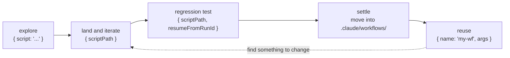
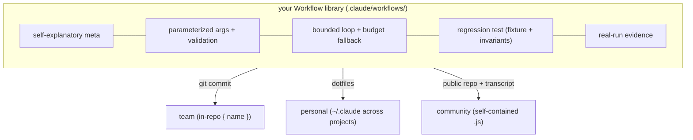

# Chapter 25 · Building Your Own Workflow Library

> Chapter 24 taught you to **extract** good ideas into a validated Workflow script. But a `.js` file lying in a session directory, used once and discarded, has realized only half its value. This chapter is about how to **settle these scripts into a library** — callable by name, reusable with parameters, version-controlled, regression-tested, and shareable with your team.
>
> The technical foundation of all this is the plain fact revealed in Chapter 01: **every time you call, the Workflow script lands to disk as a file.** Since it's a file, it can be named, version-controlled, diffed, and reused. This chapter cashes this fact into a set of engineering practices you can copy directly.

---

## 25.1 From "One-off Script" to "Named Workflow"

Recall that sentence from Chapter 01 §1.6:

> You can file a validated workflow script into `.claude/workflows/` and later reuse it like a named command with `{ name: 'my-workflow' }`.

This is the starting point of a "library." First let's clarify the difference between the three calling forms — they correspond to the three mutually exclusive (by priority) entry fields of `WorkflowInput` (source: `assets/_grounding.md` section B):

| Entry field | Meaning | Applicable stage |
|---|---|---|
| `script` | A self-contained script string, must begin with the pure literal `export const meta` | **Exploration**: writing it for the first time, iterating fast |
| `name` | A predefined/named workflow (built-in or in `.claude/workflows/`) | **After settling**: reusing a validated workflow |
| `scriptPath` | An on-disk script path, with priority **higher than** `script`/`name` | **Iteration/testing**: re-running an edited disk file, resuming |

<div class="callout info">

**`scriptPath` has the highest priority** (per section B). This means: when you're iterating a script, saving it to disk and re-running repeatedly with `{ scriptPath }` is the smoothest workflow; and once it's stable, moving it into `.claude/workflows/` and calling it with `{ name }` makes it "a named tool in the library." **`name` is for consumers, `scriptPath` is for authors.**

</div>

The lifecycle of a script growing from "one-off" into a "library member" is like this:



The rest of this chapter follows this lifecycle, giving engineering practices station by station.

---

## 25.2 Directory Structure: Organizing `.claude/workflows/`

Named workflows live under the project's (or the user's home) `.claude/workflows/`. When the library is small, flat is fine; when it grows, you need structure. Below is a **suggested** scaffold (not enforced by the runtime, an organizational convention):

```text
.claude/
└── workflows/
    ├── README.md                  # library index: one line per workflow, name + one-liner + args
    ├── review/                    # grouped by domain: review category
    │   ├── two-stage-review.js
    │   ├── pr-multidim.js
    │   └── sharded-review.js
    ├── research/                  # research category
    │   └── deep-research.js
    ├── loop/                      # loop category
    │   ├── acceptance-loop.js
    │   └── loop-until-dry.js
    ├── _lib/                      # "quasi-library": unstable drafts, debugged via scriptPath
    │   └── draft-*.js
    └── _fixtures/                 # fixed inputs for regression tests (see 25.6)
        ├── pr-sample.json
        └── stories-sample.json
```

A few organizing principles:

1. **Group by "recipe type," not by project module.** A workflow's reuse value lies in its **pattern** (review / research / loop / fan-out), not in whichever module it happens to handle today. The `two-stage-review.js` under `review/` can review anything tomorrow.
2. **`_`-prefixed directories are the "informal zone."** `_lib/` holds drafts still being debugged with `scriptPath`, not yet stable; `_fixtures/` holds test inputs. The underscore prefix signals "this isn't a finished product to be called directly with `{ name }`."
3. **One file, one workflow, filename = `meta.name`.** This way `{ name: 'two-stage-review' }` and the file `two-stage-review.js` map one-to-one — finding the file is finding the workflow.
4. **`README.md` is the library's table of contents.** Its role to the library is the same as this book's `manifest.json` to the whole book — an index.

<div class="callout tip">

**User-level vs project-level.** Workflows placed in the project's `.claude/workflows/` travel with the project (committable to that project's repo, shared by the team); those placed in the user's home `~/.claude/workflows/` travel with you as a person (usable across all projects). **The criterion**: those coupled to a specific project (e.g., "review this repo's PR template") go project-level; general methodologies (e.g., "judge panel," "deep research") go user-level.

</div>

---

## 25.3 Naming Conventions: Make `name` Self-explanatory

The three fields `meta.name`, `meta.description`, `meta.whenToUse` are the library's "public API" — they decide whether a consumer (a human or a caller) can understand at a glance "what this is for, and when to use it." Recall Chapter 01: `meta` is shown in the permission dialog and the workflow list, so these three fields are **human-facing documentation.**

### name: verb-noun, kebab-case

| Counter-example | Problem | Good example |
|---|---|---|
| `wf1` / `test` / `my-workflow` | No information | —— |
| `review` | Too vague; review what? how? | `two-stage-review` |
| `doStuffWithPRsAndReviewThem` | camelCase + verbose | `pr-multidim-review` |
| `reviewTheCurrentBranchPullRequest` | Contains words like "current/the" that will go stale | `pr-multidim-review` |

The convention: **`<action>-<object>[-<qualifier>]`, all lowercase kebab-case, no soon-to-be-stale demonstratives (current/this/the).** The filename matches it.

### description: one line, stating "what it does + the key constraint"

`description` is shown in the permission dialog; the user relies on it to decide "whether to authorize this fan-out." So it should answer "what this workflow will do, roughly how much commotion." Compare against this book's real scripts' descriptions (all from real-run transcripts):

```javascript
// meta.description from real runs (traceable)
{ name: 'judge-panel',
  description: 'A/B evaluation: two candidates scored by 3 independent judges, then tallied' }
// → at a glance: 2 candidates + 3 judges + tally. Scale is predictable.

{ name: 'gcf-slugify',
  description: 'Generate-Critique-Fix loop producing a robust slugify (CJK + ASCII)' }
// → at a glance: three stages (generate-critique-fix), produces a slugify (covering CJK + ASCII)
```

### whenToUse: optional, but extremely valuable for a library

`whenToUse` (optional, shown in the workflow list) answers "**when** should I be chosen." Once the library grows, a consumer facing a row of workflows uses `whenToUse` to choose:

```javascript
export const meta = {
  name: 'two-stage-review',
  description: 'Spec-compliance gate then code-quality gate, each deterministic',
  whenToUse: 'When you have a batch of implemented tasks (with spec + diff) and need to first ensure ' +
             '"precise implementation" then "quality." For plain bug-finding use bug-hunter; for only style opinions use pr-multidim-review.',
}
```

<div class="callout warn">

**`meta` must be a pure literal** (section B hard constraint). So `description`/`whenToUse` **cannot** use template interpolation to concatenate (e.g., `` `Review ${args.target}` ``) — the runtime statically reads `meta` before execution, at which point `args` does not yet exist. Need the description to vary with arguments? Put the varying part in `log()` (runtime output), keep `meta` static. This is an anti-pattern Chapter 26 expands on.

</div>

---

## 25.4 Parameterization: Use `args` to Turn a Script into a "Reusable Tool"

A script with a hard-coded target isn't a library member — it's a one-off script. **Parameterization is the watershed between "one-off" and "reusable."** The tool is `args` (section B: "the global `args` exposed to the script"; Chapter 01: "the arguments object passed in by the caller").

### From hard-coded to parameterized

Compare two versions of the same "multi-dimension review" workflow:

```javascript
// ✗ Hard-coded version — can only review index.html, change the target and you must edit the source
phase('Review')
const reviews = await parallel([
  () => agent('Review index.html from the a11y dimension ...', { schema: REVIEW_SCHEMA }),
  () => agent('Review index.html from the performance dimension ...', { schema: REVIEW_SCHEMA }),
])
```

```javascript
// ✓ Parameterized version — what to review and which dimensions are decided by the caller
export const meta = {
  name: 'multidim-review',
  description: 'Review a target from N independent dimensions, then synthesize',
}

// The argument contract (written into README and whenToUse):
//   args.target      string   the object under review (path or content)
//   args.dimensions  string[] the dimension list, defaults to a11y/perf/correctness
const target = args.target
const dimensions = args.dimensions || ['accessibility', 'performance', 'correctness']

phase('Review')
const reviews = await parallel(
  dimensions.map((dim) => () =>
    agent(`Review the following object from the "${dim}" dimension, listing issues and severity.\nObject: ${target}`,
      { label: `review:${dim}`, phase: 'Review', schema: REVIEW_SCHEMA })
  )
)
```

The parameterized version uses `args.dimensions.map(...)` to make **even the number of dimensions configurable** — 3 dimensions or 5, the caller decides, the script doesn't change. To call it:

```javascript
// How a consumer uses it
Workflow({
  name: 'multidim-review',
  args: { target: 'src/api/handler.ts', dimensions: ['security', 'performance'] },
})
```

### The discipline of parameterization

<div class="callout warn">

**`args` is the only legitimate way around "the ban on `Date.now()`/`Math.random()`."** Both Chapter 01 and section B stress: the script bans `Date.now()` / `Math.random()` / arg-less `new Date()`, because they break replayability and break resume. **Need a timestamp? Pass it in via `args.runDate`; need a random seed? Use `args.seed`.** This way the script is still replayable for "the same args," and regression testing (25.6) holds.

</div>

A set of design rules for parameterization:

1. **Give defaults.** `args.dimensions || [...]` — it runs even if the caller doesn't pass it, lowering the barrier to use.
2. **Write the argument contract into the docs.** State each parameter's type and meaning in three places: a comment at the top of the script, in `whenToUse`, and in `README.md`. `args` has no schema enforcement (it's an arbitrary object), so the docs are the contract.
3. **Put argument validation at the very front.** If a required argument is missing, `log` + throw as early as possible; don't let it run halfway and crash on `undefined`:

```javascript
// Argument validation: fail early if a required item is missing, with a clear message
if (!args || typeof args.target !== 'string') {
  throw new Error('multidim-review requires args.target (string); optional args.dimensions (string[])')
}
```

---

## 25.5 Version Management: A Script Is a File, So Use Git

The biggest dividend of "a script is a file" is that your Workflow library **directly inherits the entire Git toolchain** — diff, blame, PR, tag, rollback, all of it. This is native Workflow's generational advantage over "prompts scattered through a conversation."

### Put `.claude/workflows/` under version control

Project-level libraries are committed straight into the project repo; for user-level libraries, it's recommended to create a separate `dotfiles`-style repo to manage `~/.claude/workflows/`. Either way, the core practice is the same:

```bash
# Routine version management of the library (standard Git, nothing special)
git add .claude/workflows/review/two-stage-review.js
git commit -m "feat(wf): two-stage-review adds spec/quality dual gates"

# Changed a workflow, see what changed
git diff .claude/workflows/loop/acceptance-loop.js

# Want to know why a line is written this way
git blame .claude/workflows/research/deep-research.js
```

<div class="callout tip">

**Workflow scripts are "deterministic + replayable," which makes their diffs unusually meaningful.** Changing a word in an ordinary prompt has unpredictable effects; whereas changing one `agent()` in a Workflow script, you can know precisely via resume (25.6) that "only this agent and its downstream re-ran." **Codified orchestration, for the first time, makes "a change to the orchestration logic" a reviewable diff.** Treat workflow modifications as code reviews — which is exactly how they should be treated.

</div>

### Embed lightweight version info in `meta` (optional)

`meta` is a pure literal, but allows arbitrary **literal** fields. If you want to leave a version trace inside the workflow, you can add a **literal** version number (note: it cannot be generated with `Date.now()`):

```javascript
export const meta = {
  name: 'two-stage-review',
  description: 'Spec gate then quality gate',
  // A custom literal field: purely static, doesn't break meta's literal constraint
  // (the real version authority is still git tag/log; this is just a runtime-visible trace)
}
```

A more reliable approach is to **let the Git tag be the version authority**, and not maintain a version number in `meta` redundantly — avoiding a "code version" vs "meta-written version" conflict.

### Breaking changes: change the name or change the implementation?

When a workflow needs an incompatible argument change, there are two strategies:

| Strategy | Approach | Applies when |
|---|---|---|
| **Evolve in place** | Change the implementation, mark the version with a Git tag, old callers upgrade | The library is used only by you/a small team, who can upgrade in sync |
| **New name coexists** | Ship `two-stage-review-v2`, mark the old one deprecated and keep it for a while | The library is depended on by multiple parties who can't be forced to upgrade in sync |

This is the same as a software library's semantic-versioning governance. For a small library, prefer "evolve in place + Git tag," and don't introduce the complexity of a version suffix too early (this itself is also an anti-pattern, see Chapter 26's "designing for requirements that don't exist").

---

## 25.6 Testing: Use `resumeFromRunId` for Regression

For a library to be reliable, it must be **testable.** Workflow's testability is built on that empirical result from Chapter 22 — this is data this book really ran:

> **Resume cache hit** (real run): for `hello-workflow` (Run ID `wf_dacbd480-d5d`), re-calling with the **unchanged script** + `resumeFromRunId`, a usage comparison of the two runs:
>
> | Run | agent_count | tool_uses | total_tokens | duration_ms |
> |---|---|---|---|---|
> | First (real execution) | 1 | 1 | 26,338 | 5,506 |
> | Resume (cache hit) | 0 | 0 | **0** | **8** |
>
> The return value is exactly the same. Conclusion: an unchanged `agent()` returns on resume with **zero tokens, zero tools, 8 milliseconds.** (See `assets/transcripts/advanced.md` for the raw record, resume Task ID `w7pxch4w6`.)

This property of "the same script + the same args → 100% cache hit, sub-second, zero cost" is precisely the engine of regression testing.

### Three forms of regression testing

**Form one: resume consistency (the cheapest smoke test).** After modifying a workflow, resume **some previous Run** of it with `resumeFromRunId`. The `agent()`s you modified and their downstream will re-run, while the unchanged ones hit the cache in seconds. This lets you verify "did this change break other stages" while **paying only for the changed part**:

```javascript
// Regression smoke: after changing some agent in acceptance-loop, resume an old Run
// The unchanged stages hit the cache (0 token/8ms), only the change and its downstream really run — precise, cheap
Workflow({
  scriptPath: '.claude/workflows/loop/acceptance-loop.js',
  resumeFromRunId: 'wf_<the runId of this workflow last time>',
  args: { /* exactly the same args as last time, otherwise the cache misses */ },
})
```

<div class="callout warn">

**The precondition for a resume cache hit is "the same script + the same args"** (section B + Chapter 22). So in a regression test the `args` must be **byte-for-byte identical** to the original run — this is exactly the payoff of 25.4's emphasis on "ban `Date.now()`, pass time via `args`": if the script sneakily uses `Date.now()`, the args differ implicitly each time, the cache never hits, and the regression test degenerates into "a full re-run every time," slow and expensive. **Testability is the reward of a "purely functional script."**

</div>

**Form two: fixed input + structural assertions (fixture-driven).** Store representative inputs in `_fixtures/`, run the workflow with them, then assert the **structure** of the return value. Because the output of `agent({ schema })` has already passed schema validation at the tool layer, your assertions only need to check "business-level invariants":

```javascript
// (illustrative, not executed) —— fixture-driven structural assertions (run as a "test workflow")
export const meta = {
  name: 'test-two-stage-review',
  description: 'Regression: run two-stage-review on a fixed fixture and assert invariants',
}

// Run the workflow under test with a nested call (nesting only one layer, see Chapter 20)
const out = await workflow(
  { scriptPath: '.claude/workflows/review/two-stage-review.js' },
  { tasks: args.fixtureTasks }     // the fixture is passed in via args
)

// Assert business invariants (the schema already guarantees field existence and types, here check semantics)
const assertions = []
for (const r of out.filter(Boolean)) {
  // Invariant 1: when spec hasn't passed, it should never enter the quality stage
  if (r.specResult && !r.specResult.pass && r.qualityResult !== null) {
    assertions.push(`Violation: ${r.stage}'s spec didn't pass but quality ran`)
  }
  // Invariant 2: accepted if and only if both gates pass
  const bothPass = r.specResult?.pass && r.qualityResult?.pass
  if (Boolean(r.accepted) !== Boolean(bothPass)) {
    assertions.push(`Violation: accepted is inconsistent with the dual-gate result`)
  }
}
log(assertions.length ? `FAIL:\n${assertions.join('\n')}` : 'PASS: all invariants hold')
return { pass: assertions.length === 0, violations: assertions }
```

**Form three: golden-value comparison (golden testing).** For **strongly deterministic** workflows (whose output is itself stable, e.g., pure computation/formatting), store one "manually confirmed correct" return value as the golden value, and compare on regression. Note: for workflows involving natural-language generation, the output naturally fluctuates and isn't suited to a byte-for-byte golden value — for these, form two's **structural/invariant** assertions are more robust.

### Test organization suggestion

```text
.claude/workflows/
├── review/two-stage-review.js
├── _fixtures/
│   └── pr-sample.json            # representative input
└── _tests/
    └── test-two-stage-review.js  # test workflow (nested-calls the workflow under test + asserts)
```

Treat "test workflows" as library members too (with a `test-`-prefixed `name`). They use Chapter 20's `workflow()` to nested-call the workflow under test — **remember nesting is only one layer** (section B), so the test workflow itself must not be nested by a third layer.

---

## 25.7 Sharing: A Script Is a File, So Sharing = Shipping a File

The ultimate dividend of "a script is a file": **sharing a Workflow is sharing a `.js` file.** No packaging, no runtime installer — this is in sharp contrast to the systems in Chapter 23 (ccg needs to install hooks into `settings.json` + a Go binary; OMC needs to lay out a `.omc/` directory structure; OmO is an npm package). Native Workflow's unit of sharing is as plain as a single text file.

### Three levels of sharing

**Level one: in-repo sharing (team).** Commit `.claude/workflows/` into the project repo. Any colleague who clones the repo can immediately call `{ name: 'two-stage-review' }` — zero install. This is the default way for a team to settle workflows.

**Level two: cross-project sharing (personal).** Manage user-level `~/.claude/workflows/` with a dotfiles repo; a new machine clones once, and all projects share it.

**Level three: public sharing (community).** Publish a validated workflow to a public repo, attached with:
- The script itself (self-contained, no external dependencies — this is something Workflow scripts naturally possess, because they have **no filesystem/Node API**, using only standard JS built-ins + the injected global hooks, see section B hard constraints);
- A "real run record" proving it runs (follow this book's `assets/transcripts/` approach: paste the Run ID + usage + real output);
- The argument contract.

<div class="callout tip">

**Self-containment is the superpower of sharing.** Because a Workflow script has **no** `import`, **doesn't touch** the filesystem, and **doesn't depend on** the Node API (section B hard constraint: "no filesystem/Node API," "standard JS built-ins available"), a single `.js` file is complete, portable, and auditable. Receiving someone else's workflow script, you can read at a glance how many agents it dispatches, what schemas it uses, whether it has an unbounded loop — **all of its behavior is in that one file.** This is ideal material for doing Chapter 24's "deconstruction" before filing it into your own library.

</div>

### The "finished-product checklist" of a shareable workflow

By this book's standard, a workflow ready to be shared should have:

| Requirement | Description | This book's corresponding approach |
|---|---|---|
| Self-explanatory `meta` | The name/description/whenToUse trio | 25.3 |
| Argument contract | Each `args` field's type and default | 25.4 |
| Argument validation | Fail early and clearly if a required item is missing | 25.4 |
| Boundedness guarantee | Every `while` has an upper bound + budget fallback | Chapter 18 / Chapter 26 |
| Real-run evidence | Run ID + usage + output excerpt | `assets/transcripts/` |
| Regression test | A fixture + invariant-assertion workflow | 25.6 |



---

## 25.8 A Minimal Usable Library Scaffold

Let's converge all the practices of this chapter into a starting scaffold you can **copy directly.** When creating a new project, lay this structure into `.claude/workflows/`:

```text
.claude/workflows/
├── README.md          # see template below
├── _fixtures/         # test inputs
├── _tests/            # test-* test workflows
├── review/            # review-category finished products
├── research/          # research-category finished products
└── loop/              # loop-category finished products
```

`README.md` template (the library index, in the spirit of `manifest.json`):

```markdown
# Workflow Library Index

> Call: `Workflow({ name: '<name>', args: {...} })`
> Drafts in iteration are in `_lib/`, debugged with `{ scriptPath }`.

## review/ review category
- **two-stage-review** — spec-compliance gate → code-quality gate (each bounded-retry).
  args: `{ tasks: [{ id, spec, diff }] }`
- **multidim-review** — review a target from N dimensions concurrently then synthesize.
  args: `{ target: string, dimensions?: string[] }`

## loop/ loop category
- **acceptance-loop** — repeatedly advance until independent acceptance fully passes (bounded + budget fallback).
  args: `{ stories: [{ id, requirement }], initialDraft?: string }`

## research/ research category
- **deep-research** — fan-out retrieval → extraction → synthesis.
  args: `{ question: string }`

---
Conventions: name = filename; every while has an upper bound; args use a documented contract; changes go through git diff review.
```

Starting from this scaffold, your library has, from day one: clear grouping, a self-explanatory index, a parameterized contract, a test slot, and a draft isolation zone. It will grow organically with each new pattern you extract (Chapter 24), rather than becoming a pile of loose parts named `wf1.js`, `test2.js`.

---

## 25.9 Chapter Summary

- **The library's foundation is "a script is a file"**: explore with `{ script }` → land and iterate with `{ scriptPath }` (highest priority) → reuse with `{ name }` after settling. `name` faces consumers, `scriptPath` faces authors.
- **Directory structure**: under `.claude/workflows/` group by "recipe type" (review/loop/research), put drafts and fixtures under `_`-prefixed directories, one file per workflow with `filename = meta.name`, and `README.md` as the index. Project-level travels with the repo, user-level across projects.
- **Naming conventions**: `name` uses `action-object` kebab-case with no stale words; `description` states "what it does + scale" in one line (shown in the permission dialog); `whenToUse` helps selection. `meta` must be a pure literal, the description can't interpolate.
- **Parameterization**: use `args` to turn a hard-coded script into a tool; give defaults, write the doc contract, put argument validation up front. `args` is the only legitimate way around "the ban on `Date.now()`."
- **Version management**: a script is a file → use Git directly (diff/blame/tag/PR). Codified orchestration, for the first time, makes "an orchestration change" a reviewable diff. For breaking changes prefer "evolve in place + tag"; only use a version suffix when depended on by multiple parties.
- **Testing**: `resumeFromRunId` resume (real evidence: an unchanged agent hits 0 token/8ms) for precise regression, on the precondition that `args` are byte-for-byte identical; a fixture + invariant assertions (the schema already guarantees structure, the assertions only check business invariants); the test workflow uses `workflow()` to nested-call the workflow under test (only one layer).
- **Sharing = shipping a self-contained `.js` file** (no import/no filesystem/no Node API): in-repo sharing (team, zero install), dotfiles (personal across projects), a public repo + transcript (community).

The next chapter is this book's "complete guide to avoiding pitfalls": flipping all the preceding hard constraints around, enumerating real anti-patterns — and for each, "wrong way → consequence → right way."

> Continue reading: [Chapter 26 · Anti-patterns and Pitfalls](#/en/p5-26)
