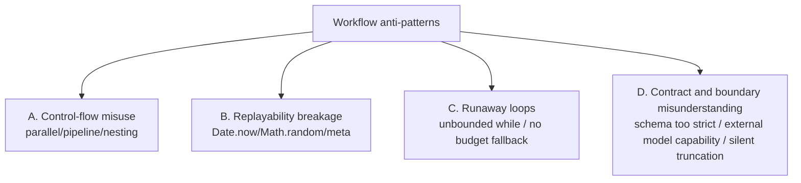
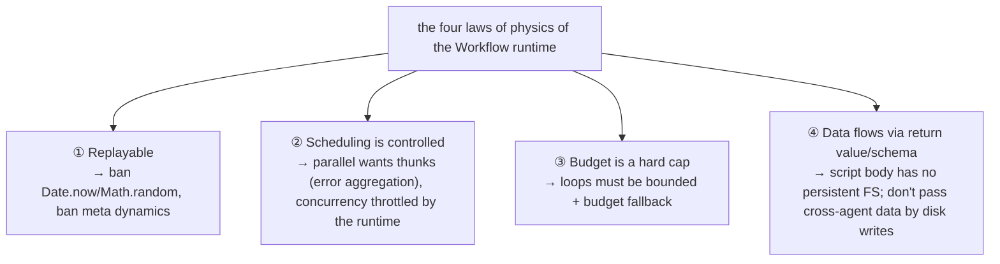

# Chapter 26 · Anti-patterns and Pitfalls

> The first twenty-five chapters covered "how to do it." This last one flips it around — "**how not to do it**" — turning the whole book's hard constraints into a pitfall-avoidance checklist. Every anti-pattern follows the same three-part shape: **wrong way → consequence → right way**, plus a note on which rule it breaks (source: `assets/_grounding.md`).
>
> These pitfalls aren't hypothetical. They're the writings the Workflow runtime **really punishes**: some throw on the spot, some quietly burn through the budget, some rob your script of replayability and make regression tests fail wholesale. Once you've read this chapter, you've got a "pre-submission self-check sheet" in hand.

---

## 26.1 Why Anti-patterns Deserve Their Own Chapter

Positive rules are easy to remember, but people trip up because of **some intuition that looks perfectly reasonable** — like "parallel is always faster than serial," "the stricter the schema the safer," "letting the model decide when to stop in a loop is the smartest." Those intuitions hold elsewhere, but in Workflow they walk you straight into a pitfall. What makes this chapter worth its keep is that it names these **counter-intuitive traps** one by one.

The whole book's hard constraints (`_grounding.md` section B "hard constraints" and the various "prohibited" notes) sort into four categories, and that's how this chapter is laid out:



Let's take them one category at a time. Each comes with a "self-check question" so you can run through them before submitting.

---

## 26.2 Category A · Control-flow Misuse

### Anti-pattern A1: passing `parallel` a Promise instead of a thunk

This is the most common and most insidious error, because it **doesn't error** — it just quietly wrecks your concurrency.

**Wrong way:**

```javascript
// ✗ What's passed in is "an already-executing Promise," not "a function to be executed"
const results = await parallel([
  agent('task A ...', { schema: S }),   // note: no () =>
  agent('task B ...', { schema: S }),
  agent('task C ...', { schema: S }),
])
```

**Consequence:** `parallel`'s signature is `parallel(thunks: Array<() => Promise<any>>)` (section B) — it wants a set of **functions** (thunks). But in the writing above, `agent(...)` **is already called the moment the array literal is evaluated** — the three `agent()`s have already started running before `parallel` even gets the array. This **violates the thunk API contract**, and the most direct cost is **losing `parallel()`'s async-failure aggregation semantics**: an async reject / agent error is supposed to turn into `null` at that position, but once you pass in already-executing Promises, that aggregation can't catch it, and one agent rejection may reject the whole `await` outright. **It "runs," so you won't catch it right away — not until some agent errors and gives it away.** (Note: the issue here is the API contract and error aggregation, not "bypassing the concurrency cap" — throttling is applied uniformly by the runtime.)

**Right way:**

```javascript
// ✓ Pass thunks — defer the "calling" to parallel
const results = await parallel([
  () => agent('task A ...', { schema: S }),
  () => agent('task B ...', { schema: S }),
  () => agent('task C ...', { schema: S }),
])

// Same for batch scenarios: map out a thunk array
const results2 = await parallel(
  items.map((item) => () => agent(`process ${item} ...`, { schema: S }))
)
```

> **Self-check question**: does every item I hand to `parallel` start with `() =>`? Across every real run in this book (judge-panel `wf_f5b69668-b18`, frontend-review `wf_4c5caabb-b73`), the `parallel` calls are, without exception, thunk arrays.

<div class="callout warn">

`pipeline` doesn't suffer this — its signature is `pipeline(items, stage1, stage2, ...)`, where `items` is **data** and stages are **callback functions**, so you wouldn't write `agent()` calls there anyway. But `parallel` looks like "pass in a set of tasks," so it's all too easy to write it as direct `agent()` calls. **Remember: `parallel` wants thunks, not Promises.**

</div>

### Anti-pattern A2: abusing the `parallel` barrier where `pipeline` belongs

**Wrong way:** you've got N items to process, each going through two stages "review → synthesize," but you string them together with two `parallel`s:

```javascript
// ✗ Forcing multi-stage with parallel barriers
phase('Review')
const reviews = await parallel(items.map((it) => () => agent(`review ${it}`, { schema: R })))
// ↑ barrier: must wait for "all" items to finish reviewing before the next line

phase('Synthesize')
const synths = await parallel(reviews.map((r) => () => agent(`synthesize ${JSON.stringify(r)}`, { schema: S })))
```

**Consequence:** `parallel` is a **barrier** — "wait for all to complete" (section B). So the first line has to wait for **the slowest review** to finish before any item can move into the synthesis stage together. If one item's review is especially slow, every other item's synthesis stage sits there idling, waiting on it. The wall clock = `max(review) + max(synthesize)`, not "each chain finishing as fast as it can on its own."

**Right way:** use `pipeline` — "each item flows independently through all stages, no barrier between stages" (section B):

```javascript
// ✓ pipeline: each item passes through the two stages independently, no barrier
const out = await pipeline(
  items,
  (it) => agent(`review ${it}`, { label: 'review', phase: 'Review', schema: R }),
  (review, it) => agent(`synthesize ${JSON.stringify(review)}`, { label: 'synth', phase: 'Synthesize', schema: S })
)
```

`pipeline`'s wall clock is "≈ the slowest single chain, not the sum of each stage's slowest" (section B). An item that finishes reviewing can step **immediately** into its own synthesis stage, without waiting on the others. This book's real pipeline run (pipeline-demo, Run ID `wf_bf086b98-6ec`, 3 items × 2 stages, `agent_count=6`, `total_tokens=158982`, 26.7s) is exactly what proves this out — 6 agents, yet a wall clock far below "3 review barriers then 3 synthesis barriers."

> **Self-check question**: between these stages, do I really need "all items to finish stage 1 before stage 2 can start"? If each item can move along on its own, use `pipeline`. **Multi-stage defaults to `pipeline`** (section B's exact words); only use `parallel` when you "genuinely need all results together."

### Anti-pattern A3: using `parallel` but forgetting `.filter(Boolean)`

**Wrong way:**

```javascript
// ✗ Using the parallel result directly, without filtering null
const drafts = await parallel(tasks.map((t) => () => agent(`...${t}`, { schema: S })))
const merged = drafts.map((d) => d.content).join('\n')   // if one is null → throws TypeError
```

**Consequence:** with `parallel`, an async reject / agent error turns into `null` (section B); `agent()` has yet another path that produces `null` — "the user skips that agent midway → returns `null`" (section B). So `drafts` may have `null` mixed in, and `d.content` throws `TypeError: Cannot read properties of null` right there.

**Right way:**

```javascript
// ✓ Filter null before use (section B explicitly recommends: use .filter(Boolean))
const drafts = (await parallel(tasks.map((t) => () => agent(`...${t}`, { schema: S })))).filter(Boolean)
const merged = drafts.map((d) => d.content).join('\n')
log(`${drafts.length}/${tasks.length} drafts succeeded (the rest threw or were skipped)`)
```

> **Self-check question**: before I use the result of `parallel`/`pipeline`, did I filter `null`? The judge-panel real script has this very line `const valid = judges.filter(Boolean)` — it's a standard action, not optional.

<div class="callout info">

`pipeline` is no different: "a stage throws → that item becomes `null` and skips the remaining stages" (section B). So `pipeline`'s return array also needs `.filter(Boolean)` before use. Make "first `.filter(Boolean)` the result of `parallel`/`pipeline`" muscle memory.

</div>

### Anti-pattern A4: nesting more than one layer

**Wrong way:** workflow A calls workflow B, and inside B it turns around and calls workflow C:

```javascript
// Inside workflow B's script body:
const c = await workflow({ scriptPath: '.../C.js' })   // ✗ B is already a sub-process nested-called by A
```

**Consequence:** "nesting is **only one layer**: calling `workflow()` again inside a sub-workflow throws" (section B). If B itself was kicked off by A via `workflow()`, then calling `workflow()` again inside B **throws on the spot**, and the whole A→B chain goes down with it.

**Right way:** **flatten** the second layer's logic into B, or have A orchestrate B and C (at the same level) instead of having B call C:

```javascript
// ✓ Option one: A orchestrates B and C at the same level (no nesting)
// In A:
const b = await workflow({ scriptPath: '.../B.js' })
const c = await workflow({ scriptPath: '.../C.js', args: { fromB: b } })

// ✓ Option two: write C's logic directly into B (use agent/pipeline, not workflow())
// In B:
const cResult = await agent('what C was originally supposed to do ...', { schema: CS })
```

> **Self-check question**: will this workflow of mine get called by another workflow via `workflow()`? If so, it **cannot** call `workflow()` again internally. Test workflows (Chapter 25) especially need to watch this — they already nested-call the workflow under test, so they themselves cannot be nested by a third layer.

---

## 26.3 Category B · Replayability Breakage

Everything in this category ends the same way: **it breaks "the same script + the same args → 100% cache hit,"** and that drags resume (Chapter 22) and regression testing (Chapter 25) down with it, wholesale.

### Anti-pattern B1: using `Date.now()` / `Math.random()` / arg-less `new Date()` in the script

**Wrong way:**

```javascript
// ✗ Three explicitly banned non-replayable calls
const runId = `run-${Date.now()}`                    // banned
const sample = items[Math.floor(Math.random() * items.length)]  // banned
const stamp = new Date().toISOString()               // banned (arg-less new Date())
```

**Consequence:** "the script bans `Date.now()` / `Math.random()` / arg-less `new Date()`" (section B hard constraint), they "break replayability → resume fails" (section B note). At best they throw; at worst — even if they don't throw — each run comes out different, so resume never hits the cache (that "unchanged agent 0 token/8ms" dividend from Chapter 22 is gone entirely), and regression testing degenerates into "a full re-run every time."

**Right way:** inject every "external nondeterministic quantity" you need from `args`; when you need randomness, reach for a **deterministic index** instead:

```javascript
// ✓ Pass the timestamp in via args (section B: "need a timestamp? pass it via args or stamp it afterward")
const runId = `run-${args.runId}`
const stamp = args.runDate            // the caller is responsible for passing it

// ✓ When you need "randomness/diversity," vary the prompt by the agent's index (section B's exact words)
//   rather than Math.random
const variants = await parallel(
  [0, 1, 2].map((i) => () =>
    agent(`Answer from the ${i + 1}-th distinct angle (angles must not repeat): ${args.question}`,
      { label: `variant:${i}`, schema: S }))
)
```

> **Self-check question**: does my script have `Date.now`, `Math.random`, `new Date()` (arg-less)? If so, switch it to `args` injection or index variation. **This is the precondition for regression testing to hold** — Chapter 25 hammered on it.

<div class="callout warn">

Standard JS built-ins (the pure functions of `JSON`/`Math`/`Array`…) **are available** (section B: "standard JS built-ins available") — the only banned ones are those that **introduce nondeterminism**: `Math.random()`, `Date.now()`, arg-less `new Date()`. `Math.floor`, `Math.max`, `new Date(args.iso)` (with an argument) are all fine. Don't steer clear of the whole `Math` object out of overcaution.

</div>

### Anti-pattern B2: `meta` is not a pure literal

**Wrong way:**

```javascript
// ✗ meta has variables / function calls / template interpolation / spread
const NAME = 'my-wf'
export const meta = {
  name: NAME,                                  // ✗ variable
  description: `Review ${args.target}`,        // ✗ template interpolation + referencing args
  phases: buildPhases(),                       // ✗ function call
  ...baseMeta,                                 // ✗ spread
}
```

**Consequence:** "`meta` must be a pure literal (statically read before runtime execution)" (section B hard constraint); "`meta` must be a pure literal — no variables, function calls, spread operators, or template interpolation" (Chapter 01). The runtime has to statically read `meta` **before it ever runs the script** (to show the permission dialog), and at that point `args`, variables, and functions don't exist yet. Written as above, the runtime **simply cannot evaluate it in the static-parsing phase** — the script is rejected (`WorkflowOutput` carries an `error`, the syntax check fails). `description: \`...${args.target}\`` is an especially common slip-up: `args` simply isn't there when `meta` is evaluated.

**Right way:**

```javascript
// ✓ Write meta entirely as literals; put dynamic info in log()
export const meta = {
  name: 'my-wf',
  description: 'Review a target from multiple dimensions',   // static
  phases: [{ title: 'Review' }, { title: 'Synthesize' }],   // literal array
}

// Need the user to know "what's being reviewed this time"? Use log (runtime output, not in meta)
log(`This review's target: ${args.target}`)
```

> **Self-check question**: does my `meta` have any `${...}`, variable names, `(...)` calls, or `...` spreads? Even one of those and it's not a pure literal. **For the description to vary with arguments → put it in `log()`, not `meta`.** (Chapter 25 §25.3 also stressed this.)

---

## 26.4 Category C · Runaway Loops

### Anti-pattern C1: an unbounded `while` that exits only by the model's `done` judgment

**Wrong way:**

```javascript
// ✗ The exit is left entirely to the model — it might forever say "not done yet"
let done = false
while (!done) {                          // no hard ceiling at all
  const r = await agent('keep advancing; set done=true when finished', { schema: { /* done */ } })
  done = r.done
}
```

**Consequence:** this is the very writing Chapter 18 lists as the number-one anti-pattern ("unbounded `while` (exiting only by the model's done) → infinite loop, burning through the budget," the 18.6 quick reference). The model's "done" is a **probabilistic judgment**; "wanting to look thorough," it might keep putting off `done=true`, so the loop **never exits**, with every round really burning tokens and wall clock. Section B does have the global fallback of "a per-workflow-lifecycle agent total cap of **1000**," but that's a **safety net, not a business exit mechanism** (Chapter 18's exact words) — hitting 1000 to stop means you've already burned the tokens of over a thousand agents.

**Right way:** stack up your defenses — a hard round ceiling + budget fallback (plus optional diminishing returns):

```javascript
// ✓ Chapter 18's standard brakes: a hard ceiling + budget fallback
const MAX_ROUNDS = 6
let done = false
let round = 0
while (!done && round < MAX_ROUNDS) {                    // first line of defense: a hard round ceiling
  round++
  // second line of defense: budget fallback (budget is a hard cap; calling agent() after spent() reaches total throws)
  if (budget.total !== null && budget.remaining() < 60_000) {
    log(`Insufficient budget to run another round (remaining ${budget.remaining()}), closing early`)
    break
  }
  const r = await agent('keep advancing; set done=true when finished', { schema: { /* done */ } })
  done = r.done
}
return { done, round, hitCeiling: !done && round >= MAX_ROUNDS }   // honestly mark whether the ceiling was hit
```

> **Self-check question**: does every one of my `while`s have an exit condition that doesn't lean on the model (a counter/budget)? "Never write an unbounded loop that exits only by the model's verdict" (Chapter 18's exact words).

### Anti-pattern C2: not checking `budget` in a loop, hitting the hard cap and throwing

**Wrong way:**

```javascript
// ✗ Has a round ceiling, but mindlessly calls agent each round without looking at the budget
while (!done && round < 10) {
  round++
  const built = await agent('produce a version (very token-costly) ...', { schema: S })   // might throw here
  const checked = await agent('acceptance check ...', { schema: A })
  done = checked.accepted
}
```

**Consequence:** `budget` is a **hard cap** — "calling `agent()` after `spent()` reaches `total` throws" (section B). If the user set a budget this turn (a `+500k`-style instruction), and your loop doesn't proactively look at `budget.remaining()`, then some round's `agent()` will **throw directly** the moment the budget runs out, and the whole workflow **fails along with its already-completed partial results** — you never get the chance to "close gracefully."

**Right way:** proactively check the remaining budget at the **start** of each round, and leave at least "the amount this round will spend" of headroom before you decide whether to keep going:

```javascript
// ✓ Proactively brake at the start of each round, leaving headroom for a "graceful close"
while (!done && round < 10) {
  // Estimate this round's cost (build+accept is ~2 agents, at a real ~26K/agent estimate ≈ 60K)
  const ROUND_COST_EST = 60_000
  if (budget.total !== null && budget.remaining() < ROUND_COST_EST) {
    log(`Remaining budget ${budget.remaining()} is below this round's estimate ${ROUND_COST_EST}, closing with current results`)
    break
  }
  round++
  const built = await agent('produce a version ...', { schema: S })
  const checked = await agent('acceptance check ...', { schema: A })
  done = checked.accepted
}
```

<div class="callout info">

You can anchor cost estimates to this book's real data: a single agent runs about **25–30K tokens** (hello `wf_dacbd480-d5d` measured 26,338; the rule of thumb "tokens ≈ agent count × per-agent context," sections B/C). A round of "generate + accept" with two agents is about 50–60K. Chapter 18 gave the same cost intuition: "running 4 rounds is about 200K tokens." Use these anchors to set `ROUND_COST_EST` and the fallback threshold.

</div>

> **Self-check question**: could the user set a budget for this workflow? If they could, does my loop look at `budget.remaining()` at the start of each round? Note that when `budget.total` is `null` it means no target is set (`remaining()` is `Infinity`), so write the check as `budget.total !== null && budget.remaining() < threshold`.

---

## 26.5 Category D · Contract and Boundary Misunderstanding

### Anti-pattern D1: a schema too strict, causing repeated retries or even a stall

**Wrong way:**

```javascript
// ✗ Enumerating fields that shouldn't be enumerated dead, making optional ones required, adding unsatisfiable constraints
const schema = {
  type: 'object',
  properties: {
    severity: { type: 'string', enum: ['P0'] },         // ✗ only P0 allowed? then how to report a P1 issue
    cveId: { type: 'string', pattern: '^CVE-\\d{4}-\\d+$' },  // ✗ not every issue has a CVE
    score: { type: 'integer', minimum: 90 },            // ✗ forced ≥90, a low score simply can't be expressed
  },
  required: ['severity', 'cveId', 'score'],             // ✗ all required
}
```

**Consequence:** with a schema, "a mismatch makes the model retry" (section B). If the schema is so harsh that **the model semantically cannot satisfy it** (asking it to report an issue that actually has no CVE, forcing a high score where it should be low), the model will **retry over and over** — each retry really burns tokens, and in the worst case it exhausts the budget cap and throws (C2). A schema is for **constraining structure**, not for **forcing semantics**.

**Right way:** let the schema pin down only objective contracts like "structure and type," and leave "semantic judgment" for the model to express in the field **values**:

```javascript
// ✓ Strict structure, loose values: enumerate all options, don't make optional ones required, don't add constraints unguaranteeable in the business
const schema = {
  type: 'object',
  properties: {
    severity: { type: 'string', enum: ['P0', 'P1', 'P2', 'P3'] },   // enumerate all
    cveId: { type: 'string' },                                       // don't force a format, empty string if none
    score: { type: 'integer', minimum: 0, maximum: 100 },            // full range
    note: { type: 'string' },
  },
  required: ['severity', 'score', 'note'],                           // only make "definitely present" ones required
}
```

> **Self-check question**: in my schema, does each `enum` cover all the reasonable values? Is each `required` field "definitely present in any reasonable output"? Are there constraints like `pattern`/`minimum` that **the model can't satisfy in some reasonable cases**? Recall Chapter 18: gating fields (`done`/`pass`/`accepted`) must be `required` and `boolean` — that's where to be strict; business values should stay loose.

<div class="callout warn">

**Don't treat a schema as a way to "make the model think harder."** Some people deliberately make the schema very complex, figuring it'll force the model into a better result. In reality it just forces it to retry over and over, burning tokens. To steer quality, lean on **the prompt** (spell out what you want, give a rubric — see how judge-panel uses a schema to pin accuracy/clarity/completeness into **numeric fields**, but with loose value ranges); the schema is responsible for **machine-readability**, not for **forcing thought.**

</div>

### Anti-pattern D2: treating script-body/subprocess disk writes as persistent side effects

This one gets misread all the time as "subagents can't write files" — **that's wrong**. First, let's pull apart three things that keep getting conflated:

| # | Statement | True/False | Basis |
|---|---|---|---|
| ① | Inside a Workflow **script body**, and the writes of `ctx_execute` / Bash subprocesses, **don't persist** to the host filesystem | **True** | section B hard constraint, verbatim |
| ② | A **subagent** dispatched by Workflow can use the native `Write`/`Edit` tools to produce **real** file side effects | **True** (so "subagents can't write files" is wrong) | Chapter 19 worktree: "multiple agents each Write/Edit to refactor in parallel" relies on exactly this |
| ③ | **External models** (codex/antigravity via CCG) are usually constrained to **zero writes**, producing only opinions | True, but this is a **different** guardrail concept | Chapter 23 CCG multi-model collaboration |

This anti-pattern is about **①**: **don't assume "running some code in the script body to write a file" will land**, and even less should you build cross-agent data flow on this kind of "script-body side effect."

**Wrong way:**

```javascript
// ✗ Mistakenly assuming a script-body/subprocess write persists, then having another step read it
//   (the script body has no usable filesystem; ctx_execute/Bash subprocess writes don't land — ①)
await someBashStepThatWrites('./state.json')           // doesn't land
const next = await agent('Read ./state.json and continue ...', { schema: S })  // it can't read it
```

**Consequence:** the script body's "write a file → another step reads the file" chain snaps at the "write" link (①) — the data never actually lands, the downstream gets empty or stale values, and it fails **silently** (no error, it just can't read). Note: this does **not** say subagents can't do the file-writing job (② they can; the worktree scenario has them Write/Edit in parallel); the problem is **treating the script body as having a persistent FS**, and **replacing explicit data passing with a "disk write side effect."**

**Right way:** cross-agent data flow goes through **the return value / structured output**, not by assuming the script body has a writable FS to lean on:

```javascript
// ✓ Data is passed explicitly between stages via return values (the "explicit passing" principle of Chapter 24's ccg case)
const state = await agent('Analyze and return structured state', {
  schema: { type: 'object', properties: { facts: { type: 'array', items: { type: 'string' } } }, required: ['facts'] },
})
const next = await agent(`Continue based on the following state: ${JSON.stringify(state)}`, { schema: S })
return next
```

If you **do need to land an output to disk**: either (A) have the workflow **return** the content to the main loop, and let the main loop (outside Workflow) land it with the native `Write` tool; or (B) when the task genuinely is "have multiple agents change files in parallel," give those **subagents** `isolation: 'worktree'` (Chapter 19) — that's the proper way for subagents to really write files, physically isolated.

> **Self-check question**: am I leaning on "write a file then have another step read it" **in the script body** to pass data? Cross-agent data should flow through **the return value + structured output**; if you really need to land it, leave it to the main loop's native `Write`, or to a subagent's own `Edit`/`Write` in the worktree scenario.

### Anti-pattern D3: silent truncation/discarding, without `log`

**Wrong way:**

```javascript
// ✗ Quietly dropping half the results, leaving no trace
const all = (await parallel(items.map((it) => () => agent(`...${it}`, { schema: S })))).filter(Boolean)
const top = all.slice(0, 5)              // only want the top 5, the rest silently dropped
return top
```

**Consequence:** the caller gets `top` and **has no idea**: ① how many were there to begin with? ② how many became `null` from throwing/being skipped and got `filter`ed out? ③ were any of the ones dropped by `slice` more important? When the result comes out wrong, there's **no way to investigate** — because the key information got silently swallowed inside the script. Workflow runs in the background and returns asynchronously; all you can see is the final return value and the `log` output; truncation without `log` = a black box.

**Right way:** any "discard/truncate/filter" leaves a trace via `log`, and put the count information into the return value:

```javascript
// ✓ Truncation must leave a trace: log output + the return value carries counts
const raw = await parallel(items.map((it) => () => agent(`...${it}`, { schema: S })))
const valid = raw.filter(Boolean)
const dropped = raw.length - valid.length
if (dropped > 0) log(`${dropped}/${raw.length} results threw or were skipped, filtered out`)

const top = valid.slice(0, 5)
log(`Returning top ${top.length}, plus ${valid.length - top.length} valid results not included`)
return { top, totalValid: valid.length, totalDropped: dropped }   // counts handed back along with the result
```

> **Self-check question**: for every `filter` / `slice` / `find` / early `return` in the script, did I `log` "how many got dropped, and why"? `log` is "outputting progress to the user (a narrative line above the progress tree)" (section B) — it's a background workflow's only observability window, so don't waste it.

<div class="callout info">

This one shares a spirit with D2: **the data flow should be explicit and observable.** Chapter 24's "explicit passing, structured passing," stolen from ccg, flips over in the anti-pattern view into "silent swallowing." A healthy Workflow's return value should let the caller answer "how many were processed, how many succeeded, how many got dropped, and why."

</div>

---

## 26.6 The Pre-submission Self-check Sheet

Let's pull all the preceding "self-check questions" together into one sheet. **Every time, before you hand a script to the Workflow tool, run through it:**

| # | Category | Self-check question | If violated |
|---|---|---|---|
| A1 | Control flow | Does every item of `parallel` begin with `() =>`? | Violates thunk API, loses async-failure aggregation (async reject→null) |
| A2 | Control flow | Are multi-stages misusing the `parallel` barrier? Use `pipeline` if they can flow independently | Wall clock becomes the sum of each stage's slowest |
| A3 | Control flow | Did you `.filter(Boolean)` before using the `parallel`/`pipeline` result? | `null` triggers a TypeError |
| A4 | Control flow | Will this workflow be nested-called? If so, it cannot call `workflow()` internally | Throws (nesting only one layer) |
| B1 | Replayability | Are there `Date.now`/`Math.random`/arg-less `new Date()`? | Resume/regression fails |
| B2 | Replayability | Does `meta` have `${}`/variables/calls/spreads? | Syntax check fails, rejected |
| C1 | Loop | Does every `while` have an exit condition not dependent on the model? | Infinite loop burns the budget |
| C2 | Loop | Does the loop look at `budget.remaining()` at the start of each round? | Hits the hard cap and throws |
| D1 | Contract | Are the schema's `enum`/`required`/`pattern` definitely satisfiable by the model? | Repeated retries burn tokens |
| D2 | Boundary | Are you passing data via "write a file in the script body then read it"? | Script-body write doesn't land, data lost (subagents can still write — Ch.19) |
| D3 | Observability | Did every truncation/filter leave a trace via `log`? | Black box, can't investigate |

<div class="callout tip">

This sheet is also the reverse check of Chapter 25's "shareable-workflow finished-product checklist." A workflow ready to go into the library and be shared should **pass all 11 of these.** It's worth pasting at the top of your library's `README.md` as the team's "Workflow submission spec."

</div>

---

## 26.7 The Root of Anti-patterns: Treating Workflow as an "Ordinary Script"

Looking back at these 11 items, most come down to the same misunderstanding: **writing a Workflow script as a piece of ordinary Node.js.** But it isn't — it runs in a special runtime, and that runtime has four distinctive "laws of physics":



| Law | In an ordinary script | In Workflow | Corresponding anti-pattern |
|---|---|---|---|
| ① Replayable | Use time/randomness freely | Banned; inject via `args` | B1, B2 |
| ② Scheduling controlled | Do your own `Promise.all` | `parallel` takes over scheduling, wants thunks | A1, A2, A3 |
| ③ Budget hard cap | Run until OOM to stop | `budget` throws at the cap, brake proactively | C1, C2 |
| ④ Data flows via return value/schema | Read/write files freely to pass data | Script body has no persistent FS; cross-agent goes through return value + schema (subagents can still Write/Edit files, see Ch.19) | D1, D2, D3 |
| ⑤ Nesting limited | Nest functions freely | `workflow()` only one layer | A4 |

Once you've got these four (plus the nesting limit, five) "laws of physics," anti-patterns are no longer a list to memorize, but **natural corollaries of the laws.** When you subconsciously ask "does this break any law?" as you write each line, you'll intercept the vast majority of pitfalls before submitting.

This also echoes the whole book's through-line: native Workflow hands you a deterministic skeleton built from **code + Schema** (Chapter 23), but "determinism" comes with **preconditions** — the script must be replayable, loops must be bounded, scheduling must be handed to the runtime, the output must go through the contract. Hold these preconditions, and you truly own the "reusable, testable, shareable" orchestration engine that Chapter 01 promised.

---

## 26.8 Chapter Summary

- Anti-patterns are grouped into four categories by the runtime's "laws of physics": **A control-flow misuse, B replayability breakage, C runaway loops, D contract and boundary misunderstanding** (plus nesting only one layer).
- **Category A**: `parallel` wants thunks (`() =>`) not Promises (A1); multi-stage defaults to `pipeline` rather than a `parallel` barrier (A2); `.filter(Boolean)` the result first (A3); `workflow()` nesting only one layer (A4).
- **Category B**: ban `Date.now`/`Math.random`/arg-less `new Date()`, inject time via `args`, use the index for diversity (B1); `meta` must be a pure literal, dynamic info goes in `log()` (B2). Otherwise resume and regression testing both fail wholesale.
- **Category C**: a `while` must have an exit condition that doesn't depend on the model (a round ceiling), otherwise an infinite loop burns the budget — the global 1000 cap is a safety net, not a business exit (C1); the loop proactively looks at `budget.remaining()` at the start of each round, otherwise it hits the hard cap and throws (C2).
- **Category D**: a schema constrains structure rather than forcing semantics, `enum`/`required` must be definitely satisfiable by the model, otherwise repeated retries (D1); cross-agent data flows via the return value + structured output — don't treat script-body/subprocess disk writes as persistent side effects for passing data — but subagents themselves can Write/Edit files (worktree scenario, Chapter 19), and to land output leave it to the main loop's native Write (D2); any truncation/filter leaves a trace via `log` and drops the counts into the return value (D3).
- **Run through the 11-item self-check sheet before submitting**; it's also the reverse check of the "shareable-workflow finished-product checklist," worth pasting into the library `README.md` as the submission spec.
- Most anti-patterns stem from "writing Workflow as an ordinary script" — remember the runtime's five laws of physics (replayable, scheduling controlled, budget hard cap, data flows via return value/schema, nesting limited), and anti-patterns become natural corollaries of the laws.

With that, Part V "Ecosystem and Borrowing" is complete: Chapter 23 saw clearly the real mechanisms of the four major systems, Chapter 24 extracted their essence into your own Workflow, Chapter 25 settled these Workflows into a shareable library, and Chapter 26 held the bottom line that makes all of this hold.

> Continue reading: [Chapter 27 · The Authoring Workflow](#/en/p6-27)
>
> Further reading: [Appendix A · Full API Reference](#/en/app-a) · [Appendix B · Pitfalls and Troubleshooting](#/en/app-b) · [Appendix C · Best-practices Checklist](#/en/app-c)

---

[← Back to main README](../../README.md) · [中文 README →](../../README.md)
