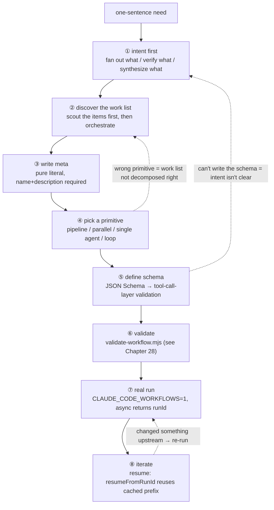
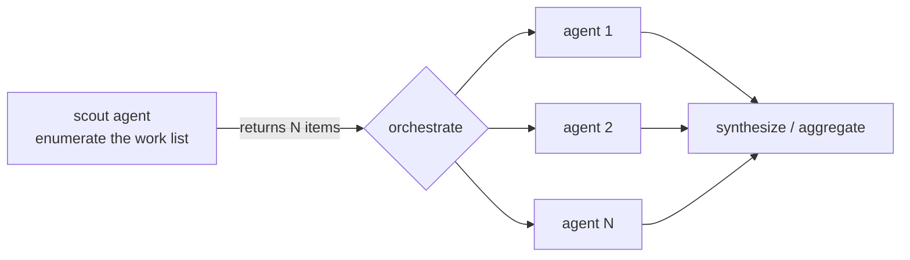
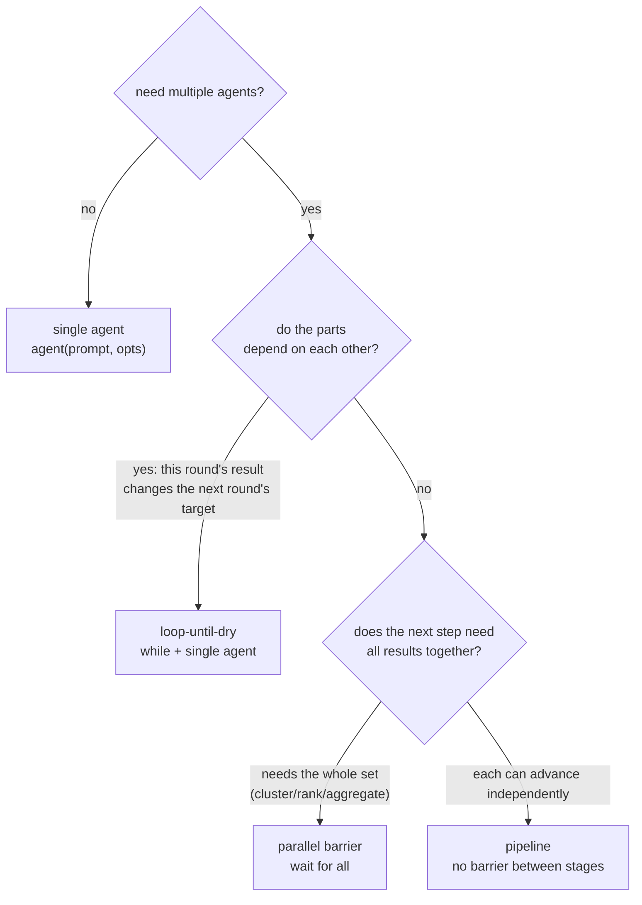
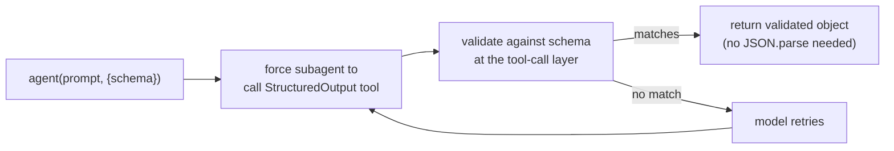
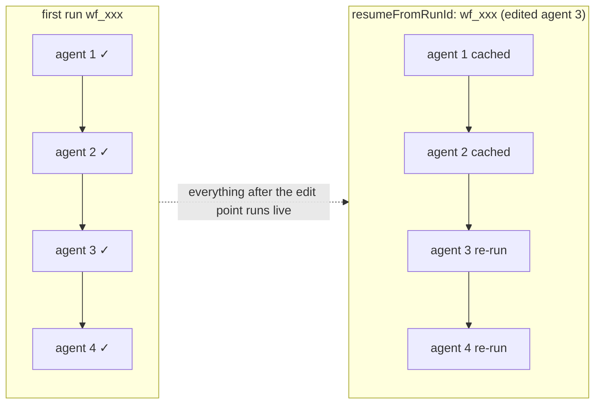
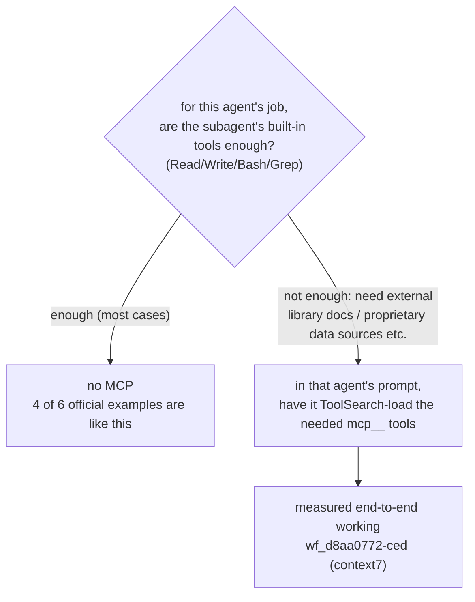

# Chapter 27 · The Authoring Workflow

> In one sentence: **writing a Workflow does not start by opening an editor and typing `pipeline(`. It starts with a one-sentence need — "what exactly am I fanning out, verifying, synthesizing?" Think that intent through, and the primitive (pipeline / parallel / single agent / loop) almost falls out on its own; skip it, and even the prettiest script just parallelizes the chaos.**
>
> This chapter gives you a re-runnable authoring pipeline: intent → work list → meta → pick a primitive → schema → validate → real run → iterate. Every step uses the book's three **actually-run** example scripts (review-spa, dead-code-scan, feedback-themes) as decision cases, citing their real Run IDs and usage. By the end you'll have a muscle memory for going "from a need to a re-runnable workflow," plus a scaffold you can edit directly.

---

Earlier chapters took Workflow apart one piece at a time: Chapter 5 on `meta`/`phase`, Chapter 6 on `agent()`, Chapter 7 on schema, Chapter 8 on `parallel` barrier vs `pipeline`, Chapter 17 on adversarial verification, Chapter 18 on loop-until-dry. But "knowing every part" and "knowing how to bolt the parts together into a machine" are two different things. This chapter adds no new parts; it's about the **assembly order** — the process a seasoned author actually runs in their head when hit with a one-sentence need like "review this PR for me" or "cluster this pile of feedback."

We draw it as a straight-line pipeline, but keep in mind: **real authoring loops back on itself**. Any step below can bounce you back to an earlier one (if you can't write the schema, that usually means the intent isn't clear yet).



<div class="callout info">

This chapter is the "authoring-side" overview; what comes after it is Chapter 28 (Validation & Debugging) and Chapter 29 (Example Gallery — the **end-to-end run results** of the same three scripts). This chapter is about "how to write it"; Chapter 29 is about "what it looks like once it runs." Both cite the same set of Run IDs, so you can read them side by side.

</div>

---

## 27.1 Intent First: What Exactly Are You Fanning Out, Verifying, Synthesizing

The most common beginner mistake is to open with "should I use pipeline or parallel." That reasons from the tool back to the problem — the order is backwards. **First answer a plainer question: what is this task's parallelism actually for?**

The entire value of Workflow boils down to three verbs:

| Verb | What you're doing | What it buys | Typical primitive |
|---|---|---|---|
| **fan-out** | Split one big task into N parts, N subagents work at once | **scale / speed** — wall-clock compressed to "the slowest part" | `parallel` / `pipeline` |
| **verify** | Have another agent check/refute the first agent's output | **trust** — a single agent hallucinates, exaggerates | a verify stage after fan-out |
| **synthesize** | Combine N independent results into one conclusion | **comprehensiveness** — only across the whole set can you see themes/ranking | a synthesis agent after a barrier |

Before you write a script, state the intent in one sentence — **for comprehensiveness, for trust, or for scale?** That one sentence settles every downstream tradeoff. Look at the "intent sentence" behind each of the book's three actually-run examples:

<div class="callout tip">

- **review-spa**: "Review a piece of code across **multiple dimensions**, and **don't blindly trust** every finding a reviewer raises." → fan-out (by dimension) + verify (adversarial). For **scale** and for **trust**.
- **feedback-themes**: "**Synthesize** a batch of feedback into ranked themes." → fan-out (per-item summary) + synthesize (cluster the whole set). For **comprehensiveness**.
- **dead-code-scan**: "Scan **repeatedly** until confirmed nothing is missed." → progressive scanning, where one round may reveal the next round's targets. For **comprehensiveness** (exhaustiveness), but with a serial loop rather than fan-out.

</div>

Notice dead-code-scan's intent has no "do N parts at once" — it is a **serial** loop. This is exactly how "intent first" helps you dodge a common misuse: **not every task should fan out**. The moment "this round's result changes what the next round should look for," fan-out is actually wrong, because the parts depend on each other. Think the intent through, and you naturally won't cram a progressive task into `parallel`.

<div class="callout warn">

**Watch out for "parallelism for its own sake."** Workflow concurrency isn't free: each `agent()` eats roughly 25k–30k tokens of context (rule of thumb, see Chapter 29 measurements). `feedback-themes` burned **607,307 tokens** in a single real run (Run `wf_b3febb70-ad9`), just because it fanned out 20 agents. If a single agent can do your task well, fanning out only makes you pay 20× to parallelize something that needed no parallelism. First ask "why do I need multiple agents"; if you can't answer, use a single agent.

</div>

---

## 27.2 Discover the Work List: Scout the Items First, Then Orchestrate the Pipeline

Once the intent is clear, the next question shows up: **what exactly are the "N parts" I'm fanning out?** Plenty of tasks don't know N up front — the file list to review, the sub-questions to research, the number of feedback items to summarize often have to be "scouted" first.

This leads to a key two-stage structure: **scout (discover) first, orchestrate (process) second**. Don't hardcode a guessed list when you write the script; let the first agent **enumerate** the list, then hand that list to the downstream `pipeline`/`parallel`.

`feedback-themes` is a textbook "scout first": its first `agent()` does no summarizing at all — its one job is to **read the CSV into an item array** —

```javascript
  phase('Load')
  const { items } = await agent(
    `Read ${SOURCE} (a CSV with columns id,text). Return every row as an item with its id and text.`,
    { label: 'load', phase: 'Load', schema: ITEMS },
  )
  log(`${items.length} feedback item(s) loaded`)

  // only now do we know N = items.length; fan out accordingly
  const summaries = await parallel(items.map(it => () =>
    agent(/* one summary agent per item */),
  ))
```

In the real run this scout read out 18 rows, so `parallel` fanned out 18 summary agents (plus 1 load, 1 cluster — `agent_count` measured at exactly **20**, Run `wf_b3febb70-ad9`). Nowhere does the script hardcode "18" — the list is discovered from the data at runtime. That's the power of scout-then-orchestrate: **the same script, fed 18 rows gives 20 agents; fed 50 rows automatically gives 52 agents** — without touching a single line.



<div class="callout tip">

**The scout's output must carry a schema.** Because its return value gets `.map()`'d into the next batch of `agent()` calls, you need it to be a **structured array**, not prose. `feedback-themes`'s scout uses `schema: ITEMS` (`{items: [{id, text}]}`), and that's exactly what lets `items.map(...)` expand safely. Without a schema you get back text you have to re-parse — which hands determinism right back to the model.

</div>

Not every workflow needs an explicit scout. `review-spa`'s "list" is the fixed three dimensions (bugs/security/a11y), written as a literal `DIMENSIONS` array — the list itself doesn't lean on runtime data. The test is simple: **is the list something you already know when you write the script (write it as a literal), or something you read from the input (use a scout agent)?**

---

## 27.3 Write meta: The Pure-Literal "ID Card"

With the list and the orchestration clear in your head, write `meta` first. This isn't just ceremony — `meta` is the workflow's ID card, and the **only part read statically before the run**.

`meta` has two iron rules (both measured):

1. **It must be a pure literal**, and the **first statement** of the script. No variable references, function calls, spread operators, or template interpolation. The runtime reads it statically **before** it runs the script body, so it has to be "readable" without being "run."
2. **`name` and `description` are required**. `description` is **one line** shown in the permission confirmation dialog (official); `whenToUse` is shown in the workflow list (official).

```javascript
  export const meta = {
    name: 'review-spa',
    description: "Review the book's SPA (index.html) across dimensions, then adversarially verify each finding",
    whenToUse: 'A real-run demo of fan-out review + adversarial verification',
    phases: [
      { title: 'Review', detail: 'one reviewer per dimension' },
      { title: 'Verify', detail: 'try to refute each finding', model: 'haiku' },
    ],
  }
```

This is `review-spa`'s real `meta`. Note the `phases` array — it declares how many phases this workflow has, and **should line up with the `phase()` / `opts.phase` actually called in the script**. `review-spa` declares two phases, `Review` and `Verify`, and the script's two `agent()` calls are labeled `phase: 'Review'` and `phase: 'Verify'` respectively — one-to-one, so the progress tree doesn't get scrambled.

<div class="callout warn">

**A non-literal `meta` is rejected at submit time, and the script never runs.** In testing, `export const meta = {…, constructor: 'x'}` (a reserved key) was rejected at submit, verbatim: `Script must begin with export const meta = { name, description, phases } (pure literal). meta must be a pure literal: reserved key name not allowed in meta: constructor`. Likewise, any `name: 'x-' + suffix` or `description: \`...${v}\`` is rejected. Push the dynamic concatenation down into the script body (into `agent()` prompts); keep `meta` hardcoded.

</div>

On `phases[].model`: the official tool description frames it as "add it when overriding a phase with a specific model," which is ambiguously worded; and because `CLAUDE_CODE_SUBAGENT_MODEL` overrode everything in this book's session, we **could not independently isolate** whether it is read at runtime. **The safe practice**: treat `phases[].model` as a "label" on the dialog, and to actually run a phase on Haiku, write `model:'haiku'` on each `agent()` in that phase — don't count on `phases[].model` to take effect on its own.

---

## 27.4 Pick a Primitive: A Real Four-Way Decision

By now you have intent, list, and meta. Only now do you pick a primitive — and because the first three steps were done solidly, this one is basically "matching by the numbers." Workflow gives you four orchestration shapes, and they differ on a single core question: **when can the next step begin?**



| Primitive | Barrier semantics | When the next step begins | Wall-clock profile | Signal to pick it |
|---|---|---|---|---|
| **single agent** | — | sequential | single-task latency | one subagent can do it well |
| **`pipeline`** | **no barrier** | each chain goes on its own, first-done-first-onward | ≈ the slowest **single chain** | multiple independent chains, want "first done first onward" (**default for multi-stage**) |
| **`parallel`** | **barrier** | **wait for all** to finish before returning | ≈ the slowest **single agent** | the next step needs the whole set |
| **loop** | serial | stop only when the termination condition is met | sum of N serial rounds | one round reveals the next round's target |

Below, the three actually-run examples turn this table from abstract into concrete decisions.

### Why review-spa Chose pipeline

The intent is "3 dimensions each reviewed on their own, and the moment a dimension is reviewed, **immediately** verify its findings without waiting on the other dimensions." That's exactly `pipeline`'s defining scenario: **each item (dimension) flows independently through two stages (review → verify), with no barrier between stages**.

```javascript
  const reviewed = await pipeline(
    DIMENSIONS,
    // Stage 1 — review one dimension.
    d => agent(d.prompt, { label: `review:${d.key}`, phase: 'Review', schema: FINDINGS }),
    // Stage 2 — verify every finding from that dimension, in parallel.
    (review, d) => parallel(
      (review?.findings ?? []).map(f => () =>
        agent(/* adversarial verify, model:'haiku', schema: VERDICT */)
          .then(v => ({ ...f, dimension: d.key, verdict: v })),
      ),
    ),
  )
```

Why **not** `parallel`? With `parallel`, all three dimensions' reviews would jam up at one barrier — verification of all three groups could only start after the slowest dimension finished. But verifying the bugs findings doesn't need a11y to finish at all. `pipeline` lets bugs move into its verify stage the instant it's reviewed, so wall-clock becomes "the slowest **single** review→verify chain," not "slowest review + slowest verify."

The real run lays out this orchestration's cost and yield: Run `wf_97b81e86-a0b`, **22 agents** (3 reviews + 19 verifies), **991,554 tokens**, **395,166ms** (≈6.6 min), with a final **18 findings that survived adversarial verification** (bugs 6 / security 4 / a11y 8). Note the verify stage is labeled `model:'haiku'`, but this session's `CLAUDE_CODE_SUBAGENT_MODEL` overrode it, so the 19 verify agents actually ran Opus — which is the main reason tokens reached nearly a million.

<div class="callout info">

**`agent()` calls inside a pipeline must set `opts.phase` explicitly.** Because a pipeline's chains run concurrently, leaning on the global `phase()` to switch phases means the chains **race** over the same global phase pointer, scrambling the progress tree. `review-spa` writes `phase: 'Review'` or `phase: 'Verify'` on every `agent()`, pinning the grouping down explicitly so the chains don't step on each other.

</div>

### Why feedback-themes Chose a parallel Barrier

The intent is "summarize item by item, then cluster the **whole set** into ranked themes." Clustering has a hard dependency: **you cannot cluster by looking at one summary alone** — you must wait for **all** summaries to arrive before you can see what groups with what, and which group is biggest. That's the very definition of a "barrier": wait for all, then move on together to the next step.

```javascript
  // Barrier on purpose: the next step clusters across the WHOLE set, so it needs
  // all summaries together before it can run.
  const summaries = await parallel(items.map(it => () =>
    agent(/* single summary */, { label: `summarize:${it.id}`, phase: 'Summarize', model: 'haiku' })
      .then(summary => ({ id: it.id, summary })),
  ))

  const labelled = summaries.filter(Boolean)

  phase('Cluster')
  const { themes } = await agent(
    `Here are ${labelled.length} summarized feedback items. Cluster them into themes...`,
    { label: 'cluster', phase: 'Cluster', schema: THEMES },
  )
```

Why **not** `pipeline`? Because a pipeline is "each item flows independently to the end" — but clustering isn't "each item's own next step," it's "**one** next step formed by **all** items combined." A pipeline has no moment of "wait for everyone to show up," and clustering needs exactly that moment. So here it must be a `parallel` barrier.

The real run: Run `wf_b3febb70-ad9`, **20 agents** (1 load + 18 summarize + 1 cluster), **607,307 tokens**, **122,391ms** (≈2.0 min), 18 items → **8 themes** (descending by count). Note the `.filter(Boolean)` — in `parallel`'s returned array, any slot for an agent the user skipped or that errored asynchronously comes back `null`, and must be filtered out before clustering.

<div class="callout warn">

**A barrier's cost is the "weakest-link effect":** `parallel`'s wall-clock comes down to **the slowest single** thunk. If one of the 20 summaries is especially slow, the whole barrier sits and waits on it. That's the tax you pay for comprehensiveness — but because clustering **genuinely** needs the whole set, the tax is worth it. Flip it around: if you find yourself using `parallel` but **don't** need the whole set (the next step could really go per-item), you should switch to `pipeline`.

</div>

### Why dead-code-scan Chose a loop

The intent is "scan **repeatedly** until confirmed clean." Here's the key: **confirming a symbol dead this round may clear up more next round** (after removing an unreferenced function, symbols that were "referenced by it" also become unreferenced). The rounds **depend on each other** — that's exactly the signal for "don't fan out, use a serial loop."

```javascript
  const DRY_STREAK = 2 // stop after this many empty rounds in a row
  const MAX_ROUNDS = 5 // hard cap so the loop always terminates

  let emptyRounds = 0
  let round = 0

  while (emptyRounds < DRY_STREAK && round < MAX_ROUNDS) {
    round++
    phase('Find')
    const { items } = await agent(
      `Round ${round}. Read ${TARGET}... Ignore anything already reported: ` +
      `${found.map(r => r.symbol).join(', ') || 'nothing yet'}.`,
      { label: `find:round-${round}`, phase: 'Find', schema: DEAD },
    )
    if (items.length === 0) { emptyRounds++; continue }
    emptyRounds = 0
    found.push(...items)
  }
```

Why **not** `parallel`/`pipeline`? Because fan-out presupposes "the N parts are mutually independent and can run at once." But dead-code-scan's round-2 prompt explicitly carries "ignore anything already reported: `${found...}`" — **round 2's input depends on round 1's output**. Once you've got this kind of round-to-round dependency, fan-out is wrong: you can't launch round 2 before round 1 has a result. So it has to be a serial loop.

The real run: Run `wf_2283ab37-710`, **2 agents** (2 rounds × 1 finder), **116,344 tokens**, **246,496ms** (≈4.1 min), returning `{ rounds: 2, candidateCount: 0 }` — two rounds all clean, 0 candidates, **two empty rounds in a row triggered `DRY_STREAK` to terminate normally** (it never hit the full 5-round cap). This confirms an important property: **loop-until-dry converges correctly even with zero findings**.

<div class="callout warn">

**Every loop must have a hard cap.** `dead-code-scan` carries two termination conditions at once: `DRY_STREAK` (2 empty rounds in a row) is "normal convergence," and `MAX_ROUNDS=5` is the "runaway backstop." Even if the model reports new findings every round so `DRY_STREAK` is never satisfied, `MAX_ROUNDS` guarantees the loop stops. And don't forget the lifecycle has an official hard cap: **a single workflow's total `agent()` count cannot exceed 1000** (runaway-loop backstop) — but you shouldn't count on hitting it; your own `MAX_ROUNDS` is the first gate.

</div>

---

## 27.5 Define schema: Land Determinism at the Tool-Call Layer

With the primitive chosen, the next step is to give a schema to every `agent()` whose output will be **consumed by code**. The test: **is this agent's return value prose for a human, or data for code to `.map()`/`.filter()`/read fields from?** If the latter, it must have a schema.

The mechanism (official + measured) is crucial and worth understanding word for word:



- With a `schema` → **force** the subagent to call the `StructuredOutput` tool, **validate at the tool-call layer**, and return a **validated object**; on mismatch the model retries.
- Because validation happens at the tool-call layer, the `agent()` return value you get back **is already the validated object** — read `result.findings`, `result.items` directly, and **never `JSON.parse`** (it's already an object, not a string).

Look at the schema design across all three examples — they all follow "make `required` whatever the program reads":

```javascript
  // review-spa: each reviewer must return this shape
  const FINDINGS = {
    type: 'object',
    required: ['findings'],
    properties: {
      findings: {
        type: 'array',
        items: {
          type: 'object',
          required: ['title', 'evidence', 'severity'],
          properties: {
            title: { type: 'string' },
            evidence: { type: 'string' },
            severity: { type: 'string', enum: ['low', 'medium', 'high'] },
          },
        },
      },
    },
  }
```

Note `severity` uses `enum` — this bumps "severity can only be one of these three values" from "a plea in the prompt" up to "a hard constraint at the tool-call layer." The reason the downstream `.filter(f => f.verdict?.isReal)` dares to read fields directly is that the schema guarantees the fields are present and the types are right.

<div class="callout tip">

**If you can't write the schema, it's usually a sign the intent isn't clear.** If you find yourself unable to say "what fields exactly should this agent return," that usually means §27.1's intent hasn't converged — you don't yet know what the downstream is going to do with this result. Don't force the schema; go back to step one and think the "fan-out / verify / synthesize" through. A schema is intent made formal; a vague intent makes for an inevitably vague schema.

</div>

Not every `agent()` needs a schema. `feedback-themes`'s summary agents **deliberately carry no schema** — their return value (a one-sentence summary) gets spliced straight into the text of the next prompt, read by a model, not field-accessed by code. **Prose into prose, structure into structure**: use a schema for whatever's fed to `.map()`; whatever's fed to the next prompt can be plain text.

---

## 27.6 Validate: Run a Lint Pass Before Submitting

Once the script is written and before the real run, run a static check with the third-party validator `scripts/validate-workflow.mjs`. It catches the problems that would cause **submit-time rejection or runtime crashes** — "is meta a pure literal," "is `Date.now()`/`Math.random()` used," "is a host API misused" — locally and early.

```bash
  node scripts/validate-workflow.mjs assets/examples/review-spa.js
  # valid script: ok ... passes
```

This chapter covers this step in a single sentence — **the complete list of validation rules, the verbatim text of each error, and how to debug a real-run failure with `/workflows` and the transcript are all in Chapter 28**. Here you only need to remember one thing: **a real run costs tokens (often hundreds of thousands), so run a zero-cost local lint first to knock out most low-level errors** — don't use the real run as a lint.

---

## 27.7 Real Run: Async, Gated, Grab the runId

With validation passed, do the real run. Three things to keep in mind:

1. **Gated**: the Workflow tool is only available in a session with `CLAUDE_CODE_WORKFLOWS=1`.
2. **How to call**: once the script is on disk, trigger it with `Workflow({ scriptPath: '...' })` (`scriptPath` takes priority over inline `script` and named `name`). You can also trigger it by dropping the `ultrawork` keyword into a message.
3. **The return is async**: the Workflow tool **returns immediately** with `taskId` and `runId` (shaped like `wf_...`), **non-blocking**. On actual completion, a `<task-notification>` returns `usage` and `result`.

```bash
  # in a CLAUDE_CODE_WORKFLOWS=1 session
  Workflow({ scriptPath: 'assets/examples/feedback-themes.js' })
  # → immediately returns { status: 'async_launched', taskId: '...', runId: 'wf_b3febb70-ad9' }
  # → on completion <task-notification> returns { itemCount: 18, themeCount: 8, themes: [...] }
```

That `runId` matters — **write it down; the next step (iteration) uses it to resume**. During the real run you can use the slash command `/workflows` to watch the live progress tree. The runIds of all three of the book's examples are recorded in `assets/transcripts/examples-r5.md`, every one of them traceable.

<div class="callout info">

**Orchestration itself has zero model cost.** A pure-orchestration script with no `agent()` calls measured at **0 tokens / 4ms** (Run `wf_59bf3654-183`). All tokens go to the `agent()` leaves. So however twisty the "script logic" gets, it doesn't burn money — what burns money is how many subagents you fanned out. This is exactly why "think first about whether to fan out" matters so much.

</div>

---

## 27.8 Iterate: Use resume to Reuse the Unchanged Parts

The first real run is rarely right the first time — a prompt is worded wrong, a schema is missing a field. The **most wasteful** move here is to re-run from scratch: re-running `review-spa` is another 990k tokens, 6.6 minutes. Workflow hands you a money-saving weapon: **resume**.

The mechanism (official + measured): pass `resumeFromRunId: '<the last runId>'`, and the runtime **reuses the longest unchanged prefix of `agent()` calls** — these hand back cached results in milliseconds with **0 new tokens**; **the first `agent()` call you edited or added, and everything after it**, runs live.

```bash
  # changed the back half of the script, front half untouched → reuse the prefix cache
  Workflow({
    scriptPath: 'assets/examples/feedback-themes.js',
    resumeFromRunId: 'wf_b3febb70-ad9',
  })
```

The measured power: re-running the same script with the same args, all 5 agents **hit the cache** — results identical to the first run, **0 tokens / 3ms** (first run 133,691 tokens / 32,959ms, Run `wf_9c94951d-58c` first run + resume). In other words, if you only changed the clustering prompt at the **end** of the script, all 19 preceding summary agents run from cache, and you pay only to re-run that 1 clustering agent.



<div class="callout warn">

**Resume has two hard prerequisites** (official): ① **same session only** — a runId from another session cannot be resumed; ② **stop the previous run before resuming** (with `TaskStop`), or the two runs will fight. One more thing: the cache-hit decision comes down to "whether an `agent()` call changed," so even changing a single character in one prompt re-runs that agent and everything after it — put the uncertain, repeatedly-tuned agents as **late** in the script as you can, so each iteration burns less of the earlier cache.

</div>

That wraps a full authoring pipeline: intent → list → meta → primitive → schema → validate → real run → iterate. But one frequent question is still hanging — **for all this, do I need MCP?**

---

## 27.9 An Honest "Do I Need MCP?"

This is the question most easily "spun" when you're authoring workflows. The community often pitches "Workflow + MCP" as a selling point, as if not wiring in MCP means you haven't unleashed Workflow's power. **That's an exaggeration.** Let's lay it out with measured data.

**Fact one: most workflows don't need MCP at all.** Of the official 6 examples, **4 use zero MCP** — all they want is file read/write, shell, code analysis, which subagents have natively (Read/Write/Bash/Grep). The book's three actually-run examples (review-spa / dead-code-scan / feedback-themes) **also all use zero MCP**: reviewing a SPA, scanning dead code, clustering feedback — the subagent's built-in file tools are plenty. So the default assumption should be "**I don't need MCP**," not the other way around.

**Fact two: a default subagent holds 0 `mcp__` tools at startup.** A measured probe (Run `wf_1d4c6a71-56a`) shows the default `workflow-subagent` type starts with **not a single `mcp__` tool** — this machine is a "deferred tool environment." But it has `ToolSearch`, which can **load MCP tools on demand** and then call them.

**Fact three: when you do need it, MCP genuinely works end-to-end.** In testing (Run `wf_d8aa0772-ced`), a subagent successfully **loaded and called** `mcp__context7__resolve-library-id` via `ToolSearch`, end-to-end — and incidentally turned up that its schema requires both `query` and `libraryName`. So MCP isn't vaporware; it really works.



Put the three facts together and the conclusion is restrained:

<div class="callout tip">

**MCP is "available when needed," not "a selling point."** The call is simple — if your agent's job can be done with the subagent's built-in Read/Write/Bash/Grep (review code, read/write files, run commands, grep), then **don't** touch MCP; if it genuinely needs an external capability (look up a library's latest docs, hit a proprietary data source), then in that agent's prompt have it `ToolSearch`-load the corresponding `mcp__` tool first, then use it. This machine's measurements prove the path works (`wf_d8aa0772-ced`), but the vast majority of workflows never get to that step.

</div>

<div class="callout info">

**Why is not pre-installing MCP tools by default actually a good thing?** Because each tool's schema eats into the subagent's context budget. Default 0 `mcp__` tools + `ToolSearch` on-demand loading means the subagent won't have its context blown out by dozens of unused tool definitions — whichever you need, search it out and load it on the spot. That's the intent behind the "deferred tool environment," consistent with Workflow's overall philosophy that "tokens are hard currency."

</div>

---

## 27.10 A Runnable Scaffold

Distill this chapter's process into a scaffold you can edit directly. It walks through the standard structure of "scout first → pick a primitive → schema → synthesize"; all you need to do is swap the prompts, schemas, and orchestration primitive.

<div class="callout warn">

Below is an **illustrative scaffold (not actually run)** — it's a template abstracting the structure of §27.2–§27.5, for kicking off a new workflow. The scripts that were actually run and are traceable are the three under `assets/examples/` (see the Run IDs in §27.4). After starting from this scaffold, be sure to run §27.6's validation first, then §27.7's real run.

</div>

```javascript
  // illustrative scaffold (not actually run): scout → orchestrate → synthesize
  export const meta = {
    name: 'my-workflow',
    description: 'One line shown in the permission dialog — say what it produces',
    whenToUse: 'Shown in the workflow list — when should a reader pick this?',
    phases: [
      { title: 'Scout' },
      { title: 'Process' },
      { title: 'Synthesize' },
    ],
  }

  // ① schema: make required whatever the program reads
  const WORKLIST = {
    type: 'object',
    required: ['items'],
    properties: {
      items: {
        type: 'array',
        items: {
          type: 'object',
          required: ['id'],
          properties: { id: { type: 'string' }, note: { type: 'string' } },
        },
      },
    },
  }
  const RESULT = {
    type: 'object',
    required: ['ok'],
    properties: { ok: { type: 'boolean' }, detail: { type: 'string' } },
  }

  // ② scout first: have the first agent enumerate the work list (with schema, so .map works)
  phase('Scout')
  const { items } = await agent(
    'Discover the work items for this task and return them as a structured list.',
    { label: 'scout', phase: 'Scout', schema: WORKLIST },
  )
  log(`${items.length} item(s) discovered`)

  // ③ pick a primitive: each can advance independently → pipeline; needs whole set → switch to parallel barrier
  const processed = await pipeline(
    items,
    // Stage 1: process each item
    it => agent(`Process item ${it.id}.`, { label: `process:${it.id}`, phase: 'Process', schema: RESULT }),
    // Stage 2 (optional): verify / refine each result
    (res, it) => agent(`Verify result for ${it.id}: ${JSON.stringify(res)}`,
      { label: `verify:${it.id}`, phase: 'Process', schema: RESULT }),
  )

  // ④ synthesize: if it needs the whole set (cluster/rank/aggregate), switch here to a parallel barrier + synthesis agent
  const ok = processed.flat().filter(Boolean).filter(r => r.ok)
  log(`${ok.length} item(s) passed`)

  // orchestration itself is zero-token (Run wf_59bf3654-183); all cost is in the agent() leaves above
  return { total: items.length, passed: ok.length, results: ok }
```

Every decision point in the scaffold maps to a section of this chapter: `meta` is §27.3, the scout is §27.2, choosing `pipeline` is §27.4, schema is §27.5. Save it under `.claude/workflows/`, and next time you kick off a new workflow, copy it and swap the prompts.

---

## 27.11 Chapter Summary

Boiling "from a one-sentence need to a re-runnable workflow" down into a reusable pipeline:

- **① Intent first** (§27.1): first answer "fan out what / verify what / synthesize what" — for scale, for trust, or for comprehensiveness. That sentence decides everything. The three examples have distinct intent sentences: review-spa (scale + trust), feedback-themes (comprehensiveness), dead-code-scan (exhaustive but serial).
- **② Discover the work list** (§27.2): scout the items first, then orchestrate. `feedback-themes`'s scout read out 18 rows → automatically fanned out 20 agents (Run `wf_b3febb70-ad9`), with the script never hardcoding N.
- **③ Write meta** (§27.3): pure literal, first statement, `name`+`description` required. A non-literal (e.g., the reserved key `constructor`) is rejected at submit time.
- **④ Pick a primitive** (§27.4): **why review-spa is pipeline** (each dimension first-done-first-onward, `wf_97b81e86-a0b`, 22 agents / 991,554 tokens), **why feedback-themes is a parallel barrier** (clustering needs the whole set, `wf_b3febb70-ad9`, 20 agents / 607,307 tokens), **why dead-code-scan is a loop** (rounds depend on each other, `wf_2283ab37-710`, 2 agents / 116,344 tokens, DRY_STREAK termination).
- **⑤ Define schema** (§27.5): JSON Schema → tool-call-layer validation → returns a validated object (no `JSON.parse`) → retries on mismatch. Can't write the schema = intent isn't clear.
- **⑥ Validate** (§27.6): `validate-workflow.mjs` as a zero-cost local lint, detailed in Chapter 28.
- **⑦ Real run** (§27.7): `CLAUDE_CODE_WORKFLOWS=1`, `Workflow({ scriptPath })` returns `runId` asynchronously; orchestration itself is 0 tokens (`wf_59bf3654-183`).
- **⑧ Iterate** (§27.8): `resumeFromRunId` reuses the longest unchanged `agent()` prefix, returning cache in milliseconds with 0 new tokens (`wf_9c94951d-58c`); same session only, stop the previous run before resuming.
- **⑨ Do I need MCP** (§27.9): **mostly no** (4 of 6 official examples use zero MCP, and the book's three examples all use zero MCP); a default subagent holds 0 `mcp__` tools but has `ToolSearch` to load on demand; context7 was measured working end-to-end (`wf_d8aa0772-ced`). The conclusion is "available when needed," not a selling point.

What comes after the authoring process is "validation & debugging" — once the script is written, how do you reliably pin down problems both before and after it crashes?

> Continue reading: [Chapter 28 · Validation & Debugging](#/en/p6-28)
