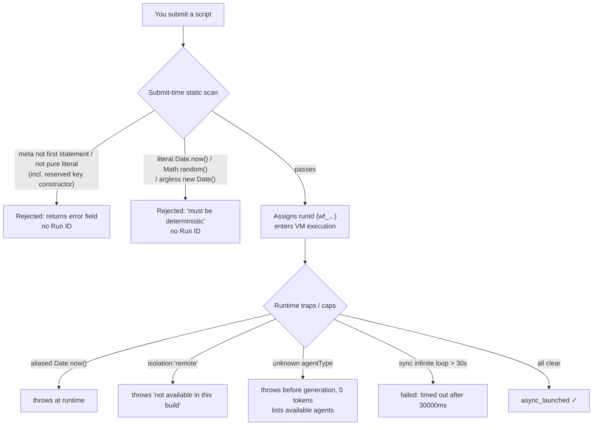
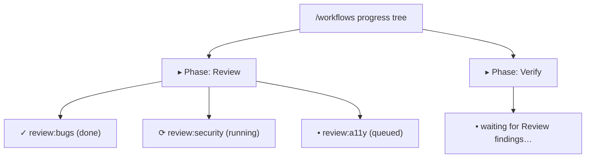
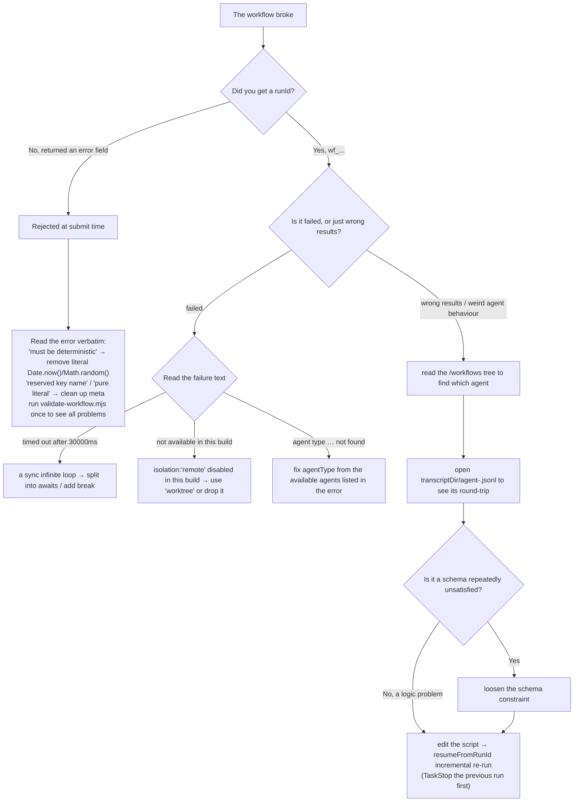

# Chapter 28 · Validation & Debugging

> In one line: **Workflow treats "determinism" as an iron law — so it puts gates at two moments: a static scan the instant you submit (compliant or not, the script just won't run), and runtime traps plus caps once it's running (aliased violations, unavailable isolation, synchronous infinite loops, unknown agentTypes all throw). This chapter pins down both gates: what submit-time rejects, what runtime throws, each with the verbatim error text and a Run ID; then it walks through three debugging tools — the `/workflows` progress tree, the `agent-<id>.jsonl` journal, and `resumeFromRunId` incremental re-runs — so that after an error you can find it fast and, once it's fixed, not burn tokens from scratch.**
>
> The previous 27 chapters taught you how to write a workflow correctly. This one assumes you already did — and it broke. Breaking is normal: an extra key snuck into `meta`, a stray `Date.now()`, a misspelled `isolation`, a loop that forgot its budget guard. The good news is that Workflow's error messages are unusually candid: they tell you **verbatim** what's wrong, why, and often how to fix it. This chapter teaches you to read those signals.

---

Every claim in this chapter comes from one of three tiers — keep them in mind as you read:

- **Official tool definition**: the description and input-schema of Claude Code's built-in Workflow tool (e.g. the script size cap, the concurrency cap).
- **Real runs on this machine**: the runs with Run IDs in `assets/transcripts/*-r4.md`, with the error text quoted verbatim.
- **The third-party tool `validate-workflow.mjs`**: it ships in the third-party repo `claude-code-workflow-creator` (a YouTuber's companion repo, **not** official Claude/Anthropic output), but **we ran its behaviour on this machine ourselves** — so wherever this chapter cites it, we tag it "**third-party tool, behaviour verified by real run**": neither treating it as official, nor failing to record honestly what it actually output.

<div class="callout info">

**Two gates, one line to anchor first**: **Submit-time** is a *static scan* — it doesn't run your code, it only reads the source and the `meta` literal; a violation gets rejected outright, with not even a `taskId` handed back. **Runtime** is *real execution* — the script is already running inside the VM; a violation surfaces as a `throw`, and by now you already hold a `runId` (`wf_...`). The next two sections take each one apart.

</div>



---

## 28.1 Gate it before submit with the linter: `validate-workflow.mjs`

Before you hand a script to the Workflow tool, you can run it through a **static lint** first. That lint is `validate-workflow.mjs`, the one that ships inside the third-party repo.

<div class="callout warn">

**First, its provenance**: `validate-workflow.mjs` ships in the third-party repo `claude-code-workflow-creator` and is **not** an official Claude/Anthropic tool. But this book **ran it on this machine and confirmed its real behaviour** (Node v22.22.0, 2026-05-25), so everything quoted below is what it **actually output**, not its docs copied over. The *rules* it checks — `meta` must be the first statement, the determinism ban, host APIs, the thunk shape — trace back to the **official tool definition plus this book's real runs**; this lint just turns those rules into a script you can run locally.

</div>

### Why this step exists

Submit-time static rejection does catch a non-compliant script, but it's inconvenient in two ways: feedback only comes **after a network round-trip** (you have to actually call the tool), and it **reports only the first fatal class at a time** (once submission is rejected it stops, so you can't see "what else is also wrong"). A local lint fills that gap: it **lists every problem at once** (errors + warnings), and it **spends no tokens and makes no calls**. Wire it into a save hook or CI and you get to self-check *before* you "hit submit".

### What it checks

Per the real runs on this machine (`assets/transcripts/validator-r4.md`) plus the official rules, it covers these checks:

| Check | Triggered by | Severity |
|---|---|---|
| Script size cap | source exceeds **524288 bytes (512KB)** | ERROR |
| `meta` must be the **first statement** | any code before `export const meta` (e.g. a `const`) | ERROR |
| `meta` must be a **pure literal** | `meta` holds a variable reference / function call / spread / template interpolation / reserved key (e.g. `constructor`); or is missing `name`/`description` | ERROR |
| banned non-deterministic call | literal `Date.now()` / `Math.random()` / argless `new Date()` | ERROR |
| no host APIs in the orchestrator | `require` / `import` / `process` appears in the orchestrator | warning |
| `parallel([...])` bare-promise warning | `parallel([agent(...), agent(...)])` passes promises directly rather than thunks | warning |

Keep **ERROR** and **warning** straight: **ERRORs set the exit code to 1** (should block submission); **with warnings alone the exit code is still 0** (the script can run, it just has room to improve).

### Real run, example 1: a clean script → passes, exit 0

Feed it a workflow that genuinely runs (the earlier model-resolution test script):

```bash
  $ node scripts/validate-workflow.mjs <…>/model-resolution-test-wf_9c94951d-58c.js
  ok — model-resolution-test-wf_9c94951d-58c.js passes (1853 bytes)
  (exit=0)
```

It prints `ok … passes`, with the byte count, exit code 0. That's what "clean" looks like.

### Real run, example 2: a broken script → reports each problem, exit 1

We deliberately wrote a script that trips a bunch of rules at once:

```javascript
  // A deliberately broken workflow, to capture the validator's real output.
  const setupBeforeMeta = 5 // code before meta → ERROR: meta must be first

  export const meta = {
    name: 'bad-example',
    description: 'demonstrates validator errors',
  }

  const stamp = Date.now() // banned non-deterministic call → ERROR
  const fs = require('node:fs') // host API in orchestrator → warning

  const results = await parallel([agent('do x'), agent('do y')]) // bare promises → warning
  return { stamp, results }
```

The validator's output (verbatim from the real run):

```text
  warn  `require()` at line 10 — no Node/host APIs in the orchestrator; do file/shell work inside an agent() instead
  warn  parallel([...]) at line 12 looks like it holds bare agent(...) calls — wrap each as a thunk: () => agent(...)
  ERROR `export const meta` must be the FIRST statement (line 4) — code precedes it
  ERROR banned non-deterministic call `Date.now()` at line 9 — it throws inside a workflow (breaks resume)

  2 error(s) in bad-example.js — fix before running.
  (exit=1)
```

It lists all 4 problems in one shot: 2 ERRORs (`meta` not first, literal `Date.now()`) + 2 warnings (orchestrator `require`, `parallel` with bare promises). The last line tells you straight out `2 error(s) … fix before running`, exit code 1.

<div class="callout tip">

**Wire it into your workflow**: where this lint earns its keep is catching — *before submit* — a script that would be statically rejected, and showing it all at once. A simple use is to run it when you save `.claude/workflows/*.js`, or in CI against the workflow scripts changed in a PR. Note it's a **static pre-flight**, surfaced **more broadly** than the Workflow tool's own submit-time rejection (it also reports warnings), but it's the same source at heart — `meta`-first, the determinism ban, host APIs, the thunk shape all ultimately defer to the **official tool definition plus this book's real runs**.

</div>

---

## 28.2 Submit-time vs runtime: the boundary between two kinds of rejection

The linter is "check it yourself first". The real gate is the Workflow tool itself, which gates at two moments — and figuring out *which moment the error happened at* is the first step to pinning down the problem: **whether or not you got a `runId` is the dividing line.**

| Dimension | Submit-time (static rejection) | Runtime (runtime throw / cap) |
|---|---|---|
| When it happens | **before** the script is parsed/executed, a static scan only | the script is already **executing** inside the VM |
| Do you get a `runId` | **No** (the workflow never started) | **Yes** (`wf_...`, usable for resume/debugging) |
| Return shape | `WorkflowOutput` with an `error` field | run `failed`, or an exception caught by your in-script `try/catch` |
| Typical trigger | `meta` not first / not a pure literal, literal `Date.now()` | aliased `Date.now()`, `isolation:'remote'`, sync infinite loop, unknown agentType |
| Can `try/catch` catch it | **No** (the script never ran, so there's no try) | **Yes** (the exception is thrown inside your code) |

Now let's go through the verbatim error text, kind by kind.

### Submit-time rejection (no Run ID)

**(1) Literal `Date.now()` / `Math.random()` / argless `new Date()` — rejected by the static scan**

The moment any of these **literal-form** non-deterministic calls show up in the script, it gets rejected by the static scan **at submit time**; the script is never parsed and never runs. Verbatim error:

```text
  Workflow scripts must be deterministic: Date.now()/Math.random()/new Date() are
  unavailable (breaks resume). Stamp results after the workflow returns, or pass
  timestamps via args.
```

<div class="callout warn">

**`try/catch` can't catch it**: a lot of people's first instinct is "I'll just wrap `Date.now()` in a `try/catch`" — that won't work. This is a **static source scan at submit time**, happening **before** the script is parsed/executed; your `try/catch` never even gets a chance to run, the script is rejected first. For a timestamp, pass it via `args`, or stamp results after the workflow returns. (Source: `sandbox-r4.md` §A, submit-rejection real run, no Run ID.)

</div>

**(2) `meta` reserved key — rejected**

`meta` must be a "pure literal", and it must not hold reserved keys. We submitted `export const meta = { name, description, constructor: 'evil' }`, and it got **rejected at submit time**. Verbatim:

```text
  Script must begin with `export const meta = { name, description, phases }` (pure literal).
  meta must be a pure literal: reserved key name not allowed in meta: constructor
```

This confirms "reserved keys (`__proto__` / `constructor` / `prototype`) are rejected" (tested with `constructor`). Again, **no Run ID** — the workflow never even started. (Source: `repo-claims-r4.md` §X1.)

### Runtime throws (with a Run ID)

These ones **passed** the submit-time static scan (a `runId` was assigned), but threw or failed at runtime for one reason or another.

**(1) Aliased non-deterministic calls — trapped and thrown at runtime**

If you alias your way past the static scan (`const D = Date; D.now()`), submission **passes** — but the call gets caught by the VM's runtime trap, throws, and can be caught by the script's own `try/catch`. In the real-run return (`wf_59bf3654-183`, 0 agents / 0 tokens / 4 ms), the two aliased calls each throw a **different** message:

```json
  {
    "aliasedDateNowError": "Date.now() / new Date() are unavailable in workflow scripts (breaks resume). Stamp results after the workflow returns, or pass timestamps via args.",
    "aliasedMathRandomError": "Math.random() is unavailable in workflow scripts (breaks resume). For N independent samples, include the index in the agent label or prompt."
  }
```

Note the runtime error for `Math.random()` even **hands you the workaround** — "for N independent samples, include the index in the agent label or prompt." Meanwhile `new Date(specificValue)` still works fine (`new Date(0)` → `1970-01-01T00:00:00.000Z`). This is the **two-layer defense**: literals get caught at submit time, aliases at runtime. (Source: `sandbox-r4.md` §B.)

**(2) `isolation:'remote'` throws; unknown isolation silently ignored**

At runtime `opts.isolation` special-cases just two values. Real run (`wf_dace2fc6-966`, 3 agents / 52,014 tokens / 5,253 ms):

```json
  {
    "isoRemote": { "threw": true, "err": "agent({isolation:'remote'}) is not available in this build" },
    "isoBogus":  { "threw": false, "result": "OK" },
    "badModel":  { "threw": false, "result": "OK" }
  }
```

- `isolation:'remote'` → **throws**, verbatim `agent({isolation:'remote'}) is not available in this build` (confirming `'remote'` exists but is disabled in this build).
- `isolation:'totally-bogus'` → **does not throw**; the agent just returns `OK` normally.

This corrects a common misconception: the runtime special-cases only `'worktree'` (do isolation) and `'remote'` (reject); **any other unknown value is silently ignored**, not "only `'worktree'` is accepted, the rest error". So a misspelled `isolation` (e.g. `'worktreee'`) won't error, but your agent **also isn't isolated** — which is a silent trap. (Source: `repo-claims-r4.md` §X2.)

**(3) `opts.model` has no parse-time validation**

In the same run (`wf_dace2fc6-966`), the **obviously misspelled** model string `model: 'totally-not-a-real-model-xyz'` was **not** rejected at submit/parse time; the agent just ran normally and returned `OK`. That's a sharp contrast with `agentType` (see below).

<div class="callout info">

**Why this session can't observe "fails later at the API call"**: this session set `CLAUDE_CODE_SUBAGENT_MODEL=claude-opus-4-7[1m]`, which **overrides every per-call `model`** — so that bogus string was never actually sent to an API, and the "fails at the API call" step **could not be observed** here (this is a third-party claim, unverified). The book asserts only what was verified: `model` has **no parse-time validation**. (Source: `repo-claims-r4.md` §X4 + `sandbox-r4.md` §C.)

</div>

**(4) VM synchronous timeout = 30000 ms — catching infinite loops**

A purely synchronous long loop `for (i=0; i<1e12; i++) {}` (not a single `await`) got aborted, and the workflow **failed**. Verbatim failure text and Run ID:

```text
  Error: Script execution timed out after 30000ms
```

- **Run ID**: `wf_e3b2b123-5f4` · **status: failed** · 0 agents · measured **30222 ms**.

This confirms the **30000 ms synchronous-execution timeout**. The key thing to grasp: it bounds **synchronous** work only (to catch infinite loops); it is **not a wall-clock cap** — an async workflow with `await agent(...)` routinely runs for minutes (e.g. the deep-research run `wf_6090decc-8a5` ran 298,530 ms with no issue). (Source: `repo-claims-r4.md` §X3.)

**(5) Unknown `agentType` — throws before generation, 0 tokens, and lists the available agents**

In contrast with the unvalidated `model`, `agentType` **is validated**. An unknown value throws **before the model is generated** (0 tokens / 4 ms) and lists out every available agent. Verbatim error text and Run ID (`wf_a222f20f-0f5`):

```text
  agent({agentType}): agent type '…' not found. Available agents: claude,
  claude-code-guide, codex:codex-rescue, Explore, general-purpose,
  get-current-datetime, init-architect, Plan, planner, statusline-setup,
  team-architect, team-qa, team-reviewer, ui-ux-designer
```

This is a **helpful** error — it doesn't just tell you "this agentType doesn't exist", it lists all 14 agents available in the current session so you can fix it straight from the list. (Source: `assets/transcripts/` + grounding A2.)

Now let's boil the two kinds of rejection — "check → moment → does it carry a Run ID" — down into one diagram:

```mermaid
flowchart LR
    subgraph SUBMIT["Submit-time (static, no Run ID)"]
      direction TB
      S1["meta not first / not pure literal / reserved key"]
      S2["literal Date.now()/Math.random()/argless new Date()"]
    end
    subgraph RUNTIME["Runtime (with Run ID)"]
      direction TB
      R1["aliased Date.now() → throws at runtime"]
      R2["isolation:'remote' → not available in this build"]
      R3["unknown isolation → silently ignored (trap)"]
      R4["bogus model → no parse-time validation, runs anyway"]
      R5["sync infinite loop > 30s → timed out after 30000ms (failed)"]
      R6["unknown agentType → 0-token throw + lists available agents"]
    end
    SUBMIT -->|"on pass, assigns wf_..."| RUNTIME
```



---

## 28.3 Three debugging tools

The script is running and something went wrong — how do you track it down? Workflow gives you three complementary tools: **watch progress live, replay each agent's detail, re-run incrementally after a fix.**

### Tool 1: the `/workflows` live progress tree

The Workflow tool is **always asynchronous**: calling it returns a `taskId`/`runId` right away, and only sends a `<task-notification>` once it's done. While it's running, you're not stuck waiting blindly — the slash command `/workflows` gives you a **live progress tree**, grouped by `phase()`, showing each agent's status. This is your first-hand view of "where the workflow is right now, which agent is stuck, which phase hasn't started yet."



<div class="callout tip">

**Use it together with `log()`**: `log(message)` in the script prints a narrative line **above** the progress tree — treat it as "narration for humans" and drop a line at key points (e.g. `log('dimension 1 found 7 items, fanning out to verify')`), and the progress tree reads as a process narrative with context instead of "a pile of agent names". Note `log()` doesn't affect the return value; it's purely for display.

</div>

### Tool 2: the `agent-<id>.jsonl` journal

`WorkflowOutput` carries a `transcriptDir` field pointing at this run's record directory. Underneath it, **every `agent()` call** drops a journal file `agent-<id>.jsonl` — line-by-line JSON recording that subagent's full round-trip (the prompt it got, its tool calls, its final output). When an agent comes back with an unexpected result, or a schema'd agent keeps retrying, open the matching `agent-<id>.jsonl` and you can see "what it actually reasoned, what tools it called, why it didn't satisfy the schema."

Each agent also carries a sidecar `agent-<id>.meta.json` recording the agent's metadata — in this book's real runs what it recorded was `{"agentType":"workflow-subagent"}` (the default agent type).

<div class="callout info">

**The journal is the physical basis for resume**: resume can "return cached results in seconds" precisely because each `agent()`'s result got recorded in the journal. The `resumeFromRunId` below reads exactly these journals. So the journal isn't just "post-hoc debugging" — it's also the data source for "incremental re-run".

</div>

### Tool 3: `resumeFromRunId` incremental re-run

The most expensive part of debugging a workflow is **burning tokens from scratch every time you change one line**. `resumeFromRunId` fixes this: pass the previous `runId` into `WorkflowInput.resumeFromRunId`, and the **longest unchanged prefix of `agent()` calls** returns cached results in seconds; only the **first edited/added call and everything after it** gets re-run live.

The real-run contrast says it best (`wf_9c94951d-58c`):

| Run | agents | total tokens | duration |
|---|---|---|---|
| First run | 5 | 133,691 | 32,959 ms |
| Resume (same script + same args) | 5 (all cached) | **0** | **3 ms** |

Same script, same args, resume → all 5 results identical, **0 new tokens / 3 ms**. Change one spot and resume, and the agents before it still hit cache; only the ones after it recompute.

<div class="callout warn">

**The three iron laws of resume**: ① **same session only** — it won't hit across sessions; ② **stop the previous run first** (with `TaskStop`) before you resume, or the two runs will fight; ③ the cache granularity is the "**longest unchanged prefix**" — insert one agent in the middle of the script and every agent after it re-runs (even if it didn't change), because the prefix got broken. So when debugging, edit **back-to-front** where you can, or put the agents you'll iterate on most toward the end of the script.

</div>

### On "the model retries when the schema doesn't match"

An `agent()` with a `schema` forces the subagent to call the `StructuredOutput` tool and validates at the tool-call layer; **on a mismatch the model retries** — this is behaviour the official tool definition spells out explicitly, and every schema'd run in this book did return a validated object successfully.

<div class="callout warn">

**Retry count: don't assert a specific number.** The third-party repo claims "compile the schema with AJV; if the subagent never calls it, nudge up to twice more before failing" — but the **exact retry count is a third-party claim, unverified**, and this book asserts **no** specific number. All you need to know is: ① the mechanism exists (a mismatch retries); ② if a schema'd agent is slow to return or takes abnormally long, it's very likely the **schema is too strict** and the model keeps failing to satisfy it — open its `agent-<id>.jsonl` to see each attempt, and you can usually pin down which field is stuck and loosen the constraint accordingly.

</div>

### A "what to do when it breaks" decision tree

Let's string this chapter's three kinds of signal (submit-time, runtime, debugging) into one tree:



---

## Summary

The core of validation and debugging is figuring out *which moment the error happened at*, then using the matching tool to track it down:

- **Two gates**: the **submit-time** static scan (no Run ID) rejects `meta` that isn't a pure literal / isn't the first statement, and literal `Date.now()`/`Math.random()`/argless `new Date()`; **runtime** (with a `runId`) throws on aliased non-deterministic calls, `isolation:'remote'` (`not available in this build`), a synchronous infinite loop (`timed out after 30000ms`), an unknown `agentType` (0-token throw listing the available agents), and more. The dividing line is just **whether or not you got a `runId`**.
- **The third-party lint `validate-workflow.mjs` (behaviour verified)**: locally lists every problem in one shot before submit (ERROR blocks, warning passes), burning no tokens.
- **Three debugging tools**: the `/workflows` live progress tree shows "where it's at"; the `agent-<id>.jsonl` journal under `transcriptDir` shows "what exactly happened to a given agent"; `resumeFromRunId` incremental re-run (longest-unchanged-prefix cache, a measured **0 tokens / 3 ms**) lets you skip burning tokens from scratch after a fix — but remember it's **same session only, and `TaskStop` the previous run first**.
- **One principle of restraint**: a schema mismatch triggers a model retry, but the **exact retry count is third-party-unverified, so don't assert a number**; when a schema'd agent is slow to return, suspect an over-strict schema first and open its journal to find the stuck field.

Commit the verbatim error text of these two gates to memory, get fluent with the three tools, and you turn "the workflow broke" from "tear it down and start over" into "read the signal, tweak one spot, re-run incrementally."

Continue reading: [Chapter 29 · Example Gallery](#/en/p6-29)
