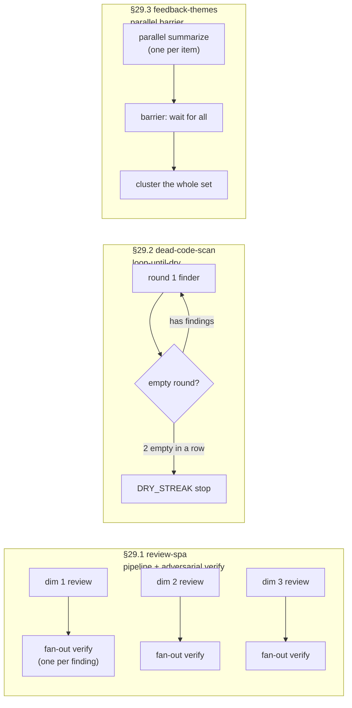
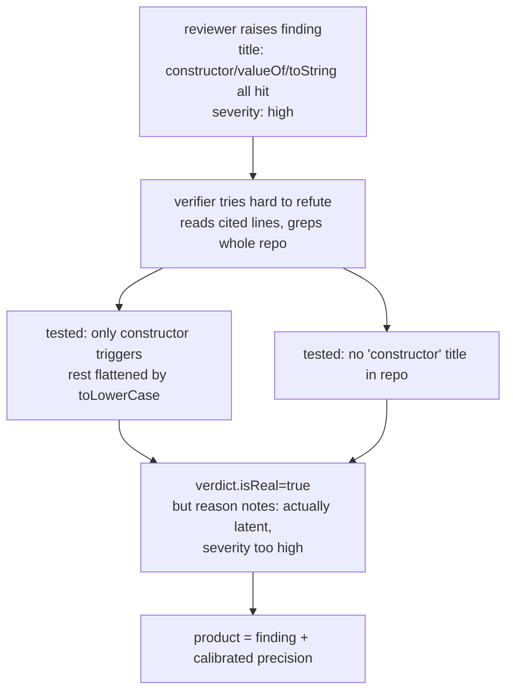
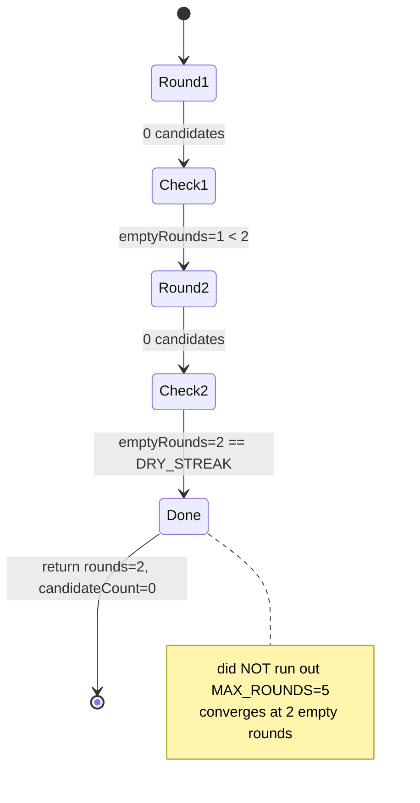
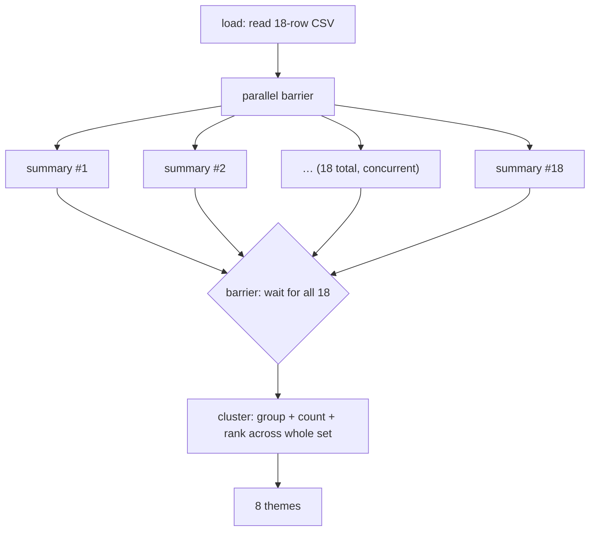

# Chapter 29 · Example Gallery

> In one sentence: **the previous 28 chapters walked through every part of Workflow one by one — pipeline, parallel, adversarial verification, loop-until-dry, barriers, schema, resume. This chapter packs them into three "actually-run" application-level workflows and hands you the whole end-to-end result: Run ID, agent count, tokens, wall-clock — every one of them, all traceable.**
>
> This is a "gallery," not one more walk through the mechanics. Three pieces — multi-dimension code review, dead-code scan, feedback clustering — each maps to one core orchestration shape, and each comes with the real numbers and products of its actual run. What you read here is not "how it should go" but "how it actually went."

---

All three example scripts live under `assets/examples/`, and all three were **actually run** in the same session (`CLAUDE_CODE_WORKFLOWS=1`, Claude Code v2.1.150, main loop Opus 4.7 (1M)); the run records sit in `assets/transcripts/examples-r5.md`. Each occupies one orchestration shape:



A table to pin down what really sets the three shapes apart:

| Shape | Representative script | When each agent finishes | When the next step proceeds | Use case |
|---|---|---|---|---|
| **pipeline + verify** | review-spa | each dimension finishes independently | this dimension verifies **the moment** its review is done, no wait for the slowest | many independent chains, "whoever's ready first goes first" |
| **loop-until-dry** | dead-code-scan | round by round, serially | stops only after N empty rounds in a row | progressive sweeps where one round may reveal new targets |
| **parallel barrier** | feedback-themes | all finish concurrently | **must wait for all to arrive** before clustering | the next step needs the whole set (cluster, aggregate, rank) |

We unpack each piece below. Every section follows the same structure: **pattern → script (orchestration trade-offs) → real run (Run ID + usage table) → result → teaching point.**

---

## 29.1 review-spa: Pipeline Multi-Dimension Review + Adversarial Verify

### Pattern

Review one piece of code across **multiple dimensions** (bugs / security / a11y), each dimension its own chain; the moment a dimension's review is done, **immediately** verify each of its findings, without waiting on the other dimensions. This bolts together two patterns — "pipeline lets each chain go its own way" and "adversarial verification trusts only findings that survive verification" — covered respectively in Chapter 8 (pipeline) and Chapter 17 (adversarial verification); here we watch them work together in practice.

The real target is the book's own `index.html` (a ~600-line vanilla-JS SPA) — dogfooding, taking a knife to our own frontend.

### Script: Orchestration Trade-offs

The script is `assets/examples/review-spa.js`. The skeleton is just one `pipeline()`, with each of 3 dimensions forming a two-stage chain:

```javascript
  const reviewed = await pipeline(
    DIMENSIONS,
    // Stage 1 — review one dimension.
    d => agent(d.prompt, { label: `review:${d.key}`, phase: 'Review', schema: FINDINGS }),
    // Stage 2 — verify every finding from that dimension, in parallel.
    (review, d) => parallel(
      (review?.findings ?? []).map(f => () =>
        agent(
          `Adversarially verify this finding about ${TARGET}. Read the cited lines and try hard to refute it; ` +
          `if you cannot, it is real.\nTitle: ${f.title}\nEvidence: ${f.evidence}\nSeverity: ${f.severity}`,
          { label: `verify:${d.key}`, phase: 'Verify', model: 'haiku', schema: VERDICT },
        ).then(v => ({ ...f, dimension: d.key, verdict: v })),
      ),
    ),
  )
```

Three design trade-offs worth pausing on:

**Trade-off 1: Why `pipeline` instead of "review all first, then verify everything together"?** Because pipeline's promise is "each item flows through all stages on its own, with no barrier between stages" (see Chapter 8). The moment the bugs dimension is done, its 6 findings enter verification **immediately**, with no need to wait for the slower a11y chain to finish reviewing. Do it the other way — "`parallel` over three dimensions → then `parallel` over all findings" — and you've added a redundant barrier: the fastest dimension stuck idling for the slowest. Pipeline lets review and verification **interleave**, which shortens wall-clock.

**Trade-off 2: review uses schema=`FINDINGS`, verify uses schema=`VERDICT`.** Each stage carries its own strong-typed contract. The review stage forces the reviewer to return `{findings:[{title, evidence, severity}]}`; the verify stage forces the verifier to return `{isReal:boolean, reason}`. Schema gets validated right at the tool-call layer and hands back an already-validated object (see Chapters 6, 7), so `review?.findings` and `f.verdict?.isReal` can be used straight away as structured data, no `JSON.parse` needed.

**Trade-off 3: the verify agent is told to "try hard to refute."** The prompt reads "try hard to refute it; if you cannot, it is real" — this is the soul of adversarial verification: doubt by default, count it real only if you can't refute it. The script's closing `.filter(f => f.verdict?.isReal)` keeps only the survivors.

<div class="callout info">

**About `model: 'haiku'`**: the script tags the verify agents with `model: 'haiku'` (verification is a fairly simple checking job, meant to lean on a cheap model). But **this session set `CLAUDE_CODE_SUBAGENT_MODEL=claude-opus-4-7[1m]`, which overrides any per-call model** (see `_grounding.md` §A2, Run `wf_9c94951d-58c`) — so these "haiku" verifiers all actually ran on Opus. That's one reason this run's token count is on the high side. §29.3 digs into this cost trap in detail.

</div>

### Real Run

- **Run ID**: `wf_97b81e86-a0b` (Task `wq64i8tjl`)
- **Target**: `index.html` (~600-line vanilla-JS SPA)

| Metric | Value |
|---|---|
| agent_count | **22** (3 reviewers + 19 verifiers) |
| total_tokens | **991,554** |
| tool_uses | **148** (reviewers/verifiers repeatedly Read the same file) |
| duration_ms | **395,166** (≈6.6 minutes) |
| return | `{ confirmedCount: 18, confirmed: [...] }` |

agent_count=22 breaks down cleanly: 3 reviewers (one per dimension), plus 19 verifiers fanned out over all findings across the three dimensions, which adds up to exactly 22.

### Result

18 findings survived adversarial verification (`verdict.isReal=true`), split by dimension: **bugs 6 / security 4 / a11y 8**. A few highlights from each below (full 18 in `assets/transcripts/examples-r5.md`):

**bugs (6)** — take the most severe one: `slugify` dedup uses a bare `{}` as the `seen` map (L322/521); `seen={}` inherits `Object.prototype`, so the title "constructor" ends up with id `constructor-NaN` (`++function` evaluates to `NaN`). Fix: `Object.create(null)`. The rest cover anchor resolution, dedup collisions, deep-link overriding language preference, hardcoded Chinese error messages, and scroll/resize sharing one `ticking` flag.

**security (4)** — all **latent / supply-chain** issues, with no input surface an attacker could reach: mermaid SVG injected via `innerHTML` after sanitize (leaning only on `securityLevel:'strict'`), 4 CDN scripts with no SRI, `ghLink.href` with no scheme validation, and inconsistent escaping of manifest fields.

**a11y (8)** — the most concrete is this one: the whole `#content` carries `aria-live="polite"` (L289/488), so every navigation reads the entire chapter aloud. The rest cover missing `aria-current`, the mobile drawer background not set `inert`, the home page not moving focus on switch, mermaid SVGs with no alt text, code blocks you can't scroll with the keyboard, and more.

### Teaching Point: Adversarial Verification Corrected the Reviewer's Exaggerations

What you should take away from this section isn't "found 18 bugs," but — **the verify stage didn't just judge true/false; it pulled back the reviewer's exaggerations.** The precision clarifications in `verdict.reason` are themselves a product:

- **#1/#2 title exaggeration caught**: the reviewer's title listed `constructor / valueOf / toString / ...`, a whole string of prototype keys it claimed all trigger the bug, but the verifier found by testing that **only `constructor` actually triggers** — the rest get flattened by `.toLowerCase()` to `valueof`/`tostring` and miss; and a grep across the whole repo turned up **no "constructor" title at all**. So this was **downgraded to latent** (potential, not triggering today), and the high severity it was tagged with was judged too high.
- **#2 a false sub-claim refuted**: the reviewer claimed ordinary dedup anchors like `#overview-1` were also unreachable — but the verifier found by testing that **ordinary dedup (`-1`/`-2`) main lookups hit perfectly and are reachable**, and the only thing that breaks is the one `constructor-NaN` special case. This false sub-claim was caught on the spot.
- **#3 wording error corrected**: the reviewer wrote "the 2nd `Setup`" when it should be "the 3rd `Setup`" (the underlying mechanism still holds, the description just landed on the wrong one).



<div class="callout tip">

**A finding surviving ≠ taking it wholesale.** A finding being `isReal=true` only says "it wasn't made up"; whether its severity is accurate, its wording precise, or whether it "triggers today" versus is merely "latent" — that lives in `verdict.reason`. This run split the 18 accordingly into three tiers: "triggers today, not latent" high-priority items (say, removing `#content`'s `aria-live`), "real but low-impact" ordinary items, and "latent / supply-chain / transient" optional defensive items. **Adversarial verification earns its keep not just by filtering out false findings, but by pinning a trustworthy priority on each real one** — that's the practical meaning of Chapter 17's adversarial verification.

</div>

---

## 29.2 dead-code-scan: Loop-Until-Dry Dead-Code Scan

### Pattern

Scan a target round by round for symbols that are "defined but never referenced anywhere in the file," **stopping only after several empty rounds in a row.** This is the loop-until-dry shape (Chapter 18): use a `while` loop to keep dispatching an agent until it's "dry" (consecutive empty rounds) — because confirming one symbol dead may make another one obviously removable too, so you can't call it after a single round.

The real target is again `index.html` (the SPA's inline vanilla JS).

### Script: Orchestration Trade-offs

The script is `assets/examples/dead-code-scan.js`; the core is just a `while` with two termination conditions:

```javascript
  const DRY_STREAK = 2 // stop after this many empty rounds in a row
  const MAX_ROUNDS = 5 // hard cap so the loop always terminates

  const found = []
  let emptyRounds = 0
  let round = 0

  while (emptyRounds < DRY_STREAK && round < MAX_ROUNDS) {
    round++
    phase('Find')
    const { items } = await agent(
      `Round ${round}. Read ${TARGET} and search the same file for references. List vanilla-JS symbols ` +
      `(functions, const/let bindings, event handlers) that are DEFINED but never REFERENCED anywhere in the file. ` +
      `Report only — do NOT edit any file. Ignore anything already reported: ` +
      `${found.map(r => r.symbol).join(', ') || 'nothing yet'}.`,
      { label: `find:round-${round}`, phase: 'Find', schema: DEAD },
    )

    if (items.length === 0) {
      emptyRounds++
      log(`Round ${round}: clean (${emptyRounds}/${DRY_STREAK} empty rounds)`)
      continue
    }

    emptyRounds = 0
    found.push(...items)
  }
```

Two design trade-offs:

**Trade-off 1: two termination conditions (`DRY_STREAK` + `MAX_ROUNDS`).** `emptyRounds < DRY_STREAK` is the normal exit for "stop once dry"; `round < MAX_ROUNDS` is the hard cap of "run at most 5 rounds no matter what." The latter is a safety net — should the agent report something new every round (even noise), the loop still won't run forever. This echoes the runaway-loop backstop idea in `_grounding.md` ("lifetime `agent()` total cap 1000"): loop-style workflows **must** carry their own hard cap.

**Trade-off 2: report-only, never edits files.** The prompt spells it out: `Report only — do NOT edit any file`. This is the safe posture for a scanning "sweep" — report it up first, a human looks, then you decide whether to change anything, rather than turning the agent loose to delete code on its own. Delete dead code wrongly and you can bury a subtle bug, so it stays hands-off by default (cf. Chapters 16, 18).

**Trade-off 3: feed already-reported symbols back into the prompt (`Ignore anything already reported: ...`).** This keeps later rounds from re-reporting the same symbol, so the "empty round" judgment stays clean.

### Real Run

- **Run ID**: `wf_2283ab37-710` (Task `w4ii328zm`)
- **Target**: `index.html`

| Metric | Value |
|---|---|
| agent_count | **2** (2 rounds × 1 finder) |
| total_tokens | **116,344** |
| tool_uses | **14** (finder repeatedly Read/grep the same file) |
| duration_ms | **246,496** (≈4.1 minutes) |
| return | `{ rounds: 2, candidateCount: 0, candidates: [] }` |

### Result

**Both rounds came back 0 candidates.** Round 1 was clean (`emptyRounds=1`), round 2 was still clean (`emptyRounds=2`), two empty rounds in a row hit `DRY_STREAK`, and the loop exited normally — it did **not** burn through the 5-round cap. agent_count=2 confirms "2 rounds × 1 finder" exactly.

Final product: `index.html` has **no symbols that are defined yet never referenced** — a clean bill of health.

### Teaching Point: Zero Findings Also Terminates Correctly



The counterintuitive bit of this section: **a workflow that "found nothing" is still a successful run.** A lot of people writing loop-style workflows instinctively worry "if it finds nothing, will it loop forever / burn through the cap?" — this run settles it: loop-until-dry's termination condition is "N empty rounds in a row," so **even with zero findings on the first round, two empty rounds in a row still make it converge cleanly**, never running out `MAX_ROUNDS`.

<div class="callout tip">

**Two engineering disciplines you can take with you.** ① **A loop must have a hard cap**: `DRY_STREAK` decides "when it normally stops," `MAX_ROUNDS` backstops "at worst how many rounds" — you need both — with only the former, persistent noise runs away; with only the latter, it cuts off a scan that could have converged too early. ② **Scans default to report-only**: destructive operations (deleting code, editing files) should first spit out a "candidate list" for a human to review, rather than the agent doing it on its own. This run's 0 candidates happens to put the safest form of a non-destructive scan on display — it just looked, and touched nothing.

</div>

---

## 29.3 feedback-themes: Parallel-Barrier Clustering

### Pattern

**Summarize a batch of feedback in parallel**, then cluster the **whole set** into ranked themes. Here's the key: the cluster step **must wait for every summary to arrive** before it can run — you can't cluster a single piece of feedback on its own. This is exactly the right scenario for `parallel()` as a **barrier** (rather than a pipeline) (Chapter 8 contrasted the two).

The input is a clearly-labeled **synthetic sample** `assets/samples/feedback-sample.csv` (18 rows, columns `id,text`); but **the run itself is real** — Run ID, tokens, and clustered output are all traceable.

### Script: Orchestration Trade-offs

The script is `assets/examples/feedback-themes.js`, and it runs in three segments: single agent loads → `parallel` barrier summarizes → single agent clusters:

```javascript
  phase('Load')
  const { items } = await agent(
    `Read ${SOURCE} (a CSV with columns id,text). Return every row as an item with its id and text.`,
    { label: 'load', phase: 'Load', schema: ITEMS },
  )

  // Barrier on purpose: the next step clusters across the WHOLE set, so it needs
  // all summaries together before it can run.
  const summaries = await parallel(items.map(it => () =>
    agent(
      `Summarize this feedback in one sentence and name the single issue it is about.\nID ${it.id}: ${it.text}`,
      { label: `summarize:${it.id}`, phase: 'Summarize', model: 'haiku' },
    ).then(summary => ({ id: it.id, summary })),
  ))

  const labelled = summaries.filter(Boolean)

  phase('Cluster')
  const { themes } = await agent(
    `Here are ${labelled.length} summarized feedback items. Cluster them into themes, count the items ` +
    `under each, pick one representative quote per theme, and rank the themes by count (descending).\n\n` +
    labelled.map(l => `- [${l.id}] ${l.summary}`).join('\n'),
    { label: 'cluster', phase: 'Cluster', schema: THEMES },
  )
```

Design trade-offs:

**Trade-off 1: Why is this a `parallel` barrier, while §29.1 is a `pipeline`?** The difference comes down to "does the next step need the whole set." §29.1's verification needs only **this dimension's** findings, so pipeline lets the dimensions interleave without waiting on each other. Here, clustering needs **all 18 summaries together** to group, count, and rank — one fewer, and the cluster result might shift. So a barrier is mandatory: `parallel()` waits for every summary to come back before it moves into clustering. **"Does the next step depend on the whole set" is the deciding line between pipeline and barrier.**

**Trade-off 2: `.filter(Boolean)`.** `parallel()`'s semantics are "an agent erroring → that slot is `null`, the call itself doesn't reject" (see Chapter 8). So once you've got `summaries`, you first `.filter(Boolean)` to drop the failed slots, then feed clustering — this is the standard defensive pattern when you use `parallel`.

### Real Run

- **Run ID**: `wf_b3febb70-ad9` (Task `wh31drag1`)
- **Input**: `assets/samples/feedback-sample.csv` (18 rows)

| Metric | Value |
|---|---|
| agent_count | **20** (1 load + 18 summarize + 1 cluster) |
| total_tokens | **607,307** |
| tool_uses | **3** |
| duration_ms | **122,391** (≈2.0 minutes) |
| return | `{ itemCount: 18, themeCount: 8, themes: [...] }` |

agent_count=20 lines up exactly with "1 load + 18 summarize (one per row) + 1 cluster," consistent with the 18-row input.

### Result

18 feedback items clustered into **8 themes** (most to least by count, quoting the real cluster output):

| Rank | Theme | count | Representative quote (excerpt) |
|---|---|---|---|
| 1 | Onboarding friction (unclear steps, missing prerequisites, slow value realization) | 4 | "the first-run experience requires reading three documentation pages before the app delivers any value." |
| 2 | Performance & load speed (dashboard / analytics / chart rendering) | 3 | "the dashboard takes nearly 8 seconds to load, making the app feel sluggish" |
| 3 | Billing accuracy & clarity (pricing definitions, double charges, recipient config) | 3 | "Customer was charged twice this month and waited four days for a support response" |
| 4 | Error-handling quality (unhelpful messages, crashes) | 2 | "error messages are too generic and unhelpful" |
| 5 | Feature requests (export, power-user navigation) | 2 | "add an export-to-CSV button on the reports screen" |
| 6 | Accessibility & UI defects (contrast, Esc-to-close modal) | 2 | "Modal dialogs cannot be closed with the Escape key" |
| 7 | Documentation gaps (failure/recovery scenarios) | 1 | "the lack of guidance on recovering from a failed migration." |
| 8 | Search internationalization (non-Latin / Unicode support) | 1 | "the search box fails to return any results for queries containing non-Latin characters (e.g., Japanese)" |

The counts add up to 4+3+3+2+2+2+1+1 = 18, self-consistent with the input item count.

### Teaching Point 1: The Right Scenario for a Barrier



Clustering is a "whole-set function" — what it eats is the **entire batch** of summaries, and one fewer could change the result. This kind of "the next step must consume all upstream results" dependency is exactly why a barrier exists. Flip it around: if a step depends only on a **single** upstream result (like §29.1's verification, which only looks at this dimension's one finding), use a pipeline to let them interleave instead of idling needlessly. **Rule of thumb: next step depends on the whole set → barrier (parallel); next step depends only on a single item → pipeline.**

### Teaching Point 2: Cost in Practice — the haiku Tag Silently Overridden by Opus

This is the cost trap most worth watching in this chapter. The script tags all 18 summarize agents with `model: 'haiku'` (summarizing is a simple task, meant to save money). But this session set the environment variable `CLAUDE_CODE_SUBAGENT_MODEL=claude-opus-4-7[1m]` — **which overrides any per-call model** (see `_grounding.md` §A2, Run `wf_9c94951d-58c`). The result: the 18 agents tagged "haiku" **actually all ran on Opus 1M**, burning **607,307 tokens** in a single run.

<div class="callout warn">

**`CLAUDE_CODE_SUBAGENT_MODEL` is a user/CI knob; the script cannot control it.** Once this environment variable is set, the `model: 'haiku'` (or any per-call model) written into the workflow script is **silently ignored** — the agent doesn't error, it just quietly runs as the model the environment variable names. This run's 607k tokens is the direct consequence of 18 "haiku" agents actually running Opus, confirming the tested conclusion in `_grounding.md` §A2 (Run `wf_9c94951d-58c`: 5 agents with different `model` options all ran Opus).

**Implication**: in a session with this variable set, `model: 'haiku'` **saves no money.** To actually save money, the user or CI must adjust `CLAUDE_CODE_SUBAGENT_MODEL`; the script author gets no say. So the assumption "I tagged the summaries haiku, it should be cheap" **may not hold at all** in a controlled CI/session environment — always go by the actual token usage.

</div>

Put the "nominal model" and "actual model" of the three runs side by side and the trap is obvious:

| Script | model tagged in script | model actually run | Reason |
|---|---|---|---|
| review-spa | verifier tagged `haiku` | Opus 1M | env var override |
| feedback-themes | 18 summarize tagged `haiku` | Opus 1M | env var override |
| (control) `wf_9c94951d-58c` | 5 agents tagged haiku/opus/inherit/omitted | all Opus 1M | env var override |

---

## 29.4 How to Read These Numbers

With all three pieces seen, let's boil the "reading method" running through them down to four intuitions you can take with you. These aren't new mechanisms but **estimation heuristics** pulled from real runs — next time you write a workflow and see `usage` in the completion notification, you can judge "is this number reasonable" on the spot.

**Heuristic 1: tokens ≈ agent count × per-agent context (~30k).** This is the most useful rough estimate going. Check it against the three runs:

| Script | agent count | total_tokens | per-agent average |
|---|---|---|---|
| review-spa | 22 | 991,554 | ≈45,071 |
| dead-code-scan | 2 | 116,344 | ≈58,172 |
| feedback-themes | 20 | 607,307 | ≈30,365 |

`feedback-themes` sits closest to "~30k per agent" (summarize agents have short context); `review-spa` and `dead-code-scan` run higher, because the reviewer/finder repeatedly Read the same 600-line file, carrying heavier context (look at `tool_uses`: review-spa as high as 148, dead-code-scan 14). So the formula gives a **lower-bound order of magnitude**; re-reading files, long prompts, and adversarial verification all push it up. The point: **tokens are mainly driven by agent count** — to save tokens, first ask "can I dispatch fewer agents."

**Heuristic 2: wall-clock comes down to the critical path; concurrency compresses N into "the slowest one."** Put tokens and wall-clock side by side and you'll see they're **not proportional**:

| Script | agent count | total_tokens | duration_ms | shape |
|---|---|---|---|---|
| review-spa | 22 | 991,554 | 395,166 | pipeline + fan-out |
| feedback-themes | 20 | 607,307 | **122,391** | parallel barrier |

`feedback-themes` used 20 agents and 600k tokens, yet wall-clock was only **2 minutes** — because the 18 summarize agents ran **concurrently**, squeezing wall-clock down to the critical path of "the slowest single summary + load + cluster," not 18 added up in series. `review-spa`'s 6.6 minutes, by contrast, is because each chain in the pipeline is two serial stages ("review→verify"), plus a lot of fanned-out verify agents. **Concurrency saves wall-clock (not tokens)**: the tokens still get spent, but with N agents running at once, you only wait on the slowest one.

**Heuristic 3: adversarial verification / fan-out is the token heavyweight.** Of `review-spa`'s 22 agents, 19 are verifiers — adversarial verification's fan-out of "one verify agent per finding" is the main reason it creeps up toward a million tokens. It's a **cost worth paying**: the extra tokens bought the calibration value of "downgrading #1/#2 to latent, catching #2's false sub-claim" (see §29.1's teaching point). But keep it in mind — **give every finding its own verify agent and tokens grow linearly with the finding count.** When there are a lot of findings, consider adversarially verifying only the high-severity ones, and draw a token boundary (with Chapter 21's `budget`).

**Heuristic 4: scripts re-run, numbers trace back.** All three scripts can be re-run with `Workflow({ scriptPath: 'assets/examples/<script>.js' })` (returns asynchronously; on completion `<task-notification>` reports back `usage`/`result`). Every Run ID, agent count, tokens, and wall-clock in this chapter is recorded in `assets/transcripts/examples-r5.md`, checkable one by one. This book later **re-ran these three scripts as-is once** (`wf_ca7aa11f-6fb` / `wf_ccda2a68-fab` / `wf_0771c834-a9f`, recorded in `assets/transcripts/examples-r6.md`) — and the result confirms Heuristic 4 exactly: **agent count and orchestration shape reproduce rock-solid** (dead-code was still 2 agents / 2 clean rounds; feedback still 20 agents), while **finding/theme counts drift a little with the target's evolution and clustering granularity** (review-spa 18→14, because `index.html` had already been polished per the first run's findings; feedback 8→6 themes, a clustering-granularity difference). For digit-for-digit reproduction, use resume (Chapter 22).

<div class="callout info">

**Why might your re-run numbers not line up exactly with this chapter?** Three reasons: ① **model environment** — this chapter is an Opus 1M main loop + `CLAUDE_CODE_SUBAGENT_MODEL` override (see §29.3); swap in a different model environment and both tokens and wall-clock shift. ② **target content changes** — `review-spa`/`dead-code-scan` scan `index.html`, which keeps evolving as the book iterates, so finding counts naturally come out different (e.g., once the book's frontend is polished, a11y findings may drop). ③ **models aren't fully deterministic** — for the same script and same target, reviewer wording and finding counts can wobble a little. So this chapter's numbers are a **snapshot of one real run**, not "constants"; their value is to help you build a sense of magnitude, not to chase digit-for-digit reproduction. What does reproduce digit-for-digit is **resume** (same script + same args = 100% cache hit, see Chapter 22) — that's the deterministic guarantee.

</div>

---

## 29.5 Chapter Summary

- Three "actually-run" application-level pieces, each mapping to one core orchestration shape, all numbers traceable to `assets/transcripts/examples-r5.md`:
  - **§29.1 review-spa** (`wf_97b81e86-a0b`, 22 agents / 991,554 tokens / 395,166ms): pipeline multi-dimension review + adversarial verify, 18 confirmed (bugs 6 / sec 4 / a11y 8). Teaching point — **adversarial verification pulled back the reviewer's exaggerations** (several downgraded to latent, one false sub-claim caught): a finding surviving ≠ taking it wholesale.
  - **§29.2 dead-code-scan** (`wf_2283ab37-710`, 2 agents / 116,344 tokens / 246,496ms): loop-until-dry, 2 rounds all clean, 0 candidates, `DRY_STREAK` termination. Teaching point — **zero findings also terminates correctly**, report-only and hands-off, a loop must have a hard cap.
  - **§29.3 feedback-themes** (`wf_b3febb70-ad9`, 20 agents / 607,307 tokens / 122,391ms): parallel barrier, 18 items→8 themes. Teaching point — **the right scenario for a barrier** (clustering needs the whole set) + **cost trap**: `CLAUDE_CODE_SUBAGENT_MODEL` overrides the script's `model:'haiku'`, 18 "haiku" agents actually ran Opus → 607k tokens in one run.
- **§29.4 four reading heuristics**: ① tokens ≈ agent count × ~30k per agent (re-reading files pushes it up); ② wall-clock comes down to the critical path, concurrency compresses N into the slowest one (saves wall-clock, not tokens); ③ adversarial verification/fan-out is the token heavyweight; ④ scripts re-run via `Workflow({ scriptPath })`, numbers trace back to `examples-r5.md`.

This chapter assembled the book's parts into a machine that actually runs. You've now seen them run for real — next, head to the appendix to look up each API's complete signature and boundaries, and settle these intuitions into a reference you can reach for anytime.

> Continue reading: [Appendix A · Complete API Reference](#/en/app-a)

---

[← Back to main README](../../README.md) · [中文 README →](../../README.md)
