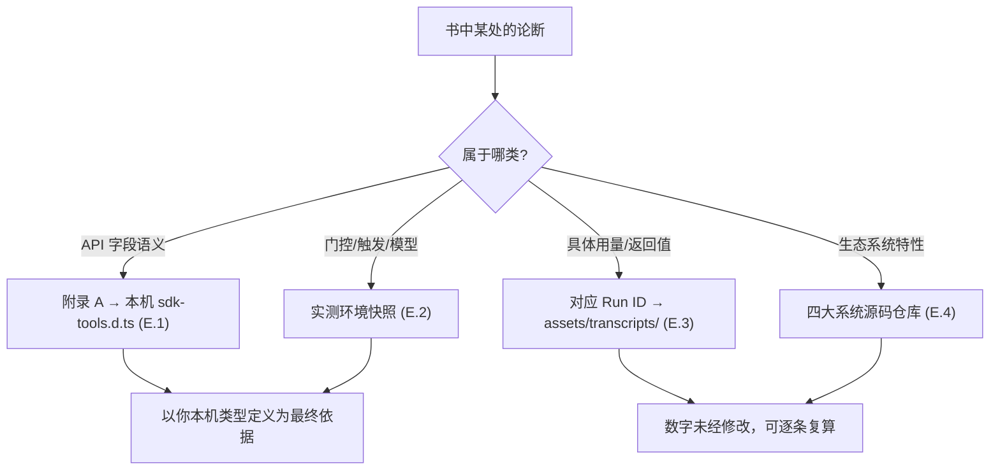

# 附录 E · 信源索引

> 这是一本「事实优先」的书。本附录把全书所依据的**真实信源**逐一列出，分五类：①官方类型定义；②实测环境与版本；③本书自跑的真实运行（含 Run ID 与覆盖的机制）；④四大社区系统的源码仓库；⑤参考解读（注明「参考、非照抄」）。
>
> 凡书中关于 API 字段/行为/数字的论断，都应能回溯到本附录的某一条。若某处与你本机实测不符，**以你本机的类型定义与运行为准**——这是实验性特性，字段可能随版本演进。

---

## E.0 诚实声明

**本书是独立写作的第三方实践手册，不隶属于 Anthropic，也非官方文档。** 全书内容基于三类公开/可复现的事实来源：

1. **公开分发包与类型定义**——Claude Code 的 npm 分发包及其内含的工具类型定义；
2. **产品行为分析**——在真实 Claude Code 会话中观察到的环境变量、工具回执、完成通知；
3. **真实运行**——我们亲自在本机跑出的工作流，共 **10 次完成记录 / 9 个唯一 Run ID**（续传复用已有 Run ID，不计为独立 ID；见 [E.3](#e3-真实运行记录10-次完成记录9-个唯一-run-id覆盖的机制)），其用量/返回值原样记录在 `assets/transcripts/`。

凡**未实跑、仅作示意**的脚本，正文已明确标注「（示意，未实跑）」。凡引用真实数据，均注明 Run ID 与出处。我们**不编造** API、参数或输出。

---

## E.1 官方类型定义（API 字段的权威来源）

全书 API 字段语义（[附录 A](#/zh/app-a)）对照 Claude Code 官方分发包内的工具类型定义整理。

| 信源 | 用途 | 覆盖 |
|---|---|---|
| `@anthropic-ai/claude-code` 包内的 **`sdk-tools.d.ts`** | `WorkflowInput` / `WorkflowOutput` 两个接口的字段与类型 | `script` / `name` / `args` / `scriptPath` / `resumeFromRunId`；`status` / `taskId` / `runId` / `transcriptDir` / `scriptPath` / `sessionUrl` / `warning` / `error` |
| **Workflow 工具定义**（工具的运行时描述） | 脚本体内全局钩子的签名与语义、触发方式、并发与规模约束 | `meta` / `agent()` / `parallel()` / `pipeline()` / `phase()` / `log()` / `args` / `budget` / `workflow()`；`min(16, cores−2)` 并发上限、1000 agent 兜底、嵌套一层 |

`sdk-tools.d.ts` 是**分发包内的类型定义文件**，不是本书仓库里的文件——它随你安装的 Claude Code 一起分发。要核对，请在你本机的 `@anthropic-ai/claude-code` 安装目录中查看该文件。字段如有版本差异，**以你本机的 `sdk-tools.d.ts` 为最终依据**（[附录 A](#/zh/app-a) 末尾同此口径）。

---

## E.2 实测环境与版本（行为论断的依据）

下列环境事实在真实 Claude Code 会话中**实测核实**（环境变量存在性、版本号、模型标识），是全书「门控 / 触发 / 模型」类论断的依据。

| 事实 | 实测值 | 性质 |
|---|---|---|
| Claude Code 版本 | **v2.1.150** | 取自分发包 `package.json` |
| 门控环境变量 | `CLAUDE_CODE_WORKFLOWS=1` | 实测会话环境变量存在 |
| 关联实验标志 | `CLAUDE_CODE_EXPERIMENTAL_AGENT_TEAMS=1` | 实测环境变量 |
| subagent 模型 | `claude-opus-4-7`（由 `CLAUDE_CODE_SUBAGENT_MODEL` 指定） | 实测环境变量 |
| 运行月份 | 2026-05 | transcripts 记录时间 |
| 返回性质 | 始终异步：回执先到（`taskId`/`runId`），结果随 `<task-notification>` 到达 | 类型定义 + 实测 |

> 这些是**本书写作时的实测快照**。实验性特性会演进——读到本书时若版本已变，请以你本机实测为准。

---

## E.3 真实运行记录（10 次完成记录，9 个唯一 Run ID，覆盖的机制）

全书凡引用具体用量（`agent_count`/`tool_uses`/`total_tokens`/`duration_ms`）或返回值的地方，均来自下列**在本机真实跑出**的工作流——共 **10 次完成记录**，对应 **9 个唯一 Run ID**（第 4 行的续传复用了第 1 行的 Run ID，不计为独立 ID）。原始记录存于仓库 `assets/transcripts/`，所有数字未经修改。

> **实证截图**：Claude Code 内置 `/workflows` 面板的实截——本会话 **10 次完成**，逐行显示 agent 数 / token / 耗时，与下表一一对应。注意 `hello-workflow` 出现两行：一次是脚本运行（约 26k token / 10s），一次 `0s` 是 `resumeFromRunId` **缓存命中**（0 token，印证 [第 22 章 · 断点续传与缓存](#/zh/p4-22)）。

| # | Workflow | Run ID | Task ID | 覆盖的机制 | 关键真实数据 | 记录文件 |
|---|---|---|---|---|---|---|
| 1 | hello-workflow | `wf_dacbd480-d5d` | `wi7ye81mb` | 单 agent + `schema` 强制结构化；异步回执 | `agent_count=1`、`tokens=26,338`、`5,506ms`；`sum` 严格为数字 `4` | `primitives.md` |
| 2 | parallel-demo | `wf_52957913-6d2` | `wjqmilq04` | `parallel()` 屏障、3 并发、thunk 写法 | `agent_count=3`、`tokens=78,844`、`8,395ms`（≪ 3×5.5s） | `primitives.md` |
| 3 | pipeline-demo | `wf_bf086b98-6ec` | `w60ugs3lk` | `pipeline()` 两阶段、阶段间无屏障、stage 签名 `(prev, orig)` | `agent_count=6`、`tokens=158,982`、`26,743ms` | `primitives.md` |
| 4 | hello-workflow（续传） | `wf_dacbd480-d5d`（复用） | `w7pxch4w6` | `resumeFromRunId` 缓存命中、可重放性 | **`tokens=0`、`tool_uses=0`、`8ms`**，返回值与首次一致 | `advanced.md` |
| 5 | nested-parent | `wf_85e22b38-126` | `wwxi71uvf` | `workflow()` 内联嵌套、子 agent 计入父、嵌套仅一层 | `agent_count=1`、`tokens=26,338`、`6,050ms`（子流程计入父） | `advanced.md` |
| 6 | frontend-review | `wf_4c5caabb-b73` | `wss21eu0x` | PR 多维 `parallel` 评审 + 综合；`opts.phase` 显式归组；dogfooding | `agent_count=4`、`tokens=221,648`、`272,643ms`；26 条发现去重为 16 项 | `frontend-review.md` |
| 7 | gcf-slugify | `wf_7472ceac-daa` | `wchxy8dbm` | Generate-Critique-Fix 顺序三阶段；对抗式批评 | `agent_count=3`、`tokens=96,468`、`180,724ms`；揪出 10 个真实缺陷 | `gcf-slugify.md` |
| 8 | judge-panel | `wf_f5b69668-b18` | `w7rykwriv` | 评委面板：`parallel` 起草+独立评委、rubric、计票 | `agent_count=5`、`tokens=201,852`、`79,462ms`；评委 3:0 收敛 | `judge-panel.md` |
| 9 | bug-hunter | `wf_53da9a06-915` | `wsj4ypt3x` | Bug 猎手 + 对抗验证：`pipeline` 内 `parallel` 派 2 个「默认证伪」证伪者、计票确认 | `agent_count=11`（1 猎手 + 5 bug×2 证伪者）、`tokens=311,134`、`61,660ms`；5 个种子 bug 各以 2:0 通过验证 | `bug-hunter.md` |
| 10 | deep-research | `wf_6090decc-8a5` | `wva3qtdps` | 深度研究（第 13 章）：Research（`parallel` 正交检索）→ Verify（独立交叉验证+信源质量）→ Synthesize（强制带 source）；subagent 真实联网溯源 | `agent_count=4`（2 检索+1 交叉验证+1 综合）、`tokens=148,975`、`tool_uses=31`、`298,530ms`（约 5 分钟，含真实网络检索） | `deep-research.md` |

**三次 dogfooding 值得专门标注**：运行 #6（frontend-review）真的用 Workflow 评审了本书自己的 `index.html` 并据此修复 16 项；运行 #7（gcf-slugify）产出的 `slugify` 经验正好用于改进本书前端的 heading-ID 生成；运行 #10（deep-research）独立查证「marked v12 不内置消毒、应 `DOMPurify.sanitize(marked.parse(input))`」，反过来**印证了 frontend-review 之后落地的那处 XSS 修复是对的**。这三次都不是演示，是本书前端的真实改进与验证来源。

**运行 #8 的意外收获**：3 名评委在打分理由里写明，它们**实际读取了 `docs/en/p2-08` 与 `assets/_grounding.md` 交叉核对数字**，逐条验证后判定「zero factual errors」——等于顺带验证了本书 p2-08 章真实数据的准确性。

**运行 #9 的意外收获**：对抗验证不仅过滤假阳性，还**反过来纠正了猎手**——`applyDiscount` 的证伪者在确认 bug 真实的同时，指出种子注释里「percent 作字符串会拼接」这条推理是错的（`*`/`/` 会把字符串强制转数字，只有 `+` 才拼接）。一个只会附和的验证者发现不了这点；「默认证伪、不确定就判 refuted」的验证者才会去较真。详见 [第 15 章 · Bug 猎手](#/zh/p3-15) 与 [第 17 章 · 对抗验证](#/zh/p4-17)。

### 配套真实样本

| 资产 | 用途 | 位置 |
|---|---|---|
| `buggy-cart.js` | **第 15 章 Bug Hunter** 配方的真实狩猎目标：内含 5 处刻意埋下的缺陷（缺校验、off-by-one、漏 `await`、`==`、共享引用变异） | `assets/samples/buggy-cart.js` |

> 写实战章节前，请先读对应的 transcript 记录——它是该章数据的唯一依据。更多真实运行会陆续追加到 `assets/transcripts/`。

---

## E.4 四大社区系统（生态借鉴的源码仓库）

第五部「生态与借鉴」对四个先行系统的剖析，来自对**各自源码仓库的真实阅读**（而非二手转述）。它们都诞生在原生 Workflow 之前，靠「提示词 + Hook + 状态文件」**模拟**确定性编排——它们缺的确定性骨架与 JSON Schema 强约束，正是原生 Workflow 补上的；而它们打磨出的韧性层（验证门、持久循环、磁盘状态、越界护栏），正是原生 Workflow 值得借鉴的。

| 系统 | 形态 | 精华（本书提炼） | 章节 |
|---|---|---|---|
| **ccg-workflow**（Claude+Codex+Gemini 多模型协作） | 提示词状态机 + JS Hook + Go 二进制桥接异构 CLI | 磁盘状态 `task.json` + 每轮 Hook 注入面包屑对抗上下文压缩；Ralph Loop 干净上下文迭代；文件归属 + Layer 分层并行；Spec Evolution；死循环检测 | [第 23 章](#/zh/p5-23) / [第 24 章](#/zh/p5-24) |
| **superpowers**（obra，跨 7 个 harness 的方法论） | 纯 skill + SessionStart hook 注入「行为宪法」，概率性编排 | 两段式评审闭环（spec 合规 → code quality 各自循环到过）；Brainstorming-first 硬门禁；TDD Iron Law；Verification-before-completion；结构化状态返回 | [第 23 章](#/zh/p5-23) / [第 24 章](#/zh/p5-24) |
| **oh-my-claudecode（OMC）** | hooks + 状态文件模拟编排，无 JSON Schema 强约束 | `Stop` 钩子持久循环（「boulder never stops」）；控制面/数据面分离 + Artifact 句柄；声明式委派强制；echo-guard；PRD 驱动 + 独立 reviewer 签核；20 角色 | [第 23 章](#/zh/p5-23) / [第 24 章](#/zh/p5-24) |
| **oh-my-openagent（OmO）**（建在 opencode 上，非 Claude Code） | 工具层护栏 throw + system-reminder 注入纠偏 | 规划者物理无法写码（工具层 throw）；Category（语义意图）而非模型名委派；跨会话 `boulder.json` + notepad 外化记忆 | [第 23 章](#/zh/p5-23) / [第 24 章](#/zh/p5-24) |

> 贯穿洞察详见 [第 23 章 · 四大系统横评](#/zh/p5-23)；如何把这些精华用 `phase`/`schema` 重写成可复用 Workflow，见 [第 24 章 · 精华提取术](#/zh/p5-24) 与 [第 25 章 · 构建你自己的 Workflow 库](#/zh/p5-25)。

---

## E.5 参考解读（参考、非照抄）

下列第三方解读在写作期间作为**背景参考**与**视角对照**，帮助理解特性的设计动机与社区认知。

**严格区分参考与照抄。** 本书所有案例、脚本、数据均为**原创真实产出**（见 [E.3](#e3-真实运行记录10-次完成记录9-个唯一-run-id覆盖的机制)），**未照搬**任何参考材料里的示例。参考解读仅用于建立背景认知；凡与官方类型定义或本书实跑冲突之处，**一律以 [E.1](#e1-官方类型定义api-字段的权威来源)/[E.3](#e3-真实运行记录10-次完成记录9-个唯一-run-id覆盖的机制) 为准**。

| 类型 | 说明 | 使用方式 |
|---|---|---|
| 「AI 超元域」博客（社区解读） | 对 Workflow 特性的早期社区解读与视角 | **参考**：背景动机与术语认知；案例一律原创，不照抄 |
| 相关讲解视频 | 社区对多 agent 编排的讲解 | **参考**：建立直觉；具体数字以本书实跑为准 |

> 之所以把它们单列并反复强调「非照抄」：本书的承诺是**事实优先 + 原创真实**。参考资料可以启发理解，但不能替代「亲手跑一遍、记录真实数字」——后者才是本书每一个论断的底座。

---

## E.6 如何回溯一条论断（给较真的读者）

如果你想核对书中任意一个数字或字段，按这条链查：

- **API 字段** → [附录 A](#/zh/app-a)，并以你本机 `sdk-tools.d.ts` 为最终依据。
- **环境/版本** → [E.2](#e2-实测环境与版本行为论断的依据) 的实测快照（实验特性会演进，以本机为准）。
- **用量/返回值** → 顺着 Run ID 翻 [E.3](#e3-真实运行记录10-次完成记录9-个唯一-run-id覆盖的机制) 指向的 transcript 文件，所有数字原样保留、可复算。
- **生态精华** → [E.4](#e4-四大社区系统生态借鉴的源码仓库) 的源码仓库 + 第五部。

> 配套阅读：字段速查 [附录 A · API 完整参考](#/zh/app-a)；坑与排错 [附录 B · 陷阱与排错](#/zh/app-b)；最佳实践 [附录 C · 最佳实践清单](#/zh/app-c)；术语 [附录 D · 术语表](#/zh/app-d)。

---

> **致谢与边界**：感谢四大社区系统的作者们在原生 Workflow 之前的探索。本书是站在他们与官方分发包之上的独立实践总结——所有错误归本书作者，所有原创真实数据可经 `assets/transcripts/` 复核。这是一本会随特性演进而需要更新的书；当你本机实测与书中不符时，请相信你的实测。
