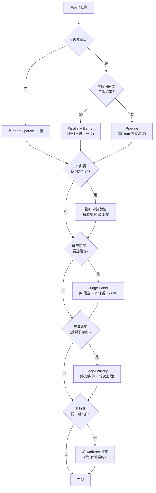

# 附录 F · 模式目录与场景速查

> 这是全书的**一页纸总图**：先按场景查推荐模式，再点进对应章节看真实运行。前面 26 章把每个原语、每条配方都拆开讲透了；本附录把它们重新**收拢成一张能检索的地图**——你手头有个任务，不用从头翻书，先在这里对上「形状」，再顺着链接进正文看那次真实的运行。
>
> 所有模式都对应本书自己的章节，所有「真实运行」格都对应 [附录 E](#/zh/app-e) 里记在 `assets/transcripts/` 的真实 Run ID——**没有一格是凭空编的**。仅作示意、未实跑的代码会显式标注「（示意，未实跑）」。

---

## F.0 怎么用这一页

把它当**查询入口**，三种查法：

1. **我手上有个场景，不知道该用什么形状** → 跳到 [F.3 场景速查表](#f3-场景-模式速查表)，在「场景」列里挑最接近的一行，看「推荐模式」和「真实运行」。
2. **我听过某个模式名，想知道它长什么样、什么时候用、贵不贵** → 看 [F.1 六大经典模式](#f1-六大经典模式目录) 或 [F.2 吸纳四系统的原创模式](#f2-吸纳四系统精华的原创模式)。
3. **我卡在两种形状之间拿不定主意** → 走一遍 [F.4 选型决策树](#f4-选型决策树)，三四个 yes/no 就能落到一个模式。

最后，[F.5 Corner-case 速记](#f5-corner-case-速记) 是四条「不照做会真崩」的红线——临交付前扫一眼。

**模式 vs 配方 vs 原语，三层关系**：原语就是 `agent()`/`parallel()`/`pipeline()` 这些**积木**（[第 8 章](#/zh/p2-08)）；模式是把积木拼起来的**可复用形状**（本附录）；配方是某个模式在某个真实任务上**落地的那一次**（第三、四部各章）。本附录站在中间这层，往下指原语、往上指配方。

---

## F.1 六大经典模式目录

这六个撑起了绝大多数工作流的骨架。它们之间不互斥——真实任务里常常是「Pipeline 套对抗验证」「Parallel 接 Pipeline」这样叠着用（见 F.3）。先认形状，再谈怎么组合。

| 模式 | 一句话形状 | 何时用 | 成本 | 章节 |
|---|---|---|---|---|
| **Pipeline 流水线** | 每个 item 独立走 N 个串行 stage，慢条目不阻塞快条目；多阶段的**默认形状** | 多阶段、且阶段之间无需互相参照 | 墙钟 ≈ 最慢的单条链（非各阶段最慢之和） | [§8](#/zh/p2-08) |
| **Parallel + Barrier 屏障聚合** | 并发跑完**全部**、屏障等齐才进下一步 | 下一步**真的需要全部结果**：去重 / 交叉验证 / 零结果早退 | 屏障让快任务空转等慢任务 | [§8](#/zh/p2-08) |
| **Adversarial Verify 对抗验证** | 每个发现派 N 个独立证伪者，多数证伪即枪毙（默认 REFUTED，≥2/3 投 REAL 才放行） | 发现要**落地为行动**（改码 / 发报告） | 每个发现 ×N 票 | [§17](#/zh/p4-17) |
| **Judge Panel 评委面板** | N 个候选 × M 个评委计票 + 综合，并 graft 亚军的好点子 | 解空间宽（设计 / 命名 / 文案 / 架构） | N×M 个 agent | [§14](#/zh/p3-14) |
| **Loop-until-X 累积循环** | 不预知轮数，按 **数量 / 预算 / 连续空轮（dry-streak）** 之一收敛 | 规模未知的发现（bug / 边界 / 遗漏） | 取决于收敛轮数 | [§18](#/zh/p4-18) |
| **Nested Workflow 嵌套** | 父任务的每个 item 本身是一整个 workflow（父 pipeline，每项一个子 workflow） | 父项内部需要独立的多步子流程；**仅一层** | 与父共享并发 / 预算池 | [§20](#/zh/p4-20) |

### 逐个拆开

**Pipeline 流水线**是「多阶段」的默认答案。它的关键不在「串行」，而在**没有屏障**：item A 走到 stage 2 的时候，item B 还在 stage 1，俩人谁也不等谁。所以墙钟≈最慢的那**一条链**走完的时间，而不是「每个阶段最慢者加起来」。本书的 `pipeline-demo`（3 项×2 阶段）用 `agent_count=6` 把这个结构坐实了（Run `wf_bf086b98-6ec`，[第 8 章](#/zh/p2-08)）。stage 回调的签名是 `(prevResult, originalItem, index)`——想跨阶段拿原始输入就靠它，不要把原始数据塞进上一阶段的返回值里穿线。

**Parallel + Barrier 屏障聚合**正好反过来：它**要等齐**。`parallel(thunks)` 并发跑完一批，**屏障**非得等全部完成才放行。代价就是屏障本身——快任务先跑完，然后就空转着等最慢的那个。所以它只在「下一步真的需要所有结果一起到场」时才值得用：去重前得先攒齐全部、交叉验证前得先攒齐全部、零结果早退前得先确认大家都是空的。本书 `parallel-demo` 3 并发实测 8.4s ≪ 3×5.5s，token≈3×（Run `wf_52957913-6d2`）。

**Adversarial Verify 对抗验证**专治一个朴素却致命的毛病：第一版产出几乎总有盲区，而一个「附和型」的复查根本发现不了。对抗验证给**每个发现**派 N 个**独立**证伪者，立场默认 **REFUTED**（证伪），只有 ≥2/3 投 REAL 才放行。本书 `bug-hunter` 给每个 bug 派 2 个「默认证伪」证伪者，5 个种子 bug 各以 2:0 通过（Run `wf_53da9a06-915`）。它的代价是线性放大：每个发现 ×N 票。但只要发现要「落地为行动」（改码、发报告、上线），这道关就值这个钱。

**Judge Panel 评委面板**用在解空间宽的场景——设计方案、命名、文案、架构选择，没有唯一正确答案，但确实有「明显更好」的。它派 N 个候选，再请 M 个**互不通信**的评委按 rubric 打分计票，最后综合一下、再把亚军里的好点子 **graft**（嫁接）过来。本书 `judge-panel` 3 名评委独立 3:0 收敛（Run `wf_f5b69668-b18`）。成本是 N×M 个 agent，所以候选和评委都别贪多。

**Loop-until-X 累积循环**用在**规模未知**的发现上：你压根不知道这份代码里还藏着几个 bug、这个 schema 还漏了几个边界。它不预设轮数，而是按三种收敛信号里的一种停手——**数量**（攒够 N 个）、**预算**（`budget` 见底）、**连续空轮**（dry-streak，连续 k 轮没冒出新发现）。务必给收敛条件 **+ 轮次上限**上个双保险（[第 18 章](#/zh/p4-18)）。

**Nested Workflow 嵌套**用在父项内部本身就是一整套多步流程的情况——父 `pipeline` 遍历一批 PR，每个 PR 触发一个完整的「review 子工作流」。`workflow()` 会内联跑起另一个工作流，**共享**父的并发上限 / agent 计数 / 中止信号 / token 预算，而且**嵌套仅一层**：子工作流里再调 `workflow()` 会抛错。本书 `nested-parent` 实测子 agent 计入父 `agent_count`（Run `wf_85e22b38-126`，[第 20 章](#/zh/p4-20)）。

---

## F.2 吸纳四系统精华的原创模式

[第 23 章](#/zh/p5-23) 横评了四个先行系统（ccg-workflow / superpowers / OMC / OmO），[第 24 章](#/zh/p5-24) 讲怎么把它们的精华用 `phase`/`schema` 重写。下表把那些精华**蒸馏成五个能直接套用的模式**——它们都生在原生 Workflow 之前，靠「提示词 + Hook + 状态文件」**模拟**确定性编排，而原生 Workflow 恰好补上了它们缺的那根确定性骨架。这五个模式就是「把它们的韧性层移植到原生原语上」的成品。

| 模式 | 源自 | 形状 | 何时用 | 章节 |
|---|---|---|---|---|
| **验证门闭环 Verification-Gate Loop** | superpowers | `pipeline(tasks, specReview, qualityReview)` + 带 pass 字段的门控 schema + 有界 `gatedFix` 循环 | 产出必须过「规范 + 质量」双关 | [§24](#/zh/p5-24) |
| **持久循环 / 完成门 Persistent Loop** | OMC | `while(!accepted)` + 验收 schema + `hitCeiling` 诚实上限 | 必须达标才肯收手 | [§18](#/zh/p4-18) / [§24](#/zh/p5-24) |
| **状态句柄 State Handle** | ccg | `STATE_SCHEMA` 在 pipeline 各 stage 间下传，替代磁盘台账 | 跨阶段携带状态、对抗上下文压缩 | [§24](#/zh/p5-24) |
| **角色隔离护栏 Role-Separated Guardrail** | OmO | planner（schema `additionalProperties:false`，只产出计划对象）+ 独立 executor stage | 让规划者**结构上**无法改码 | [§24](#/zh/p5-24) |
| **语义类别委派 Category→Model** | OmO | `MODEL_BY_CATEGORY[item.category]` → `agent({ model })` | 按任务**语义**而非模型名分派 | [§24](#/zh/p5-24) |

### 提炼说明

**验证门闭环**来自 superpowers 的「两段式评审」——产出先过 spec 合规，再过 code quality，各自循环到通过为止。搬到原生 Workflow 里，它就落成一个 `pipeline`：第一 stage 干活，后两个 stage 分别是 specReview、qualityReview，每个 review 返回**带 `pass` 字段的门控 schema**；没过就进**有界**的 `gatedFix` 循环（带轮次上限）。schema 把「过没过」从一段自由文本变成了可编程的布尔——这正是原系统只能靠提示词约定、而原生 Workflow 能**强制**的那一块。

**持久循环 / 完成门**来自 OMC 的「boulder never stops」——Stop 钩子让「能不能停」变成可编程的。原生重写就是 `while (!accepted)` 配一个验收 schema；但务必加一个 `hitCeiling` 字段当**诚实上限**：哪怕没达标，也要在 N 轮后老实停手、如实报告，而不是没完没了地磨。它和 Loop-until-X 的差别在意图：Loop-until-X 是「找东西找到没得找」，持久循环是「改东西改到达标」。

**状态句柄**来自 ccg 的 `task.json` + 每轮 Hook 注入面包屑——用磁盘状态来对抗上下文压缩。但脚本体**无文件系统**，所以原生的做法是把状态做成一个 `STATE_SCHEMA` 对象，在 pipeline 各 stage 之间**下传**（上一 stage 返回、下一 stage 接住），靠 schema 保证它结构不漂。这就把「磁盘台账」换成了「类型化的内存句柄」。

**角色隔离护栏**来自 OmO 的「工具层 throw」——让规划者**物理上**没法写码。原生没有工具层 throw，但有个更优雅的等价物：planner stage 的 schema 设上 `additionalProperties:false`、只声明计划字段，于是 planner **结构上**只能产出计划对象、别的都产不出来；改码这活交给一个完全独立的 executor stage。约束就从「提示词的请求」变成了「schema 的强制」。

**语义类别委派**来自 OmO 的 Category 机制——按任务的**语义意图**（而不是模型名）来路由。原生做法是建一张 `MODEL_BY_CATEGORY` 表，按 `item.category` 查出模型，再 `agent(prompt, { model })`。好处是调用点只用关心「这是什么任务」，模型选择集中在一处、想改就一处改，简单任务自然落到 `haiku`。

这五个模式的完整可运行重写在 [第 24 章 · 精华提取术](#/zh/p5-24)，把它们攒成你自己的库见 [第 25 章](#/zh/p5-25)。本附录只给「形状速记」。

---

## F.3 场景 → 模式速查表

这是本附录的**核心**：左边是你可能撞上的真实场景，右边给推荐模式、关键设计要点，外加——只要本书真跑过——那次运行的 Run ID 和章节。**每个带 Run ID 的格子都能在 `assets/transcripts/` 里逐字复核**。

| 场景 | 推荐模式 | 关键设计 | 真实运行 / 章节 |
|---|---|---|---|
| 分片多维代码审查 | Pipeline + 对抗验证 | 每个维度独立成 stage → 每个发现多票证伪 | [§10](#/zh/p3-10) / [§17](#/zh/p4-17) |
| PR 多维 Review | Pipeline | dogfood 审本书前端，**26→16 问题** | `wf_4c5caabb-b73` · [§11](#/zh/p3-11) |
| 生成-批评-修复（GCF） | 有界 Loop + 对抗 | 对抗式 Critique 从 `slugify` **揪出 10 缺陷** | `wf_7472ceac-daa` · [§12](#/zh/p3-12) |
| 跨多源深度研究 | Parallel + Barrier（+Pipeline） | **必须屏障**才能先去重再写 | `wf_6090decc-8a5` · [§13](#/zh/p3-13) |
| 设计 / 方案探索 | Judge Panel | 4 角度 × 评委 + graft；**3:0** 收敛 | `wf_f5b69668-b18` · [§14](#/zh/p3-14) |
| Bug / 漏洞扫描 | Loop-until-dry + 对抗 | finder 自呼吸 → verifier 把关；**5/5** 确认 | `wf_53da9a06-915` · [§15](#/zh/p3-15) |
| 文档 / 迁移大扫除 | Pipeline | 只读分析 vs 真实改写**分两 stage** | [§16](#/zh/p3-16) |
| 跨 N 文件大重构 | Pipeline + Worktree 隔离 | plan→impl→test 每文件独立，worktree 防踩踏（实测 **distinctRoots=3**） | `wf_3b0677d8-40f` · [§19](#/zh/p4-19) |
| 跨模型对比 | Parallel + Barrier | 同 prompt → N 个模型 → 单评委 | [§14](#/zh/p3-14) / [§23](#/zh/p5-23) |
| 错误韧性处理 | 语义认知（非模式） | parallel 里**同步 throw 会崩 workflow**；风险逻辑放进 `agent()` 内；用 `.filter(Boolean)` | `wf_ed5e87f3-435` · [§8.8](#/zh/p2-08) |
| 预算规模化 | Loop-until-budget | guard on `budget.total`，否则 `remaining()=Infinity` 跑满 1000；FLEET 按预算缩放 | `wf_fd09a6ed-38a` · [§9](#/zh/p2-09) / [§21](#/zh/p4-21) |
| 嵌套 PR 批处理 | Nested：`pipeline(prs, pr => workflow(...))` | 父 pipeline，每个 PR 一个子 workflow | [§20](#/zh/p4-20) |

### 几行重点解读

**为什么深度研究必须用屏障，分片审查却用 pipeline**——这是初学最容易混的一对。深度研究的「综合」步骤得**看齐全部检索结果**才能去重、交叉，少一份就可能漏；所以 Research 阶段用 `parallel` 屏障等齐，再进 Synthesize（Run `wf_6090decc-8a5`，[第 13 章](#/zh/p3-13)）。分片审查刚好相反：a11y 维度审完不用等 perf 维度，各维度的发现各走各的去做对抗验证就行，所以用没屏障的 pipeline 更快。**判据就一句话：下一步要不要看齐全部？**

**为什么 GCF 用「有界 Loop」而不是单次对抗**——`slugify` 那次，对抗式 Critique 一轮就揪出 10 个缺陷（Run `wf_7472ceac-daa`），可修完还得再验、说不定又引入新问题，所以外头套一个**有界**循环（带轮次上限），让「批评→修复」一直迭代到干净。这就是 F.2「持久循环」的轻量版。

**「错误韧性处理」为什么被标成「非模式」**——它不是一种编排形状，而是一条你必须内化的**语义认知**：`parallel()` 的 thunk 函数体里**同步 throw 会让整个 workflow 崩溃**（实测 `wf_ed5e87f3-435`，status=failed，0 token、26ms 秒退）；只有异步 reject / agent 内部出错，才会被归集成该位置的 `null`。所以把有风险的逻辑塞进被 `await` 的 `agent()` 里，用之前永远先 `.filter(Boolean)`。详见 [第 8.8 节](#/zh/p2-08)。

**预算规模化的那个坑**——loop-until-budget 必须 `guard on budget.total`。实测 `wf_fd09a6ed-38a`：没设 `+Nk` 目标时 `budget.total===null`、`remaining()===Infinity`，于是 `while(budget.total && ...)` 这个 guard **执行了 0 轮**；可要是写成 `while(budget.remaining() > N)`（漏掉了 `budget.total &&`），它会一路跑到 1000 agent 兜底上限才停。FLEET（动态队伍规模）也按同一个 `budget` 缩放（[第 21 章](#/zh/p4-21)）。

---

## F.4 选型决策树

拿不准用什么形状？从顶上往下走，三四个 yes/no 就能落到一个模式。叠加项（对抗验证、worktree）是往主形状上**加挂**的，不是拿来替换的。

读法：**主干**（是否多阶段 → 阶段间要不要全部结果）先把 Pipeline 还是 Parallel+Barrier 这个**底座**定下来；后面那四个判断（落地行动？解空间宽？规模未知？改同一组文件？）都是**能叠加的开关**——满足就加挂对应模式，不满足就跳过。一个真实任务可能同时点亮「Pipeline + 对抗验证 + worktree」三盏灯（正是 F.3「跨 N 文件大重构」那一行）。

---

## F.5 Corner-case 速记

四条「不照做就真崩 / 真浪费」的红线，全都有实测背书。临交付前扫一眼。

**① `parallel()` 里 thunk 体内同步 throw 会让整个 workflow 崩溃。** 实测 `wf_ed5e87f3-435`（status=failed），0 token、26ms 秒退——同步 throw 不会被 `parallel()` 吞掉，而是直接往上抛、把整个工作流弄失败。只有**异步 reject / `agent()` 内部出错**才会变成该位置的 `null`。所以把有风险的逻辑塞进被 `await` 的 `agent()` 里，用之前永远先 `.filter(Boolean)`（[第 8.8 节](#/zh/p2-08)）。

**② budget 循环不 guard `budget.total`，会一路跑到 1000 agent 兜底。** 实测 `wf_fd09a6ed-38a`：没设目标时 `budget.total===null`、`remaining()===Infinity`，`while(budget.total && ...)` 这个 guard 执行 **0 轮**；漏写 `budget.total &&` 就会跑满 1000 agent 上限才停（[第 21 章](#/zh/p4-21)）。

**③ `meta` 必须纯字面量；脚本禁用 `Date.now()` / `Math.random()` / 无参 `new Date()`。** 前者会破坏运行前的静态读取（工作流根本不启动），后者会破坏可重放性、让续传失效。时间戳用 `args` 传进来或事后盖戳，随机性靠 agent 下标去变化提示词（[附录 C · C.7](#/zh/app-c)）。

**④ worktree 很贵（约 200–500ms 启动 + 磁盘 / agent 开销），仅当并行改文件会冲突时才用。** 只读分析、纯评审、各写各的、不相交的文件，都**用不着**它。实测 `wf_3b0677d8-40f` 拿到 `distinctRoots=3`、`fullyIsolated:true`——确实是物理隔离，但代价不低，且只有在没改动时才会自动清理（[第 19 章](#/zh/p4-19)）。

---

> 这一页是地图，正文是实地。每个模式、每个数字都能顺着链接回到它的来源章节、回到 `assets/transcripts/` 里的真实记录——要是你本机实测跟书里对不上，**以你的实测为准**。

> 继续阅读：回到 [前言：经纬之间](#/zh/00-preface) 重读全书脉络，或者挑一个 F.3 里最贴近你任务的场景，直接进正文。

> 📌 中文 README 主版本已移至根目录 [README.md](../../README.md)。

---

[← 返回主 README](../../README.md)
