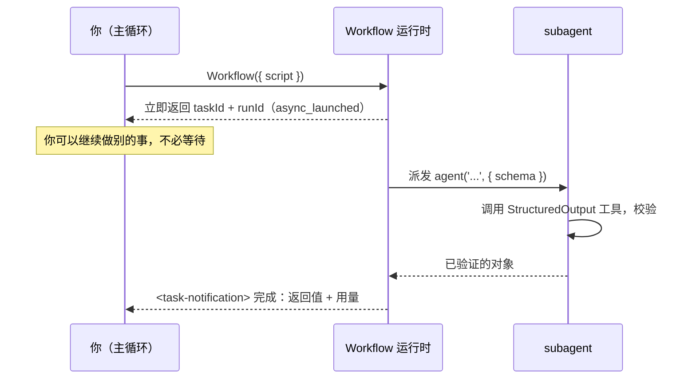

# 第 01 章 · Workflow 是什么

> 一句话：**Workflow 是 Claude Code 内置的一个工具，让你用一段纯 JavaScript 脚本，确定性地编排任意多个 subagent。**
>
> 这一章不急着写复杂脚本。先把三件事讲透：它到底是个什么东西、运行时发生了什么、为什么值得专门花时间学——这是后面所有配方的地基。

---

## 1.1 从一次真实运行说起

想搞懂一个东西，最快的办法是看它**真的跑起来**是什么样。下面这段脚本，是本书第一个在真实 Claude Code 会话里跑过的 Workflow：

```javascript
export const meta = {
  name: 'hello-workflow',
  description: 'Smoke test: one subagent returns schema-constrained structured output',
  phases: [{ title: 'Greet', detail: 'One subagent confirms the runtime' }],
}

phase('Greet')
const r = await agent(
  'You are a smoke test for the Claude Code Workflow runtime. Return a one-sentence ' +
  'confirmation message, the integer value of 2+2, and a boolean confirming you ran ' +
  'as a workflow subagent.',
  {
    label: 'smoke',
    schema: {
      type: 'object',
      properties: {
        message: { type: 'string' },
        sum: { type: 'number' },
        runtimeConfirmed: { type: 'boolean' },
      },
      required: ['message', 'sum', 'runtimeConfirmed'],
    },
  }
)
log(`smoke result: ${JSON.stringify(r)}`)
return r
```

把它交给 Workflow 工具执行，**真实**得到的返回值是：

```json
{
  "message": "The Claude Code Workflow runtime smoke test executed successfully as a workflow subagent.",
  "sum": 4,
  "runtimeConfirmed": true
}
```

运行时还附带了一份真实用量数据：

```text
agent_count = 1   tool_uses = 1   total_tokens = 26338   duration_ms = 5506
```

> 来源：本次运行的原始记录见仓库 `assets/transcripts/primitives.md`（Run ID `wf_dacbd480-d5d`）。本书所有「真实运行」均可这样溯源。

就这二十几行，几乎把 Workflow 的关键点都碰到了。下面一个一个拆开看。

---

## 1.2 一段脚本的解剖：经线与纬线

回到「织经」的隐喻。一个 Workflow 脚本由两部分构成：

### 经线（Warp）：`meta` 与 `phase` —— 张紧的结构

脚本**必须**以 `export const meta = {…}` 开头，而且它**必须是纯字面量**——里面不能有变量、函数调用、展开运算符或模板插值。这是硬性规定，写错了运行时直接拒绝。

```javascript
export const meta = {
  name: 'hello-workflow',                       // 必填：工作流标识
  description: 'Smoke test: ...',               // 必填：一行描述，会显示在权限弹窗里
  phases: [{ title: 'Greet', detail: '...' }],  // 可选：阶段声明，驱动进度显示
}
```

为什么 `meta` 必须是纯字面量？因为运行时要在**真正执行脚本之前**先把它读出来，好在权限弹窗里告诉你「这个工作流叫什么、要干什么、分几个阶段」。这一步只是静态解析、不会真的运行代码——要是 `meta` 里塞了 `Date.now()` 或某个变量，这时候根本算不出值。

`meta` 的字段（据官方类型定义与工具说明）：

| 字段 | 必填 | 作用 |
|---|---|---|
| `name` | 是 | 工作流名称 |
| `description` | 是 | 一行描述，显示在权限确认对话框 |
| `whenToUse` | 否 | 适用场景说明，显示在工作流列表中 |
| `phases` | 否 | 阶段数组，每项 `{ title, detail?, model? }`，驱动进度树分组 |

`phase('Greet')` 的作用是在脚本体里**切换当前阶段**——它后面的所有 `agent()` 调用，进度显示里都会归到「Greet」这一组。经线先把结构定好，纬线才知道往哪儿穿。

### 纬线（Weft）：`agent()` 等钩子 —— 穿梭的执行

脚本体跑在一个 `async` 上下文里，所以你可以直接 `await`。运行时给脚本塞进了一组**全局函数**，拿来就用，不用 import：

| 钩子 | 作用 |
|---|---|
| `agent(prompt, opts?)` | 派发一个 subagent，返回它的产物 |
| `parallel(thunks)` | 并发执行一组任务，**屏障**：等全部完成 |
| `pipeline(items, ...stages)` | 让每个 item 独立流过多个阶段，**无屏障** |
| `phase(title)` | 切换当前阶段 |
| `log(message)` | 向用户输出一条进度信息 |
| `workflow(name, args?)` | 内联调用另一个工作流（子流程） |
| `args` | 调用方传入的参数对象 |
| `budget` | 本回合的 token 预算对象 |

`hello-workflow` 只用了最基本的 `agent()`：派发一个 subagent，等它返回，得到结果。

<div class="callout warn">

**脚本里不能用 `Date.now()`、`Math.random()`、无参 `new Date()`**——一用就报错。为什么？1.6 节「续传」会细讲：这三个家伙每次结果都不一样，会打破「同样的脚本必然跑出同样的结果」这个前提，断点续传就废了。要时间戳？用 `args` 传进来。要随机性？拿 agent 的下标（index）去改提示词。

</div>

---

## 1.3 `agent()`：一个 subagent 的诞生

`hello-workflow` 的核心是这一句：

```javascript
const r = await agent(prompt, { label: 'smoke', schema: {...} })
```

它就做一件事：**派发一个 subagent 去跑 `prompt`，再把它的产物当成返回值。**

这里藏着两个关键设计，正是它和「自己手动开子任务」最不一样的地方：

**一是，这个 subagent 被明确告知「你的最终输出就是返回值」。** 普通子任务返回的是一段写给人看的话；Workflow 的 subagent 知道自己的产物是要喂给**程序**的，所以它直接返回**原始数据**，不跟你客套。

**二是，`schema` 能把「原始数据」变成「结构化数据」。** 你传一个 `schema`（也就是 JSON Schema）进去，运行时就会逼这个 subagent 去调一个内部的 `StructuredOutput` 工具，并**在工具调用这一层**检查返回值合不合 schema。不合？让模型**重试**，直到合规为止。所以 `agent()` 带上 schema 时，拿回来的是一个**已经验证过的对象**——你一行解析、一行容错代码都不用写。

回头看真实输出：我们要的 `sum`（2+2），拿到的是数字 `4`，**而不是字符串 `"4"`**——因为 schema 写了 `sum: { type: 'number' }`，校验层把类型给卡住了。结构化输出的好用之处就在这儿，第 07 章会专门展开。

> **不带 schema 会怎样？** 据工具定义，不传 `schema` 时 `agent()` 返回 subagent 的最终文本（一个字符串）。带 schema 才返回校验过的对象。

`agent()` 的常用选项（完整清单见第 06 章与附录 A）：

```javascript
await agent(prompt, {
  label: 'smoke',          // 进度显示里的标签，默认自动编号
  schema: {...},           // JSON Schema：强制结构化输出
  phase: 'Greet',          // 显式归入某阶段（在 pipeline/parallel 内部尤其重要）
  model: 'haiku',          // 覆盖该 agent 的模型；省略则继承主循环模型
  isolation: 'worktree',   // 在独立 git worktree 中运行（并行改文件时用）
  agentType: 'Explore',    // 使用自定义 subagent 类型而非默认
})
```

---

## 1.4 运行时发生了什么：异步、taskId、后台

这是最容易被误解的一点：**Workflow 工具不会「跑完才返回」，而是立刻返回。**

据官方类型定义 `sdk-tools.d.ts`，`WorkflowOutput` 的 `status` 只有两个值：`"async_launched"` 和 `"remote_launched"`。说白了，**你一调用 Workflow 工具，它就在后台跑起来了，同时立刻甩给你一个句柄**：

```text
Workflow launched in background. Task ID: wi7ye81mb
Run ID: wf_dacbd480-d5d
Script file: .../workflows/scripts/hello-workflow-wf_dacbd480-d5d.js
You will be notified when it completes. Use /workflows to watch live progress.
```

这里头有几条**真实**信息值得记住：

- **`Task ID`**：这次后台任务的 ID。
- **`Run ID`**（形如 `wf_...`）：这次运行的标识，断点续传时要用（见 1.6 节）。
- **脚本落盘路径**：每次调用，运行时都会把你的脚本**存成磁盘上的一个文件**。想改了再试？直接 `Write`/`Edit` 那个文件，再带上 `{ scriptPath: ... }` 重新调用就行，不用把整段脚本再发一遍。
- **`/workflows`**：一个斜杠命令，实时盯着进度树看。

工作流真跑完了，你会收到一条**完成通知**（`<task-notification>`），里面带着最终返回值和用量统计。`hello-workflow` 的完成通知，就是 1.1 节那段 JSON 再加上 `agent_count=1 … duration_ms=5506`。



<div class="callout tip">

**「异步 + 后台」这个设计有什么用？** 你可以一口气启动好几个工作流，让它们一起并行跑，自己手头接着干别的，谁跑完了谁通知你。本书后面会大量用到这一招。但有一点别忘了：正因为是异步的，**Workflow 工具的返回值并不是工作流的结果**，只是一张「我已经启动了」的回执——真正的结果在完成通知里。

</div>

---

## 1.5 怎样触发一个 Workflow

有两条路径：

1. **关键词 `ultrawork`。** 你的消息里只要带上 `ultrawork`，Claude Code 就会收到一条系统提示，告诉它「用户已经选了多 Agent 编排」，于是它被允许调用 Workflow 工具。社区给这个特性起的外号「ultrawork」也是这么来的。
2. **直接调用 Workflow 工具。** 比如你明确说「跑一个工作流 / 用多 agent 编排 / 把 agent 扇出去」，或者你用了某个内部会触发它的技能、斜杠命令，又或者你点名要跑某个具名工作流。

不管走哪条路，都得先过两道前提：功能被**显式打开**，而且 Claude Code 版本**够新**。先说最常被忘的那道——开关。

### 功能标志：`CLAUDE_CODE_WORKFLOWS`

Workflow 是个**默认关闭、需要手动打开**的实验性功能，由环境变量 `CLAUDE_CODE_WORKFLOWS` 控制。写这本书的会话环境里，这个变量**确实存在，而且值是 `1`**（实测确认）：

```text
CLAUDE_CODE_WORKFLOWS = 1
```

开启方式通常有两种：

```bash
# 方式一：启动时设置（当前会话生效）
CLAUDE_CODE_WORKFLOWS=1 claude

# 方式二：写入 ~/.claude/settings.json 的 env 段（持久生效）
{
  "env": { "CLAUDE_CODE_WORKFLOWS": "1" }
}
```

<div class="callout warn">

**为什么默认不开？** 因为一个 Workflow 可能一下扇出几十个 subagent、烧掉一大把 token。拿一个开关把它挡在后面，相当于提醒你「你得清楚自己在干嘛」。工具定义里也反复强调这条纪律：**只有用户明确选了多 Agent 编排，才去调用 Workflow**——别光凭「这任务好像并行一下会更快」就擅自启动。

</div>

### 版本前提：Claude Code 得够新

Workflow 是较晚才加进 Claude Code 的工具，老版本里根本没有。本书的实测环境是 **v2.1.150**，工具完整可用。据社区和用户反馈，大约 **2.1.148** 前后开始提供——但**确切的起始版本本书没有独立核实**，当个大致下限就行。查你当前的版本：

```bash
claude --version
```

### 一眼确认「到底能不能用」：一个 0 token 的探针

版本号只是参考，**真正的判据是这工具到底调不调得起来**。与其盯着版本号，不如直接跑一个最小工作流探一下——它不派任何 agent、不烧 token，能正常返回就说明你的运行时齐活了：

```javascript
export const meta = {
  name: 'check-runtime',
  description: 'Verify the Workflow runtime is available (0 agents, 0 tokens)',
  phases: [{ title: 'Check' }],
}

phase('Check')
log('Workflow runtime is live — 0 agents, 0 tokens')

// 0 个 agent、0 token：只读一下运行时状态就返回
return {
  ok: true,
  budgetTotal: budget.total,                    // 没加 +Nk 预算指令时 = null
  budgetTotalIsNull: budget.total === null,     // 印证它是「真 null」而非 falsy
  remaining: String(budget.remaining()),        // 对应 = "Infinity"
  argsIsUndefined: typeof args === 'undefined', // 没传 args 时 = true
}
```

本书实测（`wf_580909ca-b32`）：返回 `{ ok: true, budgetTotal: null, budgetTotalIsNull: true, remaining: "Infinity", argsIsUndefined: true }`，**0 agent / 0 token / 4ms**（上面代码块里的注释是为讲解额外加的，去掉注释就是本书实跑的脚本原文）。要是这工具压根没出现在你的环境里（版本太老，或没开 `CLAUDE_CODE_WORKFLOWS`），你根本发不出这一步——那就回头检查上面两道前提。

---

## 1.6 三个让它「与众不同」的运行时特性

除了「确定性 + 结构化」，Workflow 还有三个工程上特别要紧的特性。正是它们，让它真正做到了可复用、可测试、可分享。

### 并发上限：自动节流，不用你操心

并发的 `agent()` 调用，每个工作流内最多 **`min(16, CPU 核心数 − 2)`** 个同时跑；多出来的先排队，有空位了再上。所以你**尽管**给 `parallel()` / `pipeline()` 喂 100 个 item，它们最后全都会跑完——只不过任意时刻台面上大概就 10 个在跑。另外还有个全局保险：一个工作流从头到尾，agent 总数最多 **1000** 个，免得哪个失控的循环把机器跑爆。

### 断点续传：同样的脚本，秒级缓存命中

还记得 1.2 节那条「不准用 `Date.now()`」吗？原因现在揭晓。Workflow 支持**断点续传**：用 `{ scriptPath, resumeFromRunId }` 重新调用，**没改过的 `agent()` 调用会直接吐出缓存结果**（秒级返回），只有被你改过的、以及排在它后面的调用，才会重新真跑一遍。

> 「同样的脚本 + 同样的 args → 100% 缓存命中。」——这就要求脚本每次跑的过程都能**原样重放**。`Date.now()` / `Math.random()` 每次结果都不一样，重放就对不上了，所以干脆禁掉。要时间戳？等工作流跑完了在外面补盖一个，或者用 `args` 传进去。

这个特性在「反复打磨一条长流水线」时太顶用了：你只改了第 8 步，前 7 步那些跑起来又慢又贵的结果原样拿来用，不用从头再来一遍。第 22 章细讲。

### 脚本即文件：可迭代、可保存、可分享

每次调用，脚本都会被存进会话目录下的一个 `.js` 文件。这带来两个好处：一是**好改**（改文件 + `scriptPath` 重跑）；二是**能攒起来**——你可以把验证过的工作流脚本收进 `.claude/workflows/`，往后用 `{ name: 'my-workflow' }` 像喊一个具名命令那样直接复用。本书第五部「构建你自己的库」靠的就是这一点。

---

## 1.7 它不是什么：先划清边界

刚上手的人，最容易把 Workflow 跟 Claude Code 别的扩展机制搞混。这里先快速划一下界，第 03 章会用一张完整的「定位矩阵」详细对比。

| 它**不是** | 区别 |
|---|---|
| MCP | MCP 是连接**外部工具/数据源**的协议；Workflow 是**编排内部 subagent**的引擎。 |
| Skills | Skills 是按需注入的**提示词知识包**（改变 Agent「怎么想」）；Workflow 是**确定性控制流**（决定 Agent「按什么顺序做」）。 |
| Subagents | 单个 `agent()` 确实派发一个 subagent；但 Workflow 的价值在于用**代码**把许多 subagent **编排**起来——循环、并发、流水线、验证。 |
| Agent Teams | Agent Teams（`CLAUDE_CODE_EXPERIMENTAL_AGENT_TEAMS`）是**有状态、可互相通信**的长期协作团队；Workflow 是**无状态、确定性、一次性**的流水线脚本。两者解决不同问题。 |

一句话划清边界：**任务要是能画成一张「先干什么、再干什么、哪几步并行」的流程图，就用 Workflow；任务要是开放式聊天、得见招拆招，那 Workflow 就不合适。**

---

## 1.8 本章小结

- Workflow 是 Claude Code 内置工具，用**纯 JavaScript 脚本**确定性编排 subagent，由 `CLAUDE_CODE_WORKFLOWS=1` 门控，可用 `ultrawork` 关键词或直接调用触发。
- 脚本 = **经线**（`meta` 纯字面量 + `phase`）+ **纬线**（`agent` / `parallel` / `pipeline` / `log` / `workflow`）。
- `agent(prompt, { schema })` 派发 subagent 并返回**已验证的结构化对象**；schema 不匹配会自动重试。
- Workflow 工具**异步**：立即返回 `taskId` / `runId`，结果在完成通知里；用 `/workflows` 看实时进度。
- 三大工程特性：**并发自动节流**（≤16/工作流，总量 ≤1000）、**断点续传**（故禁用 `Date.now`/`Math.random`）、**脚本即文件**（可迭代、可沉淀为具名工作流）。

下一章换个角度：先不聊 API，聊聊**为什么**——Workflow 还没出现的时候，大家是怎么手动编排多 Agent 的、又踩过哪些坑，搞明白「确定性编排」到底解决了什么真问题。

> 继续阅读：[第 02 章 · 为什么需要确定性编排](#/zh/p1-02)
