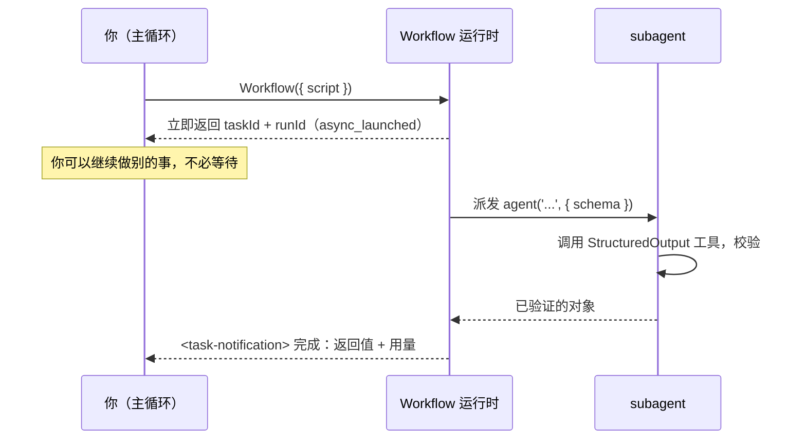

# 第 01 章 · Workflow 是什么

> 一句话：**Workflow 是 Claude Code 内置的一个工具，让你用一段纯 JavaScript 脚本，确定性地编排任意多个 subagent。**
>
> 这一章我们不急着写复杂脚本。先把「它到底是个什么东西、运行时发生了什么、为什么值得专门学」彻底讲清楚——这是后面所有配方的地基。

---

## 1.1 从一次真实运行说起

理解一个系统，最快的方式是看它**真的跑起来**是什么样。下面这段脚本，是本书第一个在真实 Claude Code 会话里执行的 Workflow：

```javascript
export const meta = {
  name: 'hello-workflow',
  description: 'Smoke test: one subagent returns schema-constrained structured output',
  phases: [{ title: 'Greet', detail: 'One subagent confirms the runtime' }],
}

phase('Greet')
const r = await agent(
  'You are a smoke test for the Claude Code Workflow runtime. Return a one-sentence ' +
  'confirmation message, the integer value of 2+2, and a boolean confirming you ran ' +
  'as a workflow subagent.',
  {
    label: 'smoke',
    schema: {
      type: 'object',
      properties: {
        message: { type: 'string' },
        sum: { type: 'number' },
        runtimeConfirmed: { type: 'boolean' },
      },
      required: ['message', 'sum', 'runtimeConfirmed'],
    },
  }
)
log(`smoke result: ${JSON.stringify(r)}`)
return r
```

把它交给 Workflow 工具执行，**真实**得到的返回值是：

```json
{
  "message": "The Claude Code Workflow runtime smoke test executed successfully as a workflow subagent.",
  "sum": 4,
  "runtimeConfirmed": true
}
```

运行时还附带了一份真实用量数据：

```text
agent_count = 1   tool_uses = 1   total_tokens = 26338   duration_ms = 5506
```

> 来源：本次运行的原始记录见仓库 `assets/transcripts/primitives.md`（Run ID `wf_dacbd480-d5d`）。本书所有「真实运行」均可这样溯源。

短短二十几行，已经触及了 Workflow 的全部要害，我们逐一拆解。

---

## 1.2 一段脚本的解剖：经线与纬线

回到「织经」的隐喻。一个 Workflow 脚本由两部分构成：

### 经线（Warp）：`meta` 与 `phase` —— 张紧的结构

脚本**必须**以 `export const meta = {…}` 开头，而且它**必须是纯字面量**——不能有变量、函数调用、展开运算符或模板插值。这是一条硬性约束，写错会被运行时拒绝。

```javascript
export const meta = {
  name: 'hello-workflow',                       // 必填：工作流标识
  description: 'Smoke test: ...',               // 必填：一行描述，会显示在权限弹窗里
  phases: [{ title: 'Greet', detail: '...' }],  // 可选：阶段声明，驱动进度显示
}
```

为什么 `meta` 必须是纯字面量？因为运行时需要在**真正执行脚本之前**，先静态读取它——用来在权限弹窗里告诉你「这个工作流叫什么、要干什么、分几个阶段」。如果 `meta` 里塞了 `Date.now()` 或某个变量，运行时在静态解析阶段根本无法求值。

`meta` 的字段（据官方类型定义与工具说明）：

| 字段 | 必填 | 作用 |
|---|---|---|
| `name` | 是 | 工作流名称 |
| `description` | 是 | 一行描述，显示在权限确认对话框 |
| `whenToUse` | 否 | 适用场景说明，显示在工作流列表中 |
| `phases` | 否 | 阶段数组，每项 `{ title, detail?, model? }`，驱动进度树分组 |

`phase('Greet')` 则是在脚本体里**切换当前阶段**——它之后的所有 `agent()` 调用，都会在进度显示里归到「Greet」这一组。经线张好了，纬线才知道往哪儿穿。

### 纬线（Weft）：`agent()` 等钩子 —— 穿梭的执行

脚本体运行在一个 `async` 上下文里，你可以直接 `await`。运行时向脚本注入了一组**全局函数**（你不需要 import）：

| 钩子 | 作用 |
|---|---|
| `agent(prompt, opts?)` | 派发一个 subagent，返回它的产物 |
| `parallel(thunks)` | 并发执行一组任务，**屏障**：等全部完成 |
| `pipeline(items, ...stages)` | 让每个 item 独立流过多个阶段，**无屏障** |
| `phase(title)` | 切换当前阶段 |
| `log(message)` | 向用户输出一条进度信息 |
| `workflow(name, args?)` | 内联调用另一个工作流（子流程） |
| `args` | 调用方传入的参数对象 |
| `budget` | 本回合的 token 预算对象 |

`hello-workflow` 只用了最基本的 `agent()`：派发一个 subagent，等它返回，得到结果。

<div class="callout warn">

**脚本里不能用 `Date.now()`、`Math.random()`、无参 `new Date()`**——它们会抛错。原因在 1.6 节「续传」里揭晓：这三者会破坏「同样的脚本必然产生同样的执行」这一前提，从而让断点续传失效。需要时间戳就用 `args` 传入，需要随机性就用 agent 的下标（index）去变化提示词。

</div>

---

## 1.3 `agent()`：一个 subagent 的诞生

`hello-workflow` 的核心是这一句：

```javascript
const r = await agent(prompt, { label: 'smoke', schema: {...} })
```

它做了一件事：**派发一个 subagent 去执行 `prompt`，并把它的产物作为返回值。**

这里有两个关键设计，决定了 Workflow 与「手动开子任务」的本质区别：

**其一：subagent 被告知「你的最终输出就是返回值」。** 普通子任务会返回一段写给人看的话；而 Workflow 的 subagent 知道自己的产物是要被**程序消费**的，因此它返回的是**原始数据**，不是寒暄。

**其二：`schema` 把「原始数据」变成「结构化数据」。** 当你传入 `schema`（一个 JSON Schema），运行时会强制这个 subagent 调用一个内部的 `StructuredOutput` 工具，并**在工具调用层校验**返回值是否匹配 schema。不匹配？模型被要求**重试**，直到合规。所以 `agent()` 带 schema 时，返回的是一个**已验证的对象**——你不需要写任何解析或容错代码。

看回真实输出：我们要求返回 `sum`（2+2），得到的是数字 `4`，**不是字符串 `"4"`**——因为 schema 声明了 `sum: { type: 'number' }`，校验层确保了类型。这就是「结构化输出」的威力，第 07 章会专门深入。

> **不带 schema 会怎样？** 据工具定义，不传 `schema` 时 `agent()` 返回 subagent 的最终文本（一个字符串）。带 schema 才返回校验过的对象。

`agent()` 的常用选项（完整清单见第 06 章与附录 A）：

```javascript
await agent(prompt, {
  label: 'smoke',          // 进度显示里的标签，默认自动编号
  schema: {...},           // JSON Schema：强制结构化输出
  phase: 'Greet',          // 显式归入某阶段（在 pipeline/parallel 内部尤其重要）
  model: 'haiku',          // 覆盖该 agent 的模型；省略则继承主循环模型
  isolation: 'worktree',   // 在独立 git worktree 中运行（并行改文件时用）
  agentType: 'Explore',    // 使用自定义 subagent 类型而非默认
})
```

---

## 1.4 运行时发生了什么：异步、taskId、后台

这是最容易被误解的一点：**Workflow 工具不会「跑完才返回」，而是立刻返回。**

据官方类型定义 `sdk-tools.d.ts`，`WorkflowOutput` 的 `status` 只有两种取值：`"async_launched"` 或 `"remote_launched"`。换句话说，**调用 Workflow 工具的瞬间，它就在后台启动了，并立即把一个句柄交还给你**：

```text
Workflow launched in background. Task ID: wi7ye81mb
Run ID: wf_dacbd480-d5d
Script file: .../workflows/scripts/hello-workflow-wf_dacbd480-d5d.js
You will be notified when it completes. Use /workflows to watch live progress.
```

这里有几条**真实**信息值得记住：

- **`Task ID`**：本次后台任务的 ID。
- **`Run ID`**（形如 `wf_...`）：本次运行的标识，断点续传时要用（见 1.6 节）。
- **脚本落盘路径**：每次调用，运行时都会把你的脚本**写到磁盘上**。想迭代？直接 `Write`/`Edit` 那个文件，再用 `{ scriptPath: ... }` 重新调用，无需重发整段脚本。
- **`/workflows`**：一个斜杠命令，实时观察进度树。

当工作流真正跑完，你会收到一条**完成通知**（`<task-notification>`），里面带着最终返回值和用量统计。`hello-workflow` 的完成通知就是 1.1 节里那段 JSON 加上 `agent_count=1 … duration_ms=5506`。



<div class="callout tip">

**这个「异步 + 后台」的设计意味着什么？** 你可以一口气启动多个工作流让它们并行跑，自己继续别的工作，完成时各自通知你。本书后续大量利用这一点。但也要记住：因为是异步的，**Workflow 工具的返回值不是工作流的结果**，而是一个「已启动」的回执——真正的结果在完成通知里。

</div>

---

## 1.5 怎样触发一个 Workflow

有两条路径：

1. **关键词 `ultrawork`。** 当你的消息里包含 `ultrawork`，Claude Code 会收到一条系统提示，明确「用户已选择多 Agent 编排」，从而被授权调用 Workflow 工具。这也是社区把这个特性昵称为「ultrawork」的由来。
2. **直接调用 Workflow 工具。** 当用户明确要求「跑一个工作流 / 用多 agent 编排 / 扇出 agent」，或调用了某个内部会触发它的技能/斜杠命令，或要求运行某个具名工作流时。

无论哪条路径，前提都是这个功能被**显式开启**。

### 功能标志：`CLAUDE_CODE_WORKFLOWS`

Workflow 是一个**需要显式启用**的实验性功能，由环境变量 `CLAUDE_CODE_WORKFLOWS` 门控。本书写作的会话环境中，该变量**确实存在且为 `1`**（实测确认）：

```text
CLAUDE_CODE_WORKFLOWS = 1
```

开启方式通常有两种：

```bash
# 方式一：启动时设置（当前会话生效）
CLAUDE_CODE_WORKFLOWS=1 claude

# 方式二：写入 ~/.claude/settings.json 的 env 段（持久生效）
{
  "env": { "CLAUDE_CODE_WORKFLOWS": "1" }
}
```

<div class="callout warn">

**为什么默认不开？** 因为一个 Workflow 可能扇出几十个 subagent、消耗大量 token。把它放在标志后面，是一种「你得明确知道自己在干什么」的保护。这也是工具定义里反复强调的纪律：**只有当用户明确选择了多 Agent 编排时，才调用 Workflow**——不要因为「这个任务似乎能从并行受益」就擅自启动。

</div>

---

## 1.6 三个让它「与众不同」的运行时特性

除了「确定性 + 结构化」，Workflow 还有三个工程上极重要的特性，构成了它「可复用、可测试、可分享」的底气。

### 并发上限：自动节流，但你不必操心

并发的 `agent()` 调用，每个工作流内被限制在 **`min(16, CPU 核心数 − 2)`** 个同时运行；超出的调用会排队，有空位再跑。所以你**可以**给 `parallel()` / `pipeline()` 传 100 个 item，它们全都会完成——只是任意时刻只有约 10 个在跑。此外还有一个全局兜底：单个工作流生命周期内 agent 总数上限为 **1000**，防止失控的循环。

### 断点续传：同样的脚本，秒级缓存命中

还记得 1.2 节那条「不准用 `Date.now()`」的禁令吗？现在揭晓原因。Workflow 支持**断点续传**：用 `{ scriptPath, resumeFromRunId }` 重新调用，**未改动的 `agent()` 调用会直接返回缓存结果**（秒级），只有被编辑过的、以及它之后的调用才会重新真跑。

> 「同样的脚本 + 同样的 args → 100% 缓存命中。」——这就要求脚本的执行是**可重放的**。`Date.now()` / `Math.random()` 每次结果都不同，会破坏可重放性，所以被禁止。需要时间戳？工作流跑完后在外面盖戳，或用 `args` 传进去。

这一特性在「迭代一个长流水线」时价值巨大：改了第 8 步，前 7 步的昂贵结果直接复用，不用从头再跑。第 22 章详述。

### 脚本即文件：可迭代、可保存、可分享

每次调用，脚本都会被持久化到会话目录下的一个 `.js` 文件。这带来两个好处：一是**迭代**（改文件 + `scriptPath` 重跑）；二是**沉淀**——你可以把验证过的工作流脚本收进 `.claude/workflows/`，之后用 `{ name: 'my-workflow' }` 像调用具名命令一样复用它。这正是本书第五部「构建你自己的库」的技术基础。

---

## 1.7 它不是什么：先划清边界

初学者最容易把 Workflow 和 Claude Code 的其他扩展机制混为一谈。这里先快速划界，第 03 章会做完整的「定位矩阵」对比。

| 它**不是** | 区别 |
|---|---|
| MCP | MCP 是连接**外部工具/数据源**的协议；Workflow 是**编排内部 subagent**的引擎。 |
| Skills | Skills 是按需注入的**提示词知识包**（改变 Agent「怎么想」）；Workflow 是**确定性控制流**（决定 Agent「按什么顺序做」）。 |
| Subagents | 单个 `agent()` 确实派发一个 subagent；但 Workflow 的价值在于用**代码**把许多 subagent **编排**起来——循环、并发、流水线、验证。 |
| Agent Teams | Agent Teams（`CLAUDE_CODE_EXPERIMENTAL_AGENT_TEAMS`）是**有状态、可互相通信**的长期协作团队；Workflow 是**无状态、确定性、一次性**的流水线脚本。两者解决不同问题。 |

一句话总结边界：**当你能把任务画成一张「先做什么、再做什么、哪些并行」的流程图时，就该用 Workflow；当任务是开放式对话、需要随机应变时，Workflow 不是最佳选择。**

---

## 1.8 本章小结

- Workflow 是 Claude Code 内置工具，用**纯 JavaScript 脚本**确定性编排 subagent，由 `CLAUDE_CODE_WORKFLOWS=1` 门控，可用 `ultrawork` 关键词或直接调用触发。
- 脚本 = **经线**（`meta` 纯字面量 + `phase`）+ **纬线**（`agent` / `parallel` / `pipeline` / `log` / `workflow`）。
- `agent(prompt, { schema })` 派发 subagent 并返回**已验证的结构化对象**；schema 不匹配会自动重试。
- Workflow 工具**异步**：立即返回 `taskId` / `runId`，结果在完成通知里；用 `/workflows` 看实时进度。
- 三大工程特性：**并发自动节流**（≤16/工作流，总量 ≤1000）、**断点续传**（故禁用 `Date.now`/`Math.random`）、**脚本即文件**（可迭代、可沉淀为具名工作流）。

下一章，我们换个视角：先不谈 API，谈谈**为什么**——在 Workflow 出现之前，人们是怎样手动编排多 Agent 的，又踩了哪些坑，从而理解「确定性编排」到底解决了什么真问题。

> 继续阅读：[第 02 章 · 为什么需要确定性编排](#/zh/p1-02)
