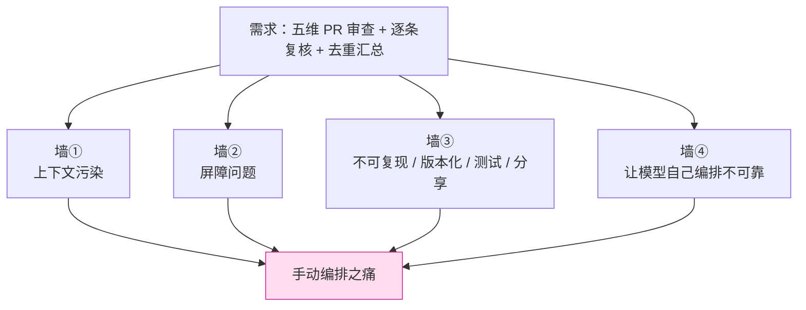
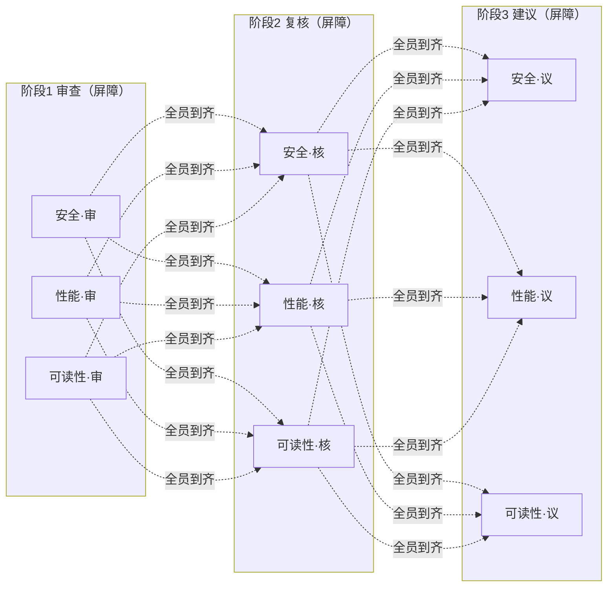
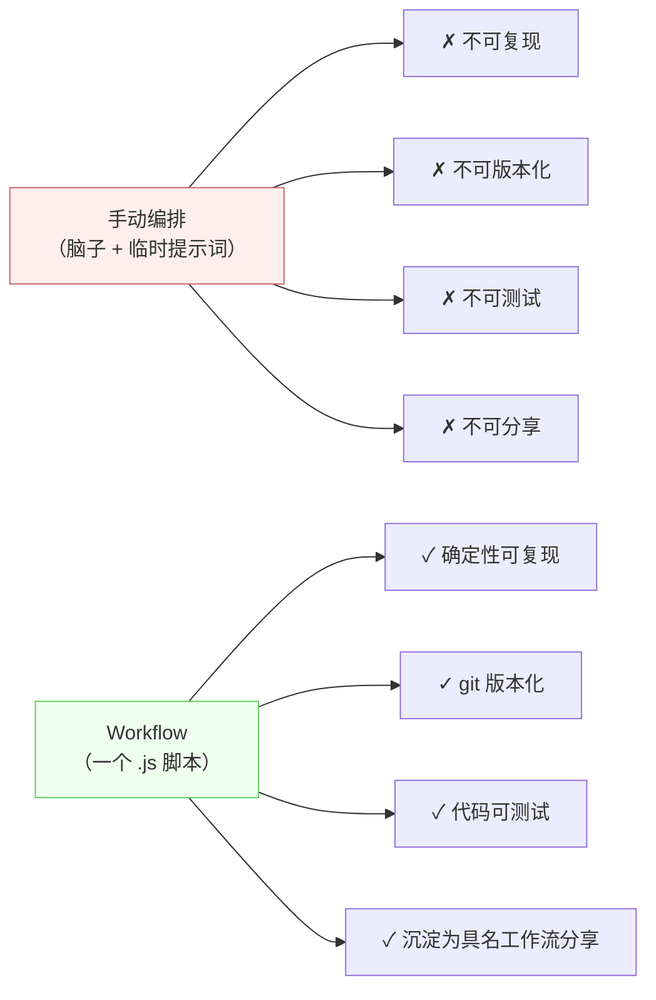
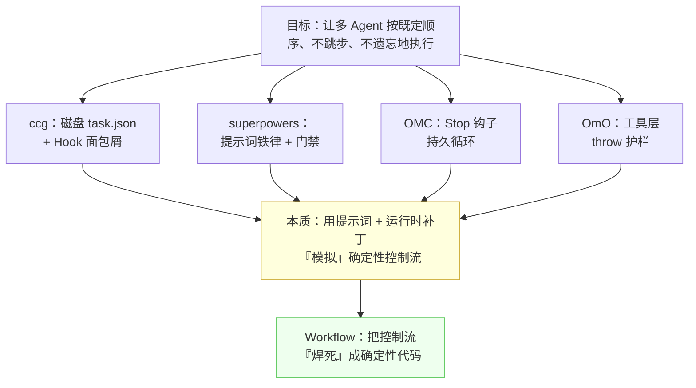

# 第 02 章 · 为什么需要确定性编排

> 上一章我们把 Workflow「是什么」讲清楚了：用一段纯 JavaScript 脚本，确定性地编排任意多个 subagent。这一章我们退一步，问一个更根本的问题——**在 Workflow 出现之前，人们是怎样编排多个 Agent 的？**
>
> 答案是：靠提示词、靠运行时补丁、靠把状态写到磁盘上「祈祷」模型记得。这些办法很聪明，也踩了一地的坑。把这些坑一个个掀开，你才会真正理解：「确定性编排」不是一个炫技的新玩具，而是对一类**真实痛苦**的根治。

---

## 2.1 一个看似简单的需求，和它的四种死法

先立一个具体的、谁都遇到过的需求，全章围绕它展开：

> **「帮我把这个 PR 从五个维度审一遍——安全、性能、可读性、测试覆盖、架构——每个维度找出问题，然后逐条对抗性地复核一遍，最后汇总成一份去重的报告。」**

这个需求一点都不刁钻。它的形状非常清晰：**先扇出五路并行审查 → 每路产出一批发现 → 每条发现再派一个 agent 去复核真伪 → 最后收拢去重**。画成图，三秒钟就能画出来。

但在没有确定性编排的年代，你要让一个 Claude 主循环 + 一堆子任务（Task / subagent）把这件事干漂亮，会接连撞上四堵墙。我们一堵一堵地撞。



---

## 2.2 墙①：上下文污染——你的推理预算正在被原始数据挤爆

### 病灶：所有子任务的原始结果，最终都堆回主循环

手动编排多 Agent，最经典的写法是：主循环（你正在对话的这个 Claude）开五个子任务（用 Task 工具，或者干脆顺序问五次），每个子任务审一个维度，**把审查结果返回给主循环**，主循环再读这五份结果、汇总、去重。

听起来天经地义。问题出在「**把结果返回给主循环**」这一步。

子任务返回的不是一句话，而是**一大段原始材料**——每个维度可能列出十几条发现，每条发现带着代码片段、行号、复现路径、修复建议。五个维度加起来，轻轻松松几千上万 token。这些 token **全部进入主循环的上下文窗口**，并且一旦进入，就在**整段会话的剩余时间里**持续占用推理预算。

<div class="callout warn">

**核心机理：进入上下文的每一个字节，都要为本回合剩下的全部推理「持续付费」。** 它不是读一次就丢，而是作为「历史」挂在那里，每生成一个新 token 都要再被注意力扫一遍。你让主循环读回五份冗长的审查原文，等于在它后续的「汇总 + 去重」这个真正需要动脑的环节里，强行塞进几千 token 的噪声，挤占它本该用于推理的容量。

</div>

这就是**上下文污染**（context pollution）：本可以留在「子任务那边」的中间产物，被无差别地灌回了「主脑」。主循环要做的明明是高层决策（哪些发现重复了？哪些最严重？报告怎么组织？），却被迫先消化一堆它根本不需要逐字记住的细节。

### 社区的应对：把原始数据「外化」，主循环只拿句柄

这堵墙真实到什么程度？真实到四个主流社区系统不约而同地发明了同一类补丁——**控制面 / 数据面分离**。

> **oh-my-claudecode（OMC）** 的精华之一就是「控制面 / 数据面分离 + Artifact 句柄」：子任务的大块产物不直接回灌主循环，而是落到一个「数据面」（磁盘 artifact），主循环只拿到一个**句柄**（一个引用、一个路径），需要时再按需取用。
>
> ——据本书对 OMC 源码的真实阅读（见 `_grounding.md` D 节）

换句话说，社区早就意识到「别把原始数据塞回主脑」，并为此专门设计了一套「句柄 + 外化存储」的机制。但请注意：**这是在用运行时约定和磁盘，手动模拟一件本该天然如此的事**——子任务的产物本就该留在子任务那一侧，由编排逻辑决定哪些、何时、以何种粒度向上汇报。

### Workflow 怎么根治：产物默认不进主循环

Workflow 把这件事变成了**默认行为**。回看第 01 章的 `agent()`：

```javascript
const findings = await agent(reviewPrompt, { schema: FINDINGS })
```

这个 `agent()` 派发出去的 subagent，它的产物（那一大批结构化发现）**留在 Workflow 运行时里，作为 `findings` 这个 JavaScript 变量**——它**不会**自动回灌到你（主循环）的对话上下文。是否、以及把哪一部分呈现给你，由**脚本里的代码**决定：

```javascript
// 五维并行审查：五份原始发现留在运行时变量里
const reviews = await parallel(
  DIMENSIONS.map(d => () => agent(d.prompt, { schema: FINDINGS }))
)

// 逐条对抗复核：同样在运行时内流转，不经过主循环
const verified = await pipeline(
  reviews.flatMap(r => r.findings),
  f => agent(`对抗性复核这条发现：${f.title}`, { schema: VERDICT })
)

// 只有最后这一份「去重汇总」的精炼结果，才作为返回值交给你
return dedupe(verified.filter(v => v.real))
```

整条流水线里流转的几千上万 token 原始材料，**全程没有挤占主循环的推理预算**。主循环最后只收到一份干净的汇总。这正是 OMC 们用「Artifact 句柄」苦苦争取的效果，而在 Workflow 里，它是**语言层面的天然结果**——中间变量本来就不在对话上下文里。

<div class="callout tip">

**一句话记住墙①：** 手动编排把「数据面」灌进了「控制面」；确定性编排让数据留在代码的变量里，只把结论交还给人。第 10 章「分片代码审查」会把这个对比量化到 token。

</div>

---

## 2.3 墙②：屏障问题——你在为「最慢的那一个」站着等所有人

### 病灶：手动并行，本质是「全员到齐才能下一步」

假设你想并行：同时审五个维度。手动怎么做？

最常见的是用一次消息里发起多个 Task 子任务，然后……**等**。等五个全部回来，你才能进入「汇总」。这在逻辑上叫一个**屏障**（barrier）：所有并行分支必须在屏障处会合，才能继续。

屏障本身没错——「汇总」确实需要五份结果都到齐。真正的问题在于：**当你的流程不止一道屏障时，手动编排会强行在每道屏障处「全员等待」，哪怕本不必如此。**

把需求升级一下，看清楚这堵墙：

> 五个维度，**每个维度**都要走「审查 → 复核 → 修复建议」三步。

手动编排的人，脑子里通常是这样排的：

1. 五个维度**一起**审查 → 屏障：等五份审查都好；
2. 五个维度**一起**复核 → 屏障：等五份复核都好；
3. 五个维度**一起**给修复建议 → 屏障：等五份建议都好。



问题来了：**「可读性」这个维度的审查可能 3 秒就好了，但它必须站在屏障前，等最慢的「安全」维度审完 15 秒，才能进入复核。** 明明「可读性」可以立刻往下走自己的复核，却被一道不必要的屏障拦住。每一道屏障，你都在为「这一阶段最慢的那个分支」买单——而总耗时，是**三个阶段各自最慢值之和**。

### 数据：屏障是真实的、可测量的墙钟成本

这不是理论。本书实测的 `parallel-demo` 就是一道纯粹的屏障：

| Workflow | agent_count | total_tokens | duration_ms | 含义 |
|---|---|---|---|---|
| hello（单 agent） | 1 | 26,338 | **5,506** | 一个 agent 往返约 5.5 秒 |
| parallel（3 并发，屏障） | 3 | 78,844 | **8,395** | 3 个并发，墙钟 8.4 秒 |

> 数据来源：`assets/transcripts/primitives.md`，Run ID `wf_dacbd480-d5d`（hello）与 `wf_52957913-6d2`（parallel）。同一会话实测。

读这两行数据，有两个事实：

1. **并发是真的。** 3 个 agent 串行跑应是约 3×5.5 = 16.5 秒，实测只用 **8.4 秒**——并发把三个 agent 压到了约「最慢的那一个」的时间。这是 `parallel()` 的价值。
2. **但屏障也是真的。** 8.4 秒这个总墙钟，等于「最慢那个 agent 的耗时」——更早完成的 agent 必须停在屏障前，等最慢的伙伴。（注：单个 agent 的细分耗时未在本次运行单独记录，此处仅作机理说明；总墙钟 8.4s 为实测。）如果后面还有第二道、第三道屏障，这种「等最慢的」会**逐阶段累加**。

### Workflow 怎么根治：`pipeline` 让每一项「自己往前走」

Workflow 提供了两件武器，区别恰恰就是「有没有屏障」：

- **`parallel(thunks)`**：并发 + **屏障**。等全部完成才返回。**当你确实需要所有结果一起时才用**（比如最后那道汇总）。
- **`pipeline(items, stage1, stage2, ...)`**：每个 item **独立地**流过全部 stage，**阶段之间没有屏障**。「可读性」审完 3 秒，立刻进入自己的复核，不必等「安全」。

> 据官方类型定义（`_grounding.md` B 节）：`pipeline` 的「墙钟 ≈ 最慢的**单条链**，而非各阶段最慢值之和」。这正是消除「逐阶段屏障累加」的关键。

把刚才那个「五维 × 三步」的需求改写成 pipeline，墙钟从「三阶段各自最慢之和」降到「最慢那一**条**完整链路」：

```javascript
// 每个维度独立流过 审查 → 复核 → 建议，互不等待
const results = await pipeline(
  DIMENSIONS,
  d        => agent(d.reviewPrompt,            { schema: FINDINGS, phase: 'Review' }),
  (rev, d) => agent(`复核：${d.name}`,          { schema: VERDICT,  phase: 'Verify' }),
  (ver, d) => agent(`给修复建议：${d.name}`,    { schema: FIXES,    phase: 'Suggest' })
)
```

`pipeline` 的真实运行同样有据可查：

| Workflow | agent_count | duration_ms | 印证 |
|---|---|---|---|
| pipeline（3 项 × 2 阶段） | **6** | 26,743 | 3×2=6 个 agent，`agent_count=6` 严丝合缝 |

> 数据来源：`assets/transcripts/primitives.md`，Run ID `wf_bf086b98-6ec`。

<div class="callout info">

**为什么 pipeline 这一跑反而耗时 26.7 秒？** 因为它是 6 个 agent（3 项各 2 阶段），且第二阶段必须等同项第一阶段的结果（链内有真实依赖）。关键不在绝对耗时，而在**结构**：pipeline 消除的是**跨项的、不必要的屏障**——A 项的第二阶段不必等 B 项的第一阶段。`parallel` 与 `pipeline` 的取舍是本书第 08 章的主题，那里会把这张账算到底。

</div>

---

## 2.4 墙③：不可复现、不可版本化、不可测试、不可分享

前两堵墙关乎「跑得好不好」，这第三堵墙关乎「**它到底算不算一个工程制品**」。

手动编排的「编排逻辑」存在于哪里？存在于**你脑子里**，和**一连串临时发给模型的自然语言指令里**。这带来四个致命的「不可」：

### 不可复现（Not Reproducible）

你今天用一套提示词把五维审查编排得很顺。明天同样的话再说一遍，模型可能：换了顺序、漏了「去重」那一步、把复核和审查合并了。**自然语言指令不是确定的执行**——同样的输入不保证同样的过程。出了好结果你说不清是怎么来的，出了坏结果你也复现不出来去调试。

> 对比 Workflow：脚本是确定性执行的代码。`_grounding.md` 明确「同样的脚本 + 同样的 args → 100% 缓存命中」，这种可重放性正是断点续传的前提（也是为什么脚本里禁用 `Date.now()` / `Math.random()`）。

### 不可版本化（Not Versionable）

「脑子里的编排」没法 `git commit`。你优化了流程——比如发现「复核」环节加一句「先假设这条发现是误报」效果更好——这个改进**无处沉淀**。下次开新会话，一切归零，你又得凭记忆把那套话术重新敲一遍，还不一定敲全。团队里更糟：你的好流程**没法传给同事**，只能靠口口相传或截图。

> 对比 Workflow：脚本就是一个 `.js` 文件。每次调用都落盘（第 01 章 1.4 节），验证好的可以收进 `.claude/workflows/`，提交到 git，像任何代码一样 review、diff、回滚。

### 不可测试（Not Testable）

「这套编排提示词靠谱吗？」——手动编排没法回答。你无法对一段自然语言指令写单元测试，无法在 CI 里断言「它一定会执行去重步骤」。你对它的信心，全靠「上次跑还行」的玄学。

> 对比 Workflow：编排逻辑是代码，`parallel` / `pipeline` / `agent` 都是真实函数。流程的**形状**（先并行后汇总、几个阶段、循环退出条件）由确定的 JS 控制，可以被推理、被审查、被针对性验证。

### 不可分享（Not Shareable）

综合前三点：一个「跑得很好的手动编排」，本质是一种**无法资产化的隐性知识**。它不能打包、不能发布、不能让别人 `npm install` 式地拿去用。社区里那些优秀的工作流系统，恰恰是在**对抗**这一点——它们把方法论写进 Markdown、Skill、Hook，就是为了让「好的编排」能被分发、被复用。



<div class="callout tip">

**这四个「不可」是 Workflow 与「手动开子任务」最深的分野。** 前两堵墙（污染、屏障）讲的是「效率」，第三堵墙讲的是「工程性」——**编排逻辑从飘忽的提示词，变成了可以被工程化对待的代码制品**。这也是本书第五部「构建你自己的库」的全部立足点。

</div>

---

## 2.5 墙④：让模型「自己编排」，为什么不可靠

读到这里，可能有人会说：「那我不手动了，我把整个流程一次性讲给模型，让它**自己**去开子任务、自己编排，不就行了？」

这是最诱人、也最危险的一条路。它的问题不在「模型不够聪明」，而在一个本质矛盾：**编排需要确定性，而语言模型是概率性的。**

### 模型会跳步、会忘、会跑偏

让模型担任「编排者」，等于把控制流交给一个**每一步都在采样**的系统。后果是真实且反复出现的：

- **跳步**：你说「审查 → 复核 → 去重」，模型审查完觉得「发现不多，复核就略过吧」，直接跳到汇总。它不是不听话，是它**判断**这样更省事——而你要的是「无论如何都执行复核」。
- **遗忘**：流程稍长，中间产物稍多，上下文一压缩（见墙①），模型就**忘了自己进行到哪一步**、忘了还有两个维度没审。
- **跑偏**：你要五个固定维度，模型审着审着自己加了俩、合并了俩，最后报告的维度对不上。

### 这堵墙，逼出了社区最硬核的四类补丁

墙④的真实程度，可以直接用四大社区系统的「招数」来度量——它们**全部**诞生在原生 Workflow 之前，每一招都是在给「概率性编排」打补丁：

| 系统 | 对抗「模型乱编排」的核心补丁 | 本质 |
|---|---|---|
| **ccg-workflow** | **磁盘状态 `task.json` + 每轮 Hook 注入面包屑**，对抗上下文压缩导致的遗忘；死循环检测 | 用外部状态文件 + 运行时 Hook，替模型「记住」进度 |
| **superpowers** | **提示词铁律**：Brainstorming-first 硬门禁、TDD Iron Law、Verification-before-completion；结构化状态返回（DONE/BLOCKED） | 用反复强调的自然语言「宪法」约束模型不跳步 |
| **oh-my-claudecode (OMC)** | **`Stop` 钩子持久循环**（「boulder never stops」），让「是否允许停止」可编程；echo-guard | 用生命周期 Hook 把「该不该停」从模型手里夺回到代码手里 |
| **oh-my-openagent (OmO)** | **工具层护栏 throw**（规划者物理上无法写代码）+ system-reminder 注入纠偏 | 用工具层硬约束，让模型「想跳步也跳不了」 |

> 来源：`_grounding.md` D 节，基于对四个仓库源码的真实阅读。

把这张表竖着读，会读出一个清晰的信号：**社区为了让模型「按既定顺序、不跳步、不遗忘地执行」，发明了磁盘状态、生命周期 Hook、提示词铁律、工具层 throw——四套互不相同却目标一致的机制。**

而这四套机制，本质上都在做同一件事：**用提示词 + 运行时补丁，去模拟一个确定性的控制流。**



<div class="callout warn">

**别误读这张图。** 这四个系统极其优秀，它们的补丁是那个年代**正确且必要**的工程选择——在没有原生确定性编排的前提下，它们把概率性编排的可靠性推到了极限。本书第五部会专门「取其精华」。这里要点出的只是一个事实：**它们费尽心力模拟的「确定性」，正是 Workflow 用代码原生提供的东西。** 模型负责「在一步之内动脑」，代码负责「步与步之间的衔接」——各归其位。

</div>

---

## 2.6 「代码即控制流」：四堵墙的同一把钥匙

四堵墙，看似各异，根子是同一个：**编排逻辑被放错了地方。** 它被放进了语言模型的「脑子」和飘忽的提示词里，而它本该属于**确定性的代码**。

Workflow 的全部主张，浓缩成一句就是 **「代码即控制流」（code as control flow）**——把「先做什么、再做什么、哪些并行、哪些串行、循环到什么条件退出、出了结果怎么验证」这套**编排逻辑**，从提示词搬进 JavaScript。一旦搬过去，四堵墙同时塌掉：

| 墙 | 手动编排的病 | 「代码即控制流」的解 |
|---|---|---|
| ① 上下文污染 | 子任务原始结果回灌主循环，挤占推理预算 | 中间产物是运行时变量，不进对话上下文，只返回结论 |
| ② 屏障问题 | 逐阶段「全员等最慢」，墙钟累加 | `pipeline` 让每项独立前进，墙钟 ≈ 最慢单条链；`parallel` 仅在真需汇总时设屏障 |
| ③ 四个「不可」 | 编排逻辑无法复现/版本化/测试/分享 | 脚本是 `.js` 文件：确定执行、可 git、可测试、可沉淀为具名工作流 |
| ④ 模型乱编排 | 概率性模型会跳步/遗忘/跑偏 | 控制流由确定的 JS 执行，模型只在「单步之内」动脑 |

这把钥匙的妙处在于**分工**：

> **模型最擅长的，是在一个**界限清晰的步骤内**做判断**——读这段 diff、找出安全问题、判断这条发现是不是误报。这是它的主场，应该交给它。
>
> **模型最不擅长的，是**记住流程、严格按顺序、不偏不倚地调度自己****——这恰恰是确定性代码的主场，应该交给 `pipeline` / `parallel` / `phase`。

Workflow 让这两者各归其位：**经线（代码）张紧结构，纬线（agent）填入智能。** 这正是「织经」隐喻的全部含义。

---

## 2.7 一组对照：同一个需求，两种世界

把本章开头那个「五维 PR 审查」需求，在两个世界里各走一遍，作为本章的收束。

### 手动编排的世界（示意，未实跑）

```text
你：请审五个维度…（一大段自然语言指令，含「记得复核」「记得去重」）
模型：好的，我开五个子任务…
  → 子任务1~5 各返回一大段原始发现   ← 墙①：全部回灌主循环
模型：（读完五份冗长原文，上下文已被占去大半）
  → 「发现不算多，复核我就直接判断了」 ← 墙④：擅自跳步
  → 漏了「架构」维度（上下文压缩后忘了）  ← 墙④：遗忘
你：（下次想复现这套流程）… 上次那套话是怎么说的来着？ ← 墙③：不可复现
```

### Workflow 的世界（结构示意，对应第 10/11 章的真实配方）

```javascript
export const meta = {
  name: 'pr-multidim-review',
  description: '五维 PR 审查：扇出审查 → 逐条对抗复核 → 去重汇总',
  phases: [{ title: 'Review' }, { title: 'Verify' }, { title: 'Report' }],
}

// ① 五维并行审查——原始发现留在运行时变量，不污染主循环
phase('Review')
const reviews = await parallel(
  DIMENSIONS.map(d => () => agent(d.prompt, { schema: FINDINGS, phase: 'Review' }))
)

// ② 逐条对抗复核——pipeline 无屏障，每条发现独立前进（墙②）
phase('Verify')
const verified = await pipeline(
  reviews.flatMap(r => r.findings),
  f => agent(`对抗性复核：${f.title}`, { schema: VERDICT })
)

// ③ 只把去重后的结论返回给你（墙①）；整个脚本可 git、可测试、可复用（墙③）
phase('Report')
return dedupe(verified.filter(v => v.real))
```

> 注：上面这段是**结构示意（未实跑）**，用来对照本章四堵墙；它的可运行版本与真实运行数据，分别见第 10 章「分片代码审查」和第 11 章「PR 多维 Review」。本章引用的 `hello` / `parallel` / `pipeline` 三组数据，均为 `assets/transcripts/primitives.md` 中的真实运行。

两个世界的差别，不是「一个写得好、一个写得差」。是**编排逻辑放对了地方没有**——放进模型的脑子，你得到玄学；放进代码，你得到工程。

---

## 2.8 本章小结

- 手动编排多 Agent 有四堵墙：**①上下文污染**（原始结果回灌主循环，挤占推理预算）、**②屏障问题**（逐阶段「等最慢的」，墙钟累加）、**③四个「不可」**（不可复现/版本化/测试/分享）、**④让模型自己编排不可靠**（会跳步、遗忘、跑偏）。
- 四大社区系统（ccg / superpowers / OMC / OmO）**全部**诞生在原生 Workflow 之前，用**磁盘状态、Hook 面包屑、提示词铁律、工具层 throw** 等手段，本质上是在「用提示词 + 运行时补丁模拟确定性控制流」。
- 真实数据印证：`parallel` 3 并发墙钟 8.4s ≪ 3×5.5s（并发为真）；`pipeline` 3 项×2 阶段 `agent_count=6`（结构为真）；token ≈ agent 数 × 单 agent 上下文。
- 一把钥匙解四锁——**「代码即控制流」**：编排逻辑从提示词搬进 JS，于是确定、可测、可复用、可分享。**模型在「单步内」动脑，代码管「步与步之间」的衔接。**

下一章，我们把视角再放宽：Workflow 并不孤立存在。它和 Subagents、Agent Teams、Skills、MCP 这四种扩展机制究竟是什么关系？什么时候该用哪个、又如何组合？我们用一张「定位矩阵」彻底厘清。

> 继续阅读：[第 03 章 · 定位矩阵：五种扩展机制](#/zh/p1-03)
