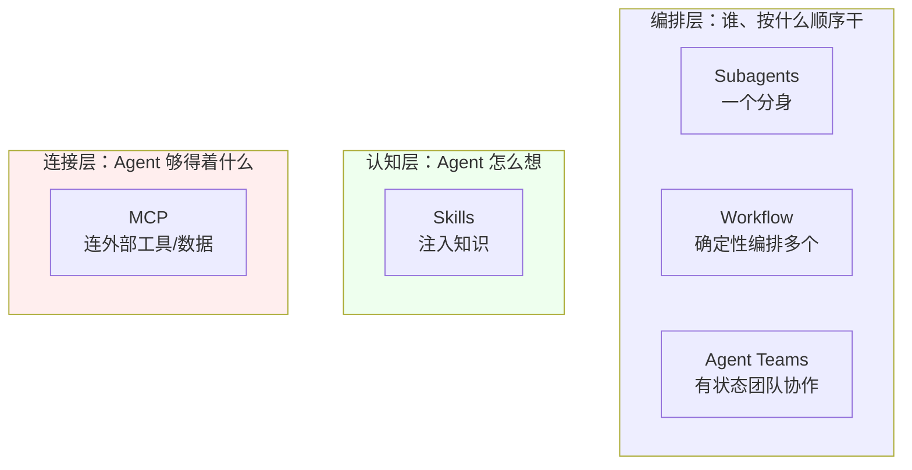
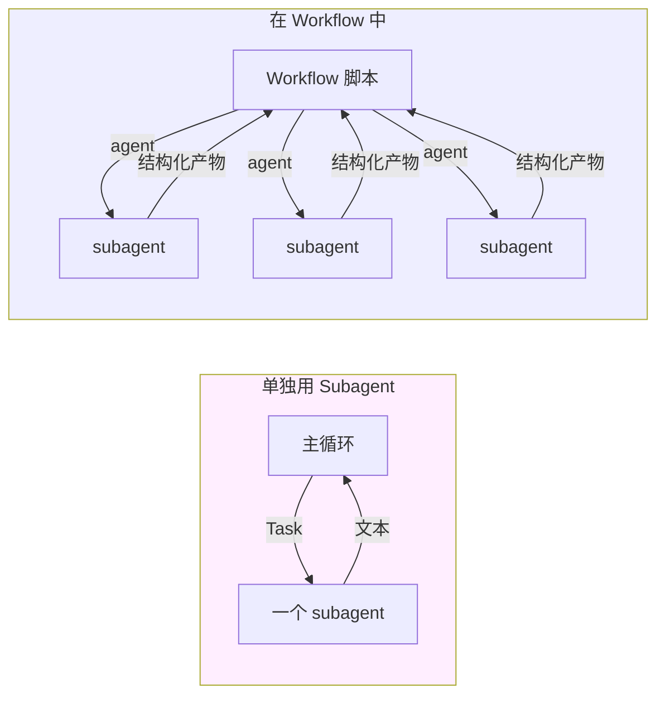
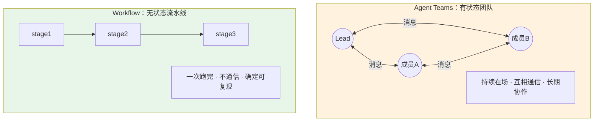
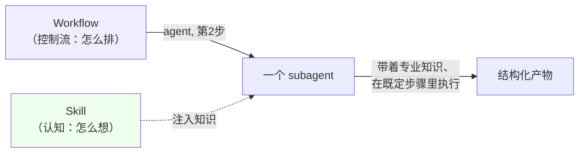
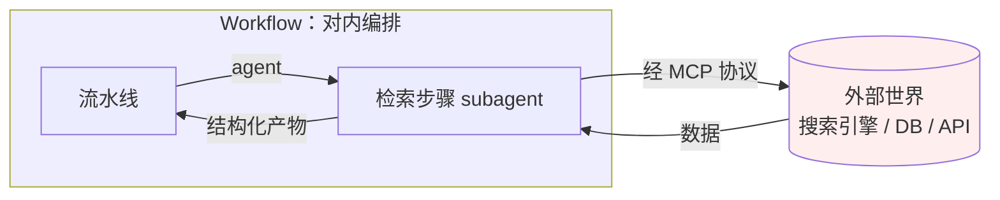
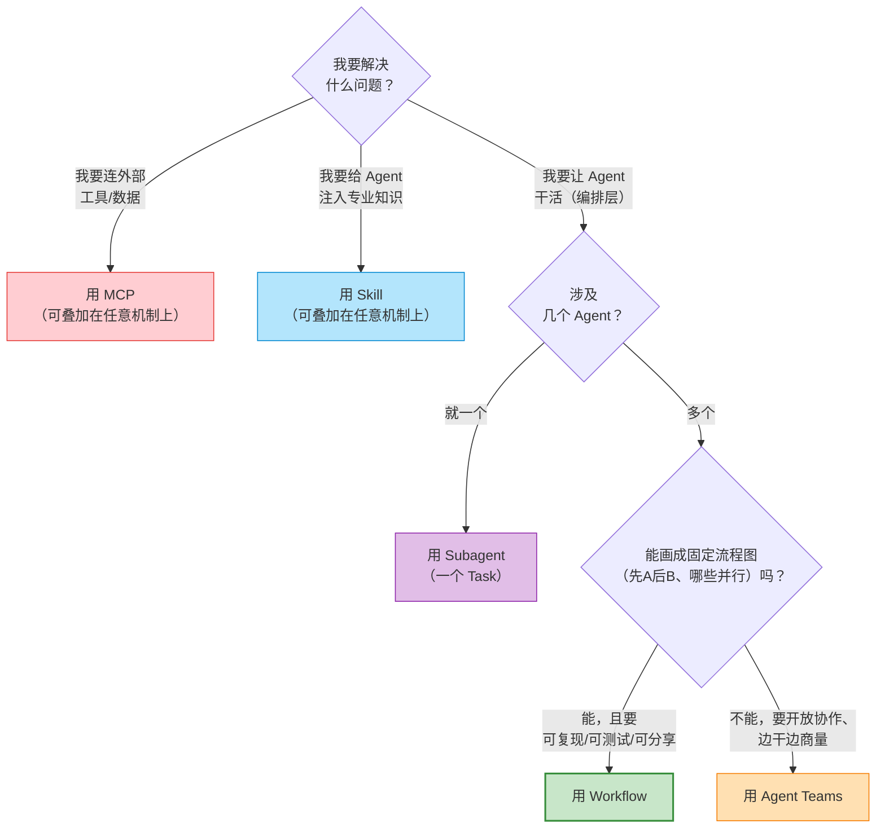
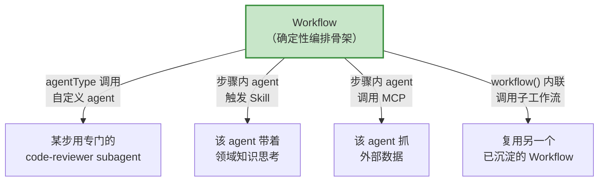

# 第 03 章 · 定位矩阵：五种扩展机制

> 上一章我们讲清了「为什么需要确定性编排」。但 Workflow 不是一座孤岛——它落在一个早就热闹起来的生态里：Subagents、Agent Teams、Skills、MCP，各干各的活儿。
>
> 新手最头疼的，往往不是「Workflow 怎么用」，而是「**这么多机制，到底啥时候用哪个？它们会不会打架？**」这一章我们就用一张定位矩阵，把边界焊死，再告诉你一个更要紧的事实：**它们是正交的、可组合的**——你先把边界搞懂，才谈得上把它们叠起来用。

---

## 3.1 五个名字，五个不同的问题

先把五个主角拉上台，每个用一句话点出它**到底回答哪个问题**。记住这五个问题，它们就是整章的骨架：

| 机制 | 它回答的问题 | 一句话定位 |
|---|---|---|
| **Subagents** | 「这一件事，能不能**派一个分身**去干、把结果拿回来？」 | 一次性 fork 出一个子 Agent，返回文本 |
| **Workflow** | 「**许多个**分身，按什么顺序/并行/验证地干？」 | 用代码**确定性地编排**多个 subagent |
| **Agent Teams** | 「一群分身能不能**像团队一样长期协作、互相喊话**？」 | 有状态、可通信、长期协作的多 Agent |
| **Skills** | 「干这件事需要的**专门知识**，怎么按需喂给 Agent？」 | 按需注入的提示词知识包 |
| **MCP** | 「Agent 怎么**连上外部的工具和数据**？」 | 连接外部工具/数据源的协议 |

这五个问题分属三个完全不同的层面。先建立起这个宏观直觉，细节后面再展开：

**为什么先分三层？** 因为真正容易混、真正要二选一的，是「编排层」内部那三个（Subagents / Workflow / Agent Teams）；至于 Skills（认知层）和 MCP（连接层），它们跟那三个**压根不在一个维度上**，谈不上「二选一」——它们是叠加上去用的。先把层分清楚，后面取舍才不会拧巴。

---

## 3.2 Subagents：一次性的分身

### 它是什么

Subagent 是最小的单位：**主循环 fork 出一个子 Agent，丢给它一段任务，它自己独立跑完，返回一段文本结果。** 在 Claude Code 里，你平时拿 Task 工具派出去的那个「子任务」，骨子里就是一个 subagent。

它的特征很鲜明：

- **一次性**：派出去、跑完、交回、结束。它不记得上一个 subagent 干过啥，下一个 subagent 也不知道它来过。
- **隔离上下文**：它有自己独立的上下文窗口，这恰恰是它值钱的地方——脏活累活在它那头干，原始材料不用再塞回主循环（呼应第 02 章墙①）。
- **返回文本**：它交回来的，是一段文字。

### 它和 Workflow 的关系：原子 vs 分子

这是最需要分清的一对关系，因为 **Workflow 里 `agent()` 派出去的，正是一个 subagent**。

可以这么理解：

> **Subagent 是「原子」，Workflow 是「分子」。** 单独一个 subagent，解决的是「派一个分身干一件事」；Workflow 则用**代码**把一堆 subagent 拼成结构——并行、流水线、循环、验证、汇总。

第 01 章那个 `hello-workflow` 只派了**一个** agent——那会儿 Workflow 退化成了「就一个 subagent」，编排的价值没显出来。它真正的威力，要等 `parallel` / `pipeline` 把 3 个、6 个、几十个 subagent 编排起来时才看得见（回看第 02 章的真实数据：parallel 3 个、pipeline 6 个 agent）。

**什么时候只用 Subagent、不上 Workflow？** 当你只需要**派一个分身去干一件相对独立的活**——「帮我把这个目录摸一遍再总结」「读这份长文档、把要点抽出来」。一个 Task 子任务就够了，再套层 Workflow 纯属杀鸡用牛刀。**只有当分身变成「好几个」、而且彼此之间有「顺序 / 并行 / 依赖 / 验证」关系时，才升级到 Workflow。**

---

## 3.3 Agent Teams：有状态的协作团队

### 它是什么

Agent Teams 由实验性标志 `CLAUDE_CODE_EXPERIMENTAL_AGENT_TEAMS` 门控（本书写作的会话环境里**该标志已开启**，跟 `CLAUDE_CODE_WORKFLOWS=1` 并存——见 `_grounding.md` A 节实测）。它走的是一条**根本不同的协作路子**：

> 一组 Agent 组成一个**团队**，**有状态**、**可以互相通信**、做**长期协作**。它们不是「派出去就完事」，而是像一支真实团队那样一直在场，靠消息互相喊话、分工、协调。

**你这会儿正在亲眼见证。** 本书的写作本身就跑在 Agent Teams 上——你读到的这一章，是「织经」写作团队里一个特约作者 Agent 写出来的，它靠消息机制跟 team-lead 协调任务、汇报进度。这种「有状态 + 互相通信 + 长期在场」的体感，正是 Agent Teams 跟一次性 subagent 的本质差别。

### 它和 Workflow 的关系：有状态团队 vs 无状态流水线

这是另一对**特别容易混**的概念，因为两个都「涉及多个 Agent」。但它们的内核正好相反：

| 维度 | **Agent Teams** | **Workflow** |
|---|---|---|
| 状态 | **有状态**——成员持续在场，记得上下文 | **无状态**——脚本跑完即结束，不留团队 |
| 通信 | 成员之间**可互相通信**、喊话、协商 | subagent 之间**不通信**，只通过脚本变量传值 |
| 时间性 | **长期协作**，可持续多轮 | **一次性**流水线，一跑到底 |
| 控制方式 | 涌现式——成员各自决策、动态协调 | **确定性**——由代码精确规定顺序与并行 |
| 可复现性 | 协作过程依赖运行时动态，不保证复现 | 同脚本 + 同 args → 可复现（甚至缓存命中） |

一句话切开：

> **Agent Teams 像一个『长期在岗、随时沟通』的项目组**；**Workflow 像一条『照着图纸一次性跑完、不留人』的自动化流水线**。

### 怎么选

- **选 Workflow**：任务能画成一张「先做什么 → 再做什么 → 哪些并行」的**固定流程图**，而且你想要**可复现、可测试、可分享**。比如「分片审查 → 对抗复核 → 汇总」。
- **选 Agent Teams**：任务**开放、得随机应变、成员要边干边商量**，事先压根画不出一张流程图。比如「几个角色围着一个模糊需求一直讨论、动态分工往前推」（就像本书的写作）。

**别把 Agent Teams 那种开放协作硬塞进 Workflow。** 如果你的任务里到处是「视情况而定」「成员之间要边干边对齐」，硬用确定性脚本去编排会非常别扭——那是 Agent Teams 的主场。反过来，一条形状固定、就图个复现的流水线，拿 Agent Teams 去跑，既浪费了「有状态团队」这身本事，又把确定性给丢了。**边界就一句话：流程图能画死 → Workflow；要随机应变 → Agent Teams。**

---

## 3.4 Skills：注入的知识，改变 Agent「怎么想」

### 它是什么

Skills 是**按需注入的提示词知识包**。某种任务一冒头，对应的 Skill 就把一套专门知识（领域规范、方法论、最佳实践、操作步骤）**注入到 Agent 的上下文里**，从而改变它「**怎么想**」这件事。

注意这个动词——Skill 改的是 Agent 的**认知**，不是它的**控制流**。它让 Agent「懂得多一点、想得专业一点」，但**不决定**「先做什么、后做什么」。

### 它和 Workflow 的关系：怎么想 vs 怎么排

这一对是**正交**的典范，第 01 章已经点过这句话，这里把它讲透：

> **Skills 决定 Agent「怎么想」（认知）；Workflow 决定「按什么顺序做」（控制流）。** 一个管脑子里的知识，一个管步骤怎么衔接——它俩在两个不同的轴上，根本不冲突。

正因为正交，它们**可以叠加**。`agent()` 有个 `agentType` 选项（`_grounding.md` B 节），能让 subagent 用上某种自定义类型（比如 `'Explore'`、`'code-reviewer'`）；而一个带着特定 skill 的 Agent，在 Workflow 的某一步被派出去时，**既归 Workflow 的控制流调度，又带着 skill 注入的知识去思考**。

**打个比方：** Workflow 是**剧本**（规定第几幕、谁先上场、几条线并行）；Skill 是**演员的专业训练**（让演员演医生时是真懂医学术语）。剧本不会因为演员更专业就改幕次，演员也不会因为剧本定死就忘了专业——两边各管各的，合起来才是一场好戏。

---

## 3.5 MCP：连接外部世界的协议

### 它是什么

MCP（Model Context Protocol）是**连接外部工具和数据源的协议**。它让 Agent 能够得着「自己之外」的东西——一个数据库、一个搜索引擎、一个浏览器、一个公司内部 API。第 01 章已经说清楚：**MCP 是连接外部工具/数据源的协议；Workflow 是编排内部 subagent 的引擎。**

### 它和 Workflow 的关系：对外连接 vs 对内编排

这一对几乎不可能真混起来，但还是值得用一句话锚定方向：

> **MCP 是『朝外』的——把 Agent 连到外部世界；Workflow 是『朝内』的——把内部的 subagent 编排起来。** 一个解决「够得着什么」，一个解决「怎么组织自己人」。

它们同样**可组合**：Workflow 里的某个 subagent，完全可以在跑它那一步时，调一个 MCP 工具去抓外部数据，再把结果当结构化产物交回流水线。比如一条「深度研究」流水线（第 13 章），里头的「检索」步骤就可能让 subagent 通过 MCP 去调搜索引擎。

---

## 3.6 决策矩阵：一表厘清五种机制

把五个机制按几个关键维度横着铺开，这就是本章的核心速查表：

| 维度 | Subagents | **Workflow** | Agent Teams | Skills | MCP |
|---|---|---|---|---|---|
| **解决什么** | 派一个分身干活 | **确定性编排多个 subagent** | 有状态团队长期协作 | 注入领域知识 | 连接外部工具/数据 |
| **所属层面** | 编排层 | **编排层** | 编排层 | 认知层 | 连接层 |
| **Agent 数量** | 一个 | **多个** | 多个 | 不涉及 | 不涉及 |
| **状态** | 一次性 | **无状态** | 有状态 | 注入即生效 | 连接态 |
| **成员间通信** | 无 | **无（靠脚本变量传值）** | 有 | 不适用 | 不适用 |
| **控制方式** | 主循环直接派 | **确定性代码** | 涌现式协调 | 提示词注入 | 协议调用 |
| **可复现** | 单次 | **是（同脚本+args 可缓存）** | 否 | 是（知识固定） | 取决于外部 |
| **门控标志** | 内置 | `CLAUDE_CODE_WORKFLOWS` | `..._AGENT_TEAMS` | 内置/技能系统 | MCP 配置 |
| **典型场景** | 探索/总结一件事 | **分片审查、对抗验证、流水线** | 开放式多角色协作 | 给某步注入专业规范 | 抓外部数据 |

> 表里 `CLAUDE_CODE_WORKFLOWS` 和 `CLAUDE_CODE_EXPERIMENTAL_AGENT_TEAMS` 这两个标志，在本书写作会话中均经实测确认存在（`_grounding.md` A 节）。

---

## 3.7 决策流程图：到底该用哪个

把上面这些取舍，编成一棵决策树。碰到一个任务，从顶上往下走，落到哪个叶子，就用哪个机制：

这棵树的关键分叉，就在最后那一问——**「能不能画成固定流程图」**：

- **能画死** → Workflow。比如「五维审查 → 逐条复核 → 去重汇总」，每一步都明确，顺序和并行都定死了。
- **画不死** → Agent Teams。比如「几个角色围着一个模糊目标一直讨论、看进展随时动态分工」。

**最常见的两个误判，记牢：**

1. **一看「多个 Agent」就立刻想到 Agent Teams** —— 错。多个 Agent，但**流程是固定的**，那该用 Workflow。Agent Teams 的门票是「需要有状态地互相通信、随机应变」。
2. **把「Workflow / Skill / MCP」当成三选一** —— 错。它们不在一个维度上，**根本不是互斥关系**。一个 Workflow 步骤里的 subagent，完全可以一边带着 Skill 的知识、一边调用 MCP 的工具。下一节专门讲这个。

---

## 3.8 诚实地说：它们是正交的、可组合的

前面为了把边界讲清，我们把五个机制「切开」来谈。但真实世界里最强的用法，恰恰是**把它们叠起来**。这一节必须诚实地补上一句：**这些机制不是互相竞争，而是正交、可组合的**——搞懂边界是为了更好地组合，不是为了二选一。

Workflow 正处在编排层的中心，它天生就是其他机制的**载体**：

这些具体的组合点，都有 API 依据（`_grounding.md` B 节）：

- **Workflow + 自定义 Agent**：`agent()` 的 `agentType` 选项可以指定 subagent 类型（比如 `'Explore'`、`'code-reviewer'`），而且**可与 schema 组合**——既用专门 agent，又强制结构化输出。
- **Workflow + Skill**：被 Workflow 派出去的 subagent，在跑它那一步时可以触发 / 携带 skill 的知识——Workflow 管「这一步什么时候做」，skill 管「这一步怎么想得专业」。
- **Workflow + MCP**：流水线里某个 subagent 在执行时，通过 MCP 够到外部数据（比如「深度研究」的检索步骤）。
- **Workflow + Workflow**：`workflow(name, args?)` 可以内联调用另一个已沉淀的具名工作流（**嵌套仅一层**，子工作流里再调会抛错），让验证过的流水线变成可复用的积木——这是第五部「构建你自己的库」和第 20 章「嵌套 Workflow」的基础。

一句话收住这个组合观：

> **Workflow 是编排层的『骨架』；Skill 给骨架上的每个关节注入『专业判断』，MCP 让关节够得着『外部世界』，自定义 agentType 让关节是『对口的专家』。** 它们不抢戏，是在合演。

**这正是「织经」隐喻在生态层面的回响。** Workflow 是经线（确定的结构骨架），Skill / MCP / 自定义 agent 则是在其间穿梭的纬线（每一步的智能与连接）。经定其形，纬成其华——五种机制不是五选一的单选题，而是一套可以经纬交织的工具箱。

---

## 3.9 本章小结

- 五种扩展机制分属三层：**编排层**（Subagents / Workflow / Agent Teams）、**认知层**（Skills）、**连接层**（MCP）。会混、要取舍的，只在编排层内部。
- **Subagents vs Workflow**：原子 vs 分子。一个分身 → Subagent；多个分身要按顺序/并行/验证组织起来 → Workflow。
- **Workflow vs Agent Teams**：无状态的确定性流水线 vs 有状态、能通信的团队。**流程图能画死 → Workflow；要开放协作、随机应变 → Agent Teams**。两个标志（`CLAUDE_CODE_WORKFLOWS`、`..._AGENT_TEAMS`）本机均已开启。
- **Skills**（怎么想）和 **MCP**（够得着什么），跟 Workflow（按什么顺序做）是**正交**的，谈不上二选一——它们是叠加上去用的。
- 最强用法是**组合**：拿 Workflow 当骨架，用 `agentType` 调专家 agent、步骤内 agent 触发 skill / 调 MCP、`workflow()` 内联复用子流程（嵌套仅一层）。
- 一句话边界：**能画成「先做什么 → 再做什么 → 哪些并行」的流程图，就用 Workflow；开放式对话、随机应变，那就不是它的主场。**

到这儿，认知篇三章就铺完了：你知道了 Workflow **是什么**（第 01 章）、**为什么需要它**（第 02 章），以及它在生态里**站在哪个位置**（本章）。接下来进入第二部「基础篇」，我们卷起袖子，从零跑通第一个真正属于你自己的 Workflow。

> 继续阅读：[第 04 章 · 第一个 Workflow](#/zh/p2-04)

> 📌 中文 README 主版本已移至根目录 [README.md](../../README.md)。

---

[← 返回主 README](../../README.md)
