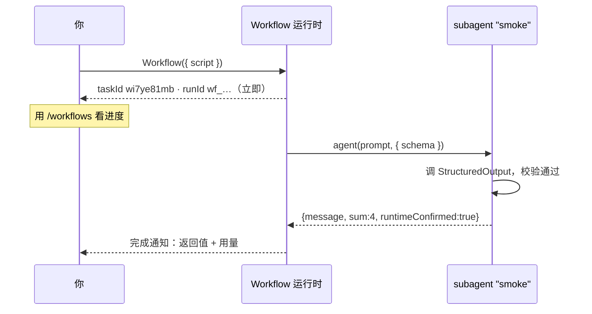
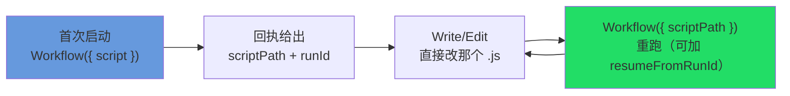

# 第 04 章 · 第一个 Workflow

> 理论讲完了，动手。这一章我们从「确认环境」到「跑通并读懂第一个 Workflow」，把启动、异步、进度、迭代这套循环从头走一遍。每一步都拿**真实运行**的输出来对。

---

## 4.1 前置：确认 Workflow 已开启

Workflow 还是实验性功能，由环境变量 `CLAUDE_CODE_WORKFLOWS` 管着开关。开工前先确认它在你这次会话里是开着的。

```bash
# 启动时临时开启（当前会话生效）
CLAUDE_CODE_WORKFLOWS=1 claude
```

或者写进 `~/.claude/settings.json` 里，让它长期开着：

```json
{
  "env": { "CLAUDE_CODE_WORKFLOWS": "1" }
}
```

想确认它有没有生效，最直接的办法就是看这个环境变量。本书写作的这次会话里，它**确实在，而且就是 `1`**：

```text
CLAUDE_CODE_WORKFLOWS = 1
```

<div class="callout tip">

要是拿不准，直接在对话里说一句「ultrawork：跑一个最小工作流确认运行时」就行。功能开着，Claude 就能调用 Workflow 工具；没开，它会告诉你这工具用不了。

</div>

---

## 4.2 Hello, Workflow

下面是本书第一个真跑过的脚本。它只干一件事：派一个 subagent 出去，让它返回一份结构化的「运行确认」。

```javascript
export const meta = {
  name: 'hello-workflow',
  description: 'Smoke test: one subagent returns schema-constrained structured output',
  phases: [{ title: 'Greet', detail: 'One subagent confirms the runtime' }],
}

phase('Greet')
const r = await agent(
  'You are a smoke test for the Claude Code Workflow runtime. Return a one-sentence ' +
  'confirmation message, the integer value of 2+2, and a boolean confirming you ran ' +
  'as a workflow subagent.',
  {
    label: 'smoke',
    schema: {
      type: 'object',
      properties: {
        message: { type: 'string' },
        sum: { type: 'number' },
        runtimeConfirmed: { type: 'boolean' },
      },
      required: ['message', 'sum', 'runtimeConfirmed'],
    },
  }
)
log(`smoke result: ${JSON.stringify(r)}`)
return r
```

一行行拆开看（呼应第 01 章的「经纬」）：

| 行 | 作用 |
|---|---|
| `export const meta = {…}` | **经线**：纯字面量，写明名称、描述、阶段。运行时开跑前先静态读它一遍。 |
| `phase('Greet')` | 切到「Greet」阶段，后面派的 agent 在进度树里都归到这一组。 |
| `agent(prompt, { schema })` | **纬线**：派一个 subagent 出去，`schema` 强制它返回一个已验证的结构化对象。 |
| `log(...)` | 给你打一行进度。 |
| `return r` | 工作流最后的返回值，会出现在完成通知里。 |

<div class="callout warn">

**这是 Workflow 脚本，不是 Node 脚本——新手第一坑。** `meta`/`phase`/`agent`/`log`/`budget`/`args` 都是 Workflow **运行时注入的全局符号**（`_grounding.md` B 节：「运行时注入，无需 import」）。你把这段存成 `hello.js`、用 `node hello.js` 单跑，Node 压根没有这些全局，立马就给你抛 `ReferenceError: phase is not defined`——**Windows、macOS、Linux 三平台一模一样**（这跟操作系统没关系，纯粹是因为 Node 根本没有 Workflow 运行时这一层）。它只能在**开了 `CLAUDE_CODE_WORKFLOWS=1` 的 Claude Code 会话里**、由 Claude 调用内置 Workflow 工具来跑（见 4.1：直接对 Claude 说一句「ultrawork：跑这个」）。本书实测就是这么把它跑通的：runtime 确认、schema 强制 `sum=4` 为**数字**、约 2.6 万 token / 约 5.5 秒（真实回执和用量见 4.3、4.4）。

</div>

---

## 4.3 启动：你会立刻拿到一个回执

脚本一交给 Workflow 工具，它**不会等跑完**，当场就甩回来一个回执。这是真实输出：

```text
Workflow launched in background. Task ID: wi7ye81mb
Summary: Smoke test: one subagent returns schema-constrained structured output
Transcript dir: ...\subagents\workflows\wf_dacbd480-d5d
Script file: ...\workflows\scripts\hello-workflow-wf_dacbd480-d5d.js
Run ID: wf_dacbd480-d5d
You will be notified when it completes. Use /workflows to watch live progress.
```

这段回执，对应的就是 `_grounding.md` B 节里 `WorkflowOutput` 的那几个真实字段。一一对上，列成一张表：

| 回执里看到的 | `WorkflowOutput` 字段 | 含义 / 用途 |
|---|---|---|
| `Task ID: wi7ye81mb` | `taskId: string` | 后台任务的句柄（可以配合 TaskStop 把它停掉）。 |
| `Run ID: wf_dacbd480-d5d` | `runId?: string` | 这次运行的标识，**断点续传得靠它**（第 22 章）；`remote_launched` 时没这一项。 |
| `Script file: ...js` | `scriptPath?` | 你的脚本被**写到了磁盘上**——这是迭代的关键（见 4.5）。 |
| `Transcript dir: ...` | `transcriptDir?` | subagent 完整执行记录所在的目录。 |
| `Summary: Smoke test...` | `summary?` | 回显的那行摘要（也就是 `meta.description`）。 |

<div class="callout info">

**回执的 `status` 只有两种取值。** 按 `_grounding.md` B 节，`WorkflowOutput.status` 就是 `"async_launched" | "remote_launched"`——**没有第三种**，尤其**没有**那种表示「已完成」的同步状态。本地跑就是 `async_launched`（你这次就是），跑在 CCR 远端就是 `remote_launched`（这时没有 `runId`，续传句柄改用返回的 session URL）。语法检查没过的话，返回会多带一个 `error` 字段（见 4.7）。**把这条记牢，你就不会再指望「调一下 Workflow 就能直接拿到结果」了。**

</div>

<div class="callout info">

**为什么要做成异步的？** 因为一个工作流可能扇出几十个 subagent，跑上几分钟、甚至更久。做成异步，你启动完就能接着干别的，跑完了再收到通知。所以——**Workflow 工具返回的不是结果，而是一张「已启动」的回执**。真正的结果在完成通知里。

</div>

---

## 4.4 进度与完成

启动以后，用斜杠命令 **`/workflows`** 就能看到一棵**实时进度树**：眼下在哪个 phase（来自 `meta.phases` 和 `phase()`）、哪些 agent 在跑、哪些跑完了（叶子节点的名字来自每个 `agent()` 的 `label`）。它就是「启动之后、通知之前」这段时间里你的观察窗口——一块一直在刷新的进度面板。`phase`/`log`/`/workflows` 这三者怎么配合，是第 09 章的专题。

等工作流真正跑完，你会收到一条**完成通知**。`hello-workflow` 的真实完成通知，核心就是这段返回值：

```json
{
  "message": "The Claude Code Workflow runtime smoke test executed successfully as a workflow subagent.",
  "sum": 4,
  "runtimeConfirmed": true
}
```

再附上一份真实用量：

```text
agent_count = 1   tool_uses = 1   total_tokens = 26338   duration_ms = 5506
```

怎么读：

- `sum` 是数字 `4`，**不是**字符串 `"4"`——因为 schema 里写了 `type: 'number'`，校验层把类型给兜住了（这就是结构化输出的威力，详见第 07 章）。
- 最简单的一次 agent 往返 ≈ **5.5 秒 / 2.6 万 token**。拿它当基线单位，你就能估更大工作流要花多少。



---

## 4.5 迭代循环：脚本即文件

因为脚本已经落了盘（就是回执里的 `Script file` / `WorkflowOutput.scriptPath`），迭代一个工作流就不用每次都把整段代码重发一遍。这样一来就有了一个**「改盘上文件 → `scriptPath` 重跑」的迭代闭环**：



拿到回执里的 `Script file` 路径之后，每一轮迭代就是这两步：

1. 用 `Write`/`Edit` 直接改那个 `.js` 文件；
2. 用 `{ scriptPath: "<那个路径>" }` 重新调一次 Workflow（`scriptPath` 优先级高于 `script`/`name`）。

要是还想把上次那些**烧钱的中间结果**接着用，就加上 `resumeFromRunId`：

```javascript
// 改完脚本后，断点续传重跑：未改动的 agent() 调用秒级返回缓存结果
Workflow({ scriptPath: ".../hello-workflow-wf_dacbd480-d5d.js", resumeFromRunId: "wf_dacbd480-d5d" })
```

「同样的脚本 + 同样的 args → 100% 缓存命中」。这也正是脚本里禁用 `Date.now()` / `Math.random()` 的原因（它们会破坏可重放性）。续传的细节见第 22 章。

---

## 4.6 让它稍微大一点：两个 agent

把 hello 扩成「两个并发 agent + 一句汇总」，顺手体会一下 `parallel()`：

```javascript
export const meta = {
  name: 'hello-parallel',
  description: 'Two concurrent agents, then a one-line summary',
  phases: [{ title: 'Ask', detail: 'Two agents in parallel' }],
}

phase('Ask')
const [a, b] = await parallel([
  () => agent('In one sentence: what is a barrier in concurrency?', {
    label: 'q-barrier',
    schema: { type: 'object', properties: { answer: { type: 'string' } }, required: ['answer'] },
  }),
  () => agent('In one sentence: what is a pipeline in concurrency?', {
    label: 'q-pipeline',
    schema: { type: 'object', properties: { answer: { type: 'string' } }, required: ['answer'] },
  }),
])
log('both answers in')
return { barrier: a?.answer, pipeline: b?.answer }
```

注意 `parallel()` 收的是一个 **thunk 数组**（`() => …`），不是 Promise 数组——这是新手栽的第一个跟头，第 08 章会细讲。

> 上面这段 `hello-parallel` 只是**示意**（未单独实跑）；它依赖的 `parallel()` 到底怎么跑，已经由第 08 章的 `parallel-demo`（Run `wf_52957913-6d2`）验证过了。

---

## 4.7 新手最常见的四个错

第一次写 Workflow，下面这几个坑几乎人人都要撞一遍。一个个拆开，「错」长什么样、「对」该怎么写：

**① `meta` 不是纯字面量（包括「在 `meta` 里算值」）。** `meta` 必须是「死」字面量，运行时在**静态解析阶段**就把它读了——任何变量引用、函数调用、展开、模板插值，都会让它拒绝启动。新手尤其爱在 `meta` 里「顺手算一下」（拼个名字、按日期生成描述），这恰恰是被坑的重灾区：

```javascript
// ✗ 错：变量引用 + 模板插值 + 函数调用，全是「计算」
const NAME = 'x'
export const meta = { name: NAME, description: `run ${NAME} at ${Date.now()}` }
// ✓ 对：纯字面量，一个字一个字写死
export const meta = { name: 'x', description: 'run x' }
```

**② schema 漏了 `required` 字段。** 传 `schema` 的时候，别写完 `properties` 就收手——还得在 `required` 里把**必须出现**的字段列上，不然模型可能就合法地把它漏掉，你下游 `r.sum + 1` 就会拿到 `undefined`：

```javascript
// ✗ 错：声明了 sum，却没把它列进 required —— 模型可以不返回它
schema: { type: 'object', properties: { sum: { type: 'number' } } }
// ✓ 对：required 钉死「这个字段一定要有」
schema: { type: 'object', properties: { sum: { type: 'number' } }, required: ['sum'] }
```

**③ 把它当同步调用，以为「调完就能拿到结果」。** 这是最伤人的一个认知错。Workflow **始终异步**：调用立即甩回一张回执（`status` 只会是 `async_launched`/`remote_launched`，见 4.3），结果在**完成通知**里。任何「`const result = Workflow(...)` 然后立刻用 `result.sum`」的写法都是错的——那一刻 `result` 只是回执，不是产物。

**④ 语法错误。** 脚本语法检查没过，`WorkflowOutput` 会带一个 `error` 字段告诉你错在哪，工作流**不会启动**。先在本地把脚本写对，再交上去。

<div class="callout warn">

**别在脚本里用 `Date.now()` / `Math.random()` / 无参 `new Date()`**——它们会抛错（破坏可重放性，让续传缓存失效，见 4.5）。要时间戳，就用 `args` 传进来；要随机性，就拿 agent 的下标 `index` 去改提示词。

</div>

---

## 4.8 本章小结

- 用 `CLAUDE_CODE_WORKFLOWS=1` 把功能打开；拿不准就让 Claude 跑个最小工作流确认一下。
- 它是 **Workflow 脚本，不是 Node 脚本**：`meta`/`phase`/`agent`/`log` 都是运行时注入的全局，`node hello.js` 会在三平台一致地报 `phase is not defined`，只能由 Claude 在 `CLAUDE_CODE_WORKFLOWS=1` 会话里跑。
- 启动 Workflow **当场返回回执**（`WorkflowOutput`：`taskId`/`runId`/`scriptPath`/`transcriptDir`；`status` 只有 `async_launched`/`remote_launched`），结果在**完成通知**里；用 `/workflows` 看实时进度。
- 真实基线：单 agent ≈ 5.5s / 2.6 万 token；`schema` 保证返回类型（`sum` 是数字 4，不是字符串）。
- 迭代靠「脚本即文件」这个闭环：改盘上的 `.js` + `scriptPath` 重跑；加 `resumeFromRunId` 复用缓存。
- 新手四坑：① 在 `meta` 里算值（必须纯字面量）；② schema 漏了 `required`；③ 把它当同步调用、以为立刻就能拿到结果；④ 语法错误，进 `error` 字段、不启动。

基础篇走到这儿，你已经能跑通、读懂、迭代一个 Workflow 了。接下来三章（05/06/07）把经线（`meta`/`phase`）、纬线核心（`agent()`）和结构化输出（`schema`）一个个讲透，第 08 章再把并发模型钉死。

> 继续阅读：[第 05 章 · meta 与 phase：经线](#/zh/p2-05)
