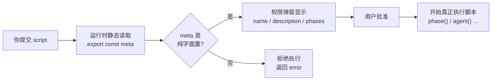
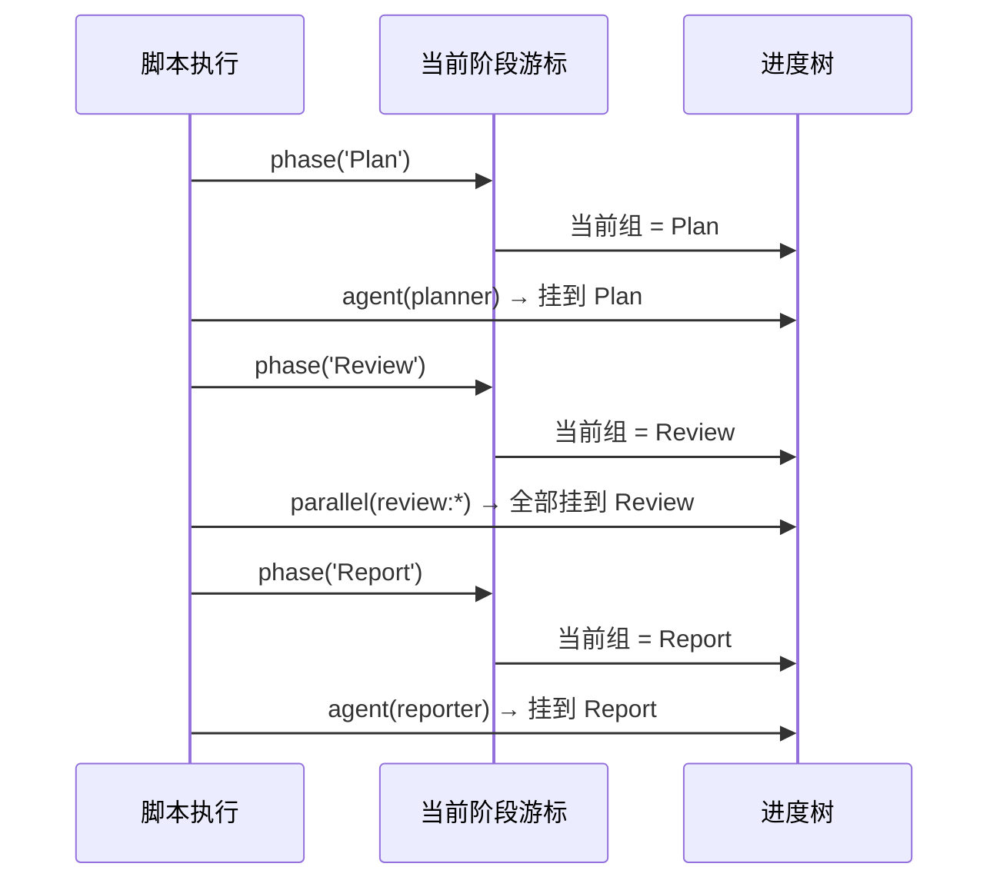
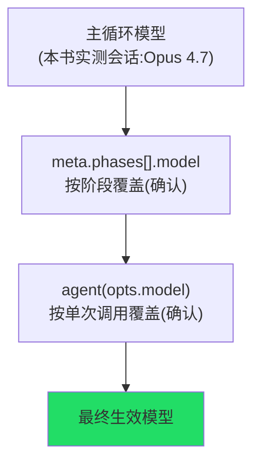

# 第 05 章 · meta 与 phase：经线

> **经者，织之纵丝也；张而不弛，纲举而目张。**
>
> 一台织机上，最先被绷紧的是经线。它纵贯整匹布，决定了布的长度、宽度与张力——纬线还没穿进来之前，布的「形」已经定好了。
>
> 在一个 Workflow 脚本里，`meta` 与 `phase()` 就是这样的经线。它们不执行任何 subagent、不产出任何业务结果，却在第一个 `agent()` 派发之前，就把整个工作流的**骨架**张好了：它叫什么、要做什么、分几个阶段、每个阶段用哪个模型、进度该怎样呈现给人看。
>
> 这一章我们把这根经线彻底拆开。你会看到一个看似不起眼的「导出常量」背后,藏着运行时一条不可妥协的硬约束;也会看到 `phase()` 这个「只有一行、没有返回值」的小函数,如何把几十个 subagent 的乱麻,梳理成 `/workflows` 里一棵清晰的进度树。

---

## 5.1 经线为什么要先张紧：一个静态读取的故事

要理解 `meta`，得先理解运行时**什么时候**读它。

回忆第 01 章那个真实运行的 `hello-workflow`。当你把脚本交给 Workflow 工具,屏幕上几乎立刻弹出一个权限确认——它告诉你「即将运行一个叫 `hello-workflow` 的工作流,描述是 *Smoke test: one subagent returns schema-constrained structured output*,共 1 个阶段:Greet」。

请注意这个时间点:**此刻脚本一行都还没执行。** 没有任何 `agent()` 被派发,没有任何 `await` 被求值,甚至 `phase('Greet')` 这一句都还没运行。可运行时却已经准确地知道了工作流的名字、描述和阶段。

它是怎么知道的?

答案是:运行时在执行脚本**之前**,先对脚本做了一次**静态读取**——它把 `export const meta = {…}` 这个导出常量当作一段**数据**抠出来读,而不是当作**代码**去运行。



这就是「经线先张紧」的技术含义:**结构信息必须在执行之前就可读**,因为它要用来生成权限弹窗、初始化进度树。而要在「不执行代码」的前提下读出一个对象的值,这个对象就**必须是纯字面量**——没有变量引用、没有函数调用、没有展开运算、没有模板插值。任何需要「运行」才能求值的东西,在静态读取阶段都是一片空白。

<div class="callout info">

**「静态读取」与「执行」的区别。** 打个比方:`meta` 像写在剧本封面上的「剧名、简介、幕次表」——剧院经理在开演前**翻一眼封面**就能印进节目单,根本不需要把整出戏演一遍。如果你把剧名写成「今天日期 + 随机数」,经理翻封面时只看到一行无法理解的公式,自然没法印节目单。运行时读 `meta` 就是「翻封面」,而不是「演戏」。

</div>

这条约束在 `_grounding.md` 的「硬约束」一节被明确记录:

> `meta` 必须纯字面量(运行时执行前静态读取)。
>
> ——《接地事实与写作规范》D 节 · 硬约束

---

## 5.2 纯字面量的边界:什么能写,什么会被拒

「纯字面量」四个字听起来抽象,我们用一组对照把它落到实处。

### 5.2.1 合法的 meta:全是「死值」

下面这些写法都是**纯字面量**——每一个值都是写死在源码里的常量,运行时不需要执行任何代码就能读出来:

```javascript
export const meta = {
  name: 'sharded-review',                          // 字符串字面量
  description: '把改动分片,每片派一个 reviewer 并行审查',  // 字符串字面量
  whenToUse: '当一次 PR 改动跨越多个文件、想并行审查时',     // 字符串字面量
  phases: [                                        // 数组字面量
    { title: 'Plan',   detail: '列出改动分片' },        // 对象字面量
    { title: 'Review', detail: '每片一个 reviewer', model: 'opus' },
    { title: 'Merge',  detail: '汇总所有发现' },
  ],
}
```

数组、嵌套对象、布尔、数字、`null`——只要它们本身是字面量,就都合法。关键不在「简单还是复杂」,而在「读它需不需要执行」。

### 5.2.2 非法的 meta:任何「活值」都会被拒

下面每一种写法都会让运行时在静态读取阶段失败,从而**拒绝执行整个工作流**:

```javascript
// 反例 1:含变量引用——静态读取时 NAME 还不存在
const NAME = 'my-workflow'
export const meta = {
  name: NAME,                       // 拒绝:引用了外部变量
  description: '...',
}
```

```javascript
// 反例 2:含函数调用——需要执行才能求值
export const meta = {
  name: 'report-' + getProjectName(),   // 拒绝:调用了函数
  description: '...',
}
```

```javascript
// 反例 3:含模板插值——本质是字符串拼接表达式
const env = 'prod'
export const meta = {
  name: `deploy-${env}`,            // 拒绝:模板插值含变量
  description: '...',
}
```

```javascript
// 反例 4:含展开运算符——需要执行展开
const base = { whenToUse: '...' }
export const meta = {
  ...base,                          // 拒绝:展开运算
  name: 'x',
  description: '...',
}
```

```javascript
// 反例 5:含禁用的非确定性调用——双重违规
export const meta = {
  name: 'run-' + Date.now(),        // 拒绝:既是函数调用,又是被禁的 Date.now()
  description: '...',
}
```

<div class="callout warn">

**记住一个判据:把 `meta` 单独剪切到一个空文件里,它还能不能被 `JSON.parse` 那样「纯读」出来?** 如果它依赖文件里任何**别的东西**(变量、函数、import),那它就不是纯字面量,会被拒。`meta` 必须是一座**自给自足的孤岛**。

</div>

那么——**如果我确实需要动态的名字怎么办?** 答案是:动态信息不该进 `meta`,而该进 `args` 或 `log()`。

- 想让工作流名字带上项目名?用 `log()` 在运行时打印 `log(\`审查项目 ${args.project}\`)`,而 `meta.name` 保持一个固定的、可读的标识符。
- 想让某次运行带时间戳?第 01 章已经讲过:脚本里禁用 `Date.now()`,需要时间戳就**用 `args` 从外面传进来**,或在工作流跑完后由主循环盖戳。

`meta` 描述的是「这个工作流是什么」(一个**不变的身份**),不是「这一次运行的具体参数」(一个**可变的实例**)。把这两者分开,是理解整套设计的钥匙。

---

## 5.3 meta 全字段详解

据 `_grounding.md` B 节对照官方 `sdk-tools.d.ts` 与工具定义,`meta` 的字段如下:

| 字段 | 必填 | 类型 | 作用 | 显示在哪里 |
|---|---|---|---|---|
| `name` | **是** | string | 工作流标识 | 权限确认弹窗 |
| `description` | **是** | string | 一行描述「做什么」 | 权限确认弹窗 |
| `whenToUse` | 否 | string | 适用场景说明「何时用」 | 工作流列表 |
| `phases` | 否 | `Array<{title, detail?, model?}>` | 阶段声明,驱动进度树分组 | `/workflows` 进度树 |
| `model`(顶层) | 否 | string | **语义未核实**:工具定义未把顶层 `meta.model` 列为 meta 字段。本书只确认 `phases[].model` 与 `opts.model` 两层(见 5.3.3 警告) | (待核实) |

下面逐一拆解。

### 5.3.1 `name` 与 `description`:两个必填项

这是仅有的两个**必填**字段。它们的唯一职责,是在权限弹窗里向用户**自报家门**:

- `name`——给人和机器看的标识符。它会出现在权限弹窗、进度显示、以及(若你把脚本沉淀为具名工作流后)`{ name: '...' }` 的调用里。建议用 kebab-case,语义清晰、稳定不变。
- `description`——**一行话**说清「这个工作流做什么」。它直接显示在用户批准运行前看到的对话框里,是用户决定「要不要放行」的主要依据。

<div class="callout tip">

**把 `description` 当成「电梯陈述」来写。** 用户看到它的那一刻,正要决定是否授权一个可能扇出几十个 subagent、烧掉大量 token 的操作。一句含混的 `description: '处理数据'` 会让人无从判断;一句具体的 `description: '把 PR 改动按文件分片,每片派一个 reviewer 并行审查,汇总发现'` 才能让人安心点「批准」。

</div>

### 5.3.2 `whenToUse`:写给「未来的你」和「工作流列表」

`whenToUse` 是可选的「适用场景」说明。它与 `description` 的微妙区别在于:

- `description` 回答「这个工作流**做什么**」(What);
- `whenToUse` 回答「**什么时候**该选它」(When)。

它的价值在工作流被**沉淀、复用**之后才真正显现。回忆第 01 章 1.7 节:验证过的脚本可以收进 `.claude/workflows/`,日后用 `{ name: 'my-workflow' }` 像具名命令一样调用。当你的库里攒了十几个工作流,`whenToUse` 就是那份「该用哪一个」的索引——它会显示在工作流列表里,帮你(或你的队友)在一堆工具里快速选对。

```javascript
export const meta = {
  name: 'bug-hunter',
  description: '多个 finder 并行找 bug,再由 verifier 对抗验证,最后汇总',
  whenToUse: '当你想在合并前对当前分支做一次高精度 bug 扫描时;改动较小时优先用更轻量的版本',
  // ...
}
```

### 5.3.3 模型:两层确认的覆盖

模型这件事,恰恰是 `meta`(经线)与 `agent()`(纬线)交汇的地方。据工具定义,**只有两层模型覆盖被确认**:

- **`meta.phases[].model`** —— 按**阶段**覆盖(如 `{ title: 'Verify', model: 'haiku' }`),写在 `phases` 数组里。
- **agent `opts.model`** —— 按**单次调用**覆盖;**省略则继承主循环模型**。

两者都不写时,agent 继承主循环模型——**本书实测会话**的主循环是 Opus 4.7(由 `CLAUDE_CODE_SUBAGENT_MODEL=claude-opus-4-7` 指定,见 `_grounding.md` A 节;这是本书会话的事实,非 Workflow 通用保证)。

<div class="callout warn">

**关于顶层 `meta.model`:** Workflow 工具定义里,`meta` 的字段是必填 `name`/`description` + 可选 `whenToUse`/`phases`(`phases` 内可带 `model`)——**并未把顶层 `meta.model` 列为 meta 字段**。因此本书**不**把它当作一个生效的「模型层」来叙述;它的自动解析语义**未经核实(待核实)**。模型覆盖只认上面那两层。

</div>

完整的两层解析与按阶段选模型的成本权衡,见 5.6 节。

### 5.3.4 `phases`:经线上的「刻度」

`phases` 是 `meta` 里**结构感最强**的字段,也是这一章后半程的主角。它是一个数组,每一项声明一个阶段:

```javascript
phases: [
  { title: 'Find',   detail: '每个 finder 产出候选 bug' },
  { title: 'Verify', detail: '对抗性验证每条候选', model: 'opus' },
  { title: 'Report', detail: '汇总确认的发现' },
]
```

每一项的字段:

| 字段 | 必填 | 作用 |
|---|---|---|
| `title` | 是 | 阶段标题。**这是一个会被精确匹配的字符串**(见 5.5 节) |
| `detail` | 否 | 阶段的一句话说明,显示在进度树里帮人理解这一阶段在做什么 |
| `model` | 否 | 标注「这一阶段用什么模型」(见 5.6 节) |

`phases` 是**纯声明**——它只是在 `meta` 里「画出刻度」,告诉运行时「这个工作流计划分这么几个阶段、每个阶段叫什么」。真正在执行时**切换**到某个阶段,是 `phase()` 函数的事(5.4 节)。声明与切换的配合(`meta.phases[].title` ↔ `phase('...')` 的字符串匹配),是整章的关键机制(5.5 节)。

<div class="callout info">

**`phases` 可以省略吗?** 可以。`hello-workflow` 如果不写 `phases`,照样能跑——只是进度显示会少了「分组刻度」,所有 agent 平铺在一个默认分组里。`phases` 不是功能的开关,而是**可读性的增强**:它让 `/workflows` 进度树从「一堆 agent」变成「按阶段组织的一棵树」。对于多阶段、长流程的工作流,强烈建议声明它。

</div>

---

## 5.4 `phase(title)`:在执行中切换当前阶段

如果说 `meta.phases` 是「画在图纸上的刻度」,那么 `phase(title)` 就是执行时「把游标移到某一刻度上」的动作。

它的签名极简,据 `_grounding.md` B 节:

```javascript
phase(title: string): void
```

没有返回值,不接受 `await`。它做的事只有一件:**开启一个新阶段;在它之后派发的所有 `agent()` 调用,都归入这个阶段的进度分组,直到下一次 `phase()` 调用。**

### 5.4.1 一个最小可运行示例

把第 01 章那个真实运行过的 `hello-workflow` 拿来看(Run ID `wf_dacbd480-d5d`,见 `assets/transcripts/primitives.md`):

```javascript
export const meta = {
  name: 'hello-workflow',
  description: 'Smoke test: one subagent returns schema-constrained structured output',
  phases: [{ title: 'Greet', detail: 'One subagent confirms the runtime' }],
}

phase('Greet')           // ← 切换到 'Greet' 阶段
const r = await agent(   // ← 这个 agent 归入 'Greet' 分组
  'You are a smoke test for the Claude Code Workflow runtime. Return a one-sentence ' +
  'confirmation message, the integer value of 2+2, and a boolean confirming you ran ' +
  'as a workflow subagent.',
  {
    label: 'smoke',
    schema: {
      type: 'object',
      properties: {
        message: { type: 'string' },
        sum: { type: 'number' },
        runtimeConfirmed: { type: 'boolean' },
      },
      required: ['message', 'sum', 'runtimeConfirmed'],
    },
  }
)
log(`smoke result: ${JSON.stringify(r)}`)
return r
```

这里 `meta.phases` 声明了唯一的阶段 `Greet`,脚本体里 `phase('Greet')` 把游标切到它,随后的 `agent({ label: 'smoke' })` 就显示在 `Greet` 这一组下。这是「声明 + 切换」配对的最小完整形态。

这个工作流的**真实用量**(来自 `assets/transcripts/primitives.md`):

```text
agent_count = 1   tool_uses = 1   total_tokens = 26338   duration_ms = 5506
```

注意:`phase()` 和 `meta` 本身**不消耗 agent、不计 token**——`agent_count=1` 完整对应那唯一一个 `smoke` agent。经线是「免费」的结构,它不参与执行成本的计算,只塑造执行的**形状**与**呈现**。

### 5.4.2 多阶段串联:游标随脚本推进

当工作流有多个阶段,`phase()` 就像一个随脚本执行**自然推进**的游标。下面是一个三阶段的示例(示意,未实跑):

```javascript
export const meta = {
  name: 'review-pipeline',
  description: '规划审查范围 → 并行审查各分片 → 汇总成报告',
  phases: [
    { title: 'Plan',   detail: '确定要审查的文件分片' },
    { title: 'Review', detail: '每个分片一个 reviewer 并行审查' },
    { title: 'Report', detail: '汇总所有发现为一份报告' },
  ],
}

// ——— 阶段一:Plan ———
phase('Plan')
const shards = await agent('列出本次改动涉及的文件,按模块分成若干分片', {
  label: 'planner',
  schema: {
    type: 'object',
    properties: { shards: { type: 'array', items: { type: 'string' } } },
    required: ['shards'],
  },
})

// ——— 阶段二:Review ———
phase('Review')
const findings = await parallel(
  shards.shards.map((s, i) => () =>
    agent(`审查这个分片并报告问题:${s}`, {
      label: `review:${s}`,
      schema: {
        type: 'object',
        properties: { issues: { type: 'array', items: { type: 'string' } } },
        required: ['issues'],
      },
    })
  )
)

// ——— 阶段三:Report ———
phase('Report')
const report = await agent(
  `把以下各分片的发现汇总成一份结构化报告:${JSON.stringify(findings.filter(Boolean))}`,
  { label: 'reporter' }
)

log('审查完成')
return report
```

观察这段脚本的「经纬交织」:

- **经线**:`meta.phases` 声明了三个刻度 `Plan / Review / Report`;脚本体里三句 `phase(...)` 是游标,依次推进。
- **纬线**:每个 `phase()` 之后的 `agent()` / `parallel()` 自动归入当前阶段。`planner` 在 Plan 组,所有 `review:*` 在 Review 组,`reporter` 在 Report 组。

游标推进的时序可以这样理解:



<div class="callout tip">

**`phase()` 是「全局游标」,不是「作用域」。** 它没有 `{ }` 范围,也不会在某段代码结束后「自动弹回」。一旦你调用 `phase('Review')`,游标就**一直**停在 Review,直到你显式调用下一个 `phase('Report')`。这个「全局可变状态」的特性,在普通的顺序脚本里很自然,但在 `parallel()` / `pipeline()` 这种**并发**场景里会埋下一个坑——下一节专门讲。

</div>

---

## 5.5 字符串精确匹配:`meta.phases[].title` ↔ `phase('...')`

这是本章**最容易出错、也最值得记牢**的机制。

运行时把进度组织成一棵树:`meta.phases` 声明的每个 `title` 是树上的一个**预定义节点**;而 `phase('...')` 调用,是按 `title` 字符串**精确匹配**去「点亮」对应的节点,并把后续 agent 挂上去。

据 `_grounding.md` 描述:

> `phase(title)`——开启新阶段;其后 `agent()` 归入该组。

而 `meta.phases` 的 `title` 与 `phase()` 的参数之间,是**按字符串精确匹配**关联的。这意味着三件事:

**其一:大小写、空格、标点都必须一字不差。** 下面是一个**典型 bug**:

```javascript
export const meta = {
  name: 'x', description: '...',
  phases: [{ title: 'Review' }],   // 声明:'Review'
}

phase('review')   // ⚠️ 小写 'review' —— 与 'Review' 不匹配!
await agent('...')
```

`meta.phases` 里写的是 `'Review'`(首字母大写),而 `phase('review')` 传的是小写。两者**不是同一个字符串**,匹配失败。结果:进度树里那个预声明的 `Review` 节点始终是空的,而你的 agent 跑去了一个对不上号的地方。**功能上工作流照常运行,但进度显示乱套了**——这种 bug 不会报错,只会让 `/workflows` 看起来莫名其妙。

**其二:`phase()` 传入未在 `meta.phases` 声明的 title 会怎样?** 据现有事实源,`meta.phases` 是「预声明的刻度」,`phase()` 按 title 匹配点亮它们。传入一个未声明的 title 的具体行为(是新建一个临时分组,还是被忽略)——**(待核实)**。稳妥的做法是:**`meta.phases` 里声明的 title,与脚本里 `phase()` 用到的,保持一一对应、字字相同。** 把两处的字符串当成「同一个常量的两次书写」来对待。

**其三:这是「声明」与「使用」的解耦,好处是进度树可以「预先成形」。** 因为 `meta.phases` 在静态读取阶段就被运行时拿到,所以**还没开始执行**,`/workflows` 就能画出完整的阶段骨架(哪怕后面的阶段还没轮到)。`phase()` 执行到哪,就点亮到哪。这正是「经线先张紧」的又一次体现:结构先行,执行填充。

<div class="callout warn">

**实践建议:把 phase 名抽成「单一事实源」。** 由于 `meta` 必须是纯字面量、不能引用变量,你**无法**用一个 `const PHASE_REVIEW = 'Review'` 同时喂给 `meta` 和 `phase()`(那会让 `meta` 不再是纯字面量而被拒)。退而求其次的纪律是:**先写好 `meta.phases`,再原样复制每个 `title` 字符串到对应的 `phase()` 调用里**,绝不手敲第二遍。复制粘贴在这里不是坏习惯,而是防止「大小写漂移」最有效的手段。

</div>

### 5.5.1 并发场景的陷阱:全局 phase() 的竞争

5.4 节末尾埋的坑,现在揭开。

`phase()` 切换的是一个**全局当前阶段游标**。在顺序脚本里这毫无问题。但在 `parallel()` 或 `pipeline()` 里,多个 agent **同时在飞**,它们若都依赖「全局游标当前指向哪」来决定自己归入哪个阶段,就会发生**竞争**:

设想一个 pipeline,你想让第一阶段的 agent 进 `Find` 组、第二阶段进 `Verify` 组。如果你天真地在 stage 回调里写 `phase('Find')` / `phase('Verify')`:

```javascript
// ⚠️ 反模式:在并发的 stage 回调里调用全局 phase()
await pipeline(
  items,
  (item) => { phase('Find');   return agent(`找:${item}`) },   // 危险
  (found) => { phase('Verify'); return agent(`验:${found}`) },  // 危险
)
```

由于 pipeline「每个 item 独立流动、阶段间无屏障」(见第 01 章与第 08 章),某个 item 可能正处于 Verify、另一个还在 Find——两个回调**并发**地修改同一个全局游标,谁最后写谁说了算。结果是 agent 被随机地分到 `Find` 或 `Verify`,进度树彻底错乱。

**正确做法:不要在并发回调里用全局 `phase()`,而是在每个 `agent()` 上用 `opts.phase` 显式归组。** 这正是 `assets/transcripts/primitives.md` 里那个真实运行的 `pipeline-demo`(Run ID `wf_bf086b98-6ec`)所采用的写法:

```javascript
export const meta = {
  name: 'pipeline-demo',
  description: 'pipeline(): each item flows Find -> Verify independently, no barrier between stages',
  phases: [
    { title: 'Find',   detail: 'Produce a candidate' },
    { title: 'Verify', detail: 'Adversarially check it' },
  ],
}

const items = ['off-by-one', 'null-dereference', 'race-condition']
const out = await pipeline(
  items,
  (kind) =>
    agent(`Give a one-line code example of a ${kind} bug.`, {
      label: `find:${kind}`,
      phase: 'Find',                 // ← 显式归入 Find,不依赖全局游标
      schema: { type: 'object', properties: { example: { type: 'string' } }, required: ['example'] },
    }),
  (found, kind) =>
    agent(`Is this genuinely a ${kind} bug? Example: "${found.example}". Reply boolean + short reason.`, {
      label: `verify:${kind}`,
      phase: 'Verify',               // ← 显式归入 Verify
      schema: { type: 'object', properties: { real: { type: 'boolean' }, reason: { type: 'string' } }, required: ['real', 'reason'] },
    }).then((v) => ({ kind, ...found, ...v }))
)
log(`pipeline produced ${out.filter(Boolean).length} verified items`)
return out.filter(Boolean)
```

这个工作流的**真实用量**(来自 `assets/transcripts/primitives.md`):

```text
agent_count = 6   tool_uses = 8   total_tokens = 158982   duration_ms = 26743
```

3 项 × 2 阶段 = 6 个 agent,`agent_count=6` 印证了「每个 stage 回调各派一个 agent」。而每个 agent 通过 `opts.phase: 'Find' | 'Verify'` 把自己**钉死**在正确的分组上,不论它实际在什么时刻被执行,进度树都准确。

<div class="callout tip">

**一条铁律:顺序脚本用全局 `phase()`,并发(`parallel`/`pipeline`)里用 `opts.phase`。** 前者依赖「执行顺序 = 阶段顺序」,在串行代码里成立;后者把归组信息**附着在每个 agent 自己身上**,不受并发交错影响。`_grounding.md` 对 `opts.phase` 的描述正是:「显式归入某进度组(在 pipeline/parallel 内部尤其重要,避免竞争全局 phase())」。`opts.phase` 的完整用法,第 06 章 agent() 指南会再细讲。

</div>

---

## 5.6 模型覆盖:两层确认

模型(model)是 `meta` 这根经线与 `agent()` 那根纬线**交汇**的地方,值得单独梳理。据工具定义,模型覆盖**只有两层是确认的**——一层在经线(按阶段)、一层在纬线(按单次调用)。一个 agent 最终用哪个模型,可按**从宽到窄**理解:



从宽到窄理解:

1. **两层都不写** → agent 继承**主循环模型**。据 `_grounding.md`:「(`agent` 的)`opts.model` 省略则继承主循环模型」。**本书实测会话**的主循环是 Opus 4.7(这是本书会话的事实,非 Workflow 通用保证)。
2. **在 `meta.phases[].model` 标注某阶段**(已确认)→ 表达「这一阶段用什么模型」。例如一个先「廉价地海量扇出找线索」、再「昂贵地精审」的工作流,可以在 phases 上标出来:

```javascript
export const meta = {
  name: 'scan-then-deep',
  description: '先用 haiku 廉价地海量扫描线索,再用 opus 精审命中项',
  phases: [
    { title: 'Scan',   detail: '大量并行的轻量扫描', model: 'haiku' },
    { title: 'Deepen', detail: '对命中项做昂贵的深入分析', model: 'opus' },
  ],
}
```

3. **在 `agent({ model })` 上指定**(已确认)→ 最细粒度,精确控制**这一个** agent 用什么模型,覆盖「继承主循环」这一默认。

<div class="callout info">

**`meta.phases[].model` 与 `agent({ model })` 的分工。** `meta.phases[].model` 是**声明性**的——它写在经线上,表达「这个阶段的意图是用某模型」,也让读脚本的人一眼看清成本结构。而 `agent({ model })` 是**命令性**的——它在纬线上,真正决定某个具体 agent 的模型。两者一个「说计划」、一个「下命令」。`agent({ model })` 的细节(包括 `'haiku'` 适合什么任务)留到第 06 章。

</div>

为什么把「按 phase 选模型」做成一种模式?因为它对应一个极常见的成本权衡:**广度阶段用便宜模型大量扇出,深度阶段用强模型精雕细琢。** 这能在不牺牲关键质量的前提下,显著压低总 token——而 token 成本,正如 `_grounding.md` C 节的经验法则,约等于「agent 数 × 每 agent 上下文」。把扇出最多的那个阶段换成 haiku,省下的就是「agent 数 × 单价差」。

---

## 5.7 `/workflows`:实时进度树,与 `log()` 的叙述行

经线张好、纬线穿梭,这一切**呈现**给人看的窗口,就是斜杠命令 `/workflows`(`_grounding.md` A 节:「实时进度——斜杠命令 `/workflows`」)。

### 5.7.1 进度树长什么样

`/workflows` 把当前(及历史)工作流渲染成一棵**实时刷新**的树。它的层级正是我们这一章搭起来的结构:

```text
review-pipeline                          ← meta.name(树根)
├─ Plan                                  ← meta.phases[0].title
│  └─ planner                  ✓ done    ← phase('Plan') 之后的 agent
├─ Review                                ← meta.phases[1].title
│  ├─ review:auth.ts           ✓ done    ← parallel 里的各 agent,
│  ├─ review:db.ts             ⏳ running  ←   通过 opts.phase 或全局 phase 归入此组
│  └─ review:api.ts            ⏳ queued   ←   (queued:受并发上限节流,见第 01 章)
└─ Report                                ← meta.phases[2].title
   └─ reporter                 ⏳ pending  ← 还没轮到的阶段也预先成形
```

这棵树的每一层都来自本章的某个概念:

- **树根** = `meta.name`。
- **二级节点** = `meta.phases[].title`(因为静态读取,它们**预先成形**,哪怕还没执行到)。
- **叶子** = 各个 `agent()`,显示名来自 `opts.label`(没传则自动编号),挂在哪一组由 `phase()` / `opts.phase` 决定。
- **状态标记**(running / done / queued / pending)= 运行时实时更新;`queued` 反映第 01 章讲的并发上限节流(`min(16, CPU核心数 − 2)`)。

<div class="callout tip">

**进度树是「为什么要费心搭经线」的最佳答案。** 一个不写 `phases`、不传 `label` 的工作流照样能跑出正确结果,但它的 `/workflows` 是一堆扁平的、编号的匿名 agent;而一个经线张好的工作流,进度树会读起来像一份**带章节的执行报告**。当你的工作流扇出几十个 agent、跑上几分钟,这棵树就是你唯一的「它现在在干嘛」的窗口。结构不只为机器,更为人。

</div>

### 5.7.2 `log()`:进度树上方的叙述行

`phase()` 塑造**结构**,`log()` 则提供**叙述**。据 `_grounding.md` B 节:

> `log(message: string): void`——向用户输出进度(进度树上方叙述行)。

它把一行自由文本打到进度树**上方**,作为人类可读的旁白。它和 `phase()` 的分工很清晰:

| | `phase(title)` | `log(message)` |
|---|---|---|
| 改变什么 | 进度树的**分组结构** | 进度树上方的**叙述文字** |
| 影响后续 agent 归组 | **是** | 否 |
| 典型用途 | 「现在进入 Review 阶段」 | 「12 个分片中已完成 8 个」「barrier released」 |
| 有返回值 | 无 | 无 |

在前面引用的两个真实运行里,`log()` 都出现了:

- `hello-workflow`:`log(\`smoke result: ${JSON.stringify(r)}\`)` ——把 agent 的结果回显成一行旁白。
- `pipeline-demo`:`log(\`pipeline produced ${out.filter(Boolean).length} verified items\`)` ——汇报「产出了几条已验证项」。
- `parallel-demo`(Run ID `wf_52957913-6d2`):`log(\`barrier released with ${results.filter(Boolean).length}/${dims.length} results\`)` ——在屏障释放时,叙述「拿到了 N/M 个结果」。

<div class="callout warn">

**`log()` 里别用 `Date.now()` 拼时间戳。** 第 01 章的禁令对整个脚本体有效,`log()` 也不例外——它同样运行在脚本里。想在日志里体现进度数字(已完成几个、共几个),用 `.filter(Boolean).length` 这类**对输入的纯计算**,而非时间或随机。这样工作流才保持可重放,断点续传才能命中缓存(细节见第 22 章)。

</div>

---

## 5.8 一个把经线用满的范例(示意,未实跑)

把本章所有概念收拢到一个例子里。下面这个工作流刻意用满了 `meta` 已确认的每个字段、多阶段 `phase()`、按 phase 选模型、`opts.phase` 并发归组、以及 `log()` 叙述——它是一份「经线检查表」,不是生产配方,故标注**(示意,未实跑)**:

```javascript
export const meta = {
  // —— 两个必填:自报家门 ——
  name: 'triage-and-fix',
  description: '分诊一批报错日志,并行定位根因,再串行产出修复建议',
  // —— 何时用:显示在工作流列表 ——
  whenToUse: '当你有一批同类报错、想批量定位根因并拿到修复建议时',
  // —— 阶段刻度:注意 Triage 阶段标注了更便宜的 haiku ——
  phases: [
    { title: 'Triage',  detail: '把日志快速归类(轻量,海量并行)', model: 'haiku' },
    { title: 'Locate',  detail: '对每类报错定位根因(深入)' },
    { title: 'Suggest', detail: '汇总成一份修复建议清单' },
  ],
}

// ——— Triage:用全局 phase 切组(这里是顺序代码,安全)———
phase('Triage')
const buckets = await agent(
  `把以下报错日志按根因类型归类:${JSON.stringify(args.logs ?? [])}`,
  {
    label: 'triage',
    model: 'haiku',                 // 与 phases[0].model 呼应:这一步用便宜模型
    schema: {
      type: 'object',
      properties: { categories: { type: 'array', items: { type: 'string' } } },
      required: ['categories'],
    },
  }
)
log(`分诊出 ${buckets.categories.length} 类报错`)

// ——— Locate:并发场景,改用 opts.phase 显式归组 ———
phase('Locate')   // 全局游标先切到 Locate(为下面非并发的兜底)
const roots = await parallel(
  buckets.categories.map((cat, i) => () =>
    agent(`定位这类报错的根因,给出最可疑的代码位置:${cat}`, {
      label: `locate:${cat}`,
      phase: 'Locate',             // ← 关键:并发里靠 opts.phase 钉住分组
      schema: {
        type: 'object',
        properties: { rootCause: { type: 'string' }, location: { type: 'string' } },
        required: ['rootCause', 'location'],
      },
    })
  )
)
log(`完成 ${roots.filter(Boolean).length}/${buckets.categories.length} 类根因定位`)

// ——— Suggest:回到顺序代码,全局 phase 即可 ———
phase('Suggest')
const plan = await agent(
  `根据这些根因定位,产出一份按优先级排序的修复建议:${JSON.stringify(roots.filter(Boolean))}`,
  { label: 'suggest' }   // 不传 model → 继承主循环模型(已确认的默认)
)
log('修复建议已生成')
return plan
```

逐一对照本章知识点:

- **`meta` 纯字面量**:全字段都是死值,无变量、无函数、无插值——能通过静态读取(5.1–5.2)。
- **五个字段全用上**:`name` / `description`(必填)、`whenToUse`(列表说明)、`model`(默认 opus)、`phases`(三阶段,Triage 标 haiku)(5.3)。
- **顺序段用全局 `phase()`**:Triage、Suggest 是串行代码,`phase('Triage')` / `phase('Suggest')` 安全(5.4)。
- **并发段用 `opts.phase`**:Locate 阶段是 `parallel()`,每个 agent 用 `phase: 'Locate'` 显式归组,避免全局游标竞争(5.5.1)。
- **模型覆盖(确认的两层)**:`triage` agent 显式 `model: 'haiku'`(`opts.model` 覆盖,也对应 phases 标注);`suggest` agent 不写 model,故继承**主循环模型**——这是两层都不写时的确认行为(顶层 `meta.model` 非 meta 字段、语义待核实,不参与此处,5.6)。
- **`log()` 叙述**:每阶段一句进度旁白,且只用 `.length` 这种纯计算,不碰时间/随机(5.7.2)。

它的 `/workflows` 进度树会是这样(示意):

```text
triage-and-fix
├─ Triage
│  └─ triage                    ✓ done
├─ Locate
│  ├─ locate:OOM                ✓ done
│  ├─ locate:timeout            ✓ done
│  └─ locate:null-pointer       ⏳ running
└─ Suggest
   └─ suggest                   ⏳ pending
```

---

## 5.9 本章小结

- **经线 = 张紧的结构骨架。** `meta` 与 `phase()` 不执行业务、不计 token,却在第一个 `agent()` 之前就定下工作流的「形」。
- **`meta` 必须纯字面量**,因为运行时在**执行前静态读取**它,用于权限弹窗显示 `name` / `description` / `phases`。含变量、函数调用、模板插值、展开运算的「活值」都会被**拒绝执行**(5.1–5.2)。
- **`meta` 字段**:必填 `name` / `description`(自报家门);可选 `whenToUse`(工作流列表的「何时用」)、`phases`(阶段刻度,每项 `{title, detail?, model?}`)。注意:**顶层 `meta.model` 并非工具定义里已确认的 meta 字段,其语义未核实——本书只确认 `phases[].model` 与 `opts.model` 两层模型覆盖**(5.3、5.6)。
- **`phase(title)`** 切换全局当前阶段游标,其后 `agent()` 归入该组;`meta.phases[].title` 与 `phase('...')` 按**字符串精确匹配**关联——大小写、空格一字之差就会让进度树错乱(5.4–5.5)。
- **并发场景的铁律**:顺序脚本用全局 `phase()`,`parallel`/`pipeline` 里改用每个 agent 的 `opts.phase` 显式归组,避免竞争全局游标(5.5.1)。
- **模型覆盖(两层确认)**:两层都不写则继承主循环 → `meta.phases[].model` 按阶段覆盖 → `agent({model})` 按单次调用覆盖。顶层 `meta.model` 并非工具定义里的 meta 字段,语义**待核实**,本书不当作模型层叙述(5.6)。
- **`/workflows`** 把 `meta.name`(根)/ `phases[].title`(分组,预先成形)/ `agent` 的 `label`(叶子)渲染成实时进度树;**`log()`** 在树上方打人类可读的叙述行——一个塑形,一个叙事(5.7)。

经线已张紧。下一章,我们把目光全部投向那根穿梭其间、真正干活的**纬线**——把 `agent(prompt, opts)` 的每一个选项(`label`、`schema`、`phase`、`model`、`isolation`、`agentType`)拆到见底,看清一个 subagent 从派发到返回的完整生命。

> 继续阅读:[第 06 章 · agent() 完全指南](#/zh/p2-06)
