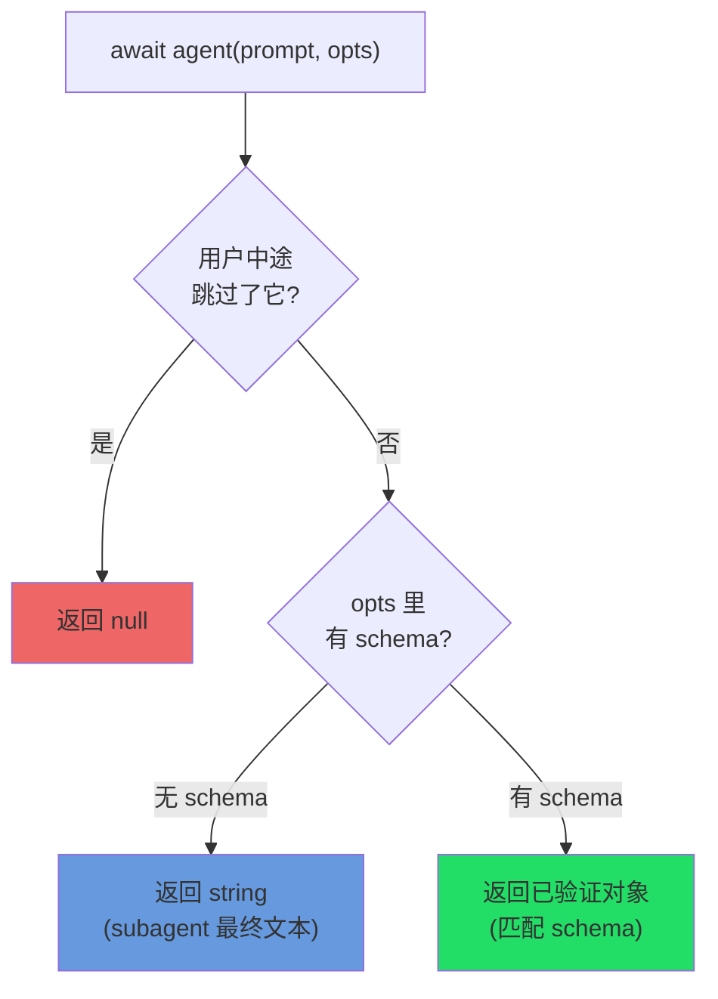
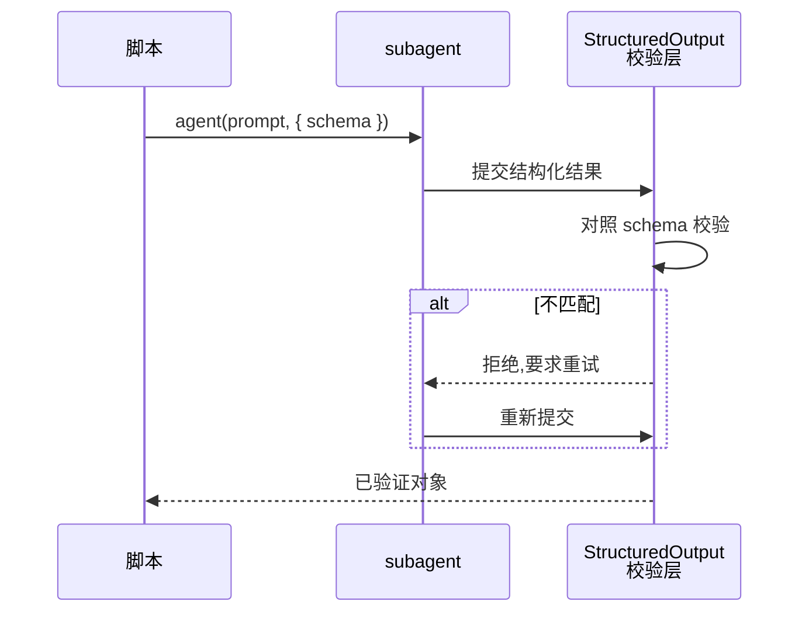
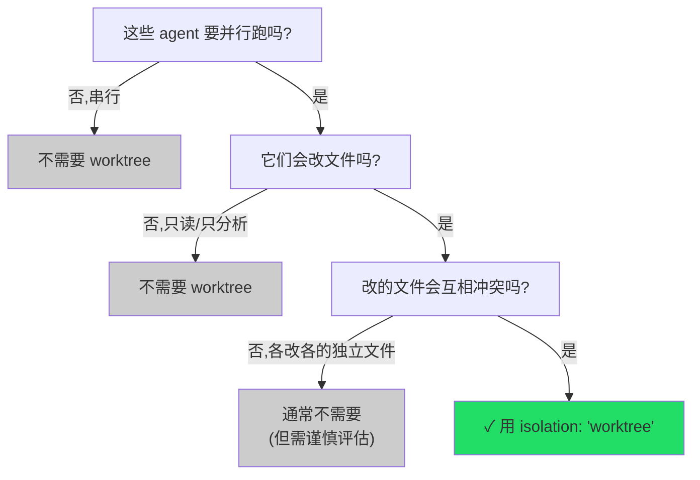
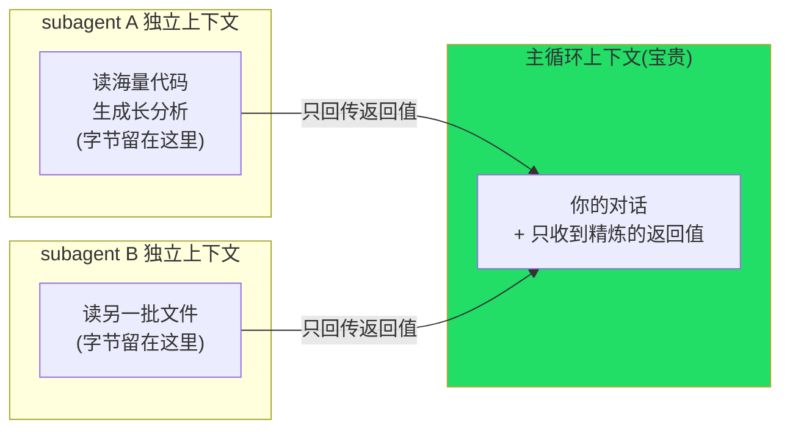

# 第 06 章 · agent() 完全指南

> **纬者,织之横丝也;穿经而行,成文成章。**
>
> 经线张好了,真正让一匹布「长出花纹」的,是那根来回穿梭的纬线。在 Workflow 里,这根纬线就是 `agent()`——它派发一个 subagent 去干一件具体的活,等它回来,把产物交到你手上。
>
> 上一章我们把 `meta` 与 `phase()` 这套结构骨架拆到了见底。这一章,我们把目光全部投向 `agent(prompt, opts)`:它的返回值到底是什么(文本?对象?还是 `null`?)、它的每一个选项(`label`、`schema`、`phase`、`model`、`isolation`、`agentType`)分别解决什么问题、为什么它派出去的 subagent 能**保护你主循环的上下文**。
>
> 这是全书使用频率最高的一个函数。把它吃透,后面所有实战配方都只是它的不同编排。

---

## 6.1 签名与全貌:一句话,两个参数

据 `_grounding.md` B 节对照官方类型定义,`agent()` 的签名是:

```javascript
agent(prompt: string, opts?: object): Promise<any>
```

- 第一个参数 `prompt`:一段字符串,告诉 subagent「要做什么」。
- 第二个参数 `opts`:可选的选项对象,调节这个 agent 的行为。
- 返回:一个 `Promise`,你 `await` 它,拿到 subagent 的产物。

`opts` 的全部字段,先列一张总表,本章逐一展开:

| 选项 | 类型 | 一句话作用 | 本章小节 |
|---|---|---|---|
| `label` | string | 进度树里的显示名(不传则自动编号) | 6.3 |
| `schema` | JSON Schema | 强制结构化输出,返回**已验证对象** | 6.4 |
| `phase` | string | 显式归入某进度组(并发场景必备) | 6.5 |
| `model` | string | 覆盖该 agent 的模型(省略则继承主循环) | 6.6 |
| `isolation` | `'worktree'` | 在独立 git worktree 中运行(**昂贵**) | 6.7 |
| `agentType` | string | 用自定义 subagent 类型(如 `'Explore'`) | 6.8 |

一个最小的、什么选项都不带的调用,长这样:

```javascript
const text = await agent('用一句话总结什么是确定性编排')
```

它派一个 subagent,跑完,返回**一段文本**。这是 `agent()` 的最朴素形态。接下来我们先把「它返回什么」这件最关键的事讲透——因为返回语义决定了你后续怎么写代码。

---

## 6.2 返回语义:文本、对象,还是 null?

`agent()` 的返回值有**三种**可能,取决于你怎么调它、用户怎么响应。搞混这三种,后续的 `.filter()`、解构、`JSON.parse` 全会出错。据 `_grounding.md` B 节,规则如下:



### 6.2.1 无 schema → 返回文本(string)

不传 `schema` 时,`agent()` 返回 subagent 的**最终文本**——一个字符串。

```javascript
const summary = await agent('用一句话概括这个函数的作用:\n' + codeSnippet)
// summary 是一个 string,例如:"该函数对输入数组去重后按字典序排序并返回。"
log(summary)
```

这适合「我只要一段自然语言结果」的场景:总结、解释、起草一段文字。你拿到的就是 subagent 写的最后一段话。

### 6.2.2 有 schema → 返回已验证对象

传入 `schema`(一个 JSON Schema),`agent()` 返回一个**已经过校验的对象**,严格匹配你声明的结构。这是第 01 章 `hello-workflow` 的真实例子(Run ID `wf_dacbd480-d5d`):

```javascript
const r = await agent(
  'Return a one-sentence confirmation message, the integer value of 2+2, ' +
  'and a boolean confirming you ran as a workflow subagent.',
  {
    label: 'smoke',
    schema: {
      type: 'object',
      properties: {
        message: { type: 'string' },
        sum: { type: 'number' },
        runtimeConfirmed: { type: 'boolean' },
      },
      required: ['message', 'sum', 'runtimeConfirmed'],
    },
  }
)
```

**真实返回值**:

```json
{
  "message": "The Claude Code Workflow runtime smoke test executed successfully as a workflow subagent.",
  "sum": 4,
  "runtimeConfirmed": true
}
```

注意 `sum` 是数字 `4`,**不是字符串 `"4"`**——因为 schema 声明了 `type: 'number'`,校验层确保了类型。你可以直接 `r.sum + 1` 做算术,不必解析、不必容错。这套机制(以及它在工具调用层如何强制重试)是第 07 章的主题,这里只需记住:**有 schema → 你拿到的是一个能直接解构、直接计算的干净对象。**

### 6.2.3 用户跳过 → 返回 null

第三种情况最容易被忽略:**用户在执行中途跳过了这个 agent**(例如在交互里选择略过某一步),此时 `agent()` 返回 `null`。

据 `_grounding.md`:「用户中途跳过该 agent → 返回 `null`(用 `.filter(Boolean)` 过滤)」。

这就是为什么本书所有 `parallel()` / `pipeline()` 的真实示例,在用结果前几乎都跟着一个 `.filter(Boolean)`:

```javascript
const results = await parallel(/* ... */)
return results.filter(Boolean)   // 滤掉被跳过的 null
```

`.filter(Boolean)` 是一个惯用法:`Boolean` 作为过滤函数,会剔除数组里所有「假值」(`null`、`undefined`、`0`、`''`、`false`)。在这里它的作用就是**把被跳过的 `null` 项清理掉**,只留下真正有结果的项。

<div class="callout warn">

**不 `.filter(Boolean)` 直接用,会被 `null` 咬到。** 如果你 `results.map(r => r.findings)`,而其中某个 `r` 是 `null`,就会抛 `Cannot read properties of null`。养成习惯:**凡是 `parallel` / `pipeline` 的结果,消费前先 `.filter(Boolean)`。** 单个 `await agent(...)` 也一样——如果它可能被跳过,用前先判一下 `if (r) { ... }`。

</div>

### 6.2.4 三种返回值速查

| 你怎么调 | 用户响应 | 返回值 | 怎么用 |
|---|---|---|---|
| 无 `schema` | 正常 | `string` | 当文本用,或再喂给下一个 agent |
| 有 `schema` | 正常 | 已验证对象 | 直接解构/计算,无需解析 |
| 任意 | 跳过 | `null` | `.filter(Boolean)` 或 `if (r)` 兜住 |

---

## 6.3 `label`:进度树里的名字

`label` 是最简单的选项:它覆盖这个 agent 在 `/workflows` 进度树里的**显示名**。不传,运行时给它自动编号(如 `agent #3`);传了,树上就显示你给的标签。

```javascript
await agent('审查 auth.ts 的权限校验逻辑', { label: 'review:auth' })
```

它纯粹是**给人看的**,不影响任何执行行为。但在一个扇出几十个 agent 的工作流里,一个好 `label` 是「看懂进度树」与「对着一堆 `agent #1…#40` 干瞪眼」的区别。

看真实运行 `parallel-demo`(Run ID `wf_52957913-6d2`,见 `assets/transcripts/primitives.md`)里 label 的用法——它把维度名嵌进 label,让三个并发 agent 在树上一目了然:

```javascript
const dims = ['naming', 'error-handling', 'comments']
const results = await parallel(
  dims.map((d, i) => () =>
    agent(`Name one common ${d} code smell in exactly one sentence.`, {
      label: `smell:${d}`,        // ← smell:naming / smell:error-handling / smell:comments
      schema: { /* ... */ },
    })
  )
)
```

<div class="callout tip">

**label 的实用模式:`类型:实例`。** 像 `review:auth.ts`、`smell:naming`、`verify:race-condition` 这样用「前缀 + 冒号 + 具体对象」命名,进度树会自然按前缀聚成视觉上的组,扫一眼就知道「哪些是 review、哪些是 verify、各自进行到哪」。`assets/transcripts/primitives.md` 的三个真实运行(`smoke` / `smell:*` / `find:* / verify:*`)都用了这个模式。

</div>

`label`(显示名)与上一章 `phase`(归到哪个分组)是两件正交的事:`label` 决定**叶子上写什么字**,`phase` 决定**叶子挂在哪根树枝上**。下一节就讲 `phase`。

---

## 6.4 `schema`:把 agent 变成「结构化数据源」

`schema` 是 `agent()` 最有分量的选项,也是 Workflow 区别于「手动开子任务」的核心能力之一。我们在 6.2.2 已经见过它的返回效果,这里讲清它的**作用机制**与**何时该用**。

### 6.4.1 它做了什么:在工具调用层强制校验

据 `_grounding.md` B 节:

> 有 `schema`(JSON Schema)→ 强制 subagent 调 `StructuredOutput` 工具,**在工具调用层校验**,返回**已验证对象**;不匹配则模型重试。

拆开这句话:

1. 你传一个 JSON Schema 给 `agent()`。
2. 运行时**强制**这个 subagent 通过一个内部的 `StructuredOutput` 工具来交付结果(而不是写一段自由文本)。
3. subagent 提交的结构,在**工具调用层**被校验是否匹配 schema。
4. **不匹配?模型被要求重试**,直到合规为止。
5. 你 `await` 拿到的,是一个**保证匹配 schema** 的对象。



这意味着:**你不写任何解析代码、不写任何容错分支,就能从一个语言模型那里拿到类型安全的结构化数据。** 没有 schema 的世界里,你得让模型「输出 JSON」,然后自己 `JSON.parse`、自己 `try/catch`、自己处理「模型多说了一句废话导致 JSON 解析失败」——schema 把这一切都收进了运行时。

### 6.4.2 最小示例

```javascript
const result = await agent('分析这段代码的圈复杂度,给出数值和一句话评价:\n' + code, {
  label: 'complexity',
  schema: {
    type: 'object',
    properties: {
      score: { type: 'number' },                    // 圈复杂度数值
      verdict: { type: 'string' },                   // 一句话评价
      tooComplex: { type: 'boolean' },               // 是否超阈值
    },
    required: ['score', 'verdict', 'tooComplex'],
  },
})

// 直接当对象用,类型有保证:
if (result.tooComplex) {
  log(`⚠️ 复杂度 ${result.score} 偏高:${result.verdict}`)
}
```

### 6.4.3 数组、嵌套:schema 能描述任意结构

schema 不限于扁平对象。(注:`pipeline-demo`,Run ID `wf_bf086b98-6ec`,的第一阶段其实是**单字段对象** `{ example: string }`,并**没有**用数组——数组只是它能描述的更复杂结构之一。)这里给一个嵌套 + 数组的示例(示意,未实跑):

```javascript
const review = await agent('审查这个文件,列出所有问题,每条含严重度和行号', {
  label: 'review:detailed',
  schema: {
    type: 'object',
    properties: {
      file: { type: 'string' },
      issues: {
        type: 'array',
        items: {
          type: 'object',
          properties: {
            severity: { type: 'string', enum: ['critical', 'warning', 'info'] },
            line: { type: 'number' },
            message: { type: 'string' },
          },
          required: ['severity', 'line', 'message'],
        },
      },
    },
    required: ['file', 'issues'],
  },
})

// review.issues 是一个对象数组,每项保证有 severity/line/message
const criticals = review.issues.filter(i => i.severity === 'critical')
log(`发现 ${criticals.length} 个 critical 问题`)
```

<div class="callout tip">

**何时该传 schema?判据是:你打算用代码「消费」这个产物吗?** 如果产物要被后续代码读取字段、做条件分支、喂给下一个 agent 的 prompt——传 schema,拿干净对象。如果你只要一段给人看的自然语言(最终报告的散文、一段解释)——不传,拿文本即可。一个实战工作流里,中间环节几乎全程带 schema(因为要程序化串联),只有最后「写给人看」的那一步可能返回纯文本。

</div>

`schema` 还能与 `agentType`(6.8)**组合**——让一个自定义类型的 subagent 也返回结构化数据。这点在 6.8 节细说。schema 的完整威力(`enum`、嵌套校验、重试机制的边界)是第 07 章的专题。

---

## 6.5 `phase`:并发场景下的显式归组

`phase` 选项我们在第 05 章 5.5.1 节已经深入讲过,这里从 `agent()` 的视角再钉一遍,因为它是**写并发工作流时最容易漏、漏了进度树就乱**的选项。

据 `_grounding.md`:`opts.phase`「显式归入某进度组(在 pipeline/parallel 内部尤其重要,避免竞争全局 `phase()`)」。

**核心规则,一句话:**

- **顺序代码**里,用全局 `phase('X')` 切换当前阶段即可,后续 agent 自动归入。
- **`parallel` / `pipeline`** 里,多个 agent 并发飞行,全局游标会被竞争,所以必须给每个 `agent()` 传 `opts.phase: 'X'`,把归组信息**钉在 agent 自己身上**。

这正是真实运行 `pipeline-demo` 的写法(Run ID `wf_bf086b98-6ec`):

```javascript
const out = await pipeline(
  items,
  (kind) =>
    agent(`Give a one-line code example of a ${kind} bug.`, {
      label: `find:${kind}`,
      phase: 'Find',                 // ← 钉在 Find,不靠全局游标
      schema: { /* ... */ },
    }),
  (found, kind) =>
    agent(`Is this genuinely a ${kind} bug? ...`, {
      label: `verify:${kind}`,
      phase: 'Verify',               // ← 钉在 Verify
      schema: { /* ... */ },
    }).then((v) => ({ kind, ...found, ...v }))
)
```

`phase: 'Find'` / `'Verify'` 里的字符串,同样要与 `meta.phases[].title` **精确匹配**(大小写、空格一字不差)——这是第 05 章 5.5 节反复强调的机制。

<div class="callout warn">

**`opts.phase` 与全局 `phase()` 的关系不是「二选一」,而是「并发里优先用 `opts.phase`」。** 你完全可以在 `pipeline` 之前写一句 `phase('Find')` 作为兜底,但真正决定每个并发 agent 归组的,是它自己的 `opts.phase`。当两者都在场,**附着在 agent 上的 `opts.phase` 才是可靠的那一个**,因为它不受并发交错影响。

</div>

---

## 6.6 `model`:模型继承与单点覆盖

`model` 选项控制**这一个 agent** 用哪个模型。它是第 05 章 5.6 节那套模型解析里**最细粒度、已被确认**的一层:它覆盖「继承主循环」这个默认,也覆盖该 agent 所在阶段的 `meta.phases[].model`。(顶层 `meta.model` 与各层的自动解析关系事实源未核实,见 5.6;本节只讲已确认的 `opts.model`。)

### 6.6.1 默认:继承主循环模型

据 `_grounding.md`:`opts.model`「省略则继承主循环模型;简单任务可用 `'haiku'`」。

不写 `model`,这个 agent 就用**主循环当前的模型**。本书实测环境主循环是 Opus 4.7,subagent 模型由 `CLAUDE_CODE_SUBAGENT_MODEL=claude-opus-4-7` 指定(见 `_grounding.md` A 节)。前面所有真实运行(`hello` / `parallel` / `pipeline`)都**没有**显式传 `model`,因此它们的 subagent 跑在继承来的 Opus 模型上。

### 6.6.2 用 `'haiku'` 给简单任务降本

当一个 agent 的活儿很简单——分类、抽取、格式转换、判个布尔——用强模型是浪费。把它降到 `'haiku'`:

```javascript
// 一个只需「判断输入是不是一个有效的 URL」的轻量任务
const check = await agent(`这是不是一个合法的 HTTP(S) URL?只回答 true 或 false:${input}`, {
  label: 'url-check',
  model: 'haiku',                 // ← 简单判断,用便宜模型
  schema: {
    type: 'object',
    properties: { valid: { type: 'boolean' } },
    required: ['valid'],
  },
})
```

### 6.6.3 为什么 model 选择直接关系到「钱」

`_grounding.md` C 节给了一条关键经验法则:

> token ≈ agent 数 × 每 agent 上下文(约 2.5–3 万/agent);墙钟取决于关键路径,并发把 N 个压到「最慢的一个」。

这条法则用三个真实运行印证(同一会话,见 `assets/transcripts/primitives.md`):

| Workflow | agent_count | total_tokens | 每 agent 约 |
|---|---|---|---|
| hello(单 agent) | 1 | 26,338 | ~26.3k |
| parallel(3 并发) | 3 | 78,844 | ~26.3k(≈3×) |
| pipeline(3 项×2 阶段) | 6 | 158,982 | ~26.5k(≈6×) |

`78844 ≈ 3 × 26338`、`158982 ≈ 6 × 26500`——**总 token 几乎线性正比于 agent 数**,每个 agent 稳定在约 2.5–3 万 token。这背后的原因(每个 agent 是独立上下文)马上在 6.9 节讲。

这条法则的直接推论:**降本最有效的杠杆,是把「agent 数最多」的那个阶段换成便宜模型。** 一个工作流若在某个广度阶段扇出 50 个 agent,把它们从 opus 换成 haiku,省下的是「50 × 单价差」——比优化任何别处都立竿见影。这正是第 05 章 5.6 节「广度阶段 haiku、深度阶段 opus」模式的经济学依据。

<div class="callout info">

**`model` 写在 `agent()` 上 vs 写在 `meta.phases[]` 上。** 二者最终都影响某个 agent 用什么模型,但语义不同:`meta.phases[].model` 是**声明性**的(写在经线上,表达「这一阶段计划用某模型」,也方便读脚本的人看清成本结构);`agent({ model })` 是**命令性**的(在纬线上,精确决定这一个 agent)。实战中常见的组合是:在 `meta.phases` 上标注阶段意图,同时在该阶段的每个 `agent()` 上落实 `model`——一处「说计划」,一处「下命令」,互相印证。

</div>

---

## 6.7 `isolation: 'worktree'`:昂贵但有时必需的隔离

`isolation: 'worktree'` 让这个 agent 在一个**独立的 git worktree** 里运行。它是 `agent()` 选项里**最重、最该谨慎使用**的一个。

### 6.7.1 它解决什么问题

设想一个工作流:你想让 5 个 agent **并行**地各自修改代码(比如分头修 5 个不同的 bug,每个都要改文件)。如果它们都在**同一个工作目录**里写文件,就会互相踩踏——A 改了 `utils.js`,B 也在改 `utils.js`,git 状态、文件内容彼此污染,结果不可预测。

`isolation: 'worktree'` 给每个这样的 agent 一个**自己的 git worktree**(同一仓库、独立的工作目录),它在里头改文件,与别的 agent 互不干扰。据 `_grounding.md`:

> `opts.isolation: 'worktree'` 在独立 git worktree 运行(**昂贵**,仅当并行改文件会冲突时用,无改动自动清理)。

```javascript
// 示意,未实跑:5 个 agent 并行改不同的 bug,各自在独立 worktree 里写文件
const fixes = await parallel(
  bugs.map((bug, i) => () =>
    agent(`修复这个 bug 并直接修改相关文件:${bug.description}`, {
      label: `fix:${bug.id}`,
      isolation: 'worktree',        // ← 各自独立 worktree,并行写文件不冲突
    })
  )
)
```

### 6.7.2 为什么说它「昂贵」

「昂贵」不是修辞。创建一个 git worktree 涉及真实的磁盘操作与 git 开销。结合本书写作上下文给出的量级:**每个 worktree 约 200–500ms 起步,外加每个 agent 的磁盘占用**。当你给 50 个 agent 都加上 `isolation: 'worktree'`,这笔开销会累积成可观的延迟与磁盘消耗。

所以使用判据非常明确——**仅当「并行 + 改文件 + 会冲突」三个条件同时成立时才用**:



### 6.7.3 自动清理

一个贴心的细节:`_grounding.md` 写明「**无改动自动清理**」。也就是说,如果某个加了 `isolation: 'worktree'` 的 agent 跑完后**没有产生任何文件改动**,运行时会自动把那个临时 worktree 清掉,不留垃圾。这降低了「加了 worktree 却发现没必要」的善后成本——但它**不能**成为「随手加 worktree」的理由,因为创建本身的开销已经付出了。

<div class="callout warn">

**默认不要加 `isolation: 'worktree'`。** 绝大多数 agent 是**只读分析**(审查、研究、总结、判断)——它们根本不写文件,自然不存在冲突,加 worktree 纯属浪费。即便是写文件,只要各 agent 写的是**互不相干的独立文件**,通常也无需隔离。这个选项是为「并行修改、且会撞车」这一**特定**场景准备的逃生舱,不是默认装备。Worktree 隔离的完整模式与权衡,是第 19 章的专题。

</div>

---

## 6.8 `agentType`:借用自定义 subagent 类型

`agentType` 让这个 agent 不用默认的通用 subagent,而是采用一个**具名的自定义类型**。据 `_grounding.md`:

> `opts.agentType` 用自定义 subagent 类型(如 `'Explore'`、`'code-reviewer'`,与 schema 可组合)。

### 6.8.1 它解决什么问题

Claude Code 生态里存在一些**预配置的 subagent 类型**——它们带着特定的系统提示、工具集或行为取向。比如:

- `'Explore'`:擅长在代码库里做开放式探索/检索。
- `'code-reviewer'`:面向代码审查,带审查取向的系统提示。

当你希望某个 agent **以某种专门角色行事**,而不是从通用 subagent 起步,就用 `agentType` 指定:

```javascript
// 用 Explore 类型做代码库探索
const findings = await agent('在代码库里找出所有处理用户鉴权的入口点', {
  label: 'explore:auth',
  agentType: 'Explore',           // ← 借用 Explore 类型的探索能力
})
```

### 6.8.2 与 `schema` 组合

`agentType` 与 `schema` **可以同时用**——既指定 agent 的「角色类型」,又约束它的「输出结构」:

```javascript
// 示意,未实跑:用 code-reviewer 类型审查,并强制结构化输出
const review = await agent('审查这个 diff,报告问题', {
  label: 'review:typed',
  agentType: 'code-reviewer',     // ← 用审查者类型
  schema: {                       // ← 同时约束输出结构
    type: 'object',
    properties: {
      issues: { type: 'array', items: { type: 'string' } },
      verdict: { type: 'string', enum: ['approve', 'request-changes'] },
    },
    required: ['issues', 'verdict'],
  },
})
// review 既由 code-reviewer 角色产出,又保证匹配 schema
```

这种组合很强大:`agentType` 决定「**谁**来做、以什么取向做」,`schema` 决定「产物**长什么样**」。两者正交,可自由搭配。

<div class="callout info">

**`agentType` 的可用值取决于你的环境。** `'Explore'`、`'code-reviewer'` 是示例;实际能用哪些类型,取决于 Claude Code 内置的以及你在项目里(如 `.claude/agents/`)定义的自定义 subagent。不传 `agentType` 时,用的是默认通用 subagent——本章及前面所有真实运行示例都属于这种默认情况。某个具体 `agentType` 在你的环境中是否存在、其确切行为——以你本机配置为准(**待核实**:本书实测的三个真实运行均未指定 `agentType`)。

</div>

---

## 6.9 上下文隔离:agent() 为什么能「保护主循环」

讲完所有选项,回到一个贯穿全书的核心问题:**为什么用 `agent()` 扇出工作,能保护你主循环的上下文?**

答案藏在一句 `_grounding.md` 的事实里:

> subagent 被告知「最终文本即返回值」(不是给人看的话),故返回原始数据。

以及那条经验法则给出的**强烈暗示**:既然真实数据一致呈现 `total_tokens ≈ agent_count × 每 agent 上下文`(C 节经验法则),**最自然的解释就是「每个 agent 跑在各自独立的上下文里」**——本节据此推论展开。(注:这是从 token 经验法则反推的合理解释,而非已核实的 API 内部机制;工具定义层面只确认了 subagent「最终文本即返回值」与各自的产出计入总 token。)

### 6.9.1 独立上下文意味着什么

把它和主循环对比着看:

- 你的**主循环**有一个会随对话不断增长的上下文窗口。每读一个大文件、每跑一条产出长输出的命令,这些字节都**永久驻留**在主循环上下文里,挤占后续推理空间。
- 而每个 `agent()` 派出去的 subagent,跑在**自己独立的上下文**里。它读了 10 万行代码、生成了一大段分析——这些字节全留在**它自己的**上下文里。它跑完后,**只有它的返回值**(那个文本或已验证对象)回到你的主循环。



这就是 `agent()` 的「上下文保护」本质:**把会污染主循环的「过程字节」(读到的原始资料、中间推理)隔离在 subagent 的一次性上下文里,只让「结果字节」(精炼的返回值)回流。** 一个要读 20 个文件才能回答的问题,你不必把 20 个文件读进主循环——派一个 agent 去读、去想,它只把答案带回来。

### 6.9.2 「最终文本即返回值」的设计

普通的子任务会返回一段**写给人看**的话(「好的,我已经帮你看完了,这个文件主要做……」)。但 Workflow 的 subagent 被明确告知:**你的最终输出就是程序的返回值,不是给人的寒暄。** 据 `_grounding.md`:

> subagent 被告知「最终文本即返回值」(不是给人看的话),故返回原始数据。
> 结构化输出在工具调用层校验,模型不合规会重试。

所以:

- **不带 schema** 时,subagent 把「原始数据」作为最终文本返回(而非客套话)——你拿到的字符串就是可用的结果本身。
- **带 schema** 时,它走 `StructuredOutput` 工具,返回严格匹配的对象。

这个设计让 `agent()` 的返回值**适合被程序消费**,而不是被人阅读——这是它能成为「确定性编排的积木」的前提。

<div class="callout tip">

**实践推论:让 agent 干「重读、重想」的脏活。** 凡是「需要吞掉大量上下文才能得出一个小结论」的任务——通读一个大模块、扫描一批日志、研究一份长文档——都适合丢给 `agent()`。它在独立上下文里消化原料,只把结论带回主循环。这正是 `parallel` / `pipeline` 大规模扇出时,主循环上下文却几乎不增长的原因——也是 Workflow 相比「在主循环里硬读」的根本优势。

</div>

---

## 6.10 选项组合:把它们用在一起

现实中的 `agent()` 调用往往**同时**用多个选项。下面这个示例(示意,未实跑)把本章选项尽量组合,并标出每个的意图:

```javascript
const review = await agent(
  `审查这个分片的代码质量,列出问题:${shard}`,
  {
    label: `review:${shard}`,        // 6.3 进度树显示名
    phase: 'Review',                 // 6.5 并发里显式归组(精确匹配 meta.phases)
    model: 'opus',                   // 6.6 这步要质量,用强模型(单次调用覆盖)
    agentType: 'code-reviewer',      // 6.8 用审查者类型
    schema: {                        // 6.4 强制结构化输出,返回已验证对象
      type: 'object',
      properties: {
        issues: {
          type: 'array',
          items: {
            type: 'object',
            properties: {
              severity: { type: 'string', enum: ['critical', 'warning', 'info'] },
              message: { type: 'string' },
            },
            required: ['severity', 'message'],
          },
        },
      },
      required: ['issues'],
    },
    // 注意:这里【没有】isolation——审查是只读分析,不写文件,无需 worktree(6.7)
  }
)

// 因为有 schema,review 是已验证对象,可直接消费:
const blockers = (review?.issues ?? []).filter(i => i.severity === 'critical')
```

逐项回顾这次组合的决策:

| 选项 | 这里的值 | 为什么 |
|---|---|---|
| `label` | `review:${shard}` | 用「类型:实例」模式,进度树可读(6.3) |
| `phase` | `'Review'` | 这是并发审查,必须显式归组(6.5) |
| `model` | `'opus'` | 审查要质量,用强模型(6.6) |
| `agentType` | `'code-reviewer'` | 借用审查取向的类型(6.8) |
| `schema` | 嵌套对象+enum | 产物要被代码筛选 critical,需结构化(6.4) |
| `isolation` | **不设** | 只读分析,不写文件,无冲突风险(6.7) |

这张表本身就是一份「选 agent 选项」的决策示范:**每个选项都该有一个明确的「为什么用 / 为什么不用」,而不是凭感觉堆上去。** 尤其 `isolation`——它的「不设」和别的「设了」一样是一个有意识的决定。

---

## 6.11 本章小结

- **`agent(prompt, opts)`** 派发一个 subagent 执行 `prompt`,`await` 返回其产物;它是全书使用频率最高的函数(6.1)。
- **三种返回语义**:无 `schema` → 文本 `string`;有 `schema` → **已验证对象**(可直接解构/计算);用户跳过 → `null`(故 `parallel`/`pipeline` 结果消费前要 `.filter(Boolean)`)(6.2)。
- **`label`** 是进度树显示名,用「类型:实例」模式(如 `review:auth`)最易读;不影响执行(6.3)。
- **`schema`** 强制 subagent 走 `StructuredOutput` 工具、在工具调用层校验、不匹配则重试,让你**零解析、零容错**拿到结构化数据;判据是「产物要被代码消费吗」(6.4)。
- **`phase`** 显式归入进度组;顺序代码用全局 `phase()`,**并发(`parallel`/`pipeline`)里必须用 `opts.phase`** 避免竞争全局游标;字符串须与 `meta.phases[].title` 精确匹配(6.5)。
- **`model`** 省略则继承主循环(本书实测会话为 Opus 4.7);简单任务用 `'haiku'` 降本。`opts.model` 与 `meta.phases[].model` 是已确认的两层,顶层 `meta.model` 解析语义待核实(见 5.6)。由真实数据印证 **token ≈ agent 数 × 每 agent 上下文(~2.5–3 万)**,故把扇出最多的阶段换便宜模型是最有效的降本杠杆(6.6)。
- **`isolation: 'worktree'`** 给 agent 独立 git worktree,**昂贵**(每个约 200–500ms + 磁盘),**仅当「并行 + 改文件 + 会冲突」三条件同时成立**才用,无改动自动清理(6.7)。
- **`agentType`** 借用自定义 subagent 类型(如 `'Explore'`、`'code-reviewer'`),决定 agent 的角色取向,**可与 `schema` 组合**(6.8)。
- **上下文隔离**是 `agent()` 的灵魂:每个 subagent 独立上下文,只把**返回值**回流主循环,把「过程字节」隔离在一次性上下文里——这正是它**保护主循环上下文**、能大规模扇出的根本原因(6.9)。

纬线的单根丝线——`agent()`——已经看到了头。但一根丝织不成花纹。下一章,我们深入它最有分量的那个选项 `schema`,看「结构化输出」如何把一群各说各话的 subagent,约束成一条能被代码可靠消费的数据流水线。

> 继续阅读:[第 07 章 · 结构化输出与 Schema](#/zh/p2-07)
